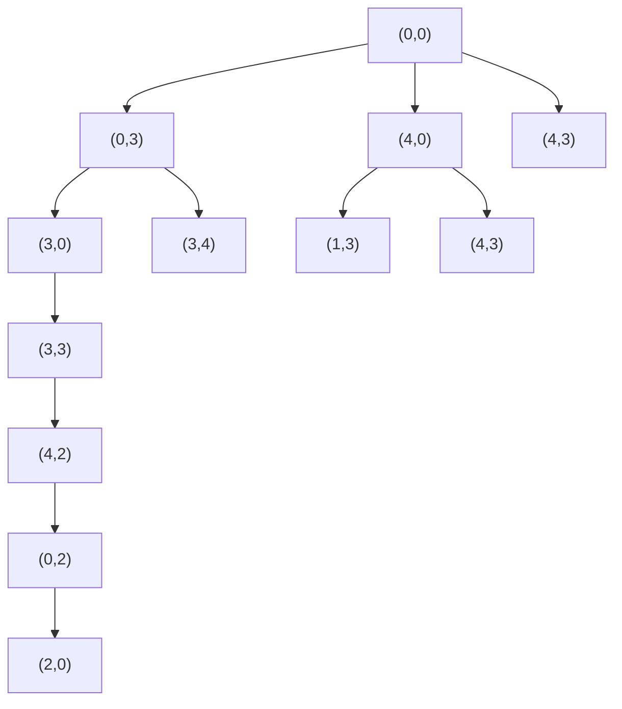

# Chapter 2: Problem Solving

## Exam Frequency Table

| Topic | Typical Marks | Frequency |
|---|---|---|
| Constraint Satisfaction Problem: definition + crypt-arithmetic puzzle | 6–9 (combined) | Very High (31/41) |
| Well-defined problem (definition + characteristics) | 2–8 | Very High |
| Problem solving steps / state space / successor function / goal test / path cost | 2–3 | High |
| Water-jug problem (formulation + solve) | 4–8 | Moderate–High |
| Production systems (definition, components, control strategy) | 2–6 | High |
| Problem type classification (ignorable/recoverable/irrecoverable/decomposable; single-state/multi-state/contingency/exploration) | Usually embedded in other answers | Moderate |
| Game playing as a search problem | 2–7 | Low |
| Farmer-Wolf-Goat-Cabbage puzzle | 8 | Low-moderate |
| Tic-tac-toe as a state space | 7 | Low |

**Reading tip:** Prioritize **CSP + crypt-arithmetic** (this single combination alone is worth roughly 8–9 marks in almost every past paper), **well-defined problems**, and the **water-jug formulation**, together these cover the overwhelming majority of marks historically allocated to this chapter.

---

## 2.1 Problem Solving and the State Space

### Steps of Problem Solving

*(Frequently asked directly: "Discuss the steps of problem solving.")*

Problem solving,
- particularly in AI,
- can be characterized as a systematic search
- through a range of possible actions
- in order to reach some predefined goal or solution.

It is carried out by a problem-solving (goal-based) agent through four steps:

1. **Goal Formulation**:
    - deciding which world states count as success (the successful world states).
2. **Problem Formulation**:
    - deciding the possible sequence of actions and states relevant to reaching the goal.
3. **Searching**:
    - determining the possible sequences of actions leading to states of known value, then choosing the best such sequence. (Full search techniques are covered in Chapter 3.)
4. **Execution**:
    - the solution returned by the search algorithm is carried out (executed) by the agent.

*(Order matters: goal formulation always precedes problem formulation, and the entire search happens before any action is executed.)*

### A Simple Problem-Solving Agent

A problem-solving agent works with these assumptions:

- **World states**:
    - e.g., possible configurations of the chessboard in a chess game.
- **Actions**:
    - transitions between states.
- **Goal formulation**:
    - a set of desirable states.
- **Problem formulation**:
    - the sequence of required actions to move from the current state to a goal state.

Intelligent (goal-based) agents act so that the environment goes through a sequence of states that maximizes the agent's performance measure.


### State Space Representation

*(Frequently asked directly: "What is state space?")*

- A **state space** is a
    - set of **nodes**,
    - each representing one state of the problem,
    - and **arcs** between nodes representing the legal moves (actions)
    - that transform one state into another,
    - along with a designated **initial state** and **goal state**.
- When a problem is defined together with all its possible states, this is called a **complete state space**.
- A state space
    - can be represented as a **directed graph**,
    - or as a **tree** when no state repeats along a path. 
- A tree is a graph in which any two vertices are connected by exactly one path:
    - equivalently, any connected graph with no cycles.


### Problem Space

- The **problem space** refers to
    - the set of all possible states and actions
    - that can be taken to
    - reach a particular goal or solve a given problem.
- Example: the highways and cities of Nepal, when the problem is "get from Kathmandu to Dharan."
- A problem space is
    - represented by a directed graph (or tree),
    - where nodes represent search states and
    - paths represent the operators applied to change the state.

### Why Rules Must Be General, Not Enumerated by Hand

- If 
    - the specific rules of a problem are enumerated
    - case by case rather than stated generally,
    - the rule set can become enormous.
- The classic illustration is chess:
    - a knight at position (4,4) can move to
    - (2,3), (2,5), (3,2), (3,6), (5,2), (5,6), (6,3), and (6,5).
    - Writing this out as a separate rule for *every* square on the board
    - produces a huge rule set and
    - a full chess game tree has on the order of 10¹²⁰ possible paths.
- The fix is
    - to describe the move as a general **pattern**
    - rather than a list of specific cases:
- e.g., "current position $\pm$ (2 vertical + 1 horizontal) or (1 vertical + 2 horizontal)"
    - so that one rule replaces what would otherwise be dozens of hand-written cases.
- This is the underlying reason a **production system** is built
    - from general condition-action patterns rather than an exhaustive table of specific cases.

---

## 2.2 Problem Formulation and Well-Defined Problems

*(Frequently asked directly: "What makes a problem well defined?")*

A **well-defined problem** is one in which the initial state (or starting position), the allowable operations, and the goal state are all clearly defined. Formally, it is composed of:

- **Initial state**: the state from which the agent starts.
- **Actions / successor function**: a description of the possible actions available to the agent (given a state, returns the set of ⟨action, resulting state⟩ pairs reachable in one step).
- **Goal test**: determines whether a given state is the goal state or not.
- **Path cost**: the sum of the cost of each step along the path from the initial state to the given state.

A **solution** is a sequence of actions from the initial state to a goal state, having the lowest path cost among valid solutions (an **optimal solution**).

### Characteristics of a Well-Defined Problem

*(Explicitly asked, e.g., "List the characteristics of a well-defined problem.")*

- **Unambiguous**: there is only one reasonable reading of what is being asked.
- **Complete**: everything needed to solve it is stated; nothing has to be assumed.
- **Verifiable**: the goal test can mechanically decide whether a given state is a solution.
- **Finite and discrete** state space, so that states can in principle be enumerated.
- **Deterministic operators** with known preconditions and effects.
- **Solvable in principle**: at least one action sequence exists that reaches the goal.

### Well-Defined vs Ill-Defined Problems

| Aspect | Well-Defined | Ill-Defined |
|---|---|---|
| Goal | Stated exactly | Vague or subjective |
| States | Enumerable | Open-ended |
| Operators | Fixed and known | Not fully known |
| Goal test | Mechanical | Needs human judgement |
| Example | Water jug, 8-puzzle, chess, crypt-arithmetic | "Write a good poem," "design a beautiful building," medical diagnosis from an unclear history |

*(Frequently asked: "Is [some jug/river puzzle] a well-defined problem? Justify.")* When a question gives a puzzle (e.g., two unmarked jugs and a pump) and asks whether it is well-defined, the answer is generally **yes**, as long as the initial state, operators, and goal test are all explicitly given in the question, every clause above is satisfied, and this should be stated explicitly before proceeding to solve the puzzle itself.

---

## 2.3 Problem Types and Classification

### By Observability and Determinism

- **Single-state problem**:
    - deterministic, accessible (fully observable).
    - The agent knows everything about the current state of the world. *Example: playing chess with the board in full view.*
- **Multiple-state problem**: deterministic, inaccessible. The agent doesn't know its exact state and could be in any of several possible states; it may have no sensors at all. *Example: walking in a dark room.*
- **Contingency problem**: non-deterministic, inaccessible. The environment is partially observable or actions are uncertain, so the agent must use sensors during execution and cannot plan the whole path in advance.
- **Exploration problem**: the state space itself is unknown in advance (e.g., a maze). The agent must discover and learn about the environment while taking actions. This is the hardest of the four, since it requires learning as it goes.

### By Whether a Move Can Be Undone

*(Used to justify why some problems, like the water jug, are "easy" while others, like tic-tac-toe, require full look-ahead planning.)*

- **Ignorable**: intermediate actions can simply be ignored; a wrong move costs nothing and can be undone at no real penalty. *Example: the water-jug problem.* Solvable with a simple control strategy; no backtracking machinery is required.
- **Recoverable**: the actions taken can be undone to return to an earlier (or the initial) state. *Example: the 8-puzzle game.* Requires the control strategy to support backtracking.
- **Irrecoverable**: actions cannot be undone to reach a previous state. *Example: tic-tac-toe.* Requires **planning** the consequences of a move must be considered before it is made, since there is no second chance. This is why adversarial games need dedicated search techniques (minimax, alpha-beta: Chapter 3).
- **Decomposable**: the problem can be broken down into smaller, similar sub-problems whose individual solutions combine into the overall solution. *Example: a word puzzle game, symbolic integration.*

---

## 2.4 Production Systems

*(Frequently asked: "Define a production system. What are its essential components? Explain with an example.")*

A **production system** consists of a set of rules, each of the form `LHS → RHS`:
- The **left-hand side (pattern)** determines the applicability of the rule, whether it matches the current state.
- The **right-hand side (action)** describes the operation to be performed if the rule is applied.

The right-hand side is interpreted as an **action recommendation** to be carried out, rather than simply a logical conclusion to be inferred, this is what distinguishes a production rule from a plain logical implication.

### Essential Components of a Production System

A production system consists of:

1. **Knowledge base / working memory**: one or more stores containing whatever information is appropriate for the particular task; this represents the current state of the world and is updated as rules fire.
2. **Set of production rules (rule base)**: the rules themselves, each in the `Ci → Ai` pattern-action form.
3. **Control strategy**: specifies the order in which rules are selected for firing, and provides a way of resolving conflicts that arise when several rules match the current state at once.
4. **Rule applier**: carries out the action of the chosen rule, including resolving conflicts among multiple matching rules.

**The recognize-act cycle:** match the rules against working memory → resolve conflicts among the matching rules → fire the chosen rule and update working memory → repeat until the goal test passes or no rule matches.

### Two Requirements of a Good Control Strategy

*(A frequently and specifically asked pair of one-line points.)*

1. **It must cause motion.** A control strategy that could pick the same rule (or an equivalent state) forever would never make progress away from the initial state.
2. **It must be systematic.** Choosing rules purely at random does cause motion, but it may wander unproductively and revisit the same states endlessly; a systematic strategy avoids this.

### Example: The Vacuum World

| Pattern (LHS) | Action (RHS) |
|---|---|
| [A, clean] | move Right |
| [A, dirty] | Suck |
| [B, clean] | move Left |
| [B, dirty] | Suck |

### Which Problems Suit a Production System

- The state can be written down **compactly**: e.g., the water jug's entire state is just the pair (x, y).
- The legal moves are **few, uniform, and pattern-like**, so a handful of rules covers every case.
- Progress is made by **repeatedly rewriting the state**, not by evaluating a complex formula.
- The goal is a **recognizable pattern**, so the goal test amounts to a simple match.

**Standard examples and what each demonstrates:**
- **Water jug**: 8 rules over the state (x, y). The canonical, most commonly asked example.
- **8-puzzle**: 4 rules (move the blank up/down/left/right); demonstrates a *recoverable* problem needing backtracking.
- **Farmer/wolf/goat/cabbage** and **missionaries and cannibals**: rules with an added *safety precondition*, which is what makes them non-trivial.
- **Tower of Hanoi**: demonstrates a *decomposable* problem.
- **Tic-tac-toe**: demonstrates an *irrecoverable* problem where rules alone are insufficient and search against an opponent is needed.

### Practical Uses of Production Systems

- Expert systems (Chapter 7)
- Autonomous robots
- Cognitive architectures modelling human reasoning, such as ACT (Anderson, 1983) and SOAR (Laird et al., 1987)

---

## 2.5 Constraint Satisfaction Problems (CSP)

*(One of the highest-yield topics in the entire subject, almost always the 1–3 mark preamble immediately before a crypt-arithmetic puzzle.)*

A **constraint satisfaction problem** is a problem that requires its solution to satisfy certain limitations or conditions, known as **constraints** (rules). It is a search procedure that operates in a space of **constraints** rather than a plain space of states: states are defined by the values assigned to variables, and the goal test specifies a set of constraints that those values must obey. Constraints are discovered and propagated as far as possible throughout the system.

Formally, a CSP is defined by the triple:

- **Variables**: the unknowns/decision variables that need to be assigned values: V = [V₁, V₂, V₃, ..., Vₙ]
- **Domains**: the sets of possible values each variable can take: D = [D₁, D₂, D₃, ..., Dₙ]
- **Constraints**: the rules or restrictions defining the relationships allowed between variables: C = [C₁, C₂, C₃, ..., Cₙ]

A **solution** is an assignment of one domain value to every variable such that no constraint is violated.

### Constraint Propagation and Its Termination

Constraint propagation terminates for one of two reasons:

1. **A contradiction is detected**: i.e., no solution is consistent with the constraints currently known.
2. **Propagation has run out of steam**: there are no further changes that can be made on the basis of current knowledge. In this case, either a solution has already been found, or a guess must be made and added as a new (tentative) constraint, with propagation resuming from there; if the guess leads to a contradiction, the system backtracks and tries another value.

### Standard CSP Examples

- **Crypt-arithmetic**: the columns of the addition problem must obey an addition constraint.
- **VLSI layout problems**: fixed circuit connections; minimize area and connection length; components must not overlap; optimize placement of cells and channel routing.
- **Map coloring**: no two adjacent regions may share the same color.
- **Class/department scheduling.**
- **n-queens**: no queen may attack another.

---

## 2.6 Crypt-Arithmetic: Method and Worked Solutions

### The Rules (as stated in every exam paper)

- **Different letters denote different digits**, and identical letters denote the same digit (this is the *AllDifferent* constraint).
- **No leading letter of any word may be 0.**
- Digits are drawn from D = {0, 1, 2, ..., 9}; a puzzle with more than 10 distinct letters therefore has no solution at all.
- Any additional restriction printed in the question overrides these defaults.

### The Five-Step Method

1. Write the sum in columns, with a **carry variable** (C₁, C₂, ...) marked above each column boundary.
2. List **X**, the set of variables (letters).
3. List **D**, the domain of possible digit values.
4. List **C**, the full set of constraints: the leading-letter (non-zero) constraints, the AllDifferent constraint, and one equation per column of the form:
   $$\text{(column sum)} + C_{\text{in}} = 10\,C_{\text{out}} + \text{(result digit)}$$
5. Reason column by column, typically starting from the leftmost/highest-value column, since the leading carry is usually the most constrained value, redrawing the sum with digits filled in after each deduction, until every letter is fixed. Always close with an arithmetic check.

### Key Deductions That Crack Most Puzzles

- **A carry out of the leftmost column can only be 0 or 1**
    - adding two digits plus a carry gives at most 9+9+1 = 19.
- If the answer word is exactly one digit longer than the addend words,
    - that leading digit **must be 1**,
    - since two numbers of the given length cannot sum
    - to reach the next order of magnitude with a leading digit of 2 or more.
- **With three addends, a carry can reach 2** (9+9+9+1 = 28), this situation is comparatively rare.
- **A letter added to itself (2X) ending in the same letter X** happens only
    - when X = 0 (giving 2×0 = 0) or X = 5 (giving 2×5 = 10, ending in 0,
    - so this actually only works for X = 0;
    - if a *different* result letter equals X only when there's a carry of 1, i.e. 2X + 1 ends in X, that requires X = 9).
    - This kind of self-referential column is a strong early clue.
- **Where a variable can be isolated by adding/subtracting two column equations**, unknowns often cancel out, revealing a direct relationship (e.g., 2L = 9C₁ + 10C₂ type relations).

---

### Worked Example 1: TEN + TEN + FORTY = SIXTY

*(This is the only puzzle in the set with three addends, so a carry can reach as high as 2)*

```
    TEN
+   TEN
+ FORTY
-------
  SIXTY
```

**Formulation:**
- X = {T, E, N, F, O, R, Y, S, I, X}:
- this puzzle uses **all 10 letters**,
- so every digit 0–9 is used exactly once. T, F, S ≠ 0.

**Step 1 (units column):**
- N + N + Y = 10C₁ + Y
- 2N = 10C₁ ⟹ **N = 0, C₁ = 0** 
    - since N is a single digit, C₁ can only be 0,
    - giving N = 0;
    - the alternative C₁ = 1, N = 5 is checked and eliminated in Step 2.

**Step 2 (tens column):** 
- E + E + T + C₁ = 10C₂ + T
- 2E + C₁ = 10C₂
- If N = 5 (with C₁ = 1)
    - this would require 2E + 1 = 10C₂, i.e. 2E = 10C₂ − 1,
    - which is odd, impossible.
    - So the **N = 0, C₁ = 0** branch is confirmed,
    - and 2E = 10C₂ gives **E = 5, C₂ = 1** (E = 0 is already taken by N).

So far: N = 0, C₁ = 0, E = 5, C₂ = 1.

**Step 5 (leading column):**
- F + C₄ = S.
- Since F and S must differ,
- this requires **C₄ = 1**, i.e. F and S are consecutive digits (S = F + 1).

**Step 4 (thousands column):**
- O + C₃ = 10C₄ + I = 10 + I (since C₄ = 1)
- O + C₃ ≥ 10, so O must be large.
- Testing: O = 8 with C₃ = 2 gives I = 0 (clashes with N)
- O = 9 with C₃ = 1 gives I = 0 (also clashes).
- The only option that avoids a clash is **O = 9, C₃ = 2, I = 1**.

**Step 3 (hundreds column):** 
- T + T + R + C₂ = 10C₃ + X,
- i.e. 2T + R + 1 = 20 + X 
- or, 2T + R = 19 + X

Digits used so far: 0, 1, 5, 9.<br>
Remaining available digits: {2, 3, 4, 6, 7, 8} for T, R, X, F, S, Y.

- Since 2T + R = 19 + X requires T to be large,
- testing **T = 8**: R = X + 3,
- and the only pair from the remaining set satisfying this is **(R, X) = (7, 4)**.

**Step 6 (final assignment):**
- Remaining digits: {2, 3, 6} for F, S, Y.
- Since S = F + 1, the only valid pair is
- **F = 2, S = 3**, leaving **Y = 6**.

**Final answer:** T=8, E=5, N=0, F=2, O=9, R=7, Y=6, S=3, I=1, X=4

**Verification:** TEN = 850, TEN = 850, FORTY = 29786.<br>
850 + 850 + 29786 = **31486**, and SIXTY = 31486.

---

### Worked Example 2: BASE + BALL = GAMES

*(The single most frequently asked crypt-arithmetic puzzle in this subject, asked in 8 separate papers.)*

```
  BASE
+ BALL
------
 GAMES
```

**Formulation:**
- Variables: X = {B, A, S, E, L, G, M} (7 letters)
- Domain: D = {0, 1, ..., 9}
- Constraints: B ≠ 0, G ≠ 0; all seven letters take different values; and column equations:
    - E + L = 10C₁ + S
    - S + L + C₁ = 10C₂ + E
    - A + A + C₂ = 10C₃ + M
    - B + B + C₃ = 10C₄ + A
    - C₄ = G

**Deduction chain:**
1. **G = 1.** Two 4-digit numbers cannot sum to reach 20000, so the leading carry C₄ = G = 1.
2. **L = 5, C₁ = 0, C₂ = 1.** Adding the column-1 and column-2 equations:
    - (E + L) + (S + L + C₁) = (10C₁ + S) + (10C₂ + E)
    - Everything cancels except **2L = 9C₁ + 10C₂**.
    - Since 2L ≤ 18, the only integer possibilities are (C₁=0, C₂=0, L=0) or (C₁=0, C₂=1, L=5).
    - L = 0 would force E = S in column 1 (violates AllDifferent),
    - so **L = 5**, C₁ = 0, C₂ = 1.
3. **S = E + 5.**
    - Column 1 with L=5, C₁=0 gives E + 5 = S,
    - so E $\le$ 4 and E $\ne$ 0 (else S = 5 = L),
    - so E $\in$ {2, 3, 4} and correspondingly S $\in$ {7, 8, 9}.
4. **Columns 3 and 4** give:
    - 2A + 1 = 10C₃ + M, and 2B + C₃ = A + 10.
5. **Testing the three cases for E:**
    - E=2, S=7:
        - forces a clash (B ends up equal to S).
        - Rejected.
    - E=4, S=9:
        - every branch needs 2B to be odd,
        - which is impossible, or repeats G.
        - Rejected.
    - E=3, S=8:
        - C₃=0 gives M = 2A+1 (odd, unused) 
        - **M = 9, A = 4**; then 2B = 14 ⟹ **B = 7**.
        - Valid.


**Final answer:** B=7, A=4, S=8, E=3, L=5, G=1, M=9<br>
(digit 6 and 0, 2 remain unused among the 7 letters, only 7 of the 10 digits are needed here)

**Verification:** 7483 + 7455 = 14938

---

### Worked Example 3: LOGIC + LOGIC = PROLOG

```
  LOGIC
+ LOGIC
-------
 PROLOG
```

**Formulation:** X = {L, O, G, I, C, P, R}; L, P ≠ 0;<br>
all seven differ. The sum is 2 × LOGIC = PROLOG.

**Deduction chain:**

1. **P = 1.** Twice a 5-digit number is under 200000, so the leading carry gives P = 1.
2. **O = 0** (with the tens-of-thousands carry = 0).
    - The column "2O + carry_in = 10·carry_out + O"
    - simplifies to O + carry_in = 10*carry_out;
    - taking the simplest branch (carry_out = 0) forces O = 0.
3. **I = 5.** Following through the column for I:
    - 2I + carry_in = 10*carry_out (relative to O),
    - giving carry_out = 1 and 2I = 10, so I = 5.
4. Working through the remaining columns (G, L, C in terms of each other),
    - and testing valid digit ranges: **C = 2**
    - (the only value making the remaining chain consistent and digits distinct),
    - which forces **G = 4, L = 9, R = 8**.

**Final answer:** L=9, O=0, G=4, I=5, C=2, P=1, R=8<br>
**Verification:** 90452 + 90452 = 180904

---

### Worked Example 4: CROSS + ROADS = DANGER

```
  CROSS
+ ROADS
-------
 DANGER
```

**Formulation:**
- X = {C, R, O, S, A, D, N, G, E} 
    - 9 letters, so exactly one digit 0–9 goes unused
- C, R, D ≠ 0; all nine differ.

**Deduction chain:**
1. **D = 1.** Two 5-digit numbers cannot reach 200000, so the leading carry D = 1.
2. **R is even**, since R is the last digit of 2S (S + S), and 2S is always even.
3. From the leftmost column:
    - **C + R + carry = A + 10** 
    - since the outgoing carry equals D = 1
    - which requires C and R to both be reasonably large digits.
4. Propagating these constraints column by column 
   - Units: 3+3 = 6 = R, carry 0
   - Tens: 3+1+0 = 4 = E, carry 0
   - Hundreds: 2+5+0 = 7 = G, carry 0
   - Thousands: 6+2+0 = 8 = N, carry 0
   - Ten-thousands: 9+6+0 = 15 = A+10 (A=5), carry 1 = D

**Final answer:** C=9, R=6, O=2, S=3, A=5, D=1, N=8, G=7, E=4

**Verification:** 96233 + 62513 = 158746

---

### Worked Example 5: ONE + ONE + TWO = FOUR

```
   ONE
+  ONE
+  TWO
------
  FOUR
```

**Formulation:**
- X = {O, N, E, T, W, F, U, R} (8 letters)
- O, T, F ≠ 0; all eight differ

**What is actually forced:**
- Only **F = 1**, from the leading-carry argument
- three 3-digit numbers sum to at most 2997,
- so the 4-digit answer must begin with 1.
- No other letter is uniquely determined by the constraints alone.

**1 valid assignment:** O=6, N=4, E=2, T=3, W=8, F=1, U=7, R=0

**Verification:** 642 + 642 + 386 = 1670

---

## 2.7 The Water-Jug Problem

*(asked in several, always as "formalize the problem, write production rules, and solve/draw the search tree.")*

### Formulation (general form)

Given two unmarked jugs (say capacities 4 litres and 3 litres) and an unlimited water supply, the goal is typically to measure out some specific target quantity in one of the jugs.

- **State:**
    - the ordered pair (x, y),
    - where x is the amount of water currently in the larger jug and y in the smaller jug,
    - with 0 ≤ x ≤ 4 and 0 ≤ y ≤ 3.
- **Initial state:**
    - (0, 0), both jugs empty.
- **Goal state:**
    - whatever specific quantity the question asks for, in whichever jug is specified (e.g., (2, y) for any y, if the goal is "2 litres in the 4-litre jug").
- **Operators:**
    - the production rules below.
- **Path cost:**
    - 1 per rule application (each operation counts equally).

*Why the state is just the pair (x, y)*: 
- the jugs carry no markings,
- so nothing about **how**/**why** the water arrived at its current amount
- can matter for future decisions, only the current amounts do

### Production Rules (for a 4-litre jug X and 3-litre jug Y)


| Rule | Current State & Condition | Next State | Meaning |
|---|---|---|---|
| 1 | (x, y) and x < 4 | (4, y) | Fill jug X (the 4-litre jug) |
| 2 | (x, y) and y < 3 | (x, 3) | Fill jug Y (the 3-litre jug) |
| 3 | (x, y) and 0 < x ≤ 4 | (0, y) | Empty jug X on the ground |
| 4 | (x, y) and 0 < y ≤ 3 | (x, 0) | Empty jug Y on the ground |
| 5 | (x, y) and x + y ≥ 4 | (4, y − (4 − x)) | Pour from Y into X until X is full |
| 6 | (x, y) and x + y ≥ 3 and x > 0 | (x − (3 − y), 3) | Pour from X into Y until Y is full |
| 7 | (x, y) and x + y ≤ 4 | (x + y, 0) | Pour all of Y into X |
| 8 | (x, y) and x + y ≤ 3 | (0, x + y) | Pour all of X into Y |


### Worked Example: Get Exactly 2 Litres in the 4-Litre Jug X (Y Empty)

**Solution sequence:**



| Step | State (x, y) | Rule applied | Action |
|---|---|---|---|
| start | (0, 0) | none | both jugs empty |
| 1 | (0, 3) | 2 | fill jug Y |
| 2 | (3, 0) | 7 | pour all of Y into X |
| 3 | (3, 3) | 2 | fill jug Y again |
| 4 | (4, 2) | 5 | pour Y into X until X is full, X takes 1 litre, leaving **2** in Y |
| 5 | (0, 2) | 3 | empty jug X |
| 6 | (2, 0) | 7 | pour the 2 litres from Y into X |

**Result:** exactly 2 litres end up in jug X, reached in 6 rule applications.

*(General note worth including in an exam answer: with jugs of capacity m and n, the set of quantities that can be measured is exactly the multiples of gcd(m, n), up to max(m, n). Here gcd(4, 3) = 1, so every whole-litre quantity from 0 up to 4 is achievable.)*

---

## 2.8 The Farmer, Wolf, Goat, and Cabbage Problem

*(Asked directly: "Formulate this puzzle as search and solve it.")*

**Problem:** A farmer has a wolf, a goat, and a cabbage on one side (west) of a river and wants to move everything to the other side (east). The boat holds only the farmer and one other item. If left alone together (without the farmer), the wolf eats the goat, and the goat eats the cabbage.

### Formulation

- **State:**
    - a 4-tuple (F, W, G, C) recording which bank the Farmer, Wolf, Goat, and Cabbage are each on (write 0 for west, 1 for east, or "W"/"E" as shorthand).
- **Initial state:**
    - (W, W, W, W), everything on the west bank.
- **Goal state:**
    - (E, E, E, E), everything on the east bank.
- **Operators:**
    - the farmer crosses the river,
    - taking either nothing
    - or taking exactly one item currently on his own bank,
    - so four operators in total.
- **Safety constraint** 
    - a state is illegal
    - if the goat and the wolf are left together without the farmer present,
    - if the goat and the cabbage are left together without the farmer present.
- **Path cost:** 1 per crossing.
- **State space size:**
    - $2^4$ = 16 possible states in total,
    - of which only 10 are both safe and reachable,
    - the remaining 6 are excluded by the safety constraint.
### Solution (7 crossings, minimum)


| Step | State (F, W, G, C) | Crossing |
|---|---|---|
| start | W, W, W, W | everything starts on the west bank |
| 1 | E, W, E, W | farmer takes the **goat** across |
| 2 | W, W, E, W | farmer returns **alone** |
| 3 | E, E, E, W | farmer takes the **wolf** across |
| 4 | W, E, W, W | farmer **brings the goat back** |
| 5 | E, E, W, E | farmer takes the **cabbage** across |
| 6 | W, E, W, E | farmer returns **alone** |
| 7 | E, E, E, E | farmer takes the **goat** across again |


---

## 2.9 Tic-Tac-Toe as a State Space

*(Asked as: "Describe tic-tac-toe in terms of complete state space, efficient data structures, and goal.")*

### 1. Complete State Space

- A state is an assignment of **blank**,
    - **X**, or **O** to each of the 9 squares,
    - plus a record of whose turn it is.
- **Naive upper bound:**
    - $3^9$ = 19,683 possible board configurations.
    - Most of these are not actually reachable in a real game
    - e.g., boards with five O's and no X's, or boards with two completed winning lines simultaneously
- **Reachable, legal states:**
    - approximately 5,478 states,
    - counting boards that can genuinely arise when X moves first and play stops as soon as a win occurs.
- **Branching factor:**
    - 9 at the root, decreasing by one each play
    - at most 9! = 362,880 complete play sequences exist,
    - small enough that the entire game tree can, in principle, be searched exhaustively
- **Initial state:**
    - the empty board.
- **Operators:**
    - place your mark on any currently blank square.
- **Problem type:** irrecoverable
    - a placed mark cannot be lifted, so the agent must plan ahead rather than react.

### 2. Efficient Data Structure

- **Simple version:**
    - a 9-element vector (indexed 1–9),
    - storing 0 for blank, 1 for X, 2 for O.
    - A move is a single array write.
- **Efficient version:**
    - two 9-bit bitmasks, one tracking X's positions and one tracking O's positions.
    - A legal-move test becomes a bitwise AND against the union of both masks.
    - A win test becomes `mask & line == line` checked
        - against each of the **8 winning lines** (3 rows, 3 columns, 2 diagonals)
        - just 8 AND operations with no loops required.
    - The entire board state fits into a single integer, so states can be efficiently hashed and cached.
- A precomputed lookup table of best replies,
    - indexed by board state, would be the fastest option of all
    - but this is simply the *table-driven agent* concept but impractical to build by hand.

### 3. Goal

- **Goal test:**
    - any one of the 8 winning lines is completely filled with one player's mark,
    - or all 9 squares are filled (a draw).
- **Utility function:**
    - +1 for a win, 0 for a draw, −1 for a loss
- With both players playing optimally,
    - tic-tac-toe is a **forced draw**.
    - The machine's real objective is therefore
    - never to lose, and to win only when the opponent makes a mistake.

---

## 2.10 Game Playing (Formulation Only)

A game can be defined as a search problem via:

- **Initial state**: how the board is set up.
- **Operators**: the legal moves available.
- **Terminal test**: determines when the game is over.
- **Utility (payoff) function**: a number assigned to each terminal state indicating who won, and by how much (e.g., +1 win, 0 draw, −1 loss).

Two player games:
- Each player tries to win by making what they judge to be the best move.
- In two-player games with perfect information, the **minimax algorithm** can determine the best move for a player
    - assuming the opponent plays perfectly
    - by enumerating the entire game tree.
- The **alpha-beta pruning** algorithm computes the same result as minimax but more efficiently,
    - by pruning away branches of the search tree that can be proven irrelevant to the final outcome.

**What makes a game different from ordinary single-agent search:**
- there is an adversary actively trying to make the outcome as bad as possible for the agent.
- A plan therefore cannot be a fixed sequence of moves
    - it must be a full **strategy**, providing a response to every possible move the opponent might make.

**Why games are used as an AI testbed:**
- Rules are simple and unambiguous, avoiding knowledge-acquisition difficulties.
- The state is fully observable, avoiding perception difficulties.
- Yet the search space is enormous, so brute-force search fails and genuine technique is required.
- Performance is directly measurable against human players.

**Production systems vs. game playing:**
- A production system fires rules purely against its own working memory.
- A game additionally requires modelling *another agent* actively choosing moves against the first agent
    - something no rule set alone can express,
    - which is precisely why adversarial search requires its own dedicated family of algorithms.

---

