# Search Technique
Search is a 
- universal problem solving technique 
- by finding the required states or nodes 
- through the problem state space
- represented by a search tree.

State-space search is
- the process of searching
- through a state space for a solution
- by making explicit a sufficient portion 
- of an implicit state-space graph
- to find a goal node.

Many problems don't have a simple algorithmic solution
- Casting these problems as search problems is often the easiest way of solving them.

Steps in Searching
- Check whether the current state is the goal state or not?
- expand the current state to generate the new sets of states
- choose one o fthe new states generated for search depending upon the search strategy
- Repeat step 1 to 3 until the goal state is reached or no more state to be expanded.

Useful when the sequence of actions required to solve a problem is not known:
- Path finding problems, e.g., eight puzzle, travelling salesman problem.
- two player games, e.g., chess and checkers
- constraint satisfaction problems, e.g., eight queens.
## Measuring Searching Algorithm Performance
We will evaluate the performance of a search algorithm in four ways.
- Completeness
    - An algorithm is said to be complete if it definitely finds solution to the problem.
- Time Complexity
    - How long (worst or average case) does it take to find a solution?
    - Usually measured in term sof the number of nodes expanded.
- Space Complexity
    - How much space is used by the algorithm?
    - Usually measured in temrs of the maximum number of nodes in memory at a time.
- Optimality/Admissibility
    - If a solution is found, is it guaranteed to be an optimal one?
    - For example, is it the one with the minimum cost?
# Uninformed Search Techniques
- Problem definition and these don't have additional information about the state space.
- Uninformed search strategies use only the information available in the problem definition
- Less effective than informed search
- Strategy: expand current state to ge ta new set of states and distinguish a goal state from non-goal state.
- Types:
    - Breadth first search
    - Depth first search
    - Depth limited search
## Breadth First Search
- Starting from the root node (initial state) explores:
    - all the children of teh root node (left to right)
    - and proceeds level by level down the search tree
- If no solution is found, expands the first (leftmost) child of the root node, then expands the second node at depth 1 and so on.
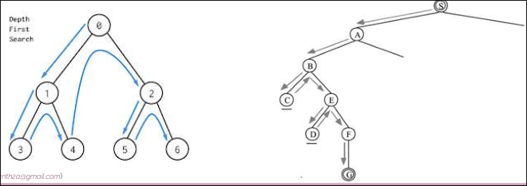
### Algorithm: FIFO Queue
- Step 1: Place teh start node in the queue
- Step 2: Examine the node at the front of the queue
    1. If the queue is empty, stop
    2. If the first node is the goal, stop
    3. Otherwise, add the children of the node to the end of the queue
- Repeat Step 2 until you access the goal node in the queue
### Performance Measure
- Completeness = YES
    - If shallowest goal node is at some **finite depth d** and **b is finite**.
- Time Complexity = $\large b^{(d+1)}$
    - Worst case: expand all except the last node at depth d
    - Total no. of nodes generated:
    $$ 1 + b + b^2 + b^3 + ... + (b^{d+1} - b) = O(b^{d+1})$$
- Space Complexity = O(b^{d+1})
    - Each node that is generated must remain in memory
    - Total no. of nodes in memory:
    $$ 1 + b + b^2 + b^3 + ... + (b^{d+1} - b) = O(b^{d+1})$$
- Optimal (i.e. admissible): **YES** if all paths have the same cost.
    - Otherwise, not optimal but finds solution with shortest path length.
### Merit/Demerit
- Advantage:
    - The solution is complete if the goal node is at finite depth
    - Provides optimal solution if there is uniform path cost
- Disadvantage
    - Needs a lot of time, if the solution is far from the root node
    - Requires more memory as the size of queue expands on moving to depth.
## Depth First Search
- DFS expands node at the deepest level of the tree one at a time.
- It expands the root node, then the leftmost child of the root node, then the leftmost child of that node and so on.
- When the search hits a dead end (a partial solution which can't be extneded)
    - does the search backtrack and expand nodes at higher levels.
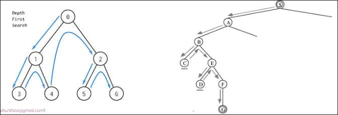
### Algorithm - LIFO
- Step 1: Put the start node on the stack
- Step 2: While the stack is not empty:
    1. Pop the stack
    2. If the TOS is the goal, stop
    3. Otherwise:
        - Push the nodes connected to the top of the stack on the stack
        - Provided they are not already on the stack
- Repeat step 2 until goal node is reached.
### Performance Measure
- Complete? **NO**
    - Fails in infinite-depth spaces and loops
- Time = **$O(b^m)$** with m = maximum depth
    - terrible if m is much larger than d
    - but if solutions are dense, may be much faster than breadth-first
- Space = **$O(bm)$**, i.e. linear space
    - 1 + b + b + ... + b (m times) = O (bm)
    - we only need to remember a single path + expanded unexplored nodes
- Optimal? **No**
    - it may find a non-optimal (not shortest) goal first
### Merit/Demerit
- Adv:
    - Less complexity than BFS.
- Disadv:
    - DFS may not always give optimal solution
    - We may get stuck going down an infinite branch that doesn't lead to a solution.
## Depth Limit Search
- Figure:
    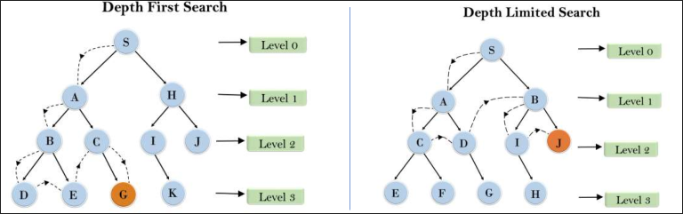
- DFS can run off down a very long (or infinite) path.
    - Solution may not be optimal
- DLS:
    - perform depth first search but only to a pre-specified depth limit **L**.
    - We **truncate** the search by looking at paths of lenght L or less.
- Now infinite length paths are not a problem.
- But will only find a solution **if** a **solution of length <= L exists**.
### Performance Measure
For DFS with depth limit l,
- Complete?
    - If l < d -> No,
    - If l >= d -> Yes
    - As solution may be beyond specified depth level
- Time?
    - **$O(b^l)$** with m = maximum depth
- Space?
    - *$O(bl)$*, i.e. linear space
- Optimal?
    - No
    - it may find a non-optimal goal first even if l >= d
### Merit/Demerit
- Adv:
    - memory efficient
- Disadv:
    - Incompleteness
    - May not be optimal if the problem has more than one solution
### Technique

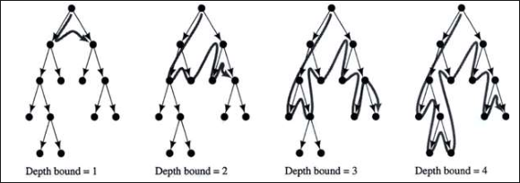
- Starting at depth limit, L = 0:
    - iteratively increase the depth limit, performing a depth limited search for each depth limit.
- Stop if:
    - no solution is found, 
    - or if the depth limited search failed without cutting off any nodes because of the depth limit.
- Uses:
    - only linear space and not much more time than other uninformed algorithms
- Search is helpful
    - only if the solution is at given depth level
## Search Strategy Comparison

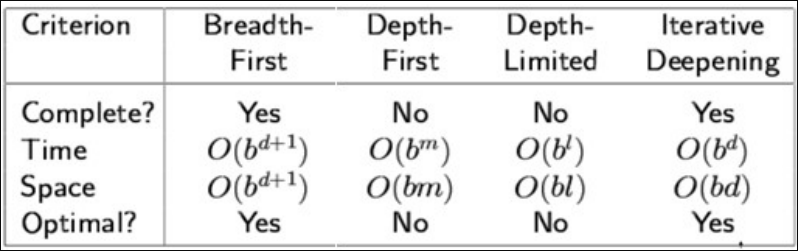
# Informed Search Techniques
- aka Heuristic Search
- Informed search have problem specific knowledge apart from problem definition.
- Use of heuristic imporves efficiency of search process.
- in the case of the heuristically informed search methods one uses domain dependent (heurisitc information) in order to search the space more efficiently.
- Heuristic:
    - domain-dependent information
    - Deciding which node to expand next and which nodes should be discarded, or pruned to improve the efficiency of search process.
    - A domain specific heuristic function h(n) guesses the cost of getting to the goal from node n.
## Best First Search
- A node is selected for expansion based on evaluation function f(n)
- Node with lowest evaluation function is expanded first.
- The evaluation function must represent:
    - some estimate fo teh cost of the path from state to the closest goal state.
- Types:
    - Greedy Best First Search
    - A * search
## Greedy Search
- It **tries to get as close as it can** to the goal.
- It **expands** the node that appears to be the **closest to the goal**.
- It evaluates the node by using **heuristic function only**.
    - Evaluation function **f(n) = h(n)**.
    - Heuristic = estimate of cost from **n to goal**.
    - **h(n) = 0** for goal state
### Algorithm
1. Place the starting node into the OPEN list
2. If the OPEN list is **empty** -> **Stop** and return **failure**
3. **Remove** the node n, from the OPEN list which has the **lowest value of h(n)**, and place it in the CLOSED list.
4. **Expand** the node n, and generate the successors of node n.
5. **Check** each successor node n, whether nay node is a goal node or not. If any successor node is goal, then return success and terminate, else proceed to Step 6.
6. For each successor node, algorithm **checks for evaluation function f(n)**, and then check if the node has been in either OPEN or CLOSED list. If the node **has not been in both list**, then add it to the OPEN list.
7. Return to Step 2.
### Example
### #1
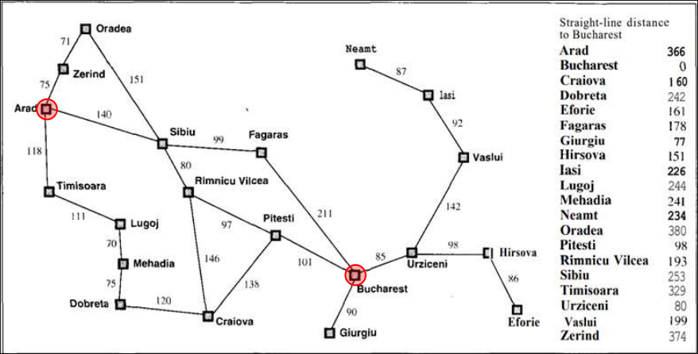
- Goal: To reach Bucharest from Arad.
- Nodes are labeled with their h value.
    - 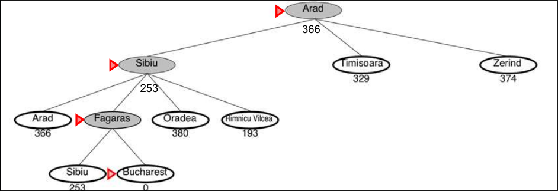
- Greedy search is not optimal
    - Greedy search returns the path: Arad-Sibiu-Fagaras-Bucharest (450 km)
    - the optimal path is: Arad-Sibiu-Rimnicu-Pitesti-Bucharest (418 km)
### #2
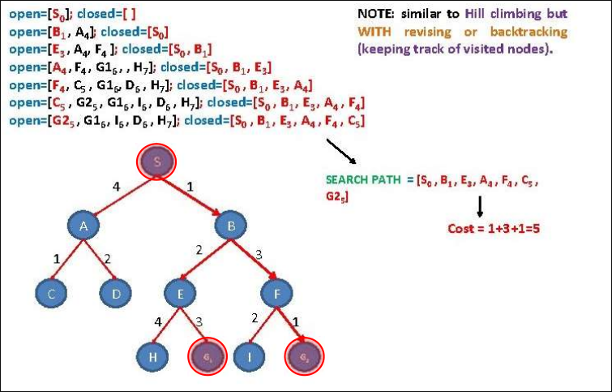
### Performance
- Problem:
    - Might fall into an infinite loop
- Complete?
    - No, can get stuck in loops.
- Time?
    - **$O(b^m)$**, but a good heuristic can give dramatic improvement
- Space?
    - **$O(b^m)$** - keeps all nodes in memory
- Optimal?
    - **NO**
## A* Search
- It is mix of **uniform-cost** search and **best-first** search
- It always selects the node on the frontier with the **lowest estimated distance** from the start to a goal node constrained to go via that node.
- A* Search uses both **path cost** and **heuristic values**.
- Idea: **avoid expanding** paths that are already **expensive** evaluation function **f(n) = g(n) + h(n)**
    - g(n) = cost so far to reach n
    - h(n) = estiamted cost from n to goal
    - f(n) = estimated total cost of path to goal
- Figure:
    - 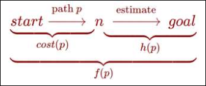
### Performance
- Completeness:
    - Yes
    - A* Search always gives us solution
- Optimality
    - Yes
    - A* Search gives optimal solution when the heuristic function is admissible heuristic
- Time Complexity
    - **$O(b^d)$**
    - exponential with path length i.e.e O(b^d) where d is length of the goal node from start node
- Space complexity;
    - It keeps all generated nodes in memory.
    - Hence space is the major problem.
## Hill Climbing
- Local search, Greedy approach, no backtracking
- Hill climbing is the depth-first search with a heuristic measurement that orders choices as nodes are expanded.
- It always selects the most prommising successor of the node last expanded by moving in the direction of increasing value
- Hill climbing doesn't look ahead beyond the immediate neighbors of the current state
- One move is selected and all other nodes are rejected and are never considered
### Algorithm
```
function HillClimbing(graph, initialState):
    current := initialState
    loop:
        neighbor := a highest-valued successor of curret
        if neighbor.value <= current.value:
            return current
        current := neighbor
```
1. Determine successors of current state
2. Choose successor of maximum goodness (break ties randomly)
3. If goodness of best successor is less than current state's goodness, stop.
4. Otherwise make best successor the current state and go to Step 1.
### Drawbacks
- Local Maxima:
    - a local maxima as opposed to global maximum.
- Plateau:
    - an area of the search space where evaluation function is flat, thus requiring random walk.
    - Serch might be unable to find its way of plateau.
- Ridge:
    - Where there are steep slopes
    - and the search direction is not towards the top but towards the side.
- Illustrations
    - 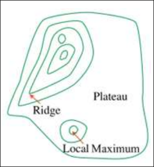
    - 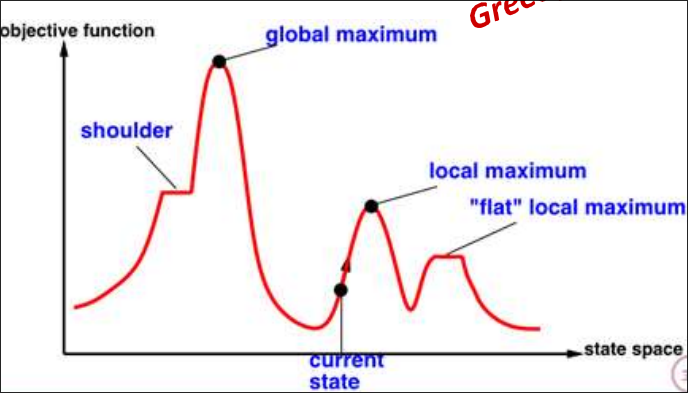
### Solutions
- Local Maxima:
    - Backtrack to some earlier node and try going to different direction.
- Plateau:
    - Make a big jump in some direction to try to get a new section of search space
- Ridge:
    - Apply two or more rules such as bi-direction search before doing the test
    - Moving in several directions at once.
### Simulated Annealing Search
- Idea:
    - espace local maxima by allowing some "bad" moves
    - but gradually decrease their frequency
- A random pick is made for the move:
    - If it improves the situation, it is accepted straight away.
    - If it worsens the situation, it is accpeted with some probability less than 1 which decreases exponentially with the badness of the move
        - i.e. for bad moves the probability is low and for comparitively less bad moves, it is higher
- Probability of downward steps is controlled by temperature parameter
- High temperature implies
    - high chance of trying locallly bad moves, allowing nondeterministic exploration
- Low temperature
    - makes search more deterministic (like hill climbing)
- Temperature begins high and gradually decreases:
    - according to a predetermined annearling schedule
- Initially -> try out lots of possible paths
    - but over time we gradually settle in on the most promising path
- If temperature is lowered slowly enough:
    - an optimal solution will be found.
# Aderversarial Search Techniques
- Used in game-playing scenarios where two or more players compete against each other
- The goal of Aderversarial search is to:
    - find the best possible move for a player, given the actions of other players,
    - while minimizing the opponent's chances of winning
- Opposition between the agent's utility functions make the situation adversarial
- Used in game playing
- Example algorithms: Minimax and $\alpha$-$\beta$ pruning
## Minimax Procedure
- Backtracking, Best move strategy
- A value is associated with each position or state of the game
- The value is associated with each position or state of the game
- The value is computed by means of a position evaluation function
    - indicates how good it would be for a player to reach the position.
- A player MAX will try to:
    - Maximize its utility (by making best move)
- Another player min will try to:
    - Minimize utility (by making worst move from MAX's perspective)
### Example
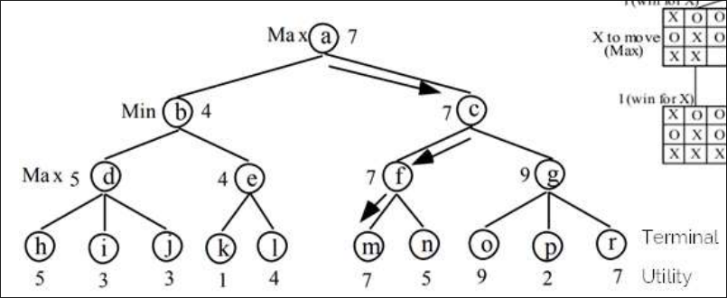
### Example
```
minimax(player, board)
    if (game over in current board position)
        return winner

    children = all legal moves for player from this board
    if (max's turn)
        return maximal score of calling minimax on all the children
    else (min's turn)
        return minimal score of calling minimax on all the children
```
### Problem
- Number of nodes to expand is exponential in the depth of the tree and the branching factor
### Performance
- Complete?
    - Yes, if the tree is finite
- Optimal?
    - Yes, against an optimal opponent
- Time complexity?
    - **$O(b^d)$** 
    - can be reduced using alpha-beta pruning algorithm
- Space complexity?
    - **O(bm)** (depth-first exploration)
- Example:
    - For chess, b = 35, m = 100 for reasonable games
    - exact solution completely infeasible
## Alpha Beta Procedure
- Alpha-beta pruning is a modified version of minimax algorithm.
- It is an optimization technique for the minimax algorithm.
- Alpha-beta pruning is a technique for evaluating nodes of a game tree that eliminates unnecessary evaluations
    - It uses two parameters, alpha and beta
- Alpha-beta pruning improves search efficiency of minimax
    - without sacrificing accuracy.
### Algorithm
```peudocode
function alphabeta(node, depth, 𝜶, β, maximizingPlayer)
    if depth = 0 or node is a terminating node
        return the heuristic value of node
    if maximizingPlayer
        for each child of node
            𝜶 := max(𝜶, alphabeta(child, depth - 1, 𝜶, β, FALSE))
            if β <= 𝜶
                break (* β cut-off *)
        return 𝜶
    else
        for each child of node
            β := min(β, alphabeta(child, depth -1, 𝜶, β, TRUE))
            if β <= 𝜶
                break (* 𝜶 cut-off *)
    return β
```
### Procedure
1. At each non-leaf node, store two values - $\alpha$ and $\beta$
2. Let $\alpha$ be the best (i.e. maximum) value found so far at a "max" node.
3. Let $\beta$ be the best (i.e. minimum) value found so far at a "min" node
4. Initially assign $\alpha = - \infty$ and $\beta = - \infty$ at the root.
5. Note $\alpha$ is a monotonically non-decreasing and $\beta$ is monotonically non-increasing as you travel up the tree.
6. Given a nod en, cutoff the search below that node (i.e., generate no more children) if:
    - n is a "max" node and $\alpha(n) \ge \beta(i)$ for some "min" ancestor i of n, or
    - n is a "min" node and $\beta(n) \le \alpha(j)$ for some "max" ancenstor j of n.
### Performance
- Pruning does not affect final result.
- Good move ordering improves effectiveness of pruning.
- With "perfect ordering", time complexity = **$O(b^{m/2})$**
### Example
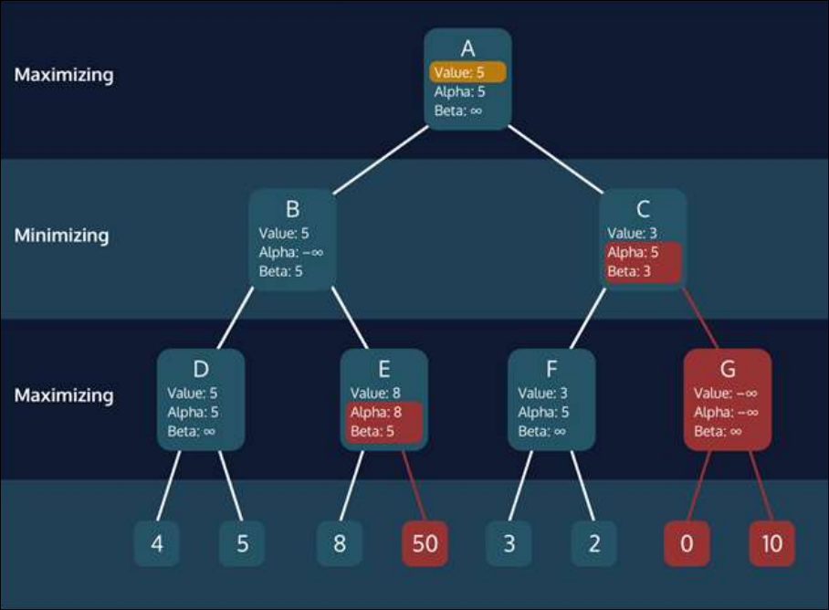
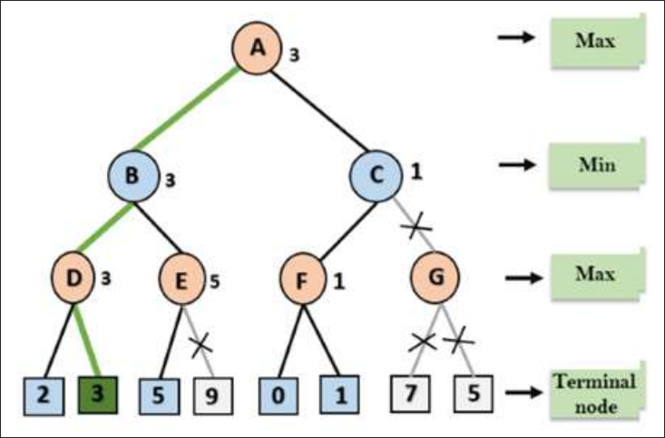
