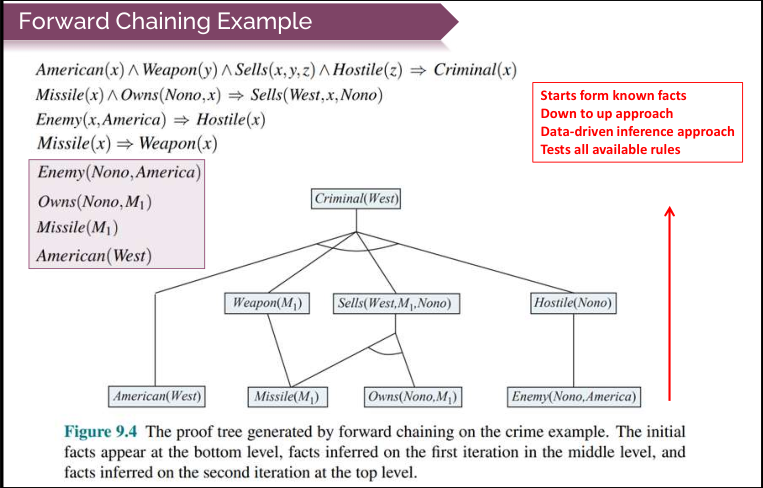
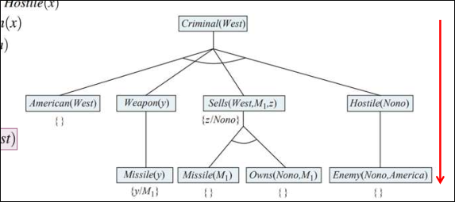
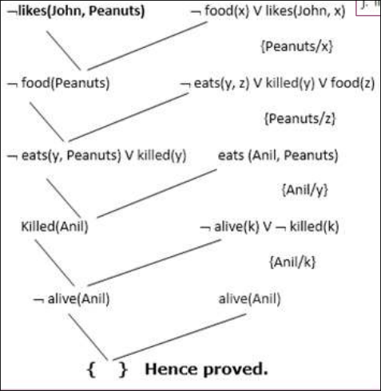
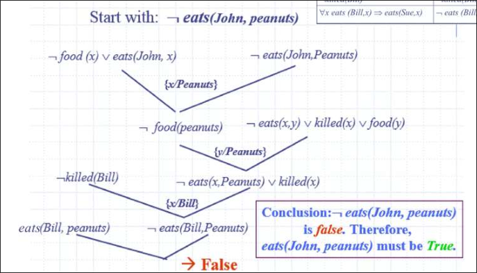
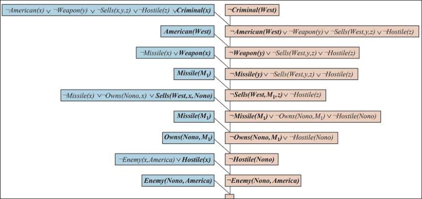
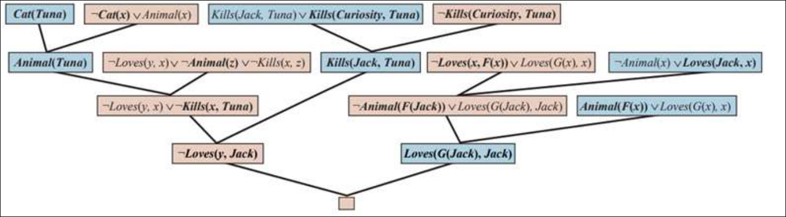

**4 Hours**
# Formal Logic
## Connectives
## Truth Tables
## Syntax
## Semantics
## Tautology
## Validity
## Well-Formed Formula
# Propositional Logic
- Proposition is the declarative statement which can:
    - either be true or false but not both at the same time.
- Provides mathematical model to reason about the logical expression
    - as true or false.
- Atomic Propositions/sentences are the statements constructed from $2^2$ 
    - a single propositional symbol along with constants or propositional symbols (P, Q).
- Composite propositions/sentences are the:
    - statements constructed using valid atomic propositions connected via logical connectives ($\wedge$), Disjunction ($\wedge$), Implication ($\leftarrow$), and Biconditional ($\leftrightarrow$)
- Propositional logic examples:
    - P = The sun rises from west (false proposition)
    - Q = 5 is a prime number (true proposition)
- Despite its limited expressiveness, prepositional logic serves:
    - to illustrate many of the concepts of logic just as well as first-order logic.
- Syntax
    - The symbols of prepositional logic are:
        - Logical Constants
            - true or false
        - Propositional symbols
            - such as P and Q
            - is a sentence by itself.
        - Logical connectives:
            -   <table>
                    <tr>
                        <th>Symbol</th>
                        <th>Meaning</th>
                        <th>Mnemonic</th>
                    </tr>
                    <tr>
                        <td>¬</td>
                        <td>Negation</td>
                        <td>NOT</td>
                    </tr>
                    <tr>
                        <td>⋀</td>
                        <td>Conjunction</td>
                        <td>AND</td>
                    </tr>
                    <tr>
                        <td>⋁</td>
                        <td>Disjunction</td>
                        <td>OR</td>
                    </tr>
                    <tr>
                        <td>→</td>
                        <td>Implication</td>
                        <td>IF THEN</td>
                    </tr>
                    <tr>
                        <td>↔</td>
                        <td>Bi-implication</td>
                        <td></td>
                    </tr>
                    <tr>
                        <td>()</td>
                        <td>Parenthesies</td>
                        <td></td>
                    </tr>
                </table>
## Predicate Logic
### First Order Logic
- Predicate logic is an extension of propositional logic
- Predicate logic allows flexible knowledge representation
    - in terms of objects, properties, relations and functions
    - the symbols denote properties of an object or relation between objects
    - first order predicate logic (FOPL) makes use of quantified variables over objectcts.
- Interpretation specifies referents for
    - constant symbols -> objects
    - predicate symbols -> relations
    - function symbols -> functional relation
### Quantifier
- These are the symbols that permit to determine or identify the range and scope of the variable in the logical expression.
- There are two types of quantifier in predicate logic:
    - Universal Quantifier ($\forall$) (for all, everyone, everything)
        - universal quantiifer states that the statements within its scope are true for every value of the specific cvariable.
        - it is denoted by the symbol $\forall$
        - e.g.
            - all men drink coffee
            - Everyone at Pitt is smart: $\forall x \text{At}(x, \text{Pitt}) => \text{Smart(x)}$
    - Existential Quantifier ($\exists$) (there exist, for some, at least one)
        - existential quantifier states that the statements within its scope are true for some values of the specific variable
        - It is denoted by the symbol ($\exists$)
        - e.g.,
            - some boys attend class.
            - Someone at Pitt is smart: $\exists x \text{At}(x, Pitt) \wedge \text{Smart}(x)$
- Use **logical and with $\forall$**
- Use **implication with $\exists$**
- Do not equate $\exists_x \forall_y$ is not similar to $\forall_y \exists_x$.

## FOPL
### Resolution
- Resolution is a theorem proving technique that proceeds by building refutation proofs i.e., proofs by contradiction
    - invented by John Alan Robinson in 1965.
- It is an inference rule which is used in both propositional as well FOPL
- Steps for Resolution
    1. Conversion of facts into first-order logic.
    2. Convert FOL statements into CNF.
    3. Negate the statement which needs to be proven
    4. Draw resolution graph (unification)
- CNF = conjunction of disjunction
     - e.g., $(A \vee \neg B) \wedge (B \vee \neg C \vee \neg D$
## Interpretation
## Quantification
### Skolemization
- Process for removing existential quantiifers
- Remove each existential quantifier, then replace the resulting free variables by terms referred to as Skolem functions (or constant)
- $\exists_x\ \exists_y$ becomes $\forall_y$ P(c, y)
- $\exists_x\ \exists_y$ becomes $\forall_x$ P(x, f(x))
- Skolemization preserves satisfiability
## Horn Clauses
- Horn clause is a disjunction of literals of which at most one is positive.
    - Example ($\neg X_1 \vee \neg X_2 \vee \neg X_3 \vee Y$ = $\neg(X_1 \wedge X_2 \wedge X_3) \vee Y$
    - Head = Y (Positive literal)
    - Body = $(\neg X_1 \vee \neg X_2 \vee \neg X_3)$ (negative literals)
- Definite clause is a disjunction of literals of which exactly one is positive.
    - example: same as above
    - all definite clauses are horn clauses.
    - with no positive literals
- Horn clauses are closed under resolution:
    - if you resolve two Horn clauses, you get back a horn clause.
- Inference with Horn clauses can be done through:
    - forward chaining and backward-chaining algorithms
### Forward and Backward Chaining
- Rule-based Reasoning
    - a set of logical rules or statements are used to derive conclusions or make decisions
- Forward Chaining
    - Starts with the known facts to reach a goal state
    - Example: Facts ->
        1. It is raining (A)
        2. If it is raining, the road is wet (A -> B) Goal B
    - Leading to goal by both:
        - A $\rightarrow$ B
        - A
    - example:
        - 
- Backward Chaining
    - Starts with goals and works backwards to determine the facts that support it
    - Example: Goal: B
    - Reach statement being true (A/B is true)
        - B
        - A
        - A $\rightarrow$ B
    - Example:
        - 
# Rules of Inference
## Unificiation
## Resolution Refutation System (RSS)
### Example 1
1. John likes all kind of food
2. Apple and vegetable are food
3. Anything anyone eats and not killed is food.
4. Anil eats peanuts and still alive
5. Harry eats everything that Anil eats.

Prove by resolution that:

6. John likes peanuts.
#### Step 1: Conversion
Conversion of Facts into FOL

1. $\forall$x food(x) $\rightarrow$ likes(John, x)
2. food(Apple) $\wedge$ food(vegetables)
3. $\forall$ x $\forall$ y eats(x, y) $\wedge\neg$ killed(x) $\rightarrow$ food(y)
4. eats(Anil, Peanuts) $\wedge$ alive(Anil)
5. $\forall$x eats(Anil, x) $\rightarrow$ eats(Harry, x)
6. $\forall$x alive(x) $\rightarrow \neg$ killed(x)
7. $\forall$x alive(x) $\rightarrow \neg$ kiled(x)
8. likes(John, Peanuts)
#### Step 2.A: Conversion of FOL into CLK
Eliminate all implication and rewrite
1. $\forall$x $\neg$ food(x) $\vee$ likes(John, x)
2. food(Apple) $\wedge$ food(vegetables)
3. $\forall$x$\forall$y $\neg$ \[eats(x, y) $\wedge\neg$ killed(x)\] $\vee$ food(y)
4. eats(Anil, Peanuts) $\vee$ alive(Anil)
5. $\forall$x $\neg$ eats(Anil, x) $\vee$ eats(Harry, x)
6. $\forall$x $\neg$ \[$\neg$ killed(x)\] $\vee$ alive(x)
7. $\forall$x $\neg$ alive(x) $\vee\neg$ killed(x)
8. likes(John, Peanuts)
#### Step 2.B Reduce scope of v (De-Morgan's Law)
Move negation inwards and rewrite
1. $\forall$x $\neg$food(x) $\vee$ likes(John, x)
2. food(Apple) $\vee$ food(vegetable)
3. $\forall$x $\forall$y $\neg$eats(x, y) $\vee$ killed(x) $\vee$ food(y)
4. eats(Anil, Peanuts) $\wedge$ alive(Anil)
5. $\forall$x $\neg$eats(Anil, x) $\vee$ eats(Harry, x)
6. $\forall$x $\neg$killed(x) $\vee$ alive(x)
7. $\forall$x $\neg$alive(x) $\vee$ killed(x)
8. likes(John, Peanuts)
#### Step 2.C Rename variables or standardize variables
1. $\forall$x $\neg$food(x) $\vee$ likes(John, x)
2. food(Apple) $\wedge$ food(vegetables)
3. $\forall_y\ \forall_z$ $\neg$eats(y, z) $\vee$ killed(y) $\vee$ food(z)
4. eats(Anil, Peanuts) $\wedge$ alive(Anil)
5. $\forall_w\ \neg$eats(Anil, w) $\vee$ eats(Harry, w)
6. $\forall_g\ \neg$killed(g) $\vee$ alive(g)
7. $\forall_k\ \neg$alive(k) $\vee\ \neg$killed(k)
8. likes(John, Peanuts)
#### Step 2.D/E Drop Universal Quantifiers: existential and universal quantifier
Drop all universal quantifier since all the statements are not implictly quantified so we don't need it.
1. $\neg food(x) $\vee$ likes(John, x)
2. food(Apple)
3. food(vegetables)
4. $\neg$eats(y, z) $\vee$ killed(y) $\vee$ food(z)
5. eats(Anil, Peanuts)
6. alive(Anil)
7. $\neg$eats(Anil, w) $\vee$ eats(Harry, w)
8. killed(g) $\vee$ alive(g)
9. $\neg$alive(k) $\vee$ $\neg$killed(k)
10. likes(John, Peanuts)
#### Step 2.F Distribute conjunction over disjunction
#### Step 3 Negate the statement to be proved
$\neg$likes(John, Peanuts)
#### Step 4 Draw Resolution graph
- Solve the problem by resolution tree using substitution

### Example 2
1. John likes all kinds fo food == $\forall_x$ food(x) $\Rightarrow$ eats(John, x)
2. Apples are food == food(apples)
3. Chicken is food == food(chicken)
4. Anything anyone eats and isn't killed by is food == $\forall_{x,y}$ eats(x, y) $\wedge\ \neg$killed(x) $\Rightarrow$ food(y)
5. Bill eats peanuts and is still alive == eats(Bill, Peanuts) $\wedge\ \neg$killed(Bill)
    - Here, we assume alive means not killed
6. Sue eats everything that Bill eats == $\forall_x$ eats (Bill, x) $\Rightarrow$ eats(Sue, x)

### Example 3
- The law says that it is a crime for an american to sell weapons to hostile nations.
- The country Nono, anAmerica, has some missiles, and all of its missiles were sold to it by Colonenl West, who is American.
- Goal: West is a criminal.

First we will represent these facts as FOPL:

- "IT is a crime for an american to sell weapons to hostile nations":
    - American(x) $\wedge$ Weapon(y) $\wedge$ Sells(x, y, z) $\wedge$ Hostile(z) $\Rightarrow$ Criminal(x)
- "Nono ... has some missiles":
    - $\exists_x$ Owns(Nono, x) $\vee$ Missile(x) is transformed into 2 definite clauses
    - by Existential instantiation
    - introducing skolemn constant: $M_1$:
    - Owns(Nono, $M_1$)
    - Missile($M_1$)
- "All of its missiles were sold to it by Colonen West":
    - $\forall_x\ \forall_y$ Missile(x) $\wedge$ Owns(Nono, x) $\Rightarrow$ Sells(West, x, Nono)
- Missiles are weapon so:
    - Missile(x) $\Rightarrow$ Hostile(x)
- West, who is american:
    - American(West)
- The country Nono, an enemy of America:
    - Enenmy(Nono, America)

Then the result becomes:
- $\neg$American(x) $\vee$ $\neg$Weapon(y) $\vee$ $\neg$Sells(x, y, z) $\vee$ $\neg$Hostile(z) $\vee$ Criminal(x)
- $\neg$Missile(x) $\vee$ $\neg$Owns(Nono, x) $\vee$ Sells(West, x, Nono)
- $\neg$Enemy(x, America) $\vee$ Hostile(x)
- $\neg$Missile(x) $\vee$ Weapon(x)
- Owns(Nono, $M_1$)
- American(West)
- Missle($M_1$)
- Enemy(Nono, America)

### Example 3
- Everyone who loves all animals is loved by someone
- Anyone who kills an animal is loved by no one.
- Jack loves all animals.
- Either Jack or Curiousity killed the cat, who is named Tuna.
- Did Curiousity kill the cat?

First we express the original sentences, some background knowledge, and the negated goal G in the first-order logic:
1. $\forall_x$ \[$\forall_y$ Animal(y) $\Rightarrow$ Loves(x, y)\] $\Rightarrow$ $\exists_y$ Loves(y, x)
2. $\forall_x$ \[$\exists_z$ Animal(z) $\wedge$ Kills(x, z)\] $\Rightarrow$ \[$\forall_y\ \neg$Loves(y, x)\]
3. $\forall_x$ Animal(x) $\Rightarrow$ Loves(Jack, x)
4. Kills(Jack, Tuna) $\vee$ Kills(Curiousity, Tuna)
5. Cat(Tuna)
6. $\forall_x$ Cat(x) $\Rightarrow$ Animal(x)
7. $\neg$G: $\neg$Kills(Curiousity, Tuna)

Now we apply the conversion procedure to convert each sentence to CNF:
1. everyone who loves all animals is loved by someone
    - $\neg$Animal(F(x)) $\vee$ Loves(G(x), x)
    - $\neg$Loves(x, F(x)) $\vee$ Loves(G(x), x)
2. Anyone who kills an animal is loved by no one.
    - $\neg$Animal(z) $\vee$ Kill(x, z) $\vee$ $\neg$Loves(y, x) 
3. Jack loves all animal
    - $\neg$Animal(x) $\vee$ Loves(Jack, x)
4. Either Jack or Curiousity killed the cat, who is named Tuna
    - Kills(Jack, Tuna) $\vee$ Kills(Curiousity, Tuna)
    - Cat(Tuna)
    - $\neg$ Cat(x) $\vee$ Animal(x)
5. Curiousity didn't kill the cat.
    - $\neg$Kills(Curiousity, Tuna)

Graph solution:

## Answer extraction from RRS
## Rule based deduction system
# Statistical Reasoning
## Probability and Bayes' Theorem
## Causal Networks
## Reasoning in belief Network
