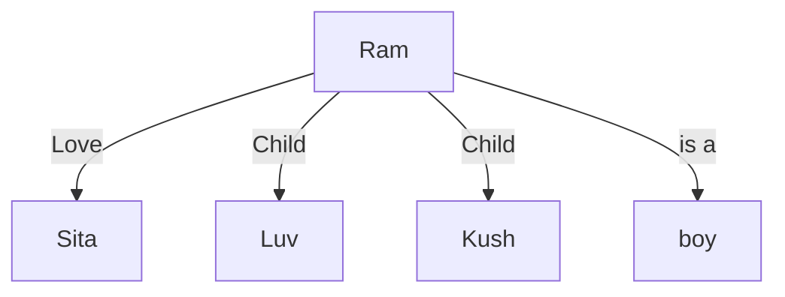
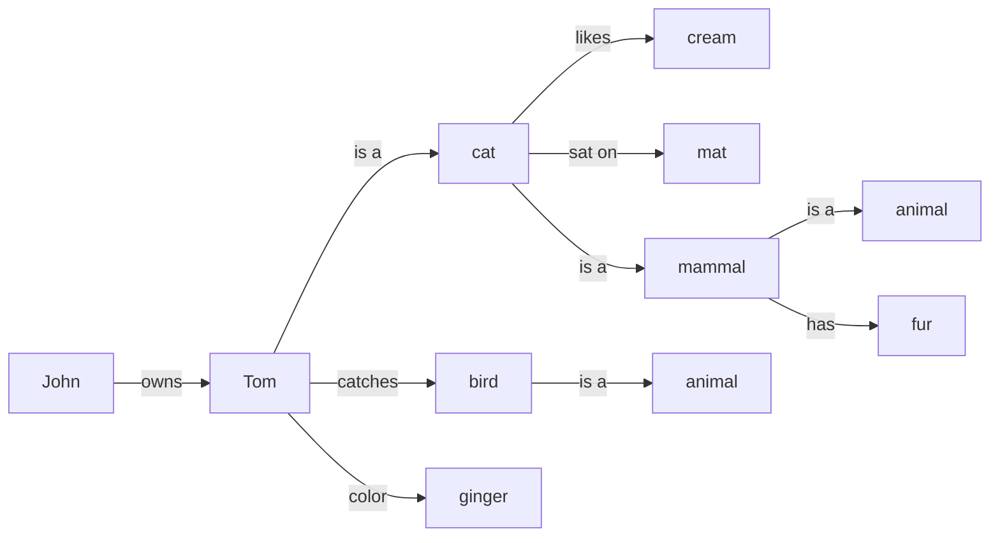
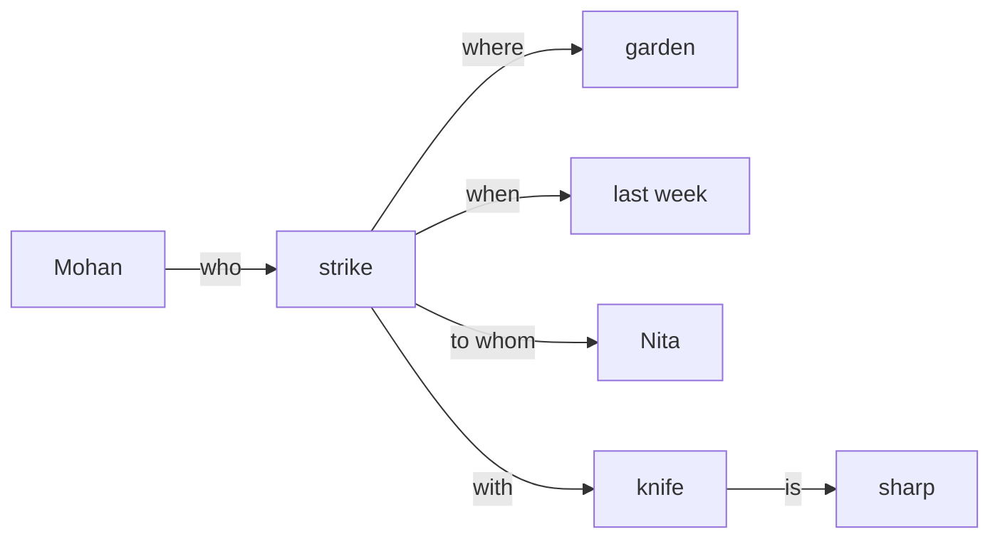

# Exam Frequency Table

| Topic | Typical Marks | Frequency |
|---|---|---|
| Approaches to KR + Issues in KR | 2–8 | Very High |
| Semantic nets: definition + converting sentences into a semantic network | 7–8 | Very High |
| Frames: definition, structure, significance, examples | 1–8 | Very High |
| Compare/differentiate Semantic Net and Frame (advantages/limitations) | 2–8 | Very High |
| Conceptual dependency: definition + primitives | 2–7 | Moderate |
| Scripts: definition + how knowledge is represented via scripts | 3–5 | Moderate |
| Knowledge representation evaluation | 3 | Low–Moderate |

# Knowledge

## Background

- The fact or condition of knowing something with familiarity gained through experience or association.
- The fact or condition of being aware of something is called knowledge.

## Knowledge Storing

- Natural language for people.
- Symbols for computers:
    - a number or character string that represents an object or idea
    - internal representation of knowledge
- The core concept
    - mapping from facts to an internal computer representation
    - and also to a form that people can understand.

## Building a Knowledge Base (KB)

- KB is designed for grouping various pieces of knowledge together in one place.
    - the KB is the central repository of information
    - containing the facts that we know about obejcts and their relationships.
- **Knowledge Engineering** (Knowledge Acquisition);
    - the mapping of the set of knowledge in a particular problem domain.
    - and converting it into a knowledge base.
- **Domain Expert**
    - who, through years of experience, has gathered knowledge about how things work and relate to one another, and knows how to solve problems in their specialty
- Knowledge Engineer
    - who can take that domain knowledge and represent it in a form for use by the reasoning system.
    - acts as an intermediary between the human expert and the expert system
    - must have good people skills as well as good technical skills.
    - a combination of questionnaires, interviews, and first-hand observations are used to give the knowledge engineer the deep understanding required to transform the expert's knowledge into facts and rules for the knoweldge base.
- Neural networks could be trained to perform classification and prediction taskswithout going through the expensive knowledge acquisition process.
    - although neural networks may not be easily converted to a symbolic form
    - they are most definitely a knowledge base, because they encode the knowledge implicit in the training.

## Knoweldge Engineering vs Programming

| Knowledge Engineering | Programming |
| --- | --- |
| Choosing a KR language | Choosing a programming language |
| Building a KB | Writing a program |
| Implementing the proof theory | Choosing or writing a compiler |
| Inferring new facts | Running a program |
| Knowledge engineer specifies **what** is true | Programmer specifies **how** to find a solution |

# Representations and Mapping

(*approaches to KR*)

- **Knowledge Representation (KR)** is fundamentally about finding good ways to represent the knowledge needed to solve complex problems using computers.
- Any representation scheme is essentially a mapping between two domains:
    - the **facts** of the world (the actual objects, relationships, and state of affairs, we wish to reason about), and
    - a **representation** of those facts in some formal/symbolic structure the computer can manipulate
- This mapping happens in 2 directions:
    - **Forward representation mapping**
        - mapping from facts in the world to a representation.
        - This mapping allows knowledge about the world to be captured and stored in the system.
    - **Backward representation mapping**
        - mapping from the representation back to facts in the world.
        - This mapping allows interpretation of the results of a reasoning or intference process as meaningful facts about the world.
- For example, consider the fact "Flood is a phenomenon" and the general rule "Some phenomenons devestate."
    - Using an appropriate representation (e.g., predicate logic: $Phenomenon(flood)$, $\exists x Phenomenon(x) \wedge Devestate(x)$)
    - We can derive the new internal fact $Devestate(flood)$.
    - The backward mapping allows us to interpret this as real-world fact "Flood devestates"
- Good representations must support both directions of mapping,
    - being able to encode facts is useless if we can't correctly interpret the results of manipulating the encoded knowledge back into real-world meaning
- Knowledge can take many forms
    - simple facts or complex relationships, mathematical formulas or rules
    - for natural language syntax, associations between related concepts, inheritance hierarchies between classes of objects.
    - There is no single universal representation for all of them.

# Approaches to KR

## Properties of KR Systems

- Representational Adequacy
    - the ability to represent the required knowledge.
- Inferential Adequecy
    - the ability to manipulate the knowledge to produce new knowledge corresponding to that inferred from the original.
- Inferential Efficiency
    - the ability to direct the inferential mechanisms into the most productive directions by storing appropriate guides.
- Acquisitional Efficiency
    - the ability to acquire new knowledge using automatic methods wherever possible, rather than relying on human intervention

## KR Methods

Effective KR methods should be:
- easy to use
- easily modified and extended
    - by either changing the knowledge manually or thorugh automated machine learning techniques.

### Procedural Method

- Encodes facts and defines the sequence of operations step by step (hardcoded logic)
- Weakness:
    - the knowledge and the manipulation of that knowledge are inextricably linked,
    - making the knowledge difficult to modify independently of the procedure that uses it.

### Declarative Method

- Overcomes the weakness of procedural representation
- The states, facts, rules and relationships are separately declared.
- The separation of
    - knowledge from the algorithm used to manipulate or reason
    - with that knowledge provides advantage over precedural code
    - i.e. the knowledge base can be udpated without requireing reasoning engine.

### Relational Method

- Knowledge is represented as a set of relations, among objects, similar in structre to a relational database table.
- Facts are stored as tuples relating multiple objects/attributes, without any hierarcical or inheritance structure between them
    - each relation is a flat table of facts
- Example:
    - a relation `Likes(Person, Food)` might store tuples as `Likes(Ram, Pizza)`, `Likes(Sita, Momo)`.
- This method is well suited to representing simple factual associations and is easy to query using standard relational operations (selection, projection, join)
- But it does not naturally capture inheritance or default reasoning the way hierarchical representations do.
- Adv:
    - simple, systematic and easy to implement/query
- Weakness:
    - lacks built-in support for generalization/inheritance between classes of objects,
    - i.e. every fact must be stored explicitly rather than inferred through a class hierarchy.

### Hierarchy Method

- Used to present **inheritable knowledge**
- Inheritable knowledge centers on relationsips and shared attributes between different kinds or classes of objects.
- Hierarchical knowledge is best suited to represent "**is-a**" relationship,
    - where a general or abstract type (e.g., ball) is linked to more specific types
    - e.g., ball -> rubber, golf, baseball, football
    - which inherit the basic properties of the general type.
- The strength of Object Inheritance allows for compact representation of knowledge and allows reasoning algorithms to process at different levels of abstraction or granularity
- The use of categories or types gives structure to the world by grouping similar objects together
- Using categories or clusters simplifies reasoning by limiting the number of distinct things we have to deal with.

## Capturing Knowledge

*Temporal Aspects*

- Knowing what to expect based on the elapsed time from one event to another is often the behavior of intelligent system.
- Time concepts such as before, after, and during are crucial to common-sense reasoning and planning
- Temporal logic is usually to represent and reason about time.

## Complex Network Graph

A general term for representations, such as semantic nets, that organize knowledge as a graph of interconnected nodes, and links, rather than a strict tree-like hierarchy, allowing more flexible, cross-cutting relationships between concepts.

# Issues in KR

(*frequently asked*)

- **Scalability**
    - Scalability becomes a significant difficulty as the volume and complexity of knowledge ris.
    - Large KB must be efficiently represented and processed using sophisticated methods and distributed computing concepts.
- **Uncertain/Incomplete Information**
    - AI systems frequently work with information that is uncertain or incomplete.
    - A major research area is improving KR approaches to manage uncertainty and reason with inadequate data.
- **Knowledge Fusion and Integration**
    - Combining and integrating knowledge from various sources and modalities is a difficult task
    - The goal of future research is to create methods that make it possible for heterogenous knowledge to be seamlessly integrated for better AI performance.
- **Explainability and Interoperability**
    - AI systems should be able to justify their decisions with examples.
    - Building trust, assuring ethical AI, and satisfying legal standards all depend on the development of clear and understandable KR approaches.

# Predicate Logic

- Formal logic is a language with its own syntax, which defines how to make sentences and corresponding semantics, which describe the meaning of the sentences
- Sentences can be constructed using proposition symbols (P, Q, R) and Boolean connectives, such as conjunction ($\vee$), disjunction ($\wedge$), implication ($\rightarrow$)
- Predicate logic introduces the concept of quantifiers, which allow us to refer to sets of objects
- Using objects, attributes and relations, we can represent almost any type of knowledge.

## Structural Knowledge

- Basic knowledge to problem solving
- Describes relationships of something
- Describes the relationship that exists between subjects, concepts or objects

## Knowledge Model

- A model is a world in which a sentence is true under a particular interpretation.
- There can be several models at once that have the same interpretation
- FOPL consists of objects, predicates on objects, connectives and quantifiers
- Logic is a simple representation which helps to infer new facts from existing information.
- Predicates are relations between objects or infer new facts from existing information.
- Predicates are relations between objects or properties of the objects.
- Connectives and quantifiers allow for universal sentences.
- The relation between objects can be true or false, e.g., propositional logic.

# Semantic Nets

- Semantic network is an alternative to predicate logic as form of knowledge representation.
- A semantic network is a declarative grpahic representation that can be used to represent knowledge and support automated systems for reasoning about the knowledge.
- The structure of a semantic net is shown graphically in terms of **node** and **arcs** connecting them
    - Nodes are sometimes referred to as objects, events, or subjects
    - Arcs represent the links or relations
- The links are used to express relationships
- It is argued that this form of representation is closer to the way humans structure knowledge, since humans also store knowledge with relational links.
- For example, if a man loses his bicycle key, he remembers where he had been and where he had used his bike last. So, he goes to that place to start searching.

## Merits/Demerits

Advantages

- This method is easy to visualize
- It is efficient in space requirement
- Objects are represented only once.

Disadvantages

- Unable to represent negation, quantification, disjunction, etc.
- Can't easily infer or deduce new information from the structure alone.

## Example

### 1

Show the following statements in a semantic netowkr
1. Ram is boy
2. Ram loves Sita
3. Ram's children are Luv and Kush

Solution

### 2

Show the following statements in a semantic network:
1. Tom is a cat
2. Tom caught a bird
3. Tom is owned by John
4. Tom is ginger in color
5. Cats like cream
6. The cat sat on the mat
7. A cat is a mammal
8. A bird is an animal
9. All mammals are animals
10. Mammals have fur
**Solution:**

### 3

Show the following statement in a semantic network:

"Mohan struck Nita in the garden with a sharp knife last week."

# Frames

- A frame is a static data structure used to represent a well-understood situation in a group of **slots** and slot **fillers**
- A frame is similar to a record structure
- Used in many AI applications, including Vision and NLP, providing a convenient structure for representing knowledge.
- A single frame is not very useful on its own.
- Frame systems usually hav e acollection of frames connected to each other.
- Frames are also useful for representing common-sense knoweldge
- While semantic nets are basically a two-dimensional representation of knowledge, frames add a **third dimension** by allowing nodes to have internal structures.
- By using frame structure with filler slots and inheritance, very powerful knowledge representation systems can be built.
- Frame based expert systems are very useful for representing casual knowledge, because their information is organized by cause and effect.
- Frames are generally designed to represent either generic or specific knowledge.

## Structure of a Frame

- Frame identification name
    - a field written at teh top of the frame structure, where the name of the frame is placed
    - example: a frame that stores knowledge about a car can have the frame name "Car".
- Relationship of this frame to other frames
    - relates different frames to each otehr
    - example: a super class of the fraem "Car" is the frame "Vehicle"
- Knowledge about an attribute of an object and its value
    - attributes are written in slots, and the value of a slot is written as the slot filler.
    - example: a frame "Car" can have an attribute "number of wheels" with value 4.
- Frame default information
    - these are slot values that are taken to be true when no evidence to the contrary has been found.
    - example: the frame "Ram's Car" copies the slot and slot values of its parent frame "Car", like number of wheels, model name, etc.

## Example, frame for Car

**Frame: Vehicle** (class frame)

| Slot | Filler |
|---|---|
| IS-A | Physical Object |
| Number of wheels | (default: 4) |
| Purpose | Transportation |

**Frame: Car** (subclass frame: inherits from Vehicle)

| Slot | Filler |
|---|---|
| IS-A | Vehicle |
| Number of wheels | 4 (inherited default) |
| Number of doors | (default: 4) |
| Fuel type | Petrol/Diesel/Electric |
| Top speed | Varies by model |

**Frame: Ram's Car** (instance frame: inherits from Car)

| Slot | Filler |
|---|---|
| INSTANCE-OF | Car |
| Number of wheels | 4 (inherited, unchanged) |
| Number of doors | 4 (inherited, unchanged) |
| Fuel type | Petrol |
| Color | Red |
| Owner | Ram |

- Here, `Ram's Car` automatically inherits the default number of wheels and doors from `Car` (which itself inherits the wheel default from `Vehicle`)
    - while overriding/adding specific slot values (Color, Owner, Fuel Type) that are unique to this popular instance
- This demonstrates the power of inheritance with defaults
    - We don't need explictly state that Ram's car has 4 wheels
    - It was inherited, unless explicitly overridden.

## Types of Frame

- Class Frame
    - the main frame from which other frames can be inherited
- Subclass frame
    - a frame inherited from a classs frame
- Instance frame
    - the bottom frame from which no other frame can be derived.
    - this frame may be derived from both subclass and class frames.

## Types of Relationship

- **Is-a relationship**
    - relates a subclass frame with a class frame, or an instance frame with a subclass or class frame
    - in this case, a subclass frame or instance frame inherits all slots from a class frame and can also include new slots
- **Part-of-relationship**
    - relates slot values with their constituent parts
    - example: `Tire` part_of `Ram's Car`
- **Semantic Relationship**
    - relates an object with its attributes,
    - the frame structure can also be represented as a semantic network.

# Semantic Net vs Frame

(*frequently asked**)

| Aspect | Semantic Net | Frame |
| --- | --- | --- |
| Structure | 2D graph of nodes and labeled arcs | 3D graph: node themeselves represent a new dimension |
| Representation unit | Individual objects/concepts as nodes, relationships are arcs | Grouped attributes (slot) and their values (fillers) bundled into a single record-like structure |
| Inheritance | Supported via "is-a" links, but relatively simple/implicit | Explicit and powerful |
| Representing procedures/defaults | Cannot easily attach default values or procedures to nodes | Can attach default values, and procedures that trigger on slot access |
| Best suited for | Representing simple relational facts and associations | Representing well-understood, multiple attributes-having objects | 
| Ability to infer new knowledge | Limited | less limited, supports structured default reasoning through inheritance |
| Advantages | Easy to visualize, efficient in space | powerful structuring via slots and inheritance, supports generic and specific knowledge |
| Limitation | can't represent logic functions, no new facts can be derived | less fleible than others |

# Conceptual Dependency

- CD is a theory of knowledge representation developed by Roger Schank
    - for representing the meaning of natural language sentences in a way that is
    - independent of the specific words or language used.
- The point is that any sentence expressing an action
    - can be represented using a small, fixed set of primitive actions,
    - combined with the objects, actors, and modifiers involved.
- The target is to enable interference and paraphrase
    - two sentences mean the same thing (even in different language/or in different wording)
    - and they should map to the same underlying CD representation.
- A CD representation typically consists of
    - an actor (the one performing the action)
    - a primitve act (one of a small fixed set of conceptual primitives)
    - an object (what the action is performed upon)
    - various cases/modifiers (such as direction, instrument, or recipient of action)

## Common Primitives

| Primitves | Meaning |
| --------- | ------- |
| ATRANS    | Transfer of an abstract relationship, e.g., give |
| PTRANS    | Transfer of physical location of an object, e.g., go, move |
| PROPEL    | Application of physical force to an object, e.g., push, pull |
| MOVE      | Movement of a body part of an actor by that actor, e.g, kick |
| GRASP     | Actor grasping an object, e.g., hold, clutch |
| INGEST    | An actor ingesting an object, e.g., eat, drink |
| EXPEL     | An actor expelling something from its body, e.g., cry, spit  |
| MTRANS    | Transfer of mental information between actors, e.g., tell    |
| MBUILD    | Construction of new information from old, e.g., conclude     |
| SPEAK     | Producing a sound |
| ATTEND    | An actor focusing a sense organ e.g., listen, look           |

# Scripts

- Built on top of CD framework
- Introduced by Schank and Abelson in 1977
- Scripts are useful for describing certain stereotyped situations, such as going to a theater or eating at a restaurant.
- A script consists of a set of slots containing default values, along with some information about the type of values, similar to frames.
- It differs from frames, as the values of the slots in scripts must be ordered have mroe specialized roles.
- In real-world situations, events tend to occur in known patterns because of the casual relationship between the occurence of events.

## Script Components

| Component | Functionality |
| --- | --- |
| Entry Condition | Must be satisfied before events in the script can occur |
| Result | Condition that will be true after events in the script occur |
| Props | Slots representing objects involved in the events |
| Roles | Persons involved in the events |
| Track | A specific variation on a more general pattern in the script — different tracks may share many components of the same script, but not all |
| Scenes | The sequence of events that occur; events are represented in conceptual dependency form |
 
### Worked Example Script: Play in Theater
 
**Track**: Play in Theater

**Props**:
- Tickets
- Seat
- Play

**Roles**:
- Person (who wants to see a play) — P
- Ticket Distributor — TD
- Ticket Checker — TC

**Entry Conditions**:
- P wants to see a play
- P has money

**Results**:
- P saw a play
- P has less money
- P is happy (optional, if he liked the play)

**Scene 1: Going to the theater**
- P PTRANS P into theater
- P ATTEND eyes to ticket counter

**Scene 2: Buying ticket**
- P PTRANS P to ticket counter
- P MTRANS (need a ticket) to TD
- TD ATRANS ticket to P

**Scene 3: Watching a play**
- P ATTEND eyes on play
- P MBUILD (good moments) from play

**Scene 4: Exiting**
- P PTRANS P out of Hall and Theater

### Script Invocation

- A script must be activated based on its **significance**.
- If the topic is important, the script should be opened (fully invoked).
- If a topic is just mentioned in passing, a pointer to that script could be held instead, without full invocation.
- For example, given "John enjoyed the play in theater," the "Play in Theater" script above is invoked. All implicit questions can then be answered correctly:
    - Did John go to the theater?
    - Did he buy a ticket?
    - Did he have money?
    - Here, the significance of this script is **high**.
- If we instead have a sentence like "John went to the theater to pick up his daughter," invoking the "Play in Theater" script would lead to many wrong answers (e.g., assuming John watched a play, bought a ticket, etc.).
    - Here, the significance of the theater script is **low**.
- Getting the correct significance from a story is not always straightforward; however, some heuristics can be applied to estimate this value.

### Merits and Demerits of Scripts

**Advantages**:
- Capable of predicting implicit events (events not explicitly stated but implied by the script).
- A single, coherent interpretation may be built up from a collection of observations.

**Disadvantages**:
- More specific (inflexible) and less general than frames.
- Not suitable for representing all kinds of knowledge.
- To deal with this inflexibility, smaller modules called **Memory Organization Packets (MOPs)** can be combined in a way that is appropriate for the specific situation, offering more flexibility than a single rigid script.

