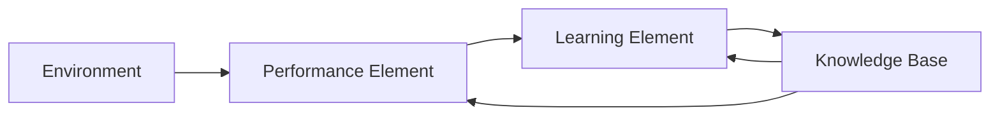
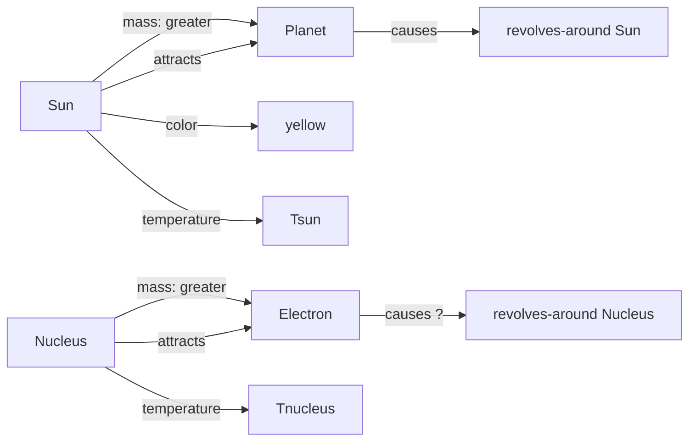
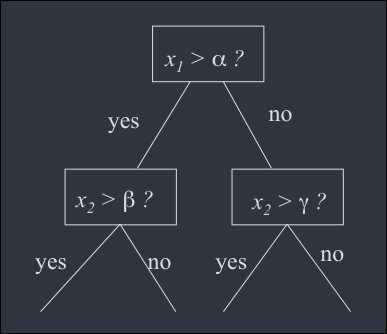
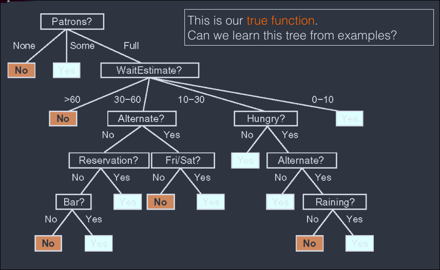
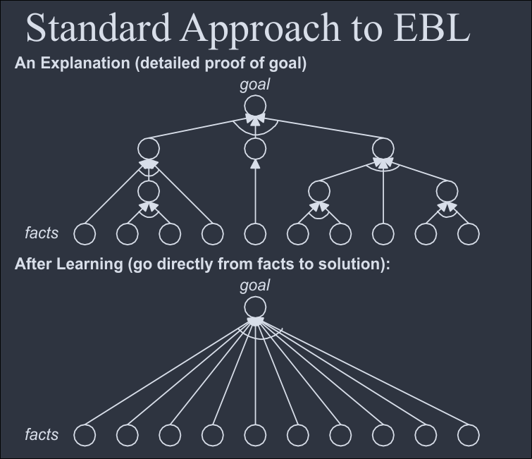
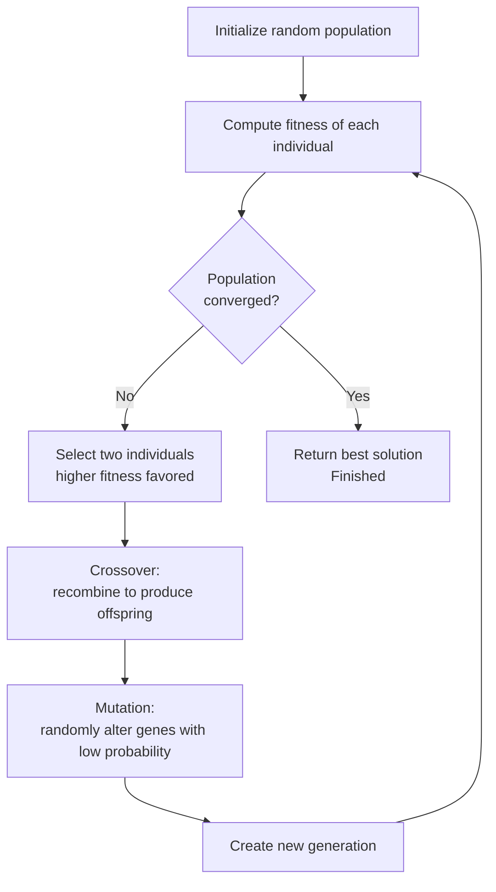
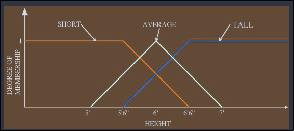
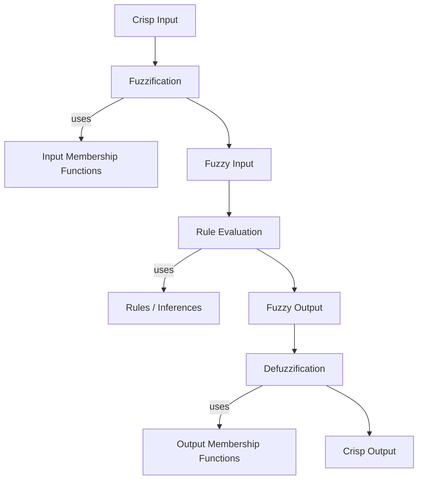
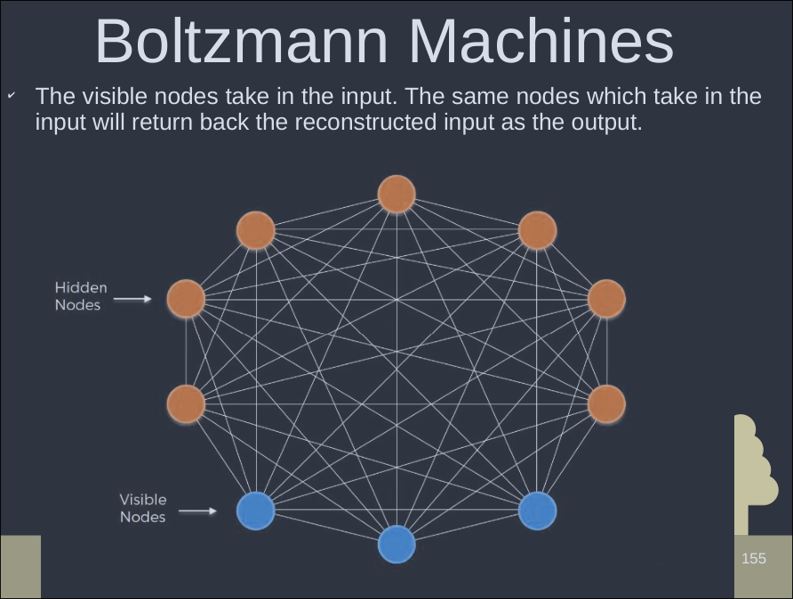

# Exam Frequency Table (BS years across papers)

| Topic | Typical Marks | Frequency |
|---|---|---|
| Supervised vs Unsupervised (vs Reinforcement) Learning, with examples | 4–8 | Very High |
| Machine Learning definition + learning framework (block diagram) | 1–8 | Very High |
| Genetic Algorithm: operators (crossover, mutation, selection), steps with example | 5–10 | Very High |
| Fuzzy Logic: definition, when to use, steps/Mamdani inference with example | 3–8 | Very High |
| Learning by analogy (with semantic network example) | 1–8 | Moderate–High |
| Inductive learning + ID3 decision tree process (best attribute selection, deferred numerical) | 2–8 | High |
| Induction vs Deduction | 3 | Moderate |
| Boltzmann Machine — definition, working | 1–8 | Moderate |
| Neural Networks — learning (supervised/unsupervised in NN context) | 4 | Moderate (often bundled with the general supervised/unsupervised question) |

---

# Concepts of Learning

## What is Learning

- Learning is one of those everyday terms which is broadly and vaguely used in the English language.
- Learning is making useful changes in our minds.
- Learning is constructing or modifying representations of what is being experienced.
- Learning is the phenomeonon of knowledge acquisition in the abscence of explicit programming.
- Herbert Simon:
    - Learning denotes changes in the system that are adaptive in the sense that they enable the system to do the same task or tasks drawn from the same population more efficiently and more effectively next time.

### 3 Factors of Learning

1. **Changes**:
    - Learning changes the learner.
    - For machine learning, the problem is determining the nature of these changes and how to best represent them.
2. **Generalization**:
    - Learning leads to generalization
    - Performance must improve on same and similar tasks.
3. **Improvement**:
    - Learning leads to improvements
    - machine learning must address the possibility that changes may degrade performance, and find ways to prevent it.

### Example: Spam Filtering via Logistic Regression

- Changes:
    - the algorithm updates word weights for free/win/offer as high.
- Generalization
    - Correctly identifies a new, unseen mail like "Free lottery tickets" as spam
- Improvement
    - Accuracy increases from about 50% before training to 95% after training

# Machine Learning

- Machine Learning is a sub-field of computer science that evolved from the study of pattern recognition and computational learning theory in artificial intelligence.
- Machine learning explores the construction and study of algorithms that can learn from and make predictions on data.

## Why Machine Learning

- Many tasks would benefit from adaptive systems
    - Robot exploring Mars
    - Software agents
    - Speech, vision, language, etc.
- It is often easier to build a learning system than to hand-code a program of similar performance

## Areas of Influence for Machine Learning

Statistics, Brain Model, Adaptive Control Theory

Also by:

Cognitive Science, Computational Complexity Theory, Control Theory, Information Theory, Neuroscience, Philosophy, Psychology and Statistics

## Growth in ML

- Recent progress in algorithms and theory.
- Growing flood of online data
- Increasing availability of computational power.
- A budding industry, with three main niches:
    - Data mining: using historical data to improve decisions
    - Software applications we cannot program by hand
    - Self-customizing program

## The Learning Methods

| Aspect | Inductive Learning | Deductive Learning |
| --- | --- | --- |
| Direction of reasoning | From specific to general | From general to specific |
| Concerned with | Determining general patterns, organizational schemes, rules and laws from raw data, experience, or examples. | Determination of specifc facts using general rules, or the determination of new general rules from old general rules |
| Nature of conclusion | Conclusion are probable, not guaranteed | Conclusions are certain, given true premises |
| Example | Observing many examples of "Play Golf = yes/no" and inferring a decision tree | Applying "All mammals are animals" + "Cat is a mammal" = "Cat is an animal" |

## Different Kinds of Learning

(_frequently asked_)

- **Supervised Learning**
    - Data contains examples, and also right answer for those examples.
    - Need to predict the right answer for unseen examples.
- **Unsupervised Learning**
    - Data contains examples, but no feedback/result.
    - Need to find patterns in the data
- **Reinforcement Learning**
    - ML takes action, and is rewarded as per the work.
    - Machine has to learn how to get high rewards.

### Difference Table

| Aspect | Supervised Learning | Unsupervised Learning |
| --- | --- | --- |
| Training data | labeled data | unlabeled data |
| Feedback | Explicit feedback | no feedback from outside the machine or in data |
| Goal | Learn a mapping from inputs to known outputs | Discover hidden structure/pattern/grouping in data |
| Typical tasks | Classification, Regression | Clustering, Association, Dimensionality reduction |
| Example algorithms | Decision tree (ID3), linear regression | Hebbian learning, Self-organizing map |

## The learning framework

Four major components in a learning system



### The Environment

- Refers to the nature and quality of information given to the learning element.
- The **nature** of information depends on its level
- i.e. the degree of generality w.r.t the performance element.
    - **High Level**
        - information is abstract
        - deals with a broard class of problems
    - **Low Level**
        - information is detailed
        - deals with a single problem
- The **quality** of information involves
    - noise-free
    - reliable
    - ordered

### Learning Elements

Four Learning Situations

- **Rote Learning**
    - the environment provides information at the required level.
- **Learning by being told**
    - information is too abstract
    - the learning element must hypothesize missing data
- **Learning by example**
    - information is too specific
    - the learning element must hypothesize more general rules
- **Learning by analogy**
    - information provided is relevant only to an analogous task
    - the learning element must discover the analogy.

### The Knowledge Base (KB)

- **Expressive**
    - the representation contains the relevant knowledge in an easy-to-access fashion.
- **Modifiable**
    - it must be easy to change the data in the KB
- **Extendibility**
    - knowledge on how the database is structured, or knowledge about knowledge is meta-knowledge
    - the knowledge base must contain meta-knowledge
    - so that system cna change its own structure.

### The Performance Element

- **Complexity**
    - for learning, the simplest task is classification based on a single rule,
    - while the most complex task requires the application of multiple rules in sequence
- **Feedback**
    - the performance element must send information to the learning system,
    - used to evaluate overall performance
- **Transparency**
    - the learning element should have access to all the internal actions of the performance element.

# Learning by Analogy, Inductive Learning, Explanation-Based Learning

## Learning by Analogy

(*frequently asked*)

- Learning by analogy means acquiring new knowledge about an input entity by transferring it from a known similar entity.
- **Central theme**: if two entitis are similar in some aspects, then they could be similar in other respects as well.

Examples of analogies
- Pressure drop is like voltage drop
- a variable in programming language is like a box
- a simple hydraulics problem is analogous to Kirchhoff's First law

### Example

*"The hydrogen atom is like our solar system."*


- The sun has a greater mass than the Earth, and attracts it, causing the Earth to revolve around the sun.
- So, by analogy, nucleus having greater mass than electron and attracting it, causes the electrons to revolve around the nucleus

### Formal Structure

**Given**:
- A partially known **target entity, T** and a goal concerning it (e.g., partually understood structure of the hydrogen atom under study).
- **Background knowledge** containing known entities (knowledge from different domain like astronomy)

**Find**:
- New knowledge about T, obtained from a **source entity S** belonging to the background knowledge.
- Example: In a hydrogen atom, the electron revolves around the nucleus, in a similar way to how a planet revolves around the sun.

## Inductive Learning

(*frequntly asked*)

- **Classification** is the process of assigning the name of a class to a particular input the class which it belongs in.
- The classes from which the classification procedure can choose, can be described in a variety of ways
    - depending on the use to which they are put.
- Classification is an important component of many problem-solving tasks.
- Before classification can be done, the classes it will use must be defined.
    - Isolate a set of features relevant to the task domain
        - define each class by a weighted sum of the values of these features
        - e.g., weather prediction using rainfall, location of cold fronts, etc.
    - Isolate a set of features relevant to the task domain
        - define each class as a structure composed of these features
        - e.g., classifying animals using color, neck length, etc.
- The idea of producing a classification program that can evovle its own class definitions is called **concept learning** or **induction**

### Formal Structure

- Given a target function $f(x)$, and a training set of examples $D = \{[x_i, f(x_i)]\}$ for $i = 1, 2, \dots, N$
- The **learning task** is to find a hypothesis $h$ such that $h(x) \approx\ f(x)$.
- A hypothesis $h$ is **consistent** if it agrees with $f$ on all observations.
- **Ockham's Razor**: Select the simplest consistent hypothesis.
- The learning problem is **realizable** if $f(x) \in\ H$ (the true function lies within the hypothesis space being searched).
- In the *real* inductive learning problem, we must find an appropriate hypothesis space $H$ and minimze the expected distance to $f(x)$
- This distance is the **generalization error**
    - since data is never nosie-free or available in infinite amount.

### Learning Problem Types

- The hypothesis takes as input a set of attributes $x$ and returns a "decision" $h(x)$, the predicted output for input $x$.
- **Discrete-valued function** -> **Classification**
- **Continuous-valued function** -> **Regression**

## Inductive Learning of Decision Trees

(*Frequently asked*)

- **Decision trees** use a divide and conquer approach
    - split data into smaller and smaller subsets
    - usually splitting on a single varialbe at each node.
- **Simplest approach**
    - construct a decision tree with one leaf for every example (memory-based learning)
    - this does not generalize well
- **Advanced approach (ID3)**
    - split on each varialbe so that the purity of each resulting split increases
    - i.e. each subset becomes as close as possible to either all-yes or all-no.
- Purity is measured using **Entropy**

Example:


Example: wait at restaurand decision tree


### Entropy

$$\text{Entropy} = - P(\text{yes})\ln[P(\text{yes})] - P(\text{no})\ln[P(\text{no})]$$

General form:
$$\text{Entropy} = -\sum_i P(v_i)\ln[P(v_i)]$$

- Entropy is a measure of "order" or "disorder" in a system
    - the entropy is **maximal** when all possibilities are equally likely.
    - Entropy is **zero** in a pure "yes" node (or pure "no" node)
- The goal of the decision tree algorithm is to **decrease entropy** at each node.

## ID3 Decision Tree Learning Algorithm

1. Create pure nodes whenever possible
2. If pure nodes are not possible, choose the attribute/split that leads to the **largest decrease in entropy**
    - i.e., the **largest information gain**
3. Repeat this process recursively on each resulting subset, continuing to purify nodes, until all nodes are pure or no further useful split is available.

**Process for selecting the best (root) attribute**
- Compute the entropy of the entire dataset (based on the distribution of the target class, e.g., Yes/No).
- For each candidate attribute, compute the **weighted avaerage entropy** of the subsets created by splitting on that attribute
- Compute the **entropy decrease** (information gain) = (entropy before split) - (weighted entropy after split) for each attribute.
- Select the attribute with the **largest entropy decrease** as the splitting attribute (the root, for the first split).
- Repeat this process at each subsequent node using the remaining attributes and the corresponding subset of data, until the tree is complete.

### How do we know a Learned Hypothesis is Correct?

- We can never be fully certain that $h \approx\ f$ (this is related to *Hume's Problem of Induction*)
- Approach:
    - try $h$ on a new test set of examples
    - this is called **cross-validation**
- We assume the "principle of uniformity"
    - i.e., the result we get on test data should be indicative of results on future data
    - causality is assumed constant.

### How to Make Learning Work Well

- Use simple hypotheses, always start with the simplest ones first.
- Constrain the hypothesis space $H$ with priors, use domain knowledge or reasonable a priori beliefs on parameters.
- Use many observations, though this is much harder in practice
- Use cross-validation to get generalization

## Explanation-Based Learning (EBL) (not in pyq)

- Definition
    - learning general problem-solving techniques by observing and analyzing human solutions to specific problems.
- Learning complex concepts using induction procedures typically requires a substantial number of training sequences
    - but single example can be used to learn more, if good example:
    - like, we don't need dozens of +ve/-ve examples of "fork" position in chess
    - to learn to avoid or to exploit it in the future
- Single-example learning is made possible by knowledge.
- An EBL system attempts to learn from a single example $x$ by **explaining** why $x$ is an example of target concept.
- The explanation is then generalized, improving the system's performance.

### Inputs

An EBL program accepts the following as input

- A **training example**
- A **goal concept**
    - a high-level description fo what the program is supposed to be learning
- An **operational criterion**
    - a description of which concepts are usable.
- A **domain theory**
    - a set of rules describing relationships between objects and actions in a domain.

From these, EBL computes a generalization of the training example that is sufficient to describe the goal concept, while satisfying the operationality criterion

### The Standard Algorithm

2 Steps

1. **Explain**
    - the domain theory is used to prune away all unimportant aspects of the training example, w.r.t the goal concept.
    - What remains is an explanation of why the training example is an instance of the goal concept, expressed in terms of satisfying the operationality criterion.
2. **Generalize**
    - Before learning, reaching the goal requires a detailed, explanation-driven proof from the facts.
    - After learning, the system can go directly from facts to the solution/goal, bypassing the detailed proof.

### Standard Approach figure



# Genetic Algorithm

(*frequently asked*)

## Learning by Simulating Evolution

- **Motivation**: evolving a solution to a problem
- Genetic Algorithms model search as an evolutionary process, involving
    - Mutation
    - Crossover
    - Survival of the fittest
    - Survival of the most diverse

## Simulated Evolution Main Idea

- Begin with a **population of individuals** (candidate solutions, represented as "chromosomes").
- **Produce offspring with variation**:
    - **Mutation**: change features (genes) at random
    - **Crossover**: exchange features between individuals
- **Apply natural selection**: select the "best" individuals to go on to the next generation.
- Continue until satisfied with the solution

## Definition and Purpose

- GAs work by simulating the logic of **Darwinian Selection**, where only the best are selected for replication
- Only the most suited elements in a population are likely to survive and generate offspring, thus transmitting their biological heredity to new generations
    - i.e. select the best, discard the rest
- Genetic algorithms are majorly used for two purposes
    1. **Search**
    2. **Optimization**
- Genetic algorithms address complicated problems with many variables and a large number of possible outcomes by simulating "survival of the fittest" to reach a defined goal.
- They operate by generating many random answers to a problem, eliminating the worst, and cross-pollinating the better answers.
- Repeating this elimination and regeneration process gradually improves the quality of the answers to an optimal or near-optimal condition.

## Basic Components

Basic components, aka Operators, of GA

- A **fitness function** for optimzation
- A **population of chromosomes**
- **Selection** of which chromosomes will reproduce.
- **Crossover** to produce the next generation of chromoses.
- **Random mutation** of chromosomes in the new generation.

In computing terms, a genetic algorithm implements this model by using arrays of bits or characters (binary strings) to represent chromosomes.
Each string represents a potential solution.
The GA manipulates the most promising chromosomes, searching for improved solutions.

## Algorithm Cycle: 3 Stages

1. **Build and maintain a population** of solutions to a problem.
2. **Choose the better solutions** for recombination with each other.
3. **Use their offspring to replace** poorer solutions.

## Fitness function

- A fitness function must be specific to each problem being sovled.
- Given a particular chromose,
    - the fitness function returns a single numerical merit,
    - proportional to the utility of the individual that chromosome represents.

## Reproduction

- During the reproductive phase of the GA, individual are selected from the population and recombined.
- Parents are selected randomly from the population, using a scheme which favors individual with higher fitness scores.
- Having selected two parents, their chromosomes are recombined
    - typically using the mechanisms of **crossover** and **mutation**

### Crossover

- Crossover takes two individuals and cuts their chromosome strings at some randomly chosen position,
    - producing two "head" segments and two "tail" segments
- The tail segments are then swapped to produce two new full-length chromosomes
    - each of the 2 offspring inherits some genes from each parent.
- Types of Crossover
    - **Single-Point Crossover**:
        - a crossover point on the parent organism string is selected
        - all data beyond that point is swapped between the two parent organisms.
    - **Two-Point Crossover**:
        - a special case of N-point crossover
        - two random points are chosen on the chromosomes, and the genetic material between these points is exchanged
    - **Uniform Crossover**
        - each gene (bit) is selected randomly from one of the corresponding genes of the parent chromosomes (e.g., tossing a coin per gene).
        - the crossover between two good solutions may not always yield a better (or as good) solutions. Since parents are good, the probability of the child being good is high. If the offspring is poor, it will be removed in the next iteration during "Selection"

### Mutation

- Mutation is applied to each child individually, after crossover
- It randomly alters each gene with a small probability (typically 0.001)
- **Why mutation is important**:
    - mutation introduces new genetic material into the population
    - that may not have existed in either parent,
    - helping the algorithm escape local optima and maintain genetic diversity.
    - If no mutation, the population could converge prematurely to a sub-optimal solution and lose the ability to explore new regions of the search space.

### Mutation vs Crossover

| Aspect | Crossover | Mutation |
|---|---|---|
| Number of parents involved | Two (combines genetic material from two parents) | One (applied to a single individual/offspring) |
| Purpose | Exploits existing good genetic material by recombining it in new ways | Explores new genetic material not present in the current population |
| Probability of application | Typically high (applied to most reproducing pairs) | Typically very low (e.g. 0.001) |
| Risk if overused/underused | Overuse alone can lead to premature convergence, since it only recombines existing genes | Overuse introduces too much randomness, disrupting good solutions; underuse risks getting stuck at local optima |
| Role in the algorithm | Primary search operator | Secondary operator, a "safety net" against loss of diversity |

## Convergence

- If the GA has been correctly implemented,
- the population will evolve over succesive generations,
- so that the fitness of the best and the average individual in each generation
- increases towards the global optimum.

## Algorithm / Pseudocode

```
Initialize a random population of individuals
Compute fitness of each individual
WHILE NOT finished BEGIN       /* produce new generation */
    FOR population_size BEGIN  /* reproductive cycle */
        Select two individuals from old generation,
            recombine the two individuals to give two offspring
        Make a mutation for selected individuals
            by altering a random bit in a string
        Create a new generation (new population)
    END

    IF population has converged THEN
        finished := TRUE
END
```



## When to use GA

- There are multiple **local optima** in the search space
- The objective function is **not smooth** (so derivative-based/gradient methods cannot be applied)
- The **number of parameters** is very large.
- The objective function is **noisy or stochastic**

## Applications

- Searching parameter space for an optimal assignment (not guaranteed to find the optimal, but can approach it)
- Classic optimzation problems, e.g., the Traveling Salesman Problem
- Program design ("Gentic Programming")
- Aircraft carrier landings, and other real-world optimization/search problems

## Genetic Algorithms as a Search Technique — Fitness Schemes

- Evolution mechanisms used as a search technique:
    - Produce offspring with variation (mutation, crossover).
    - Select the "fittest" to continue to the next generation, where fitness represents the probability of survival:
        - **Standard**: quality values only.
        - **Rank**: rank (of quality) only.
        - **Rank-space**: rank of the sum of quality and diversity ranks.
- A large population can be robust to local maxima, since it maintains diversity across many candidate solutions simultaneously.

---

# Fuzzy Learning

(*frequently asked*)

## Why use FL

- A large amount of data can constitute a proportionately large amount of information,
    - but this comes with a level of uncertainty.
- When KB becomes larger, complexity increases.
- Precise data is not recalled, and uncertainty arises.
- This is when things get "fuzzy"
- Fuzzy logic deals with how we capture this essence of comprehension and embed it in a system.
- This comprehension, as per **Lotfi Zadeh** (founder of fuzzy logic), confers a higher machine intelligence quotient to computer system.

## Where to apply FL

as an example:

- **Problem Setup**
    - a solid pendulum is hinged at its base to a platform which can move in opposite directions
    - the pendulum can move in the same plane as the platform.
- **Objective**
    - keep the pendulum upright by compensating for its tilt, via corresponding movements of the platform

### Using Control System (the classic approach)

- **Input measurements needed**
    - the angle the pendulum makes with Normal.
    - the angular velocity of the pendulum.
    - the rate of change of this velocity
- Output needed
    - the direction, velocity, and chahnge in velocity of the platform
- Requires finding a suitable relation between these variables
    - this can become complicated and demands a lot of computing power.

### Using Human Controller Approach

- When the pendulum tilts, we informally measure the nature of the movement
    - how much it has moved, in what direction and how quickly
- We automatically make a corresponding compensating movement
    - without explictly quantifying these factors, using quick estimations
- logic is similar to: If the pendulum tilts slightly right, so move my hand slightly to right
- The key ability is to make sufficiently accurate estimations, build rules from them, and then act on these rules.
    - using abstract concepts like "a little", "a lot", "quickly", "slowly"
- FL provides a means by which computers can imitate this kind of human estimation
- FL doesn't deal with **strict** A, NOT A statements, only **MOSTLY A**.

## Fuzzy Sets and Membership Function

- If $U$ is a collection of objects denoted generically by $x$,
    - then a fuzzy set $A$ in $U$ is defined as a set of ordered pairs:
    $$A = \{(x, \mu_A(x)) \mid\ x \in\ U\} $$
    - where $\mu_A(x)$ is called the **membership function** or (degree of membership) of $x$ in $A$, and $U$ is the **universe of discourse**
- Unlike a crisp (classical) set, where an element either fully belongs (membership = 1) or doesn't belong (membership = 0),
    - in fuzzy set, an element can have a degree of membership anywhere between 0 and 1 (inclusive)
    - representing a matter of degree.
- **Fuzzy truth**, $T$: the likelihood of a predicate being true, given a crisp input value.
- **Degree of membership**, $\mu(x)$: how much a given crisp input value belongs to a fuzzy set.

### Representation of Knowledge

#### Fuzzy Sets

Fuzzy sets define attributes, e.g.:
- Height: TALL, AVERAGE_HEIGHT, SHORT
- Build: FAT, MEDIUM, SLIM
- Weight: HEAVY, MEDIUM, LIGHT

Membership representation:


#### Fuzzy Rules

- If a man is tall and fat, then he will be heavy in weight
- If a man is tall and slim, then he will be average in weight
- If a man is tall and of medium build, then he will be heavy in weight.
- If a man is short and fat, then will be average in weight.
- If a man is of average height and fat, then he will be heavy in weight.
- If a man is of average height and slim, then he will be light in weight.
- If a man is of average height and of medium build, then he will be medium in weight.

## Fuzzy Rule-Based System

Steps involved in Fuzzy learning/logic:

### Step 1: Fuzzification

- The process by which crisp (non-fuzzy) input values are converted into their fuzzy representations.
- Example: a crisp input value of 6'3" for height,
    - fuzzification entails applying this value to the fuzzy set "TALL"
    - yeilding a degree of membership
- This process takes place for *all inputs* in all corresponding fuzzy sets, yielding fuzzified membership functions for use in each rule.

### Step 2: Inference (Rule Evaluation)

- **Min-Max inference**
    - IF A is X **and** B is Y, then C is $\min(X, Y)$.
    - IF A is X **or** B is Y, then C is $\max(X, Y)$.
    - e.g., If $X = 0.75$ and $Y = 0.25$, AND combination would get degree = minimum of them = 0.25.
- Compute all rules that apply
    - i.e., for any fuzzy set of which input value is a member
- Combine results by unifying the sets (aggregating).

### Step 3: Defuzzification

- The **opposite** of fuzzification - entails rationalizing a fuzzified output to maintain a **crisp value** for the output
- Several methods can be used,
    - common is **Center of Gravity (Centroid) Method**
    - Find the center of gravity of the fuzzified output membership function, and return the crip value corresponding to that point.

### Summary of Operations
 


## Mamdani Fuzzy Inference Method

- The most commonly used fuzzy inference technique is the **Mamdani Method**.
- In 1975, Professor **Ebrahim Mamdani** of London University built one of the first fuzzy systems, to control a steam engine and boiler combination
- Original goal was to control a steam engine and boiler combination using a set of linguistic control rules obtained from experienced human operators.

### Operating Steps

1. Determine a set of fuzzy rules.
2. Fuzzify the inputs, using the input membership functions.
3. Combine the fuzzified inputs according to the fuzzy rules, to established a **rule string** (fuzzy operations, e.g., min-max)
4. Find the consequence of the rule by combining the rule strength and output membership function (**implication**).
5. Combine the consequence to get an output distribution (**aggregation**)
6. Defuzzify the output distribution, only a crisp output (class) is needed.

# Boltzmann machines

## Definition

- A **Boltzmann Machine** is a type of stochastic, energy based neural network.
- It is named after the **Boltzmann Distribution**, which it uses for its probabilitic approach to learning
- Invented by **Geoffrey Hinton** and **Terry Sejnowski** in 1985.

## Working Principle

- The working of a Boltzmann Machine is mainly inspired by the Boltzmann Distribution
    - which states that the current state of a system depends on
    - the energy of the system and the temperature at which it is currently operating
    $$p_i \propto\ e^{-\varepsilon_i/kT}$$
    - where $p_i$ is the probability of the system being in state $i$,
    - $\varepsilon_i$ is the energy of that state, 
    - $k$ is the product of Boltzmann's constant and
    - $T$ is the thermodynamic temperature.
- When Boltzmann machines are employed in learning,
    - they try to derive important features from the input,
    - reconstruct this input and render it as output,
    - through parallel updation of weights.

## Structure

- A boltzmann machine is an **undirected graph** with:
    - **Visible Units (V)**: represent input/output data
    - **Hidden Units** (H): represent input/output data
    - **Connections**: each pair of units (visible-visible, visible-hidden, hidden-hidden) is symmetrically connected
    - there are no self-loops.
- There is no clear distinction between an input/output layer
    - The nodes are simply categorized as visible/hidden instead of output layer
- The visible nodes take in the input, and the **same** nodes return the reconstructed input as output
- This is achieved through **bidirectional weights**, which propagate backwards and render the output on the visible nodes.
- Every node has only two possible states: **on** and **off**
- The state of a node is determined by the weights and biases associated with it.

Example of Boltzmann Machine

