** 14 Hours**
# Neural Networks
- Neural nets are basically mathematical models of information processing
- Neural nets refer to machines that have a structure that, at some level, reflects what is known of the structure of the brain
- A neural network is a massively parallel distributed processor
## Biological vs Artificial Neuron
- Computers point of view, an ANN is just:
    - parallel computational system consisting of many simple processing elements connected together in a specific way in order to perform a particular task.
    - Massive parallelism, fault and noise tolerant.
    - In principle, they can do anything a symbolic/logic system can do and more
    - NN is used for Brain Modeling, Artificial System Construction
- Biological Neuron
    - Neurons encode their outputs as brief electrical pulses known as spikes.
    - Soma processes incoming activations and generates output activations
    - Axon
        - one per neuron
        - excites up to 10$^4$ other neurons
        - all or nothing output signal
    - Dendrites
        - 1 to 10$^4$ per neuron
    - Axons act as transmission lines, sending action potentials to other neurons.
    - Synapses are junctions between axons and dendrites where neurotransmitters facilitate signal transmission through diffusion.
- Difference Table:
<table>
    <tr>
        <th>Aspect</th>
        <th>Human Brain</th>
        <th>ANN</th>
    </tr>
    <tr>
        <td>Structure
        <td>Highly complex and intricate
        <td>Designed with layers of interconnected neurons
    </tr>
    <tr>
        <td>Number of Neurons
        <td>Approximately 86 billion neurons
        <td>Variable, can range from a few to billions
    </tr>
    <tr>
        <td>Processing Speed
        <td>Slower processing compared to ANNs (Few Hundred Hz)
        <td>Extremely fast processing capabilities (in GHz)
    </tr>
    <tr>
        <td>Memory Capacity
        <td>Estimated to be around 2.5 petabytes
        <td>Limited memory capacity dependent on architecture
    </tr>
    <tr>
        <td>Energy Efficient
        <td>Relatively energy-efficient
        <td>Can be energy-intensive
    <tr>
        <td>A contrast
        <td>Vision: 1000 Supercomputer
        <td>Arithmetic: 10 brains (even by a pocket computer)
    </tr>
</table>

## Network Structure
### Elements of NN
- Weighing factor (W)
    - The values w1, w2, w3 ... wn are weights to determine the strength of input x1, x2, x3 ... xn.
        $$X = x_1 w_1 + x_2 w_2 + x_3 w_3 + ... + x_n w_n = \sum_{i=1}^{n} x_i w_i$$
- Threshold ($\psi$)
    - The magnitude offset value of the node.
    - Affects the activation of the node output Y as:
        $$Y = f(x) = f\left\{ \sum_{i=1}^{n} x_i w_i - \psi\right\}$$
    - Neurons do not fire unless their total input goes above a threshold value.
- Activation function
    - An activation function f performs a mathematical operation on the signal output.
    - Activation decision, introduces Non-linearity, Gradient Computation.
- Learning Rate ($\alpha$)
    - A constant in the algorithm of a neural network that affects the speed of learning
    - controls the step size when weights are iteratively adjusted
    - if too high - the algorithm may oscillate and become unstable
    - if too small - the algorithm will take too long to converge
- Basic learning principle
    - Neurons that fire together wire together
        - Hebbian learning for synptic plasticity
    - Backpropagation or error backpropgation
### Activation Functions
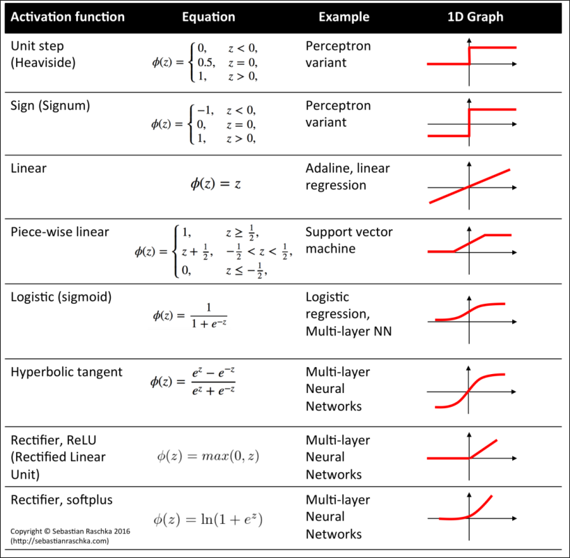
### Types of Neural Networks
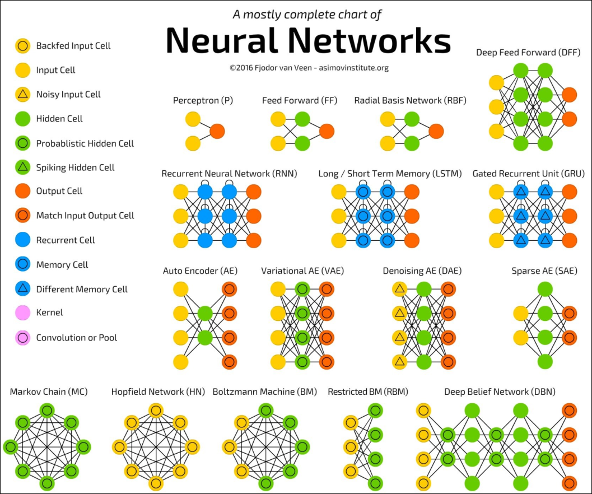
#### Feed-Forward Networks
- Feed-forward ANNs allow signals to travel one way only:
    - from input to output
- Thereis no feedback (loops) i.e. the output of any layer does not affect the same layer.
- Figure
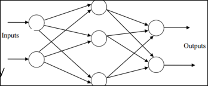
#### Feedback Networks (Recurrent Networks)
- Feedback networks can have signals travelling in both directions by introducing loops in the network
- Feedback networks are very powerful and can get extremely complicated
- Feedback architectures are also referred to as interactive or recurrent.
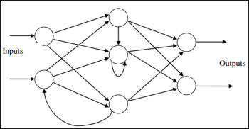
### McCulloh/Pitts Neuron
- One of the first neuron models to be implemented
- Its output is 1 (fired) or 0
- Each output is weighted with weights in the range 0 to 1
- It has a threshold value, T
- Diagramatic Representation
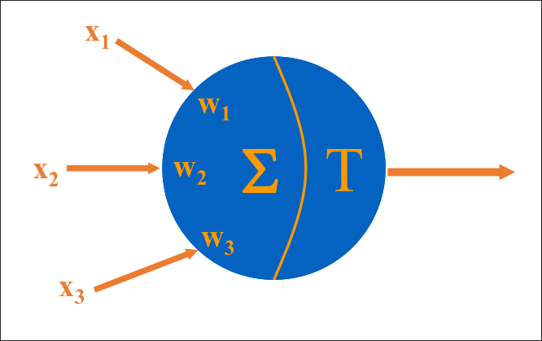
    - The neuron fires if the following inequality is true:
        $$X_1 W_1 + X_2 W_2 + X_3 W_3 > T$$
#### OR Example
- Goal:
    - Construct an MCP neuron which will implement the OR gate.
- Problem:
    - find the threshold, T, and the weights w$_1$ and w$_2$ where:
        - F is 1 if $x_1 w_1 + x_2 w_2 > T$
- Each line of the function table places condition on the unknown values:
    - T > 0
    - w$_1$ > T
    - w$_2$ > T
    - w$_1$ + w$_2$ > T
- Solution
    - w$_1$ and w$_2$ = 0.7
    - T = 0.5, these values work.
### Hebbian Learning
- The oldest and most famous of all learning rules is Hebb's postulate of learning:
    - When an axon of cell A is near enough to excite a cell B
    - and repeatedly or persistently takes part in firing it,
    - some growth process or metabolic changes take place in one or both cells
    - such that A's efficiency as one of the cells firing B is increaased
- aka: Neurons that fire together wire together
- Application to ANN:
    - if two interconnected neurons are both "on" at the same time, then the weight between them should be increased
#### Steps
0. Initialize all weights to 0
1. Given a training input, s, with its target output, t, set the activations of the input units: x$_i$ = s$_i$
2. Set the activation of the output unit to the target value: y = t
3. Adjust the weights: w$_i$(new) = w$_i$(old) + x$_i$ y
4. Adjust the bias (just like the weights): b(new) = b(old) + y
#### Example
- Training Set:
    - 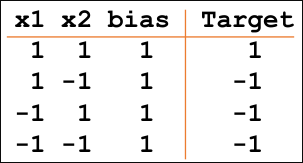
- Problem:
    - Construct a Hebb Net which performs like an AND function, that is, only when both features are "active" will the data be in the target class.
- Initialize the weights to 0.
- Present the first input (1 1 1) with a target of 1
    - w$_1$(new) = w$_1$(old) + x$_1$ t = 0 + 1 = 1
    - w$_2$(new) = 1
    - b(new) = b(old) + t = 0 + 1 = 1
- Present the second input (1 -1 1) with a target of -1 and update the wieghts
    - w$_1$(new) = 1 + 1 (-1) = 0
    - w$_2$(new) = 1 + (-1)(-1) = 2
    - b$_3$(new) = 1 + (-1) = 0
- For (-1, 1, 1) with -1
    - w$_1$(new) = 0 + -1 (-1) = 1
    - w$_2$(new) = 2 + (1)(-1) = 1
    - b$_3$(new) = 0 + (-1) = -1
- For (-1, -1, 1) with -1
    - w$_1$(new) = 1 + -1 (-1) = 2
    - w$_2$(new) = 1 + (-1)(-1) = 2
    - b$_3$(new) = -1 + (-1) = -2
- Final result
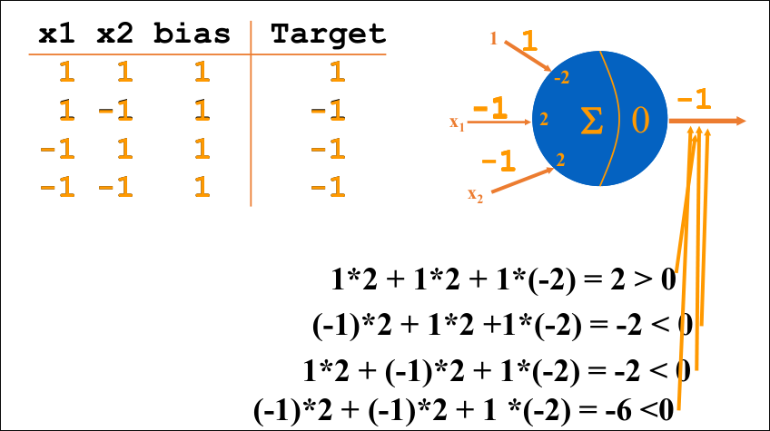
## Adaline Network
- Adaptive Linear Neuron is a network with single linear unit.
- Variation on the perceptron network:
    - inputs are +1 or -1
    - outputs are +1 or -1
    - uses a bias input
- Figure:
    - 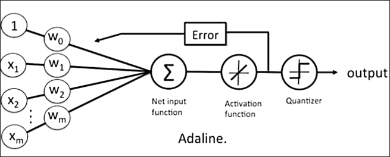
- Differences:
    - trained using the Delta Rule 
        - which is also known as the least mean square (LMS) or Widrow-Huff rule
        - the activation function, during training is the identity function
        - after training the activation is a threshold function
### Algorithm
0. Initialize the weights to small random values and select a learning rate, $\alpha$.
1. For each input vector s, with target output, t, set the inputs to s.
2. Compute the neuron inputs.
3. Use the delta rule to update the bias and weights
4. Stop if the largest weight change across all the training samples is less than a specified tolerance, otherwise cycle through the training set again.

Formulas:
- Neuron Input:
    - y$_{in}$ = b + $\Sigma$x$_i$w$_i$
- Delta Rule:
    - b(new) = b(old) + $\alpha$(t - y$_{in}$
    - w$_i$(new) = w$_i$(old) + $\alpha$(t - y$_{in}$) x$_i$
### Learning Rate
- THe performance of an ADALINE neuron depends heavily on the choice of learning rate
    - if it is too large, the system will not converge
    - if it is too small, the convergence will take too long
- Typically, $\alpha$ is selected by trial and error
    - typical range: 0.01 < $\alpha$ < 10.0
    - often start at 0.1
    - sometimes it is suggested that:
        - 0.1 < n$\alpha$ < 10.00
        - where n is the number of inputs
### Example: And Gate
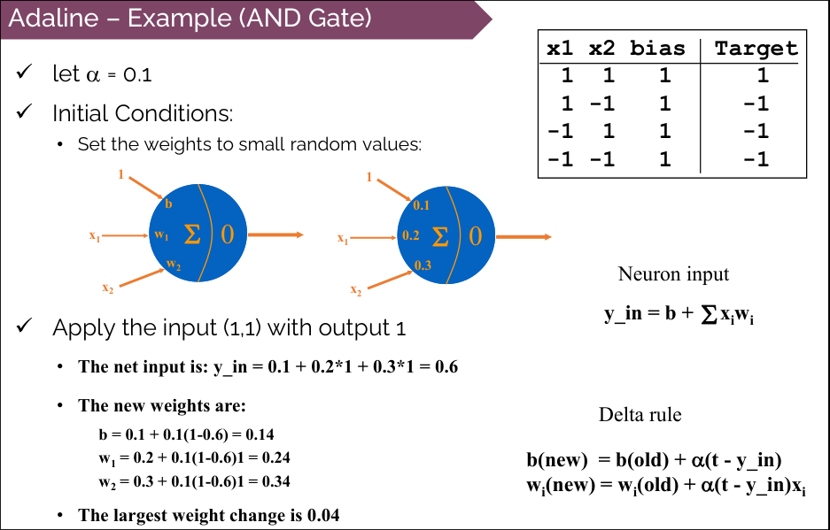
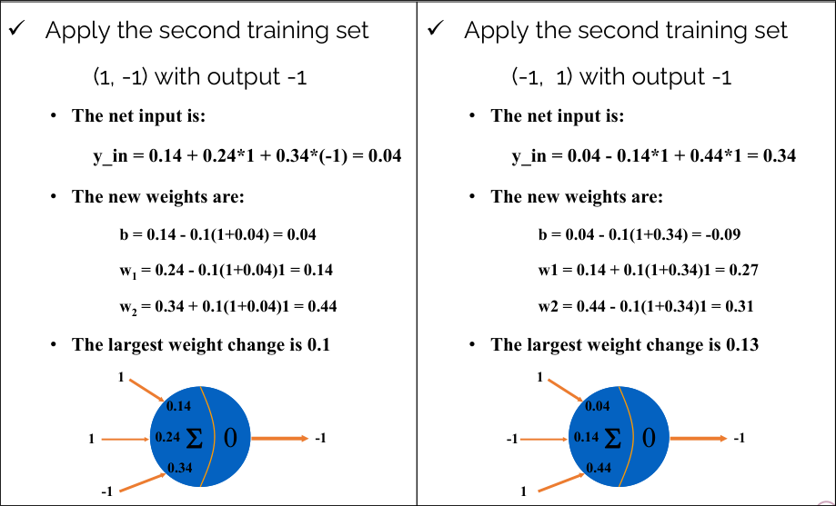
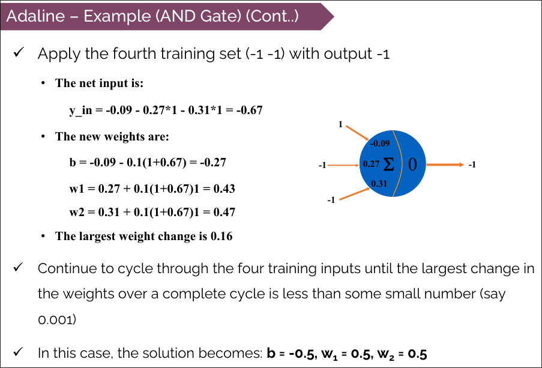
### Properties
- The values of the weights determine the function computed
- A network with one hidden layer is sufficient to represent every boolean function.
## Perceptron
- The perceptron was suggegsted b Rosenblatt in 1958.
- It uses an iterative learning procedure which can be proven to converge to the correct weights for linearly separable data.
- It has a bias and a threshold functino
- Perceptron Learning Rule:
    - Weights are changed only when an error occurs
    - The weights are updated using the following:
        $$w_i(\text{new}) = w_i(\text{old}) + \alpha t x_i$$
    - t is either +1 or -1
    - $\alpha$ is learning rate
- If an error does not occur, the weights are not changed.
### Limitations
- The perceptron can only learn to distinguish between classifications if the classes are linearly separable
- If the problem is not linearly separable then the behavior of the algorithm is not guaranteed
- if the problem is linearly separable, there may be a number of solutions.
- The algorithm as stated gives no indication of the quality of the solution found.
- XOR Problem
    - A perceptron networ can not implement an XOR function.
    - XOR(x1, x2):
        - w$_0$ + 0 w$_1$ + 0 w$_2\ \le$ 0 
        - w$_0$ + 0 w$_1$ + 1 w$_2\ \gt$ 0 
        - w$_0$ + 1 w$_1$ + 0 w$_2\ \gt$ 0 
        - w$_0$ + 1 w$_1$ + 1 w$_2\ \le$ 0 
    - There is no assignment of values to $w_0, w_1, w_2$ that satisfies above inequalities.
## Multilayer Perceptron, Back Propagation
- Perceptron can be improved if placed in a multilayered network
### Backpropagation Intuition
- The term is an abbreviation for "backwards propagation of errors".
- Method for fine tuning the weights of NNs based on error.
- Algorithm:
    - Initialize the initial weights and bias to small random values.
    - Compute the forward propagation for input dataset
    - Use gradient descent algorithm to update the weight
        - Calculate the error gradient as: $\dfrac{\partial E(O, t)}{\partial w_{ij}}$
        - Calculate the weight correction as: $\Delta w_{ij} = \eta \dfrac{\partial E(O, t)}{\partial w_{ij}} = \eta \delta_i h_i$
        - Update the weight at output of neuron as:w$_{ij}$(new) $\leftarrow$ w$_{ij}$(old) - $\Delta$w$_{ij}$
        - values:
            - o = actual output
            - t = target output
            - h$_i$ = output of ith hidden layer
            - w = weight
    - Update the bias
    - Repeat until convergence or maximum cycles.
### Backpropagation - XOR Example
- Since OR problem is not linearly separable, w need to use hidden neurons.
- Use error/loss function L(o, t) = 1/2 (0 - t)$^2$
- Activation function f(x) = $\frac{1}{1 + \exp(-x)}$ sigmoid function
- Complete Network:
    - 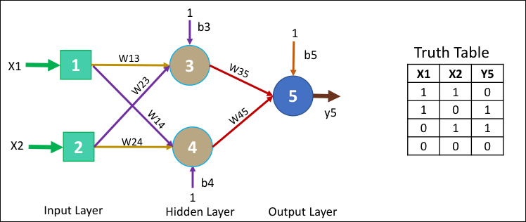

- Solving
    - 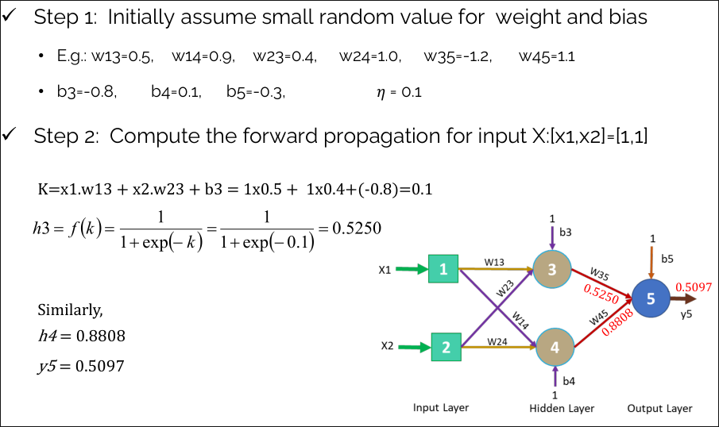
    - 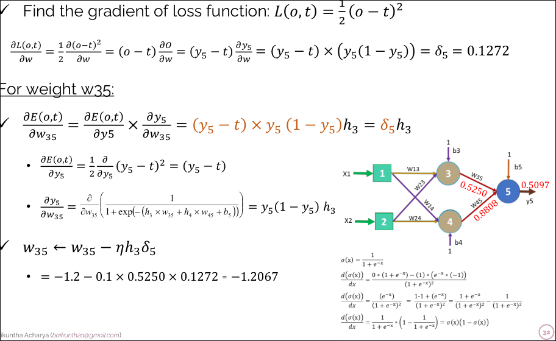
    - 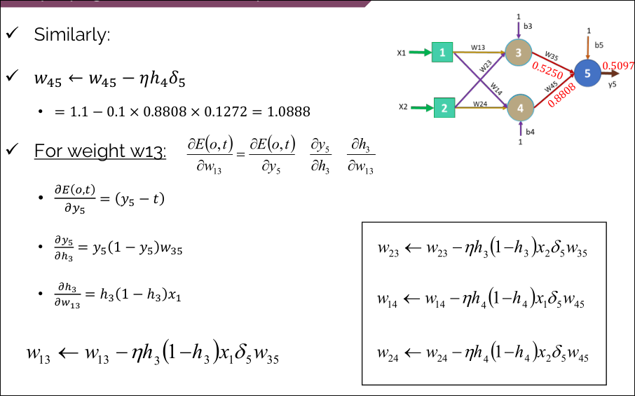
## Hopfield Network
- Hopfield (1982) introduced an NN that he proposed a theory of memory
- It has fully connected one signle layer ,with each neuron connected to every other neuron.
- Featuers:
    - Distributed representation
    - Asynchronous Control
    - Content-Addressable Memory
    - Fault Tolerance
- Parallel Relaxation Algorith:
    - Compute the sum of the weights on the connections of active neighbors until the network reaches a stable state.
    - If teh sum > threshold $\rightarrow$ Activate the neuron.
- Given Example:
    - 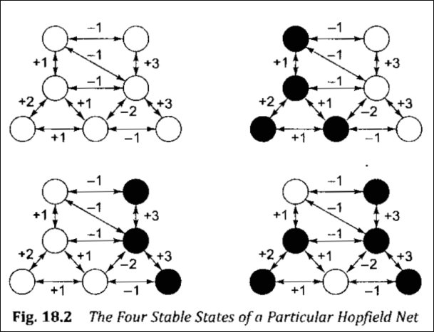
    - if the netwrok starts in the state shown, only four distinct stable states are possible.
    - The network can be thought of storing the patterns
    - The network can be used as content-addressable memory.
    - To retrieve a pattern:
        - we only need to supply a portion of it.
        - the network settle into the stable state that best matches the partial pattern.
## Kohonen Network
- The Kohonen neural network is an example of self-organization and competitive learning.
    - low-dimensional, topological ordered representation of high-dimensional input data.
- There contains only  a feed-forward input and output layer of neurons.
    - no hidden layer, activation function or bias weight.
- When a pattern is presented to a Kohonen network one of the output neurons is selected as a "winner", which is the output.
- Unsupervised learning
- Grid like output layer
- Used for
    - dimensionality reduction, Data visualization, Clustering, Feature extraction.
### Algorithm
1. Initialize the network with random weight vectors for each neuron.
2. Define learning rate (alpha) and neighborhood radius (sigma)
3. Present input data to the network.
4. Find the best matching unit (BMU) by selecting the neuron with the closest weight vector to the input data.
5. Update all the neuron's weight vectors based on their distance from the BMU and the learning rate
6. Decrease the learning rate and neighborhood radius over time.
7. Repeat the steps 3 to 6 until convergence or a set number of iterations
8. The final weight vectors represent the compressed representation of the input data in a 2D Map.
# Expert System
- An expert system is a computer which:
    - Simulates the decision-making process of a human expert in a specific domain.
    - Performance is guided by specific, expert knowledge in solving problems.
    - Solves problems in a narrow problem area by using high-quality, specific knowledge rather than an algorithm.
- THe expert knowledge must be obtained from specialists or other sources of expertise, such as:
    - texts, journals, articles and data bases.
- Figure:
    - 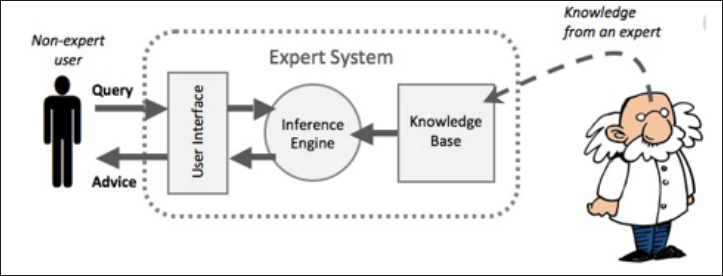
## Architecture of an expert system
- Knowledge Base
    - a data structure with rules and expert knowledge
    - knowledge in expert systems is usually implemented as RULE.
    - A rule is an IF-THEN type statement
        - IF <*certain statements are true*> then <*take certain actions*>
    - Knowledge is information that has been
        - intepreted, categorized, applied, experienced and revised.
    - Types of knowledge:
        - Procedural Knowledge:
            - information about courses of action
            - knowing how
        - Declarative Knowlege
            - facts about objects, events and situations
            - knowing what
        - Episodic Knowledge:
            - Experiental
        - Meta-Knowledge
            - Knowledge about Knowledge
        - Sources of Knowledge:
            - Expert (primary source) Secondary/Tertiary Experts
            - Literature (Reports, Guidelines, Books, Manuals, etc.)
            - End Users
        - Rule Types:
            - Relationship
                - FACT
                - IF the battery is dead THEN the car will not start
            - Recommendation
                - IF teh car will not start THEN take a cab
            - Directive
                - IF the car will not start AND the fuel system is ok THEN checkout the electrical system
            - Heuristic:
                - IF the car will not start AND the car is a 1957 Ford THEN check the float
        - Meta Rules:
            - Rules that express knowledge about other knowledge should be used.
            - e.g., IF the car will not start AND the electrical system is operating properly THEN use fuel_system_rules
    - Figure:   
        - 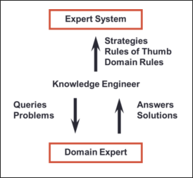
- Working memory
    - a data strucutre with information about a problem.
- Inference Engine
    - a set of procedures for matching knowledge base
    - Figure:
        - 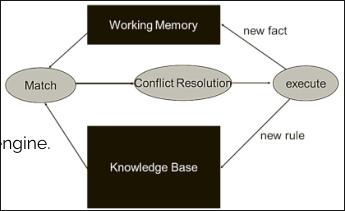
    - aka
        - control structure
        - the interpreter
    - the inference engine is the mechanism for:
        - matching facts with rules and using the results to update the knowledge base
        - extracts the knwoledge from the knowledge base
    - most inference engines are based on the applciation of a logical reasoning rule
        - Modus Ponens (P1: If A then B, P2: A is true, Conclude: B is true)
        - Forward and backward chainingg
    - Recognize-Select-Act Cycle
        1. Match:
            - Rules are compared to working memory to determine matches
        2. Conflict Resolution:
            - Select or enable a single rule for execution
        3. Execute:
            - Fire teh selected rule
- User Interface
    - Controls the dialog between user and the system
    - component of an expert system that communicates with the user
    - the communication performed by a user interface is bidirectional
    - we may want to ask the system to explain its reasoning, or the syhstem may request additional information about the problem from us.
- Diagramatic representation:
    - 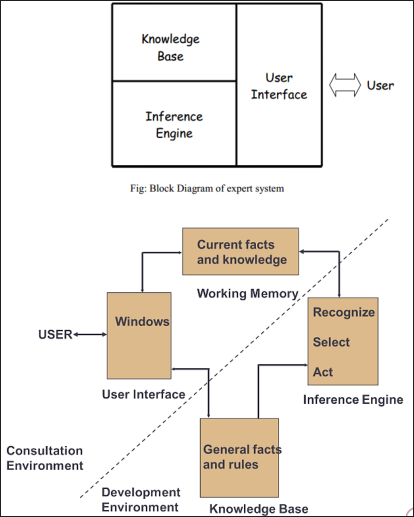
## Features of ES
- Goal driven reasoningg (backward chaining) or data driven reasoning (forward chaining)
- Explanations (ability to explain solution with respect to specific problem)
- Use symbolic representation for knowledge)
- Should have meta knowledge
- The program should be useful, usable
- The program should be educational when appropriate
- The program should be able to learn new knowledge
- The program's knowledge should be easily modified.
## Applications
- Business
- Manufacturing
- Medicine
- Engineering
- Applied Sciences
- Military and space
- Transportaion
- Eductiaon
- Imageg analysis
- Chemical structure
- Architecture
- Robotics and many more.
## Merits/Demerits
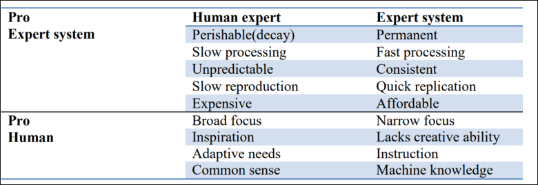
## Knowledge acquisition, induction
## Development of expert systems
- Knowledge Acquisition:
    - Gather expertise from human experts
    - Capture rules, facts, heuristics and procedures,
    - Expert sources can be domain specialist, articles, journals, database, etc.
    - iteratively refined until it approximates expert-level performance.
    - Use interviews, questionnaires, and observations
    - Automatic ways of constructing expert knowledge bases are efficient approach
- Knowledge Representation:
    - Knowledge representation can be logical representation or structured representation
    - use techniques like production rules, frames, or ontologies
    - Make information accessible for the inference engine
- Knowledge Inferencing
    - Utilize the knowledge base for reasoning
    - Knowledge inference refers to acquiring new knowledge from existingg facts based on certain rules and constraints
    - Mostly rule based reasoning (FC/BC) is used for inferencing
- Knowledge Transfer
    - Integrate the expert system into the target environment
    - Train end-users to effectively utilize the system
- Deployment
    - Implement the expert system for real world use
    - Monitor its performance and gather feedback.
## Example: MYCIN
- Expert System for treating blood infections
- Diagnose patients based on reported symptoms and medical test results
- Could ask some more information and lab test results for diagnosis
- Recommend a course of treatment, if requested.
    - MYCIN would explain the reasoning that lead to its diagnosis and recommendation
- Use about 500 production rules.
    - MYCIN operated roughly the same level of competence as human specialists in blood infections
- use backward chaining for reasoning.
## Example: DENDRAL
- First ES developed in late 1960s at Stanford University
- Designed to analyze mass spectra
    - mass spectra are graphs representing the fragmentation pattern of a molecule when subjected to ionization
- Based on the mass of fragments seen in the spectra, it would be possible to make inference as teh nature of molecule tested, identifying functional groups or even the entire molecule.
- used heuristic knowledge obtained from experienced chemists
- Use forward chaining for reasoning.
# Natural Language Processing and Machine Vision
## NLP
- Natural Language Processing (NLP)
    - Process of computer analysis of input provided in a human language (natural language) and conversion of this input into a useful form of representation
- NLP is one of field of AI that p[rocesses or analyzes written in spoken languageg
 - NLP invovle processing of grammar, speech and meaning
- NLP is composed of two parts:
    - NLU (Natural Language Understanding)
    - NLG (Natural Languageg Generation)
- Figure
    - 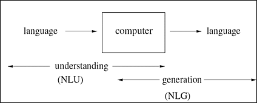
- Example
    - 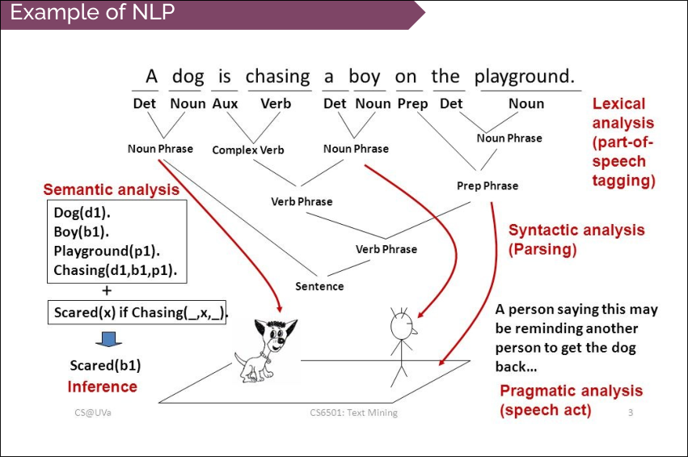
### NLP Steps/Processes
- Figure:
    - 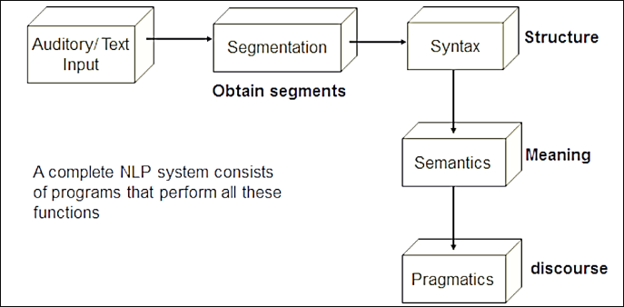
- Input/Source:
    - the input of an NLP system cna be written text or speech.
    - Quality of input decides the possible errors in language processing i.e., high quality input leads to correct language understanding
## Levels of Analysis: Phonetic, Syntactic, Semantic, Pragmatic
- Lexical Analysis (Segmentation/Tokenization)
    - Purpose:
        - divide the input text into smaller segments (frames) for language processing tasks
        - part of speech tagging, entity recongnition and sentiment anaylsis
    - Tokenization rules:
        - defines rules for splitting text based on spaces, punctuation, etc.
    - Ambiguity:
        - handle cases like contractions (can't) or seprate tokens (can and not)
    - Case sensitivity:
        - decide whether to treat uppercase/lowercase words as different tokens
    - Special Cases:
        - recognize and handle dates, URLs, numerical expressions, etc.
    - Example:
        - Input text: "I love NLP, its fascinating"
        - Frames: I, love, NLP, ',', it's, fascinating
- Syntactic  Analysis
    - Takes an input sentence and produces a representation of its grammatical structure
    - a grammar describes the valid parts of speech of a language and how to combine them into phrases using parse trees.
    - a parse tree is a hierarchical structure that shows how the grammar applies to the input.
    - each level of the tree corresponds to the application of one grammar rule
    - Tree analysis:
        - 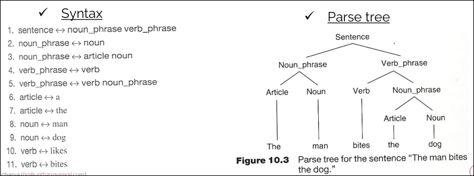
- Semantic Analysis
    - process of converting the syntactic representations into a meaning representation
    - semantic analysis involves:
        - word sense determination:
            - words have different meaningsg in different context
            - example: mary had a bat in her office
                - baseball bat or bat as an animal?
        - Sentence level analysis:
            - once the words are understood, the sentence must be assigned some meaning
            - example: i'm very happy today -> positive
            - non-examples: "colorless green" ideas sleep furiously (rejected semantically)
        - example:
            - i love nlp, its fascinating
            - love, fascinating
            - positive statement
- Pragmatic Analysis
    - Pragmatic deals with how language is used in different context to convey meaning effectively
    - Aspects of pragmatics include:
        - Pronouns and referring expressions:
            - Jill brought him a band aid
            - here him referes to Jack because of the preceeding context
        - Logical inferences:
            - Pragmatics considers the inferences tha can be drawn form a set of propositions, beyond their literal meanings.
                - jack got hurt and jill wanted to help
                - we can infer that: jill brought the band-aid to help jack recover from his injury
            - Discourse Structure: It analyzes how sentences are connected and how their meaning is influenced by the discourse context (meaning of a colelction of sentences)
                - john wanted it,
                - the meaning of it depends on the prior context
### Tools for NLP
- Lexicon or Dictionary
    - Collection of known words in a language
    - includes meanings, pronunciations, and syntactic information
    - example: word apple in teh dictionary with its definition: a round fruit with red or green skin and firm white flesh
- Morphological Analysis System
    - identifies prefixes, roots and suffixes in words
    - helps derive the meaning and grammatical features of words
    - example analyzing 'unhappily' into 'un' as prefix, happy as root, ly as adverb form
    - Morphological information:
        - deals with word forms and inflection
        - transforms parts of speech and modifies features in nouns and verbs
        - example verb 'run' can become running (present participle) or 'ran' (past tense) through Morphological analysis.
### NLP Problems
- Different meanings in different contexts
    - The same expression can have various interpretations based on the context
    - e..g, 'where's the water?' having different meanings in a chemistry lab, when thirsty, or due to a leaky roof.
- Incompleteness of natural language programs
    - due to the constant generation of new words, expressions and meanings, it is challenging for any NLP to be entirely comprehensive
- variation in ways of expressing same things
    - multiple ways exist to convey the same information
    - e.g., Ram's birthday is October 11
    - Ram was born on october 11 have same meaning
- Hidden meanings in sentences and phrases:
    - Some sentences and phrases may carry underyling or metaphorical meanings
- Problems due to syntax semantics:
    - difficulties arise in NLP when dealing with issues related to a sentence strucutre and meaning
- Challenges with extensive pronoun use:
    - the use of pronouns cna lead to semantic ambiguity
    - e.g., Ravi went to the supermarket. He found his favorite brand of coffee in rack. He paid for it and left (It dentoes what?)
- Use of gramatically incorrect sentences
    - NLP encounters difficulties with sentences that lack proper grammatical structure
    - e.g., he rice eats
- Problems caused by conjunctions and avoidance of repetition:
    - the use of conjunctions to avoid repetition can introduce challenges in NLP.
    - e.g., Ram and Hari went to restaurant. While Ram has a cup of coffeee, Hari had tea.
## Introduction to Machine Vision
- the goal of MV is to create a model of the real world from images.
    - an MV system recovers useful information about a scene from its 2d projections
    - the world is 3D
    - two dimensional digitized image
- for MV:
    - knowledge about the object (regions) in a scene and projection geometry is required
- Representation:
    - 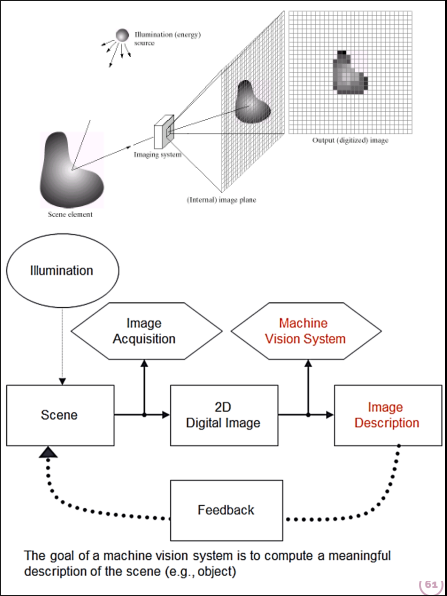
### Stages
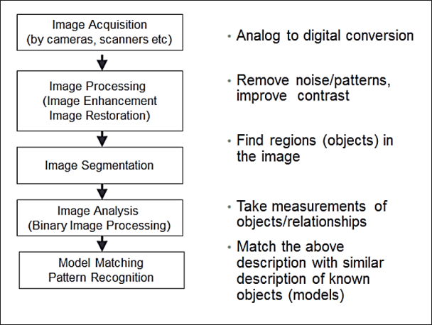
- Image Processing:
    - Image enhancement (filtering, edge detection, surface detection, computation of depth)
    - Image resotaration (remove point/pattern degradataion)
    - Figure:
        - 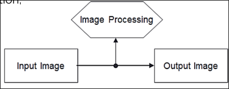
- Image segmentation
    - classify pixels into groups (regions/objects of interest) sharing common characteristics
    - like intensity/color, texture, motion, etc.
    - figure:
        - 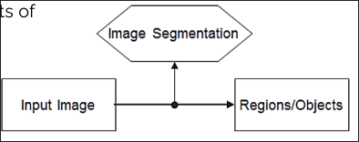
- Image Analysis
    - take useful measurements from pixel, regions, spatial relationships, motion, etc.
    - gray scale/color intensity values, size, distance
    - figure:
        - 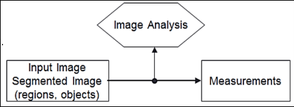
- Pattern Recognition
    - classify an image (region) into one of a number of known classes
    - statistical pattern recognition (the measurements from vectors which are classified into classes).
    - structural pattern recognition (decompose the image into primitive structures).
    - figure:
        - 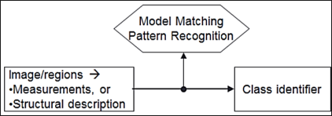
### Digital Image Representation
- Image: 2d array of gray level or color values
    - pixel: array element
    - pixel value: value of gray level or color intensity
- Gray level image: f = f(x, y)
    - 3D image: f = f(x, y, z)
- Color image (multi spectral)
    - f = \[ R(x,y), G(x,y), B(x,y)\]
### Applications
- Robotics
- Medicine
- Remote Sensing
- Meteorology
- Quality Inspection
### Examples
- Hubble Telescope
- Medicile
- Industrial inspection
- law enforcement

