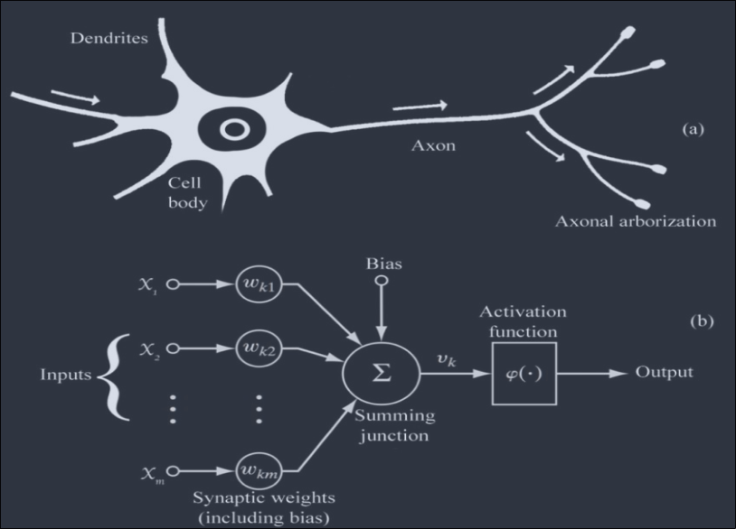
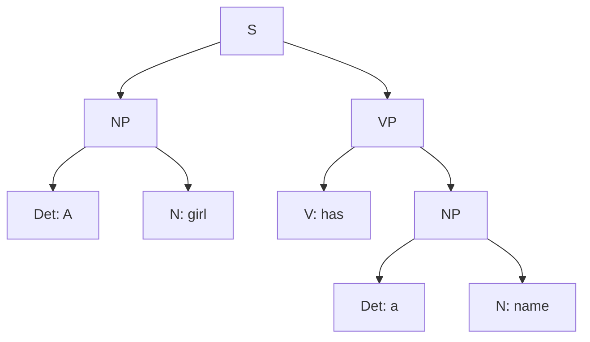

# Exam Frequency Table

| Topic | Typical Marks | Frequency |
|---|---|---|
| Expert System: architecture, block diagram, components | 4–8 | Very High |
| Perceptron: definition, logic gate design (AND/OR/XOR), linear separability | 1–10 | Very High |
| Neural network / back-propagation algorithm | 2–8 | Very High |
| NLP: steps, levels of analysis, issues/problems | 2–9 | Very High |
| McCulloch-Pitts neuron model (with AND/OR/XOR gate justification) | 3–10 | High |
| Hopfield Network: features, steps, weight matrix, pattern recall | 3–8 | High |
| Development stages of Expert System | 2–8 | High |
| Self-Organizing Map (SOM) / Kohonen Network | 3–5 | High |
| Hebbian learning (with AND gate construction) | 3–10 | Moderate–High |
| Machine Vision: steps, applications | 1–7 | Moderate–High |
| Declarative vs Procedural knowledge | 2–6 | Moderate |
| Machine translation: definition + challenges | 1–8 | Moderate |
| Expert System advantages/disadvantages, comparison with human experts | 2–8 | Moderate |
| Short comparisons: Hopfield vs Kohonen, forward vs backward chaining, analogy vs inductive learning | 3–9 | Low–Moderate |

---

# Neural Networks

## Definition

- Neural Nets are basically mathematical models of information processing.
- Neural nets refer to machines that have a structure that, at some level, reflects what is known of the structure of the brain.
- A neural network is a massively parallel distribiuted processor.

## Biological vs Artifician Neuron

- From a computer's point of view, an ANN is:
    - a parallel computational system consisting of many simple processing elements connected together in a specific way to perform a particular task.
    - massively parallel, fault- and noise-tolerant.
    - in principle, capable of doing anything a symbolic/logic system can do, and more.
    - used for Brain Modeling and Artificial System Construction.
- **Biological Neuron**
    - Neurons encode their outputs as brief electrical pulses known as spikes.
    - The **soma** processes incoming activations and generates output activations.
    - **Axon**: one per neuron, excites upto $10^4$ other neurons, all-or-nothing output signal.
    - **Dendrited**: 1 to $10^4$ per neuron
    - Axons act as transmission lines, sending action potentials to other neurons.
    - **Synapses** are junctions between axons and dendrited, where neurotransmitters facilitate signal transmission through diffusion.

### Human brain vs ANN

| Aspect | Human Brain | ANN |
|---|---|---|
| Structure | Highly complex and intricate | Designed with layers of interconnected neurons |
| Number of Neurons | Approximately 86 billion neurons | Variable, can range from a few to billions |
| Processing Speed | Slower processing compared to ANNs (few hundred Hz) | Extremely fast processing capabilities (in GHz) |
| Memory Capacity | Estimated to be around 2.5 petabytes | Limited memory capacity, dependent on architecture |
| Energy Efficiency | Relatively energy-efficient | Can be energy-intensive |
| A contrast | Vision: equivalent to 1000 supercomputers | Arithmetic: equivalent to 10 brains (even a pocket calculator can beat a brain here) |

## Network Structure

### Elements of a Neural Network

- **Weighing factor (W)**:
    - values $w_1, w_2, w_3, \dots, w_n$ are weights determining the strength of inputs $x_1, x_2, x_3, \dots, x_n$
    $$X = x_1 w_1 + x_2 w_2 + x_3 w_3 + \dots + x_n w_n = \sum_{i=1}^n x_i w_i$$
- **Threshold ($\psi$)**
    - the magnitude offset value of the node
    - affects the activation of the node output $Y$:
    $$Y = f(x) = f\left\{ \sum_{i=i}^n x_i w_i - \psi\right\}$$
    - neurons do not fire unless their total input goes above a threshold value.
- **Activation function**
    - performs a mathematical operation on the signal output
    - responsible for activation decision, introducing non-linearity and enabling radient computation.
- **Learning Rate ($\alpha$)**
    - a constant in the neural network algorithm that affects the speed of learning.
    - controls the step size when weights are iteratively adjusted.
    - if too high, the algorithm may oscillate and become unstable.
    - if too small, the algorithm will take too long to converge.
- **Basic learning principle**
    - "Neurons that fire together wire toegether": Hebbian learning for synaptic plasticity
    - Backpropagation (error back-propagation)

### Activation Functions

### Types of Neural Networks

#### Feed-Forward Networks

- Feed-forward ANNs allow signals to travel one way only: from input to output.
- There is no feedback (loops), i.e., the output of any layer does not affect the same layer.

#### Feedback Networks (Recurrent Networks)
 
- Feedback networks can have signals travelling in both directions, by introducing loops in the network.
- Feedback networks are very powerful and can get extremely complicated.
- Also referred to as interactive or recurrent architectures.

## McCulloch/Pitts Neuron

*(Frequently asked)*

- One of the first neuron models to be implemented.
- Its output is 1 (fired) or 0.
- Each input is weighted with weights in the range 0 to 1.
- It has a threshold value, $T$.

 
- The neuron fires if the following inequality is true:
$$X_1 W_1 + X_2 W_2 + X_3 W_3 > T$$

### The Role of Activation Function

- The activation function in an ANN decides whether a neuron should be activated ("fired") or not, based on the weighted sum of its inputs relative to a threshold.
- It introduces the ability to make a **binary decision**
    - in the simplest McCulloch-Pitts case and,
    - in more general activation functions, introduces **non-linearity**,
    - allowing the network to model complex, non-linear relationships rather than
    - being limited to simple linear combinations of inputs.
- Choosing the best activation function for a project depends on factors such as
    - whether the output needs to be binary (step function),
    - bounded between 0 and 1 (sigmoid), zero-centered (tanh), or
    - needs to avoid vanishing gradients in deep networks (ReLU)
    - the choice is guided by the nature of the task (classification vs regression)
    - and the depth/architecture of the network.

### OR Gate Example

- **Goal**: construct an MCP neuron which will implement the OR gate.
- **Problem**: find the threshold $T$, and the weights $w_1$ and $w_2$, where $F$ is 1 if $x_1 w_1 + x_2 w_2 > T$.
- Each line of the function table places a condition on the unknown values:
    - $T > 0$
    - $w_1 > T$
    - $w_2 > T$
    - $w_1 + w_2 > T$
- **Solution**: $w_1 = w_2 = 0.7$, $T = 0.5$, these values work.

### AND Gate Example

- Following the same MCP structure, for an AND gate, $F$ should be 1 only when **both** $x_1 = 1$ and $x_2 = 1$.
- The function table places these conditions:
    - $0 \cdot w_1 + 0 \cdot w_2 \le T$
    - $1 \cdot w_1 + 0 \cdot w_2 \le T$
    - $0 \cdot w_1 + 1 \cdot w_2 \le T$
    - $1 \cdot w_1 + 1 \cdot w_2 > T$
- A valid solution: $w_1 = w_2 = 1$, $T = 1.5$, only when both inputs are 1 does the weighted sum (2) exceed the threshold (1.5); for all other input combinations the sum (0 or 1) does not exceed it.

### Why McCulloch-Pitts (and a Single Perceptron) Cannot Implement XOR

*(Frequently asked)*

- $XOR(x_1, x_2)$ requires the following behavior: output 1 if exactly one input is 1, output 0 if both inputs are the same (00 or 11).
- For a single-layer neuron/perceptron with weights $w_1, w_2$ and threshold/bias $w_0$, this requires simultaneously satisfying:
    - $w_0 + 0w_1 + 0w_2 \le 0$
    - $w_0 + 0w_1 + 1w_2 > 0$
    - $w_0 + 1w_1 + 0w_2 > 0$
    - $w_0 + 1w_1 + 1w_2 \le 0$
- Adding the 2nd and 3rd inequalities: $2w_0 + w_1 + w_2 > 0$.
- Adding the 1st and 4th inequalities: $2w_0 + w_1 + w_2 \le 0$.
- These two derived inequalities directly **contradict** each other, so **no assignment of values** to $w_0, w_1, w_2$ can satisfy all four original inequalities simultaneously.
- **Geometric interpretation**: XOR is not a **linearly separable** function, there is no single straight line that can separate the (0,0)/(1,1) class from the (0,1)/(1,0) class in the input space. Since a single neuron/perceptron can only compute a linear decision boundary, it fundamentally cannot represent XOR.
- **Solution**: XOR requires a **multilayer** network (at least one hidden layer), which can combine multiple linear boundaries to form a non-linear decision boundary.

## Hebbian Learning

*(Frequently asked)*

- The oldest and most famous of all learning rules is **Hebb's postulate of learning**:
    - When an axon of cell A is near enough to excite a cell B, and repeatedly or persistently takes part in firing it, some growth process or metabolic changes take place in one or both cells, such that A's efficiency in firing B is increased.
- Also known as: "Neurons that fire together, wire together."
- **Application to ANN**: if two interconnected neurons are both "on" at the same time, the weight between them should be increased.

### Steps

0. Initialize all weights to 0.
1. Given a training input, $s$, with its target output, $t$, set the activations of the input units: $x_i = s_i$.
2. Set the activation of the output unit to the target value: $y = t$.
3. Adjust the weights: $w_i(\text{new}) = w_i(\text{old}) + x_i y$.
4. Adjust the bias (just like the weights): $b(\text{new}) = b(\text{old}) + y$.

### Worked Example: Hebb Net as an AND Function
 
- Training Set:
    - 
- **Problem**: construct a Hebb Net which performs like an AND function, only when both features are "active" will the data be in the target class.
- Initialize the weights to 0.
- Present the first input $(1, 1, 1)$ with target $1$:
    - $w_1(\text{new}) = w_1(\text{old}) + x_1 t = 0 + 1 = 1$
    - $w_2(\text{new}) = 1$
    - $b(\text{new}) = b(\text{old}) + t = 0 + 1 = 1$
- Present the second input $(1, -1, 1)$ with target $-1$, and update the weights:
    - $w_1(\text{new}) = 1 + (1)(-1) = 0$
    - $w_2(\text{new}) = 1 + (-1)(-1) = 2$
    - $b(\text{new}) = 1 + (-1) = 0$
- For $(-1, 1, 1)$ with $-1$:
    - $w_1(\text{new}) = 0 + (-1)(-1) = 1$
    - $w_2(\text{new}) = 2 + (1)(-1) = 1$
    - $b(\text{new}) = 0 + (-1) = -1$
- For $(-1, -1, 1)$ with $-1$:
    - $w_1(\text{new}) = 1 + (-1)(-1) = 2$
    - $w_2(\text{new}) = 1 + (-1)(-1) = 2$
    - $b(\text{new}) = -1 + (-1) = -2$
- Final result:
    - 

### Is Hebbian Learning Supervised?

- **Yes**, in its classical formulation (as used above), Hebbian learning is a **supervised** method, the weight update rule explicitly depends on the **target output** $t$ (or $y = t$), which is provided externally as a "teacher signal" during training.
- This distinguishes it from the "pure" biological Hebbian principle (which only depends on correlated pre/post-synaptic activity, with no external teacher), but the Hebb Net learning algorithm, as commonly taught and examined, is supervised because it requires known input-target pairs to compute weight updates.

## Adaline Network

- **Adaptive Linear Neuron (Adaline)** is a network with a single linear unit.
- A variation on the perceptron network:
    - inputs are +1 or −1.
    - outputs are +1 or −1.
    - uses a bias input.

### Differences from Perceptron

- Trained using the **Delta Rule**, also known as the **Least Mean Square (LMS)** or **Widrow-Huff rule**.
- The activation function during training is the **identity function**.
- After training, the activation is a **threshold function**.

### Algorithm

1. Initialize the weights to small random values and select a learning rate, $\alpha$.
2. For each input vector $s$, with target output $t$, set the inputs to $s$.
3. Compute the neuron inputs.
4. Use the delta rule to update the bias and weights.
5. Stop if the largest weight change across all training samples is less than a specified tolerance; otherwise, cycle through the training set again.

**Formulas:**
- Neuron Input: $y_{in} = b + \sum x_i w_i$
- Delta Rule:
    - $b(\text{new}) = b(\text{old}) + \alpha(t - y_{in})$
    - $w_i(\text{new}) = w_i(\text{old}) + \alpha(t - y_{in})x_i$

### Learning Rate

- The performance of an Adaline neuron depends heavily on the choice of learning rate:
    - if too large, the system will not converge.
    - if too small, convergence will take too long.
- Typically, $\alpha$ is selected by trial and error:
    - typical range: $0.01 < \alpha < 10.0$.
    - often start at 0.1.
    - sometimes suggested: $0.1 < n\alpha < 10.00$, where $n$ is the number of inputs.

### Worked Example: AND Gate

### Properties

- The values of the weights determine the function computed.
- A network with one hidden layer is sufficient to represent every boolean function.

## Perceptron

*(Frequently Asked)*

- The perceptron was suggested by Rosenblatt in 1958.
- It uses an iterative learning procedure, which can be proven to converge to the correct weights for **linearly separable** data.
- It has a bias and a threshold function.

### Perceptron Learning Rule

- Weights are changed **only when an error occurs**.
- The weights are updated using:
$$w_i(\text{new}) = w_i(\text{old}) + \alpha t x_i$$
    where $t$ is either $+1$ or $-1$, and $\alpha$ is the learning rate.
- If an error does not occur, the weights are not changed.

### Why Multilayer Perceptrons Are Needed

- A single-layer perceptron can only correctly classify **linearly separable** patterns, it computes a single linear decision boundary.
- Many real-world problems (most famously, the XOR function) are **not linearly separable**, and cannot be solved by any single-layer perceptron, no matter how the weights are chosen.
- A **Multilayer Perceptron (MLP)**,
    - by stacking multiple layers of neurons with non-linear activation functions,
    - can combine several linear boundaries to form arbitrarily complex, non-linear decision boundaries,
    - enabling it to represent functions like XOR, and to model far more complex relationships in general
    - this is formalized by the Universal Approximation Theorem
- Training an MLP requires the **backpropagation algorithm**,
    - since the simple perceptron learning rule only works for a single layer with a known target output at that layer
    - hidden layers have no directly observable "target,"
    - so the error must be propagated backward through the network to update all layers' weights.

### Perceptron as a Linear Classifier: Logic Gate Design

- A perceptron computes a weighted sum of its inputs and compares it against a threshold, geometrically,
- this defines a **hyperplane** (a straight line in 2D) that separates the input space into two regions,
    - corresponding to output classes 0/1 or −1/+1.
- **AND Gate as a Perceptron** (linearly separable):
    - Truth table: $(0,0)\to 0$, $(0,1)\to 0$, $(1,0)\to 0$, $(1,1)\to 1$.
    - A valid separating line exists, e.g., using weights $w_1 = w_2 = 1$ and threshold $1.5$: the sum exceeds 1.5 only for input $(1,1)$.
    - Applying the perceptron learning rule ($w_i(\text{new}) = w_i(\text{old}) + \alpha t x_i$) iteratively over the AND truth table, starting from small/zero weights, converges to a set of weights that correctly separates the single positive example $(1,1)$ from the three negative examples.
- **OR Gate as a Perceptron** (linearly separable):
    - Truth table: $(0,0)\to 0$, $(0,1)\to 1$, $(1,0)\to 1$, $(1,1)\to 1$.
    - Similarly separable by a straight line, e.g., weights $w_1 = w_2 = 1$, threshold $0.5$.
- Since both AND and OR are linearly separable,
    - a single perceptron **can** implement them
    - this demonstrates the "perceptron as linear classifier" property
    - this stands in direct contrast to XOR,
    - which is not linearly separable and therefore cannot be implemented by a single perceptron

### Limitations

- The perceptron can only learn to distinguish between classifications if the classes are **linearly separable**.
- If the problem is not linearly separable, the behavior of the algorithm is not guaranteed.
- If the problem is linearly separable, there may be a number of valid solutions.
- The algorithm, as stated, gives no indication of the quality of the solution found.

### XOR Problem

- A perceptron network **cannot** implement an XOR function.
- $XOR(x_1, x_2)$ requires:
    - $w_0 + 0w_1 + 0w_2 \le 0$
    - $w_0 + 0w_1 + 1w_2 > 0$
    - $w_0 + 1w_1 + 0w_2 > 0$
    - $w_0 + 1w_1 + 1w_2 \le 0$
- There is no assignment of values to $w_0, w_1, w_2$ that satisfies all of the above inequalities (see the full contradiction proof under McCulloch-Pitts above).

## Multilayer Perceptron, Back Propagation

- A perceptron's capability can be improved if placed within a multilayered network.

### Backpropagation Intuition

- The term is an abbreviation for "backwards propagation of errors."
- A method for fine-tuning the weights of neural networks based on error.

### Algorithm

- Initialize the weights and bias to small random values.
- Compute the forward propagation for the input dataset.
- Use the gradient descent algorithm to update the weights:
    - Calculate the error gradient as: $\dfrac{\partial E(O, t)}{\partial w_{ij}}$
    - Calculate the weight correction as: $\Delta w_{ij} = \eta \dfrac{\partial E(O, t)}{\partial w_{ij}} = \eta \delta_i h_i$
    - Update the weight at the output of the neuron: $w_{ij}(\text{new}) \leftarrow w_{ij}(\text{old}) - \Delta w_{ij}$
    - where: $o$ = actual output, $t$ = target output, $h_i$ = output of the $i^{th}$ hidden layer, $w$ = weight.
- Update the bias similarly.
- Repeat until convergence or a maximum number of cycles is reached.

### Backpropagation: XOR Example

- Since the XOR problem is not linearly separable, we need to use hidden neurons.
- Use error/loss function $L(o, t) = \frac{1}{2}(o - t)^2$.
- Activation function: sigmoid, $f(x) = \dfrac{1}{1 + \exp(-x)}$.
- Complete Network:
    - 
- Solving:
    - 
    - 
    - 

## Hopfield Network

*(Frequently asked)*

- Hopfield (1982) introduced a neural network based on a proposed theory of memory.
- It has a **fully connected, single layer**, with each neuron connected to every other neuron.
- It behaves in a **discrete** manner, giving a finite distinct output, generally of two types:
    - Binary (0/1)
    - Bipolar (−1/1)
- Weight properties: the weights are **symmetric**, i.e., $W_{ij} = W_{ji}$, and $W_{ii} = 0$ (no self-loops).

### Features

- Distributed representation.
- Asynchronous control.
- Content-addressable memory.
- Fault tolerance.

### Training: Constructing the Weight Matrix

1. **Initialize the Weight Matrix**: start by initializing the weight matrix $W$ to zeros. The weight matrix is of size $N \times N$, where $N$ is the number of neurons in the network.
2. **Store Patterns**: for each pattern to be stored:
    - Convert the pattern into a vector of binary (or bipolar) values: each element corresponds to the state of a neuron.
    - Compute the **outer product** of the pattern vector with itself. This creates a matrix representing the associations between neurons for this pattern.
    - Add the resulting matrix to the weight matrix $W$.
3. **Adjust Diagonal Elements**: set the diagonal elements of $W$ to zero, this prevents neurons from reinforcing their own activation.
4. **Repeat if Necessary**: if multiple patterns are to be stored, repeat steps 2–3 for each pattern (the weight matrices from each pattern are summed together).
5. **End of Training**: once all patterns are stored, training is complete.

### Association / Recall: Retrieving a Pattern from Noisy Input

1. **Initialize Network State**: start with an initial state for the network this could be a noisy version of one of the stored patterns, or a completely random state.
2. **Update Neuron States**: iteratively update the states of the neurons according to the Hopfield update rule, until the network reaches a stable state or a maximum number of iterations is reached:
    - For each neuron $i$, compute its activation as the sign of the sum of its weighted inputs:
    $$a_i = \text{sign}\left(\sum_{j=1}^{N} W_{ij} \cdot s_j\right)$$
    - Update the state of neuron $i$ to $a_i$.
    - Repeat this process for all neurons in the network.
3. **Check for Convergence**: check if the network state remains unchanged for consecutive iterations.
    - If so, the network has converged to a stable state.
4. **Output Restored Pattern**: if the network has converged, the resulting state of the neurons represents the restored pattern.

### Parallel Relaxation Algorithm (Conceptual Summary)

- Compute the sum of the weights on the connections of active neighbors, until the network reaches a stable state.
- If the sum exceeds the threshold, activate the neuron.

### Worked Example

- If the network starts in the state shown, only four distinct stable states are possible.
- The network can be thought of as storing patterns, and can be used as a **content-addressable memory**.
- To retrieve a pattern, we only need to supply a portion of it, the network settles into the stable state that best matches the partial (or noisy) pattern.

## Kohonen Network

*(Frequently asked)*

- The Kohonen neural network is an example of **self-organization** and **competitive learning**.
- Produces a low-dimensional, topologically ordered representation of high-dimensional input data.
- Contains only a feed-forward input and output layer of neurons, **no hidden layer**, activation function, or bias weight.
- When a pattern is presented, one of the output neurons is selected as a "winner," which forms the output.
- **Unsupervised learning**.
- Grid-like output layer.
- Used for: dimensionality reduction, data visualization, clustering, feature extraction.

### Algorithm (Self-Organizing Map, SOM)

1. Initialize the network with random weight vectors for each neuron.
2. Define the learning rate ($\alpha$) and neighborhood radius ($\sigma$).
3. Present input data to the network.
4. Find the **Best Matching Unit (BMU)** by selecting the neuron with the closest weight vector to the input data.
5. Update all neurons' weight vectors based on their distance from the BMU and the learning rate.
6. Decrease the learning rate and neighborhood radius over time.
7. Repeat steps 3 to 6 until convergence or a set number of iterations.
8. The final weight vectors represent the compressed representation of the input data in a 2D map.

## Comparative Questions
 
*(Frequently asked)*

### Feedforward Network vs Hopfield Network

| Aspect | Feedforward Network | Hopfield Network |
|---|---|---|
| Signal direction | One-way only | Fully connected  |
| Layer structure | Distinct input, hidden, and output layers | Single layer, fully interconnected |
| Feedback | None | Present: output of neurons feeds back as input to others |
| Typical use case | Classification, regression, function approximation (e.g. MLP with backprop) | Associative/content-addressable memory, pattern completion, optimization |
| Training | Supervised (e.g. backpropagation with target outputs) | Weight matrix computed directly from stored patterns (Hebbian-style outer product), not iteratively trained via error minimization |
| Output nature | Deterministic | Settles into a stable state over multiple iterations |

### Hopfield Network vs Kohonen Network

| Aspect | Hopfield Network | Kohonen Network (SOM) |
|---|---|---|
| Learning type | Uses a fixed, computed weight matrix (associative memory) | Competitive, unsupervised learning with iterative weight updates |
| Network structure | Single, fully connected layer | Feed-forward input and output layer only, no hidden layer |
| Purpose | Content-addressable memory: pattern storage and recall/completion | Dimensionality reduction, clustering, topological mapping of input data |
| Output | Converges to one of several stable states (stored patterns) | A "winner" neuron on a grid represents the best match to the input |
| Topology preservation | Not applicable, no spatial/topological organization | Preserves topological relationships |

### Learning by Analogy vs Inductive Learning

| Aspect | Learning by Analogy | Inductive Learning |
|---|---|---|
| Basis of learning | Transferring knowledge from a known, similar source entity to a partially known target entity | Generalizing patterns/rules directly from a set of training examples |
| Data requirement | Can work with very limited data about the target, by leveraging structural similarity to a known domain | Typically requires a reasonably sized set of labeled training examples |
| Mechanism | Mapping relationships from a source domain onto a target domain (e.g. solar system → atomic structure) | Building a hypothesis (e.g. decision tree) that is consistent with observed examples |
| Example | Rutherford's analogy: hydrogen atom is like the solar system | ID3 decision tree learning from a dataset like the weather/Play Golf example |

---

# 7.2 Expert System: Architecture, Knowledge Acquisition, Development

## What is an Expert System?

- An expert system is a computer program which:
    - Simulates the decision-making process of a human expert in a specific domain.
    - Performance is guided by specific, expert knowledge in solving problems.
    - Solves problems in a narrow problem area by using high-quality, specific knowledge rather than a general algorithm.
- Expert knowledge must be obtained from specialists or other sources of expertise, such as texts, journals, articles, and databases.

## Architecture of an Expert System

*(Frequently Asked)*

### Knowledge Base

- A data structure with rules and expert knowledge.
- Knowledge in expert systems is usually implemented as **rules**.
- A rule is an IF-THEN type statement: `IF <certain statements are true> THEN <take certain actions>`.
- Knowledge is information that has been interpreted, categorized, applied, experienced, and revised.

#### Types of Knowledge

*(Frequently asked directly: "Differentiate between declarative and procedural knowledge")*

- **Procedural Knowledge**: information about courses of action: "knowing how."
- **Declarative Knowledge**: facts about objects, events, and situations, "knowing what."
- **Episodic Knowledge**: experiential knowledge.
- **Meta-Knowledge**: knowledge about knowledge.

##### Declarative vs Procedural Knowledge

| Aspect | Declarative Knowledge | Procedural Knowledge |
|---|---|---|
| Nature | Facts, concepts, and relationships: "knowing what" | Steps and methods for performing a task: "knowing how" |
| Representation | Typically represented as facts, semantic networks, or frames | Typically represented as production rules, algorithms, or procedures |
| Flexibility | Easier to modify and update independently | More tightly coupled with the reasoning process; harder to isolate |
| Example | "A car has four wheels" | "To start a car, insert the key, then turn the ignition" |
| Use in Expert Systems | Stored in the knowledge base as facts/objects | Encoded as rules used by the inference engine to reason and act |

#### Sources of Knowledge

- Expert (primary source), Secondary/Tertiary Experts.
- Literature (Reports, Guidelines, Books, Manuals, etc.).
- End Users.

#### Rule Types

- **Relationship (FACT)**: e.g., "IF the battery is dead THEN the car will not start."
- **Recommendation**: e.g., "IF the car will not start THEN take a cab."
- **Directive**: e.g., "IF the car will not start AND the fuel system is ok THEN check out the electrical system."
- **Heuristic**: e.g., "IF the car will not start AND the car is a 1957 Ford THEN check the float."

#### Meta Rules

- Rules that express knowledge about which other knowledge should be used.
- E.g., "IF the car will not start AND the electrical system is operating properly THEN use fuel_system_rules."

### Working Memory

- A data structure containing information about the current problem.

### Inference Engine

- A set of procedures for matching the knowledge base against the working memory.
- Also known as: the **control structure**, or the **interpreter**.
- The inference engine is the mechanism for:
    - matching facts with rules and using the results to update the knowledge base.
    - extracting knowledge from the knowledge base.
- Most inference engines are based on the application of a logical reasoning rule:
    - **Modus Ponens** (P1: If A then B; P2: A is true; Conclude: B is true).
    - **Forward and backward chaining**.

#### Recognize-Select-Act Cycle

1. **Match**: rules are compared to working memory to determine matches.
2. **Conflict Resolution**: select or enable a single rule for execution.
3. **Execute**: fire the selected rule.

### User Interface

- Controls the dialog between the user and the system.
- The component of an expert system that communicates with the user.
- Communication performed by the user interface is **bidirectional**, we may ask the system to explain its reasoning, or the system may request additional information about the problem from us.

### Full Architecture Diagram

## Features of Expert Systems

- Goal-driven reasoning (backward chaining) or data-driven reasoning (forward chaining).
- Explanations (ability to explain its solution with respect to a specific problem).
- Uses symbolic representation for knowledge.
- Should have meta-knowledge.
- The program should be useful and usable.
- The program should be educational when appropriate.
- The program should be able to learn new knowledge.
- The program's knowledge should be easily modified.

## When to Use an Expert System

- Provides a high potential payoff, or significantly reduces downside risk.
- Captures and preserves irreplaceable human expertise.
- Provides expertise needed at multiple locations simultaneously, or in a hostile environment dangerous to human health.
- Provides expertise that is expensive or rare.
- Develops a solution faster than human experts can.
- Provides expertise needed for training and development, to share the wisdom of human experts with a large number of people.

## Applications

- Business, Manufacturing, Medicine, Engineering, Applied Sciences, Military and Space, Transportation, Education, Image Analysis, Chemical Structure, Architecture, Robotics, and many more.

## Merits/Demerits

## Expert Systems vs Human Experts

| Aspect | Expert System | Human Expert |
|---|---|---|
| Availability | Available continuously, at multiple locations simultaneously | Available at one location at a time; limited by human schedules |
| Consistency | Consistent: gives same answer to same input | May vary due to fatigue, mood, or memory lapses |
| Speed | Can often reach a conclusion faster once knowledge is encoded | May take longer, especially under time pressure |
| Knowledge scope | Narrow, restricted to its specific encoded domain | Can draw on broader experience, intuition, and common sense beyond the narrow domain |
| Adaptability to novel situations | Limited, cannot easily reason outside its programmed rule set | Can often adapt and reason creatively in genuinely novel situations |
| Explanation capability | Can explain its reasoning by tracing the rules fired | Can explain reasoning, but may also rely on tacit/intuitive knowledge hard to articulate |
| Cost over time | High upfront development cost, but low marginal cost to reuse/scale | Ongoing cost (salary, training) for each additional expert needed |
| Risk tolerance situations | Preferred in hazardous environments where human presence is risky | Preferred where genuine judgment, ethics, or novel creative reasoning is required |

## Knowledge Acquisition, Induction, and Development of Expert Systems

*(Frequently asked)*

### Knowledge Acquisition

- Gather expertise from human experts.
- Capture rules, facts, heuristics, and procedures.
- Expert sources can be domain specialists, articles, journals, databases, etc.
- Iteratively refined until it approximates expert-level performance.
- Use interviews, questionnaires, and observations.
- Automatic ways of constructing expert knowledge bases (e.g., via machine learning/induction) are an efficient complementary approach.

### Knowledge Representation

- Can be a logical representation or a structured representation.
- Uses techniques like production rules, frames, or ontologies.
- Makes information accessible for the inference engine.

### Knowledge Inferencing

- Utilizes the knowledge base for reasoning.
- Knowledge inference refers to acquiring new knowledge from existing facts, based on certain rules and constraints.
- Mostly rule-based reasoning (forward chaining / backward chaining) is used for inferencing.

### Knowledge Transfer

- Integrate the expert system into the target environment.
- Train end-users to effectively utilize the system.

### Deployment

- Implement the expert system for real-world use.
- Monitor its performance and gather feedback.

### Development Stages: Summary Pipeline

## Example: MYCIN

- Expert System for treating blood infections.
- Diagnoses patients based on reported symptoms and medical test results.
- Could ask for additional information and lab test results for diagnosis.
- Recommends a course of treatment, if requested, MYCIN would explain the reasoning that led to its diagnosis and recommendation.
- Uses about 500 production rules.
- MYCIN operated roughly at the same level of competence as human specialists in blood infections.
- Uses **backward chaining** for reasoning.

## Example: DENDRAL

- First Expert System developed in the late 1960s at Stanford University.
- Designed to analyze mass spectra
    - mass spectra are graphs representing the fragmentation pattern of a molecule when subjected to ionization.
- Based on the mass of fragments seen in the spectra, it would infer the nature of the molecule tested, identifying functional groups or even the entire molecule.
- Used heuristic knowledge obtained from experienced chemists.
- Uses **forward chaining** for reasoning.

## Forward Chaining vs Backward Chaining

*(Frequently asked)*

| Aspect | Forward Chaining | Backward Chaining |
|---|---|---|
| Direction | Data-driven | Goal-driven |
| Typical use case | Situations with many possible conclusions from given data | Situations with a specific hypothesis to verify |
| Efficiency | Efficient when there are few initial facts but many possible rules to fire | Efficient when there is a specific goal to prove, avoiding irrelevant rule firing |
| Example ES | DENDRAL | MYCIN |

---
# 7.3 Natural Language Processing and Machine Vision

## Natural Language Processing (NLP)

- **NLP**: the process of computer analysis of input provided in a human (natural) language, and conversion of this input into a useful form of representation.
- NLP is a field of AI that processes or analyzes written or spoken language.
- NLP involves processing of grammar, speech, and meaning.
- NLP is composed of two parts:
    - **NLU (Natural Language Understanding)**
    - **NLG (Natural Language Generation)**

### NLP Steps/Processes

*(Frequently Asked)*

- **Input/Source**: the input of an NLP system can be written text or speech. The quality of input decides the possible errors in language processing
- high-quality input leads to correct language understanding.

## Levels of Analysis: Phonetic, Syntactic, Semantic, Pragmatic

*(Frequently Asked)*

### Lexical Analysis (Segmentation/Tokenization)

- **Purpose**: divide the input text into smaller segments (tokens) for language processing tasks
    - e.g., part-of-speech tagging, entity recognition, and sentiment analysis.
- **Tokenization rules**: define rules for splitting text based on spaces, punctuation, etc.
- **Ambiguity**: handle cases like contractions ("can't") or separate tokens ("can" and "not").
- **Case sensitivity**: decide whether to treat uppercase/lowercase words as different tokens.
- **Special cases**: recognize and handle dates, URLs, numerical expressions, etc.
- Example: Input text: "I love NLP, it's fascinating" → Tokens: I, love, NLP, ',', it's, fascinating.

### Syntactic Analysis

- Takes an input sentence and produces a representation of its grammatical structure.
- A grammar describes the valid parts of speech of a language and how to combine them into phrases, using parse trees.
- A **parse tree** is a hierarchical structure showing how the grammar applies to the input; each level of the tree corresponds to the application of one grammar rule.

#### Worked Example: Parse Tree for "A girl has a name."

- The sentence "A girl has a name" decomposes into a Noun Phrase (NP: "A girl") and a Verb Phrase (VP: "has a name").
- The VP further decomposes into the verb "has" and another Noun Phrase ("a name"), each Noun Phrase itself decomposing into a Determiner (Det) and a Noun (N).

### Semantic Analysis

- The process of converting syntactic representations into a meaning representation.
- Semantic analysis involves:
    - **Word sense determination**: words have different meanings in different contexts.
        - Example: "Mary had a bat in her office": baseball bat, or bat as an animal?
    - **Sentence-level analysis**: once words are understood, the sentence must be assigned some meaning.
        - Example: "I'm very happy today" → positive.
        - Non-example: "Colorless green ideas sleep furiously": syntactically valid, but rejected semantically.
    - Example: "I love NLP, it's fascinating" → key sentiment words: love, fascinating → positive statement.

### Pragmatic Analysis

- Pragmatics deals with how language is used in different contexts to convey meaning effectively.
- Aspects of pragmatics include:
    - **Pronouns and referring expressions**: e.g., "Jill brought him a band aid": here "him" refers to Jack, because of preceding context.
    - **Logical inferences**: pragmatics considers inferences that can be drawn from a set of propositions, beyond their literal meaning.
        - Example: "Jack got hurt and Jill wanted to help" → we can infer that "Jill brought the band-aid to help Jack recover from his injury."
    - **Discourse structure**: analyzes how sentences are connected, and how their meaning is influenced by the discourse context (meaning of a collection of sentences).
        - Example: "John wanted it", the meaning of "it" depends on the prior context.

## Tools for NLP

- **Lexicon or Dictionary**: a collection of known words in a language, including meanings, pronunciations, and syntactic information.
    - Example: the word "apple" in a dictionary with its definition: a round fruit with red or green skin and firm white flesh.
- **Morphological Analysis System**: identifies prefixes, roots, and suffixes in words, helping derive their meaning and grammatical features.
    - Example: analyzing "unhappily" into "un-" (prefix), "happy" (root), "-ly" (adverb form).
    - **Morphological information**: deals with word forms and inflection, transforming parts of speech and modifying features in nouns and verbs.
        - Example: the verb "run" can become "running" (present participle) or "ran" (past tense) through morphological analysis.

## NLP Problems / Issues

*(Frequently asked)*

- **Different meanings in different contexts**: the same expression can have various interpretations based on context.
    - Example: "Where's the water?" means different things in a chemistry lab, when thirsty, or during a leaky roof.
- **Incompleteness of natural language**: due to the constant generation of new words, expressions, and meanings, it is challenging for any NLP system to be entirely comprehensive.
- **Variation in ways of expressing the same thing**: multiple ways exist to convey the same information.
    - Example: "Ram's birthday is October 11" and "Ram was born on October 11" have the same meaning.
- **Hidden meanings in sentences and phrases**: some sentences carry underlying or metaphorical meanings.
- **Problems due to syntax/semantics**: difficulties arise from sentence structure and meaning interactions.
- **Challenges with extensive pronoun use**: pronoun use can lead to semantic ambiguity.
    - Example: "Ravi went to the supermarket. He found his favorite brand of coffee in the rack. He paid for it and left." (What does "it" denote?)
- **Ungrammatical sentences**: NLP encounters difficulties with sentences that lack proper grammatical structure.
    - Example: "He rice eats."
- **Problems caused by conjunctions and avoidance of repetition**: using conjunctions to avoid repetition can introduce challenges.
    - Example: "Ram and Hari went to the restaurant. While Ram had a cup of coffee, Hari had tea."

## Why is NLP Hard?

- Natural language is inherently **ambiguous** at every level,
    - phonetic (homophones), syntactic (multiple valid parse trees), semantic (word sense, sentence meaning), and pragmatic (context-dependent meaning)
    - resolving this ambiguity computationally is very difficult.
- Language is **highly context-dependent**: the same words or sentences can mean different things depending on the situation, speaker intent, prior discourse, and shared world knowledge.
- **Language constantly evolves**: new words, slang, and expressions are continuously introduced, making it hard for any NLP system to stay comprehensive.
- **World knowledge and common sense** are often required to correctly interpret language, which is difficult to encode exhaustively in a machine.
- **Irregularities and exceptions** in grammar and vocabulary make rule-based approaches brittle, requiring extensive statistical/learning-based methods instead.

## Machine Translation

- **Machine Translation (MT)** is an application of NLP concerned with automatically translating text or speech from one natural language to another, without human intervention.
- **Motivation**: language problems in international business
    - e.g., a meeting of Japanese, Korean, Vietnamese, and Swedish investors with no common language, or shipping software manuals to 127 countries.
    - Hiring human translators works but is expensive and a machine solution would be much cheaper.

### Challenges of Machine Translation

- Automated translation is a **very difficult** problem: not only must the words be translated, but their **meaning** must also be preserved.
- Classic illustrative failure:
    - translating "The spirit is willing but the flesh is weak" (English) into Russian and
    - then back, produced "The vodka is good but the meat is rotten"
    - illustrating how idiomatic and figurative meaning is easily lost.
- Challenges include handling:
    - **Grammar**: differing word categories and syntactic structures across languages.
    - **Discourse**: preserving sentence-level and cross-sentence meaning.
    - **Ambiguity**: words and phrases with multiple possible meanings or translations.
    - **Idioms and figurative language**: literal translation often fails to capture intended meaning.
- Despite these challenges, commercial systems can perform well in restricted domains (e.g., software documentation with a limited vocabulary), using algorithms that combine dictionaries, grammar models, and (increasingly) statistical/neural translation models.

## Applications of NLP

- **Simple applications**: word counters (e.g., `wc` in UNIX), spell checkers, grammar checkers, predictive text on mobile handsets.
- **More significant applications**:
    - intelligent computer systems, NLU interfaces to databases,
    - computer-aided instruction and automatic graders, information retrieval,
    - intelligent web searching, data mining, machine translation, speech recognition,
    - natural language generation, question answering.

## Introduction to Machine Vision

*(Frequently asked)*

- The goal of Machine Vision (MV) is to create a model of the real world from images.
- An MV system recovers useful information about a scene from its 2D projections, even though the world is 3D and the digitized image is two-dimensional.
- For MV, knowledge about the objects (regions) in a scene and the projection geometry is required.

### Stages of Machine Vision

- **Image Processing**:
    - Image enhancement (filtering, edge detection, surface detection, computation of depth).
    - Image restoration (removing point/pattern degradation).
    
- **Image Segmentation**:
    - Classify pixels into groups (regions/objects of interest) sharing common characteristics, like intensity/color, texture, motion, etc.
    
- **Image Analysis**:
    - Take useful measurements from pixels, regions, spatial relationships, motion, etc., gray scale/color intensity values, size, distance.
    - 
- **Pattern Recognition**:
    - Classify an image (region) into one of a number of known classes.
    - Statistical pattern recognition: measurements from vectors classified into classes.
    - Structural pattern recognition: decompose the image into primitive structures.
    

### Digital Image Representation

- Image: a 2D array of gray level or color values.
    - **Pixel**: array element.
    - **Pixel value**: value of gray level or color intensity.
- Gray level image: $f = f(x, y)$.
    - 3D image: $f = f(x, y, z)$.
- Color image (multi-spectral): $f = [R(x,y), G(x,y), B(x,y)]$.

### Applications

- Robotics, Medicine, Remote Sensing, Meteorology, Quality Inspection.

### Examples

- Hubble Telescope, Medical imaging, Industrial inspection, Law enforcement.
---

