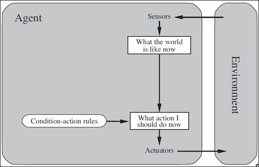
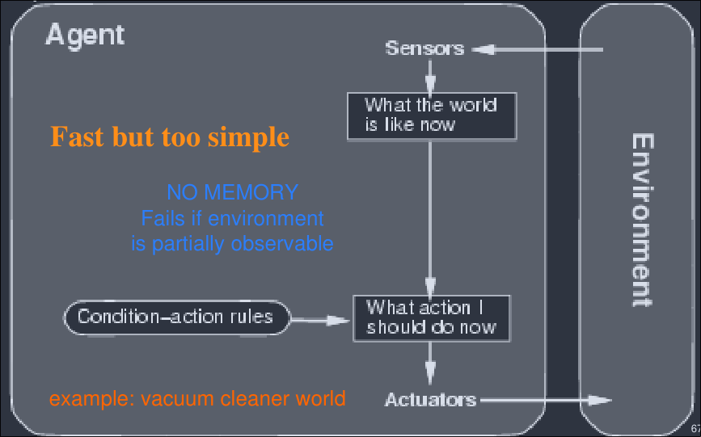
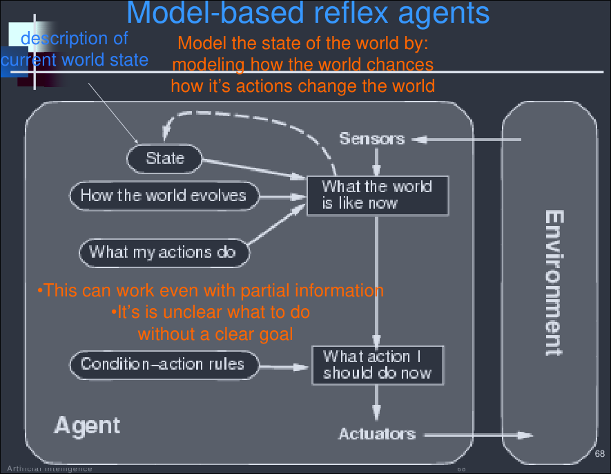
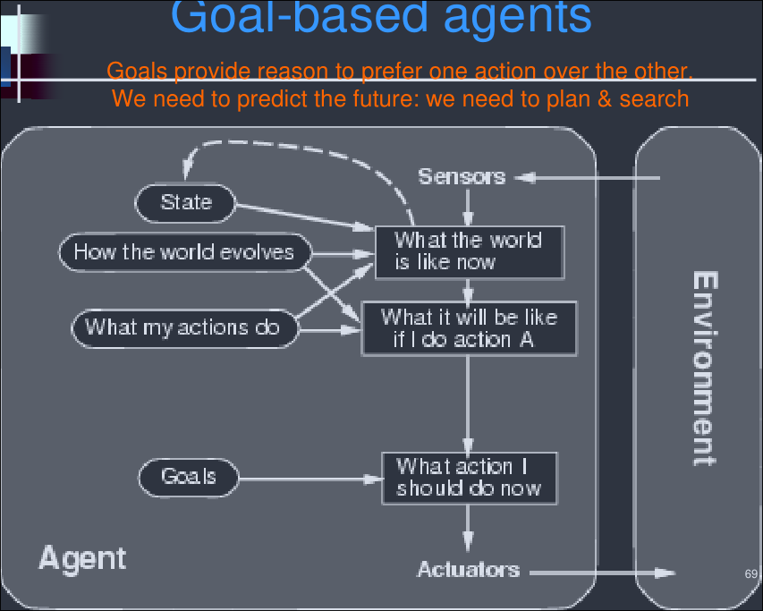
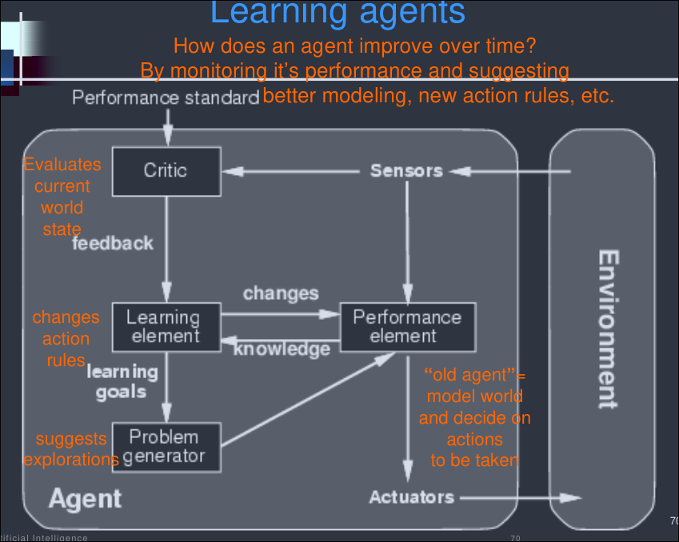

# Definition of Aritificial Intelligence

## Intelligent Behaviors

- Everyday tasks
    - recognize a friend, recognize who is calling
    - translate from one language to another
    - interpret a photograph
    - talk,
    - cook a dinner
- Formal tasks:
    - prove a logic theorem,
    - geometry,
    - calculus,
    - play chess, checkers or Go
- Expert tasks:
    - engineering design,
    - medical designers,
    - financial analysis

Intelligence is:

- The ability to reason
- The ability to understand
- The ability to create

## Approaches of AI

- Thinking Humanly
    - Cognitive model of exactly how humans think (cognitive modelling approach)
    - Once we have precise theory of mind, it is possible to express the theory as a
    computer program.
    - Example: General Problem Solver (GPS)
        - developed by Newell & Simon in 1961 attempted to synthesize the human solving process.
    - Critics: Lacks scientific theories of internal activities of brain
        - Therefore it is not possible to make the machines that think like human brain.

Acting Humanly
- Modeling exactly how humans actually act. (The Turing Test)
- Models of human behavior (what they do, not how they think)
- Papers of Turing
    - Can machines think?
    - Can machines behave intelligence
- Turing (1950) *Computing machinery and intelligence*
- The turing test
    - Turing defined intelligent behavior as the ability to achieve human-level performance in all cognitive tasks, sufficient to fool an interrogator.
    - The interrogator can communicate two with sources: one is human and the other is a machine
        - He must decide which is which
        - If he is wrong half the time, then the machine is intelligent
    - Factors required to pass the Turing Test
        - Natural language processing: to communicate easily
        - Knowledge Representation: to store facts and rules
        - Automated Reasoning: To draw conclusion from stored knowledge.
        - Machine learning: to adopt new circumstances and detect pattern

Thinking Rationally
- Modeling how ideal agents "should think" (laws of thought approach)
- It gives emphasis on correct inferences - means rational agent
- Formal Logic provides precise notation for statements and relations, and reasoning system solves problems
    - Socrates is a man; all men are mortal; therefore Socrates is mrotal.
- Critics: It is not easy to take informal knowledge and state into the formal terms required by logical notation

Acting Rationally
- Perfect rationalilty is not always possible in complex environments
- AI agent acts to achieve the best outcome on when there is uncertainty of the best outcome on when there is uncertainty of the best expected outcome (Rational agent approach)
- Acting rationally means achieving goals based on beliefs
- Modeling how ideal agents "should act"
    - rational actions but not necessarily formal rational reasoning, e.g., reflex action
    - i.e., more of a block-box/engineering approach
## AI
The art of creating machines that perform functions that require intelligence when performed by people - Kurzwell, 1990

The science of making computers, do things that require intelligence like humans - Minskey

AI is the study of how to make computers do things at which, at the moment, people are better - Alaine Rich

Artificial Intelligence is a branch of Science which deals with helping machines to find solutions to complex problems ina  more human-like fashion.

## AI today
- Diagnose lymph-node diseases
- Monitor space shuttle missions
- Automatic vehicle control
- Large scale scheduling
- Detection of money laundering
- Classify astronomical objects
- Speech understanding systems
- Beat world's best players in chess, checkers and backgammon
## AI Topics
- Robotics
- Search
- Planning
- Machine Learning
- Image Processing
- Expert Systems
- Natural Language Processing
### Example Eliza
- ELIZA: a program that simulated a psychotherapist interacting with a patient and successfully passed the Turing Test
- Coded at MIT during 1964 - 1966 by Joel Weizenbaum
- First script was DOCTOR
- The script was a simple collection of syntactic patterns not unlike regular expressions
- each pattern had an associated reply which might include bits of the input (after simple transformations (my -> your))
- Weizenbaum was shocked at reactions:
    - Psychiatrists thought it had potential
    - People unequivocally antrhopomophized.
## Types of AI
- Artificial Narrow (Weak) Intelligence - designed to perform a specific task or a narrow range of tasks within a specific domain
- Artificial General (Strong) Intelligence - capable of performing any intellectual task that a human being can
- Artificial Super Intelligence - surpass human intelligence in all aspects
## Is AI Ethical
Weizenbaum in Computer Power and Human Reason argues:
- A real AI would indeed be an autonomous, intelligent agent
- Hence out of our control
- It will not share our motives, constraints, ethics
- There is no obvious upper bound on intelligence . And perhaps there is no upper bound at all
- When our interests and AI's interests conflict, guess who loses
- Therefore, AI research is unethical
## Intelligent Agents
- An agent is anything that can be viewed as perceiving its environment through sensors and acting upon that environment through actuators, and that can learn from the environment to achieve its goal
- Ideal rational agent:
    - Should do whatever action is expected to maximize its performance measure (an objective criterion for success of an agents behavior). On the basis of the evidence provided by the percept sequence and whatever built-in knowledge the agent has.
    - e.g., vacuum-cleaner
    - 
### Simple Reflex Agent
It works by finding a rule whose condition matches the current situation (as defined by the percept) and then doing the action associated with that rule

![[Pasted image 20260801101720.png]]
### Goal Based Agent
Only the current situation is not sufficient for action, additional goaal information, which describes situations that are indesirable is required for the action.

![[Pasted image 20260801101702.png]]
# Importance of Artificial Intelligence
-  Automation of repetitive tasks
- Improved decision making
- Enhanced customer experience
- Increased efficiency and productivity
- Better resource management
- Advancements in scientific research
- Increased safety and security
# AI and related fields
Different fields have contributed to AI in the form of ideas, viewpoints and techniques.
- Philosophy: Logic, reasoning, mind as a physical system, foundations of learning, language and rationality.
- Mathematics: Formal representation and proof algorithms, computation, undecidability, intractability, probability, statistics, linear algebra, calculus.
- Psychology: adaptation, phenomena of perception and motor control
- Economics: formal theory of rational decisions, game theory
- Linguistics: knowledge representation, grammar
- Neuroscience: Physical substrate for mental activities
- Control theory: stability, optimal agent design
# Brief history of AI
- 1943: McCulloch & Pitts: boolean circuit model of brain
- 1950: Turing's *Computing Machinery and Intelligence*
- 1956: Dartmouth meting: *Artificial Intelligence* adopted
- 1950s: Early AI programs, including Sameul's checkers Program, Newell & Simon's Logic Theorist, Gelernter's Geometry Engine
- 1965: Robinson's complete algorithm for logical reasoning
- 1966-73: AI discovers computational complexity Neural network
- 1969-79: Early development of knowledge-based, expert systems
- 1980: AI becomes an industry
- 1986: Neural networks return to popularity
- 1987: AI becomes a science
- 1995: The emergence of intelligent agents

# Applications of AI
- Game playing: IBM's Deep Blue became the first computer program to default the world champion in a chess match when it bested Garry Kasparov by a score fo 3.5 ot 2.5 in an exhibition match in 1997.
- Autonomous control: The Alvinn computer vision system was trained to steer a car to keep it following a lane. It was placed in CMU's NavLab computer-controlled minivan and used to navigate across the US, for 2850 miles it was in control of steering the vehicle 98% of the time. A human took over the other 2%, mostly at exit ramps. NavLab has video cameras that transmit road images ato Alvinn, which then computes the best direction to steer, based on experience from previous training runs
- Language understanding and problem solving
- Business Intelligence
- Media Diagnoiss
- Scientific Analysis
- Weather forecasting
- And many more
# Programming in AI
- Prolog
    - First prolog program for AI: France, 1970
    - Major development at University of Edinburgh, 1975-79
    - Logic programming language: Programs composed of facts and rules
- LISP
    - Proposed by McCarthy, late 1950s; contemporary of COBOL, FORTRAN
    - Functional programming language
    - Interactive interpreter, compiler
# Definition and importance of Knowledge, and Learning
## Knowledge
- Insights and understanding gained by processing/analyzing the information
- This can include knowledge about patterns, relationships, and correlations within the data represented in terms of models or mathematical relationships
- Key issues confronting the designer of AI system are:
    - Knowledge acquisition: gathering the knowledge from the problem domain
    - Knowledge representation: Expressing the identified knowledge representation
    - Knowledge manipulation: knowledge is manipulated to draw conclusions from knowledgebase
## Comparison

|              | Information                                                   | Knowledge                                                                                                     | Intelligence                                                                                       |
| ------------ | ------------------------------------------------------------- | ------------------------------------------------------------------------------------------------------------- | -------------------------------------------------------------------------------------------------- |
| Definition   | Raw data or facts that have been collected or received        | The organized and structured infromation that has been processed, analyzed, and understood                    | The ability to learn, reason, and adapt to new situations                                          |
| Form         | Often stored in structured format, such as a database         | Often stored in the form of rules, procedures, or models that can be used to solve problems or make decisions | Often associated with human-like cognitive abilities, such as language, perception, and creativity |
| Use          | Can be accessed or processed by humans or machines            | Can be used to solve problems or make decisions                                                               | Can be used to create intelligent systems and solve complex problems                               |
| Example      | V=12, I=6, R=2 V=24, I=12, R=2                             | V = I x R                                                                                                     | use V = IR to build an electronic circuit                                                          |
| Relationship | Information is the input to the knowledge acquisition process | Knowledge is the result of processing and understanding information                                           | Intelligence is the ability to use knowledge to solve problems and adapt to new situations         |
## Learning (vs Knowledge)
- Learning is constructing or modifying representations of what is being experienced
- Learning denotes changes in the system in the system that are adaptive in the sense that they enable the system to do the same task more efficiently and more effectively next time
- Learning is the phenomenon of knowledge acquisition in the absence of explicit programming
- Learning involves 3 factors
	- Changes - Determines optimum state/parameters and suitable representations
	- Generalization - performance must improve on similar tasks as well
	- Improvement - more efficient and effective next time

# Task Environment
``
PEAS Framework:
- Performance measure
- Environment
- Actuators
- Sensors

## Example

### Taxi driver

- Performance measure:
    - safe, fast, legal, comfortable trip, maximize profits
- Environment
    - roads, other traffic, pedestrians, customers
- Actuators
    - steering wheel, accelators, brake, signal, horn
- Sensors
    - cameras, sonar, speedometer, GSP, odometer, engine sensors, keyboard

### Medical Diagnosis System

- Performance measure:
    - healthy patient, minimze costs, lawsuits
- Environment
    - patient, hospital, staff
- Actuators
    - screen display (questions, tests, diagnoses, treatments, referrals)
- Sensors
    - keyboard (entry of symptoms, findings, patient's answers)

### Part-picking robot

- Performance measure:
    - percentage of parts in correct bins
- Environment
    - conveyer belt with parts, bins
- Actuators
    - jointed arm and hand
- Sensors
    - camera, joint angle sensors

### Medicine-delivery drone

- Performance
    - medicine delivered intact, to the right address, within the time window, maximum, payload per charge, no collision, no airspace violation
- Environment
    - air corridor, buildings, terrain and hills, trees and power lines, weather and wind, other drones and aircraft, the recipient, the dispatch centre
- Actuators
    - rotos and motors, payload release hatch, landing gear, status lights, radio downlink to the dispatch centre
- Sensors
    - GPS, camera, LIDAR or ultrasonic altimeter, IMU and gyroscope, barometer, wind and temperature sensors, battery gauge, radio uplink.

## Agent Types

Five basic types in order of increasing generality

### Table Driven Agent

It uses a percept sequence/action table in memory to find the next action.
They are implemented by a (large) look up table

### Simple reflex agents

Agents are based on condition-action rules, implemented with an appropriate production system.
They are stateless devices which do not have a memory of past world states.

### Model-based reflex agents

Agents with memory have an internal state, which is used to keep track of past states of the world.

### Goal-based agents

Agents with goals are agents that, in addition to state information, have goal information that describes desireable situations.
Agents of this kind consider future events

### Learning agents

Utility based agents have their decisions on classic axiomatic theory in order to and rationally

