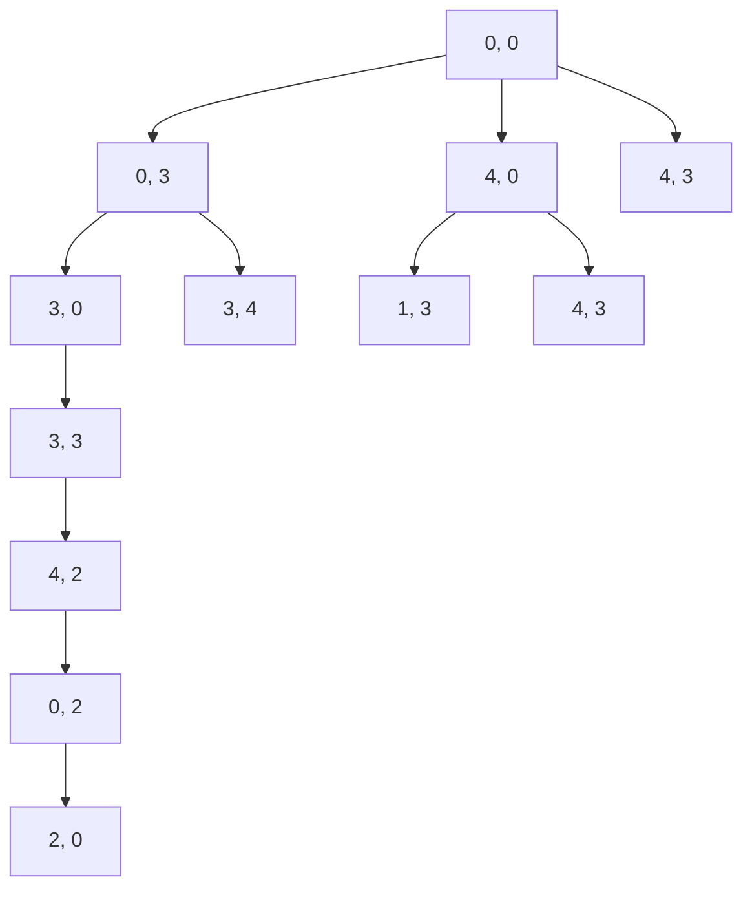

# State Space Representation

A state space essentially consists of a set of nodes representing each state of the problem, arcs between nodes, representing the legal moves from one state to another, an initial state and a goal state
A problem is defined as well-defined problem if the problem is composed of initial state, actions goal test and path cost
the actions and rules should be defined in as general way as possible.
If the specific rules are made, the rule set becomes very large, like for chess

# Production System
A production system consists of a set of rules, each consisting of a left-hand side (pattern) that determines the applicability of rules and a right side that describes the operation to be performed if the rule is applied.
e.g., vacuum robot

Pattern -> Action (Operation)

[A, clean] -> Right
[A, dirty] -> suck
[B, clean] -> Left
[B, dirty] -> Suck

A production system may have one or more knowledge base that contain whatever information is appropriate for the particular task.
A control strategy that specifies the order in which the rules will be selected and a way of resolving the conflicts that arise when several rules matched at once i.e. it must have a Rule Applier for conflict resolution.
The first requirement of a good control strategy is that it must cause motion.
The second requirement of a good control strategy is that it should be systematic

# Problem Classification

- Ignorable
    - intermediate actions can be ignored
    - e.g., water-jug problem
- Recoverable
    - the actions can be implemented to go the initial state
    - e.g., 8-puzzle game
- Irrecoverable
    - the actions cannot help to reachh the previous state
    - e.g., tic-tac-toe
- Decomposable
    - the problem can be broken down into similar ones
    - e.g., word puzzle game.

# Example Problem

- You are given two unlabeled empty water jugs X, Y that can hold 4 ltrs and 3 ltrs of water respectively. Now fill the water jug X with exactly 2 ltrs keeping jug Y empty from the pool

Production rule:

| State | Current State (left) and Condition | Next state right | Definition |
| --- | --- | --- | --- |
| 1 | (x, y) & x < 4 | (4, y) | Fill jug x |
| 2 | (x, y) & y < 3 | (x, 3) | Fill jug y |
| 3 | (x, y) & 0 < x <= 4 | (0, y) | Empty jug x |
| 4 | (x, y) & 0 < y <= 3 | (x, 0) | Empty jug y |
| 5 | (x, y) & x + y >= 4 | (4, y) - (4 - x) | Fill jug x from jug y |
| 6 | (x, y) & x + y >= 3 & x > 0 | (x - (3 - y), 3) | Fill jug y from jug x |
| 7 | (x, y) & x + y <= 4 | (x + y, 0) | Add water from jug y to jug x |
| 8 | (x, y) & x + y <= 3 | (0, x + y) | Add water from jug x to jug y |

Solution can be found as, where each new state is different from all previous.
here, we represent (x, y) as an ordered pair in the search space travel.

