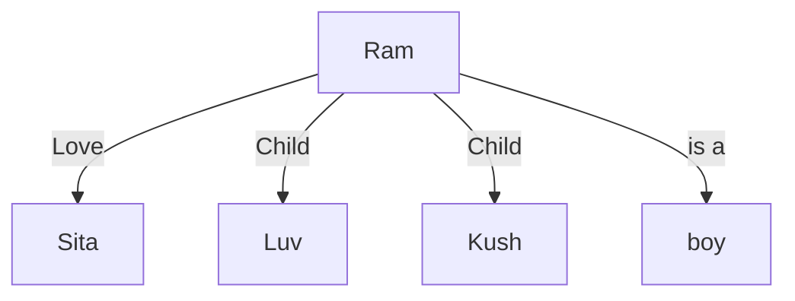

# Knowledge

- The fact or condition of knowing something with familiarity gained through experience or association
- the fact or condition of being aware of something is called knowledge

## Knowledge Storing

- Natural language for people
- symbols for computer:
    - a number or character string that represents an object or idea
    - internal representation of knowledge
- the core concepts:
    - mapping from facts to an internal computer representation
    - and also to a form that people can understand.

## Building a Knowledge Base (KB)
- KB is designed for grouping the various knowledge together in one place.
    - the KB is the central repository of information
    - containing the facts that we know about objects and their relationship
- Knowledge Engineering (knowledge acquisition)
    - the mapping of the set of knowledge in a particular problem domain
    - and converting it into a knowledge base
- Domain expert
    - who through years of experience
    - has gathered the knowledge about how things work 
    - and relate to one another, 
    - and know how to solve problems in their specialty
- Knowledge engineer
    - who can take that domain knowledge and represent it in a form for use by the reasoning system.
    - as an intermediary betwen the human expert and the expert system
    - the knowledge engineer must have good people skills as well as good technical skills
    - a combination of questionnaires, interviews, and first-hand observations
        - are used to give the knowledge engineer the deep understanding
        - required to transform the expert's knowledge into facts and rules for the knowledge base.
- Neural networks could be trained to perform classification and prediction tasks
    - without going through the expensive knowledge acquisition process.
- Neural networks may not be easily converted to a symbolic form,
    - they most definitely are a knowledge base,
    - because they encode the knowledge implicit in the training data.

# Knowledge Representation

- Simple facts or complex relationships
- mathematical formulas or rules for natural language syntax
- associations between related concepts
- Inheritance hierarchies between classes of objects
- knowledge is not a "one-size-fits-all" proposition

## Properties of knowledge representation systems

- Representational Adequacy
    - the ability to represent the required knowledge
- Inferential Adequacy
    - the ability to manipulate the knowledge to produce new knowledge
    - corresponding to that inferred from the original
- Inferential Efficiency
    - the ability to direct the inferential mechanisms 
    - into the most productive directions by storing appropriate guides
- Acquisitional Efficiency
    - the ability to acquire new knowledge using automatic methods
    - wherever possible rather than reliance on human intervention

## Knowledge Representation Methods

- Effective knowledge representation methods
    - easy to use
    - easily modified and extended 
        - changing the knowledge manually or
        - through automatic machine learning techniques

### Procedural Method

- Encode facts and define the sequence of operations step by step (Hardcoded logic)
- The weakness: the knowledge and the manipulation of that knowledge are inextricably linked

### Declarative Method

- Overcoming the weakness of procedural representation
- the states, facts, rules and relationships are separately declared.
- the separation of knowledge from the algorithm used to manipulate or reason 
    - with that knowledge provides advantages over procedural codes.

#### Diffferences

| Knowledge Engineering | Programming |
| --- | --- |
| Choosing a knowledge representation language | Choosing a programming language |
| Building a knowledge base | Writing a program |
| Implementing the proof theory | Choosing or writing a compiler
| Inferring new facts | Running  a program |
| knowledge engineer specifies what is true | Programmer specifies how to find a solution | 

### Relational Method

### Hierarchical Method

- Used to represent inheritable knowledge
- inheritable knowledge:
    - centers on relationships and shared attributes between different kinds or classes of objects
- Hierarchical knowledge
    - is best used to represent "is a" relationships, where a general or abstract type
    - e.g., ball
    - is linked to more specific types
    - e.g. ball -> rubber, golf, baseball, football
    - which inherit the basic properties of the general type
- The strength of object inheritance allows for compact representation of knowledge and allows for compact representation of knowledge and allows reasoning algorithm to process at different levels of abstraction or granularity
- the use of categories or types gives structure to the world by grouping similar objects together.
- using categories or clusters simplifies reasoning by limiting the number of distinct things we have to deal with

#### Capturing knolwedge

- Knowing what to expect based on the based on the elapsed time from one event to another is often the hallmark of intelligent behavior
- time concepts such as before, after, and during are crucial to common-sense reasoning and planning
- temporal logic is usually used to represent and reason about time

### Complex network graph

# Predicate Logic

- Formal logic is a language with its own syntax, which defines how to make sentences, and corresponding semantics, which describe the meaning of the sentences.
- Sentences can be constructed using proposition symbols (P, Q, R), and Boolean connectives, such as conjunction (AND), disjunction (OR), implication (P implies Q).
- e.g., if P and Q then R, the preceeding rule, P and Q, is called the premise or antecedent, and R is the conclusion or consequent
- Predicate logic introduces the concept of quantifiers, which allows us to refer to sets of objects
- using objects, attributes, and relations, we can represent almost any type of knowledge

# Structural Knowledge

- is baisc knowledge to problem solving.
- describes relationships of something
- it describes the relationship that exists between subjects to concepts or objects

# Knowledge Model

- A model is a world in which a sentence is true under particular interpretation
- there can be several models at once that have the same interpretation
- first order predicate logic consists of objects, predicates on objects, connectives, and quantifiers.
logic is simple representation which helps to infer new fact from the existing information
- predicates are relations between objects or properties of the objects
- connectives and quantifiers allow for universal sentences
- relation between objects can be true or false
    - .e.g, propositional logic

# Semantic Network

- Semantic network is an altenrative to predicate logic as a form of knowledge representation
- semantic network is a declarative graphic representation that can be used to represent knowledge and support automated systems for reasoning about the knowledge.
- The structure of a semantic net is shown graphically in terms of nodes and the arcs connecting each other. Nodes are sometimes referred to as objects, events, subjects while arcs represents the links or relation
- the links are used to express relationships
- it is argued that this form of representation is closer to the way human's structure the knowledge as a human also store the knowledge with relational link.
- for example
    - if a man lost bicycle key then he remembers where he had been, then he had used his bicycle last time etc., 
    - making this kind of relating scenario he goes to search those places
- advantages of semantic web/network
    - this method is easy to visualize
    - it is efficient in space requirement
    - the objects are represent only once.
- disadvantages of semantic of semantic web/network
    - it is unable to represent negation, quantification, disjunction, etc.
    - we cannot infer or deduct new information

## Example

### #1

Show the following statements in semantic network

1. Ram is a boy
2. Ram loves Sita
3. Ram's children are luv and kush

Solution

### #2

Show the following statements in semantic network

1. Tom is a cat
2. Tom caught a bird
3. Tom is owned by John
4. Tom is ginger in color
5. Cats like cream
6. The cat sat on the mat
7. a cat is a mammal
8. A bird is an animal
9. All mammals are animals
10. Mammals have fur

Solution:

``mermaid
flowchart LR
    A[John] -->|owns| b[tom]
    b -->|is a| c[cat]
    b -->|catches| d[bird]
    b -->|color| e[ginger]
    c -->|like| f[cream]
    c -->|sat| g[mat]
    c -->|is a| h[mammal]
    d -->|is a| i[animal]
    h -->|is a| j[animal]
    h -->|has| k[fur]
``

### #3

Show the following statement in semantic network

Mohan struct Nita in th garden with a sharp knife last week

``mermaid
flowchart LR
    A[Mohan] -->|who| B[strike]
    B -->|where| C[garden]
    B -->|when| D[last week]
    B -->|to whom| E[Nita]
    B -->|with| F[knife]
    B -->|with| G[knife]
    G -->|is| H[sharp]
``

# Frames

- frame is a static data structure used to represent well understood situation in a group of slots and slot fillers.
- frame is similar to a record structure
- it is used in many AI applications including vision and natural language processing that provides a convinient structure for representing
- a single frame is not much useful
- frame systems usually have collection of frames connected to each other
- frames are also useful for representing common sense knowledge
- while semantic nets are basically a two-dimensional representation of knowledge, frames add a third dimension by allowing nodes to have structures
- by using frame structure, we can use filler slots and inheritance, very powerful knowledge representation systems can be built.
- frame-based expert systems are very useful for representing casual knowledge because their information is organized by cause and effect
- frames are generally designed to represent either generic or specific knowledge.

## Structure of Frame

- Frame identification name
    - it is field written in top of the frame structure whereas name of the frame is placed.
    - example: a frame which stores knowledge about a car can have frame name as car
- Relationship of this frame to the other frame
    - it relates different frame to each other
    - example: a superclass of a frame (car) is a frame (vehicle)
- Knowledge about an attribute of an object and its value
    - attribute are written in slot and the value of slot is written in slot filler
    - example: a frame (car) can have an attirbute as no. of wheels with value 4
- Frame default information
    - these are slot values that are taken to be true when no evidence to the conotrary of frame has been formed
    - example: `Ram's car` frame copies the slot and slot values of its parent frame `car` like no. of wheel, model name, etc.

## Types of Frame

- Class frame
    - it is the main frame from which other frames can be inherited
- subclass frame
    - it is frame inherited from class `frame`
- instance frame
    - this frame is bottom frame from which no other frame can be derived
    - this frame may be derived from both subclass and class frame

## Types of Relationship

- Is-a relationship
    - it relates subclass frame with a class frame or an instance frame with a subclass or class frame
    - in this case a subclass frame or instance frame inherits all slots from a class frame and it can also include new slots
- Part-of relationship
    - it relates the slot values with its constituent parts
    - `Tire` part_of `Ram's Car`
- Semantic relationship
    - it relates object with its attributes and frame structure can be represented in semantic network.

