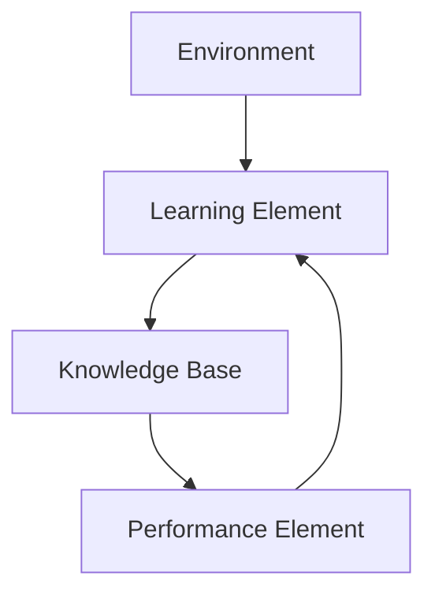

# Introduction to Learning

## What is Learning

- Learning is one of those everyday terms which is broadly and vaguely used in the English Language
- Learning is making useful changes in our minds
- Learning is constructing or modifying representations of what is being experienced.
- Learning is the phenomenon of knowledge acquisition in the abscence of explicit programming
- as per Herbert Simon, 1993:
    - Learning denotes changes in the system that are adpative in the sense that they enable the system to do the same task or tasks drawn from the same population more efficiently and more effectively next time.

## Implications

Learning involves 3 factors

- Changes
    - learning changes the learner.
    - For machine learning, the problem is determining the nature of these changes na dhow to best represent them
- Generalization
    - Learning leads to generalization
    - Performance must improve not only on the same task but on similar tasks.
- Learning leads to improvements
    - machine learning must address the possibility that changes may degrade performance and find ways to prevent it.

## Why machine learning?

- Many tasks would benefit from adpative systems
    - Robot exploring Marks
    - Software agents (OS functions, web searching)
    - Speech, vision, language
- Easier to build a learning system than to hand code a program of similar performance.

## Areas of Influence for machine Learning

- Statistics:
    - How best to use samples drawn from unknown probability distributions to help decide from which distribution new sample is drawn?
- Brain Models
    - Non-linear elements with weighted inputs (Aritificial neural networks) have been suggested as simple models of biological neurons
- Adaptive Control Theory
    - How to deal with controlling a process having unknown parameters that must be operated during operations.

e.g., Spam Filter, Digit Recognition

## Growth in Machine Learning

- Recent progress in algorithms and theory
- Growing flood of online data
- Computational power is available
- Budding Industry
- Three Niches
    - Data minig: using historical data to improve decision
    - SW Apps we cannot program by hand
    - Self customizing programs

## Classification Tasks

In classification, we predict labels y (classes) for inputs x

Example
- Spam detection (input: document, classes: spam/ham)
- OCR (input: images, classes: characters)
- Medical diagnosis (input: symptoms, classes: diseases)
- Fraud detection (input: account activity, calsses: fraud / normal)
- Customer Service email routing

and many more.

## Parts of Machine Learning

- Articicial Intelligence
- Bayesian Methods
- Cognitive Science
- Computational Complexity THeory
- Control THeory
- Information Theory
- Neuroscience
- Philosophy
- Psychology
- Statistics
- Optimization Learning Predictors, Meta-learning

# Terminologies

- Data
    - Labeled instances, e.g., emails marked spam/ham
    - training set, held out test, test set
- Features:
    - attribute-value pairs which characterize each x
- Experimentation Cycle
    - Learn parameters (e.g., model probabiltities) on training set
    - Tune hyperparameters on held-out set
    - Compute accuracy of test set
- Evaluation
    - Accuracy: fraction of instances predicted correctly
- Overfitting and generalization
    - Want a classifier which does well on test data
    - Overfitting: fitting on the training data very closely, but not generalizing well

# Learning Methods

There are two different kinds of information processing which must be considered in a machine learning system

1. Inductive Learning
    - concerned with determining general patterns, organizational schemes, rules and laws from raw data, experience or examples.
2. Deductive learning
    - concerned with determination of specific facts using general rules or the determination of new general rules from old general rules.

## Different Kinds of Learnign

- Supervised Learning
    - Someone gives us examples and the right answer for these examples
    - Need to predict the right answer for unseen examples
- Unsupervised Learning
    - We see examples, but get no feedback
    - Need to find patterns in the data
- Reinforcement Learning
    - We take actions and get rewards
    - Have to learn how to get high rewards

## Learning Framework

### Environment

- The environment refers the nature and quality of the information given to the learning elmeent
- The nature of information depends on its level
    - the degree of generality w.r.t the performance element
- Level of information
    - High level information is abstract, it deals with a broad class of problems
    - low level information is detailed, it deals with a single problem.
- The quality of information involves
    - noise free
    - reliable
    - ordered

### Learning Element

Four learning situations

- Rote Learning
    - environment provides information at the required level
- Learning by being told
    - information is too abstract, the learning element must hypothesize missing data
- Learning by example
    - information is too specific, the learning element must hypothesize more general rules
- Learning by analogy
    - information provided is relevant only to an analogous task, the learning element must discover the analogy.

