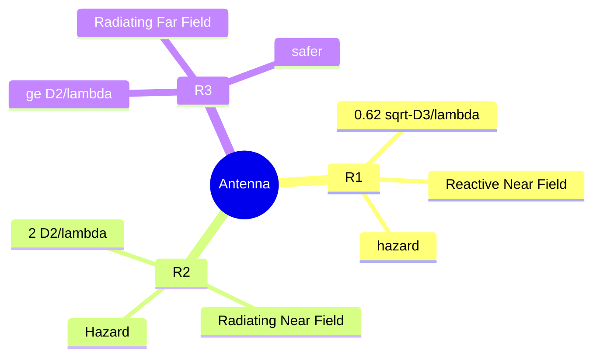

# A Microwave and RF Engineering
## A.1 Chapter 7 EM Radiation/Propagation
### A.1.1 Revision
PE -> V -> E field
KE -> I -> H field

V * I = power
E * H = power

V,I dropped over some impedance

### A.1.2 Energy
Energy -> Power -> Power density (W m$\large^{-2}$ ) -> Spectral PD (W $\large^{-2}$ mm$\large^{-1}$)
Spectral PD aka Radiation

all these parameters if travelling -> propagating
$$\large
P_r = \dfrac{P_t\cdot G \cdot \lambda \cdot A \cdot_e}{4\pi R^2}
$$
### A.1.3 1.A.2022-C Radiation Field
coming radiation = e-radiation
effect -> hazard

atmospheric remote sensing = 120 GHz
### A.1.4 Hazards
#### A.1.4.1 HERP
- hazards of EMR to Personnel
- human body comes once it penetrates exposed tisuses causes thermal biological effects
- force produced by an electric field on charged objects
- the rate of temperature rise in body substances due to microwave heating can be expressed as $\large \dfrac{dT}{dt} = \dfrac{Q}{C_p}$ ($^0$C/S ), 
	- where C$_p$ is the specific heat the biological substance and 
	- Q is the sum of SAR (Specific Absorption Rate) and metabolic rate of heat production per unit mass.
	- SAR = $\large \dfrac{m \cdot \sigma \cdot E^2}{\rho}$
		- where:
		- m = mass
		- $\sigma$ = specific conductivity
		- E = electric field
		- $\rho$ = Density
- IR is absorbed by the body in the form of quanta of energy. The quantum energy of radiation, for example
	- at 900 MHz and 1800 MHz equals 4 and 7 $\micro$eV
	- SAR of human being is about 0.03 W/Kg at 700 MHz
- parameters example:
	- cloud
		- 90 Ghz
		- D = 0.2 m
	- ATC
		- 1.9 GHz
		- D = 2m
	- 

# B Organization and Management

