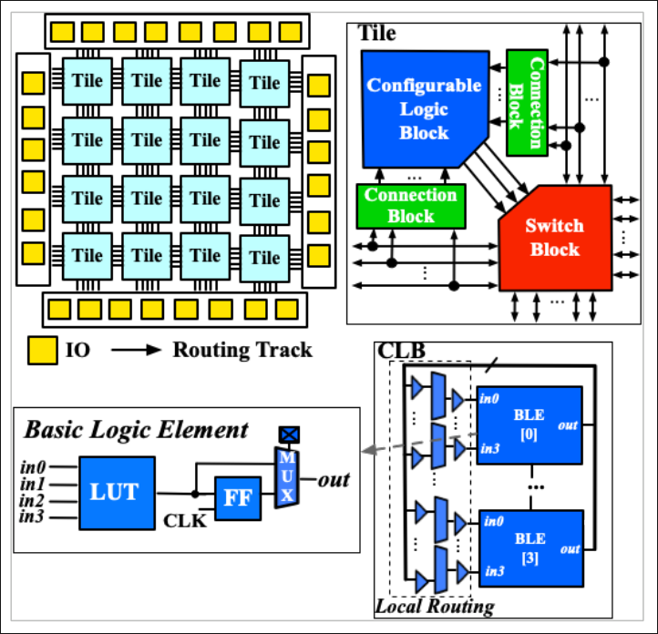
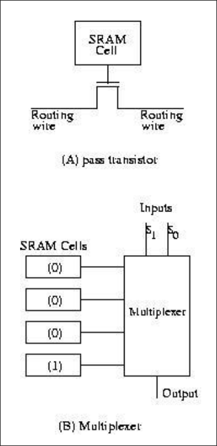
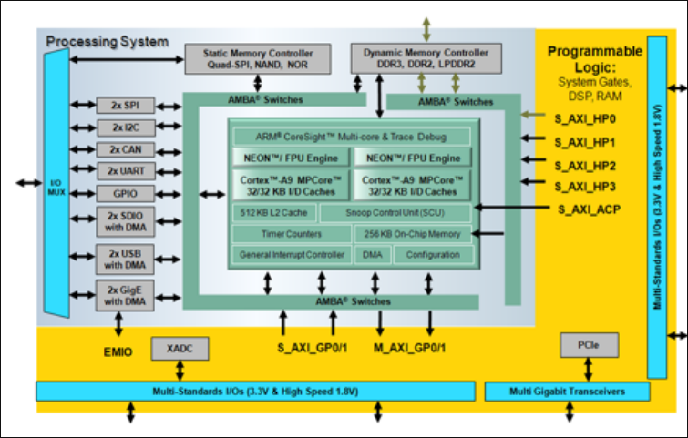
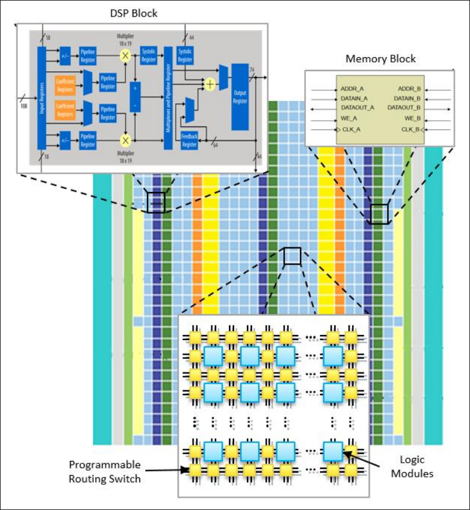
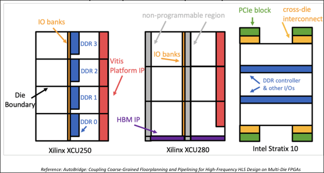
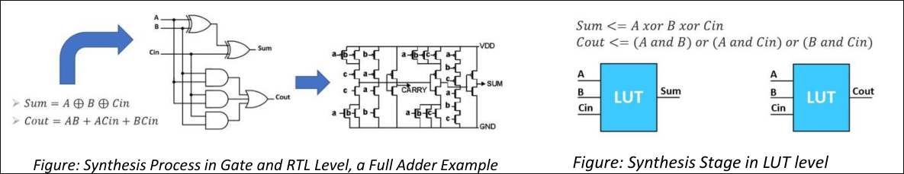
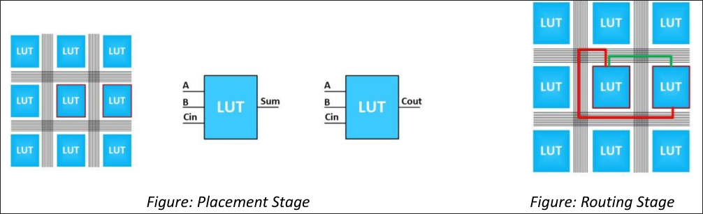
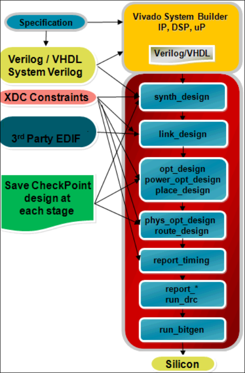
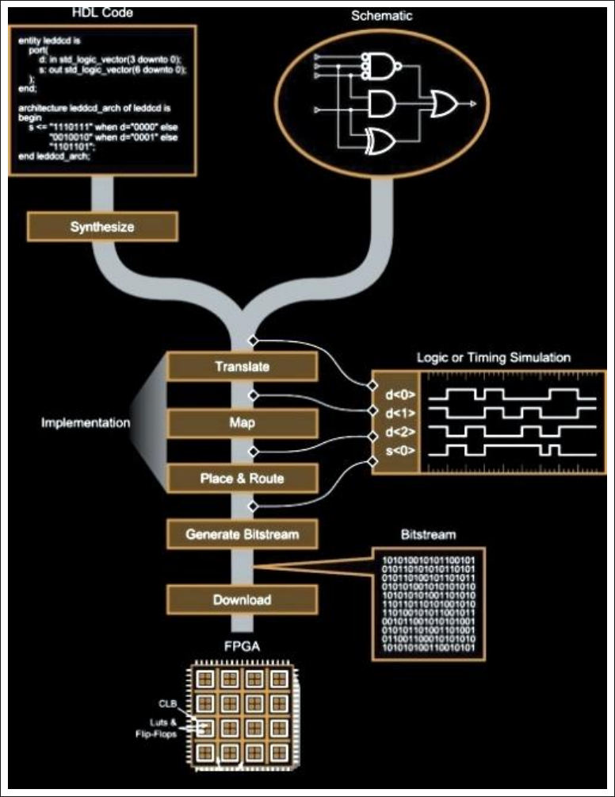

<p style="text-align: center">
    <b> 5 Hours <br> 9 Marks</b>
</p>
<hr style="width:500px; height:5px;">

# A. FPGA Overview and Evolution

## A.1. What is an FPGA?

- **FPGA** = **F**ield **P**rogrammable **G**ate **A**rray.
- A reprogrammable semiconductor chip containing an array of configurable logic blocks, memory, and routing resources that the user wires together (in the field, i.e., after manufacturing) to build custom digital circuits, as opposed to an ASIC, whose logic is fixed at fabrication.
- Because the same physical chip can implement virtually any digital function, FPGAs dominate applications needing flexibility, fast time-to-market, or parallel/pipelined processing.
- **Reconfigurability**: the whole device (or, with **partial reconfiguration**, just a region of it) can be reprogrammed with a new bitstream. Partial reconfiguration lets one part of the design keep running live while another part is being swapped out, useful for field upgrades, multi-mode radios, adaptive systems, etc.
- Beyond digital fabric, many FPGAs also include **analog features**: programmable I/O slew rate and drive strength, on-die differential comparators for LVDS/other differential signalling, and, in **mixed-signal FPGAs**, hardened ADCs/DACs with analog front-end conditioning, letting a single chip behave as a small system-on-chip (SoC).
- Modern FPGAs have evolved into **heterogeneous SoCs**: a single die can combine FPGA fabric, general-purpose CPU cores, and even GPU cores, so that a design can freely offload workloads to whichever engine suits it best (e.g., control code on the CPU, pixel-parallel work on the fabric).

## A.2. Key Characteristics

- Built from a mix of programmable logic resources: **LUTs**, **flip-flops (FFs)**, **Block RAM (BRAM)**, **DSP slices**, and **I/O blocks**.
- Configured using a **HDL** (Hardware Description Language VHDL/Verilog) design that is compiled down to a **bitstream**, a binary file that programs every configurable switch and memory cell on the device.
- Device size scales from a few thousand logic cells to devices with millions of logic elements.
- Fully **re-programmable**: the same physical part can be reloaded with a different design any number of times (except one-time-programmable variants, see Section D.3).

## A.3. FPGA vs. Microcontroller/Microprocessor

| Aspect | Microcontroller (MCU) | FPGA |
|---|---|---|
| Architecture | Fixed silicon architecture set by the vendor | User defines the internal architecture/datapath |
| Execution model | Sequential: one (or few) instruction stream(s) | Massively parallel: every block can operate concurrently |
| Processing capacity | Limited by fixed memory/CPU resources | Scales with device size: large clock trees (100s of MHz–GHz), large logic fabric, embedded RAM/ROM, large I/O count |
| Task handling | Best at a single/specific task at a time | Naturally suited to multiple simultaneous, independent tasks |
| Latency/throughput | Higher processing latency for parallel work | Lower latency for parallel/streaming workloads because there's no instruction-fetch bottleneck |
| NRE / time-to-market | Software changes are cheap but hardware is fixed | Lower NRE than ASIC, fast design iteration, but higher unit cost than a mass-produced MCU |
| DSP-heavy algorithms | Runs sequentially: throughput-limited | Dedicated DSP slices give hardware-parallel multiply-accumulate |
| Flexibility | None post-fabrication | Can even be used to *build and verify* a soft microcontroller core |

## A.4. FPGA vs. ASIC

| Aspect | FPGA | ASIC |
|---|---|---|
| Design cycle | Weeks–months (roughly ~9-month typical cycle) | Often 2–3 years |
| NRE cost | None: no mask set required | Very high: mask sets alone can run **$100K–$500K+**, with total NRE for advanced nodes reaching **$3–5M+** |
| Unit cost | Higher per-unit cost, even at volume | Lower per-unit cost, but only economical at **high volume** (NRE amortized over millions of units) |
| Power | Generally higher power due to the general-purpose programmable fabric and configuration overhead | Lower power, logic is custom-built for exactly one function |
| Performance for a fixed function | Good, but with routing/config overhead | Best: logic and layout optimized specifically for the target function |
| Field updates | Possible (reprogram or partially reconfigure) | Not possible: logic is frozen at fabrication |
| Risk | Low: bugs can be fixed by reprogramming | High: a silicon bug may require a costly re-spin |

- Moore's Law and the growth of FPGA capability (SoC/MPSoC integration, hardened DSP/memory/transceiver blocks) mean many workloads that once *required* an ASIC can now be met with an FPGA, closing part of the performance/power gap while retaining reprogrammability.

## A.5. History of FPGA (Selected Timeline)

| Year | Milestone |
|---|---|
| 1960 | First MOSFET demonstrated |
| 1961 | First integrated circuit used for communications |
| 1962 | First TTL (Transistor-Transistor Logic) devices |
| 1963 | First CMOS process demonstrated |
| 1985 | **Xilinx ships the XC2064 - the first commercial FPGA** |
| 1987 | Devices with roughly 600,000 reprogrammable gates demonstrated |
| 1992 | Steve Casselman builds one of the first FPGA-based reconfigurable computers; related patent issued |
| 1993 | Actel holds roughly 18% share of the FPGA market |
| 2013 | Altera, Actel (by then part of Microsemi) and Xilinx together represent roughly 77% of the FPGA market |
| 2014 | Microsoft begins using FPGAs in Bing search infrastructure (Project Catapult) |
| 2018 | FPGA deployment expands across other Microsoft/Azure datacenter workloads |
| 2019 | Asia-Pacific becomes the largest regional market for FPGAs |
| 2020 | Worldwide FPGA market valued at roughly **US$5.13 billion** |
| 2021 | Global FPGA market valued at roughly **US$5.72 billion** |
| 2022 onward | FPGAs see broad adoption across telecom, automotive, AI/ML inference, and datacenter acceleration |


## A.6. FPGA Applications

FPGAs are used wherever reconfigurable, parallel, low-latency hardware is valuable:

- **Medical electronics**: imaging systems, patient monitors, portable diagnostics
- **Security systems**: encryption/decryption, surveillance video processing
- **Wireless communications**: baseband processing, 5G/6G basestations, SDR
- **Financial/distributed monetary systems**: low-latency algorithmic trading
- **Aerospace & defense**: radar, electronic warfare, avionics (often needing rad-hardened variants)
- **Scientific instruments**: particle physics DAQ, high-speed data acquisition
- **Video & image processing**: real-time encode/decode, computer vision
- **Data center acceleration**: search, AI inference, storage/network offload

---

# B. General Architecture of FPGA


At a high level, every FPGA, regardless of vendor, is built from three classes of resources arranged in a regular, repeating grid (an **"island-style"** layout):

1. **Configurable/Logic Blocks** (CLBs in Xilinx terms, Logic Array Blocks in Intel terms): implement combinational and sequential logic.
2. **Programmable Interconnect**: wires and switches that route signals between blocks.
3. **I/O Blocks**: interface the fabric to the outside world.

```
        IOB   IOB   IOB   IOB
       ┌───┬─────┬─────┬─────┬───┐
  IOB  │CLB│ CLB │ CLB │ CLB │IOB
       ├───┼─────┼─────┼─────┼───┤
  IOB  │CLB│ CLB │ CLB │ CLB │IOB     <- CLBs are "islands"
       ├───┼─────┼─────┼─────┼───┤       surrounded by a
  IOB  │CLB│ CLB │ CLB │ CLB │IOB       "sea" of routing
       └───┴─────┴─────┴─────┴───┘
        IOB   IOB   IOB   IOB
```

## B.1. Logic Blocks (CLBs / LABs / ALMs)

- The CLB is the fundamental logic-building unit. Internally it contains **LUTs**, **flip-flops**, and **multiplexers**, connected through a small **local routing matrix**.
- CLBs are grouped in **slices** (Xilinx), e.g., a Virtex/UltraScale CLB contains multiple slices, each with several 6-input LUTs, associated flip-flops, and fast carry-chain logic for efficient arithmetic.
- **Granularity** of a logic block can be classified as:
  - **Fine-grained**: small primitives like a single NAND/AND/OR/NOT gate (found in some older/academic architectures).
  - **Medium-grained**: LUT/MUX-based or small RAM/ROM-based blocks (the mainstream commercial approach).
  - **Coarse-grained**: larger fixed function units such as floating-point blocks or embedded processor cores.


## B.2. Switch Matrix / Connection & Switch Boxes

- Each CLB sits next to a **switch matrix** (switch box) that connects it into the **general routing fabric**.
- **Connection boxes** attach a logic block's inputs/outputs to nearby routing tracks; **switch boxes** connect horizontal and vertical routing tracks to each other so a signal can turn corners and travel across the die.
- Routing tracks come in different lengths, short "local" segments for nearby connections and long "longlines" that span most of the device for wide/global signals.
- Routing/interconnect typically consumes the **majority of the chip's die area** (on the order of 80–90% in many academic architecture studies), which is why routing-aware placement and routing algorithms matter so much in the design-tool flow.

## B.3. I/O Blocks (IOBs)

- Sit at the periphery of the fabric (and increasingly inside high-speed I/O columns) and translate between the FPGA's internal logic levels and external voltage/signalling standards.
- Contain input and output buffers, often with edge-triggered flip-flops in the I/O path for fast, well-timed data transfer to/from the pin.
- Configurable for many single-ended (LVCMOS, LVTTL) and differential (LVDS, etc.) I/O standards, with programmable drive strength, slew rate, and on-chip termination.
- I/O blocks and their support circuitry occupy a large fraction of overall device area, especially on smaller devices.

## B.4. Configuration Interface

- Every FPGA needs a way to load its **bitstream** (the file that sets every SRAM configuration cell that defines the LUT contents, routing switches, and I/O settings).
- Configuration interfaces are typically **serial** (e.g., JTAG, SPI-based configuration from flash) or **parallel** (SelectMAP-style), depending on device family and required configuration speed.
- On **SRAM-based** FPGAs, configuration is volatile, it must be reloaded from an external non-volatile source (flash, EEPROM, or a host processor) every power-up.

---

# C. Building Blocks of FPGA

## C.1. LUT (Look-Up Table)

- The core combinational-logic primitive. A **k-input LUT** contains \(2^k\) SRAM configuration cells, each holding one row of a truth table, so a k-input LUT can implement **any** Boolean function of up to k variables simply by loading the right bit pattern.
- **4-input LUTs** were the traditional mainstream size for many years; modern high-performance families (e.g., Xilinx 7-Series and later) use **6-input LUTs**, often with two outputs (an LUT6 can be split into two LUT5s sharing inputs), improving logic density and reducing the number of levels of logic (and hence delay) needed for wide functions.
- LUTs can also be repurposed as small **distributed RAM** or **shift registers (SRL)** when not needed purely for logic, a technique the tools use automatically or that a designer can infer explicitly.

## C.2. Flip-Flops (FF)

- Provide the sequential storage element paired with each LUT, capturing the LUT's combinational output on a clock edge to build synchronous logic (registers, counters, state machines, pipelines).
- Typically D-type flip-flops, with configurable set/reset polarity, clock-enable, and sometimes selectable as latches.
- Every slice contains multiple LUT+FF pairs, wired through local multiplexers so a designer can freely mix combinational-only, sequential-only, or fully-pipelined logic within one slice.

## C.3. Configurable Logic Block (CLB): Composition

- A CLB packages together: **LUTs**, **flip-flops**, **multiplexers** (for local signal steering/selection), and dedicated **carry-chain logic** (for fast ripple-carry addition/subtraction/comparison).
- LUTs implement the combinational logic function; MUXes select/route between LUT outputs, carry logic, or wide-function combining paths; FFs register the result.
- The number of LUTs per CLB/slice varies by vendor and family, commonly 4, 6, or more inputs per LUT, with 8 LUTs and 16 FFs being a typical modern Xilinx CLB (2 slices × 4 LUTs each, in some families).
- A modern mid-to-large FPGA can contain many tens of thousands to well over a million CLB-equivalent logic cells.

## C.4. DSP Slices (Dedicated Arithmetic Blocks)


- Because arithmetic-heavy operations (multiply, multiply-accumulate, filtering) are extremely inefficient to build purely from LUTs, modern FPGAs embed **hardened DSP blocks** directly in the fabric.
- **Xilinx DSP48E2** (UltraScale/UltraScale+ family, successor to DSP48E1 in 7-Series, DSP48A/A1 in Spartan-6, and the original DSP48 in Virtex-4) is a representative example. A single DSP48E2 slice contains:
  - A **27-bit pre-adder**
  - A **27×18-bit two's-complement multiplier**
  - A **48-bit accumulator / ALU** (supporting add, subtract, and bitwise logic operations, including a 96-bit-wide XOR mode useful for CRC/GF(2ⁿ) arithmetic)
  - Multiple internal **pipeline registers** (on the A/B inputs, after the multiplier, and after the ALU) that can be individually enabled for higher clock speed
  - **Cascade ports** (ACIN/ACOUT, BCIN/BCOUT, PCIN/PCOUT) that chain adjacent DSP slices together without going back through general routing, enabling efficient wide multipliers, systolic-array MAC chains, and long FIR filters
- Intel/Altera calls the equivalent resource a **"variable-precision DSP block"**; functionality is broadly similar (hardened multiply/add/accumulate) though the exact bit-widths and modes differ by vendor.
- Some FPGA families (e.g., certain Intel Agilex/Stratix and AMD Versal devices) support **hardened floating-point arithmetic** in the DSP fabric in addition to fixed/integer point, which is valuable for HPC and some ML workloads.
- DSP slices are typically arranged in **columns**, physically adjacent to BRAM columns, so that data can move between memory and arithmetic with minimal routing delay, important for high-throughput filters and matrix operations.
- Using DSP slices instead of LUT-built arithmetic gives higher clock frequency, lower latency, and dramatically lower LUT utilization for the same function.


## C.5. Block RAM (BRAM)

- **BRAM** is dedicated, hardened on-chip memory distributed throughout the fabric (again, usually column-aligned near DSP columns for locality).
- Typical Xilinx BRAM is organized as **36 Kb dual-port tiles**, each splittable into two independent **18 Kb** blocks, giving designers flexibility between one large memory or two smaller/independent ones.
- Configurable as **true dual-port** RAM (two independent read/write ports, different clocks allowed), single-port RAM, simple dual-port, ROM, or **FIFO** (with built-in FIFO control logic in many families).
- Many BRAM implementations include built-in **ECC (Error Correcting Code)** support, useful for high-reliability designs (aerospace, datacenter, automotive).
- Larger UltraScale+ devices additionally offer **UltraRAM (URAM)**, a denser, larger-block memory (e.g., 4K × 72-bit per block) intended to replace external SRAM for packet buffers, lookup/coefficient tables, and other large on-chip storage needs, without consuming the (comparatively scarcer) BRAM budget.
- Beyond BRAM/URAM, small amounts of memory can also be built from LUTs configured as **distributed RAM**, useful for small, fast, register-file-like storage where a full BRAM tile would be wasteful.
- Typical uses: FIFOs and elastic buffers, packet/line buffers for video or networking, coefficient/lookup tables, cache-like structures for soft processors, and shift-register-style delay lines.

## C.6. Clock Resources

Reliable, low-skew, low-jitter clock distribution is critical since virtually every FPGA resource (FF, BRAM, DSP, transceiver) is clocked.

- **Global Clock Inputs**: dedicated pins (often paired with the I/O banks) specifically designed to bring an external clock signal onto the chip with minimal jitter.
- Some FPGAs (e.g., Xilinx Artix-7) have **no internal clock oscillator**, the user must supply an external reference clock on one of these clock-capable pins; the FPGA does not generate its own base timing reference from scratch.
- **Clock Management Tile (CMT)**: a hardened block (one or more per device, arranged in columns near the I/O banks) that processes an incoming reference clock. Each CMT typically contains:
  - **MMCM (Mixed-Mode Clock Manager)**: the more feature-rich clocking resource: frequency synthesis (multiply/divide to generate new frequencies), fine-grained phase shifting, jitter filtering/attenuation, duty-cycle correction, and in some families dynamic reconfiguration of clock parameters at runtime.
  - **PLL (Phase-Locked Loop)**: a functional subset of the MMCM (frequency synthesis and phase alignment, less flexible than the MMCM), often used when phase-shift/dynamic reconfiguration isn't needed and a leaner resource suffices.
- **Global Clock Buffers (BUFG and variants: BUFGCTRL, BUFGCE, BUFGCE_DIV, BUFH, BUFR, BUFIO, BUFMR, BUFG_GT for transceiver clocks, etc.)**: distribute the CMT's output clocks across the die on a dedicated **low-skew clock tree**, separate from general-purpose routing, so every flip-flop in a clock domain sees the edge at (nearly) the same time.
  - **BUFGCE** in particular provides glitch-free clock gating (a synchronized clock-enable), which is a standard technique for reducing dynamic power by stopping the clock tree in unused regions.
- Clocking resources are organized hierarchically by **clock region** (a fixed grid of CLB rows/I/O banks), with global clocks reaching the whole device and regional/local buffers (BUFR, BUFIO, BUFH) serving smaller areas with even lower latency for things like I/O-adjacent high-speed logic.
- **Design guidance**: use the vendor's **Clocking Wizard** IP to configure MMCM/PLL settings correctly, minimize the number of distinct clock domains, avoid cascading clock buffers unnecessarily (adds skew/delay), and use proper clock-domain-crossing (CDC) synchronizers/FIFOs whenever signals cross between asynchronous clock domains.

## C.7. Programmable Interconnect

- Connects CLBs, DSP slices, BRAM, and I/O blocks together to realize the user's design, using a hierarchy of **switch boxes**, **connection boxes**, **multiplexers**, **pass transistors**, and **tri-state buffers** (the latter useful for bidirectional I/O signal paths).
- Signals may travel over multiple routing-track lengths: short, medium, and long lines, chosen automatically by the place-and-route tool to balance delay against routing-resource congestion.

## C.8. Recent Advancements in FPGA Building Blocks

- Newer FPGA architectures increasingly embed **application-specific hardened blocks** directly in the fabric rather than relying purely on general-purpose logic, e.g.:
  - Hardened video codec blocks (H.264/H.265 encode/decode)
  - AI/ML inference engines (e.g., Xilinx/AMD Versal's AI Engine array, Intel's AI-optimized tensor blocks)
  - Hardened high-speed protocol controllers (PCIe, Ethernet MAC/PCS, Interlaken)
- The general design trend is: pack more/larger LUTs per unit area at lower power, add more flexible on-chip memory hierarchy (BRAM + UltraRAM), and push more arithmetic (adders/multipliers/MAC) into hardened DSP blocks to reduce latency, routing congestion, and power versus building the same function from soft logic.

## C.9. XADC (Analog-to-Digital Conversion Block)

- Since many modern systems need to process analog signals within an otherwise digital pipeline, some FPGAs embed a dedicated **ADC** block.
- On Xilinx **Artix-7**, this is the **XADC**, a dual 12-bit, 1 MSPS ADC with on-chip temperature and voltage sensors, plus multiple auxiliary analog input channels, letting the FPGA sample analog signals after they've been sampled/quantized without needing an external ADC chip for lower-precision use cases.

## C.10. High-Speed Serial I/O Transceivers (HSSIO)

- Dedicated, hardened SerDes (**Ser**ializer/**Des**erializer) circuits for very high-speed point-to-point serial communication, see **Section E** for full treatment.
- Xilinx families use naming such as **GTP, GTX, GTH, GTY, GTM** depending on generation/performance tier.

## C.11. Xilinx Artix-7 (XC7A35T): Concrete Example

The Artix-7 XC7A35T FPGA is composed of these principal building blocks, illustrating how the general concepts above map onto a real, low-cost device:

1. Input/Output Blocks (IOBs)
2. Programmable interconnect resources
3. Block RAM (BRAM)
4. DSP slices (DSP48E1 generation)
5. CLBs (Configurable Logic Blocks)
6. **XADC** block (dual 12-bit ADC, see C.9)
7. High-speed serial I/O transceivers (GTP, on Artix-7 variants that include them)
8. **PCIe** hard IP block/interface (on parts that support it)
9. Clock Management Tiles (CMTs)

---

# D. FPGA Programming Technologies

Different FPGA families store their configuration using different underlying memory technologies, each with different trade-offs.

## D.1. Open-Source FPGA Architecture (context/example)

- Projects such as the **OpenFPGA** project publish fully open FPGA architecture descriptions and toolchains, used mainly for architecture research and education rather than commercial silicon.
- 

## D.2. SRAM-Based Programming Technology

- Uses **SRAM cells** to control pass transistors and/or transmission gates throughout the routing fabric, and to hold LUT truth-table contents.
- **Volatile**: configuration is lost on power-down.
  - Requires an external non-volatile configuration store (flash/EEPROM/host processor).
  - Needs a defined **power-on configuration sequence** to load the bitstream each time the device powers up.
  - **In-circuit re-programmable**: can be reconfigured essentially unlimited times, including via **partial reconfiguration**.
- Relatively **short configuration time** compared to some alternative technologies.
- Occupies a **relatively larger silicon area** per configuration bit than fuse-based alternatives (six-transistor SRAM cells are larger than a fuse/antifuse element).
- **Xilinx and Intel (Altera)** FPGA product lines are predominantly SRAM-based, this is by far the dominant technology in mainstream commercial FPGAs today because it scales well with modern CMOS process nodes and supports full reprogrammability.
- 

## D.3. Antifuse Programming Technology

- Uses a one-time-programmable **antifuse** element: normally high resistance, it is "blown" into a permanent low-resistance connection during programming.
- **Very low ON resistance** once programmed → faster signal propagation through the programmed interconnect than an equivalent SRAM-controlled pass transistor.
- The antifuse element itself is very small, so **interconnect area is relatively lower**; the trade-off is that the **programming transistors/circuitry** needed to blow the antifuse must be larger, offsetting some of that area advantage.
- **One-Time Programmable (OTP)**:
  - Cannot be reprogrammed, once blown, the connection is permanent, so no design changes are possible after programming.
  - **Retains its configuration with power removed**, no external configuration memory or power-on load sequence is needed, which is attractive for security- and reliability-critical applications (the design can't be read back or altered, and there's no risk of configuration corruption at power-up).
- Historically associated with **Actel** (now part of Microsemi/Microchip) antifuse FPGA families, often used in aerospace/defense and other high-reliability, tamper-resistant applications.

## D.4. Flash-Based Programming Technology (for completeness)

- A third common technology, used by some Microchip/Microsemi families (e.g., ProASIC3, IGLOO, and elements of SmartFusion/PolarFire), stores configuration in **on-chip non-volatile flash cells**.
- **Non-volatile** (retains configuration without power, unlike SRAM) but **is reprogrammable** (unlike antifuse), combining some benefits of both approaches, at the cost of a more complex fabrication process than pure SRAM.

---

# E. General Architecture: Vendor Comparison Summary

| Feature | Xilinx/AMD | Intel/Altera |
|---|---|---|
| Logic block name | CLB (Configurable Logic Block) | ALM (Adaptive Logic Module) |
| LUT size | Typically 6-input | Typically an 8-input adaptive LUT structure (fracturable into smaller LUTs) |
| DSP block | DSP48E1/E2 (27×18 multiplier, pre-adder, ALU) | Variable-precision DSP block |
| Embedded memory | Block RAM (36 Kb tiles) + UltraRAM (UltraScale+) | M20K / MLAB memory blocks |
| High-speed transceivers | GTP / GTX / GTH / GTY / GTM | Various-speed transceiver tiles |
| Programming technology | SRAM-based | SRAM-based |

## E.1. Vendor-Specific Architecture Notes

- Every commercial FPGA vendor implements the same *conceptual* building blocks (logic, memory, DSP, I/O, routing, clocking) but differs in the exact internal circuit design, bit-widths, LUT input count, and how densely/where these blocks are packed, which is why the same RTL can synthesize to very different resource utilization and performance across vendors.

---

# F. SoC / MPSoC FPGA Architectures

Modern high-end FPGAs are no longer "just" programmable logic, they integrate a full hard-processor subsystem alongside the FPGA fabric, forming a true **System-on-Chip (SoC)** or, when multiple heterogeneous processor types are combined, a **Multi-Processor SoC (MPSoC)**.

## F.1. Xilinx Zynq-7000 (SoC generation)

- Combines a **Processing System (PS)** and **Programmable Logic (PL)** on one die.
- **PS** includes:
  - **Application Processing Unit (APU)**: dual **ARM Cortex-A9** processors
  - **512 KB L2 cache**
  - **256 KB on-chip memory (OCM)**
  - Integrated **DDR memory controller**
  - A rich set of I/O peripherals and controllers (UART, SPI, I2C, USB, GEM/Ethernet, SD/SDIO, etc.)
- **PL** includes configurable logic (CLBs), DSP slices, and block RAM, essentially a "normal" FPGA fabric tightly coupled to the PS.
- **PS–PL interconnect**: three main interface types connect the two halves:
  - **General Purpose (GP) AXI ports**: simple control-plane connections to the PS's slave interconnect, for register access/control from the CPU into PL logic.
  - **High-Performance (HP) AXI ports**: wider, buffered, higher-bandwidth data-plane ports for PL masters to move bulk data to/from memory.
  - **Accelerator Coherency Port (ACP)**: a low-latency path for PL masters that optionally maintains **cache coherency** with the APU's L1/L2 caches, useful when a PL accelerator needs to share data structures with software running on the ARM cores without manual cache-flush overhead.
- Scalable programmable logic density lets the same PS be paired with different PL sizes across the Zynq-7000 product range.
- 

## F.2. Xilinx Zynq UltraScale+ MPSoC (next generation)

A genuine **MPSoC** because it integrates *multiple, heterogeneous* processor types (not just one CPU class) alongside the PL:

- **APU (Application Processing Unit)**: quad-core (or dual-core, on smaller parts) **ARM Cortex-A53**, 64-bit ARMv8-A, running general-purpose OSes (Linux, etc.); typically backed by 32 KB L1 I/D cache per core and a shared L2 cache.
- **RPU (Real-Time Processing Unit)**: dual-core **ARM Cortex-R5F**, 32-bit ARMv7-R, with dedicated **Tightly Coupled Memory (TCM)** for deterministic, low-latency real-time control tasks (motor control, safety logic, sensor fusion) that shouldn't be at the mercy of a general-purpose OS's scheduling jitter.
- **GPU**: an optional **Mali-400 MP2** graphics processor (pixel + geometry processing) for display/graphics workloads.
- **PL (Programmable Logic)**: the FPGA fabric, as in Zynq-7000, but larger/faster and with more of the surrounding SoC infrastructure hardened.
- **Power domains**: the device is partitioned into multiple independent power domains for fine-grained power management:
  - **Low-Power Domain (LPD)**: RPU and low-power peripherals
  - **Full-Power Domain (FPD)**: APU, GPU, and high-performance interconnect
  - **PL Power Domain (PLPD)**: the programmable logic fabric
  - **Battery Power Domain (BPD)**: always-on functions (e.g., battery-backed RAM, RTC) that must survive when the rest of the chip is powered down
- **Memory protection & isolation**: hardware **XMPUs (Xilinx Memory Protection Units)** and **XPPUs (Peripheral Protection Units)** let a designer create hardware-enforced isolation boundaries between subsystems (e.g., isolate the safety-critical RPU subsystem from the Linux-running APU), which is important for mixed-criticality and security-sensitive systems.
- **DDR memory controller**: a shared, multi-port DDR controller (commonly with **6 ports**) that arbitrates access from many masters (APU, RPU, PL masters, GPU, display, and high-speed peripherals like USB, PCIe, DisplayPort, SATA), all contending for external DRAM bandwidth.
- Used heavily in applications needing simultaneous general-purpose compute + deterministic real-time control + custom hardware acceleration on a single chip, e.g., industrial control, automotive ADAS, software-defined radio, and instrumentation.

## F.3. Intel (Altera) SoC FPGA Architecture

- Intel/Altera FPGA fabric is built from:
  - **Logic Modules / Adaptive Logic Modules (ALMs)**: the ALM equivalent of a CLB, using a fracturable adaptive LUT structure
  - **Programmable routing switch**
  - **DSP blocks**
  - **Memory blocks (M20K/MLAB)**
- **Intel Stratix 10 SoC FPGA**, positioned as a cloud/datacenter-class device, adds:
  - A hardened **ARM-based processor subsystem** paired with the programmable fabric (similar SoC concept to Zynq)
  - **High-speed interfaces**, notably **PCIe** for host connectivity
  - **High-bandwidth memory (HBM)** integration on select variants, for workloads needing very high memory bandwidth (e.g., large-model AI inference, HPC)
    - 

## F.4. Microchip (Microsemi) FPGA Architecture

- Microchip's FPGA portfolio includes the **IGLOO**, **PolarFire**, and **SmartFusion** families.
- **PolarFire** FPGAs are cost/power-optimized, mid-range-performance devices fabricated on a **28 nm** process, notable for very low static power.
- PolarFire highlights:
  - Programmable fabric ranging from roughly **100,000 to 500,000 logic elements (LEs)** depending on device
  - Integrated transceivers supporting up to **12.7 Gbps** per lane
  - **SmartFusion** parts additionally integrate a hard ARM Cortex-M3 microcontroller subsystem alongside the FPGA fabric, similar in spirit to Zynq's PS+PL model but aimed at smaller/lower-power embedded designs.

---

# G. High-Speed Interfaces and Their Role in SoC/MPSoC FPGAs

High-speed I/O is what lets an FPGA/SoC move large amounts of data in and out fast enough to keep its compute resources (PS, PL, DSP, AI engines) fed, without it, even a very capable fabric would be bottlenecked by external bandwidth.

## G.1. High-Speed Serial Transceivers (SerDes)

- Dedicated hardened blocks: **GTP / GTX / GTH / GTY / GTM** on Xilinx/AMD devices (roughly increasing in max data rate/feature set in that order); Intel/Altera devices have analogous transceiver tiles.
- Function: **serialize** wide parallel data into a high-speed differential serial stream for transmission, and **deserialize** the received stream back into parallel data, recovering the clock from the incoming data itself (**Clock and Data Recovery, CDR**) rather than requiring a separate clock wire.
- Modern transceivers on UltraScale+-class devices support per-lane rates up to roughly **32.75 Gb/s** (GTY), with many lanes per device (some parts offer 16–32+ full-duplex lanes), and can be **bonded/channel-aggregated** for even higher combined throughput.
- Internally include: **equalizers** (to compensate for PCB/cable signal loss), **scramblers** (to maintain good signal transition density for reliable clock recovery), **8b/10b or 64b/66b line encoding**, and built-in test/debug features such as **IBERT (Integrated Bit Error Ratio Tester)**, which can display an eye diagram to debug signal-integrity issues.
- These raw transceivers are the *physical layer*, a higher-level **protocol** (below) is layered on top to give them meaning.

## G.2. Protocols Carried Over High-Speed Transceivers

| Protocol | Typical Use | Line Encoding | Typical Speed Range |
|---|---|---|---|
| **PCI Express (PCIe)** | Host-to-accelerator connectivity (GPU, SSD, FPGA accelerator cards) | 8b/10b (Gen1/2), 128b/130b + scrambling (Gen3+) | ~2.5–64 GT/s per lane depending on generation |
| **Ethernet** | Networking (1G/10G/25G/100G+) | 8b/10b, 64b/66b | 1 Gbps – 100+ Gbps |
| **SATA / SAS** | Storage drives | 8b/10b | 1.5–12 Gbps |
| **USB 3.x / USB4** | General I/O | 8b/10b + scrambling | 5–40 Gbps |
| **JESD204B/C** | High-speed data converter (ADC/DAC) interfacing, common in RF/wireless SoCs | -- | Multi-Gbps per lane |
| **Aurora (8B/10B & 64B/66B)** | AMD/Xilinx-proprietary, lightweight point-to-point FPGA-to-FPGA / board-to-board / chip-to-chip links | 8B/10B or 64B/66B | 500 Mb/s – 400+ Gb/s aggregate |
| **Interlaken / CPRI/eCPRI** | Chip-to-chip bridging, wireless fronthaul | -- | Multi-Gbps |

### Aurora: a closer look
- **Aurora** is an open, lightweight **link-layer protocol** (free AMD/Xilinx LogiCORE IP) designed specifically to make it easy to use raw FPGA transceivers for point-to-point serial links without the overhead of a full networking stack like Ethernet or PCIe.
- An Aurora **channel** can consist of one or more **lanes**; multiple lanes can be **channel-bonded** (synchronized together) to form a wider, higher-throughput logical link.
- Common uses: chip-to-chip and board-to-board links, backplane connections, and any point-to-point application needing high bandwidth with minimal logic/protocol overhead.

## G.3. Role of High-Speed Interfaces in SoC/MPSoC FPGAs

In a Zynq/Zynq UltraScale+/Stratix-10-class SoC FPGA, high-speed interfaces serve several distinct roles:

1. **Host connectivity**: **PCIe** hard/soft IP lets the FPGA act as a plug-in accelerator card in a server, or lets the PS act as a PCIe root complex/endpoint to talk to other system components. This is the dominant interface for cloud/datacenter FPGA deployments.
2. **Memory bandwidth extension**: **HBM (High-Bandwidth Memory)**, stacked directly on-package next to the FPGA die, provides very high aggregate memory bandwidth for workloads (AI inference, HPC, network packet buffering) that would otherwise be bottlenecked by conventional DDR.
3. **Networking**: hardened or soft **Ethernet MAC/PCS** over transceivers lets the SoC directly terminate 1G/10G/25G/100G links for datacenter networking, telecom fronthaul/backhaul, or industrial networking, often bypassing the PS entirely for line-rate packet processing in the PL.
4. **Inter-device/inter-board links**: **Aurora** or custom transceiver-based links let multiple FPGAs/boards be daisy-chained or interconnected (e.g., camera arrays, distributed DAQ systems, backplane-connected line cards).
5. **RF/data-converter interfacing**: **JESD204B/C** connects the SoC to high-speed ADC/DACs, critical for RF-SoC-class devices used in software-defined radio, 5G basebands, and instrumentation.
6. **Display/video**: DisplayPort or HDMI PHYs (built on the same transceiver technology) let the SoC drive high-resolution displays directly, relevant to embedded-vision and HMI applications.

In short: the PS/APU/RPU provide **general-purpose and real-time compute**, the PL provides **custom, parallel hardware acceleration**, and the **high-speed interfaces are the "pipes"** that let data reach both of those compute resources fast enough that neither becomes I/O-starved, which is precisely why cloud, telecom, and instrumentation designs lean so heavily on SoC/MPSoC FPGAs rather than plain FPGA fabric alone.

---

# H. FPGA Architectures Targeted for Cloud and Edge Platforms

## H.1. Edge-Based Architecture

- Targets FPGAs that run **independently** at the network edge, performing a defined set of tasks and only occasionally (if ever) communicating back to a master/server for updates.
- General characteristics:
  - Must operate under **low power and constrained resource budgets** compared to cloud-class FPGAs.
  - Commonly tasked with edge inference workloads: **computer vision** and other **ML-specific processing** close to the sensor.
  - Significantly **lower cost** than cloud-class FPGA devices.
  - Smaller physical form factor than cloud-targeted parts.

## H.2. Cloud-Based Architecture

- Targets **large-scale workloads/offload** for datacenter and HPC use cases.
- General characteristics:
  - Very large logic resource counts and correspondingly **higher power consumption**.
  - Designed to work **alongside a host processor or server**, the FPGA acts as an accelerator, not a standalone system.
  - Typically connected to the host via **PCIe**.
  - Often includes **HBM** for very high memory bandwidth.
  - **Higher cost** reflecting the larger die and processing capability.
  - Typical applications: genome sequencing, large-scale AI/math problem acceleration, and massively parallel data processing (e.g., processing feeds from hundreds of cameras for smart-city applications).
  - **Intel Stratix 10 SoC FPGA** (Section F.3) is a representative cloud-class device.
    - 

### Cloud FPGA Usage by Provider (illustrative, as commonly reported)

| Cloud Provider | FPGA Vendor Used |
|---|---|
| Baidu Cloud | Xilinx |
| Huawei Cloud | Xilinx |
| Microsoft Azure | Intel |
| Amazon AWS (F1 instances) | Xilinx |
| TACC (academic HPC) | Intel |
| Alibaba Cloud | Xilinx and Intel |
| Tencent Cloud | Xilinx |
| OVH | Intel |
| Nimbix | Xilinx |

> Vendor choices evolve over time as cloud providers refresh instance types, treat the above as a general historical snapshot rather than a guaranteed current lineup.

---

# I. FPGA Design Flow


## I.1. Overview

The FPGA design flow takes a design from an initial concept through HDL coding, verification, synthesis, and implementation, ending in a bitstream that configures physical hardware.

**High-level steps:**
1. **High-level description** of the logic design (architecture/algorithm definition)
2. **HDL design entry** (VHDL/Verilog)
3. **Simulate the design** (functional/behavioral verification)
4. **Synthesize** into a netlist (Boolean logic representation, technology-mapped to the target FPGA's primitives)
5. **Implementation**: translate → map → place → route, targeting the specific FPGA device
6. **Timing analysis**: verify the implemented design meets its clock constraints
7. **Generate the bitstream** and program the FPGA

**Simulation-driven verification** (running alongside synthesis/implementation, not just at the start) is standard practice: it lets designers catch functional bugs early, much cheaper to fix in simulation than after synthesis or on hardware, by comparing the simulated HDL behavior against an expected/reference behavioral model.

## I.2. Detailed Steps

### I.2.a. Architecture Design
- Analyze project requirements and constraints (performance, area, power, interfaces).
- Decompose the problem into functional blocks; define interfaces between them.
- Capture the intended behavior with algorithms, flowcharts, or pseudocode before committing to RTL.

### I.2.b. HDL Design Entry
- Translate the architecture into a formal **Hardware Description Language**, **VHDL** or **Verilog** (or increasingly, **SystemVerilog**, or **High-Level Synthesis (HLS)** from C/C++ for some flows).
- This is the **RTL (Register-Transfer Level)** description of the design.

### I.2.c. Test Environment (Testbench) Design
- Develop testbenches and behavioral/reference models independent of the RTL implementation, used to apply stimulus and check correctness.
- A good testbench should be reusable across simulation, and ideally also usable to check post-synthesis/post-implementation netlists (gate-level simulation).

### I.2.d. Behavioral (Functional) Simulation
- Runs the HDL model against the testbench and compares its output to the expected/reference behavior.
- The testbench is generally written around the **top module** of the design; simulation produces a **waveform** based on the defined stimulus/conditions.
- The designer inspects the waveform to verify correct functional behavior.
- If simulation reveals incorrect behavior, the designer corrects the RTL and re-simulates, this loop repeats until functional correctness is confirmed **before** proceeding to synthesis (fixing bugs later in the flow is far more costly).

### I.2.e. Synthesis
- A **synthesis tool** converts the HDL description into a **gate-level netlist**, mapping the design's logic to the specific primitives available on the target FPGA (LUTs, FFs, DSP slices, BRAM, carry chains, etc.).
- Synthesis also performs logic optimization (e.g., inferring DSP slices from multiply/MAC patterns, inferring BRAM/distributed RAM from memory-style code, resource sharing) to make efficient use of the target device's hard blocks.



### I.2.f. Implementation
- The synthesized netlist is mapped onto the **particular target device's physical structure**:
  - **Translate**: merge the netlist with design constraints (timing, placement, I/O) into a unified design database.
  - **Map**: pack logic into device-specific primitives (e.g., grouping LUTs/FFs into physical slices).
  - **Place**: assign each mapped primitive to a specific physical location on the die.
  - **Route**: configure the programmable interconnect (switch boxes, connection boxes) to realize all required signal connections between placed elements.
- This step allocates the actual hardware resources (logic cells, connection wires) needed to realize the design, and the resulting configuration data is written out as the **bitstream**.



### I.2.g. Timing Analysis
- **Static Timing Analysis (STA)** checks whether the implemented (placed-and-routed) design meets all specified timing constraints: setup/hold time margins on every register-to-register path, I/O timing, and clock-domain-crossing constraints.
- If timing is not met, the design typically needs to be re-optimized (pipelining, floorplanning/placement constraints, reducing logic levels, or lowering the target clock frequency) and re-implemented.

## I.3. Xilinx Vivado Tool Flow

- **Vivado** follows the generic FPGA design flow described above but adds vendor-specific, more granular sub-steps at each stage, particularly during implementation:
  - **Opt Design**: logic optimization on the netlist prior to placement
  - **Power Optimization**: reduces dynamic power (e.g., inserting clock gating) where possible
  - **Place Design**: physical placement of all mapped primitives
  - **Physical Optimization (Phys Opt)**: post-placement optimizations such as replication or re-timing to help meet timing
  - **Route Design**: final interconnect routing
  - **Timing Analysis / Bitstream Generation**: final signoff and bitstream creation
- Vivado also provides interactive tools throughout the flow (e.g., the **Clocking Wizard**, **IP Integrator** for building block-diagram-based SoC designs such as Zynq PS+PL systems, and the **Timing Analyzer** for detailed STA reports), which is especially relevant when building SoC/MPSoC designs that combine PS configuration with custom PL logic.




