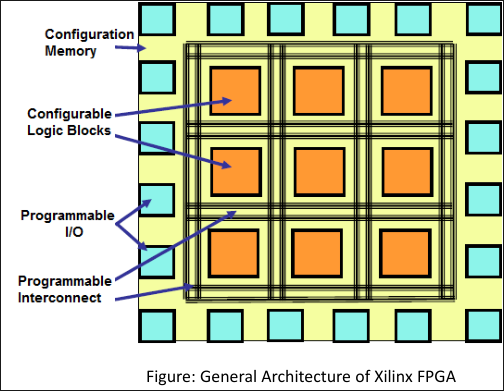

    <b> 5 Hours   9 Marks</b>

# FPGA overview and its evolution
## FPGA
- FPGA is:
    - Field Programmable Gate Array
    - a reprogrammable chip which contains hundreds of thousands of logic gates that internally connects together to build digital circuitry.
- It is dominant in digital design implementation
- ABility to re-configure FPGA to implement any digital logic function
- Partial re-configuration allows a portion of the FPGA to be continuously running while another portion is being re-configured.
- FPGAs also contain analog circuitry features including a programmable slew rate and drive strength, differential comparators on I/O designed to be connected to differential signalling channels.
- Mixed-signal FPGAs contain ADCs and DACs with analog signal conditional blocks allowing them to operate as a system-on-chip (SoC)
- FPGA now become Heterogenous System on Chip so it contain FPGA Fabric, CPU to GPU in single chip.
    - So workloads can be offloaded.
## Characteristics of FPGA - Feature
- FPGA consists of logical resources like LUT, FF, BRAM, DSP, IO, etc.
- It can be programmed with HDL or hardware description language based generated files called BITSTREAM files.
- FPGA can have smaller number of logical resources or blocks to million of units of those blocks.
- FPGA can be re-programmed number of times as user need.
## FPGA vs MCU/Microprocessor
<table>
    <tr>
        <th>Microcontrollers
        <th>FPGA
    <tr>
        <td>MCU has less processing capacity on the basis of memory and processes.
        <td>
            <ul>
                <li>User can configure with own architecture.
                <li>FPGA consists of large Clock (MHz)
                <li>Large programmable blocks
                <li>Memory elements (RAM, ROM)
                <li>Large IO Pool
            </ul>
    <tr>
        <td>It can process single or specific process only
        <td>Can process multiple task parallel (concurrent processing)
    <tr>
        <td>Process time is high
        <td>
            <ul>
                <li>FPGA is target for multiprocessing
                <li>Less non-recurring engineering (NRE) cost
                <li>Fast design period (time to market)
    <tr>
        <td>DSP and algorithms can't be implemented on it.
        <td>
            <ul>
                <li>We can design and verify Microcontrollers in FPGA
                <li>Design Flexibility
</table>

## FPGA and ASIC

- Comparison:
    - FPGA benefits vs ASICs:
        - Design time: 9 month design cycle vs 2-3 years
        - Cost: No $3-5M upfront (NRE) cost, no $100-500K mask set cost
        - Volume products: High initial ASIC cost recovered only in very high volume
    - Due to Moore's law, many AISC design requirements now met by FPGAs
        - Example, current FPGA architecture and also with SoC, MPSoC architecture
        can give the ddiverse processing capability, I/O and resource as once
        provided by ASIC
    - FPGA are more power consuming than ASIC
    - The unit price while manufacturing is higher for FPGA
    - ASIC are more application specific so can perform better in temrs of
        processing any logic in it

## History of FPGA

- 1960: First MOSFET
- 1961: First Communication IC
- 1962: First TTL
- 1963: First CMOS
- 1985: First FPGA
- 1987: A test with 600,000 reprogrammable gates was created
- 1992: Casselman was successful and a patent related to the system was issued.
- 1993: Actel was serving about 18% of market shares
- 2013: 77% of FPGA market was represented by Alterra, Actel and Xilinx
- 2014: Microsoft began using FPGAs to accelerate Bling
- 2018: Started deploying FPGAs across other data center workloads
- 2019: The largest share in the market for FPGAs was Asia Pacific
- 2020: The worldwide Market for FPGA was valued at 5132.4 million USD
- 2021: The global FPGA market site was valued at USD 5721.1 million
- 2022: FPGA is used by many industries.

# General FPGA Building Blocks
## LUT
## FF
## DSP
## BRAM
## IO
## Clocks
# FPGA Architectures
# General Architecture

## Vendor Specific Architeture
# Recent Developments in FPGA Architecture
## Heterogeneous Architecture
# FPGA Architecture targeted for cloud and edge platforms
# FPGA Design Flow - Summary
