

    <b> 3 Hours   5 Marks</b>

# ⁠A. Logical Interconnection and Routing architectures in FPGA

## ⁠A.1. Logical Interconnection

- Logical interconnection is the configurable or programmable interconnection
  between the CLB or logical blocks to I/O and other components inside the FPGA
- Mainly the FPGA has logic blocks, interconnects and I/O Blocks which
  are components inside FPGA
    - IO blocks lie in the periphery of logic blocks and interconnect.
    - Wire segments connect I/O blocks to wire segments through connection blocks
    - Connection blocks are connected to logic blocks, depending on the design requirement one logic block is connected to another and so on.
- A wire segment can be described as two end points of an interconnect with no programmable switch between tem.
    - A sequence of one or more wire segments in an FPGA can be termed as a track.

## ⁠A.2. Routing Architectures

- Routing architecture comprises of programmable switches and wires.
- Routing provides connection between I/O blocks and logic blocks, and between one logic block and another block.
- The type of routing architecture also decides area consumed by routing and density of logic blocks available in the FPGA device or achitecture
- Routing technique used in an FPGA largely decides the amount of area used by wire segements and programmable switches as compared to area consumed by logic blocks.

## ⁠A.3. Popular Routing Architecture

1. Island Style Routing Architecture
    - This is old fashioned routing architecture.
    - It is also one of the popular architecture
    - Here every CLB has route channel at all sides via Connection Box.
    - This architecture is most crowded or complex architecture.
    - It consists of vertical and horizontal routing which is consistent in switch boxes (SB)
    - 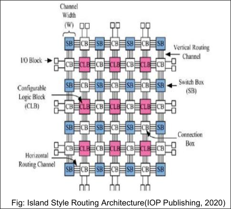
2. Hierarchical Routing Architecture
    - It is also called as tree-based architecture
    - Here logical blocks of FPGA are divided into clusters.
    - This architecture reduce the routing lanes and increase the speed between the configurable clusters or groups
    - 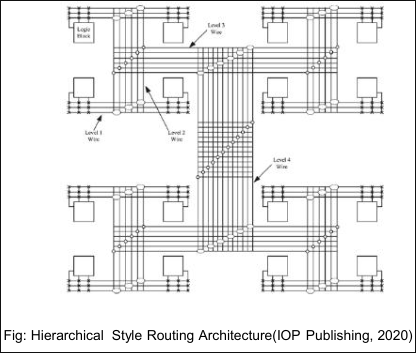
3. Xilinx Routing Architecture
    - In Xilinx routing in Virtex II FPGAs: connections are made from logic block into the channel through a connection block.
    - As SRAM technology is used to implement Lookup Tables, connection sites are large.
    - A logic block is surrounding by connection blocks on all four sides.
    - They connect logic block pins to wire segments.
    - Pass transistors are used to implement connection for output pins, while use fo multiplexers for input pins saves the number of SRAM cells required per pin.
    - 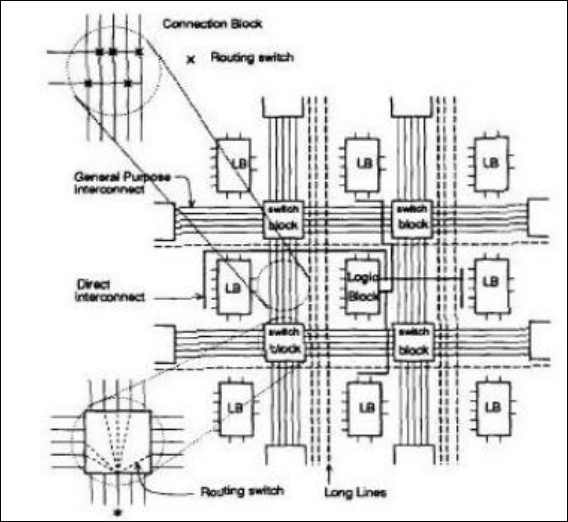
    - The logic block pins connecting to connection blocks can then be connected to any number of wire segments through switching blocks.
    - There are four types of wire segments available:
        - general purpose segments, the ones that pass through switches in the switch block
        - Direct interconnect: ones which connect logic block pins to four surrounding connecting blocks
        - long line: high fan out uniform delay connections
        - clock lines: clock signal provider which runs all over the chip.
4. Other Routing Architectures
    1. Vendor Specific Routing Architecture
        - Altera and Actel FPGA architectures uses different routing architecture.
        - Based in logical blocks placement and the connection/routing channel availability in FPGA architecture the routing methods is determined
            - For example, Xilinx and major FPGA vendor has number of types of FPGA in which the organization of different logical components is different so as of that organization the routing architecture is determined.

---

# ⁠B. AXI Interface Bus Protocol

## ⁠B.1. Overview

- AXI, which means **A**dvanced e**X**tensible **I**nterface, is an interface protocol defined by ARM as par of the AMBA (Advanced Microcontroller Bus Architecture) standard.
    - The AXI3/AXI4 specification are freely-available on the ARM website.
- As of its specification mentioned, AXI is used for high speed communication between different processing component in the "Processing device like FPGA, GPU and other".
    - AXI Offers high performance and frequency based communication or data handling between on-chip processing components.

- Figures
    - 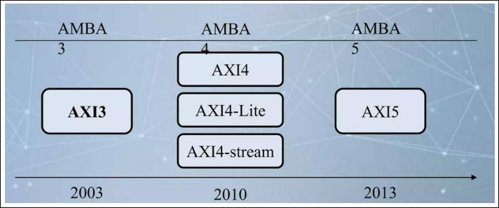
    - 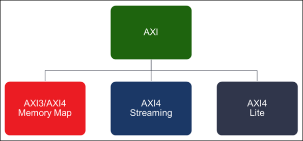

## ⁠B.2. Features

- Burst-Based transactions with only one address
- Supports unalgined data-transfer (Strobes)
- Separate the read and write data channels
- Supports optional low-power operation
- Ability to issue multiple outstanding address and out-of-order transaction completion
- Separate the address phase from the data phase

## ⁠B.3. AXI Protocol System

- AXI protocol supports single master multi-slave and multi-master and multi-slave configuration by using AXI interconnect engine or block.
- AXI is part of AMBA
- 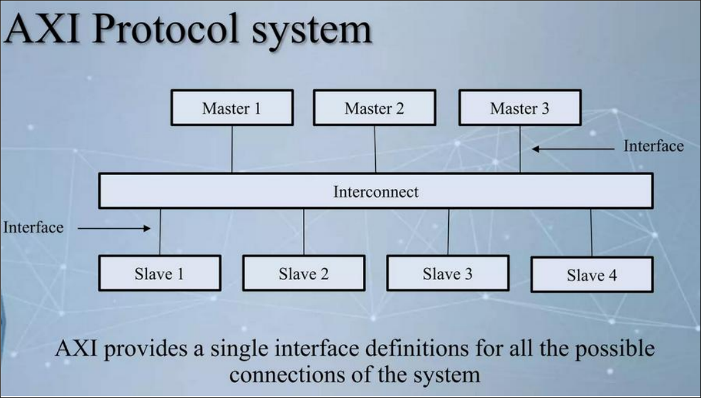

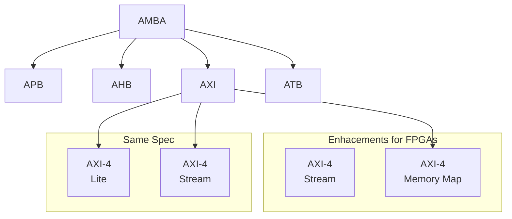

| Interface                | Features                                                             | Similar To                                      |
| ------------------------ | -------------------------------------------------------------------- | ----------------------------------------------- |
| Memory Map / Full (AXI4) | Traditional Address / Data Burst (single address, multiple data)  | PLBv46, PCI                                     |
| Streaming (AXI4-Stream)  | Data-Only, Burst                                                     | Local Link / DSP Interfaces /   / FIFO / FSL |
| Lite (AXI4-Lite)      | Traditional Address/Data: No Burst  (single address, single data) | PLBv46-single OPB                            |

## ⁠B.4. Basic AXI Signaling - 5 Channels

1. Read Address Channel
2. Read Data Channel
3. Write Address Channel
4. Write Data Channel
5. Write Response Channel

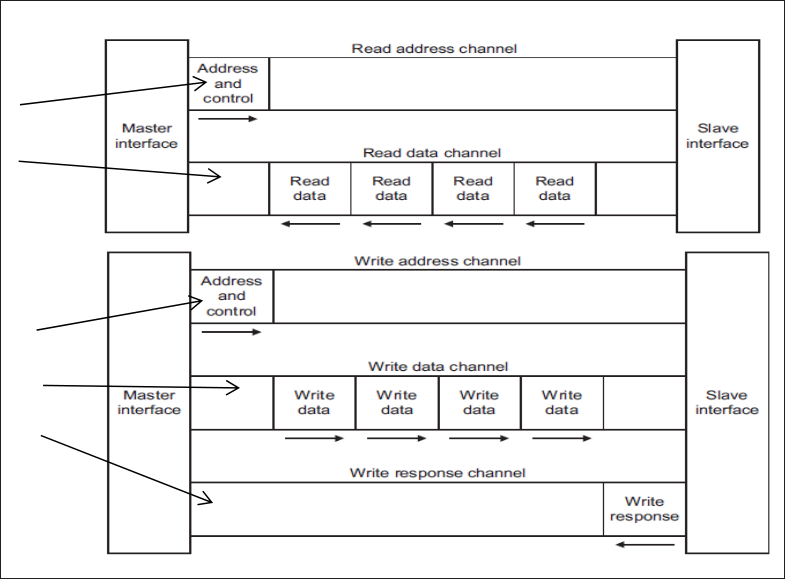

## ⁠B.5. The AXI INterface - AX4-Lite

- No burst
- Data width 32 or 64 only
    - Xilinx AXI IP only supports 32-bits
- Very small footprint
- In Xilinx VIVADO Bridging to AXI4 handheld automatically by
- AXI_Interconnect (if needed)
- Sometimes called "Full AXI" or "AXI Memory Mapped"
    - Not ARM-sanctioned names
- Single address multiple data
    - Burst up to 256 data beats
- Data Width parameterizable
    - 1024 bits
- No address channel, no read and write, always just master to slave
    - Effectively an AXI4 "write data" channel
- Unlimited burst length
    - AXI4 max 256
    - AXI4-Lite does not burst
- Virtually same signaling as AXI Data Channels
    - Protocol allows merging, packing, width conversion
    - Supports sparse, continuous, aligned, unaligned streams
- Signaling
    - AXI4-lite
        - 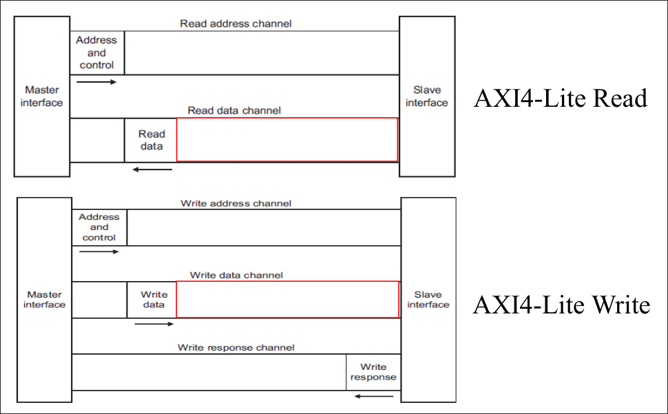
    - AXI4
        - 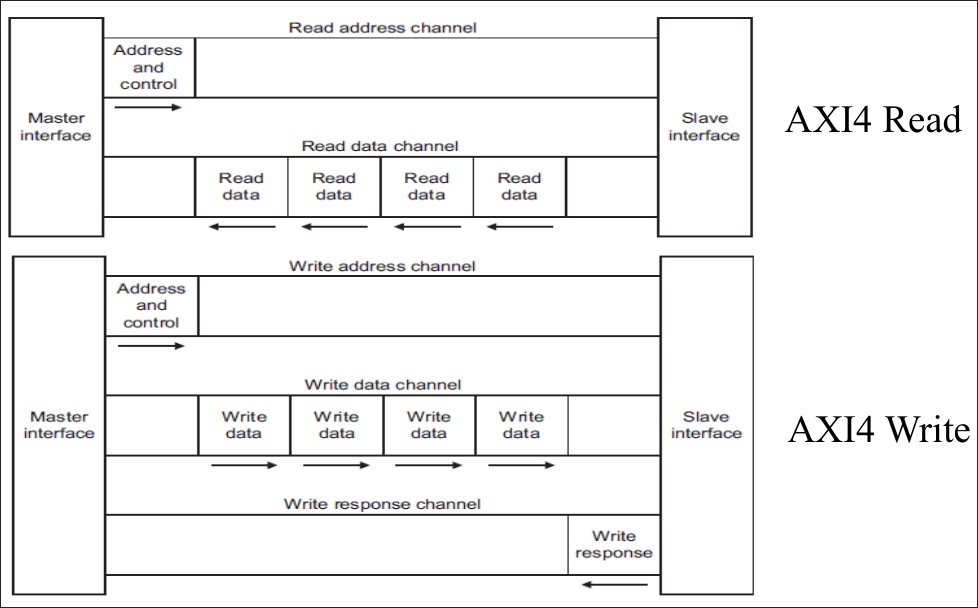
    - AXI4-Stream
        - 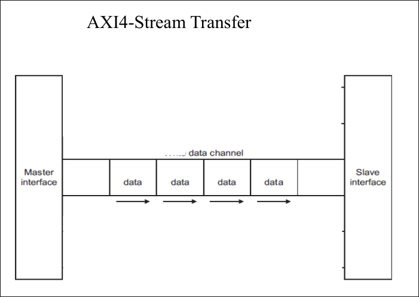

## ⁠B.6. Streaming Applications

- May not packets
    - E.g., Digital up converter
        - No concept of address
        - Free-running data (in this case)
        - In this situation, AXI4-Stream would optimize to a very simple interface
- May have packets
    - E.g., PCIe
        - Their packets may contain different information
        - Typically bridge logic of some sort is needed

## ⁠B.7. Memory Mapped vs Stream Data Transfer

- Number of channel on Memory Mapped are 5 \[3 channel for write transaction and 2 channel for read transaction\].
- Number of channel needed for streaming mode is just 1.
- Figures:
    - 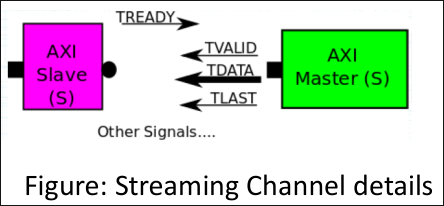
    - 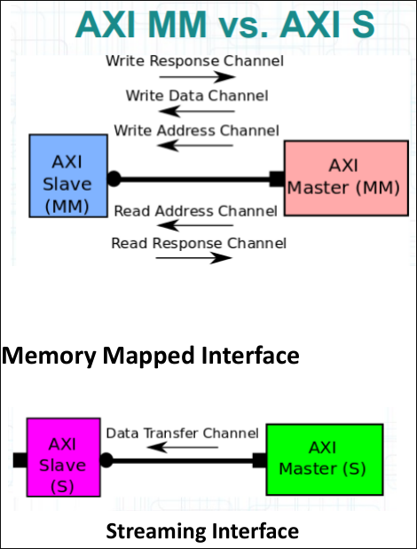

## ⁠B.8. Memory Mapped into Stream Data or Vice Versa

- In general DMA (Dynamic Memory Access) IP in different FPGA Design tools or platform perform conversion of "streaming into Memory mapped" and vice versa.
- According to vendor, theere could have DMA, Video DMA (VDMA), CDMA, QDMA and different types of DMA according to type of data handling and purpose.

## ⁠B.9. Importance of AXI VDMA or Central DMA

- When there is need of storing or writing streaming data into memory \[DRAM\].
- The streaming data need to convert into memory mapped, which is done by VDMA.
- VDMA can read the memory mapped data into Streaming mode.
- In both case, VDMA need to be configured & triggered by host CPU.
- VDMA can Interrupt host CPU when transfer completes.
- 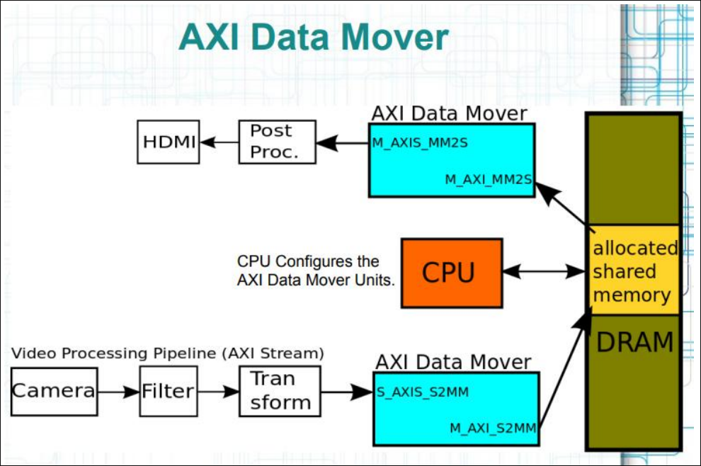

## ⁠B.10. Additional Information: VDMA Overview

- AXI Video Direct Memory Access provides high-bandwidth direct memory access between memory and AXI4-Stream video type target peripherals including which support the AXI4-Stream Video protcol
- Many video applications require frame buffers to handle frame rate changes or changes to the image dimensions (scaling or cropping).
- The AXI VDMA is designed to allow for efficient high-bandwidth access between the AXI4-Stream video interface and the AXI4 interface.
- Figure
    - 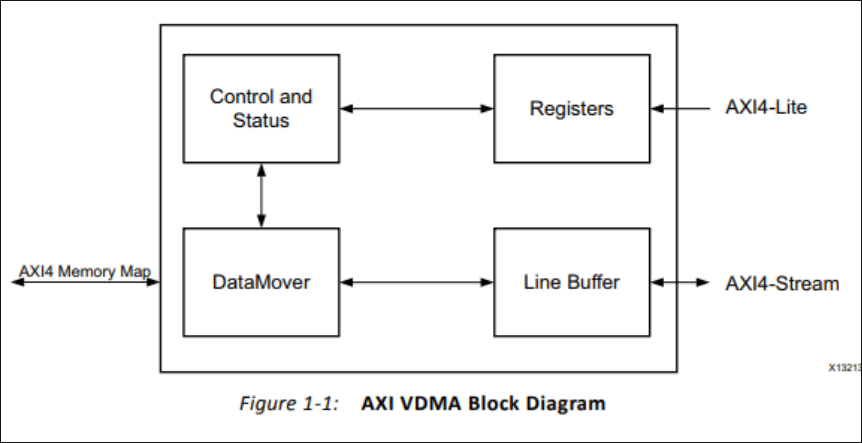
    - 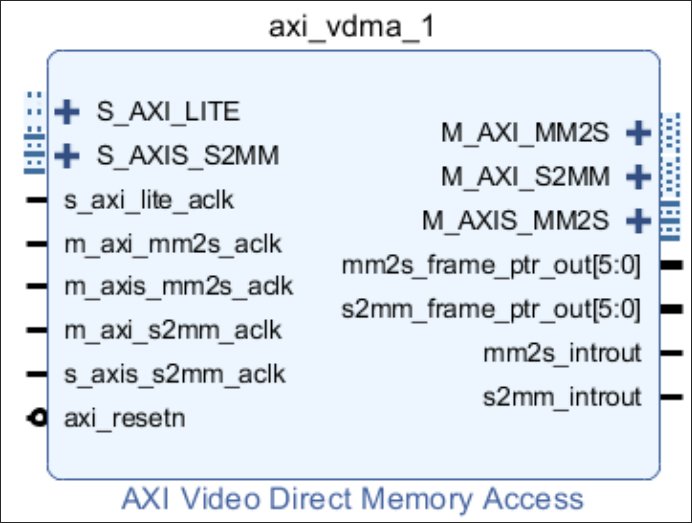

# ⁠C. High Speed Interfaces and usage of those interfaces

## ⁠C.1. HSI Overview

- As FPGA can process or process large amount of data when there is need to sending data or receiving data from external devices or platform we have to use different high speed bus protocols.
- According to FPGA architecture there could have few or many high speed interfaces.

## Usage of High Speed Interfaces

- Handling large amount of data/to from FPGA to external device.
- Achieving high speed and high performance data transfer between the computing platform.

# ⁠D. High Speed Bus Protocols in FPGA

## HSBP Overview

- As FPGA can process or process large amount of data when there is need to sending data or receiving data from external devices or platform we have to use different high speed bus protocols.
- According to FPGA architecture there could have few or many high speed interfaces.
- For high speed interfaces FPGA consists of Gigabit transreceivers along with the FPGA chip architectures.
- High speed interfaces can be of serial or parallel data communication channels.

## ⁠D.1. USB

- SUB is high speed serial bus protocol used for sharing data between two computing platform or devices.
- USB can be of different revisions, based on the revision the performance or speed will increase.
- Most of FPGA consists of USB 3.0 and USB 2.0 interface bus for handling data.

<table>
    <tr>
        <th colspan="4">Current Versions</th>
        <th rowspan="2">Transfer Rate</th>
    </tr>
    <tr>
        <th>Current Version</th>
        <th>Current Name</th>
        <th>Original name</th>
        <th>Market Code
    </tr>
    <tr>
        <td rowspan="3">USB 2.0</td>
        <td>LowSpeed
        <td>USB 1.0
        <td>Low Speed
        <td>1.5 Mbps
    </tr>
    <tr>
        <td>FullSpeed
        <td>USB 1.1
        <td>Full Speed
        <td>12 Mbps
    </tr>
    <tr>
        <td>HiSpeed
        <td>USB 2.0
        <td>Hi-Speed
        <td>480 Mbps
    </tr>
    <tr>
        <td rowspan="3">USB 3.2
        <td>Gen 1
        <td>USB 3.1GEN1
        <td>SuperSpeed USB
        <td>5 Gbps
    </tr>
    <tr>
        <td>Gen 2
        <td>USB 3.1GEN2
        <td>SuperSpeed SUB 10 Gbps
        <td>20 Gbps
    </tr>
    <tr>
        <td>Gen 2x2
        <td>N/A
        <td>SuperSpeed USB 20 Gbps
        <td>20 Gbps
    </tr>
    <tr>
        <td colspan="4">USB 4
        <td>40 Gbps
    </tr>
</table>

## ⁠D.2. PCIe

- PCIe (Peripheral Component Interconnect Express) is high speed serial bus protocol used in different processing platforms including CPU, GPU and FPGA.
- PCIe offers very high speed of data transfer to/from the platform.
- There are multiple PCIe revisions, according to revisions the performanceis is higher on recent revision.

<table>
    <tr>
        <th rowspan="2">PCIe Version
        <th rowspan="2">Line Code
        <th rowspan="2">Tx Speed
        <th colspan="4">Throughput
    </tr>
    <tr>
        <th>x1
        <th>x4
        <th>x8
        <th>x16
    </tr>
    <tr>
        <td>1.0
        <td>8b/10b
        <td>2.5 GT/s
        <td>250 MBps
        <td>1 GBps
        <td>2 GBps
        <td>4 GBps
    </tr>
    <tr>
        <td>2.0
        <td>8b/10b
        <td>5 GT/s
        <td>500 MBps
    </tr>
    <tr>
        <td>3.0
        <td>128b/130b
        <td>8 GT/s
        <td>984.6 MBps
    </tr>
    <tr>
        <td>4.0
        <td>18b/130b
        <td>16 GT/s
        <td>1.969 GBps
    </tr>
    <tr>
        <td>5.0
        <td>128b/130b
        <td>32 or 25 GT/s
        <td>15.8 or 3.08 MBps
    </tr>

</table>

## ⁠D.3. Ethernet

## ⁠D.4. MIPI

- MIPI (Mobile Industry Processor Interface) is one of popular bus interface
- for handling media data
- MIPI has DSI and CSI support for Display and Camera sensor
- It used in many camera based designs and also where there is display is used.

## LVDS

- Low voltage differential signaling (LVDS) bus interfaces are used to interfaces are used to interface camera and different sensor data to FPGA.
- The LVDS interface carry signals in differential signaling manner.
- Differential signaling consist of p and n form of data which then processed by receiver and accumulated the complete data packet.
- LVDS interface can also be used for sending data from FPGA to external platform.

# ⁠E. Embedded SoC/MPSoC architectures detail and interfaces

- Embedded SoC or MPSoC consists of processor or CPU in the same chip or device
- SoC could have one or two processor or CPU in the FPGA device,
    - while MPSoC could have more than two processor and different types of processing systems.
- SoC and MPSoC architectures is targeted for handling different types of data such as audio, video, sensor data, file systems, etc.
- So MPSoC architectures consists of interfaces from which we can receive and send different types of data.

## Architectures

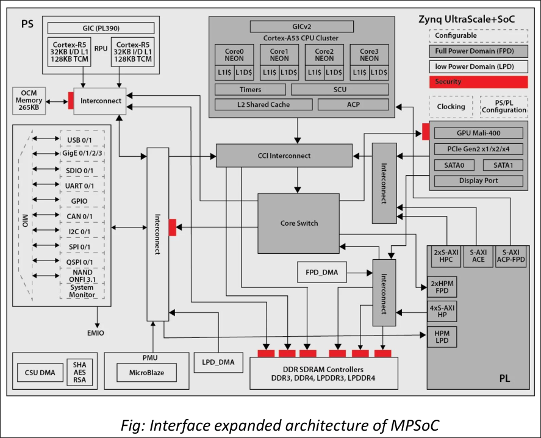

## Interfaces

1. According to architectures, these SoC and MPSoC architectures are mainly used for low power and edge based applications.
2. SoC/MPSoC architectures consists of two types of interfaces
    - General interfaces: USB 2.0, CAN, UART, I2C, SPI, etc.
    - High Speed (bandwidth) Interfaces: USB 3.0, LVDS, MIPI, HDMI, etc.
3. These SoC/MPSoC devices mainly consists of interfaces which are low power and are also targeted for embedded/edgee based applications.
4. SoC and MPSoC FPGAs can receive, process and send the data from these interfaces.
