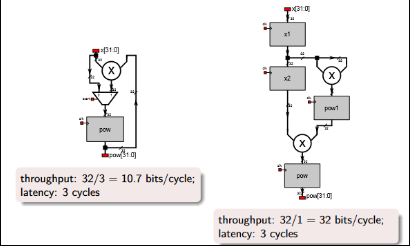
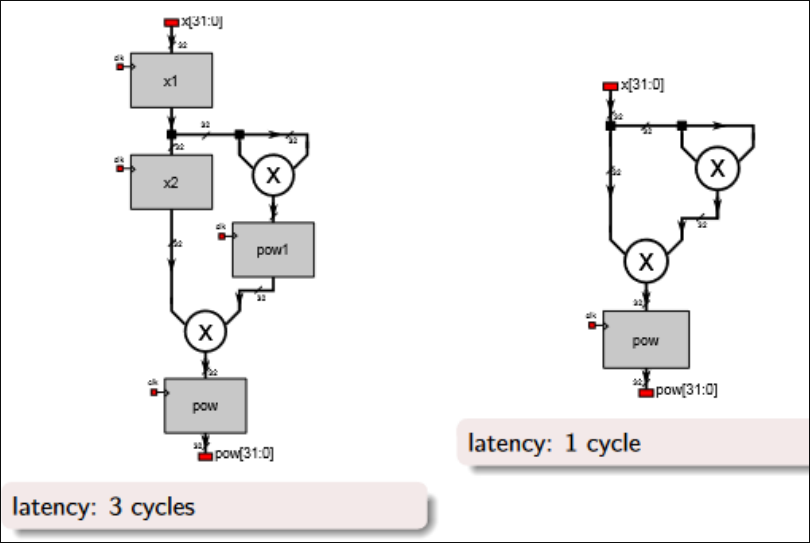
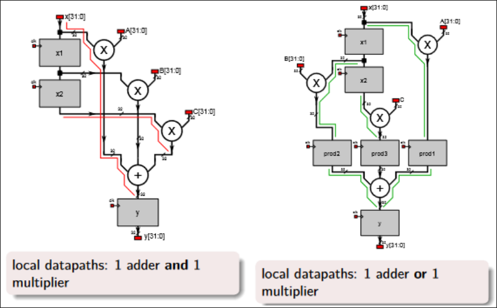
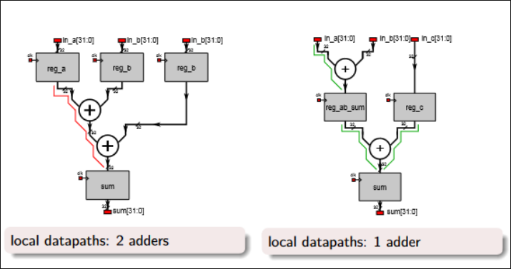
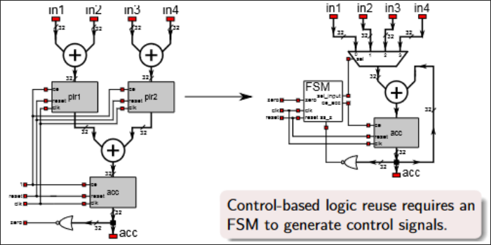
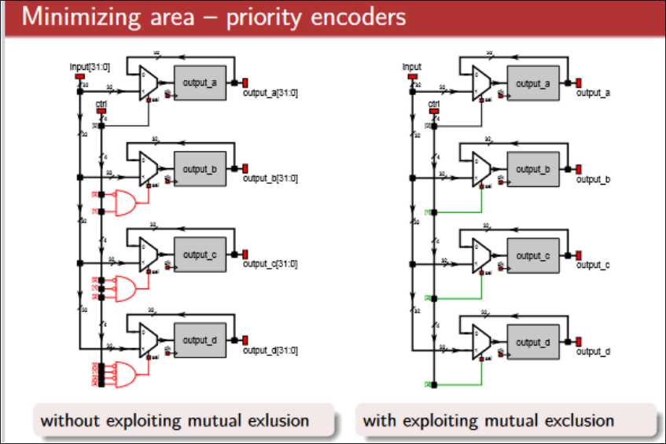

# Advance RTL Design for latency critical and resource critical designs - Overview

These are the major consideration for latency critical and resource critical scenario

1. Detail analysis of desing requirement and specification for selection of **FPGA Tool and device**
    - If there is no possibility of design upgradation tehn selcting FPGAA device which can have some additional resources for future upgrade of design.
2. **Fit the smallest design in smallest FPGA** (lowest resource FPGA) to reduce the cost factor on the design.
3. **Optimum utilization of FPGA resources**, either using vendor specific tool/software or using custom resource optimization methodology.
4. **To meet the timing on the lowest resource FPGA**
5. Selection of **proper design/implementation methodology**
    - Based on design requireement, timeline and budget of the project or design, the proper design methodology (RTL, HLS or IP or mixed or embedded methodology) have to be selected. Each methodology has own design flow, development timeline and optimization levels interms of design implementation.
6. Optimizing the RTL or IP or HLS or Implementation of design in targeted FPGA tool
7. Designing under the power consumption requirement of the design.
    - The power consumption of a system mainly depends on device level and technology level issues but there are efficient coding techniques on RTL that are able to prevent high power consumption.

# Resource, latency, clock and power optimization methodologies

In RTL design optimization can be done in different stages:

1. Timing Optimzation
    - Throughput: The amount of data processed in a single clock cycle (bits per second).
    - Latency: The time elapsed between data input and processed data output (clock cycles)
    - Local datapath delays: Delay of logic between storage elements (nanoseconds). It determines the maximum clock frequency
    - Latency
    - Local datapath delay
    - Example:
        - throughput, latency, local datapath delay
        - loop unrolling, removing pipeline registers, register balancing
2. Area or Resource Optimization
    - Minimizing logical blocks
    - Minimizing memory blocks in FPGA
    - Example:
        - resource requierment metrics in standard cell ASIC and FPGA
        - Control-based logic reuse, priority encoders, considering technology primitives
3. Power Utilization Optimization
    - Power optimization is also implication of area or resource optimzation

Different methodologies for optimization in RTL

- Pipelining
    - Breaking task in to stages and pipeling those
- Concurrency
    - Component sub-part and running it in parallel
- Component Allocation
    - Performing operations on specific logical blocks
- Operator Binding
    - Mapping operation according to available resources
- Operator Scheduling
    - Assigning and merging stages and assigning operations to those states.

## Techniques

- There are three important concepts related to the computation performance.
    - throughput, latency, local datapath delays.

### Timing Optimization

- Throughtput Optimization
    - Figure
        - 
- High Throughput - Loop Unrolling
    - During the high throughput optimzation the time required for processing of a single data is irrelevant but the time elapsed between two input reads is minimzed.
    - Data $n+1$ is read when data n is still under processing.
    - Throughput: 32/3 = 10.7 bits/cycle, latency: 3 cycles
        ```verilog
        reg [3:0] count;

        always @(posedge CLK) begin
            if (start) begin
                count <= 4'b0010; // count <- 2;
                power <= x;
            end else if (!stop) begin
                count <= count - 1;
                pow <= pow * x;
            end
        end

        assign stop_out = (count == 0) ? 1'b1 : 1'b0;
        ```
    - Throughput: 32/1 = 32 bits/cycle, latency: 3 cycles
        ```verilog
        reg[31:0] x1, x2,
        reg[63:0] pow1;

        always @(posedge CLK or posedge RST) begin
            if (RST) begin
                x1 <= 0;
                x2 <= 0;
                pow1 <= 0;
                pow <= 0;
            end
            else begin
                // stage 1
                x1 <= x;

                // stage 2
                x2 <= x1;
                pow1 <= x1 * x1;

                // stage 3
                pow <= pow1 * x2;
            end
        end
        ```

- Latency Optimization
    - Removing Pipeline registers.
        - 
    - The objective of the low-latency optimization is to pass the data from the input to the output with minimal internal processing delay.
    - A low-latency design uses parallellism and removes pipeline registers
    - latency: 3 cycles
        ```verilog
        reg[31:0] x1, x2,
        reg[63:0] pow1;

        always @(posedge CLK or posedge RST) begin
            if (RST) begin
                x1 <= 0;
                x2 <= 0;
                pow1 <= 0;
                pow <= 0;
            end
            else begin
                // stage 1
                x1 <= x;

                // stage 2
                x2 <= x1;
                pow1 <= x1 * x1;

                // stage 3
                pow <= pow1 * x2;
            end
        end
        ```
    - Latency: 1 cycle (with an additional otutput register)
        ```verilog
        reg[31:0] x1, x2,
        reg[63:0] pow1;

        // Process 1: x1 <= x;
        always @(x) begin
            x1 <= x;
        end

        always @(x1) begin
            x2 <= x1;
            pow1 <= x1 * x1;
        end

        always @(*) begin
            pow <= pow1 * x2;
        end
        ```

- Logic Delay Optimization with register layers
    - Figure
        - 
    - Minimizing Logic Delay - register layers
        - The logic between two sequential elements is called local datapath.
        - The delay of the slowest lcoal datapath determines the maximum clock frequency.
        - The lcoal datapath can be reduced by additional register layers.
    - Normal:

    ```verilog
    reg [31:0] x1, x2;
    always @(posedge clk) begin
        if (valid) begin
            x1 <= x;
            x2 <= x1;
            y <= A * x + B * x1 + C * x2;
            // Assuming A, B, C are parameters or constants
        end
    end
    ```

    - Optimized:

    ```verilog
    reg [31:0] x1, x2;
    reg [31:0] prod1, prod2, prod3;

    always @(posedge clk) begin
        if (valid) begin
            x1 <= x;
            x2 <= x1;
            prod1 <= A * x;
            prod2 <= B * x1;
            prod3 <= C * x2;
            y <= prod1 + prod2 + prod3;
            // Assuming A, B, C are parameters or constants
        end
    end
    ```

- Logic Delay Optimization with Register Balancing
    - Figure:
        - 
    - During register balancing the logic between registers is redistributed in order to minimize the worst-case delay between any register pairs.
    - Unoptimized:

    ```verilog
    reg [31:0] reg_a, reg_b, reg_c;

    always @(posedge CLK) begin
        reg_a <= in_a;
        reg_b <= in_b;
        reg_c <= in_c;
        sum <= reg_a + reg_b + reg_c;
    end
    ```

    - Optimized:

    ```verilog
    reg [31:0] reg_ab_sum, reg_c;

    always @(posedge CLK) begin
        reg_ab_sum <= in_a + in_b;
        reg_c <= in_c;
        sum <= reg_ab_sum + reg_c;
    end
    ```

### Area Optimization

- The resource reqiurement means the amount of basic functional primitives required for implementing the described functionality.
- The basic functional primitives in standard cell ASICs are the standard cells, which can be simpe logic gates, flip-flops but also more complex arithmetic-logic functions or memories.
- The basic logic elements (BLE) of FPGAs consist of a logic function (the input number is dependent on the vendor and the device family), a flip-flop and a multiplexer. There are special purpose resources as well, such as memory blocks, signal processing elements (multipliers) etc.

---

- Minimzing Area - Control-based logic reuse
    - Figure:
        - 
    - Control-based logic reuse should be considered the opposite operation to the loop unrolling.
    - Pipeline requires internal data storage resources and additional logic to implement parallel operation.
    - These resources can be reused with the cost of a reduced throughput.
- Minimizing Area - Priority Encoders
    - Figure:
        - 
    - The resource requirement can be improved if the mutual exclusion is exploited.
    - The _else if_ statement should be used only if a priority encoder is required and the conditions are not mutually exclusive.
    - normal

    ```verilog
    always @(posedge CLK) begin
        if (ctrl[0]) begin
            output[0] <= input;
        end else if (ctrl[1]) begin
            output[1] <= input;
        end else if (ctrl[2]) begin
            output[2] <= input;
        end else if (ctrl[3]) begin
            output[3] <= input;
        end
    end
    ```

    - optimized

    ```verilog
    always @(posedge CLK) begin
        if (ctrl[0]) begin
            output[0] <= input
        end
        if (ctrl[1]) begin
            output[1] <= input
        end
        if (ctrl[2]) begin
            output[2] <= input
        end
        if (ctrl[3]) begin
            output[3] <= input
        end
    ```

- Minimizing Area - Considering technology primitives
    - With appropriate HDL coding style, a more efficient logic synthesis can be achieved.
    - The synthesis tool vendors usually provide coding technique proposals to improve the resource requirement or timing parameters of the design.
    - The proposed coding style takes the unique characteristics of the technology primitives into consideration
        - utilizing block RAM modules in FPGAs:
            - Block RAM modules do not have any reset inputs
            - their outputs are synchronous to a clock signal.
            - only HDL models with these parameters can be elemented in block RAMs.
        - Utilizing quality DSP units:
            - the DSP slices in the FPGAs have synchronous outputs.
            - This restriction have to be taken into account in HDL model generation.
    - normal:

        ```verilog
        reg [31:0] content [255:0];
        // assuming 256 entries of 32-bit data

        always @(posedge clk or posedge reset) begin
            if (reset) begin
                for (int i = 0; i < 256; i++) begin
                    content[i] <= 32'h00000000;
                    // Initialize content with all zeros
                end
            end else if (write) begin
                content[address] <= data_in;
            end
        end

        assign data_out = content[address];
        ```

        - because of the asynchronous output, this model cannot be implemented in block RAM
        - the reset function hinders the LUT implementation as well.

    - optimized:

        ```verilog
        reg [31:0] content [255:0];
        // assuming 256 entries of 32-bit data

        always @(posedge clk) begin
            if (write) begin
                content[address] <= data_in;
            end

            data_out <= content[address];
        end
        ```

        - This modele can be implemented as flip-flops, LUT RAM as well as RAM as well.

# Considerations/approaches for Implementing RTL Design in a real-world scenario

- In real world projects these are the scenario mostly happen in RTL designs.
- Here are the possible optimization requirement and methodologies to optimize:
    1. Design overutilized the resources in FPGA Board
        - Have to either target larger resource based FPGA or
        - Have to optimize the design w.r.t to resources usage.
        - Different synthesis and implementation tools also have some strategies to perform Optimization upto certain levels.
        - For example, AMD VIVADO provides strategies to plan and optimize the resources in the targeted FPGA board or device.
    2. Timing Does not meet
        - Timing requirement doesn't significantly impact on output sometime but it can impact the execution (getting output) in continuous running of the system.
        - Have to check the timing and path of the design and perform optimization techniques.
        - Implementing possible parallelism on algorithm implementation or analysis of timing path.
    3. Delay on the execution of operation while implementing in target hardware.
        - Here analyzing and optimizing the clock paths and clock sources to different modules or IP can improve the delay situation.
        - In some case increasing the clock source (input clock) can also help to improve the delay situation.
    4. System consuming more power than expected
        - Power usage mainly depends on the FPGA area or logical resources usage by the design.
        - For lower power usage, the optimization of algorithm or pipelining instead of completely parallelism will work.
        - Power consumption also depends on the FPGA architecture, how logical resources are used.
        - The synthesis/implementation tool can also play role in placing different operational blocks inside FPGA based on that the power usage can be impacted.
    5. Throughput requirement of the design.
        - By considering the higher clock or clock level optimization and throughput based bus like AXI can allow to achieve highest throughput on the design.
