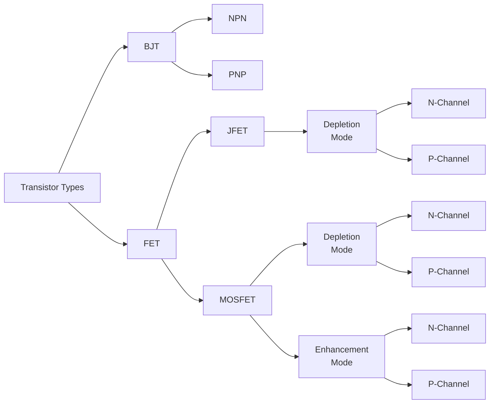

# VLSI Design Introduction

VLSI:

- very large-scale integration
- is the current level of computer microchip miniaturization
- refers to microchips containing hundreds of thousands of transistor.
- LSI means microchips containing thousands of transistors.

Use of VLSI:

- used in creating many chips and circuits on a single mini chip of silicon

## VLSI Design

VLSI Design Cycle starts with a formal specification of a VLSI chip.

## IC Technology

### Integration

- SSI
    - Small Scale Integration
    - 1960
    - Less than 10 logic gates per chip
    - Logic Gaates (AND/OR/NAND/NOR)
- MSI
    - Medium Scale Integration
    - 1966
    - 10 to 100 gates per chip
    - Flip flops, adders, counters, multiplexers
- LSI
    - Large Scale Integration
    - 1970
    - 100 to 10,000 gates per chip
    - Small memory chips, PLDs
- VLSI
    - Very Large Scale Integration
    - 1980
    - 10,000 to 100,000 gates per chip
    - Microprocessors with cache memory, floating point arithmetic units, RAM, ROM, complex PLDs

### Types of Transistors

### CMOS Logic Circuit

</img>

## Processing Technology in VLSI

- Bipolar
    - TTL (Transistor to Transistor Logic)
    - ECL (Emitter Coupled Logic)
- MOS
    - NMOS
        - less masking steps,
        - denser,
        - less power
    - CMOS
        - low power consumption,
        - less fabricatiheaderon steps
- BiCMOS: Bipolar and CMOS (for high speed)
- Ga-As: Gallium Arsenide (for high speed)
- SOI: Silicon on Insulator (for high temperature applciation)

## CAD tools on VLSI

| CAD Tool            | OS/License  | Type                    | Function                      |
| ------------------- | ----------- | ----------------------- | ----------------------------- |
| Cadence EDA         | Licensed    | Analog and Mixed Signal | Complete CAD Flow             |
| Master Graphics EDA | Licensed    | ""                      | ""                            |
| Synopsys EDA        | ""          | ""                      | ""                            |
| Tanner EDA          | ""          | ""                      | ""                            |
| Alliance            | Open Source | Mixed Signal            | Logic to Layout"              |
| Electric CAD        | ""          | ""                      | ""                            |
| Magic               | ""          | ""                      | Circuit Layout                |
| SystemC             | ""          | Electronic System Level | Library for Digital Deisng    |
| myHDL               | ""          | ""                      | Hardware Description Language |

# VLSI Designing

## VLSI Design Flow

### Four Levels of Design Representation

- Behavioral Representation
    - For functional blocks, FSM
    - 
- Logic (Gate-Level) Representation
    - For logic Blocks, Gates
    - 
- Circuit (Transistor-Level) Representation
    - For Transistor Schematics
    - 
- Layout Representation
    - For Physical Devices
    - 

### Design Design Flow

There are two basic types of digital design methodologies in VLSI flow

1. Top-Bottom design methodology
    - Define top-levle block and identify the sub-blocks
    - Divide sub-block until we come to leaf cells
2. Bottom-Up design Methodology
    - identify building block that are available for us
    - build a bigger cell using these block
    - continue building a cell until we build top level

### Design Flow Simplified

### Detailing VLSI Design Flow

##### System Specification

- First step of design process is to lay down the specification of the system.
- High level representation of the system
- Factors considered:
    - Performance, Functionality
    - Physical Dimension
    - Desing Technique
    - Technological and Economical Viability
- The end results are specifications of
    - Size, Speed, Power and Functionality
    - Basic architecture of VLSI system

#### Functional Design

- Main functional units, Interconnect requirements of the system are identified
- The area, power and other parameters of each unit are estimated
- The key idea is to specify behavior, in terms of Input, Output, Timing of each unit
- The outcome of functionality design is usually timing diagram
- This information leads to improvement of the overall design process and reduction of complexity of the subsequent phases

#### Logic Design

- Design Logic, that is,
- Boolean expressions, word width, register allocation, etc.

#### Circuit Design

- The purpose of the circuit design is to develop a circuit representation based on the logic design.
- The Boolean expression can be converted into a circuit representation by taking into consideration the speed and power requirements of the original design.
- Design the circuit including gates, transistors, interconnections, etc.
- The outcome is called a netlist
- Circuit simulation is used to verify the correctness and timing of component.

#### Physical Design

- Given a circuit after logic synthesis, to convert it into a layout

### Agents in Designing

| Designer          | Tasks                                                                     | Tools                                                            |
| ----------------- | ------------------------------------------------------------------------- | ---------------------------------------------------------------- |
| Architect         | Define overall chip, C/RTL model, initial floorplan                       | Text Editor, C Compiler                                          |
| Logic Designer    | Behavioral Simulation, Logic Simulation, Synthesis, Datapath Schematics   | RTL Simulator, Synthesis Tools, Timing Analyzer, Power Estimator |
| Circuit Designer  | Cell Libraries, Circuit Schematics, Circuit Simulation, Megacell Blocks   | Schematic Editor, Circuit Simulator Router                       |
| Physical Designer | Layout and Floorplan, Place and Route, Parasitics Extraction, DRC/LVS/ERC | Place/Rotue Tools, Physical Design and Evaluation Tools          |

## VLSI Design Styles

1. Full Custom
    - Each circuit element carefully "handcrafted"
    - Huge design effort
    - High design and NRE costs / low unit cost
    - high performance
    - typically used for high-volume applications

2. Application-Specific Integrated Circuit
    - constrained design using pre-designed (and sometimes pre-manufactured) components
    - Also called semi-custom design
    - CAD tools greatly reduce design effort
    - Low Design Cost / High NRE Cost / Medium Unit Cost

3. Programmable Logic (PLD, FPGA)
    - Pre-manufactured components with programmable interconnect
    - CAD tools greatly reduce design effort
    - Low Design Cost / Low NRE Cost / High Unit Cost
    - Lower Performance

4. System-on-Chip
    - Idea: Combine several large blocks
        - predesigned custom cores, e.g., microcontroller, intellectual property (IP)
        - ASIC logic for special-purpose hardware
        - programmable logic (PLD, FPGA)
        - analog
    - Open issues
        - keeping design cost low
        - verifying correctness of design

## VLSI Verification Methodologies

### Verification methods

- Functional Verification
    - Simulation
- Emulation
- Formal Verification
    - Equivalence Checking
    - Model Checking
- Semiformal Verification
    - Assertion Based Methods

### Verification Techniques

- Simulation (functional and timing)
    - Behavioral
    - RTL
    - Gate-level (pre-layout and post-layout)
    - Switch-level
    - Transistor-level
- Model Based Formal Verification (functional)
    - Binary Decision Diagrams
    - Equivalence checking
    - Model checking
- Static and Dynamic Timing Analysis (timing)

### Verification approaches on RTL

1. Simulation
    - verifying the functionality via testbench based simulation
    - where we introduce different test cases
    - or input scenario
    - and analyze the output
2. Structural Analysis
    - structural analysis is used to analyze the structure of the RTL code.
    - In addition to the Language Reference Manual, checking the tool analysis,
    - the code structural patterns which may lead to issues like terminal states in state machines, mismatched assignments, reset and clocking structures
    - Structural analysis allows you to enter simulation, focusing on functional performance and not identifying issue which could have been found faster earlier
3. Formal Methods
    - Formal methods methematically prove design functions as expected.
    - The mathematical models used are varied but includes bounded model checkers and mathematical induction.
4. Timing Analysis
    - Most timing analysis is performed using tools and controlled via constraints.

## VLSI Verification Methodology

Languages used in VLSI Verification

- SystemVerilog (SV) verification
    - SV provides an extensive set of verification features, including object oriented programming, constrained random testing, and functional coverage
- Universal Verification Methodology (UVM)
    - standardized methodlogy built on top of SV that enables scalable and reusable verification environments, promiting design verification efficiency and flexibility
- VHDL
    - VHSIC Hardware Descriptive Language
    - used for design entry and verificaiton in the VLSI industry
    - offer strong support for hardware modeling, simulation and synthesis
- e
    - Specman
    - verification language developed by Yoav Hollander for his Specman software
    - offers powerful verification capabilities, such as constraint-driven random testing and transaction-level modeling.
    - later it was renamed as Verisity, which was acquired by Cadence Design Systems
- C/C++ and Python
    - these are often used for building verification frameworks, test benches, and script-based verificaiton flows.

# CMOS Circuit and Logic Design

- CMOS overview
    - CMOS
        - Complementary metal-oxide semiconductor
        - semiconductor technology used in the transistors
        - that are manufactured into most of today's computer microchips
    - in CMOS tech,
        - both kinds of transistors are used in a complementary way to form a current gate that forms an effective means of electrical control.

- CMOS Working Principle
    - In CMOS tech, both N-type and P-type transistors are used to design logic functions.
    - the same signal that turns ON a transistor of one type is used to turn OFF a transistor of the other type.
    - This characteristic allows the design of logic devices using only simple switches, withotu the need for a pull-up resistor.
- CMOS Characteristics
    - Low static power utilization, huge noise immunity.
        - when the single transistor from the pair of MOSFET transistor is switched OFF, then the series combination uses significant power throughout switching among the 2 states like ON and OFF.
        - as a result, these devices,:
    - do not generate waste heat
        - as compared with other types of logic circuits such as TTL or NMOS logic
        - which usually use some standing current even when they don't chang etheir state.
        - these CMOS characteristics allow for
    - integrating logic functions with high density
        - on an integreting circuit.
        - because of this, CMOS has become the most frequently used technology to be executed within VLSI chips
    - the phrase MOS is a reference to the MOSFET's physical structure which includes an electrode with a metal gate that is located on top of an oxide insulator of semiconductor material
    - a material like Aliminuim is used only once however the material is now polysilicon.
        - the designing of other metal gates can be done using a comeback through the arrival of high-k dielectric materials within the process of the CMOS process.
- Advantages
    - Uses a single power supply like +VDD
    - these gates are very simple
    - input impedance is high
    - CMOS logic uses less power whenever it is held in a set state
    - power dissipation is negligible
    - Fan out is high
    - TTL compatibility
    - Stability of temperature
    - Noise immunity is good
    - compact
    - designing is very well
    - robus mechanically
    - logic swing is large (VDD)
- Applications
    - CMOS tech has been used for the following IC designs:
    - Computer memories, CPUs
    - microprocessor designs
    - Flash memory chip designing
    - USed to design ASICs
- Disadvantages
    - The cost will be increased once the processing steps increases, however, it can be resolved
    - the packing density of CMOS is low as compared to NMOS
    - MOS chips should be secured from getting static charges by placing the leads shorted otherwise, the static charges obtained within leads will damage the chip.
        - this problem can be solved by including protective circuits otherwise devices
    - it utilizes two transisstors as opposed to 1 NMOS to build an inverter, which means that the CMOS uses more space over the chip.
- NMOS Working
    - When a positive voltage (logic HIGH) is applied
        - to the gate terminal of an NMOS transistor with respect to source
    - it creates an electric field that attracts electrons towards the interface between gate and the semiconductor substrate
    - when voltage is higher than source voltage by V$_{th}$, the n-channel MOSFET turns on.
- PMOS Working
    - When a negative voltage (logic LOW) is applied
        - to the gate terminal of an NMOS transistor with respect to source
    - it creates an electric field that repels holes away from the interface between gate and the semiconductor substrate
    - when voltage is lower than source voltage by V$_{th}$, the p-channel MOSFET turns on.

# Design and analysis of CMOS inverter

## Figure

- 
- The inverter circuit as shown in the figure above.
- consists of PMOS and NMOS FET
- A serves as gate voltage for both transistors
- the NMOS transistor has input from Vss (gronud)
- the PMOS has input from Vdd
- Y is output

## Working

- when a high voltage (~Vdd) is given at input terminal (A) of the inverter, the PMOS becomes an open circuit, and NMOS switched OFF so the output will be pulled down to Vss.
- When a low level voltage (<Vdd, ~0V) applied to the inverter,
    - the NMOS switch OFF and PMOS switched ON
    - so the output becomes Vdd or the circuit is pulled up to Vdd
- Truth Table
    - 

## DC Working

- Figure
    - 
- DC Response: V$_{out}$ vs. V$_{in}$ for a gate
- Inverter
    - when V$_{in}$ = 0 -> V$_{out}$ = Vdd
    - when V$_{in}$ = Vdd -> V$_{out}$ = 0
    - in betwen, V$_{out}$ depends on transistor current
    - By KCL, must settle that
    - I$_{dsn}$ = | I$_{dsp}$ |
    - We can solve equations
    - Graphical solution gives every good insight
- Transfer Characteristics
    - 

# Analog/Mixed Mode VLSI design concepts
