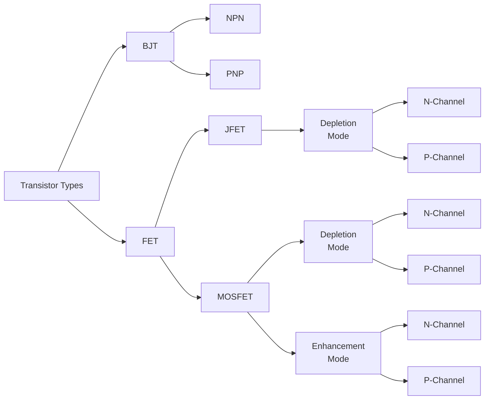

# VLSI Design Introduction

VLSI:

- very large-scale integration
- is the current level of computer microchip miniaturization
- refers to microchips containing hundreds of thousands of transistor.
- LSI means microchips containing thousands of transistors.

Use of VLSI:

- used in creating many chips and circuits on a single mini chip of silicon

## VLSI Design

VLSI Design Cycle starts with a formal specification of a VLSI chip.

## IC Technology

### Integration

- SSI
    - Small Scale Integration
    - 1960
    - Less than 10 logic gates per chip
    - Logic Gaates (AND/OR/NAND/NOR)
- MSI
    - Medium Scale Integration
    - 1966
    - 10 to 100 gates per chip
    - Flip flops, adders, counters, multiplexers
- LSI
    - Large Scale Integration
    - 1970
    - 100 to 10,000 gates per chip
    - Small memory chips, PLDs
- VLSI
    - Very Large Scale Integration
    - 1980
    - 10,000 to 100,000 gates per chip
    - Microprocessors with cache memory, floating point arithmetic units, RAM, ROM, complex PLDs

### Types of Transistors

### CMOS Logic Circuit

</img>

## Processing Technology in VLSI

- Bipolar
    - TTL (Transistor to Transistor Logic)
    - ECL (Emitter Coupled Logic)
- MOS
    - NMOS
        - less masking steps,
        - denser,
        - less power
    - CMOS
        - low power consumption,
        - less fabricatiheaderon steps
- BiCMOS: Bipolar and CMOS (for high speed)
- Ga-As: Gallium Arsenide (for high speed)
- SOI: Silicon on Insulator (for high temperature applciation)

## CAD tools on VLSI

| CAD Tool            | OS/License  | Type                    | Function                      |
| ------------------- | ----------- | ----------------------- | ----------------------------- |
| Cadence EDA         | Licensed    | Analog and Mixed Signal | Complete CAD Flow             |
| Master Graphics EDA | Licensed    | ""                      | ""                            |
| Synopsys EDA        | ""          | ""                      | ""                            |
| Tanner EDA          | ""          | ""                      | ""                            |
| Alliance            | Open Source | Mixed Signal            | Logic to Layout"              |
| Electric CAD        | ""          | ""                      | ""                            |
| Magic               | ""          | ""                      | Circuit Layout                |
| SystemC             | ""          | Electronic System Level | Library for Digital Deisng    |
| myHDL               | ""          | ""                      | Hardware Description Language |

# VLSI Designing

## VLSI Design Flow

```mermaid

flowchart LR
    A[System Specification] --> B[Functional/<br>Architecture Design]

    subgraph FrontEnd["Front End/Synthesis Phase"]
        direction TB
        B --> C
        C
        D
        E
    end
    C[Functional Verification]
    C --> B
    C --> D[Logic Design]
    D --> E[Logic Verification]

    subgraph Group1["Back End"]
        F[Circuit Design]
        G[Circuit Verification]
        H[Physical Design]
        I[Physical Verification]
    end

    E --> F
    F --> G
    G --> F
    G --> H
    H --> I
    I --> H
    I --> J

    subgraph Group2["Fabrication Phase"]
        J[Tape Out<br>i.e. Lithogragraphy]
        K[Packaging Testing<br>i.e. IC Level Testing]
    end

    J --> K
```

## VLSI Design Styles

## VLSI Verification Methodologies

# CMOS Circuit and Logic Design

# Design and analysis of CMOS inverter

# Analog/Mixed Mode VLSI design concepts
