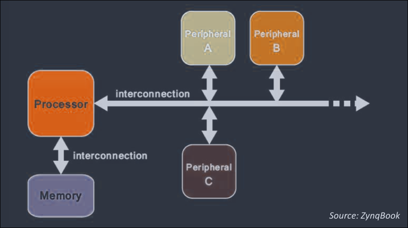
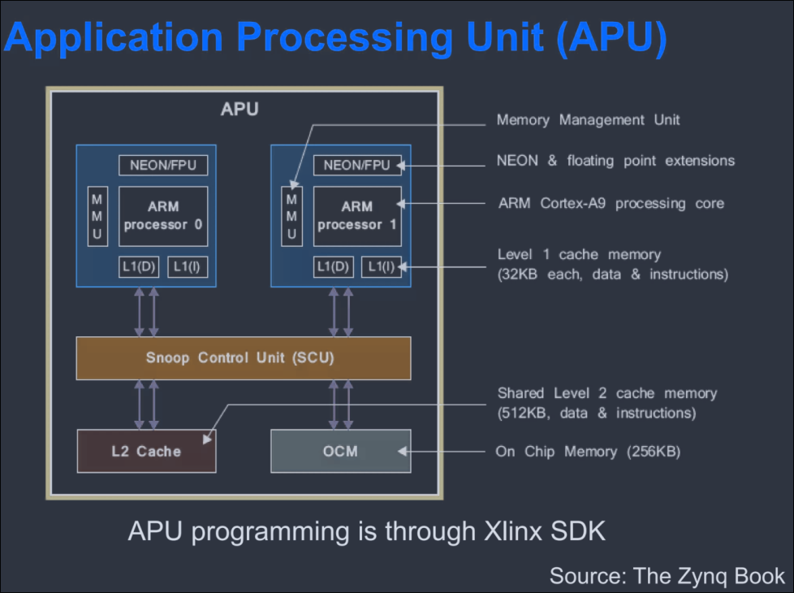
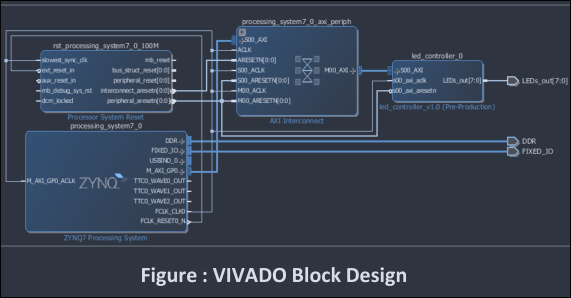
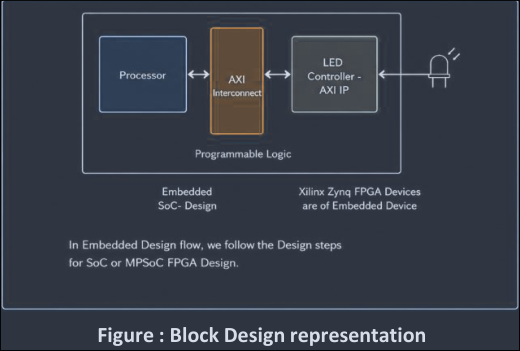
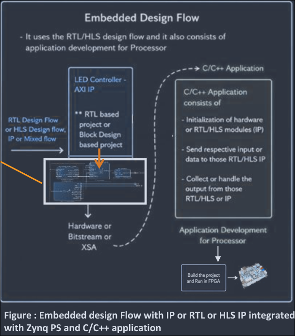
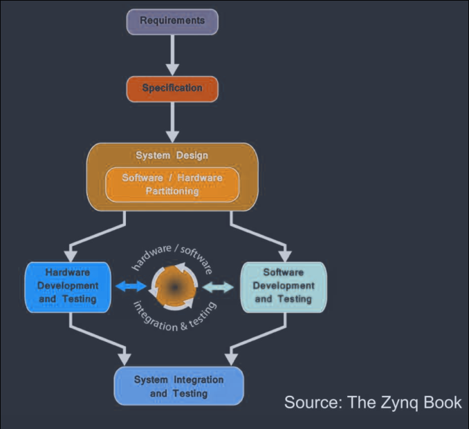
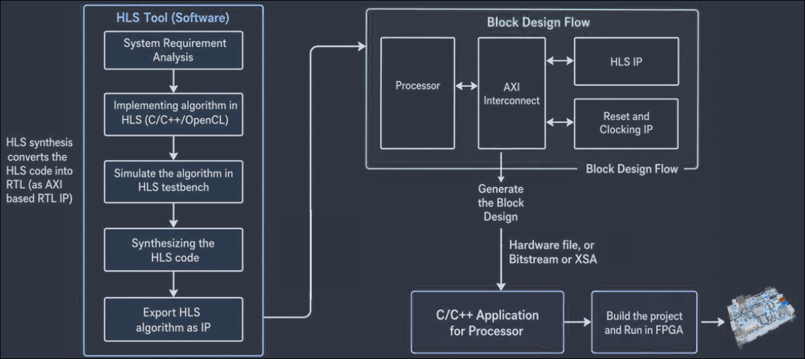

# Embedded Design Overview

- Embedded design covers the methodology of designing or developing the embedded systems.
- As embedded system designed for specifc task or objective.
- This system mainly needs a Processor, memory, peripherals, interconnection and interfaces etc to achieve a complete or standalone system which can perform the given task all the time without any external intervention or support.
- Embedded design mainly target the application part of Embedded SoC Architecture.

The architecture:

## Embedded Design Overview - with SoC FPGA

**Different SoC FPGAs**

- Xilinx Zynq
    - Zynq-7000 All Programmable SoC
    - with Cortex-A9 MPCore
- Alterra Arria V & Cyclone V
    - Hard processor System (HPS)
    - with Cortex-A9 MPCore
- Microsemi Smartfusion2
    - Cortex M3

## Embedded Design Overview with Xilinx Zynq SoC FPGA Architecture

Zynq PS or APU (Application Processing Unit)

VIVADO IP design example for Zynq based embedded design

## Design flow

Basic Design Flow for Zynq SoC

# RTL and HLS design approaches in Embedded Design

Example: Embedded Design with HLS and High Level Application for Processor

# SoC/MPSoC FPGAs and design approaches with AMD Xilinx tools
