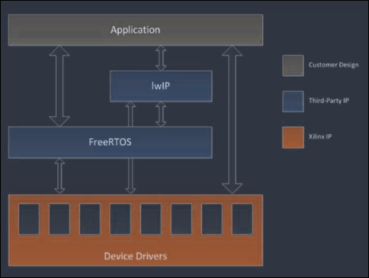
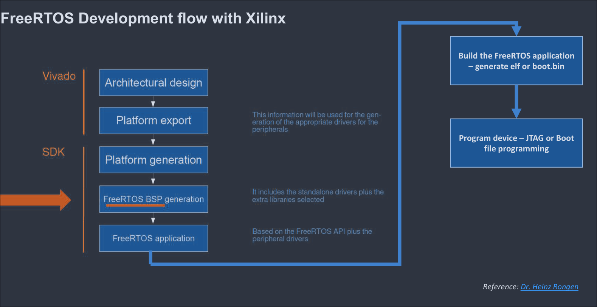
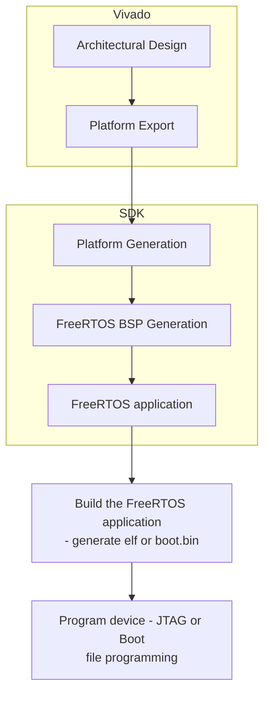
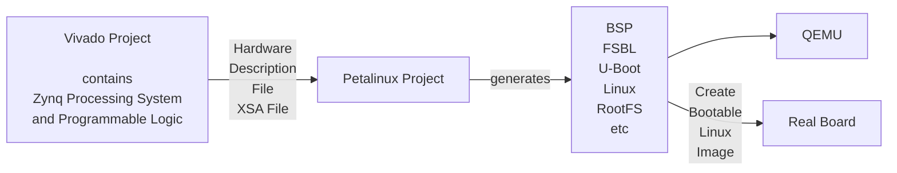
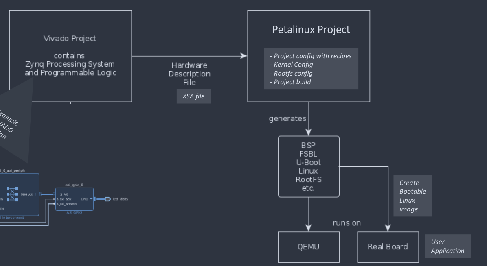

## 8.1. Embedded OS– overview

## Embedded OS:

- Embedded OS is a minimal feature based OS targeted for Embedded Systems.

- Embedded OS are designed for handling specific types of functions in the hardware/software system for running the specific real time application.

## Embedded OS Characteristics

- Time constraints

- Reactive to external events — interrupt driven

- Configurability if OS must handle different types of devices

- I/O device flexibility

- Large range in i/o types

- Limited protection mechanisms

- Software rarely added after system is marketed

- Small

- Fast context switch (thread or process)

- Priority, preemptive scheduling

- Dispatcher & low level scheduler integrated

- Fast response to interrupt

- Little or no disabling of interrupts

- Real memory with partitions

- Data may be kept in memory

## Application area of Embedded OS

- Automotive

- Consumer electronics

- Industrial control

- Medical

- Office automatiion

## Requirements of Embedded OS

- Memory Resident: size is important consideration

- Data structure optimized

- Kernel optimized and usually in assembly language

- Support of signaling & interrupts

- Real-time scheduling

- tight-coupled scheduler and interrupts

- Power Management capabilities

- Power aware schedule

- Control of non-processor resources

## Types of Embedded OS

## General

- WinCE (proprietary, optimized assembly..)

- VxWorks

- Micro Linux

- MuCOS

- Java Virtual Machine (Picojava) OS

- Most likely first open EOS!

## SoC FPGA

- 1. FreeRTOS

- 2. Embedded Linux

## Embedded OS considerations

### Bare-Metal/Standalone System

- Software system without an operating system

- Best deterministic behavior (no overhead, fastest interrupt response, .

- No support of advanced features (no driver layer, no networking, USB, ...)

-> Minimal complexity

### Real-Time Operating Systems RTOS

- deterministic time behaviour

- predictable response time

- For timing sensitive applications

- Multitasking Support Static Task links, all Task code in image

- \- Tep/IP Stacks available

Example - FreeRTOS & Zephyr RTOS

\- Medium complexity

### GUI based Operating Systems

- Linux, Windows ...
- open source operating system
- used in many embedded designs
- fully featured operating system
    - memory management unit
    - full support of all standard interfaces
    - network, usb ..
    - and file system
- no real time behavior
- example - petalinux
- high complexity

Note:
As processing speed has continued to increase for embedded processing, the overhead of an operating system has become mostly negligible in many system designs.

## 8.2. FPGA and Embedded design integration with AMD Xilinx SoC/MPSoC FPGA

## 1. FreeRTOS for Xilinx SoC/MPSoC

- FreeRTOS completely integrated in Xilinx Software Development Flow (SDK, VITIS)

- Provided as a BSP

- Extension of the standalone BSP
    - Includes the O.S. runtime

- All low level drivers can be directly used

- Optional extensions:
    - Filesystem
    - Network
    - ...

figure in mermaid:

Note for figure:
Platform export: This information will be used for the generation of the appropriate drivers for the peripherals
FreeRTOS BSP generation: It includes the standalone drivers plus the extra libraries selected
FreeRTOS application: Based on theh FreeRTOS API plus the peripheral drivers

## 2. Embedded Linux (Yocto/Petalinux Flow) with Xilinx - example

