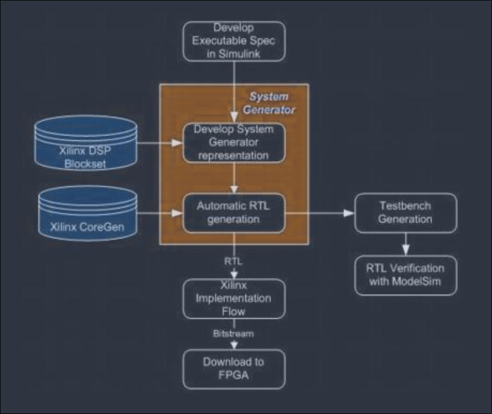
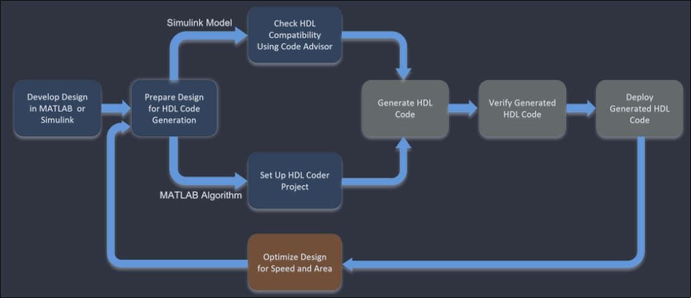
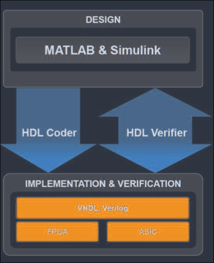

### **9.1. Recent FPGA developments, architectures and its implications.** 

- Recent FPGA Developments 
    - Different FPGA vendors has launched different SoC/MPSoC and FPGA with multiple other co processor to make this FPGA versatile for different use case. 

    - We can see FPGA with few thousand logical blocks to multi-million logical blocks. 

    - FPGA now days not only use in specific application, it is adopted all around of application area. 

- Recent Architectures 

   - AMD-Xilinx Versal is the one of latest architecture of FPGA which consists of FPGA fabric or logic, AI Engine, DSP cores and many logical resources which are needed for Machine Learning, DSP , signal processing, communication/telecom etc applications. 

   - One of latest architecture on FPGA is of support of RISC-V processor inside FPGA. Though this RISC-V processor are implemented in logic of FPGA , some vendor start creating hard block of RISC-V inside FPGA. 

- Recent Implications of FPGA 

   - From the initial use case of FPGA as Glue logic in recent days FPGA are used from vast range of applications. 

   - Now single FPGA can do processing heavy task inside PL, can run OS in its processing units and can also render graphics with some dedicated GPU unit. 

#### **9.2. Application level design, simulation and implementation of DSP, Signal Processing and Telecommunications algorithms in FPGA – Design aspects and methods** 

- Application level design and implementation of DSP logic in FPGA 

   - Many recent FPGA has higher number of DSP blocks or unit which means to run complex DSP logic in it. 

   - The foundation of DSP algorithm as Cordic, FFT can be implemented in FPGA by using some block memory block to store the tan table or filter coefficient in it. 

   - By using Block memory and PL based cordic , FFT like implementation we can implement simple form of these DSP algorithm to higher range or radix implementations. 

   - With availability of large resources we can implement higher precision of DSP algorithm in the FPGA. 

#### **9.2. Application level design, simulation and implementation of DSP, Signal Processing and Telecommunications algorithms in FPGA – Design aspects and methods** 

- DSP algorithm implementation flow
1. RTL/HLS based approach 

    - a. We can implement DSP algorithm in RTL or HLS. The implementation of RTL needs more depth understanding of algorithm while the HLS implementation can also use the available libraries for different DSP algorithms. 

    - b. After RTL or HLS implementation of DSP algorithm complete, we can simulate and then export it as IP or RTL module for integrating with other AXI blocks (master and slaves). For using atan table or filter coefficient we can use the BRAM controller IP or module. 
    - Flow will be as usual as RTL and HLS Flow diagram 
    
    
    Figure: System Generator design flow for DSP design in FPGA
2. MATLAB/Simulink based approach 

    - a. AMD-Xilinx and other vendor also has the tools which support MATLAB and Simulink based designs. 

    - b. By using different DSP reference designs or blocks we can export supported one into the FPGA platform. 

    - c. AMD-Xilinx VIVADO/Vitis comes with System Generator or Vitis Model Composer and HDL coder for converting MATLAB/Simulink based design to FPGA platform. 

Figure(both): HDL Coder design flow for DSP design in FPGA 

### **9.3. RISC processor architecture design flow in Verilog** 

- CISC vs RISC 

| CISC | RISC |
| - | - |
| The original microprocessor ISA | Redesigned ISA that emerged in early 1980s |
| Instructions can take several clock cycles | Single-cycle instructions |
| Hardware-centric design | Software centric design |
| The ISA does as much as possible using hardware circuitry | High level compilers take on most of the burden of codig many software steps from the programmer |
| More efficient use of RAM than RISC | Heavy use of RAM |
| Complex and variable length instruction | Simple, standardized instructions |
| May support microcode | only one layer of instructions |
| Large number of instructions | Small number of fixed length instructions |
| Compound addressing modes | Limited addressing modes |

# **9.3. RISC processor architecture design flow in Verilog** 

What is RISC-V

- RISC-V (pronounced "risk-five") is an open source implementation of a reduced instruction set computing (RISC) based instruction set architecture (ISA)
- Most ISAs are commercially protected by patents, preventing practical efforts to reproduce the computer systems. In contrast, RISC-V is open, permitting any person or group to construct compatible computers, and use associated software
- The project was originated in 2010 by researchers in the Computer Science Division at UC Berkeley, but it now has a large number of contributors. As of 2014 version 2 of the userspace ISA is fixed
    - User-Level ISA Specification v2.0
    - Draft CompressedISA Specification v1.7
    - Draft PrivilegedISA Specification v1.7

# **9.3. RISC processor architecture design flow in Verilog** 

#### • RISC-V Specifications 

https://riscv.org/technical/specifications/ 

https://github.com/riscv/riscv-isa-manual 

Why RISC-V? Goals in defining RISC-V
- A completely open ISA that is freely available to academia and industry
- Areal ISA suitable for direct native hardware implementation, not just simulation or binary translation
- An ISA that avoids "over-architecting" for a particular microarchitecture style (e.g., microcoded, in-order, decoupled, out-of-order) or implementation technology (e.g., full-custom, ASIC, FPGA), but which allows efficient implementation in any of these 
- An ISA separated into a small base integer ISA, usable by itself as a base for customized accelerators or for educational purposes, and optional standard extensions, to support general-purpose software development
- Support for the revised 2008 IEEE-754 floating-point standard
- An ISA supporting extensive user-level ISA extensions and specialized variants
- 32-bit, 64-bit, and 128-bit address space variants for applications, operating system kernels, and hardware implementations
- An ISA with support for highly-paralle! multicore or manycore implementations, including heterogeneous multiprocessors
- Optional variable-length instructions to both expand available instruction encoding space and to support an optional dense instruction encoding for improved performance; state code size, and eneryy efficiency
- A fully virtualizable ISA to ease hypervisor development
- An ISA that simplifies experiments with new supervisor-level and hypervisor-level ISA designs

Big Picture: Building a Processor 

# RISC-V Extensions 

RISC-V Extensions

| Base | Description |
| - | - |
| RV32E | Base 32-bit ISA with 16 registers |
| RV32I | Base 32-bit ISA |
| RV64I | Base 65-bit ISA |
| RV128I | Base 128-bit ISA |

Examples

| Name | Description |
| - | - |
| RV32I | Supports only basic operations natively on 32 bits |
| RV32GC | General purpose uses on 32 bits with support for compressed instructions |
| RV64IMACV | For intensive and parallel integer-only computing |
| RV64GCV | Theoretically suitable for future personal computers |

Naming Convention

RISC-V defines an exact order that must be used to define the RISC-V ISA subset:

`RV [32, 64, 128]` `I, M, A, F, D, G, Q, L, C, 8, J, T, P, V, N`

For example, `RV32IMAFDQC` is legal, whereas `RV32IMAFDCQ` is not.

| Extension | Description |
| - | - | 
| A | Atomic instructions |
| B | Bit manipulation |
| C | Compressed instructions |
| D | Double-precision floating-point |
| F | Single-precision floating-point |
| G | Shorthand for IMAFD extensions |
| H | Hypervisor extension |
| J | Dynamically translated languages |
| L | Decimal floating-point |
| M | Integer multiplication and division |
| N | User-level interrupts |
| P | Packed-SIMD instructions |
| Q | Quad-precision floating-point |
| S | Supervisor mode |
| T | Transactional memory |
| V | Vector operations |

RV32I - Extension for 32-bit integer-based operations 

# RISC-V Extensions 

RISC-V defines a number of extensions, all of which are optional. Some of them are frozen and these are noted below: 

• M: Integer multiplication and division. 

- A: Atomic. 

- F: Single-precision floating point compliant with IEEE 754-2008. 

- D: Double-precision floating point compliant with IEEE 754-2008. 

- Q: Quad-precision floating point compliant with IEEE 754-2008. 

- C: Compressed instructions (16-bit instructions) to yield about 25-30% reduced code size. "RVC" refers to compressed instruction set. 

#### RISC-V Instruction Set 

RISC-V comprises of a base user-level 32-bit integer instruction set. Called **RV32I** , it includes 47 instructions, which can be grouped into six types: 

- R-type: register-register 

- I-type: short immediates and loads 

- S-type: stores 

- B-type: conditional branches, a variation of S-type 

- U-type: long immediates 

- J-type: unconditional jumps, a variation of U-type 

### Operating system supports RISC-V

Several operating systems support RISC-V, providing developers with a variety of options depending on their project requirements. Some of the most notable include: 
- Linux:
    - The Linux kernel has added support for RISC-V, enabling developers to run Linux-based distributions like Debian and Fedora on RISC-V hardware. This support allows for a wide range of applications, from embedded systems to servers and workstations, to benefit from the RISC-V architecture.
- FreeBSD:
    - A popular open-source Unix-like operating system has also added support for RISC-V. FreeBSD providesa reliable and high performance platform for RISC-V systems, particularly in networking and storage applications, with ports such as RISC-V FreeBSD and FreeBSD/RISC-V64.
- Zephyr:
    - Small, scalable, real-time operating system (RTOS) designed for use in resource-constrained environments. It supports RISC-V and is an excellent choice for embedded systems and IoT devices that require a lightweight and customizable OS, with builds like Zephyr RISC-V HiFive1 and Zephyr RISC-V Litex.

#### **9.4. CMOS component design and analysis** 

Following points are consider while designing and analyzing the CMOS design: 

1. CMOS Operation 

2. CMOS Circuit Design 

3. Layout Design 

4. Power and Performance Analysis 

5. Fabrication 

6. Noise and Reliability check 

#### **9.5. Hardware/software co-design, accelerator design with FPGA and integrating with Embedded flow.** 

- Hardware/software co-design in FPGA 

   - This flow is highly used in SoC or embedded FPGAs as there we can see the processor or PS and programmable logic. 

   - In this flow the processing task is partitioned for Hardware and Software ,  then developed separately and later integrated to get the complete functionality. 

   - It is the flow or process or running the algorithm in processor and running the output of processor block to the PL of the FPGA. 

   - Hardware/software co design can allow the floating point operation the operation which has not been implemented for PL to be run in Processor and the PL implemented part will do the remaining processing after PS. 

   - This approach use in SoC/MPSoC FPGAs. 

- Accelerator design in FPGA 

   - In FPGA Accelerator means for any custom algorithmic implementation in RTL or HLS which can process the logic faster than the processor based implementation. 

   - For designing the accelerator , we first create the algorithm breakdown, implement the algorithm in higher level language to verify the algorithm and then start for the FPGA based implementation/deploy either in RTL or HLS. 

   - • Examples of Accelerator are: DPU/NPU IP from Xilinx for Machine Learning Acceleration, Cryptographic hashing accelerator for efficiently processing the hash problems. 

#### **9.6. Approaches of algorithms implementation and offloading in FPGA** 

#### Acceleration vs Offloading 

- Acceleration and offloading both means for enhancing the performance of any algorithm or implementation. 

##### Acceleration 

- In acceleration we implement a custom logic or algorithm in programmable logic of FPGA to achieve the higher performance. 

- It means for creating custom hardware or logical block or IP. 

- Example: creating RTL or HLS based module or IP to run the specific video processing task (segmentation or edge detection). Or creating module or IP for running machine learning algorithms efficiently. 

##### Offloading 

- In offloading we transfer the CPU intensive or processing heavy task to programmable logic of FPGA to get higher performance. 

- It means for creating a module or IP to run the CPU intensive task into FPGA. 

- Example: offloading UDP engine of the network stack into FPGA fabric or logic instead of running in Processor (PS) of FPGA. Or implementing interrupt handling logic in PL instead of PS. 

#### **9.6. Approaches of algorithms implementation and offloading in FPGA** 

#### Acceleration vs Offloading 

- Acceleration and offloading both means for enhancing the performance of any algorithm or implementation. 

|**Aspect**|**Acceleration**|**Offloading**|
|---|---|---|
|Meaning|Making computation faster|Moving computation to another processor|
|Main focus|Performance|Work distribution|
|FPGA role|Hardware accelerator|Offloaded computation engine|
|CPU still involved?|Usually yes|Yes, for control/data management|
|Requires FPGA?|Not necessarily|In this context, yes|
|Example|Pipelined FFT running at high throughput|CPU sends FFT workload to FPGA|

#### **Q. Things to consider while offloading any protocol/algorithm in RTL?** 

###### Considerations 

- Algorithm Analysis 

   - Algorithm breakdown and analysis, determining the algorithm or processing flow according to that we can determine the possible parallelism on sub-process on algorithm. 

- Hardware Resource estimation 

   - What the resource the offloading algorithm could take and what resource it could take. According to resources usage estimation we have to select the FPGA device. 

- Design requirement 

- Either to latency or resource optimize the design. Determine the amount clock frequency going to use. 

- • Data handling 

   - Any memory operation going to happen while offloading will be rechecked. 

- Design methodology 

   - RTL or HLS design methods. And simulation and verification methods will have to be determined. 

- Integration 

   - How to integrate with other necessary IP blocks or modules to perform the complete test. 

- Optimization 

   - Possible optimization for resource or latency or overall performance. 

- Power and timing calculations 

   - Estimating the power usage and timing parameters. 

   - This can help to select the proper FPGA device which can withstand that power range and preform on the timing scenario. 

- Scalability 

   - Mainly checked on , in case of possible update or upgrading the feature on offloading logic is it possible to do that? 

- Cost and toolchain 

   - Overall cost of project and tools going to use. 

