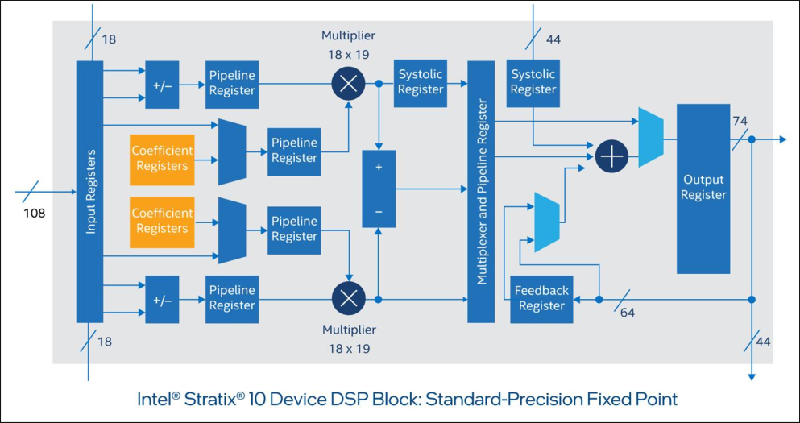
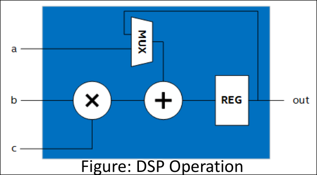
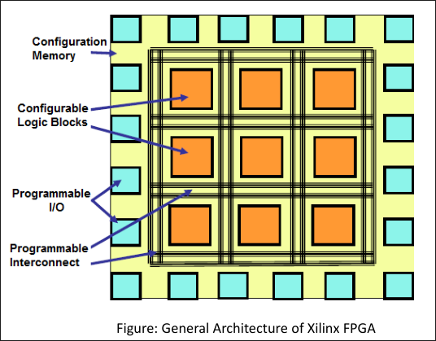
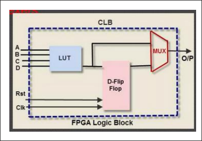

# ⁠A. Chapter 1 FPGA Fundamentals (5 hours)

## ⁠A.1. FPGA overview and its evolution

## ⁠A.2. General FPGA Building Blocks: LUT, FF, DSP, BRAM, I/O, clocks etc.

### ⁠A.2.a. Questions

#### ⁠A.2.a.I. What are the building blocks of FPGA? Explain in detail \[6\]

#### ⁠A.2.a.II. Explain about DSP, BRAM and clock resources of it in detail \[3\]

##### ⁠A.2.a.II.i. DSP Slices (Dedicated Arithmetic Blocks)



- Because arithmetic-heavy operations (multiply, multiply-accumulate, filtering) are extremely inefficient to build purely from LUTs, modern FPGAs embed **hardened DSP blocks** directly in the fabric.
- **Xilinx DSP48E2** (UltraScale/UltraScale+ family, successor to DSP48E1 in 7-Series, DSP48A/A1 in Spartan-6, and the original DSP48 in Virtex-4) is a representative example. A single DSP48E2 slice contains:
    - A **27-bit pre-adder**
    - A **27×18-bit two's-complement multiplier**
    - A **48-bit accumulator / ALU** (supporting add, subtract, and bitwise logic operations, including a 96-bit-wide XOR mode useful for CRC/GF(2ⁿ) arithmetic)
    - Multiple internal **pipeline registers** (on the A/B inputs, after the multiplier, and after the ALU) that can be individually enabled for higher clock speed
    - **Cascade ports** (ACIN/ACOUT, BCIN/BCOUT, PCIN/PCOUT) that chain adjacent DSP slices together without going back through general routing, enabling efficient wide multipliers, systolic-array MAC chains, and long FIR filters
- Intel/Altera calls the equivalent resource a **"variable-precision DSP block"**; functionality is broadly similar (hardened multiply/add/accumulate) though the exact bit-widths and modes differ by vendor.
- Some FPGA families (e.g., certain Intel Agilex/Stratix and AMD Versal devices) support **hardened floating-point arithmetic** in the DSP fabric in addition to fixed/integer point, which is valuable for HPC and some ML workloads.
- DSP slices are typically arranged in **columns**, physically adjacent to BRAM columns, so that data can move between memory and arithmetic with minimal routing delay, important for high-throughput filters and matrix operations.
- Using DSP slices instead of LUT-built arithmetic gives higher clock frequency, lower latency, and dramatically lower LUT utilization for the same function.



##### ⁠A.2.a.II.ii. Block RAM (BRAM)

- **BRAM** is dedicated, hardened on-chip memory distributed throughout the fabric (again, usually column-aligned near DSP columns for locality).
- Typical Xilinx BRAM is organized as **36 Kb dual-port tiles**, each splittable into two independent **18 Kb** blocks, giving designers flexibility between one large memory or two smaller/independent ones.
- Configurable as **true dual-port** RAM (two independent read/write ports, different clocks allowed), single-port RAM, simple dual-port, ROM, or **FIFO** (with built-in FIFO control logic in many families).
- Many BRAM implementations include built-in **ECC (Error Correcting Code)** support, useful for high-reliability designs (aerospace, datacenter, automotive).
- Larger UltraScale+ devices additionally offer **UltraRAM (URAM)**, a denser, larger-block memory (e.g., 4K × 72-bit per block) intended to replace external SRAM for packet buffers, lookup/coefficient tables, and other large on-chip storage needs, without consuming the (comparatively scarcer) BRAM budget.
- Beyond BRAM/URAM, small amounts of memory can also be built from LUTs configured as **distributed RAM**, useful for small, fast, register-file-like storage where a full BRAM tile would be wasteful.
- Typical uses: FIFOs and elastic buffers, packet/line buffers for video or networking, coefficient/lookup tables, cache-like structures for soft processors, and shift-register-style delay lines.

##### ⁠A.2.a.II.iii. Clock Resources

Reliable, low-skew, low-jitter clock distribution is critical since virtually every FPGA resource (FF, BRAM, DSP, transceiver) is clocked.

- **Global Clock Inputs**: dedicated pins (often paired with the I/O banks) specifically designed to bring an external clock signal onto the chip with minimal jitter.
- Some FPGAs (e.g., Xilinx Artix-7) have **no internal clock oscillator**, the user must supply an external reference clock on one of these clock-capable pins; the FPGA does not generate its own base timing reference from scratch.
- **Clock Management Tile (CMT)**: a hardened block (one or more per device, arranged in columns near the I/O banks) that processes an incoming reference clock. Each CMT typically contains:
    - **MMCM (Mixed-Mode Clock Manager)**: the more feature-rich clocking resource: frequency synthesis (multiply/divide to generate new frequencies), fine-grained phase shifting, jitter filtering/attenuation, duty-cycle correction, and in some families dynamic reconfiguration of clock parameters at runtime.
    - **PLL (Phase-Locked Loop)**: a functional subset of the MMCM (frequency synthesis and phase alignment, less flexible than the MMCM), often used when phase-shift/dynamic reconfiguration isn't needed and a leaner resource suffices.
- **Global Clock Buffers (BUFG and variants: BUFGCTRL, BUFGCE, BUFGCE_DIV, BUFH, BUFR, BUFIO, BUFMR, BUFG_GT for transceiver clocks, etc.)**: distribute the CMT's output clocks across the die on a dedicated **low-skew clock tree**, separate from general-purpose routing, so every flip-flop in a clock domain sees the edge at (nearly) the same time.
    - **BUFGCE** in particular provides glitch-free clock gating (a synchronized clock-enable), which is a standard technique for reducing dynamic power by stopping the clock tree in unused regions.
- Clocking resources are organized hierarchically by **clock region** (a fixed grid of CLB rows/I/O banks), with global clocks reaching the whole device and regional/local buffers (BUFR, BUFIO, BUFH) serving smaller areas with even lower latency for things like I/O-adjacent high-speed logic.
- **Design guidance**: use the vendor's **Clocking Wizard** IP to configure MMCM/PLL settings correctly, minimize the number of distinct clock domains, avoid cascading clock buffers unnecessarily (adds skew/delay), and use proper clock-domain-crossing (CDC) synchronizers/FIFOs whenever signals cross between asynchronous clock domains.

##### ⁠A.2.a.II.iv. LUT (Look-Up Table)

- The core combinational-logic primitive. A **k-input LUT** contains \(2^k\) SRAM configuration cells, each holding one row of a truth table, so a k-input LUT can implement **any** Boolean function of up to k variables simply by loading the right bit pattern.
- **4-input LUTs** were the traditional mainstream size for many years; modern high-performance families (e.g., Xilinx 7-Series and later) use **6-input LUTs**, often with two outputs (an LUT6 can be split into two LUT5s sharing inputs), improving logic density and reducing the number of levels of logic (and hence delay) needed for wide functions.
- LUTs can also be repurposed as small **distributed RAM** or **shift registers (SRL)** when not needed purely for logic, a technique the tools use automatically or that a designer can infer explicitly.

##### ⁠A.2.a.II.v. Flip-Flops (FF)

- Provide the sequential storage element paired with each LUT, capturing the LUT's combinational output on a clock edge to build synchronous logic (registers, counters, state machines, pipelines).
- Typically D-type flip-flops, with configurable set/reset polarity, clock-enable, and sometimes selectable as latches.
- Every slice contains multiple LUT+FF pairs, wired through local multiplexers so a designer can freely mix combinational-only, sequential-only, or fully-pipelined logic within one slice.

##### ⁠A.2.a.II.vi. Configurable Logic Block (CLB): Composition

- A CLB packages together: **LUTs**, **flip-flops**, **multiplexers** (for local signal steering/selection), and dedicated **carry-chain logic** (for fast ripple-carry addition/subtraction/comparison).
- LUTs implement the combinational logic function; MUXes select/route between LUT outputs, carry logic, or wide-function combining paths; FFs register the result.
- The number of LUTs per CLB/slice varies by vendor and family, commonly 4, 6, or more inputs per LUT, with 8 LUTs and 16 FFs being a typical modern Xilinx CLB (2 slices × 4 LUTs each, in some families).
- A modern mid-to-large FPGA can contain many tens of thousands to well over a million CLB-equivalent logic cells.

---

## ⁠A.3. FPGA Architectures: general architecture, vendor specific architecture summary

### ⁠A.3.a. Questions

#### ⁠A.3.a.I. Create the general architecture of FPGA \[3\]



At a high level, every FPGA, regardless of vendor, is built from three classes of resources arranged in a regular, repeating grid (an **"island-style"** layout):

1. **Configurable/Logic Blocks** (CLBs in Xilinx terms, Logic Array Blocks in Intel terms): implement combinational and sequential logic.
2. **Programmable Interconnect**: wires and switches that route signals between blocks.
3. **I/O Blocks**: interface the fabric to the outside world.

```txt
        IOB   IOB   IOB   IOB
       ┌───┬─────┬─────┬─────┬───┐
  IOB  │CLB│ CLB │ CLB │ CLB │IOB│
       ├───┼─────┼─────┼─────┼───┤
  IOB  │CLB│ CLB │ CLB │ CLB │IOB│    <- CLBs are "islands"
       ├───┼─────┼─────┼─────┼───┤       surrounded by a
  IOB  │CLB│ CLB │ CLB │ CLB │IOB│       "sea" of routing
       └───┴─────┴─────┴─────┴───┘
        IOB   IOB   IOB   IOB
```

##### ⁠A.3.a.I.i. Logic Blocks (CLBs / LABs / ALMs)

- The CLB is the fundamental logic-building unit. Internally it contains **LUTs**, **flip-flops**, and **multiplexers**, connected through a small **local routing matrix**.
- CLBs are grouped in **slices** (Xilinx), e.g., a Virtex/UltraScale CLB contains multiple slices, each with several 6-input LUTs, associated flip-flops, and fast carry-chain logic for efficient arithmetic.
- **Granularity** of a logic block can be classified as:
    - **Fine-grained**: small primitives like a single NAND/AND/OR/NOT gate (found in some older/academic architectures).
    - **Medium-grained**: LUT/MUX-based or small RAM/ROM-based blocks (the mainstream commercial approach).
    - **Coarse-grained**: larger fixed function units such as floating-point blocks or embedded processor cores.



##### ⁠A.3.a.I.ii. Switch Matrix / Connection & Switch Boxes

- Each CLB sits next to a **switch matrix** (switch box) that connects it into the **general routing fabric**.
- **Connection boxes** attach a logic block's inputs/outputs to nearby routing tracks; **switch boxes** connect horizontal and vertical routing tracks to each other so a signal can turn corners and travel across the die.
- Routing tracks come in different lengths, short "local" segments for nearby connections and long "longlines" that span most of the device for wide/global signals.
- Routing/interconnect typically consumes the **majority of the chip's die area** (on the order of 80–90% in many academic architecture studies), which is why routing-aware placement and routing algorithms matter so much in the design-tool flow.

##### ⁠A.3.a.I.iii. I/O Blocks (IOBs)

- Sit at the periphery of the fabric (and increasingly inside high-speed I/O columns) and translate between the FPGA's internal logic levels and external voltage/signalling standards.
- Contain input and output buffers, often with edge-triggered flip-flops in the I/O path for fast, well-timed data transfer to/from the pin.
- Configurable for many single-ended (LVCMOS, LVTTL) and differential (LVDS, etc.) I/O standards, with programmable drive strength, slew rate, and on-chip termination.
- I/O blocks and their support circuitry occupy a large fraction of overall device area, especially on smaller devices.

##### ⁠A.3.a.I.iv. Configuration Interface

- Every FPGA needs a way to load its **bitstream** (the file that sets every SRAM configuration cell that defines the LUT contents, routing switches, and I/O settings).
- Configuration interfaces are typically **serial** (e.g., JTAG, SPI-based configuration from flash) or **parallel** (SelectMAP-style), depending on device family and required configuration speed.
- On **SRAM-based** FPGAs, configuration is volatile, it must be reloaded from an external non-volatile source (flash, EEPROM, or a host processor) every power-up.

---

## ⁠A.4. Recent developments in FPGA Architecture: heterogeneous architectures

## ⁠A.5. FPGA Architecture targeted for cloud and edge platforms

## ⁠A.6. FPGA Design Flow - summary

### ⁠A.6.a. Questions

##### ⁠A.6.a.I.i. Explain about FPGA design flow. \[4\]

---

# ⁠B. Chapter 2 FPGA logical components, architecture and interfaces (3 hours)

## ⁠B.1. Logical Interconnection and Routing architectures in FPGA

### ⁠B.1.a. Questions

##### ⁠B.1.a.I.i. Write about different routing architectures in FPGA \[4\]

## ⁠B.2. AXI Interface Bus protocol

### ⁠B.2.a. Questions

##### ⁠B.2.a.I.i. What is AXI Bus Protocol \[2\]

##### ⁠B.2.a.I.ii. Write about it and its types \[3\]

## ⁠B.3. High speed Interfaces and usage of those interfaces

## ⁠B.4. High speed bus protocols in FPGA : USB, PCIe, Ethernet, MIPI etc

## ⁠B.5. Embedded SoC/MPSoC architectures detail and interfaces

### ⁠B.5.a. Questions

##### ⁠B.5.a.I.i. Write about SoC/MPSoC FPGA Architectures and some high speed interfacaes in those. \[4\]

---

# ⁠C. Chapter 3 Digital design, simulation and verification with RTL (VHDL/Verilog) (6 hours)

## ⁠C.1. Verilog HDL overview- syntax, semantics, datatypes, primitives, etc.

## ⁠C.2. Behavioral versus structural design modeling

### ⁠C.2.a. Questions

##### ⁠C.2.a.I.i. What are different modeling techniques in Verilog \[5\]

### ⁠C.2.b. Questions

##### ⁠C.2.b.I.i. Write on behavioral and structural modeling techniques with example in Verilog. \[5\]

## ⁠C.3. Logical component design with RTL/Verilog and performing simulation: combinational/sequential blocks, FSM, ALU, processor and DSP algorithms

## ⁠C.4. Verification approaches on RTL

## ⁠C.5. RTL design methodologies for FPGA and VLSI Design

## ⁠C.6. Design optimization on RTL for FPGA and VLSI Design

## ⁠C.7. Verilog Programming

### ⁠C.7.a. Questions

##### ⁠C.7.a.I.i. Write a Verilog code for 4-bit subtractor and also write testbench for it. \[6\]

##### ⁠C.7.a.I.ii. Write a Verilog code for 8-bit ALU by including 8 common arithmetic & logical operation

_Acc to Me and DragonLord, there will be 8 total opcodes, not 8+8_

---

# ⁠D. Chapter 4 Advance RTL design approaches for FPGA (4 hours)

## ⁠D.1. Advance RTL design for latency critical and resource critical designs- overview

## ⁠D.2. Resource, latency, clock and power optimization methodologies

### ⁠D.2.a. Questions

##### ⁠D.2.a.I.i. Explain about latency and throughput optimization Verilog RTL with examples. \[7\]

### ⁠D.2.b. Questions

##### ⁠D.2.b.I.i. Explain about different optimization techniques in RTL, targeting to latency, throughput and power optimization \[7\]

## ⁠D.3. Considerations/approaches for Implementing RTL design in a real-world scenario

---

# ⁠E. Chapter 5 VLSI Design and Verification (6 hours)

## ⁠E.1. VLSI Design, IC technology, CAD tools on VLSI- overview

## ⁠E.2. VLSI Design flow, design styles and verification methodologies

### ⁠E.2.a. Questions

##### ⁠E.2.a.I.i. Explain about VLSI design flow in detail \[6\]

##### ⁠E.2.a.I.ii. Explain about verification methodologies in VLSI \[3\]

## ⁠E.3. CMOS Circuit and Logic Design

### ⁠E.3.a. Questions

##### ⁠E.3.a.I.i. Detail about CMOS inverter design and its analysis \[7\]

##### ⁠E.3.a.I.ii. Create CMOS inverter and explain about it \[3\]

##### ⁠E.3.a.I.iii. Explain about DC analysis of CMOS inverter \[4\]

##### ⁠E.3.a.I.iv. Explain about CMOS circuit design \[3\]

## ⁠E.4. Design and analysis of the CMOS inverter

## ⁠E.5. Analog/ Mixed Mode VLSI design concepts

# ⁠F. Yo kaa ko ho?

## ⁠F.1. Koi vannu

### ⁠F.1.a. Questions

1. Explain about Fixed point and floating point arithmetic \[3\]
