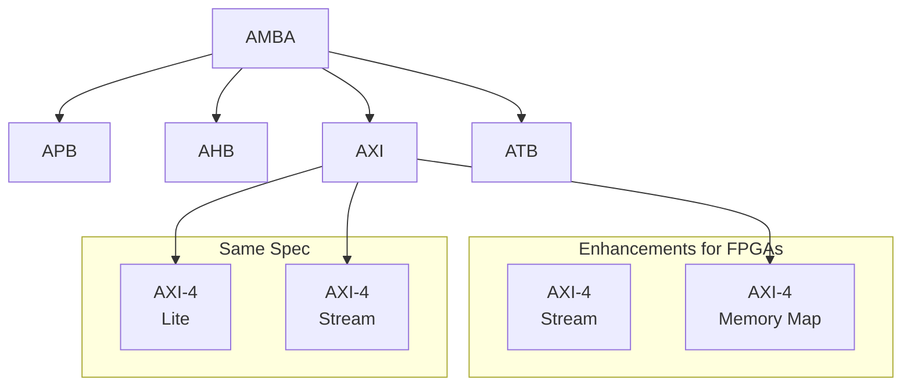

    <b> 3 Hours   5 Marks</b>

# Chapter 2 — FPGA Logical Components, Architectures and Interfaces

---

# A. Logical Interconnection and Routing Architectures in FPGA

## A.1. Logical Interconnection — Basics

- **Logical interconnection** is the configurable/programmable wiring that connects CLBs (logic blocks) to each other, to I/O blocks, and to other embedded resources (BRAM, DSP) inside the FPGA fabric.
- The three fundamental component types inside an FPGA are: **logic blocks**, **interconnect (routing)**, and **I/O blocks**.
  - I/O blocks sit at the periphery of the logic/interconnect fabric.
  - I/O blocks connect into the routing fabric through **connection blocks**.
  - Connection blocks in turn connect to logic blocks — so that, depending on the design's needs, one logic block can be wired to another, to an I/O pin, or to both.
- **Wire segment**: the two endpoints of a piece of interconnect with **no programmable switch in between** — i.e., an uninterrupted length of metal wire.
- **Track**: a sequence of one or more wire segments strung together (via switches) that together carry one logical signal across some distance on the die.

## A.2. Routing Architecture — Role and Trade-offs

- The **routing architecture** comprises the programmable switches and wires that make up the interconnect fabric.
- It provides the connections between I/O blocks and logic blocks, and between logic blocks themselves.
- The choice of routing architecture directly affects two competing things:
  - **Area consumed by routing** (switches + wire segments) versus **area available for logic blocks** — routing resources (switch boxes, connection boxes, wire tracks) can consume the majority of total die area in many FPGA architectures, since programmable interconnect transistors are also the dominant source of propagation delay in FPGA designs.
  - **Achievable logic density** on the device — a more flexible routing fabric (more switches, more wires per channel) makes almost any placement routable, but wastes area/transistors that go unused in most actual designs; too little flexibility, conversely, can make routing infeasible or force poor placement.
- Because the routing resources are **pre-fabricated** (fixed in silicon), the place-and-route tool must work within the constraints of whatever routing architecture the device actually has — deciding exactly which wire segments and switches will carry each signal, while making sure no more connections are attempted through a region than there are physical resources to support.

## A.3. Popular Routing Architectures

### A.3.1. Island-Style Routing Architecture

- The **classic / traditional** FPGA routing architecture — also called a **"mesh"-style** design — and still the most widely used approach in commercial SRAM-based FPGAs today (Xilinx, Intel/Altera, etc. are fundamentally island-style at the top level).
- Structure: logic blocks (CLBs) are laid out on a **2D grid**, appearing as "islands" surrounded by a "sea" of routing channels — hence the name.
- Every CLB has a routing channel on **all four sides**, and connects into that channel via a **connection box** (logic-block-pin-to-channel-wire connections).
- **Switch boxes (SBs)** sit at the intersections of horizontal and vertical channels, allowing a signal on a horizontal track to switch onto a vertical track (and vice versa) so that routing can "turn corners" and reach any part of the die.
- Routing channels typically carry a mix of **wire-segment lengths** — e.g., some tracks span just one logic block ("length-1" segments), others span two or more ("length-2", or long "longlines" spanning most of the die) — giving the router flexibility to trade off delay against the number of switches a signal must pass through.
- Because every CLB is symmetrically surrounded by routing on all sides, this architecture is very flexible and easy for automated place-and-route tools to use well, but it is also **the most "crowded"/complex** in terms of the sheer number of switches and wires required, which is the main area/delay cost of this approach.

### A.3.2. Hierarchical Routing Architecture

- Also called a **tree-based** routing architecture.
- Structure: logic blocks are grouped into **clusters** (and clusters of clusters, recursively), rather than being uniformly connected through a flat grid of channels.
- Routing is provided **within** a cluster using short, fast, richly-connected local wiring, and **between** clusters using progressively fewer, longer wires as you move up the hierarchy.
- Because most real designs have high **connection locality** (most signals connect to nearby logic), this reduces the number of long-distance routing "lanes" actually needed, and increases achievable **speed** between logic that stays within the same cluster/group, since local connections need far fewer switches in series.
- The trade-off is that connections which *do* need to cross between distant clusters may need to route up and back down the hierarchy, which can be less efficient than a flat island-style approach for those particular signals — the hierarchical approach optimizes for the common case (local connectivity) at some cost to the less-common long-distance case.
- Commercial FPGAs sometimes combine ideas from both approaches (e.g., Altera/Intel groups multiple logic blocks into a **Logic Array Block**, forming a first level of hierarchy, before those LABs are connected via an island-style global routing fabric).

### A.3.3. Xilinx Routing Architecture (worked example)

- Illustrated here using the classic **Xilinx Virtex-II** routing scheme as a concrete example of an island-style architecture in a real commercial device.
- Connections are made from a logic block into the routing channel through a **connection block**.
- Because SRAM technology is used to implement the LUTs, the SRAM configuration cells controlling connection sites take up meaningful area — so the architecture is designed to use these connection resources efficiently.
- Each logic block is surrounded by connection blocks on **all four sides**, connecting the logic block's pins to the surrounding wire segments.
- **Pass transistors** are used to implement the connections for **output pins**, while **multiplexers** are used for **input pins** — using a MUX for inputs reduces the number of SRAM configuration cells required per pin (a MUX needs only \(\log_2(N)\) select bits for N inputs, versus one SRAM cell per possible pass-transistor connection).
- Logic-block pins connected to a connection block can then reach any of a number of wire segments through the **switch blocks**.
- **Four types of wire segments** are available in this scheme:
  1. **General-purpose segments** — pass through switches in the switch block; the "default" flexible routing resource.
  2. **Direct interconnect** — dedicated wires connecting a logic block's pins directly to the four immediately-surrounding connection blocks, without going through a switch box; fast, but only useful for very local connections.
  3. **Long lines** — high-fan-out, uniform-delay connections that span a large distance across the chip; useful for signals that must reach many destinations with predictable timing (e.g., control signals).
  4. **Clock lines** — a dedicated network specifically for distributing clock signals with low skew across the whole chip (see also Chapter 1, Section C.6 on clock resources — clock distribution is deliberately kept **separate** from general-purpose signal routing).

### A.3.4. Other / Vendor-Specific Routing Architectures

- Different vendors (e.g., **Altera** and **Actel**) implement their own variations on these routing themes, tuned to their specific logic block design and target market.
- The routing method chosen is generally determined by **where logic blocks are physically placed** and **what routing-channel resources are available** in that particular architecture — e.g., Actel's historical antifuse-based architecture used more wire segments in the horizontal direction than vertical, with switch blocks distributed through the horizontal channels rather than at every intersection, reflecting a routing style tuned to their specific fabric.
- In general, because every FPGA vendor offers several different device families with different internal organizations of logic, memory, and I/O, the specific routing architecture (channel width, segment-length mix, switch-box topology) varies not just between vendors but often between families from the *same* vendor, depending on the target application (logic-dense vs. I/O-dense vs. DSP-dense parts, for example).

---

# B. AXI Interface Bus Protocol

## B.1. Overview

- **AXI** = **A**dvanced e**X**tensible **I**nterface, an on-chip interconnect protocol defined by **ARM** as part of the **AMBA** (**A**dvanced **M**icrocontroller **B**us **A**rchitecture) family of standards.
- AXI was first introduced (as **AXI3**) with **AMBA 3**; the current mainstream version used in FPGA designs is **AXI4** (part of **AMBA 4**), with **AXI5** defined in the newer AMBA 5 specification for the most demanding coherent/high-performance use cases.
- The AXI3/AXI4 specifications are freely available from ARM.
- AXI is used for **high-speed, high-throughput on-chip communication** between processing components — CPUs, DMA engines, custom logic in the FPGA fabric, memory controllers, and peripherals — inside SoC/MPSoC-class FPGA devices (e.g., linking the Zynq Processing System to custom logic in the Programmable Logic, see Chapter 1 Section F).

### AMBA Protocol Family

- **APB** (Advanced Peripheral Bus) — a simple, low-power bus for low-bandwidth peripheral register access.
- **AHB** (Advanced High-performance Bus) — a higher-performance system bus, predecessor in spirit to AXI.
- **AXI** — the high-performance, pipelined, burst-capable bus described in detail below.
- **ATB** (Advanced Trace Bus) — used for debug/trace infrastructure, not general data movement.

## B.2. Key Features of AXI

- **Burst-based transactions with only a single address phase** — a whole burst of data beats is transferred using one address, rather than needing a new address for every data word (this is a major efficiency win over older simple bus protocols).
- Support for **unaligned data transfers** via byte-lane **strobes** (write strobes let a master write only specific bytes within a data-bus-width word).
- **Separate read and write data channels** — reads and writes can happen concurrently, rather than sharing a single bidirectional data bus.
- **Optional low-power operation** signaling.
- Ability to issue **multiple outstanding addresses** and support **out-of-order transaction completion** — a master can issue several requests before earlier ones complete, and responses can come back out of order, improving achievable throughput on high-latency memory systems.
- The **address phase is separated from the data phase**, letting the interconnect pipeline addresses and data independently for higher overall throughput.

## B.3. AXI Protocol System / Interconnect

- AXI supports **single-master/multi-slave**, **multi-master/single-slave**, and full **multi-master/multi-slave** system topologies, using an **AXI Interconnect** block to arbitrate and route transactions between multiple masters and slaves.
- Being part of the AMBA family means AXI IP designed by different vendors/teams can interoperate at the protocol level, which is a large part of its popularity for SoC integration.

## B.4. The Three AXI4-Family Interfaces

| Interface | Features | Roughly Comparable To |
|---|---|---|
| **AXI4 (Memory-Mapped / "Full AXI")** | Traditional address/data burst — single address, multiple data beats per burst (up to 256 beats); data width parameterizable up to 1024 bits | PLBv46, PCI |
| **AXI4-Lite** | Traditional address/data, **no burst support** — every transaction is exactly one data beat, and the data-access size always equals the bus width; simplest and smallest-footprint AXI variant | PLBv46-single, OPB |
| **AXI4-Stream (AXI4-S)** | Data-only, burst-capable, **unbounded/unlimited length**, no address channel at all — effectively a pure "write data channel" from master to slave | LocalLink / DSP streaming interfaces, FSL, FIFOs |

> **Correction/clarification vs. common confusion**: it is **AXI4 (full/Memory-Mapped)**, not AXI4-Lite, that supports bursts (up to 256 data beats per the AXI4 spec — up from AXI3's 16-beat maximum). **AXI4-Lite explicitly has no burst capability** — every AXI4-Lite transaction moves exactly one data beat per address.

### B.4.1. AXI4 (Memory-Mapped, "Full AXI")

- A high-performance, memory-mapped address-and-data interface, used when a master needs efficient burst access to a memory-mapped slave (DDR controller, BRAM controller, memory-mapped peripheral registers with burst needs, etc.).
- Supports **single address, multiple data (burst)** transfers — up to **256 data beats** per burst in AXI4 (compared to a 16-beat maximum in the older AXI3).
- Data width is parameterizable: **32, 64, 128, 256, 512, or up to 1024 bits**.
- Sometimes informally (and not by ARM's official terminology) called **"Full AXI"** or **"AXI Memory Mapped"**.
- Supports additional features not present in AXI4-Lite: **exclusive access** (for atomic read-modify-write operations), quality-of-service (QoS) signaling, and cache/protection attribute signaling (AxCACHE, AxPROT) used for cache-coherency and security/privilege checking in larger SoC interconnects.

### B.4.2. AXI4-Lite

- A deliberately simplified **subset of AXI4**, intended for straightforward, low-bandwidth **control/status-register**-style access (e.g., configuring an IP core's control registers from a CPU) rather than bulk data movement.
- **No burst support** — every transaction transfers exactly one data beat.
- Data width is restricted to **32 or 64 bits** (many Xilinx AXI4-Lite IP interfaces support **32-bit only**).
- **Exclusive accesses are not supported.**
- Very small logic footprint compared to full AXI4 — appropriate when a peripheral only needs a handful of memory-mapped registers.
- In Xilinx Vivado, **bridging** between an AXI4-Lite peripheral and a full AXI4 system is handled automatically by the **AXI Interconnect** IP where needed, so a designer doesn't have to hand-build a bridge.
- Still uses the **same five channels** as AXI4 (see B.5) and the same VALID/READY handshaking — it's a protocol *subset*, not a different signaling scheme.

### B.4.3. AXI4-Stream (AXI4-S)

- Designed for **fast, unidirectional, point-to-point data movement** from a single master to a single slave, without any concept of a memory address.
- Has **no address channel** at all, and no separate read/write direction — effectively it behaves like the "write data" channel of AXI4 running on its own, continuously.
- **Unlimited burst length** — unlike AXI4's 256-beat cap, an AXI4-Stream transfer can run indefinitely as long as both sides keep asserting VALID/READY.
- Uses virtually the **same signaling style** as the AXI4 data channels (VALID, READY, DATA, plus optional sideband signals like TLAST, TKEEP, TSTRB, TID, TDEST, TUSER).
- The protocol explicitly supports **merging, packing, and width conversion**, and supports sparse, continuous, aligned, or unaligned data streams — this flexibility is why it's the standard choice for DSP pipelines, video pipelines, and packet-processing datapaths inside FPGA fabric.

**Signaling references** (see linked figures):
- AXI4-Lite signaling: `../attachments/axi4-lite.png`
- AXI4 (full) signaling: `../attachments/axi4.png`
- AXI4-Stream transfer signaling: `../attachments/axi4-stream.png`

## B.5. Basic AXI Signaling — The Five Channels

Both AXI4 and AXI4-Lite are built from **five independent channels**, each with its own **VALID/READY** handshake, which is what allows AXI to pipeline addresses ahead of data and support multiple outstanding transactions:

1. **Read Address Channel** (AR) — master sends the address (and burst attributes) for a read.
2. **Read Data Channel** (R) — slave returns the requested read data (one or more beats).
3. **Write Address Channel** (AW) — master sends the address (and burst attributes) for a write.
4. **Write Data Channel** (W) — master sends the write data (one or more beats, with byte strobes).
5. **Write Response Channel** (B) — slave confirms completion/status of the write transaction.

- A **read transaction** uses only the Read Address and Read Data channels.
- A **write transaction** uses the Write Address, Write Data, and Write Response channels (three channels, versus two for a read).
- Every channel shares the same basic handshake: the **source** asserts **VALID** when it has valid information, and holds it asserted until the **destination** asserts **READY** to accept it — whichever side is master vs. slave/source vs. destination depends on which channel is being used (e.g., on the Read Address channel the master is the *source*; on the Read Data channel the master is the *destination*).

## B.6. Memory-Mapped vs. Streaming — Channel Count Comparison

- **Memory-Mapped (AXI4 / AXI4-Lite)**: **5 channels total** — 3 for a write transaction (AW, W, B) and 2 for a read transaction (AR, R).
- **Streaming (AXI4-Stream)**: only **1 channel** is needed, since there's no address phase and no separate read/write direction — just a continuous data channel with its handshake and sideband signals.

## B.7. Streaming Application Patterns

AXI4-Stream is used differently depending on whether the underlying data naturally has "packets" or not:

- **No inherent packet structure** — e.g., a **digital up-converter (DUC)** in an SDR/wireless datapath: there's no concept of an address, and data is simply free-running (continuous). In this situation, AXI4-Stream reduces to a very simple, minimal-overhead interface (essentially just DATA + VALID + READY).
- **Inherent packet structure** — e.g., **PCIe** traffic: individual packets can carry very different kinds of information (different transaction types, headers, payloads). This typically requires some form of **bridge logic** to translate between the packet-oriented external protocol and the AXI4-Stream representation used internally in the FPGA fabric.

## B.8. Converting Between Memory-Mapped and Streaming Data

- **DMA (Direct Memory Access)** IP cores, provided by the FPGA design tools/platform, are what generally perform the conversion between **streaming** and **memory-mapped** domains, and vice versa.
- Different vendors offer several DMA IP variants tuned to different data types and use cases, including:
  - **VDMA** (Video DMA) — optimized for video frame data
  - **CDMA** (Central DMA) — general-purpose memory-to-memory movement
  - **QDMA** (Queue-based DMA) — high-performance, queue-based DMA typically used for PCIe/networking-class throughput

## B.9. AXI VDMA / Central DMA — Why They Matter

- Needed whenever **streaming data must be written into external memory (DRAM)** or read back out of memory as a stream.
- **VDMA** performs the conversion: it can take AXI4-Stream data and write it into memory as AXI4 (memory-mapped) transactions, and conversely, it can read memory-mapped data out of DRAM and re-present it as an AXI4-Stream.
- In both directions, the VDMA engine must first be **configured and triggered by the host CPU** (via its AXI4-Lite control-register interface).
- VDMA can **interrupt the host CPU** once a transfer completes, so software doesn't need to poll for completion.

## B.10. AXI VDMA — Additional Detail

- **AXI Video Direct Memory Access (VDMA)** provides high-bandwidth, direct memory access between system memory and AXI4-Stream **video**-type target peripherals (i.e., peripherals implementing the AXI4-Stream Video protocol convention, which adds frame/line-boundary signaling on top of plain AXI4-Stream).
- Many video applications need **frame buffers** in DRAM to absorb changes in frame rate, or to support scaling/cropping between producer and consumer — VDMA is specifically designed to give efficient, high-bandwidth access between the AXI4-Stream video interface side and the AXI4 memory-mapped side to support exactly this use case.

---

# C. High-Speed Interfaces and Their Usage

> **Focus topic 3 (part 1) — High-speed interfaces used in SoC/MPSoC**

## C.1. Overview

- FPGAs can process very large volumes of data internally, so **getting that data into and out of the chip fast enough** requires dedicated high-speed bus protocols, rather than relying on simple general-purpose I/O.
- The number and type of high-speed interfaces available depends on the specific FPGA architecture/family — larger, SoC-class devices typically expose several different high-speed interfaces simultaneously (see Section E).

## C.2. Why High-Speed Interfaces Matter

- **Moving large amounts of data** to/from the FPGA and external devices (sensors, memory, storage, network, host processors, displays) without becoming a system bottleneck.
- **Achieving high throughput and low latency** in the data path between the FPGA and other computing platforms (host CPU, GPU, other FPGAs, or accelerator cards) — this is what lets an FPGA actually deliver on its parallel-processing potential rather than being starved of data.

---

# D. High-Speed Bus Protocols in FPGA

## D.1. Overview

- As covered in Section C, when an FPGA needs to exchange large volumes of data with external devices or platforms, dedicated high-speed bus protocols are required.
- To support these protocols, FPGA silicon includes dedicated **gigabit transceivers** (see Chapter 1, Section G) as part of the overall chip architecture — these are hardened SerDes blocks, separate from the general-purpose fabric.
- High-speed interfaces can be implemented as **serial** (using the gigabit transceivers) or, less commonly today, **parallel** data communication channels.

## D.2. USB

- **USB** (Universal Serial Bus) is a widely-used high-speed **serial** bus protocol for exchanging data between two computing platforms/devices.
- Performance scales with **USB revision** — later revisions offer substantially higher throughput.
- Most FPGA platforms that support USB provide **USB 2.0** and/or **USB 3.0**-class interfaces (typically via an external USB PHY chip connected to FPGA high-speed I/O, since native USB transceivers are less commonly hardened directly into FPGA fabric compared to PCIe/Ethernet-class SerDes).

| Current Version | Current Name | Original Name | Marketing Name | Transfer Rate |
|---|---|---|---|---|
| USB 2.0 | Low-Speed | USB 1.0 | Low Speed | 1.5 Mbps |
| USB 2.0 | Full-Speed | USB 1.1 | Full Speed | 12 Mbps |
| USB 2.0 | Hi-Speed | USB 2.0 | Hi-Speed | 480 Mbps |
| USB 3.2 | Gen 1 | USB 3.1 Gen 1 | SuperSpeed USB | 5 Gbps |
| USB 3.2 | Gen 2 | USB 3.1 Gen 2 | SuperSpeed USB 10 Gbps | 10 Gbps |
| USB 3.2 | Gen 2x2 | N/A | SuperSpeed USB 20 Gbps | 20 Gbps |
| USB4 | — | — | USB4 | up to 40 Gbps |

> Note: USB 3.2 Gen 2x2 and USB4 achieve their headline rates by running **two lanes** at Gen-2 speed (2×10 Gbps) rather than a single faster lane — worth remembering when comparing "per-lane" vs. "aggregate" figures across protocols.

## D.3. PCIe (PCI Express)

- **PCIe** (Peripheral Component Interconnect Express) is a high-speed **serial** bus protocol used across CPU, GPU, and FPGA platforms as the dominant standard for **host-to-accelerator** connectivity.
- PCIe offers very high data-transfer speed to/from the host platform and is the primary way cloud/datacenter FPGA accelerator cards attach to a server (see Chapter 1, Section H.2).
- Performance increases with each PCIe **generation**; each new generation roughly **doubles** the raw per-lane transfer rate of the previous one.

| PCIe Version | Line Encoding | Transfer Rate (per lane) | x1 Throughput | x4 Throughput | x8 Throughput | x16 Throughput |
|---|---|---|---|---|---|---|
| 1.0 | 8b/10b | 2.5 GT/s | ~0.25 GB/s | ~1 GB/s | ~2 GB/s | ~4 GB/s |
| 2.0 | 8b/10b | 5 GT/s | ~0.5 GB/s | ~2 GB/s | ~4 GB/s | ~8 GB/s |
| 3.0 | 128b/130b | 8 GT/s | ~0.985 GB/s | ~3.94 GB/s | ~7.88 GB/s | ~15.75 GB/s |
| 4.0 | 128b/130b | 16 GT/s | ~1.97 GB/s | ~7.88 GB/s | ~15.75 GB/s | ~31.5 GB/s |
| 5.0 | 128b/130b | 32 GT/s | ~3.94 GB/s | ~15.75 GB/s | ~31.5 GB/s | ~63 GB/s |

> **Corrections applied vs. the original draft**: PCIe 3.0/4.0/5.0 all use **128b/130b** encoding (not 8b/10b, and not "18b/130b" as a typo for Gen4) — this encoding has only ~1.5% overhead, versus 8b/10b's 20% overhead used in Gen1/Gen2. Figures above are per-direction, full-duplex theoretical maximums; real-world throughput is typically a few percent lower due to protocol/packet overhead. Gen1 x1 throughput is ~250 MB/s (not the raw 2.5 GT/s figure), and Gen5 numbers scale consistently from the 32 GT/s per-lane rate rather than the inconsistent x1 figures in the earlier draft.

## D.4. Ethernet

- The standard **networking** protocol, also implemented over FPGA gigabit transceivers for high-speed variants.
- Common rates relevant to FPGA/SoC designs: **1 Gigabit Ethernet (1000BASE-X)**, **10G**, **25G**, and **100G+ Ethernet**, the higher rates using 64b/66b line encoding over multi-gigabit SerDes lanes (see Chapter 1, Section G.2).
- Implemented either via a **hardened Ethernet MAC/PCS** IP block (where available) or a **soft MAC** built in FPGA fabric, paired with the chip's gigabit transceivers as the physical layer.
- Widely used for both general networking connectivity and, in datacenter/telecom FPGA deployments, for direct line-rate packet processing offloaded into the PL (see Chapter 1, Section H.2).

## D.5. MIPI

- **MIPI** (Mobile Industry Processor Interface) is a popular bus interface standard for handling **media data** — images, video, and display content.
- MIPI defines multiple specifications; the two most relevant to FPGA/embedded-vision designs are:
  - **MIPI DSI** (Display Serial Interface) — for driving displays.
  - **MIPI CSI** (Camera Serial Interface) — for receiving data from camera image sensors.
- Widely used in **camera-based designs** (embedded vision, machine vision, mobile-class image sensors) and in designs that drive a **display** directly from the FPGA/SoC.

## D.6. LVDS

- **LVDS** (Low-Voltage Differential Signaling) is a differential I/O standard commonly used to interface **camera modules and various sensors** to an FPGA.
- Signals are carried as a **differential pair** — a "P" (positive) and "N" (negative) line — with the receiver recovering the original signal from the *difference* between the two lines. This makes LVDS inherently more resistant to common-mode noise than single-ended signaling, which is why it's favored for longer runs and noise-sensitive sensor interfaces.
- LVDS can be used bidirectionally: it is equally suited to **receiving** sensor data into the FPGA and **transmitting** data from the FPGA out to an external platform (e.g., driving an LVDS-based display panel).

---

# E. Embedded SoC/MPSoC Architectures — Detail and Interfaces

## E.1. SoC vs. MPSoC — Definitions

- An embedded **SoC** (System-on-Chip) integrates a **processor/CPU together with the FPGA fabric** on the same physical chip/device — this is the architecture covered in depth in Chapter 1, Section F (e.g., Xilinx Zynq-7000).
  - An SoC-class FPGA could have **one or two** processor cores.
- An **MPSoC** (Multi-Processor SoC) extends this concept further: it integrates **more than two processors**, often of **different types** (e.g., an applications-class CPU cluster *and* a real-time CPU cluster *and* a GPU, as in Zynq UltraScale+ MPSoC — see Chapter 1, Section F.2).
- Both SoC and MPSoC architectures are designed to handle diverse data types simultaneously — **audio, video, sensor data, file-system/storage traffic**, and more — which is exactly why they need a rich mix of interfaces (below) to get all of that heterogeneous data on and off the chip.

## E.2. Representative MPSoC Interface Architecture

## E.3. Interface Categories in SoC/MPSoC

1. SoC and MPSoC architectures of this kind are **mainly targeted at low-power and edge-based applications** — embedded vision, industrial control, instrumentation, automotive, and similar use cases where a full datacenter-class cloud FPGA (Chapter 1, Section H.2) would be overkill on power and cost.
2. These devices generally expose **two broad classes of interface**:

| Interface Class | Examples | Typical Role |
|---|---|---|
| **General-purpose interfaces** | USB 2.0, CAN, UART, I2C, SPI | Low-speed control, configuration, sensor polling, simple peripheral communication |
| **High-speed (high-bandwidth) interfaces** | USB 3.0, LVDS, MIPI, HDMI, PCIe, Gigabit Ethernet | Bulk data movement — camera/video streams, display output, storage, high-rate sensor data, networking |

3. The general-purpose interfaces listed are chosen specifically because they are **low-power** and well-suited to **embedded/edge-based applications**, where power and board-space budgets are much tighter than in a server or datacenter environment.
4. In an SoC/MPSoC FPGA, these interfaces are what let the device **receive, process, and send** data across all of the diverse data types mentioned in E.1 — the PS (or APU/RPU/GPU in an MPSoC) typically manages the general-purpose/control-plane interfaces, while high-bandwidth data streams are routed either directly through hardened peripheral controllers or via AXI4-Stream/VDMA (Section B) into the PL for custom processing, and/or into DDR memory for buffering.

### How This Ties Together

A typical SoC/MPSoC data path illustrates why Sections B, C/D, and E are closely linked:
1. A **high-speed interface** (e.g., a MIPI CSI camera or an LVDS sensor) brings raw data onto the chip.
2. The interface's PHY/controller presents that data to the fabric as an **AXI4-Stream**.
3. An **AXI VDMA** (Section B.9–B.10) converts the stream into **AXI4 memory-mapped** writes into DDR, or feeds it directly to PL processing logic.
4. The **PS** (via **AXI4-Lite**, Section B.4.2) configures and triggers the VDMA and any custom PL accelerators, and is interrupted on completion.
5. Processed results may then leave the chip again via another high-speed interface — e.g., **HDMI/DisplayPort** for display, or **PCIe/Ethernet** (Section D) to a host or network — completing the receive-process-send cycle described in E.4.
