# A. VLSI Design Introduction

## A.1. What is VLSI?

- **VLSI** = **V**ery **L**arge **S**cale **I**ntegration.
- Refers to the process (and the resulting technology level) of integrating a very large number of transistors — historically defined as **hundreds of thousands of transistors** — onto a single silicon chip.
- **Use of VLSI**: allows entire complex circuits and systems (that once required many discrete chips) to be built on a single small piece of silicon, dramatically reducing size, cost, and power while increasing speed and reliability.
- VLSI is one point on a broader historical scale of integration density — see A.3 below for how it compares with SSI/MSI/LSI.

## A.2. VLSI Design — Starting Point

- The **VLSI design cycle** begins with a **formal specification** of the target chip — a precise statement of what the chip must do, how fast, at what power, and within what physical/cost constraints — before any architecture or circuit work begins (expanded fully in Section B).

## A.3. IC Technology — Levels of Integration

| Level    | Full Form                    | Era    | Gate Count per Chip       | Typical Circuits                                                                |
| -------- | ---------------------------- | ------ | ------------------------- | ------------------------------------------------------------------------------- |
| **SSI**  | Small Scale Integration      | ~1960s | Fewer than 10 logic gates | Basic logic gates (AND/OR/NAND/NOR)                                             |
| **MSI**  | Medium Scale Integration     | ~1966  | 10 to 100 gates           | Flip-flops, adders, counters, multiplexers                                      |
| **LSI**  | Large Scale Integration      | ~1970  | 100 to 10,000 gates       | Small memory chips, PLDs (Programmable Logic Devices)                           |
| **VLSI** | Very Large Scale Integration | ~1980  | 10,000 to 100,000 gates   | Microprocessors with cache memory, floating-point units, RAM, ROM, complex PLDs |

> Beyond VLSI, industry usage has since introduced informal terms like **ULSI** (Ultra Large Scale Integration, millions of gates) and modern chips now routinely integrate **billions** of transistors — the "VLSI" label has stuck as the general name for the _field_ of large-scale IC design even though device complexity has grown far past the original 100,000-gate definition.

## A.4. Types of Transistors

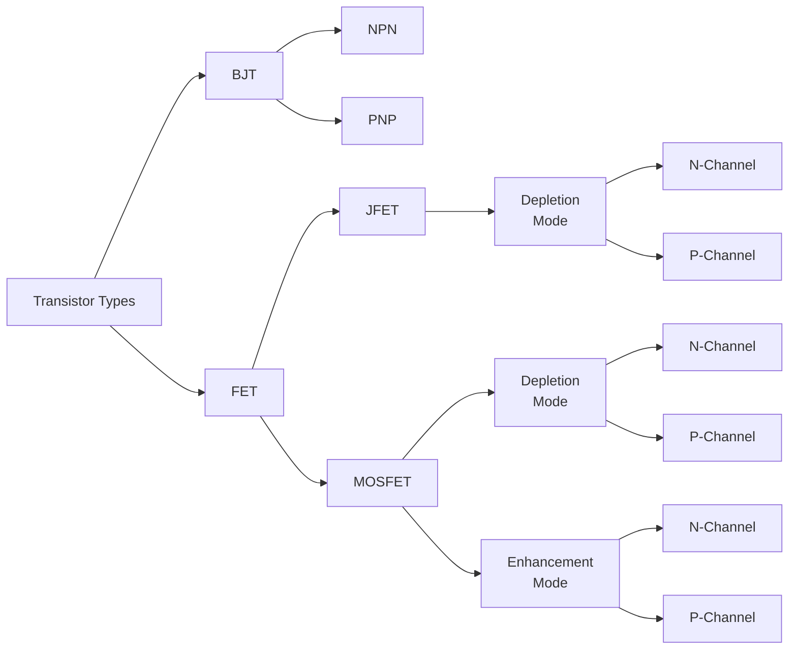

- **BJT (Bipolar Junction Transistor)** — current-controlled device, split into **NPN** and **PNP** types based on doping arrangement; historically used in TTL/ECL logic families (Section A.5).
- **FET (Field-Effect Transistor)** — voltage-controlled device, split into:
    - **JFET** (Junction FET) — depletion-mode only, N-channel or P-channel.
    - **MOSFET** (Metal-Oxide-Semiconductor FET) — the dominant device family in modern VLSI; available in both **depletion-mode** and **enhancement-mode** variants, each further split into N-channel (NMOS) and P-channel (PMOS). **Enhancement-mode MOSFETs are the devices used to build CMOS logic** (Section D).

## A.5. Processing Technologies in VLSI

- **Bipolar**
    - **TTL** (Transistor-Transistor Logic) — an early standard logic family built from bipolar transistors.
    - **ECL** (Emitter-Coupled Logic) — a high-speed bipolar logic family, historically used where switching speed mattered more than power consumption.
- **MOS**
    - **NMOS** — uses only N-type MOSFETs. Advantages: fewer masking steps in fabrication, higher device density, lower power than bipolar — but it suffers from **static power dissipation** (a pull-up resistor or always-on pull-up device draws current even in the steady state), which became a key limitation as integration density increased.
    - **CMOS** (**C**omplementary MOS) — uses both NMOS and PMOS devices together (Section D); offers very low static power consumption and fewer fabrication steps than bipolar approaches, and has become the dominant technology for modern VLSI (see Section D.3 for why).
- **BiCMOS** — combines Bipolar and CMOS devices on the same chip, exploiting bipolar transistors' higher drive strength/speed for critical paths while using CMOS for low-power logic; used where very high speed is required alongside CMOS-level density.
- **GaAs** (Gallium Arsenide) — a compound-semiconductor technology offering higher electron mobility than silicon, used for very high-speed and RF/microwave applications, at higher cost than silicon CMOS.
- **SOI** (Silicon on Insulator) — builds the active transistor layer on top of an insulating layer rather than directly on bulk silicon, reducing parasitic capacitance and improving high-temperature and radiation-tolerance behavior; used in high-reliability, high-temperature, and some high-performance applications.

## A.6. CMOS Logic Circuit — Reference

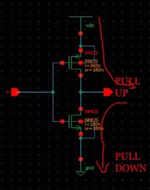</img>

## A.7. CAD Tools in VLSI

| CAD Tool            | OS/License  | Type                    | Function                                                   |
| ------------------- | ----------- | ----------------------- | ---------------------------------------------------------- |
| Cadence EDA         | Licensed    | Analog and Mixed Signal | Complete CAD flow (schematic → layout → verification)      |
| Mentor Graphics EDA | Licensed    | Analog and Mixed Signal | Complete CAD flow                                          |
| Synopsys EDA        | Licensed    | Analog and Mixed Signal | Complete CAD flow                                          |
| Tanner EDA          | Licensed    | Analog and Mixed Signal | Complete CAD flow                                          |
| Alliance            | Open Source | Mixed Signal            | Logic to Layout                                            |
| Electric CAD        | Open Source | Mixed Signal            | Logic to Layout                                            |
| Magic               | Open Source | —                       | Circuit Layout editor                                      |
| SystemC             | Open Source | Electronic System Level | C++ class library for system-level/digital design modeling |
| MyHDL               | Open Source | —                       | Python-based Hardware Description Language                 |

---

# B. VLSI Design Flow

> **Focus topic 1 — Explain about VLSI design flow in detail**

## B.1. Overview

- The VLSI design flow is the structured, staged process that converts an idea/specification into a **fabricated, packaged, tested chip**.
- It is commonly split into two broad halves:
    - **Front-End Design** (logical) — everything from specification through RTL design, functional verification, and logic synthesis; concerned purely with _what the chip does_, independent of physical implementation.
    - **Back-End (Physical) Design** — floorplanning, placement, routing, static timing analysis, and physical sign-off; concerned with _how the logical design is actually realized in silicon_.
- The handoff point between front-end and back-end is the **gate-level netlist** produced by logic synthesis.

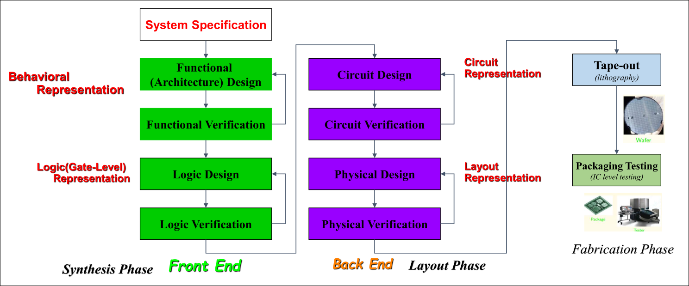

## B.2. Four Levels of Design Representation

As a design moves through the flow, it is successively represented at four levels of abstraction, from most abstract to most physical:

1. **Behavioral Representation** — describes _what_ functional blocks do (e.g., FSMs, algorithms) without specifying gates or transistors.
   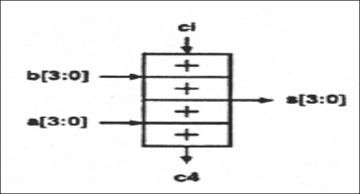
2. **Logic (Gate-Level) Representation** — describes the design as a network of logic gates.
   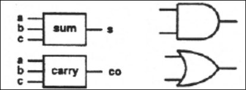
3. **Circuit (Transistor-Level) Representation** — describes the design as transistor-level schematics.
   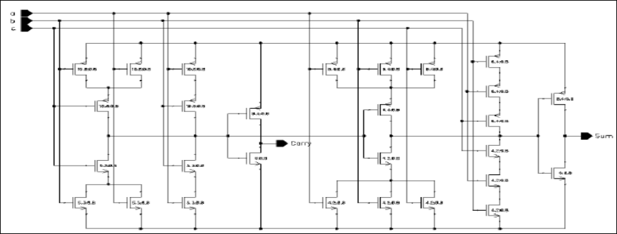
4. **Layout Representation** — describes the design as the actual physical geometry (masks/polygons) that will be fabricated.
   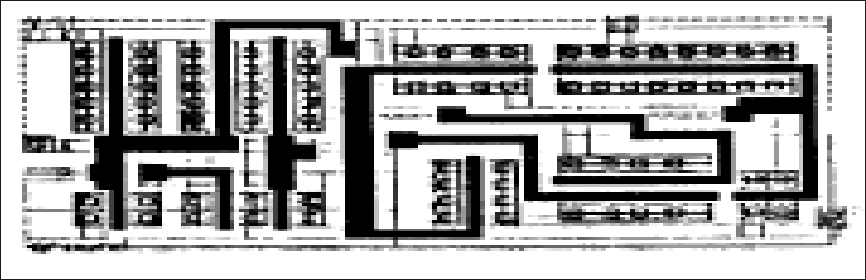

- Each level maps onto later stages of the design flow: behavioral ↔ functional/logic design, gate-level ↔ logic synthesis output, transistor-level ↔ circuit design, layout ↔ physical design.

## B.3. Design Methodology: Top-Down vs. Bottom-Up

There are two basic approaches to structuring a digital VLSI design:

1. **Top-Down Design Methodology**
    - Define the **top-level block** first, and identify its major sub-blocks.
    - Recursively **divide each sub-block** into smaller sub-blocks, continuing until reaching **leaf cells** (basic gates/cells that won't be further decomposed).
    - Advantage: keeps the overall architecture and interfaces clear from the start; well suited to large, novel designs.
2. **Bottom-Up Design Methodology**
    - Start by **identifying the building blocks already available** (standard cells, IP, previously-designed modules).
    - **Build progressively larger cells** by combining these available blocks.
    - Continue combining until the **top-level design** is assembled.
    - Advantage: maximizes reuse of proven, characterized blocks; reduces design and verification effort when a strong library already exists.

- In practice, real projects generally use a **combination of both** — a top-down architectural decomposition guided by, and reconciled against, a bottom-up inventory of available reusable blocks.

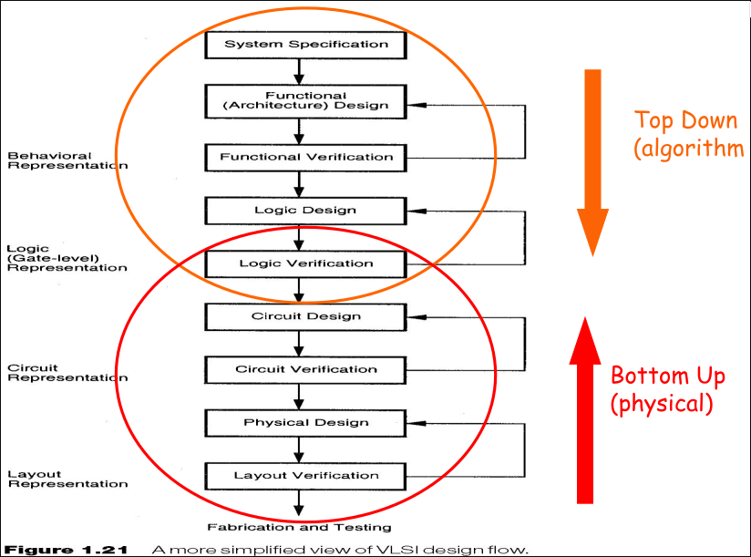

## B.4. Detailed Steps of the VLSI Design Flow

The canonical VLSI design flow is typically described as an **eight-step process**: system specification, architectural design, functional/behavioral design, logic design, circuit design, physical design, fabrication, and packaging/testing. Each is detailed below.

### B.4.1. System Specification

- The **first step** of the design process: laying down the specification of the system as a whole.
- This is a **high-level representation** of the system, considering:
    - **Performance** and **functionality**
    - **Physical dimensions** (die size/area budget)
    - **Design technique** to be used
    - **Technological and economical viability**
- **Outcome**: a specification covering **size, speed, power, and functionality**, along with the **basic architecture** of the VLSI system — this document is what every later stage is validated against.

### B.4.2. Architectural Design

- Using the system specification, the **design engineer/architect** works out the chip's architecture — major subsystems, datapaths, memory organization, and how they interconnect.
- This step produces an initial **C-model or high-level RTL model** and an initial **floorplan** sketch (a rough estimate of how major blocks will be arranged on the die).

### B.4.3. Functional (Behavioral) Design

- The system's **main functional units** and their **interconnect requirements** are identified.
- The **area, power, and other parameters** of each functional unit are **estimated** at this stage (before detailed implementation), to catch infeasible designs early.
- The key goal is to specify each unit's **behavior** in terms of its **inputs, outputs, and timing**.
- **Outcome**: usually a **timing diagram** describing how each unit's signals behave over time.
- This early behavioral information feeds forward into later phases, generally **improving the overall design process and reducing the complexity** of subsequent stages (since major architectural mistakes are caught before detailed logic/circuit work begins).

### B.4.4. Logic Design

- Converts the functional/behavioral description into actual **logic**: Boolean expressions, word widths, register allocation, arithmetic and logic operations.
- This is where **register-transfer level (RTL)** descriptions (in VHDL/Verilog) are typically produced and verified — the RTL is what represents the functional design as testable, synthesizable logic.

### B.4.5. Circuit Design

- **Purpose**: develop a **circuit representation** based on the logic design.
- The Boolean expressions from the logic design are converted into a circuit representation — this conversion takes into account the **speed and power requirements** of the original specification, since the same Boolean function can be implemented with circuits of very different speed/power/area trade-offs.
- This step designs the actual **gates, transistors, and interconnections** needed.
- **Outcome**: a **netlist** — a structural description of all components and their connections.
- **Circuit simulation** is used at this stage to verify the **correctness and timing** of each component before committing to physical implementation.

### B.4.6. Physical Design

- Takes the circuit (post logic-synthesis) and converts it into an actual **layout** — the geometric mask patterns that will be fabricated.
- Physical design itself has several well-known sub-steps (industry-standard terminology, expanding on the original notes):
    - **Floorplanning** — deciding the rough physical placement of major blocks on the die, and planning power/ground distribution.
    - **Placement** — assigning exact physical locations to every standard cell/gate.
    - **Clock Tree Synthesis (CTS)** — building a low-skew clock distribution network to every sequential element.
    - **Routing** — creating the actual metal-layer wiring that realizes every net in the netlist.
    - **Parasitic extraction** — extracting the real resistance/capacitance of the routed wires for accurate post-layout timing analysis.
    - **Physical verification**: **DRC** (Design Rule Check — verifies the layout obeys the foundry's manufacturing rules), **LVS** (Layout-Versus-Schematic — verifies the layout is electrically identical to the source netlist/schematic; "LVS clean" means they match), and **ERC** (Electrical Rule Check — checks for electrical issues like floating nodes or shorted supplies).

### B.4.7. Fabrication (and Tape-Out)

- After physical verification, the design is ready for fabrication.
- **Tape-out** is the milestone marking the handoff of the final, signed-off design (as a **GDSII** layout file) to the semiconductor foundry — historically named for the era when designs were physically delivered on magnetic tape.
- **Fabrication** itself is a multi-step process at the foundry, including: **wafer growth, epitaxial growth, masking, etching, doping, deposition, and diffusion** of various materials onto the wafer — with a separate photomask used at each masking step. Each fabricated wafer yields hundreds of individual chips ("dies").

### B.4.8. Packaging, Testing, and Debugging

- Individual dies are diced from the wafer, then **packaged** into their final form factor (e.g., BGA, QFN).
- **Automated Test Equipment (ATE)** and techniques such as **burn-in testing** are used to verify functionality and performance and to screen out defective parts before the chip ships.

## B.5. Agents (Roles) in VLSI Designing

| Designer              | Tasks                                                                    | Typical Tools                                                    |
| --------------------- | ------------------------------------------------------------------------ | ---------------------------------------------------------------- |
| **Architect**         | Define overall chip, produce C/RTL model, initial floorplan              | Text editor, C compiler                                          |
| **Logic Designer**    | Behavioral simulation, logic simulation, synthesis, datapath schematics  | RTL simulator, synthesis tools, timing analyzer, power estimator |
| **Circuit Designer**  | Cell libraries, circuit schematics, circuit simulation, megacell blocks  | Schematic editor, circuit simulator, router                      |
| **Physical Designer** | Layout and floorplan, place-and-route, parasitic extraction, DRC/LVS/ERC | Place-and-route tools, physical design & verification tools      |

## B.6. VLSI Design Styles

1. **Full-Custom Design**
    - Every circuit element is individually, carefully **hand-crafted**.
    - **Huge design effort**; **high design and NRE cost**, but **low unit cost** once in high-volume production.
    - Delivers the **highest performance, area, and power efficiency** achievable in a given process, at the cost of very long design time.
    - Typically justified only for **high-volume** applications (e.g., flagship CPU/memory dies) where the NRE amortizes well.
2. **Application-Specific Integrated Circuit (ASIC / Semi-Custom)**
    - A **constrained design style** using pre-designed (and sometimes pre-manufactured, e.g., gate-array-style) components/standard cells.
    - CAD tools **greatly reduce design effort** compared to full-custom.
    - **Low design cost / high NRE cost / medium unit cost** (see Chapter 1, Section A.4 for a fuller FPGA-vs-ASIC cost comparison).
3. **Programmable Logic (PLD / FPGA)**
    - Uses **pre-manufactured components with programmable interconnect** — the FPGA fabric discussed throughout Chapters 1–2.
    - CAD tools again greatly reduce design effort.
    - **Low design cost / low NRE cost / high unit cost / lower raw performance** compared to full-custom or ASIC, but with the major advantage of no fabrication turnaround time and full reprogrammability.
4. **System-on-Chip (SoC)**
    - Combines **several large pre-designed blocks** on one die: predesigned custom cores/IP (e.g., a microcontroller), ASIC logic for special-purpose hardware, programmable logic (PLD/FPGA fabric), and analog circuitry.
    - **Open issues**: keeping overall design cost manageable despite the integration complexity, and **verifying the correctness** of a design built from many heterogeneous, independently-sourced blocks (this verification challenge motivates Section C).

---

# C. VLSI Verification Methodologies

> **Focus topic 2 — Explain about verification methodologies in VLSI in detail**

## C.1. Why Verification Matters

- Verification is widely reported to consume roughly **70% of total VLSI design time** in modern projects — catching functional bugs before an expensive, slow silicon fabrication run is far cheaper than discovering them after tape-out, where a bug may require a costly re-spin.
- Verification spans **multiple levels** of the design (behavioral, RTL, gate-level, transistor-level) and **multiple aspects** of correctness (functional behavior _and_ timing).

## C.2. Verification Methods (Broad Categories)

- **Functional Verification**
    - **Simulation** — the dominant method: exercise the design model against test stimuli and check the resulting outputs against expected behavior.
- **Emulation**
    - Runs the design on dedicated emulation hardware (often FPGA-based) at speeds far higher than software simulation, enabling much larger test workloads (e.g., booting an OS on the design) before silicon exists.
- **Formal Verification**
    - **Equivalence Checking** — mathematically proves that two representations of a design (e.g., RTL vs. gate-level netlist, or netlist vs. netlist after an ECO) are functionally identical, without needing to simulate any test vectors.
    - **Model Checking** — mathematically proves (or disproves) that a design satisfies a given formal property, by exhaustively (or via bounded exploration) analyzing the design's state space.
- **Semiformal Verification**
    - **Assertion-Based Methods** — embeds formal-style assertions (e.g., SystemVerilog Assertions/SVA) directly into the design or testbench, which are then checked continuously _during_ simulation — blending the exhaustiveness of formal reasoning (for the specific property asserted) with the practicality of simulation-based flows.

## C.3. Verification Techniques (By Abstraction Level)

- **Simulation** (functional and timing), applied at multiple abstraction levels:
    - **Behavioral** — validates high-level algorithmic/architectural correctness.
    - **RTL** — validates the register-transfer-level implementation (the most common level for day-to-day functional verification).
    - **Gate-level** (both pre-layout and post-layout) — validates the synthesized netlist, with post-layout simulation additionally using extracted parasitic delays for realistic timing.
    - **Switch-level** — models the circuit as a network of switches (transistors as ideal switches), a middle ground between logic-level and full transistor-level simulation.
    - **Transistor-level** — the most detailed and computationally expensive, using full SPICE-style transistor models; used for critical circuits (e.g., custom memory bit-cells, I/O, analog blocks) where gate-level abstraction isn't accurate enough.
- **Model-Based Formal Verification** (functional):
    - **Binary Decision Diagrams (BDDs)** — a canonical, compact data structure for representing and manipulating Boolean functions, underlying many formal equivalence-checking and model-checking algorithms.
    - **Equivalence checking** and **model checking** (as in C.2), here specifically as _techniques_ built on formal mathematical models.
- **Static and Dynamic Timing Analysis** (timing):
    - **Static Timing Analysis (STA)** — analyzes every timing path in the design without requiring simulation vectors, checking setup/hold margins exhaustively across the whole design; the standard sign-off timing methodology in modern VLSI flows.
    - **Dynamic Timing Analysis** — timing verification performed via simulation with real (or extracted) delays, useful for scenarios STA handles less naturally (e.g., certain asynchronous or multi-cycle timing exceptions).

## C.4. Verification Approaches on RTL (Detailed)

1. **Simulation**
    - Verifying functionality via **testbench-based simulation**: different **test cases** or **input scenarios** are applied to the design, and the resulting output is analyzed against expected behavior.
    - This remains the workhorse of RTL verification because it is flexible, scriptable, and can be targeted precisely at the scenarios of interest.
2. **Structural Analysis**
    - Structural analysis examines the **structure of the RTL code itself** — separately from its simulated behavior.
    - In addition to checking conformance with the language reference manual (LRM) via tool analysis, structural analysis looks for **code patterns known to cause problems**, such as:
        - Unreachable/terminal states in state machines
        - Mismatched or incomplete signal assignments
        - Problematic reset and clocking structures (e.g., mixed synchronous/asynchronous resets, multiple clock edges on one signal)
    - The value of structural analysis is that it lets these classes of issues be caught **before** (or without needing) full simulation — finding them "for free" via static code analysis is much faster than waiting to hit them through directed or random simulation, and some structural issues (like certain reset/CDC problems) may not even reliably manifest in simulation at all.
3. **Formal Methods**
    - Formal methods **mathematically prove** that a design behaves as expected — as opposed to simulation, which can only demonstrate correctness for the specific stimuli actually applied.
    - The specific mathematical techniques vary, and include **bounded model checking** (proving a property holds for all reachable states within some bounded number of clock cycles) and **mathematical induction** (proving a property holds for all cycles by proving a base case and an inductive step) — both are ways of achieving exhaustive coverage of a specific property without the state-space explosion of brute-force exhaustive simulation.
4. **Timing Analysis**
    - Most timing analysis in modern flows is performed using dedicated **STA tools**, driven and controlled via **timing constraints** (SDC-format constraints specifying clock periods, I/O delays, false paths, multicycle paths, etc.) supplied by the design team.

## C.5. VLSI Verification Methodology — Languages and Frameworks

| Language / Methodology                       | Description                                                                                                                                                                                                                                                                                                                                                                                                           |
| -------------------------------------------- | --------------------------------------------------------------------------------------------------------------------------------------------------------------------------------------------------------------------------------------------------------------------------------------------------------------------------------------------------------------------------------------------------------------------- |
| **SystemVerilog (SV)**                       | Provides an extensive set of verification-focused language features on top of standard Verilog — including **object-oriented programming**, **constrained-random testing** (automatically generating varied, legal stimulus), and **functional coverage** (measuring which design/test scenarios have actually been exercised). SV is the dominant verification language in industry today.                           |
| **Universal Verification Methodology (UVM)** | A **standardized methodology** (an SV class-library framework) built on top of SystemVerilog, providing a common structure — testbenches, drivers, monitors, scoreboards, sequences — that enables **scalable, reusable verification environments** across projects and teams, promoting verification efficiency and consistency across an organization.                                                              |
| **VHDL**                                     | **VHSIC Hardware Description Language** (VHSIC = Very High Speed Integrated Circuit). Used for both design entry and verification in the VLSI industry, offering strong native support for hardware modeling, simulation, and synthesis.                                                                                                                                                                              |
| **e (Specman)**                              | A verification language originally developed by **Yoav Hollander** for the **Specman** verification tool. Offers powerful capabilities such as **constraint-driven random testing** and **transaction-level modeling**. The company behind it (originally Verisity) was later **acquired by Cadence Design Systems**, after which the `e` language and Specman continued as part of Cadence's verification portfolio. |
| **C/C++ and Python**                         | Frequently used to build custom **verification frameworks, testbench infrastructure, and scripting/automation** around a simulation or formal flow — e.g., driving regression suites, post-processing coverage data, or building reference/golden models in a faster, more flexible language than HDL.                                                                                                                |

---

# D. CMOS Circuit and Logic Design

> **Focus topic 3 — Explain about CMOS circuit design**

## D.1. CMOS Overview

- **CMOS** = **C**omplementary **M**etal-**O**xide **S**emiconductor.
- A semiconductor technology used to build the transistors found in the vast majority of today's computer microchips.
- In CMOS technology, **both** transistor types — **NMOS** and **PMOS** — are used together in a **complementary** arrangement, forming a switching structure that provides effective, low-power electrical control of the output.

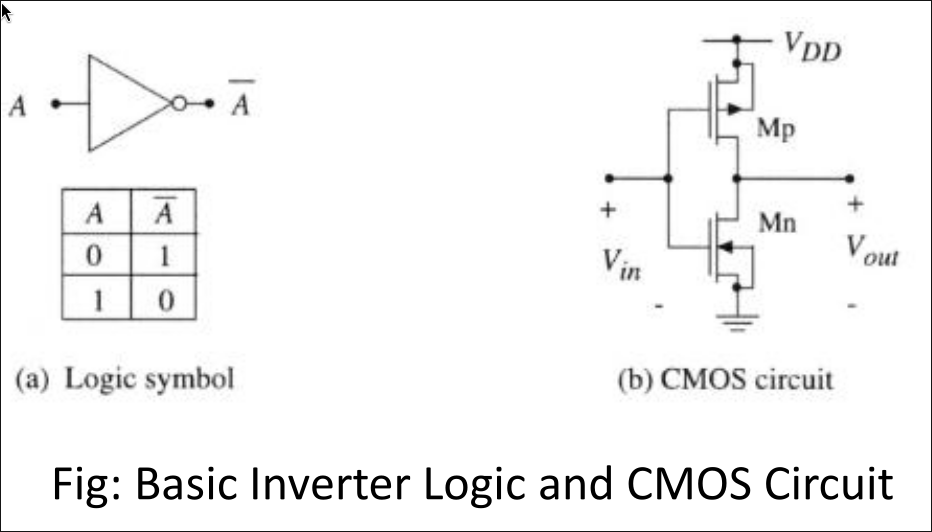

## D.2. CMOS Working Principle

- Both **N-type** and **P-type** MOSFETs are used together to implement logic functions.
- The defining characteristic of CMOS: **the same input signal that turns ON a transistor of one type simultaneously turns OFF the transistor of the other type.**
- This complementary switching behavior is what allows CMOS logic gates to be built from **simple switches alone**, with **no need for a separate pull-up resistor** (unlike NMOS-only logic, which requires a pull-up device that draws current even in steady state — see A.5).

## D.3. CMOS Characteristics

- **Low static power dissipation, high noise immunity.**
    - In steady state, for any valid logic input, **one of the two series-connected transistors (NMOS/PMOS) is always OFF**, meaning essentially no DC current path exists from VDD to ground — this is the fundamental reason CMOS static power is so low.
    - Meaningful power is drawn only **during switching** (charging/discharging capacitive loads) and from a small **short-circuit current** that briefly flows while both transistors are partially ON during a transition — see the AC/dynamic analysis in Section E.4.
- **Does not generate significant waste heat**, as compared to other logic families like **TTL or NMOS logic**, which typically draw some **standing (static) current** even when not actively switching state.
- These characteristics enable **integrating logic functions at very high density** on an integrated circuit — because static power per gate is so low, vastly more gates can be packed onto a chip within a fixed total power budget. This is the central reason **CMOS has become the dominant technology used in VLSI chips.**
- The term **"MOS"** refers to the physical structure of a MOSFET: an electrode forming a **metal gate**, positioned on top of an **oxide insulator**, which sits on the **semiconductor** substrate.
    - Historically, the gate material was a metal such as **aluminum**; for several decades the industry instead used **polysilicon** gates (more compatible with high-temperature CMOS process steps).
    - With the introduction of **high-k dielectric materials** in advanced process nodes, true **metal gates made a comeback**, replacing polysilicon in modern high-performance CMOS processes (the "high-k metal gate," or HKMG, transition).

## D.4. Advantages of CMOS

- Operates from a **single power supply** (VDD).
- **Simple gate structures.**
- **High input impedance** — CMOS gate inputs draw negligible DC current, simplifying fan-out and driving requirements.
- **Low power consumption** when held in a static (non-switching) state.
- **Negligible static power dissipation** (see D.3).
- **High fan-out capability.**
- **TTL compatibility** (with appropriate level translation where needed).
- **Good temperature stability.**
- **Good noise immunity.**
- **Compact** circuit implementation relative to some alternative logic families.
- Generally **straightforward, well-supported design flow** (mature tools and cell libraries).
- **Mechanically robust.**
- **Large logic swing** — output voltage swings essentially rail-to-rail, from ~0 V to ~VDD, giving good noise margins (see Section E.3).

## D.5. Applications of CMOS

CMOS technology is used across the large majority of modern digital IC design, including:

- **Computer memories and CPUs**
- **Microprocessor design**
- **Flash memory chip design**
- **ASIC design** more broadly

## D.6. Disadvantages of CMOS

- **Cost increases** as the number of processing steps increases — though this can often be mitigated through process optimization and volume.
- **Packing density** is lower compared to NMOS-only logic (which needs only one transistor per logic input rather than a complementary pair).
- **Electrostatic discharge (ESD) sensitivity** — MOS chips must be protected from static-charge buildup (e.g., by shorting leads during handling); without protection, static discharge through the leads can damage the chip. This is generally addressed by including **on-chip ESD protection circuitry**.
- **Uses two transistors instead of one** to build a basic inverter (one NMOS + one PMOS, versus a single NMOS plus a passive/active load in NMOS-only logic) — meaning CMOS logic gates generally consume **more silicon area** per gate than the NMOS-only equivalent, for the density benefit traded away against much lower static power.

## D.7. NMOS Transistor — Working Principle

- When a **positive voltage** (logic HIGH) is applied to the **gate terminal**, relative to the source, of an NMOS transistor:
    - It creates an **electric field** that **attracts electrons** toward the interface between the gate oxide and the semiconductor substrate, forming a conductive n-type channel.
    - Once the gate-source voltage exceeds the **threshold voltage** \(V_{th}\), the **N-channel MOSFET turns ON**, allowing current to flow between drain and source.

## D.8. PMOS Transistor — Working Principle

- When a **negative voltage** (logic LOW), relative to the source, is applied to the **gate terminal** of a PMOS transistor:
    - It creates an **electric field** that **repels holes** away from the gate-oxide/substrate interface, forming a conductive p-type channel.
    - Once the gate-source voltage is more negative than (i.e., the source-gate voltage exceeds) the threshold \(V_{th}\), the **P-channel MOSFET turns ON**.
- In a CMOS inverter, the complementary switching behavior of NMOS and PMOS (D.2, D.7, D.8) is exactly what produces correct inverting logic — see Section E.

---

# E. Design and Analysis of the CMOS Inverter

> **Focus topics 4 & 5 — Detail CMOS inverter design and its analysis / Create and explain a CMOS inverter**

## E.1. Circuit Structure

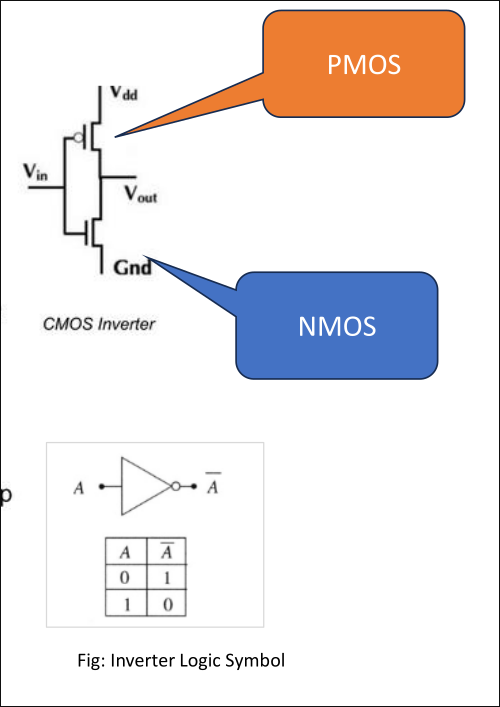

- The CMOS inverter is the **simplest and most fundamental CMOS logic gate**, and serves as the building block for understanding every other CMOS gate.
- The circuit consists of **one PMOS and one NMOS transistor**, connected as follows:
    - Both transistor **gates are tied together** and driven by the single input, **A**.
    - The **PMOS transistor** is connected between **VDD** (supply) and the output node — it acts as the **pull-up** device.
    - The **NMOS transistor** is connected between the output node and **VSS/ground** — it acts as the **pull-down** device.
    - The shared drain connection of both transistors is the circuit's **output, Y**.

## E.2. Working (Switching Behavior)

- **When A is HIGH (≈ VDD)**:
    - The **PMOS** transistor's gate-source voltage is such that it is turned **OFF** (behaves as an open circuit).
    - The **NMOS** transistor is turned **ON**.
    - The output node is pulled down through the ON NMOS to **VSS (ground)** → **Y = LOW (0)**.
- **When A is LOW (≈ 0 V)**:
    - The **NMOS** transistor is turned **OFF**.
    - The **PMOS** transistor is turned **ON**.
    - The output node is pulled up through the ON PMOS to **VDD** → **Y = HIGH (VDD)**.
- In **both** valid steady-state cases, exactly **one** of the two transistors is ON and the other is OFF — this is precisely the complementary-switching property described in Section D.2/D.3, and it is why the CMOS inverter draws negligible static current in either steady state.

**Truth Table**:

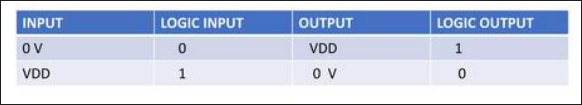

| A (Input)       | Y (Output)      |
| --------------- | --------------- |
| 0 (LOW)         | 1 (HIGH, ≈ VDD) |
| 1 (HIGH, ≈ VDD) | 0 (LOW)         |

## E.3. DC (Static) Analysis — Voltage Transfer Characteristic (VTC)

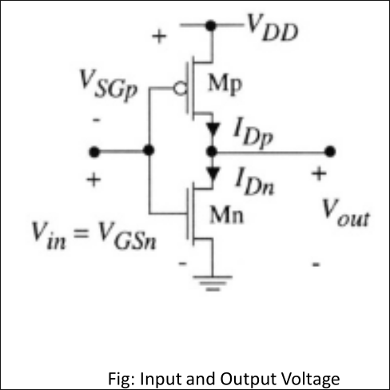

- **DC analysis** answers the question: "given a _constant_ input voltage \(V_{in}\), what is the resulting _constant_ output voltage \(V_{out}\)?" — i.e., it characterizes the inverter's steady-state behavior, ignoring switching transients (which are instead covered by AC analysis, Section E.4).
- **At the extremes**:
    - When \(V_{in} = 0\) → NMOS OFF, PMOS ON → \(V_{out} = V_{DD}\).
    - When \(V_{in} = V_{DD}\) → NMOS ON, PMOS OFF → \(V_{out} = 0\).
- **In between** these extremes, both transistors can be partially or fully ON simultaneously, and \(V_{out}\) depends on the actual transistor currents, not just their ON/OFF state.
- By **Kirchhoff's Current Law (KCL)**, since the NMOS and PMOS are in series between VDD and ground, the same current must flow through both — so at every point on the DC transfer curve, the circuit must settle such that:
  $$I_{DSn} = |I_{DSp}|$$
    - Setting the NMOS drain current expression equal to the magnitude of the PMOS drain current expression (using the standard MOSFET current equations for whichever region — cutoff, linear/triode, or saturation — each transistor is operating in at that particular \(V_{in}\)) gives the equations that can be solved analytically for \(V_{out}\) as a function of \(V_{in}\).
    - A **graphical solution** — plotting \(I_{DSn}\) vs. \(V_{out}\) and \(I_{DSp}\) vs. \(V_{out}\) (transformed onto the same axes) for a given \(V_{in}\), and finding their intersection — gives excellent intuition for how the operating point moves as \(V_{in}\) sweeps from 0 to VDD, even without working through the full algebra.

### Voltage Transfer Characteristics (VTC)

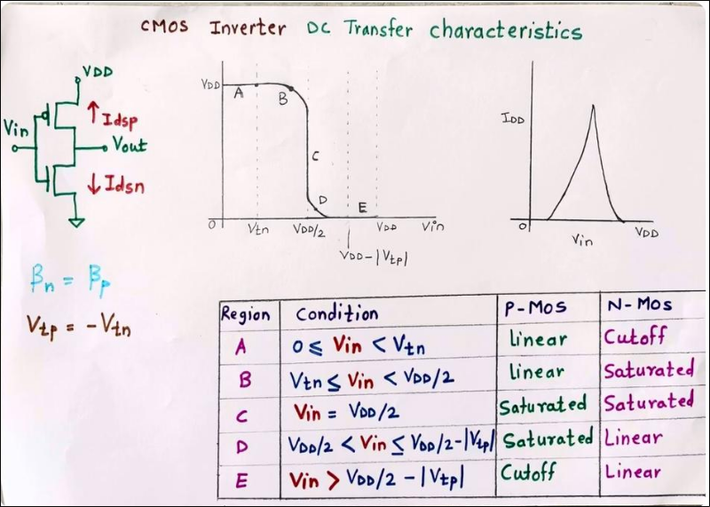

- The **Voltage Transfer Characteristic (VTC)** is exactly this DC transfer curve — \(V_{out}\) plotted against \(V_{in}\) — for the CMOS inverter (or any logic gate).
- The VTC is commonly divided into **five distinct regions**, based on which region (cutoff, linear/triode, or saturation) each transistor is operating in as \(V_{in}\) sweeps from 0 to VDD:
    1. **Region A** (\(V_{in}\) near 0): NMOS is in **cutoff** (OFF), PMOS is in the **linear/triode** region → output is pulled fully to \(V_{out} = V_{DD}\).
    2. **Region B**: NMOS enters **saturation**, PMOS remains in the **linear** region → \(V_{out}\) begins to fall, but is still relatively high.
    3. **Region C** (around the midpoint): **Both** transistors are in **saturation** simultaneously — this is the steep, high-gain transition region where the output switches rapidly from HIGH to LOW for a small change in input.
    4. **Region D**: NMOS enters the **linear** region, PMOS is in **saturation** → \(V_{out}\) continues falling toward 0.
    5. **Region E** (\(V_{in}\) near VDD): NMOS is in the **linear** region, PMOS is in **cutoff** (OFF) → output is pulled fully to \(V_{out} = 0\).
- **Key VTC-derived design metrics**:
    - **\(V\_{OH}\)** — the nominal output HIGH voltage (ideally \(V_{DD}\)).
    - **\(V\_{OL}\)** — the nominal output LOW voltage (ideally 0 V).
    - **\(V\_{IL}\)** — the maximum input voltage still reliably interpreted as a logic LOW (defined as the input voltage where the VTC slope \(dV_{out}/dV_{in} = -1\), on the high-output side).
    - **\(V\_{IH}\)** — the minimum input voltage still reliably interpreted as a logic HIGH (the input voltage where the VTC slope \(dV_{out}/dV_{in} = -1\), on the low-output side).
    - **Switching threshold, \(V_M\)** — the point on the VTC where \(V_{out} = V_{in}\) (the curve crosses the unity line); at this exact point, both transistors are in saturation and, by design, \(I_{Dn} = I_{Dp}\). For a "balanced" inverter, sizing the PMOS wider than the NMOS (to compensate for hole mobility being lower than electron mobility) places \(V_M\) near \(V_{DD}/2\), giving symmetric noise margins and switching behavior.
    - **Noise Margins** — quantify how much noise/voltage error the inverter's input can tolerate before the output is affected:
        - $$NM_H = V_{OH} - V_{IH}$$ (high-side noise margin)
        - $$NM_L = V_{IL} - V_{OL}$$ (low-side noise margin)
        - Larger noise margins mean better **noise immunity** — a key reason (alongside low static power) that CMOS is favored for dense, robust digital design.
    - **Voltage gain** in the transition region (the maximum magnitude of \(dV_{out}/dV_{in}\)) — a steeper transition (higher gain) means a sharper, more well-defined switching point and better signal regeneration between cascaded stages.

## E.4. AC (Dynamic / Transient / Switching) Analysis

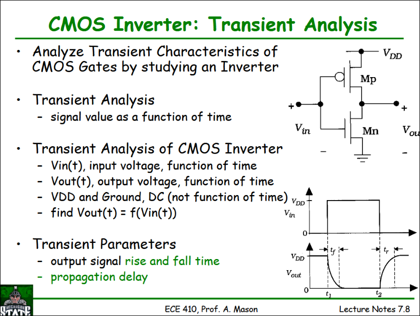

- **DC analysis** (Section E.3) tells us \(V_{out}\) for a **constant** \(V_{in}\).
- **AC analysis** tells us \(V_{out}(t)\) given a **time-varying** \(V_{in}(t)\) — this generally requires solving differential equations describing how the output node's parasitic/load capacitance charges and discharges through the transistors' time-varying resistance.
- The input is usually modeled as a **step** or a **ramp** transitioning between 0 and \(V_{DD}\) (or vice versa), approximating a realistic logic transition.
- **AC analysis** is also referred to, interchangeably, as **transient analysis**, **switching analysis**, or **dynamic analysis** — all describing the same underlying study of time-domain switching behavior.
- The **switching characteristic** — \(V_{out}(t)\) given \(V_{in}(t)\) — of a logic gate directly determines **how fast the gate can operate**, i.e., its maximum usable clock frequency in a larger design.
- The **switching speed** of a gate is fundamentally measured by the **time required to charge and discharge its capacitive load** — every gate output drives some combination of the next stage's gate capacitance and the interconnect (wire) capacitance, and the RC-like charge/discharge time of that load, through the driving transistor's ON resistance, sets the propagation delay.
    - Two standard delay metrics: **\(t\_{PHL}\)** (propagation delay for a HIGH-to-LOW output transition, measured between the 50% points of input and output) and **\(t\_{PLH}\)** (propagation delay for a LOW-to-HIGH output transition).
    - **Short-circuit power**: during the brief period of a transition when \(V_{in}\) is near the switching region (Region C of the VTC, Section E.3), **both** NMOS and PMOS can be simultaneously partially ON, creating a brief direct current path from VDD to ground — this "short-circuit current" is a real (though typically smaller than switching/dynamic) component of total CMOS power consumption, distinct from the capacitive charge/discharge power.

### Critical Paths

- A **timing analyzer** automatically identifies the **slowest path** (the "critical path") through a logic design — the path whose accumulated propagation delay is largest, and which therefore limits the maximum clock frequency of the whole design.
- Critical-path delay can be affected by decisions made at **several different levels** of the design flow, reinforcing why timing must be considered throughout — not just at one stage:
    - **Architecture / micro-architecture level** — how many logic levels are on a given path, pipelining decisions (see Chapter 4, Section C).
    - **Logic level** — the specific Boolean structure/gate implementation chosen.
    - **Circuit level** — transistor sizing, drive strength, and the specific circuit topology used for each gate.
    - **Layout level** — physical placement and routing, which determine actual wire length/capacitance and therefore real-world delay (this is exactly why post-layout gate-level simulation, Section C.3, is needed for final timing sign-off — pre-layout estimates can't capture actual wire parasitics).

---

# F. Analog/Mixed-Signal VLSI Design Concepts

## F.1. What is Mixed-Signal Design?

- A **mixed-signal** VLSI design refers to the integration of **both analog and digital circuit components** on a **single integrated circuit chip**.
- In a mixed-signal design, the analog and digital sections are **designed and implemented together**, enabling efficient data conversion, processing, and communication **between** the two domains on-chip (rather than requiring separate analog and digital chips connected at the board level).
- **Examples of mixed-signal VLSI applications**: mobile smartphone SoCs, DSP chips, ADCs, and DACs.

## F.2. Key Aspects of Mixed-Signal Design

- **Analog circuitry**: typically includes components like **amplifiers, filters, ADCs, DACs**, and other analog signal-processing circuits.
- **Digital circuitry**: includes **logic gates, memory elements, microprocessors**, and other digital signal-processing components.
- **Integration**: the analog and digital circuits are integrated onto a **single VLSI chip**, enabling efficient data transfer and control between the two domains without the latency, power, and board-space cost of chip-to-chip communication.
- **Challenges**: designing a mixed-signal VLSI circuit requires careful attention to:
    - **Noise isolation** — preventing digital switching noise from corrupting sensitive analog signals (a major practical challenge, often addressed with careful floorplanning, guard rings, and separate power domains).
    - **Power supply management** — often requiring separate, carefully filtered analog and digital supply rails.
    - **Layout techniques** — specific analog-aware layout practices (matching, shielding, symmetry) that differ substantially from pure digital layout.
    - **EMI (electromagnetic interference)** — ensuring the integrity of both analog and digital signals in the presence of electromagnetic coupling.
- **Applications**: communication systems, sensor interfaces, power-management circuits, and data-acquisition systems — essentially anywhere both analog signal conditioning and digital signal processing are required together.
- **Benefits of integration**: combining analog and digital components on a single chip provides **reduced size, power consumption, and cost**, along with **improved performance and reliability**, compared to a multi-chip solution.

---

## Summary — Answering the Focus Questions

1. **VLSI design flow**: an eight-stage front-end-to-back-end process — system specification → architectural design → functional/behavioral design → logic design → circuit design → physical design (floorplan/place/route/DRC-LVS-ERC) → fabrication/tape-out → packaging & test (Section B).
2. **Verification methodologies**: simulation (behavioral/RTL/gate/switch/transistor-level), emulation, formal methods (equivalence checking, model checking), and semiformal/assertion-based methods, implemented in practice using SystemVerilog/UVM, VHDL, e/Specman, and scripting languages, alongside static/dynamic timing analysis (Section C).
3. **CMOS circuit design**: the complementary-switching principle where NMOS and PMOS devices are driven by the same signal but always in opposite ON/OFF states, giving CMOS its signature low static power, high noise immunity, and high density (Section D).
   4–5. **CMOS inverter design and analysis**: one PMOS pull-up + one NMOS pull-down sharing a gate input and drain output, analyzed via its DC Voltage Transfer Characteristic (five VTC regions, \(V_{OH}/V_{OL}/V_{IH}/V_{IL}\), switching threshold \(V_M\), noise margins) and its AC/transient switching behavior (propagation delay, capacitive charge/discharge time, short-circuit power, and critical-path timing) (Section E).
