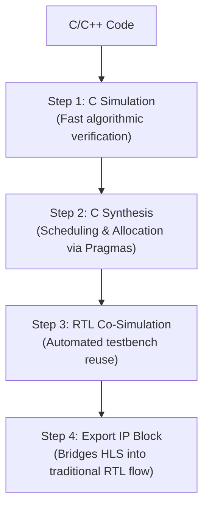

# Embedded Design Overview

- Embedded design on an FPGA refers to
    - the building of a complete hardware/software system where custom digital logic 
    - implemented in the FPGA fabric
    - works along side or in place of
    - a general purpose processor
    - to perform a specific task
    - like, signal processing, control, acceleration, etc.
- Two fundamentally different methodologies
    - exist for describing and implementing the hardware logic portion of such system.
    - **RTL** (Register Transfer Level) flow
    - and newer **HLS** (High-Level Synthesis) flow
- Why RTL came first
    - Early hardware design had no alternative
    - every register, every clock-cycle-by-clock-cycle data movement, and every control decision
    - had to be explicitly specified by the designing
    - using a HDL, such as Verilog or VHDL.
    - This gives complete, fine-grained control over the resulting hardware.
    - But the method was slow and labor-intensive.
- Why HLS was formed
    - As FPGA designs grew larger and more algorithm-heavy
        - like DSP pipeline, ML accelerators, complex control systems
    - hand coding every register transfer became impractical.
    - HLS was developed to let a designer describe what the hardware should compute,
        - using a high-level sequential language (C/C++)
    - while a compiler automatically determines how to build the actual clocked hardware structure
        - like scheduling operations into clock cycles, allocating physical resources like multipliers/adders.
- Main difference:
    - RTL requires designer to manually make every microarchitectural decision at every step
    - HLS automates microarchitectural decision-making itself (scheduling/allocation)
    - leaving the design to guide the compiler only through high-level optimization directives (pragmas)
- Both methodologies ultimately achieve the same goal:
    - a working, synthesizable hardware design on the FPGA fabric
    - but trade off abstraction level, design effort and fine-grained control differently.

# RTL Methodology

Approach
- Is bottom-up
- designer explicitly defines how data moves between hardware registers
- how it is transformed by combinational logic during specific clock cycles.

## Step 0: Requirement Analysis

- The goals of the system are drawn.
- Each part, that will be dedicated for the system, is carefully thought for
- And an algorithm is made for each subsystem/module.

## Step 1: Architectural Specification and Microarchitecture Design

- The high-level algorithm is translated into a hardware architecture block diagram.
- The designer explicitly
    - defines the datapath and a Control Unit
        - datapath: like registers, ALUs, multipliers
        - Control Unit: like FSM
    - to orchostrate operations across clock cycles.
- Example
    - for the algorithm $Y = (A\times B) + C$, the microarchitecture is specified as:
    - Read inputs $A$ and $B$ into Stage-1 registers.
    - In cycle-1, feed them into a hardware multiplier and store the product in an intermediate register.
    - In cycle-2 feed the product and $C$ into an adder, saving the result to output register $Y$.

## Step 2: RTL Coding (HDL Modeling)

- The microarchitecture decided in Step 1 is coded using a HDL, like Verilog, SystemVerilog, or VHDL.
- The code must be strictly synthesizable,
    - meaning, it maps directly to physical FPGA primitives (flip-flops, LUTs, mutliplexers)
- Example:

```systemverilog
always_ff @(positive clk) begin
    prod_reg <= A * B;          // hardware multiplier inferred
    Y        <= prod_reg + C;   // hardware adder inferred
end
```

## Step 3: Functional Verification (Behavioral Simulation)

- The RTL code is simulated inside a software testbench environment,
    - to verify the logic matches design intent
    - before any physical hardware is generated
- This stage is completely removed from clock speed or target hardware delays
    - i.e. it is a zero-delay simulation
    - that only checks for logical correctness.
- Example:
    - testbench that injects values for A, B, C every clock cycle
    - and checks whether the output Y matches (A * B) + C

```systemverilog
always #5 clk = ~clk;   // 10 ns clock period

initial begin
    repeat (20) begin
        @(posedge clk);
        A = $random; B = $random; C = $random;
        @(posedge clk); // wait for prod_reg to calculate A * B
        @(posedge clk); // wait for Y to calculate prod_reg + C
        expected_Y = (A * B) + C;
        if (Y !== expected_Y)
            $display("MISMATCH");
        else
            $display("PASS");
    end
    $finish;
end
```

## Step 4: Logic Synthesis

- A synthesis tool (e.g., AMD Vivado Synthesis) parses the abstract HDL code and translates it into a technology-mapped gate-level netlist.
- The tool converts logic expressions into physical FPGA resources,
    - like LUTs, flip-flops, dedicated DSP blocks,
    - based on user constraints such as the target clock frequency.
- Example
    - the synthesis tool replaces `*` (multiply) operator in the RTL code with an actual **DSP48 block** inside the FPGA fabric,
    - and connects it into the clock network.

## Step 5: Implementation (Place & Route and Timing Closure)

- Placement: decides which specific physical LUTs and registers on the silicon die will host the design.
- Routing: connects theh physical wires between the placed components.
- The tool then performs **Static Time Analysis**,
    - calculating propagation delays to ensure every signal arrives at its destination register before the next active clock edge
    - this is called achieving **timing closure**.

# HLS Design Methodology

Approach
- Top-down
- algorithmic methodology
- the designer describes what the system should do using a high-level sequential language
- and compiler automatically determines how to build the hardware.



## Step 0: Requirement Analysis

- The goals of the system are drawn.
- The system is carefully broken down into subsystem/module. 
- And an algorithm is made for each subsystem/module.

## Step 1: Algorithmic Modeling and C simulation

- The algorithm is written as pure, sequential code (C/C++)
    - no hardware timing or clock-cycle concepts are involved at this stage.
- This code runs natively on the host CPU, making functional debugging dramatically faster than in a traditional HDL simulator.
- Example

```cpp
void compute_vector(int A[100], int B[100], int Y[100]) {
    for (int i = 0; i < 100; i++) {
        Y[i] = A[i] * B[i];
    }
}
```

## Step 2: High-Level Synthesis (Scheduling & Allocation)

- The HLS compiler translates the untimed sequential code into timed RTL hahrdware, guided by optimization directives (**pragmas**)
- Two core theoretical operations govern this translation:
    - **Scheduling**: decides in which clock cycle each operation will occur.
    - **Allocation**: decicdes how many physical hardware components (multipliers, adders, BRAM memory ports) to assign to the computation.
- Example:
    - without any praga, the loop above runs sequentially
    - 100 iterations, each incurring its own per-iteration delay.
    - Adding, `#pragma HLS UNROLL factor=2` causes the compiler to
    - **allocate two physical multipliers**, processing two array elements simultaneously
    - halving execution time at the cost of doubling the hardware area used

## Step 3: RTL Co-Simulation

- The HLS compiler automatically wraps the **original C-testbench** around the newly generated RTL hardware.
- This automatically-reused testbench data into the hardware's ports, verifying that the optimized, parallelized hardware behaves **exactly** like the original sequential C code.
- Example
    - confirming that loop unrolling or pipelining did not introudce a race condition or a memory read collision that would corrupt the output array
    - potential risk once operations are pipelined (i.e. executing concurrently)

## Step 4: IP Generation & Integration

- The verified design is packaged into a standard **Intellectual property (IP) block**, exposed through standardized bus interfaces (most commonly **AXI4**).
- This abstraction allows the HLS-generated hardware core to be imported directly in to an embedded processor system as a **hardware accelerator**, connecting it into the broader SoC/MPSoC design using the same AXI-based interconnect.

# 6.5 Mapping Both Flows onto AMD Xilinx Tools


| Design Stage | RTL Flow Tool (AMD Xilinx) | HLS Flow Tool (AMD Xilinx) |
|---|---|---|
| Coding / algorithm entry | Vivado (RTL source editor, Verilog/VHDL) | Vitis HLS (C/C++ source editor) |
| Functional verification | Vivado Simulator (XSIM): behavioral HDL simulation | Vitis HLS C Simulation: native C-level simulation |
| Synthesis | Vivado Synthesis: HDL to gate-level netlist | Vitis HLS C Synthesis: C/C++ to RTL, using pragmas for scheduling/allocation |
| Co-simulation / RTL-level check | (Implicit: same RTL simulated post-synthesis) | Vitis HLS RTL Co-Simulation: auto-wraps the C testbench around generated RTL |
| Packaging for reuse | Manual IP packaging via Vivado IP Packager | Automated IP export (AXI4-wrapped) from Vitis HLS |
| Implementation (Place & Route, timing) | Vivado Implementation: placement, routing, Static Timing Analysis | Same Vivado Implementation flow, once the HLS-exported IP is integrated into a Vivado block design |
| Final integration into SoC/MPSoC system | Vivado IP Integrator (block design, AXI interconnect) | Vivado IP Integrator (block design, AXI interconnect): identical integration step for both flows once IP is generated |

