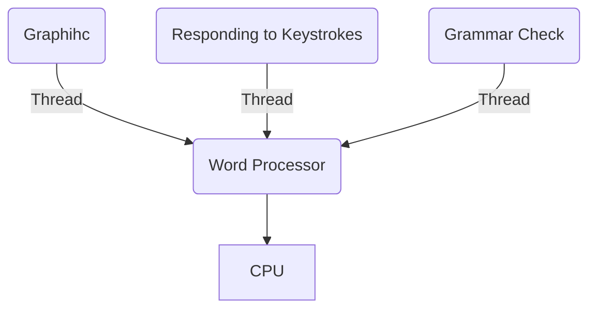
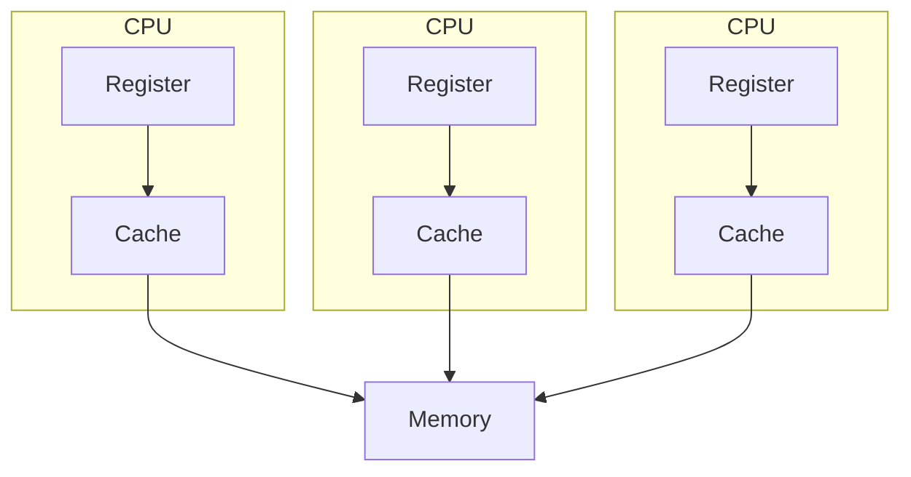

# Multi-processing and Multi-threading

## Multi-threading

- is a systm in which multiple threads are created of a process for increasing the computing speed of a system.
- in multithreading, many threads of a process are executed simultaneously.

General representation of multithreading in OS



## Multi-processing

- multiprocessing is a system that has more than one or two processors.
- in multiprocessing, CPUs are added for increasing computing speed of teh system.
- because of multiprocessing, there are many processes thaht are executed simultaneously.
- can be classified into two categories
    - symmetric multiprocessing
    - asymmetric multiprocessing.

General representation of Multi-processing in OS



## Differences

| Multiprocessing | Multithreading |
| - | - |
| CPUs are added for increasing computing power | Many threads are created of a single process for increasing computing power |
| In Multiprocessing, Many processes are executed simultaneously | While in multithreading, many threads of a process are executed simultaneously |
| Multiprocessing are classified into Symmetric and Asymmetric | Multithreading is not classified in any categories |
| Process creation is a time-consuming process | Thread creation is not time-consuming |
| Every process owns separate address space | common address space for all threads. |

# Coding

## 1. Create an embedded C application targeting to Xilinx Zynq PS for two AXI GPIO IP with 8bit LED and 8bit Switch connected with it. Read the switch value and write that to LED port. [6] (81 Bh, Md1)

note:
- 2 AXI GPIO
- 8 bit LED
- 8 bit Switch
- read from switch -> write to led

```c
#include "xgpio.h"
#include "xparameters.h"

int main(void) {
    XGpio sw, led;
    int sw_val;

    XGpio_Initialize(&sw, XPAR_AXI_GPIO_0_BASEADDR);
    XGpio_SetDataDirection(&sw, 1, 0xFFFFFFFF);

    XGpio_Initialize(&led, XPAR_AXI_GPIO_1_BASEADDR);
    XGpio_SetDataDirection(&led, 2, 0x00000000);

    while (1) {
        sw_val = XGpio_DiscreteRead(&sw, 1) & 0xFF;
        XGpio_DiscreteWrite(&led, 2, sw_val);

        sleep(1);
    }
}
```

## 2. Create an embedded C application targeting to Zynq FPGA Board with Xilinx PS and one AXI GPIO IP (5-bit LED) connected with it and blink that LED in interval of 10 second. [6] (82 Bh)

note:
- 1 AXI GPIO
- 5 bit led
- blink led in 10 seconds: i'm taking it to mean 10 s ON, 10 s OFF

```c
#include "xgpio.h"
#include "xparameters.h"

int main(void) {
    XGpio led;

    XGpio_Initialize(&led, XPAR_AXI_GPIO_0_BASEADDR);
    XGpio_SetDataDirection(&led, 2, 0x00000000);

    while (1) {
        XGpio_DiscreteWrite(&led, 2, 0x1F); // 5 bit: 0001 1111
        sleep(10);
        XGpio_DiscreteWrite(&led, 2, 0x00);
        sleep(10);
    }
}
```

## 3. Create an embedded C application targeting to Zynq FPGA Board with Xilinx PS and one AXI GPIO IP (4-bit LED) connected with it and blink that LED in interval of 10 second. [6] (Md2)

note:
- 1 AXI GPIO
- 4 bit led
- led blinking at 10s interval

```c
#include "xgpio.h"
#include "xparameters.h"

int main(void) {
    XGpio led;

    XGpio_Initialize(&led, XPAR_AXI_GPIO_0_BASEADDR);
    XGpio_SetDataDirection(&led, 2, 0x00000000);

    while (1) {
        XGpio_DiscreteWrite(&led, 2, 0x0F); // 4 bit: 0000 1111
        sleep(10);
        XGpio_DiscreteWrite(&led, 2, 0x00);
        sleep(10);
    }
}
```

## Code from Lab Session

```c
#include "xgpio.h"
#include "xparameters.h"

int main(void) {
  XGpio led, push;
  int psb_check;
  xil_printf("-- Start of the Program --\r\n");

  XGpio_Initialize(&push, XPAR_AXI_GPIO_0_BASEADDR);
  XGpio_SetDataDirection(&push, 1, 0xffffffff);

  XGpio_Initialize(&led, XPAR_AXI_GPIO_0_BASEADDR);
  XGpio_SetDataDirection(&led, 2, 0x00000000);

  while (1) {
    psb_check = XGpio_DiscreteRead(&push, 1);
    xil_printf("Push Button Status %x\r\n", psb_check);
    XGpio_DiscreteWrite(&led, 2, psb_check);
    xil_printf("LED Status %x\r\n", psb_check);
    sleep(1);
  }
}
```

