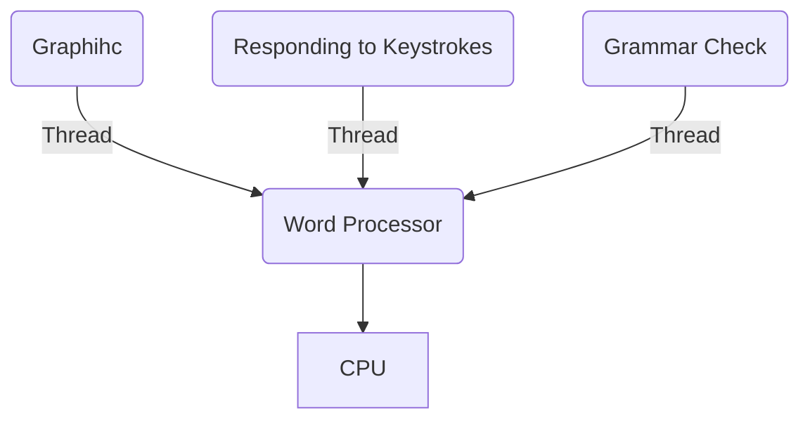
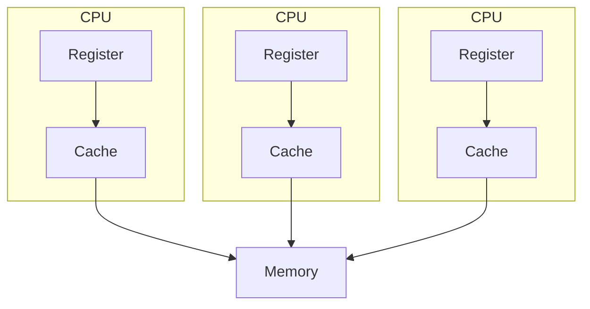

# Multi-processing and Multi-threading

## Multi-threading

- is a systm in which multiple threads are created of a process for increasing the computing speed of a system.
- in multithreading, many threads of a process are executed simultaneously.

General representation of multithreading in OS

## Multi-processing

- multiprocessing is a system that has more than one or two processors.
- in multiprocessing, CPUs are added for increasing computing speed of teh system.
- because of multiprocessing, there are many processes thaht are executed simultaneously.
- can be classified into two categories
    - symmetric multiprocessing
    - asymmetric multiprocessing.

General representation of Multi-processing in OS

## Differences

| Multiprocessing | Multithreading |
| - | - |
| CPUs are added for increasing computing power | Many threads are created of a single process for increasing computing power |
| In Multiprocessing, Many processes are executed simultaneously | While in multithreading, many threads of a process are executed simultaneously |
| Multiprocessing are classified into Symmetric and Asymmetric | Multithreading is not classified in any categories |
| Process creation is a time-consuming process | Thread creation is not time-consuming |
| Every process owns separate address space | common address space for all threads. |

