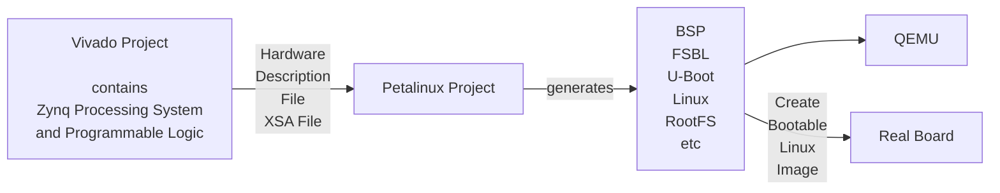

# 1. Explain about different operating system flow for SoC and MPSoC FPGA. [2] (81 Bh) [4] (Md1)

Different operating system flows for SoC/MPSoC FPGA

## SoC/MPSoC FPGA structure:

- A SoC/MPSoC has a Processing System (PS) with CPU cores and Programmable Logic (PL).
- The OS normally runs on the PS.
- In MPSoC, the APU can run Linux, while the RPU can run FreeRTOS or bare-metal.

## Bare-metal / standalone flow:

- No OS.
- The application directly uses low-level drivers.
- It gives the best deterministic behavior, fastest interrupt response, and minimal complexity, but lacks advanced features like networking, USB, and file system.
- Flow: Vivado → XSA → Vitis/SDK standalone BSP → application → ELF/boot.bin.

## RTOS flow (FreeRTOS/Zephyr):

- Small, priority-preemptive, deterministic OS.
- It supports multitasking and predictable response time.
- The BSP extends the standalone BSP by adding the RTOS runtime, and optional file system/network stacks.
- Flow: Vivado → XSA → Vitis/SDK → FreeRTOS BSP → FreeRTOS application → ELF/boot.bin.

## Embedded Linux flow (PetaLinux/Yocto):

- Full-featured OS with MMU, networking, USB, file system, and standard interfaces.
- It has high complexity and is not hard real-time.
- Flow: Vivado → XSA → PetaLinux project → BSP (FSBL, U-Boot, Linux kernel, RootFS) → bootable Linux image → QEMU or real board.

## MPSoC heterogeneous flow:

- Linux can run on APU for rich OS services,
- FreeRTOS/bare-metal on RPU for real-time control, and
- PL for hardware acceleration.
- Communication is done via OpenAMP/IPI. Thus, different OS flows can coexist in one MPSoC design.

# 2. Explain about FreeRTOS and linux based design flow for SoC/MPSoC FPGA. [2] (Md2) [4] (82 Bh)

## FreeRTOS design flow:

1. Design hardware in Vivado and export the hardware description as an XSA file.
2. In Vitis/SDK, generate the platform from XSA.
3. Generate the FreeRTOS BSP, which includes standalone low-level drivers plus the FreeRTOS kernel and selected libraries.
4. Develop the application using the FreeRTOS API and peripheral drivers.
5. Build the application into an ELF or boot.bin file.
6. Program the device via JTAG or boot file programming.
    - FreeRTOS typically runs on RPU, MicroBlaze, or Cortex-A cores for real-time tasks.

## Linux design flow:

1. Create a Vivado project containing the Zynq/MPSoC PS and PL, then export the XSA hardware description file.
2. Create a PetaLinux project and import the XSA.
3. PetaLinux generates the BSP components: FSBL, U-Boot, Linux kernel, device tree, RootFS, etc.
4. Optionally test the generated system using QEMU.
5. Build a bootable Linux image for the real board.
6. Program the board via SD, QSPI, or JTAG and boot Linux.
    - User applications run typically on the APU
    - PL accelerators are accessed through Linux drivers, UIO, or OpenAMP if an RPU is also used.

