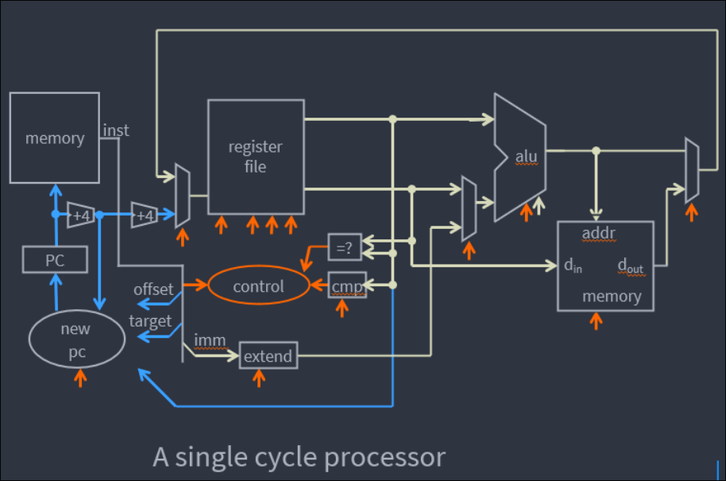
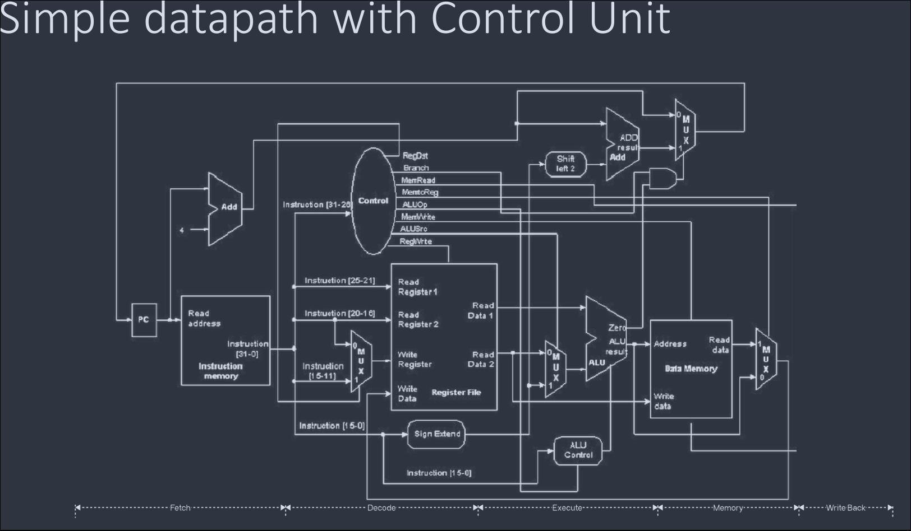
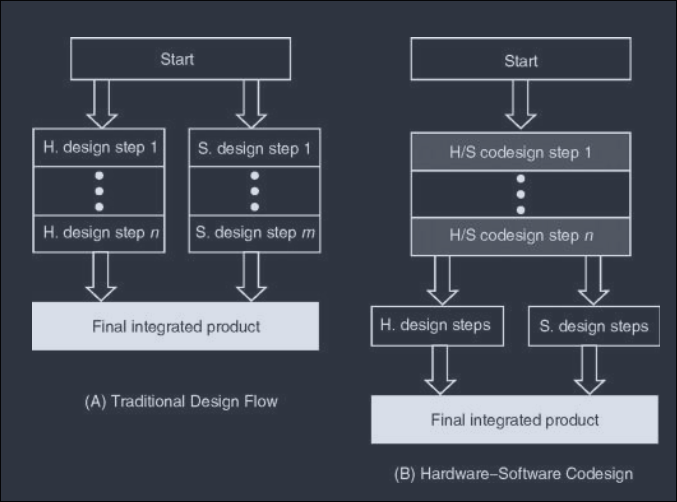
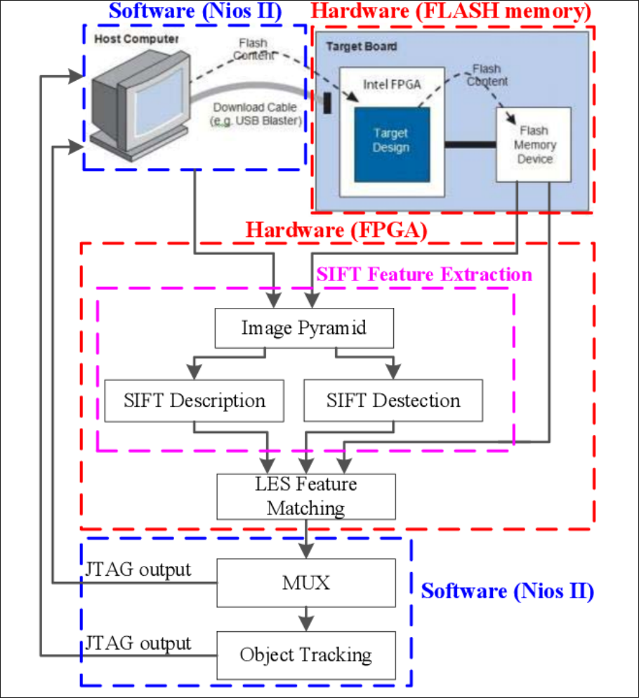

# 32-bit RISC-V (ISA) Processor Architecture : [4 Marks]

## Basic idea

- **RISC-V** = open-source **Reduced Instruction Set Computing** ISA.
- Originated in **2010 at UC Berkeley**; user-level ISA v2.0 fixed in 2014.
- Completely open, free for academia and industry; not patent-protected like most ISAs.
- Suitable for **direct native hardware implementation** in ASIC/FPGA, not just simulation.
- Avoids “over-architecting” for one microarchitecture style; can be implemented efficiently in many technologies.

## 32-bit base architecture: RV32I

- **RV32I** = base 32-bit integer ISA.
- Contains about **47 instructions**.
- Uses **32-bit address space**.
- Has **32 general-purpose registers** (`x0`–`x31`); `x0` is hardwired to zero.
- **Load-store architecture**: only load/store instructions access memory; ALU operations are register-to-register.
- **Fixed 32-bit instruction length** in base ISA. The `C` extension adds 16-bit compressed instructions.
- Simple, standardized instructions; limited addressing modes.
- No microcode; one layer of instructions.

## Instruction formats

RV32I instructions are grouped into six types:
- **R-type**: register-register operations
- **I-type**: short immediates and loads
- **S-type**: stores
- **B-type**: conditional branches
- **U-type**: long immediates
- **J-type**: unconditional jumps

## Processor datapath / architecture

A simple RISC-V processor contains:
- **PC** : program counter
- **Instruction memory** : fetches instruction
- **Register file** : 32 registers
- **Immediate generator** : extracts immediate values
- **ALU** : arithmetic/logic operations
- **Data memory** : load/store data
- **Control unit** : generates control signals

**Single-cycle datapath** performs:
1. Fetch
2. Decode
3. Execute
4. Memory access
5. Write-back

It can also be pipelined, multicore, or extended for OS support.

*Figure: Single-cycle RISC-V processor datapath.*

*Figure: Datapath with control unit.*

## Design flow in Verilog

1. Select RISC-V ISA subset.
2. Design datapath and control unit.
3. Implement in Verilog RTL.
4. Simulate and verify.
5. Synthesize/implement on FPGA or ASIC.
6. Run software/toolchain on it.

## OS support

Linux, FreeBSD, and Zephyr RTOS support RISC-V.

---
# RISC-V Extensions : [1-2 Marks]

RISC-V has a **small base ISA + optional extensions**.  
Naming convention uses an exact order:

`RV[32, 64, 128]` followed by extension letters in order:  
`I, M, A, F, D, G, Q, L, C, B, J, T, P, V, N`

Example: `RV32IMAFDQC` is legal, but `RV32IMAFDCQ` is not.

## Base ISA variants
| Base | Description |
|---|---|
| RV32E | 32-bit base ISA with 16 registers |
| RV32I | Base 32-bit ISA |
| RV64I | Base 64-bit ISA |
| RV128I | Base 128-bit ISA |

## Important extensions
| Extension | Meaning |
|---|---|
| **I** | Base integer instructions |
| **M** | Integer multiplication and division |
| **A** | Atomic instructions |
| **F** | Single-precision floating point (IEEE 754-2008) |
| **D** | Double-precision floating point |
| **Q** | Quad-precision floating point |
| **C** | Compressed 16-bit instructions; reduces code size by ~25–30% |
| **G** | Shorthand for IMAFD (general-purpose) |
| **V** | Vector operations |
| **H** | Hypervisor extension |
| **B** | Bit manipulation |
| **J** | Dynamically translated languages |
| **L** | Decimal floating point |
| **N** | User-level interrupts |
| **P** | Packed-SIMD instructions |
| **S** | Supervisor mode |
| **T** | Transactional memory |

## Examples
- **RV32I** : only basic 32-bit integer operations.
- **RV32GC** : general-purpose 32-bit with compressed instructions.
- **RV64IMACV** : intensive/parallel integer-only computing.
- **RV64GCV** : theoretically suitable for future personal computers.

## Why extensions matter
- Allow customized accelerators.
- Support embedded, OS kernel, hypervisor, multicore, and vector processing.
- Keep base ISA small while allowing application-specific customization.

---
# RISC vs CISC

| CISC | RISC |
|---|---|
| Complex, variable-length instructions | Simple, fixed-length instructions |
| Multi-cycle instructions | Mostly single-cycle |
| Hardware-centric | Software-centric |
| May use microcode | No microcode |
| Large number of instructions | Small number of instructions |
| Compound addressing modes | Limited addressing modes |
# Acceleration in FPGA : [1 Mark]

**Acceleration** means implementing a custom logic/algorithm in the FPGA **programmable logic (PL)** to achieve higher performance.

- Creates custom hardware/IP using RTL or HLS.
- Example: video processing module for segmentation/edge detection, or ML accelerator.
- Focus: **performance**.
- CPU is usually still involved.
- FPGA acts as a **hardware accelerator**.

---

# Hardware/Software Co-design in FPGA : [4 Marks]

## Definition

Hardware/software co-design is a flow used in **SoC/MPSoC FPGAs** where both a processor (PS) and programmable logic (PL) exist.

The processing task is **partitioned into hardware and software parts**, developed separately, and then integrated to get complete functionality.

## Key idea

- Some algorithm parts run on the **processor (software)**.
- Other parts run on the **FPGA fabric (hardware)**.
- Output of the processor block can be fed to the PL.
- Floating-point operations not implemented in PL can run on the processor; remaining processing happens in PL.

## Co-design flow

1. **Partitioning** : decide what goes to hardware and what to software.
2. **Hardware design** : RTL/HLS/IP for PL.
3. **Software design** : C/C++/OS application for PS.
4. **Interface design** : AXI, drivers, memory-mapped registers, interrupts, DMA.
5. **Integration** : combine hardware and software.
6. **Verification** : co-simulation and on-board testing.

### Expanded Flow (not necessary, but anyway)

1. **Partitioning**
   - Identify which parts of the algorithm are compute-heavy, parallel, or repetitive, these are good candidates for the PL.
   - Identify control-heavy, sequential, decision-making, or OS-dependent parts, these are better for the PS.
   - *Example:* In Sobel edge detection, the 3×3 convolution over every pixel is parallel and repetitive → PL. Frame capture control, threshold selection, and display logic → PS.
2. **Hardware design**
   - Implement the selected functions in RTL or HLS, using pipelining, parallelism, BRAM, and DSP blocks where needed.
   - Package the design as an IP with standard interfaces such as AXI-Lite, AXI-Stream, or AXI Master.
   - Verify testbenches and simulation before integration.
   - *Example:* Build a Sobel IP in HLS with line buffers, AXI-Stream video input/output, and a register for threshold value.
3. **Software design**
   - Develop the PS application in C/C++ using bare-metal, FreeRTOS, or Linux, depending on the system requirements.
   - Write code to configure hardware registers, start/stop accelerators, manage DMA transfers, and handle interrupts.
   - Use the BSP/drivers provided by the vendor so the software can talk to the PL IP correctly.
   - *Example:* A Linux user application captures a camera frame, programs the DMA, starts the Sobel IP, waits for an interrupt, and then reads the processed frame.
4. **Interface design**
   - Define how PS and PL communicate: AXI-Lite for control registers, AXI-Stream for streaming data, DMA for bulk data, and interrupts for events.
   - Match memory maps, address ranges, data widths, clock domains, and reset signals between hardware and software.
   - Decide whether data will be shared through DDR, BRAM, or streaming interfaces.
   - *Example:* AXI-Lite carries the Sobel threshold value; AXI-Stream carries pixel data; AXI DMA moves full frames between DDR and the Sobel IP.
5. **Integration**
   - Assemble the complete hardware system in Vivado block design: PS, PL IP, DMA, interconnect, clocks, and resets.
   - Export the hardware handoff (XSA), then build the software against it and generate the bitstream/boot image.
   - Make sure the software drivers and hardware addresses match the final integrated design.
   - *Example:* Integrate Zynq PS + AXI DMA + Sobel IP + AXI interconnect into one block design, then build the Linux image and bitstream.
6. **Verification**
   - Perform co-simulation and C/RTL co-simulation to check hardware and software behavior together before board testing.
   - Validate on the real board using known test vectors, golden reference outputs, and performance measurements.
   - Measure throughput, latency, resource usage, and power to confirm the co-design meets requirements.
   - *Example:* Compare the FPGA Sobel output against a MATLAB/Python golden reference, then test live camera input on the Zynq board and measure frames per second.
## Advantages

- Better performance.
- Flexibility.
- Optimal resource usage.
- Meets real-time constraints.
- Used in SoC/MPSoC FPGAs.

## Traditional flow vs co-design

- Traditional: hardware and software designed separately.
- Co-design: hardware and software designed together with feedback between them.

*Figure: (a) Traditional design flow (b) Hardware-software codesign.*

*Figure: The architecture of the hardware-software co-design feature extraction and matching system.*

---

# Offloading in FPGA : [1 Mark]

**Offloading** means transferring a CPU-intensive or processing-heavy task from the processor to the FPGA **programmable logic** to get higher performance.

- Creates a module/IP in PL to run that task.
- Example: offloading the UDP engine of the network stack to FPGA fabric, or implementing interrupt handling in PL instead of PS.
- Focus: **work distribution**.
- CPU still manages control/data.
- In this context, it requires FPGA.

---

# Considerations While Offloading an Algorithm/Protocol in RTL : [2 Marks]

While offloading any protocol or algorithm into RTL, consider:

1. **Algorithm analysis** : break down algorithm, identify parallelism.
2. **Hardware resource estimation** : LUTs, DSPs, BRAM; select FPGA device.
3. **Design requirement** : latency vs resource optimization; target clock frequency.
4. **Data handling** : memory operations, buffering, bandwidth.
5. **Design methodology** : RTL or HLS; simulation and verification methods.
6. **Integration** : how to connect with other IP blocks/modules.
7. **Optimization** : resource, latency, throughput.
8. **Power and timing calculations** : estimate power and timing; ensure device can handle it.
9. **Scalability** : possibility of future upgrades/features.
10. **Cost and toolchain** : overall project cost and tools used.

---

# Acceleration vs Offloading

| Aspect | Acceleration | Offloading |
|---|---|---|
| Meaning | Making computation faster | Moving computation to another processor |
| Main focus | Performance | Work distribution |
| FPGA role | Hardware accelerator | Offloaded computation engine |
| CPU still involved? | Usually yes | Yes, for control/data management |
| Requires FPGA? | Not necessarily | Yes, in this context |
| Example | Pipelined FFT at high throughput | CPU sends FFT workload to FPGA |

