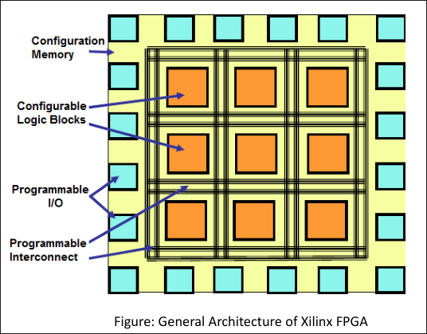

# Building Blocks of FPGA — 3 Points Each

1. LUT (Look-Up Table)
    - Core combinational primitive: a k-input LUT has 2k2k SRAM cells, so it can implement any Boolean function of up to k variables.
    - Traditional size was 4-input; modern families (Xilinx 7-Series+) use 6-input LUTs, often splittable into two LUT5s for better density and fewer logic levels.
    - Can be repurposed as small distributed RAM or shift registers (SRL) when not used for logic.
2. Flip-Flops (FF)
    - Sequential storage element paired with each LUT; captures LUT output on a clock edge to build registers, counters, FSMs, and pipelines.
    - Typically D-type with configurable set/reset polarity, clock-enable, and sometimes latch mode.
    - Every slice has multiple LUT+FF pairs wired through local MUXes, allowing combinational, sequential, or pipelined logic in one slice.
3. Configurable Logic Block (CLB)
    - Packages LUTs, flip-flops, multiplexers, and dedicated carry-chain logic for fast add/subtract/compare.
    - LUTs do combinational logic; MUXes steer/select signals; FFs register results; carry chains handle arithmetic.
    - Typical modern Xilinx CLB = 8 LUTs and 16 FFs (2 slices × 4 LUTs); large FPGAs have tens of thousands to over a million logic cells.
4. DSP Slices
    - Hardened arithmetic blocks embedded in fabric because LUT-built arithmetic is inefficient.
    - Xilinx DSP48E2 contains a 27-bit pre-adder, 27×18 multiplier, 48-bit accumulator/ALU, pipeline registers, and cascade ports for chaining slices.
    - Arranged in columns near BRAM; give higher frequency, lower latency, and far lower LUT usage than soft logic.
5. Block RAM (BRAM)
    - Dedicated hardened on-chip memory, usually column-aligned near DSP columns for locality.
    - Typical Xilinx tile = 36 Kb dual-port, splittable into two 18 Kb blocks; configurable as RAM, ROM, or FIFO, often with ECC.
    - UltraScale+ adds UltraRAM (URAM) for denser storage; small memories can also use LUT-based distributed RAM.
6. Clock Resources
    - Global clock inputs are dedicated low-jitter pins; some FPGAs (e.g., Artix-7) have no internal oscillator and need an external reference clock.
    - CMT contains MMCM (frequency synthesis, phase shift, jitter filtering) and PLL (simpler subset for frequency/phase alignment).
    - Global clock buffers (BUFG, BUFGCE, BUFR, BUFIO, etc.) distribute clocks on a dedicated low-skew tree; BUFGCE gives glitch-free clock gating for power saving.
7. Programmable Interconnect
    - Connects CLBs, DSPs, BRAM, and I/O using switch boxes, connection boxes, MUXes, pass transistors, and tri-state buffers.
    - Signals use short, medium, or long routing tracks, chosen by place-and-route to balance delay vs. congestion.
    - It is the dominant source of propagation delay and a major consumer of die area in FPGA architectures.

# General Architecture of FPGA



At a high level, every FPGA, regardless of vendor, is built from three classes of resources arranged in a regular, repeating grid (an **"island-style"** layout):

1. **Configurable/Logic Blocks** (CLBs in Xilinx terms, Logic Array Blocks in Intel terms): implement combinational and sequential logic.
2. **Programmable Interconnect**: wires and switches that route signals between blocks.
3. **I/O Blocks**: interface the fabric to the outside world.

```
        IOB   IOB   IOB   IOB
       ┌───┬─────┬─────┬─────┬───┐
  IOB  │CLB│ CLB │ CLB │ CLB │IOB│
       ├───┼─────┼─────┼─────┼───┤
  IOB  │CLB│ CLB │ CLB │ CLB │IOB│    <- CLBs are "islands"
       ├───┼─────┼─────┼─────┼───┤       surrounded by a
  IOB  │CLB│ CLB │ CLB │ CLB │IOB│       "sea" of routing
       └───┴─────┴─────┴─────┴───┘
        IOB   IOB   IOB   IOB
```

## 1. Logic Blocks (CLBs / LABs / ALMs)

1. Fundamental logic-building unit; internally contains **LUTs, flip-flops, and multiplexers** connected via a small **local routing matrix**.
2. Grouped into **slices** (Xilinx); e.g., a CLB has multiple slices, each with 6-input LUTs, FFs, and **fast carry-chain logic** for arithmetic.
3. **Granularity** classification: **fine-grained** (single gates), **medium-grained** (LUT/MUX/RAM-based — mainstream), and **coarse-grained** (FPU blocks, embedded processors).
4. Implements both **combinational and sequential logic** of the design.

## 2. Switch Matrix / Connection & Switch Boxes

1. Each CLB connects to the routing fabric via a **switch matrix (switch box)**.
2. **Connection boxes** attach logic block I/O to nearby tracks; **switch boxes** join horizontal and vertical tracks so signals can turn corners.
3. Tracks come in different lengths — short **local segments** for nearby connections and long **longlines** spanning the device for global signals.
4. Routing typically consumes **~80–90% of die area**, making routing-aware place-and-route critical.

## 3. I/O Blocks (IOBs)

1. Sit at the **periphery of the fabric** (and in high-speed I/O columns); translate between internal logic levels and external signalling standards.
2. Contain **input/output buffers**, often with edge-triggered flip-flops for fast, well-timed pin data transfer.
3. Configurable for **single-ended** (LVCMOS, LVTTL) and **differential** (LVDS) standards, with programmable drive strength, slew rate, and on-chip termination.
4. I/O blocks and support circuitry occupy a **large fraction of overall device area**, especially on smaller devices.

## 4. Configuration Interface

1. Loads the **bitstream** that sets every SRAM configuration cell defining LUT contents, routing switches, and I/O settings.
2. Interfaces are typically **serial** (JTAG, SPI from flash) or **parallel** (SelectMAP), depending on family and required speed.
3. On **SRAM-based** FPGAs, configuration is **volatile** — must be reloaded every power-up.
4. The bitstream is stored externally in **flash, EEPROM, or a host processor**, which configures the FPGA at boot.

# FPGA Design Flow

## 1. Architecture Design

1. Analyze project **requirements and constraints**: performance, area, power, and interfaces.
2. **Decompose** the problem into functional blocks and define interfaces between them.
3. Capture intended behavior using **algorithms, flowcharts, or pseudocode** before committing to RTL.

## 2. HDL Design Entry

1. Translate architecture into a formal **Hardware Description Language**: VHDL, Verilog, or SystemVerilog.
2. Increasingly, use **High-Level Synthesis (HLS)** from C/C++ for some flows.
3. This produces the **RTL (Register-Transfer Level)** description of the design.

## 3. Test Environment (Testbench) Design

1. Develop **testbenches and behavioral/reference models** independent of the RTL implementation.
2. Apply stimulus and check correctness against expected behavior.
3. Should be **reusable** across simulation and ideally usable for post-synthesis/post-implementation gate-level simulation.

## 4. Behavioral (Functional) Simulation

1. Run HDL model against the testbench and compare output to expected/reference behavior.
2. Testbench is written around the **top module**; simulation produces **waveforms** for inspection.
3. Loop: correct RTL and re-simulate until correctness is confirmed **before synthesis** — fixing bugs later is far costlier.

## 5. Synthesis

1. Synthesis tool converts HDL into a **gate-level netlist** mapped to target FPGA primitives (LUTs, FFs, DSP slices, BRAM, carry chains).
2. Performs **logic optimization**: inferring DSP slices from multiply/MAC, BRAM from memory-style code, resource sharing.
3. Goal: efficient use of the target device's **hard blocks**.

## 6. Implementation

1. **Translate** — merge netlist with constraints (timing, placement, I/O) into a unified database.
2. **Map and Place** — pack logic into device primitives (LUTs/FFs into slices); assign each primitive to a physical die location.
3. **Route** — configure programmable interconnect to realize all connections; output the **bitstream**.

## 7. Timing Analysis

1. **Static Timing Analysis (STA)** checks setup/hold margins on every register-to-register path, I/O timing, and CDC constraints.
2. If timing fails, re-optimize: **pipelining, floorplanning, reducing logic levels**, or lowering clock frequency.
3. Design must be **re-implemented** until timing closure is achieved.
