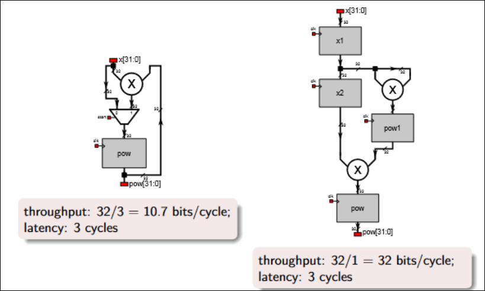
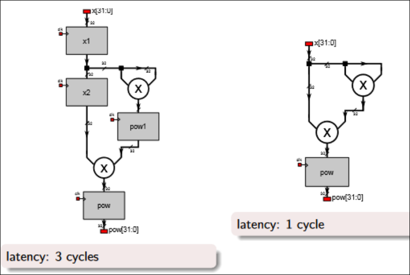

# RTL Power Optimization Techniques — Short Notes

1. **Power follows area and switching activity** — Fewer active logic resources, shorter combinational paths, and less signal toggling directly reduce **dynamic power** (which scales with switching activity × capacitance × clock frequency).
2. **Favor pipelining / resource-sharing over full unrolling** — A fully parallel/unrolled implementation maximizes area and thus static + dynamic power. A **pipelined** or **control-based reused** (FSM-driven sequential sharing) design trades some throughput for meaningfully lower power.
3. **Use hardened primitives (DSP slices, BRAM) instea[[Chapter 4 Advanced RTL Design Approaches]]d of LUT-built equivalents** — A hardened DSP multiply is typically **faster and lower power** than the same function built from general LUT fabric. Similarly, mapping memory to BRAM rather than distributed LUT RAM reduces both area and power.
4. **Exploit the tool and clocking choices** — Power-oriented synthesis/implementation strategies (e.g., Vivado power strategies) target reduced switching activity and clock-gating opportunities. Use **glitch-free clock gating (BUFGCE)** to stop the clock tree in unused regions, and let physical placement minimize routing length/capacitance

# Throughput Optimization — Loop Unrolling / Pipelining



- **Goal**: minimize the time elapsed **between successive input reads**, even if the time to fully process any single input (its own latency) is comparatively unimportant.
- The key idea is that **data item n+1 can begin being read/processed while data item n is still being processed** further down the pipeline — this is the essence of pipelining for throughput.
- **Un-pipelined / iterative implementation** (low throughput):

```verilog
reg [3:0] count;

always @(posedge CLK) begin
    if (start) begin
        count <= 4'b0010; // count <- 2
        pow   <= x;
    end else if (!stop) begin
        count <= count - 1;
        pow   <= pow * x;
    end
end

assign stop_out = (count == 0) ? 1'b1 : 1'b0;
```

- This computes `x^n` iteratively over multiple cycles per input, reusing the same multiplier repeatedly.
- Because a new `x` cannot be accepted until the current computation's `count` reaches zero, throughput is low relative to the number of cycles needed per result.
- Illustrative figures: **throughput ≈ 10.7 bits/cycle** (32-bit result over ~3 cycles of _this stage of the pipeline_), **latency = 3 cycles** — treat these as illustrative teaching numbers for the specific bit-widths/cycle counts assumed in the example, not universal constants.

- **Pipelined implementation** (high throughput):

```verilog
reg [31:0] x1, x2;
reg [63:0] pow1;

always @(posedge CLK or posedge RST) begin
    if (RST) begin
        x1   <= 0;
        x2   <= 0;
        pow1 <= 0;
        pow  <= 0;
    end else begin
        // stage 1
        x1 <= x;

        // stage 2
        x2   <= x1;
        pow1 <= x1 * x1;

        // stage 3
        pow <= pow1 * x2;
    end
end
```

- By splitting the computation into three pipeline **stages**, each with its own register layer, a **new input `x` can be accepted every single clock cycle**, because each stage is only ever working on one "slice" of the overall pipeline at a time.
- Illustrative figures: **throughput = 32 bits/cycle** (a full new 32-bit result's worth of _work_ advances every cycle), **latency = 3 cycles** (any individual input still takes 3 cycles to fully emerge as output — latency is unchanged by pipelining, only throughput improves).
- This is the classic trade-off: pipelining **does not reduce the latency of any single item**, but it dramatically increases the **rate** at which new items can be started and finished, because the hardware is kept busy on multiple items simultaneously rather than sitting idle waiting for one item to finish.

# Latency Optimization — Removing Pipeline Registers



- **Goal**: minimize the time from a specific input arriving to its corresponding output being available — i.e., pass data from input to output with **minimal internal processing delay**.
- A low-latency design generally uses **parallelism** (doing more work per cycle, in combinational logic) instead of relying on deep pipelining, and looks to **remove unnecessary pipeline register stages** wherever timing allows.
- **Pipelined version** (from Section C.2) — latency: **3 cycles**, because each of the three stages is separated by a register.
- **Fully combinational / minimal-register version** — latency: **1 cycle** (with a single output register):
