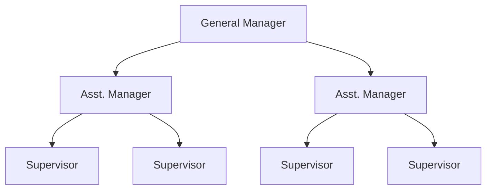
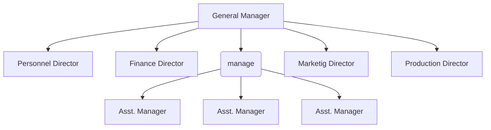
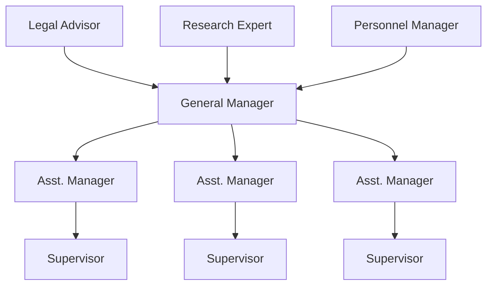

Organization has:
-   HR
-   Manpower
-   Finances

Organization produces:
-   Product
-   Service

# A Introduction
## A.1 Organization
### A.1.1 Concepts of Organization
#### A.1.1.1 Definition
-   Social structure
-   An entity in which two or more people work interdependently through structured patterns
-   coordination of man, machine and materials
-   for a purpose of accomplishing a set of goals
    -   create value for its stakeholders, stockholders, employees, community, society.
-   Goal oriented system
    -   people work together for a specific goal
- Social System
	- People use the knowledge and techniques they possess.
- Technological System
	- People use the knowledge and techniques they possess.
#### A.1.1.2 Why an organization
-   People work together to achieve certain goals
-   when organized, they can have better performances
-   fulfill basic needs
-   its better to work in group than work alone
-   better resources, diverse views and knowledge, more experiences, great potentials

-   the objective must be common for the organization
-   rules and regulations must be organized, so no conflicts and confusion occur
-   people related should be willing to cooperate with each other
-   have greater communications with each other

#### A.1.1.3 Organization in Society
-   the goals the organizations set to achieve directly or indirectly affects the society
-   development in education system, healthcare, technologies have helped us live a better life
-   Hospitals, Colleges and Universities, Banks, Telecommunication, Technologies, Entertainment industry
### A.1.2 System approach of Organization
- consists of interdependent parts that work together to continually monitor and transact with the external environment
- important to study the change in the external world
- changes in technologies, methods, customer needs, market trends, rules and regulations
- feedback from the customers
![[Drawing 2026-06-24 06.56.08.excalidraw | 900]]

### A.1.3 Principles of Organization
-   Henry Fayol
-   also referred as Principles of Management
-   For an organization to run smoothly, following principles are to be followed
    -   Division of work
        -   refers to subdivision of work into separated jobs assigned to respective employees
    -   Authority and responsibility
        -   authority is the right to decide, to direct others to take action to perform certain duties in achieving the organizational goals
        -   responsibility is an obligations to perform work activities
    -   Span of control
        -   refers to a number of people directly reporting to the supervisor
        -   typical scenario: 20 employees under a supervisor.
        -   6 supervisors under a manager
    -   Chain of Command/ Scalar Chain
        -   Command or authority which flows form top to bottom
        -   clarifies the authority positions to managers at all level and that facilitates effective organization
    -   Unity of Command
        -   it implies one subordinate one superior relationship
        -   every worker should receive orders from one boss only
        -   helps in effective run of an organization

### A.1.4 Formal and Informal Organization
-   Informal structure created within an organization
-   Based on the factors like same language, culture, languages, personal attitudes, same tastes or any other factors
-   Informal organization exerts a strong influence on employee behaviors, if management can understand its nature, it can contribute to organization's productivity
-   are informed informally within the organization by socializing and interpersonal relationships within the individuals over the breaks, or other social functions
-   not necessarily formed to accomplish the organization goals, rather, formed to fulfill the social activities
- An informal leader is chosen within informal organization who can have greater power than the formal leader over getting things done in the organization.

## A.2 Management
-   In simple words, getting things done through other people
-   in an organization, management is the act of getting people together to achieve the set goals using the available resources effectively and efficiently
-   Brain of an organization
-   Coordination of human, material resources and technology
-   Management's existence as old as the human origin
    -   General Sun Tzu, the art of war, 6\th century BC
    -   Chanakya's Arthashastra, 300 BC

### A.2.1 Function of Management
**PODCC**
-   Planning:
    -   Thinking before doing
-   Organizing
    -   Developing a framework that relates all personnel, work assignments and resources
-   Directing
    -   Requires leadership
    -   Giving guidelines to the personnel related to the definite objectives
    -   Supervising
-   Coordination
    -   Required fr the efficient and effective run of the organization
    -   managers are responsible for coordination and communication between different individuals working under the organization, to achieve the same set of goals
-   Controlling
    -   watch the activities of the organization
    -   compare the results achieved with the goals set

### A.2.2 Level of Management
-   Depends upon the size, complexity and the nature of organization
-   Top level Management
    -   Higher Authority
    -   Sets the goals, objectives, policies, and budgeting of the organization
    -   Main functions involve the decision making
    -   Sets the rules and regulations, issues order to the lower levels, guidelines and instructions
-   Middle Level Management
    -   Head of the functional departments
    -   Mediator between the top level management and the lower level
    -   Main function is to implement the policies set by the top level
-   Lower Level Management
    -   Responsible for the day to day activities
    -   Supervision of the workers and labors
    -   More involved in working to achieve the goals set by the organization

### A.2.3 Managerial Skills
-   Interpersonal Skills
    -   Interaction between the people inside and outside of organization
-   Informational Skills
    -   Gather information related to the goals and operation of the organization
-   Decisional Skills
    -   Use the information gathered to make decisions for the betterment of the organization
### A.2.4 Importance/Function
-   Proper Planning, determine what is to be achieved
-   Proper Organizing, allocate resources and establish the means to accomplish the plan
-   Proper influence, motivate and lead personnel towards the goal
-   Controlling activities in the organization, compare results achieved to the planned goals
### A.2.5 Models of Management
- Hierarchical Management Model
	- Authority and Responsibility
	- Managers receive authority from the superiors to command resources and actions to the subordinates
	- Response to superiors request
- Task Oriented Management Model
	- Managers have five major tasks: **PODCC**
	- Focuses in the actual managerial activities
	- Management has a set of well defined tools that can be used in sequence or in parallel
- Allocation Management Model
	- Managers are responsible for handling organizations resources and control
	- Money, manpower, physical objects
	- Resource manager obtains, allocates, shares, monitors and return resources
- Team Effort Management model
	- Managers and other subordinates work as a team
	- Concentrates on cooperation, leadership, coordination
	- More effective when work in a team rather than work individually, adds value to the production
- Knowledge Oriented Management Model
	- Managers learn and gain knowledge through experience
	- Knowledge is transferred to the subordinates through teaching, guiding, training
	- Necessary to adapt changes in thee external environment and use the knowledge gained to train the others for the betterment of production
- Goal Concentrated Management Model
	- Focuses on the goals set by the organization
	- Management plays an important role in working towards achieving these goals
	- Management support consists of tools that keep the organization on an established path towards the goals.
- Organization may choose to use all or few of these models according to their needs.

## A.3 Theories of Management
Necessary to understand the historical development of management

### A.3.1 Scientific Management Approach
- Frederic W Taylor, first person to study management, early 1900's
- believes scientific approaches should be used to increase the productivity and efficiency of the work
- his belief, there should be one best way of doing each task
- select employees who are best suited for the job
- provide the employees with necessary education and training related to the job
- encourage friendly environment between managers and employees but with the separation of duties
- his personal experience at the Bethlehem steel company developed 4 ways of increasing efficiency
	- an improved method of work (motion study)
	- a prescribed amount of rest on the job (fatigue study and rest periods)
	- a specific standard of output (time study)
	- payment by the unit of output (incentive wages)
- Before the motivation and study
	- labors would pick up 42 kgs of iron and transfer to the end of railway car
	- in a group of 75 labors, average output was 12.7 tons per labor
- after the use of scientific management approach of taylor
	- the average output of work per day rose from 12.7 ton to 48.8 ton
	- daily pay rose from $1.14 to a substantial high $1.85
### A.3.2 Administrative Management Approach
-   Henry Fayol (1842-1925), French Mining engineer and Management Consultant
-   First person to analyze the functions of Management
-   Made three major contribution to the theory of management
    -   a clear distinction between technical and managerial skills
    -   identified functions constituting the management process
    -   developed principles of management
-   Fayol described management as a scientific process built up five elements
    -   PODCC
-   Fayol's principle
    -   Developed set of 14 principles
    -   Division of Labor
        -   work should be divided into individuals and group as per their specialization. Work specialization
    -   Authority and Responsibility
        -   authority is the right to decide, to direct others, t take action, to perform certain duties in achieving the organizational goals
        -   Responsibility is an obligations to perform work activities
    -   Discipline
        -   a successful organization requires the common effort of the workers
        -   penalties should be applied when necessary
    -   Line of Authority
        -   A clear chain or authorities from top to bottom level of management
        -   Scalar Chain
        -   authority should be defined at each level of management and it should flow from top to bottom
    -   Centralization
        -   centralization is the degree to which authority rests at the top level
        -   Fayol defined Centralization as lowering the importance of subordinates role, where as decentralization is increasing the importance
        -   whether determining centralization or decentralization depends upon the specific organization
    -   Unity of Direction
        -   the entire organization should be moving towards a common objective in a common direction
    -   Unity of Command
        -   Employees should have only one boss
    -   Order
        -   Each employee is put where they have the most value
    -   Initiative
        -   Management should encourage employee initiatives, self direction
    -   Equity
        -   treat all employees fairly in justice and respect
    -   Remuneration
        -   fair rate should be determined for paying worker's effort keep in mind many variables like cost of living, qualification, business conditions and the amount of responsibility
    -   Stability of Tenure
        -   long term employment is important for success
    -   General interest over individual interest
        -   importance should be given to the success of the organization rather than individual stress
    -   Espirit de Corps
        -   "Union is Strength" - refers to harmony and mutual understanding among the members of an organization
### A.3.3 Behavioral Management Approach
- Elton Mayo and his associates in the 1920's
- productivity not necessarily increased through the monetary incentives, human behavior and social environment plays an important part
- HR Movement, saw the organization as the social system with members strongly influenced by intergroup relationships and with the individual motivated by a complex hierarchy of needs
- Hawthorn Experiment
    -   3 studies over the period of five years
	-   The relay assembly test room experiment
	    -   6 girls working the telephone assemblies
	    -   studied different factors affecting the productivity including, frequency of work, rest periods and other factors relating to the physical environment
	    -   output, the productivity was not only increased due to the physical condition and monetary incentives but was also effected by strong social and psychological factors
	-   The interviewing program
	    -   over 2100 people were interviewed during a course of 3 years
	    -   conclusion: the needs of the individuals and the role of informal group have significant impact over the performance of the worker
	-   the bank wiring observation room
	    -   group of 14 males and their work were observed
	    -   social interaction between the group had a good impact on the performance and the quality of their work
- Conclusion
	- When employees are given special attention by the managers, output is likely to improve rather than just changing the working conditions
	-   organization is a social system
	-   individuals are not only motivated by monetary incentives but also by social factors
	-   working in group enhances performance
	-   worker satisfaction is based on productivity and increased the effectiveness
	-   better communication between various level is important
	-   management requires not only technical but the social skills as well
### A.3.4 Modern Management Theories
#### A.3.4.1 Contingency and System Approach
- Contingency Approach
	- As an integrative approach, fits together both the theories
	- assumes no single theory is the best, existing ideas must be applied selectively
	- it is necessary to determine the situation and circumstances of the organization and choose which theory works the best
- System Approach
	- Concentrates on the efficient use of the resources available in order to produce the desirable products
	- organization uses inputs, capital, physical and human resources and transforms it into a desirable output
	- necessary to recognize the internal and external environment and the changes in these environment that directly affects the performance of the services.

## A.4 Forms of Ownership
### A.4.1 Single Ownership
 - Oldest, popular and simplest form of organization
 - owned and controlled by single person
 - formed to fulfill own goals and use of own resources
 - total control and freedom to run the business in his/her own way
 - bears any profit or loss by himself, so total risk on the owner
 - usually the profit motive
 - unlimited liability, owner assumes all the debts.
	 - In any case of the failure of the business, the owner will be required to sell off the property, business as well as personal ones to pay off the debts
 - government has no control over the business, but it is run under legal laws and jurisdiction.
 - adv/disadv:
<table>
	<tr>
		<th colspan="2" style="text-align: center; font-size: 40px;">ADVANTAGE</th>
	</tr>
	<tr>
		<th> Advantage </th>
		<th> Description </th>
	</tr>
	<tr>
		<td>Easy to form and dissolve </td>
		<td>Since single owned, it is easy to start or even stop the business as per the comfort of the proprietor<br>No Permission from anyone is required</td>
	</tr>
	<tr>
		<td>Easy to manage</td>
		<td>Since there is no confusion and there is a full control, there will be less conflict and the organization will be easy to manage
	</tr>
	<tr>
		<td>Direct Motivation</td>	
		<td>Since the profit or loss is wholly borne by the owner himself, the owner knows the more he works or looks after his performance, the more money he will make</td>
	</tr>
	<tr>
		<td>Absolute control</td>
		<td>The owner has the full control over the business and is able to make any changes as per his will</td>
	</tr>
	<tr>
		<td>Business secrecy</td>
		<td>The owner has the advantage of not sharing any of his business trade and secrets with anyone else<br>No risk of any leakage of the business secrets since the owner is in full control and he is the only one to be affected by any wrong doings</td>
	</tr>
	<tr>
		<td>Promptness in<br>Decision Making</td>
		<td>No Need to discuss any changes that need to be brought with anyone else<br>Freeness to imply any talents or special knowledge</td>
	</tr>
	<tr>
		<td>Flexibility in operation</td>
		<td>Since single owned, the owner makes all the decisions, takes all the risks, does all the important work, specify tasks to the employees and thus the business is easy to operate</td>
	</tr>
	<tr>
		<td>Personal relation with customers and employees</td>
		<td>- No medium level between the owner and lower level employees, direct coordination<br>- Happy customer and happy employee means a happy result in the business<br>- Direct involvement with the customers and employee is a great advantage and increases the efficiency and productivity.<br>- Direct monitor of the changes in the external needs, environment as well as the behavior of the employees</td>
	</tr>
	<tr>
		<td>Limited government control</td>
		<td>Since it is a privately owned organization, there is a minimum or limited involvement of the government</td>
	</tr>
	<tr>
		<th colspan="2" style="text-align: center; font-size: 40px;">DISADVANTAGES</th>
	</tr>
	<tr>
		<td>Limited Financial resources</td>
		<td>Since it is single owned, it is difficult to raise a large amount of capital</td>
	</tr>
	<tr>
		<td>Limited managerial ability and skills</td>
		<td>Business has different aspects,  requires production skills, marketing skills, HR, financial skills<br>One person doesn't necessarily be well informed in all these aspects, thus difficulty will occur</td>
	</tr>
	<tr>
		<td>Uncertain duration</td>
		<td>If anything is to happen to the owner, natural or accidental, or the loss of funds will force the business to collapse</td>
	</tr>
	<tr>
		<td>Unlimited Profit Oriented</td>
		<td>Prone to the misuse of unlimited rights to profit<br>Fluctuation in the charges to the customer and the quality of the product might hamper the loyalty of customers</td>
	</tr>
	<tr>
		<td>Unlimited Liability</td>
		<td>owner assumes all the debts<br>In any case of the failure of the business, the owner will be required to sell off the property, business as well as personal ones to pay off the debts</td>
	</tr>
	<tr>
		<td>Health Issues/Time Management</td>
		<td></td>
	</tr>
</table>
### A.4.2 Partnership
 - Is formed when two or more people join hands to work together, sharing equally the profit and loss
 - Increases the resources, capital, skills and manpower
 - Formed with the mutual understanding between the partners
 - Terms and conditions are mentioned in a partnership agreement known as partnership deed
 - Usually established in profitable ventures
 - Private organization
 - adv/disadv:
<table>
	<tr>
		<th colspan="2" style="text-align: center; font-size: 40px;">ADVANTAGE</th>
	</tr>
	<tr>
		<th> Advantage </th>
		<th> Description </th>
	</tr>
	<tr>
		<td>Easy to form and dissolve </td>
		<td>Can be formed without much legal formalities<br>Easy to dissolve as well, with the mutual consent of the partners</td>
	</tr>
	<tr>
		<td>Large Resources</td>
		<td>Depending upon the number of co-partners, large capital can be raised<br>More resources and funds than single ownership organization</td>
	</tr>
	<tr>
		<td>Better skills and ability</td>	
		<td>Certainly more people involved means diversity in the skills and ability<br>Wider range of knowledge</td>
	</tr>
	<tr>
		<td>Quick decisions</td>
		<td>Partners can meet in person to take quick decisions</td>
	</tr>
	<tr>
		<th colspan="2" style="text-align: center; font-size: 40px;">DISADVANTAGES</th>
	</tr>
	<tr>
		<td>Instability in business</td>
		<td>Since more than one person is involved, it is not necessary there will be mutual understanding in the relationship<br>Conflict between the partners may cause instability in business</td>
	</tr>
	<tr>
		<td>Liability</td>
		<td>All partners are liable for the actions of other partners<br>If for some reason business fails, the partner with even the minimum investment may be liable to pay off all debts if the partners are not able to pay</td>
	</tr>
	<tr>
		<td>Misunderstanding</td>
		<td>Since more people are involved, confusions and misunderstanding can occur<br>Decisions need to be shared, not always brings up the best interest<br>Profits and loss are shared as per the investment, some partner can put in more time to the business, some may not be able to put more time</td>
	</tr>
</table>
### A.4.3 Joint Stock Company
- Association of individuals for the purpose of carrying on some trade or business
- aka corporations or limited companies
- capital is collected by selling shares to different people, known as share holders
- certificate of shares are provided to the share holders, flexibility of selling or transferring share holders, flexibility of selling or transferring shares
- profit is shared as per the proportion of the shares
- company is managed by board of directors, chose during the Annual General Meeting
- adv/disadv
<table>
	<tr>
		<th colspan="2" style="text-align: center; font-size: 40px;">ADVANTAGE</th>
	</tr>
	<tr>
		<th> Advantage </th>
		<th> Description </th>
	</tr>
	<tr>
		<td>Large Financial resources</td>
		<td>Since capital is collected from large number of share holders, unlimited funds can be collected<br>Fresh shares can be issued to meet the financial requirements</td>
	</tr>
	<tr>
		<td>Limited Liability</td>
		<td>Liability is limited to the face value of the shares the shareholders own<br>No shareholders need to pay anything more than the value of the share they own<br>Main reason, people are interested in venturing, and the success of this kind of organization</td>
	</tr>
	<tr>
		<td>Transferability of Shares</td>	
		<td>Shareholders can sell or transfer their shares as per their convenience<br>Brings liquidity to the investors</td>
	</tr>
	<tr>
		<td>Continuity of Existence</td>
		<td>Organization is not affected by the death of certain shareholders, since the shares are transferrable<br>Since general public are the shareholders, bring more confidence in the existence of the organization</td>
	</tr>
	<tr>
		<td>Efficient Management</td>
		<td>With the financial strength, company can afford to hire professional help when needed<br>The people in charge are mostly experienced and talented people taking high salaries</td>
	</tr>
	<tr>
		<td>Social Benefits</td>
		<td>Creates employment opportunities, good products and services<br>Creates investment opportunities for general public</td>
	</tr>
	<tr>
		<td>Economies of<br>Large Scale Production</td>
		<td>With the financial strength, company can undertake large scale production<br>Thus enables a company to produce quality products at lower costs and the public can enjoy the benefits<br>Helps develop the economies of the country</td>
	</tr>
	<tr>
		<td>Public Confidence</td>
		<td>Everything is out in the public, how the company is performing, is it making profit or not<br>Audit reports are yearly conducted by the government and are published in the public platform<br>Easy access of the loans from other institutions as well as the government</td>
	</tr>
	<tr>
		<th colspan="2" style="text-align: center; font-size: 40px;">DISADVANTAGES</th>
	</tr>
	<tr>
		<td>Difficulty in Formation</td>
		<td>Corporation are not easy to form, requires a lot of legal hassles, lots of paper work<br>Lot of people need to show interest to form, shares need to be sold in the certain time<br>Very lengthy and expensive process</td>
	</tr>
	<tr>
		<td>Lack of personal interest</td>
		<td>There are shareholders who invest, board of directors who work on a commission basis, and there are managers and employees who work in salary basis<br>Shareholders don't have much of thee say in the operation of the organization<br>Lack of personal interest and effort from the directors</td>
	</tr>
	<tr>
		<td>Lack of Secrecy</td>
		<td>Everything is out in the public, the audit reports<br>All the operations are predetermined in the board meetings<br> Difficult to maintain business secrecy as compared to the private organizations</td>
	</tr>
	<tr>
		<td>Delay in Decision Making</td>
		<td>All the decisions are to be made by the board of directors<br>Time consuming and the meetings are not always easy to set<br>Delay in the decision making can cause the loss of many business opportunities</td>
	</tr>
	<tr>
		<td>Excessive government Regulations</td>
		<td>All reports are to be par with the government laws and regulation<br>Lots of resources and time are consumed, complying the law</td>
	</tr>
</table>
### A.4.4 Cooperative Societies
- Different from other companies as it is not primarily formed for profit motive but as rendering services to its members in particular and to the society in general
- voluntary association of individuals for their mutual, social and economical and cultural benefit
- at least 10 members and no more than 100, membership is open to anyone
- created with the association of members of the community, usually the ones with the limited resources, to self promote their own products and services
- normally formed so individuals and small business can benefit from being a part of a larger group
- part of the capital is procured from its members and rest through government loans and grants
- formed on the basis of self help, self responsibility, democracy, equality
- management committee is elected by members on the basis of "One Man One Vote" regardless of the number of shares owned by an individual
- fixed ate of dividend. part of the profit is utilized for general welfare of the society, part is shared as bonus among the members on the basis of effort put in by its members.
#### A.4.4.1 Types of Cooperatives
- Producer's Cooperatives
	- Created to help and strengthen small producers who can't withstand competition by organized large scale producers
	- Cooperatives provide them with raw materials, tools and equipment, the producers sell their product to the cooperatives and is introduced in the market
- Consumer's Cooperatives
	- Formed with the purpose of making available day to day requirements of goods to their members at cheaper prices
	- they buy bulk of goods at wholesale prices and sell it to the members and society at little higher prices than the wholesale but much less than the market price
- Marketing Cooperatives
	- Formed to help selling agriculture products or small manufactured products
	- organized by farmers to sell their own farm products or dairy products
	- sells the manufactured products of small producers such as weavers, artisans and remunerate them
- Housing Cooperatives
	- Formed by those people who strive to own a flat or house
	- formed mostly in urban areas and big cities where the problem of housing is acute
	- these cooperatives are allotted land by the city authorities at reasonable prices and are built by the effort of its members, when the buildings are completed, each member is an owner of the home
- Cooperative Credit Societies
	- formed by members to utilize their savings and invest their resources thus collected for giving loans to its members at favorable terms
- ADV/DISADV
<table>
	<tr>
		<th colspan="2" style="text-align: center; font-size: 40px;">ADVANTAGE</th>
	</tr>
	<tr>
		<th>Advantage</th>
		<th>Description</th>
	</tr>
	<tr>
		<td>Easy formation</td>
		<td>Being a voluntary association, it is easy to form<br>At least 10 members are needed</td>
	</tr>
	<tr>
		<td>Democratic functioning</td>
		<td>Management is chosen on the basis of "one man one vote", doesn't matter if they own one share or more.</td>
	</tr>
	<tr>
		<td>Limited Liability</td>
		<td>The liability of the cooperative is limited to the amount of capital invested by its members</td>
	</tr>
	<tr>
		<td>Reducing Inequalities</td>
		<td>Since most of the cooperatives are formed in a society to benefit the poor ones, profits help increase their economic status and help bridge the gap between the rich and poor.</td>
	</tr>
	<tr>
		<td>Government Assistance</td>
		<td>Since cooperatives are formed with the purpose of services and community help, they enjoy large appreciation and consideration from the government and local authorities</td>
	</tr>
	<tr>
		<td>Continuity of Existence</td>
		<td>Organization is not affected by the death of certain shareholders</td>
	</tr>
	<tr>
		<th colspan="2" style="text-align: center; font-size: 40px;">DISADVANTAGE</th>
	</tr>
	<tr>
		<th>Disadvantage</th>
		<th>Description</th>
	</tr>
	<tr>
		<td>Limited Capital</td>
		<td>Amount of capital rendered is limited because of the membership being confined to certain community, locality</td>
	</tr>
	<tr>
		<td>Lack of Managerial Talent</td>
		<td>Since management and all other day to day responsibilities are handled by its own members, the talent and skills re limited to certain members only</td>
	</tr>
	<tr>
		<td>Lack of Secrecy</td>
		<td>All the operations and business secrets are shared within the community and its members</td>
	</tr>
	<tr>
		<td>Lack of Motivation</td>
		<td>Since the dividends are not shared beyond certain percentage of the profit, the members of managing committee do not sufficiently feel motivated to do their best</td>
	</tr>
</table>
### A.4.5 Public Corporation
- An organization formed by the government
- social welfare organization created for non profit objectives
- history: between 1936 and 1939, 20 were formed
<table>
	<tr>
		<th colspan="2" style="text-align: center; font-size: 40px;">ADVANTAGE</th>
	</tr>
	<tr>
		<th>Advantage</th>
		<th>Description</th>
	</tr>
	<tr>
		<td>Unlimited resources</td>
		<td>Able to raise large funds and capital through the sale of its securities<br>Shares are publicly traded, more shares can be issued to meet the financial requirement</td>
	</tr>
	<tr>
		<td>Limited Liability</td>
		<td>If the corporation fails or goes bankrupt, the shareholders are not liable to pay off the debts</td>
	</tr>
	<tr>
		<td>Continuity of Existence</td>
		<td>Organization is not affected by the death of certain shareholders</td>
	</tr>
	<tr>
		<th>Disadvantages</th>
		<th>Description</th>
	</tr>
	<tr>
		<td>Difficulty in formation</td>
		<td></td>
	</tr>
	<tr>
		<td>Excessive government Regulation</td>
		<td>All reports are to be be par with the government laws and regulation</td>
	</tr>
	<tr>
		<td>Lack of secrecy</td>
		<td>Everything is out in the public, the shares are publicly traded<br>Difficult to maintain business secrecy as compared to the private organizations</td>
	</tr>
	<tr>
		<td>Political Influence</td>
		<td>Since the person in charge are chosen by the government, politics play important part<br>Person chosen not necessarily bears the required skills<br>May be the reason behind the failure of the organization</td>
	</tr>
</table>
## A.5 Organizational Structure
- Refers to division of labor as well as the patterns of coordination, communication, workflow and formal power
- structure provides guidelines essential for effective employee performance and overall success
- Represents the hierarchical arrangement of various positions in an organization
- in simple words, it defines who is to direct to whom and who is to report to whom
- there is no single best way of an organization structure, management of every organization has to evolve its own structure as per their requirements and convenience
- Based upon nature of activities of business, and competence of personnel, there are three different types of organization which are quite popular in the business world.
### A.5.1 Line Organization
- Simplest form of an organization
- represents a direct vertical relationships through which the authority flows from the topmost executive to the lower supervisor levels
- authority is greatest at the top and decreases with each successive level down the hierarchy

- Advantage
	- Very simple to establish and easily understood by the employees
	- clear cut identification of authority and responsibility
	- ensure better disciplines, as every individual knows who he is responsible to
	- facilitate unity of command
	- since each level is defined with specific authority level, prompt decision making is possible
- Disadvantage
	- Since the authority is concentrated at top, if they are not able perform well, the organization will not be successful
	- lack of effectiveness as the firm grows, top executive is too much overloaded
	- only suitable for small organization, lack of specialization my hamper the future
### A.5.2 Functional Organization
- Idea developed by F.W Taylor
- Organization is divided into several units based on functions such as production, marketing, finance, personnel management and are put under the charge of different persons
- If a person performs several functions, he/she will be under the direct charge of the several persons in charge of the particular functions
- this form encourages the specialization of labor and thus increases efficiency of the organization

 - Advantages
	 - Specialization of work, every functional incharge is an expert in his/her area and can help the subordinates in better performance in his area
	 - a functional manager is required to have expertise in one function only, makes it easy to developed executives
	 - reduces the burden on the top executives
 - Disadvantages
	 - Sometimes structure can be too complicated for the employees to understand, workers are supervised by a number of bosses, confusions
	 - violates the principle of unity of command
	 - a functional manager may tend to think in terms of his own department only department only rather than the organization as a whole
	 - delay in decision making when the decision requires the involvement of more than one specialists
### A.5.3 Line and Staff Organization
- In this organization, line authority moves down in the same manner as in the line organization, with addition of specialists attached to the line managers to advise them on business matters
- these specialist stand ready with their specialty to serve when they are called for, with information for the better performance of the organization
- provides advice to the line managers with their expertise

- Advantage
	- Line managers get the benefit of specialized knowledge of staff specialists at various level
	- staff executives help line executives make better decision by providing them with adequate information at right time
	- is more flexible, helpful when organization grows, share the stressful duties and functions of top executives
- Disadvantage
	- Staff executives not necessarily provide the best information, conflicts may occur with the line executives
	- the allocation of duties between line and staff executives are not clear, may hamper the coordination in the organization
	- line executives work in more practical manner, staff executives are not clear, may hamper the coordination in the organization
	- line executives work in more practical manner, staff executives who are specialists tend to be more theoretical
	- since staff executives are not accounted for the results, they may not be performing their duties well

### A.5.4 Committee Organization
- Two or more person appointed by higher authority for the purpose of advising
- may be formed for a limited duration or standing committee
- it may or may not have authorities
- members of the committee may or may not have other responsibilities in the organization
- advantages
	- careful selection of members, will bring together wide range of ideas, expertise, interests together
	- when members consist of representatives of different functional departments, it ensures all aspects of organization are considered in final decision making
- disadvantages
	- delay in decision making
	- committee might take decision based on compromise between the different views rather than whats best

## A.6 Purchasing and Marketing Management
### A.6.1 Purchasing Introduction
- Important function in all types of organization, no business can operate successfully without functions related to purchasing
- the activity of acquiring goods and services by payment, to accomplish the goals of organization
- Procurement of materials, machine, tools and equipment
- An organization has huge responsibility to buy materials of right quality, the right quantity, at right time, from the right sources with delivery at the right place
- In small organization different departments do their own purchasing, while in big scale organization it is a common practice to have a separate purchasing department responsible for making required purchases throughout the organization.
- Purchasing department are responsible to understand the needs and the requirement of different departments and individuals within the organization and meet their needs.

### A.6.2 Functions of Purchasing Department
- Purchasing department has certain responsibility to buy materials, and ensure continuity of supply of all types of materials required for the operation of organization.
- The main function of the purchasing department is to maintain regular flow of materials in following way:
	- What to purchase i.e. to buy materials of right quality
	- How much to purchase i.e. to buy materials of right quantity
	- What rate to purchase i.e. to buy materials at right price
	- When to purchase i.e. to buy materials at right time (regular flow of materials)
	- Where to purchase i.e. to buy materials from a reliable supplier/manufacturer with delivery at the right time
- Maintain the regular flow of inputs to maintain the flow of outputs
### A.6.3 Methods of Management
- Direct Purchase Procedure
	- When the materials are immediately required to perform certain jobs, materials are purchased directly from certain suppliers
- Quotation Procedure
	- Price quotation are collected from different suppliers, at least three
	- Evaluate the price quotation and purchase the materials from the suitable supplier
- Tender Procedure
	- Materials are purchased from open market
	- Advertise the materials required in local/international newspaper or different form of media
	- Collect the tender from the interested suppliers and evaluate it and purchase the materials from prospective suppliers
	- A tender is a written document provided by suppliers, consisting of price quotations, terms and condition for the supply of goods
	
### A.6.4 Different steps of Purchasing
- Identifying the required materials from different departments 
-  Inquiry to supplier
-  Receive price quotations 
- Prepare the comparative statement from different suppliers and evaluate it
- Choose/Approve the supplier
- Placing order, sending copies of purchase list to the respective departments or storage, accounts
- Follow up the order
- Receiving the orders, inform the respective departments and users
- Inspection of materials and creating report/records
- Requesting the accounts department for the payment
- Allocate materials as per requirements
### A.6.5 Marketing Introduction
- Process of communicating the value of products or services to the consumers or end users
- An organizational function for creating, delivering and communicating  value to the customers, and managing customer relationships for the mutual benefit of both the customers as well as the organization and its shareholders
- Performance of business activities that direct the flow of goods and services from producers to consumers
- According to William J Stanton, Marketing is a total system of interacting business activities design to plan, price, promote and distribute wants satisfying products and services to present and potential customers
- Four P’s of Marketing, Product, Pricing, Placement and Promotion
	- Product should be developed as per the product information provided through market research, should meet the needs of the end users
	- Pricing refers to setting a price for the product
	- Placement refers to how a product reaches the buyer, how it is sold, online, retail, wholesale, to which market base(businesses, personal, families, youths)
	- Promotion includes advertising, sales promotion, publicity, branding
- Marketing Management: important operative function of management
	- It performs all management functions related to the field of marketing
	- Includes all activities which are necessary to determine the needs of customers and to supply goods and services
- Marketing Concept
	- Marketing represents satisfying customer by selling the products meeting their needs 
	- The objective of marketing is not only making profit by volume sales but making profit by satisfying the customers
	- Marketing concept is based on three fundamental belief’s:
		- Customer oriented: company planning, policies and operation should be customer oriented
		- Profit oriented: profitable sales volume should be the goal 
		- Satisfaction of customers: products should be based upon customer satisfaction
- Marketing Research 
	- Activity by an organization with the purpose of gaining information about potential buyers
	- Four key elements to market research
		- Analysis of current activities: monitoring current sales trends, gives idea of who is buying what and where
		- Market intelligence: knowing what is happening in the market, knowing what the competitors are planning
		- Market Analysis: gather information from customers about their reaction to new pricing policies and new products
		- Product Evaluation: determine the effectiveness of the strategies adopted for the product and analyze  any changes needed in the future
### A.6.6 Functions of Marketing
- Pricing
	- Setting the price of the product at the right level as per demand, quality of product
- Buying  
	- Involves what to buy, where to buy, how much, from whom, when and at what price – Purchasing 
- Selling 
	- Core of marketing, supplying the product to the buyers for the exchange of pay
- Distribution 
	- Determining the best ways for customers to locate, obtain, and use the products and services of an organization
- Financing
	- Budgeting for marketing activities, obtaining the resources needed for operations
- Product /Service Management
	- Designing, developing, maintaining, improving and acquiring products and services that meet consumer needs
- Market information Management
	- Obtaining, managing and using information about what customers want ,to improve business decision making, performance of marketing activities, and determining what will sell
- Promotion
	- Communicating with customers about the product to achieve the desired result--customer demand for and purchase of the product. Includes advertising, personal selling, publicity, and public relations
### A.6.7 Advertising
- Form of marketing, used to encourage or persuade the consumers or end users to take action upon the product, an organization is advertising to sell
- Newspaper, magazines, medias, online sources, TV, door to door selling, billboards, sales promotions
- Helps increase sales by creating awareness in people, making them conscious about the products and brands and help make an organization popular within the circle of potential buyers


Here's a simple footnote/reference,[^1] sample[^2] longer one.[^3]

[^1]: This is the first footnote.
[^2]: This is weird

[^3]: Here's one with multiple paragraphs and code.

    Indent paragraphs to include them in the footnote.

    ```c
    #include<stdio.h>
    printf("Enter this %d", i)
    { my code }
    ```

    Add as many paragraphs as you like.
