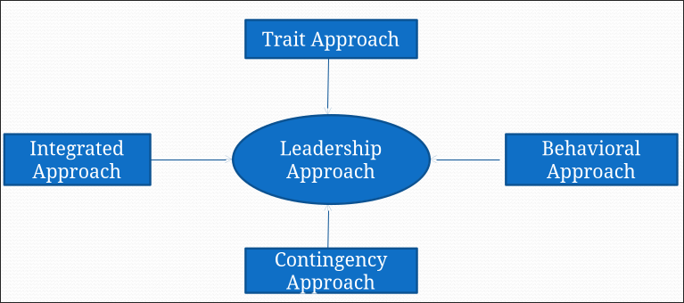
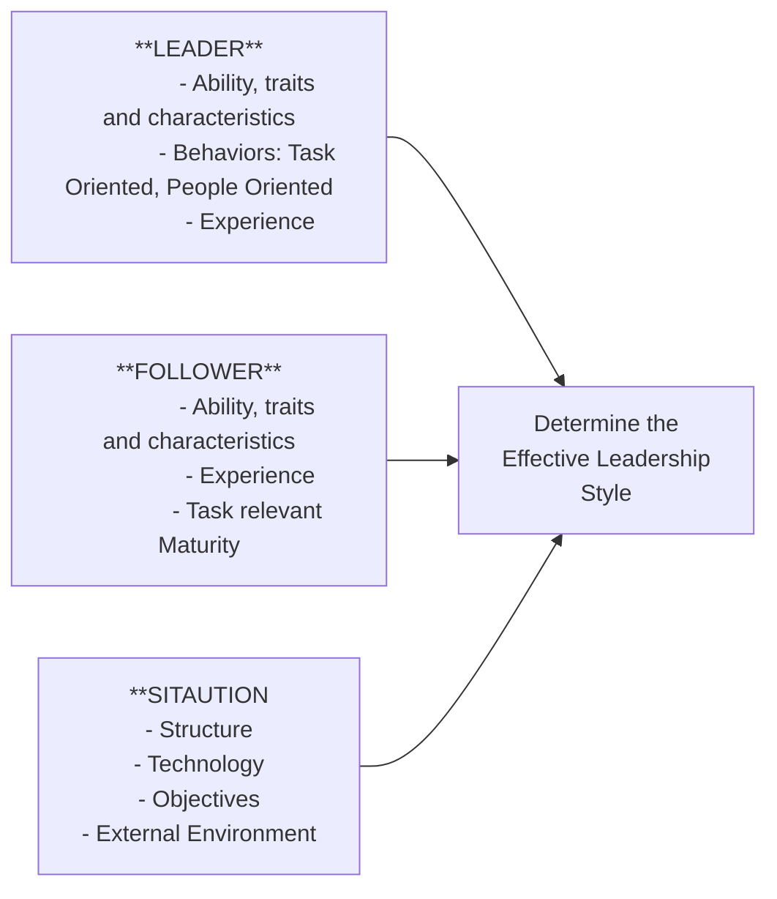

# ⁠A. Motivation
- Comes from Latin word 'Mover' which means to move
- The process of influencing or stimulating a person to take action by creating a work atmosphere wherein the goals of the organization and needs of the person are satisfied
- Internal and external factors that stimulate desire and energy in people to be continually interested in and committed to a job
- Different people have different form of motivation: Rewards, punishment, monetary incentives
## ⁠A.1. Role of Management
- The employers and managers have to understand what motivates their subordinates to be more productive at work
- Better the motivation schemes, better the quality of work produced
- Main role of management is to create an environment in the workspace where individuals can work efficiently with the feel of work satisfaction, towards achieving in the organizations goals
- Every human being is unique, their needs their behaviors are different from each other
- Managers should be able to study their nature and the best motivation strategy for each individuals.
- Provide necessary training, knowledge, and information about the jobs they are performing
- Get necessary feedback from employees and implement them towards the work being done
- Adequate Salary and wage system should be determined
- Making the workplace environment fun and interesting
## ⁠A.2. Types of Motivation
- Intrinsic VS Extrinsic Motivation
	- Intrinsic
		- When you want to do something in an organization
		- Means that the individuals motivational thoughts are coming from within
		- The individual is driven by an interest or enjoyment in the task itself, and doesn't reply on the external rewards
		- Engages in completing the task willingly as well to improve their skills
		- e.g., I don't want to complete the task
	- Extrinsic
		- When someone else wants you to do something in an organization
		- The desires to perform the task are controlled by an external source
		- When someone else want you to do something in an organization, offering certain rewards, fear of punishment
		- e.g., Complete this task and you will be rewarded
- Positive vs Negative Motivation
	- I want to complete this task
	- Complete this task or you are fired
## ⁠A.3. Attitude Motivation; Group Motivation; Executive Motivation
### ⁠A.3.a. Attitude Motivation
- Attitude motivation is about how people think and feel
- It is their self confidence, their belief in themselves, their attitude to life, be it positive or negative. It is how people feel about their future and how they react to their past
- If both employers and employees can maintain positive attitude about themselves, towards others as well as the towards the situation, it leads towards the better performance.
### ⁠A.3.b. Group Motivation
- Teams are the life of any organization, productivity and success of an organization depend upon the performance of employees as a team
- Team leaders must understand how they can influence their team members motivation, and work towards the productivity and proficiency
- Bringing out the better of each individuals in a team and recognizing them for their performance can increase their motivation as well as the teams
- Team building exercises, trainings, incentives, social recognition, can help motivate the members of an organization to increase and better their performances towards achieving organizational goals.
### ⁠A.3.c. Executive Motivation
- One of the key issues in an organization is motivating and keeping managerial talents in the company
- An organization and top level management should be able to identify and encourage all the talents they possess within the organization and motivate them to stay at the company to perform even better
- Profit sharing incentives, bigger and challenging responsibilities, share options, benefits (medical, vehicle), public recognition, better pay can help motivate executives to perform better
## ⁠A.4. Motivation Theories
- Content theory of Motivation
	- Explains why people have different needs at different times
- Process theory of Motivation
	- Explains the process through which the needs are translated into behavior
- Maslow's Needs Hierarchy
- Fear and Punishment Theory
- Alderfer's ERG Theory
- MacClelland's Theory of Learned Needs
- MacGregor's theory X-Theory Y
- Herzberg's Hygiene Motivator Theory
- Vroom's Expectancy / Valency Theory
### ⁠A.4.a. Maslow's Needs Hierarchy
- Abraham Maslow, 1940's
- Employees behavior are motivated by several needs
	 - Self Actualization needs
        - Highest need level, a feeling that the person's full potential has been realized
        - According to Maslow, only a few person reaches this level
        - Organization can offer challenging and meaningful works and assignments that require innovation and creativity.
	 - Esteem Needs
        - A feel of personal achievement, recognition and representation from others, self esteem, respect
        - Organization can recognize their employees achievements, high performance through publicly recognizing them via newsletter or company programs
        - Assign more important works
	 - Social Needs
		- Important motivator of employee behavior
        - Individual wants to belong to a group, gain acceptance from fellow workers, wants interaction with others in the form of friendship, giving and receiving love
	 - Safety Needs
        - After phyisiological needs are fulfilled, human tend to safety needs
        - Protection from physical danger, economic security
        - Organization can provide safer work conditions, pensions for future, and other protection plan
	 - Physiological Needs
        - Basic Needs for sustaining human life, food, water, shelter, sleep
        - Organization helps fulfill these needs by providing, comfortable workspace, adequate wages and suitable working hours
### ⁠A.4.b. Alderfer's ERG Theory
- Clayton Alderfer, 1969
- Human needs are divided into 3 different categories
    - E for Existence, relates to person's physical needs like food, shelter, clothers, sleep, safety
    - R for Relatedness, relates to a person's interpersonal needs within his personal as well as professional settings
    - G for Growth, relates to a person's need for personal development
- With some comparison to Maslow's Hierarchy,
    - Existence - Physiological and Safety needs
    - Relatedness - Social and Esteems needs
    - Growth - Esteem and Self Actualization needs
### ⁠A.4.c. MacClelland's Theory of Learned Needs
- In early 1960's David MacClelland studies 3 needs as important sources of Motivation
- Need for Achievement
    - A desire to set and accomplish challenging goals
    - Takes calculated risks to accomplish their goals
    - Likes to receive regular feedback on their progress and achievement
    - Assumes personal responsibility for work
- Need for Power
    - A desire to control the environment, including people and resources
    - Some people have strong social power needs in which they seek power for improving society or increasing organizational effectiveness
    - Some people have strong personal power needs so as to use it for personal benefits and better career opportunities
    - Enjoys competing and winning
- Need for Affiliation
    - Wants to belong to a group, form better work relationships, wants to be liked and respected by others
    - Wants to avoid conflicts and confrontation
### ⁠A.4.d. McGregor's Theory X, Theory Y
- Douglas McGregor, 1960's
- Explains human behavior based on participation of workers
- Theory X assumes that average person,
    - Dislikes work and attempts to avoid it
    - Has no ambition, wants no responsibility and would rather follow than lead
    - Is self-centered and doesn't care about the organizational goals and objectives
    - By nature is resistant to changes
    - Avoids making decision and not particularly intelligent
- Theory X managers will have to persuade and push their employees into performance
- The employees must be strictly controlled, supervised, directed, threatened with punishment, be coerced to put efforts into their performance.
- Theory Y assumes people by nature are,
    - Doesn't necessarily hate work, work can be as natural as play and rest
    - Will be self directed to meet their work objectives if they are committed to it
    - Desire to achieve organizational goals
    - Will seek responsibility, and are capable of directing their own behavior
    - Make decision with respect to their commitment
- Managers who believe in theory Y, assumes less control over their own work
- Allows employees more control and have responsibility over their own work
- If implemented properly, will create an environment where employees can have greater satisfaction over job, and result in the high level of motivation towards their job
### ⁠A.4.e. Fear and Punishment Theory
- B. F. Skinner, also referred as Reinforcement Theory
- Just as theory X assumes, some individuals like their work, hates responsibility, avoids challenging jobs and doesn't have an ambition
- For those people in an workforce environment, it becomes very necessary to use fear and punishment scheme or theory for them to be motivated
- Some people get motivated by rewards and some people must be feared and controlled by the management in order to motivate them to work towards achieving organizational goals.
### ⁠A.4.f. Hertzberg's Hygiene factors and Motvation
- Frederick Hertzberg, 1959
- In a workplace there are certain factors that lead to job satisfaction and there are certain factors that lead to job dissatisfaction
- The satisfying factors are called motivators and the dissatisfying are called hygiene factors
- Hygiene Factors
    - Employees are primarily motivated by lower level needs such as job security, working conditions, company policies, relationships to fellow employees, relationships to superiors, salary and wages
    - These needs when fulfilled improves from job dissatisfaction to no dissatisfaction and doesn't necessarily lead to job dissatisfaction
- Motivators
    - The higher level needs for Achievement, recognition for accomplishment, feel of responsibility, opportunities for growth and advancement
    - Motivates individual for better work performance
    - These needs when fulfilled leads from no job dissatisfaction to job satisfaction.
### ⁠A.4.g. Vroom's Expectancy/Valency Theory
- Proposed by Victor Vroom from the Yale school of management
- Proposes that a person will decide to behave or act in a certain way because they are motivated to select specific behavior over other behaviors sue to what they expect the result of that selected behavior will be
- Motivation = expectancy * instrumentality * valency, M = E * I * V
- Motivation is the amount a person will be motivated by the situation they find themselves in.
- Expectancy is the person's perception that effort will result in performance. Management shuold discover what resources, training, or supervision employees need
- instrumentality is the person's perception as to whether they will actually get what they desire. Management should ensure that the promises of rewards are fulfilled and the employees are aware of it
- Valence is the value the individuals places on the rewards based on their needs, goals and values
## ⁠A.5. Motivation Techniques
- It is very important in an organization to keep their employees motivated to keep doing their best towards achieving the organizational goals
- **Provide Meaningful and Challenging Work**
	- When employees feel the work they are doing are meaningful and challenging in some way, they feel internally motivated
	- If an employee feels the work they are doing are actually having a big impact in the overall operation of the organization, they generally become more engaged and energized
- **Set clear targets, expectations and measure performance**
	- It is of no point for employees to perform better if they are not clear of the targets they are to meet, or bout the expectations from them by the management
	- Management must be clear when they direct their employees about the obejctive of the organization and what behaviors or skills they need to modify (or continue using) in order to improve performance.
- **Give regular, direct and supportive feedback**
	- Giving regular feedback about the performance of each employees help them focus on their job better, make any improvements or changes when needed
	- Feedback needs to be timely, specific and presented in such a way that the individual is clear about what behaviors or skills they need to modify (or continue using) in order to improve performance.
- **Value the employees**
	- In a workforce there are also those kind of people who motivates themselves to perform better and they value their responsibility
	- It is important for Management to value these individuals and make sure they are given credit for their work and respected
- **Training and development Programs**
	- Regular training and development programs should be conducted on timely basis for employees to make themselves prepared for the future
	- Employees feel motivated when they know they have better future in an organization and they are being invested for
- **Incentive Programs**
	- Rewards, promotions, benefits, profit sharing, freedom can be provided by managers to motivate their employees.
## ⁠A.6. Qualities of a good Leader
- Honesty and Integrity
    - A leader must be trustworthy, and be known to live their life with honesty and integrity
    - A person of honesty and integrity is the same on outside and the inside
    - A leader must have ethical behavior thus the trust of the follower
- Personality/Confidence
    - A good leader is confident, in order to lead and set direction, a leader needs to appear confident in person and in leadership roles
    - A leader who conveys confidence towards the proposed objective inspires the best effort from the team members
- Human Skills
    - Should know how to treat and talk to his members
    - Give respect, give credit to people when due
    - When people feel they are being treated fairly, they reward a leader with loyalty and dedication
- Initiative
    - A good leader must always take an initiative
    - They must be able to construct and implement his own plans
    - They must do the right thing at the right time without being told by others
- Innovative
    - Must have a good imagination and visualization skills
    - Must be able to combine new ideas with old ones and develop new tactices to solve problems
- Communication skills
    - A good leader must be an effective and excellent communicator
    - must be a good speaker and writer, must use simple language to give information, instructions and guidance to his followers
- Discipline
    - A good leader must be a disciplined person
    - must have respect for the rule and regulations of the organization, this is because his followers will follow his example
- Committed to excellence
    - The good leader not only maintains high standards, but also is proactive in raising the bar in order to achieve excellence in all areas
    - There is no greater motivation than seeing the boss down in the trenches working alongside everyone else, showing that hard work is being done on every level
## ⁠A.7. Leadership Style
- The behavioral pattern which a leader adopts is known as the style of leadership
- The leadership style in a particular situation is determined by the leader's personality, experience, values, nature of followers and the environment.
### ⁠A.7.a. Autocratic Style/Authoritarian Style
- Gives orders which the leader insists shall be obeyed
- Autocratic leaders typically make choices based on their own ideas and judgements and rarely accept advice from followers
- Leaders make all the decisions, little or no inputs from the group members
- Autocratic leadership can be beneficial in some instances, such as when decisions need to be made quickly without consulting with a large group of people
- People who abuse an autocratic leadership style are often viewed as bossy, controlling, and dictatorial, which can lead to resentment among group members
### ⁠A.7.b. Democratic Style/Participative Style
- A democratic leader is one who gives order after consulting the group
- Researchers have found that this leadership style is usually one of the most effective and lead to higher productivity, better contributions from group members, and increased group morale
- Policies are worked out in group discussions, and praise and blame will be shared by the group members
- Members of the group feel more engaged in the process, group members are encouraged to share ideas and opinions, even though the leader retains the final say over decisions
### ⁠A.7.c. Laissez Faire Style/Free Rein Style
- A free rein leader doesn't lead, but leaves the group entirely to itself
- the leader provides little or no direction and gives employees as much freedom as possible, even though the leader is responsible for the final outcome
- Depends largely upon the group to establish its own goals and work out its own problems
- Group members work themselves and provide their own motivation
- Not ideal in situations where group members lack the knowledge or experience they need to complete tasks and make decisions
### ⁠A.7.d. Managerial Grid
- Developed by Robert R Blake and Jake Mouton
- The model is represented as a grid with concern for production as the X-axis and concern for people as the Y-axis, each axis ranges from 1 (low) to 9 (high)
- Based on the concerns, this models identified 5 different leadership styles

- **The Indifferent or Impoverished Style** (1, 1)
    - Low concern for both the production and people
    - Main concern for the leader is not to be held responsible for the mistakes, which results in less innovations
- **The Accommodating or Country Style** (1, 9)
    - Low concern for production and high concern for People
    - Leaders pays much attention for the comfort of the employees
    - Resulting atmosphere is usually friendly, but not necessarily very productive
- **The Dictatorial or Perish Style** (9, 1)
    - High concern for production and low concern for People
    - Leaders find employee needs unimportant; they provide their employees with money and expect performance in return
    - Managers using style also pressure their employees through rules and punishments to achieve the company goals
- **The Sound or Team Style** (9, 9)
    - High concern for both the production and people
    - managers choosing to use this style encouragees teamwork and committment among employees
- **The Status Quo or Middle of the Road Style** (5, 5)
    - Managers using this style try to balance between company goals and workers' needs
    - By giving some concern to both people and production, managers who use this style hope to achieve suitable performance but doing so gives away a bit of each concern so that neither production nor people needs are met.

## ⁠A.8. Leadership
- Leadership is the process of influencing people and providing an environment for them to achieve team or organizational activities
- The activity of leading a group of people or an organization or an ability to do so
- An art of motivating a group of people to act towards achieving a common goal
- The leader is an inspiration and director of the action
- Process of influencing people and providing an environment for them to achieve the team or organizational goals
- Leaders arrange the work environment such as allocating resources, defining organizational goals
- For an organization to run smoothly, the top level management who are responsible to make decisions, create infrastructure should have sharp leadership skills
- Without better leadership skills, teh company will struggle to sustain in long run
- Great leaders should possess the ability to adapt their behavior and styles according to the situation
- There is a difference between leaders and managers
- All leaders shouldn't necessarily a manager
- A manageer holds a higher position, may lead a team, his functions vary from planning, directing to controlling, whereas a leader might be any of the team members with strong influence over the others
## ⁠A.9. Leadership Approach

### ⁠A.9.a. Trait Approach of Leadership
- Based on the personal traits, abilities, personality, background, physical characteristic, intelligence, attitudes, learning behavior, maturity
- These traits distinguish great leaders from rest of us
- A set of core traits of effective leaders from rest of us
    - **Achievement drive**: high level of effort, ambitions and inner motivation to pursue goals
    - **Leadership Motivation**: an intense desire to lead others to fulfill organizational goals
    - **Honesty and Integrity**: trustworthy, reliable and leader's truthfulness and tendency to translate word into deeds
    - **Self-Confidence**: belief in ones self, ideas and ability
    - **Intelligence/Cognitive ability**: capable of exercising good judgement, strong analytical abilities
    - **Knowledge of Business**: knowledge of the organization and other technical matter
    - **Self Monitoring Personality**: the leader's sensitivity to situational cues and ability to adapt his or her own behavior appropriately
### ⁠A.9.b. Behavioral Approach of Leadership
- This approach answers what behaviors make leaders effective
- Argues great leaders are made, not born, explains leadership capability can be learned
- Identifies two distinguished behavior, people oriented and task oriented behavior
    - **People Oriented Behavior**
        - Shows mutual trust and respect for subordinates
        - Genuine concern and desire to look out for their needs and welfare
        - Listens to employee suggestion, does personal favors to employees when needed
        - Treats employee equally and support their interest
        - Task Oriented Behavior
    - Task Oriented Behavior
        - Assigns employees to specific tasks
        - Ensures they follow the organization rules and procedures
        - Pushes them to reach their performance capacity
        - Emphasizes on getting the work done, no matter what
        - Wants the work specified to be done by the time deadline was given
- Initially it was though that the leaders who tend to people oriented behavior are weak at the task oriented behavior and vice versa
- But studies have shown now that effective leaders can exhibit high levels of both the abilities and these behaviors are independent to each other.
### ⁠A.9.c. Contingency or Situational Approach of Leadership
- Based on the idea that the best approach to leadership depends upon the situation
- According to this theory, what an individual actually does when acting as a leader is in large part dependent upon characteristics of the situation in which he/she functions
- Effective leaders must possess an ability to adapt to the situation by adopting one or more of the leadership styles described below
    - Directive
        - Samee as task oriented behavior
        - Explains clearly to subordinates what task is to be completed, how and when it is to be completed and maintains clear performance standards
    - Supportive
        - Same as peoplee oriented behavior
        - Leader is friendly and approachable
        - Shows respect, treats employees equally, makes work environment pleasant
    - Participate
        - Leader consults with the employees, listens to their suggestion
        - Takes their ideas into serious consideration before making any decisions
    - Achievement Oriented
        - Leaders set challenging goals, expects employees to perform at their highest level
        - Seeks improvement in performance, shows high degree of confidence on workers in their ability to take the responsibility at accomplishing tasks
### ⁠A.9.d. Integrated Approach to Leadership
- Integration of the characteristics, behavior and experience of the leader, ability and experience, maturity of followers, structure and technology, objectives and external environment
- Most realistic and effective approach of Leadership
- The management approach is associated with the Leader
- The Followers represent the Personnel
- The situation includes the structure, technology, objectives and the external environment

# ⁠B. Entrepreneurship - Introduction
- French word, entrependre which means to undertake
- The capacity and willingness to develop, organize and manage a business venture along with any of it risks in order to make a profit
- Entrepreneurship in simple terms is to start a new business
- Entrepreneurship ranges in scale from solo projects (even involving the entrepreneur only part-time) to major undertakings creating many job opportunities
- An entrepreneur is a person of very high aptitude who pioneers change, possessing characteristics found in only a very small fraction of the population
- In general form, an entrepreneur is someone who wants to work for himself/herself and start their own business with the knowledge and new innovations they possess
## ⁠B.1. Entrepreneurship Development
- Entrepreneurship plays a vital role in the economic development of the country.
- Involves adoption of new forms of business organizations, new technologies and new enterprises producing goods not available
- An entrepreneur is an individual with knowledge, skills, initiative, drive and spirit of innovation who aims at achieving goals
- An entrepreneur identifies opportunities and seizes opportunities for achieving economic benefit
- Factors influencing Entrepreneurship:
    - Creativity and Innovation
        - Sources of new idea and transforming ideas into opportunities
    - Inner drive to start a new business
        - Working for oneself, using the knowledge one possess to benefit oneself and the economy of the country.
## ⁠B.2. Entrepreneurial Characteristics
- **Initiative**:
    - An entrepreneur takes action that goes beyond job description and requirements
- **Opportunity seeking**
    - Must be quick to seize the opportunities
    - Does things before asked to by other people or demanded by situation
- **Disciplined/Confidence**
    - Successful entrepreneurs are disciplined enough to take steps every day toward the achievement of their objectives
    - They are confident with the knowledge that they will make their business succeed, theey display that confidence in everything they do
- **Risk Taking**
    - If you are afraid of uncertainties, then you are not an entrepreneur
    - Entrepreneurs are not gamblers or high risk takers, instead they calculate their risks before taking actions and are moderate risk takers
- **Creative**
    - One cannot become an entrepreneur if they lack imagination and are not creative and innovative
    - Coming up with different solutions to the problems within makes an individual strong and creates a pathway for success
- **Competitve**
    - Many companies are formed becasue an entrepreneur knows that they can do a better job than others
    - They must be competitive and have desire to win and be successful at whatever they do
- **Committed/Determined**
    - An entrepenur is committed to the excellence, they put an extra effort when a required to fulfill a committment to the client
    - An entrepreneur is determined to be successful, a failure doesn't affect their willingness, they will try and try until they succeed.
- **Strong people skills**
    - Most successful entrepreneurs know how to motivate their employees so the business grows overall
    - They are very good at highlighting the benefits of any situation and coaching others to their success
- **Strong Wortk Ethics**
    - A successful entrepreneur often is the first person to arrive at the office and last person to leave
    - Their mind is constantly on their work, whether they are in or out of the workplace
    - Motivates his team to think in his way and act accordingly
## ⁠B.3. Need for promotion of Entrepreneurship
- Given the fact that entrepreneurship are potentials to support economic growth, governments should help develop a culture of entrepreneurial thinking
- Entrepreneurship and creativity are the factors that can save the corporate sector from troubled economic times like unemployment, downsizing, and other economic downfalls
- Entrepreneurship help promote small business in the society. Many economists today agree that small business are essential part of our future economic prosperity and is a necessary ingredient in stimulating economic growth
- According to Joseph Schumepter, the functions of an entrepreneurship is, introduction of methods of production, developing new markets and finding fresh sources of raw materials, and making and bringing changes
- Every year, a global entrepreneurship week is celebrated worldwide with an aim to expose youths to the benefits of entrepreneurship through different activities and to motivate them to explore their own ideas, creativity and innovation
## ⁠B.4. Steps for establishing small scale unit
- Small scale industries have a large contribution in the growth of an economy
- Not only these enterprises produce export quality goods, they have also created thousands of job opportunities as well
- Another advantage of small scale enterprises is that they are easy to setup and can fulfill one's dream to become an entrepreneur.
- **Who can start?**
    - An existing entrepreneur or a fresh to business
    - With or without the business background in the family
    - Educated or uneducated
    - Rural area/backward area persons, physically handicapped persons, minorities
    - A strong will, essential skills, ability of hard work, and ability to take calculated risks are the key requirements
- **Product Identification**
    - design a new product as an innovator or imitate an established product
    - need to describe the product you wish to manufacture or the service you wish to offer
    - While choosing the product or service you want to offer, you must conduct a good market research and learn about the prevailing competition in the market
- **Forms of Ownership**
    - Needs to decide whether to have a corporation, a sole proprietorship, partnership
    - Should be economically viable and feasible
- **Location**
    - location for the small unit must be chosen keeping in mind:
    - Proximity to the source of raw materials
    - Nearness to the market
    - Transportation
    - Availability of labor
    - Power and energy supplies, disposal facilities
    - Political Patronage
- **Approvals**
    - Approval from the government, taxation, following necessary rules and regulations, licensing, registration and other government approvals and paperwork
- **Finance**
    - Arrangement of finance required for Fixed Capital, setting up infrastructure like land, building, machineries as well as the Working Capital, operating costs and expenses, raw materials
    - If one doesn't have enough funds, long term loans from private parties as well loans from the financial institutions
- **Production management**
    - Includes allocating space for different operations and choosing production method
    - Make sure to follow the practies for quality testing and keep on improving
    - Buying the right required raw materials and hiring the required help
- **Marketing**
    - Last but the most important step
    - No business is complete without the selling of the product or services, and ensuring the flow of revenues
    - You have to decide the prices for your products or services, keeping in mind the profit margin
- Planning in advance is a useful aspect of setting up a small scale venture. Keep on assessing and improving your plan at every stage.
