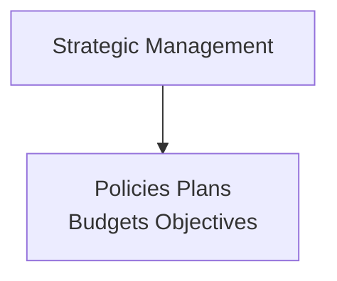

# Data and Information
- Data refers to unanalyzed facts about an organization operations
- Data becomes information only when used for some sort of analysis
- Information is anything that is relevant and useful for managers
- An effective MIS helps managers convert and process data into relevant information and help in decision making
## Management Information System
- Use of Computing and Communication technology
- Study of how individuals, groups and organization evaluates, designs, implement, manage and utilize systems to generate information to improve efficiency and decision making
- MIS can collect, analyze and organize information from both internal and external sources so that manageers can use it to make decisions
- All organizations have some sort of system, either simple or sophisticated for getting the einformation they need
- A good MIS gives managers information on past and present activities and help make projections about future activites
- Helps managers performs its functions: Planning, Organizing, Directing, Coordinating and Controlling

- MIS consists of three separate concepts
    - Management
    - Information
    - System
# Need, function and Importance of MIS
## Importance of MIS
- Can be compared with the heart of the body
- Managers rely on infromation in their decision making, information that has been processed from data provideed to them
- Measures performance against goals.
- Production managers need informaiton related with prodution costs, labor costs or if there is a need t expand the plant due to higher demand
- Marketing managers need information on sales trend, market analysis, new product development
- Personnel managers need information on workforce turnover, skills and knowledge level, wages, incentives
## Function of MIS
- Data capturing
    - Collecting data from various internal and external sources
- Data Processing
    - Collected data and processed and turned into useful information, calculation, comparison
- Functions of prediction
    - Helps predict the future situation by applying modern calculations, statistics
- Functions of Planning
    - Help make future planning, set targets and create goals and objectives
- Function of Controlling
    - Helps decide whether a problem exists and decide what action should be taken
- Function of Assistance
    - MIS is a technieque that provides with timely accurate and useful information
# Evolution of MIS
- MIS can be recorded as old as human history
- With revolution in industrial world, business started growing and with the complexity increeased as well
- Accounting system, development of computing technology, organization size, have lead to the fast growth in information system
- Before the computers, use of Punch cards and Ledger systeems
- MIS is the system of generating useful information by using data
- The evolution of MIS can be attributed to following factors
    - Growth of Management theory and techniques
    - Change in the production and distribution method and changees in organization structure
    - Development of Management Science
    - Introduction of computer into business data processing and the developments in information technologies
# Orgnizational Structure and MIS

# Computers and MIS
# Classification of Information Systems
  Information Support for functional areas of management
# Organizing Information Systems
