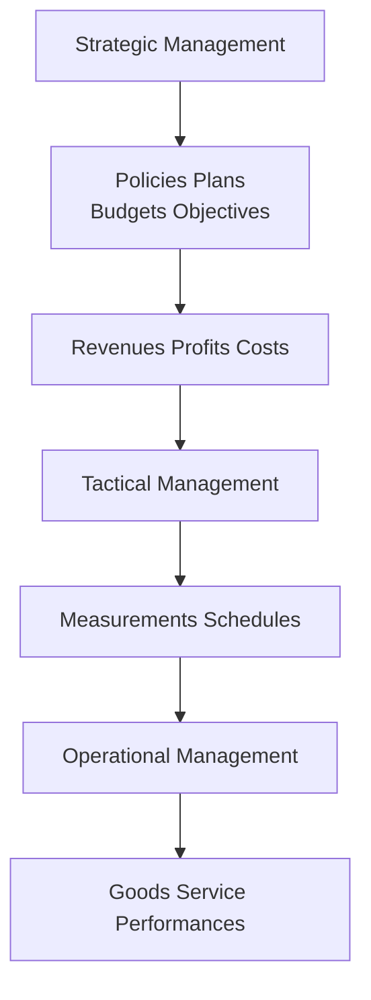

# Data and Information
- Data refers to unanalyzed facts about an organization operations
- Data becomes information only when used for some sort of analysis
- Information is anything that is relevant and useful for managers
- An effective MIS helps managers convert and process data into relevant information and help in decision making
## Database and Networking
- Database is a collection of data and use it for different purpose
- Collection of data organized to serve many applications effectively at the same time by storing and managing data so that they appear to be in one location
- Different components of the telecommunications network can be communicated with each other
- Data are transmitted throughout a telecommunication network
- In order to play in the interconnect world, companies must integrate and develop the IS architecture
## Management Information System
- Use of Computing and Communication technology
- Study of how individuals, groups and organization evaluates, designs, implement, manage and utilize systems to generate information to improve efficiency and decision making
- MIS can collect, analyze and organize information from both internal and external sources so that managers can use it to make decisions
- All organizations have some sort of system, either simple or sophisticated for getting the information they need
- A good MIS gives managers information on past and present activities and help make projections about future activities
- Helps managers performs its functions: Planning, Organizing, Directing, Coordinating and Controlling

- MIS consists of three separate concepts
    - Management
    - Information
    - System
# Need, function and Importance of MIS
## Importance of MIS
- Can be compared with the heart of the body
- Managers rely on information in their decision making, information that has been processed from data provided to them
- Measures performance against goals.
- Production managers need information related with prodution costs, labor costs or if there is a need t expand the plant due to higher demand
- Marketing managers need information on sales trend, market analysis, new product development
- Personnel managers need information on workforce turnover, skills and knowledge level, wages, incentives
## Function of MIS
- Data capturing
    - Collecting data from various internal and external sources
- Data Processing
    - Collected data and processed and turned into useful information, calculation, comparison
- Functions of prediction
    - Helps predict the future situation by applying modern calculations, statistics
- Functions of Planning
    - Help make future planning, set targets and create goals and objectives
- Function of Controlling
    - Helps decide whether a problem exists and decide what action should be taken
- Function of Assistance
    - MIS is a technique that provides with timely accurate and useful information
# Evolution of MIS
- MIS can be recorded as old as human history
- With revolution in industrial world, business started growing and with the complexity increeased as well
- Accounting system, development of computing technology, organization size, have lead to the fast growth in information system
- Before the computers, use of Punch cards and Ledger systems
- MIS is the system of generating useful information by using data
- The evolution of MIS can be attributed to following factors
    - Growth of Management theory and techniques
    - Change in the production and distribution method and changes in organization structure
    - Development of Management Science
    - Introduction of computer into business data processing and the developments in information technologies
# Organizational Structure and MIS

- Managers at different level in the organization needs different kinds of information, and they usually need it at different time intervals
## Operational Management (Lower Level Management)
- Deals with the actual production of services and goods
- They use MIS to determine what raw materials they need, to develop work schedules, and to make sure the materials and people are at right place, at right time
- Because these activities are very detailed, operational management may need information on an hourly or daily basis
- The information most useful at this level centers on whether goods and services have been produced on schedule and whether it reaches the expectations of customers
## Tactical Management (Middle Level Management)
- Middle managers put into operation the overall plan and strategies that top level management has developed
- They use MIS to setup control procedures and to allocate resources towards organization objective
- Needs information on weekly or monthly basis
- Most useful to indicate whether operational systems put into places can reach top manager's overall objectives
- At Tactical level of management, information concerns schedules, revenue measurements, profits costs and other economical factors
## Strategic Management (Upper/Top Level Managment)
- Top level managers uses the MIS to set overall corporate policies and strategy to ensure organizational growth and survival
- Information generally needed on a quarterly on yearly basis
- Most useful information at strategic level deals with confirmation whether the goals and objectives of the organization are accomplished, the organization is profitable
- Information useful for the executives often come sources outside the organization such as suppliers, competitors, information services and media, hired consultants and others
- Strategic management focuses on the future and work is more creative that other level of managements and are concerned with plans, policies, budgets and objective of organization of organization
## Information Support for functional areas of Management
- Information system for planning process
    - Planning is concern witht hee future consequences of actions that are undertaken today
    - Planning is
        - Where are we?
        - Where do we want to go?
        - How do we get there?
        - When will it be done?
        - How much will it cost?
    - Planning is long term perspective
    - Forecasting future programme
    - Fully utilizing resources
    - Information system support to planner for long range influencing plan
    - MIS should help managers to accurately forecast demand for timely production of their product
- Information system for Decision Making Process
    - MIS is a technique that provide managers with useful information to assist in the decision making process
    - Decision making is choosing best alternative
    - More information help to choose best alternative
    - Strategic Level: decision are characterized
        - Future Oriented
        - Long range plan
    - Tactical Level: decision making relates to
        - Short term activities
        - Formulation of budget, funds flow, personnel problem, product improvement
    - Operational Level:
        - Inventory, Scheduling, allocating workers
# Computers and MIS
- MIS today is a computer based system
- Computer provides accurate timely and relevant useful information to managers
- Computer converts raw data into meaningful information as required format quickly
- Before the advent of computers, MIS suffered from several problems
    - Information arrived too late to be of much value for decision making
    - Information was not as complete as needed
    - Information was not as complete as needed
    - Information cost more than its worth
    - Information lacked a clear focus
    - Information was not relevant to particular decision
- Comptuer is a major factor in helping managers to obtain meaningful information or reliable data for appropriate decision
- **Quick response systems** emphaseize the timeliness of the information or reliable data for appropriate decision
    - Online Processing: manager interacts directly with computer or CPU
    - Real time processing: Information system work simultaneously with an ongoing organizational activities
# Classification of Information Systems

# Organizing Information Systems
