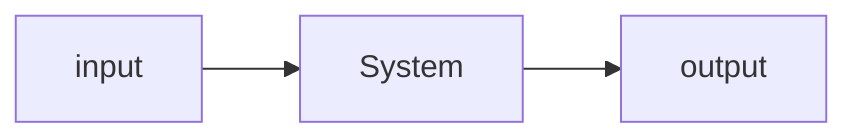

Organization has:
- HR
- Manpower
- Finances

Organization produces:
- Product
- Service

# A Definition of an Organization
- Social structure
- an entity in which two or more people work interdependently through structured pattenrs
- coordination of man, machine and materials
- for a purpose of accomplishing a set of goals
	- create value for its stakeholders, stockholders, employees, community, society.
- Goal oriented system
	- people work together for a specific goal
## A.1 Why an organization
- People work together to achieve certain goals
- when organized, they can have better performances
- fulfill basic needs
- its better to work in group than work alone
- better resources, diverse views and knowledge, more experiences, great potentials
- the objective must be common for the organization
- rules and regulations must be organized, so no conflicts and confusion occur
- people related should be willing to cooperate with each other
- have greater communications with each other
## A.2 Organization in Society
- the goals the organizations set to achieve directly or indirectly affects the society
- development in education system, healthcare, technologies have helped us live a better life
- Hospitals, Colleges and Universities, Banks, Telecommunication, Technologies, Entertainment industry
### A.2.1 System approach of Organization

Input:
- raw materials
- hr
- financial resources
- information
- equipment
System:
- subsystem collections
- organization transforming inputs to outputs
Output:
- production
- goods/Services
- Employee
- Behaviors
- Profit/Losses
Feedback:
- From input
- Fro Output
- to System
## A.3 Principles of Organization
- Henry Fayol
- also referred as Principles of Management
- For an organization to run smoothly, following principles are to be followed
	- Division of work
		- refers to subdivision of work into separat2022-ed jobs assigned to respective employees
	- Authority and responsibility
		- authority is the right to decide, to direct others to take action to perform certain duties in achieving the organizational goals
		- responsibility is an obligations to perform work activities
	- Span of control
		- refers to a number of people directly reporting to the supervisor
		- typical scenario: 20 employees under a supervisor.
		- 6 supervisors under a manager
	- Chain of Command/ Scalar Chain
		- Command or authority which flows form top to bottom
		- clarifies the authority positions to managers at all level and that facilitates effective organization
	- Unity of Command
		- it implies one subordinate one superior relationship
		- every worker should receive orders from one boss only
		- helps in effective run of an organization
## A.4 Formal and Informal Organization
- Informal structure created within an organization
- Based on the factors like same language, culture, languages, personal attitudes, same tastes or any other factors
- Informal organization exerts a strong influence on employee behaviors, if management can understand its nature, it can contribute to organization's productivity
- are informed informally within the organization by socializing and interpersonal relationships within the individuals over the breaks, or other social functions
- not necessarily leader is chosen within informal organization who can have greater power than the formal leader over getting things done in the organization.

## A.5 Management
- In simple words, getting things done through other people
- in an organization, management is the act of getting people together to achieve the set goals using the available resources effectively and efficiently
- Brain of an organization
- Coordination of human, material resources and technology
- Management's existence as old as the human origin
	- General Sun Tzu, the art of war, 6$\th$ century BC
	- Chanakya's Arthashastra, 300 BC
### A.5.1 Functtion/Importance
- Proper Planning, determine what is to be achieved
- Proper Organizing, allocate resources and establish the means to accomplish the plan
- Proper influence, motivate and lead personnel towards the goal
- Controlling activities in the organization, compare results achieved to the planned goals
### A.5.2 Level of Management
- Depends upon the size, complexity and the nature of organization
- Top level Management
	- Higher Authority
	- Sets the goals, objectives, policies, and budgeting of the organization
	- Main functions involve the decision making
	- Sets the rules and regulations, issues order to the lower levels, guidelines and instructions
- Middle Level Management
	- Head of the functional departments
	- Mediator between the top level management and the lower level
	- Main function is to implement the policies set by the top level
- Lower Level Management
	- Responsible for the day to day activities
	- Supervision of the workers and labors
	- More involved in working to achieve the goals set by the organization
### A.5.3 Function of Management
**PODCC**
- Planning:
	- Thinking before doing
- Organizing
	- Developing a framework that relates all personnel, work assignments and resources
- Directing
	- Requires leadership
	- Giving guidelines to the personnel related to the definite objectives
	- Supervising
- Coordination
	- Required fr the efficient and effective run of the organization
	- managers are responsible for coordination and communication between different individuals working under the organization, to achieve the same set of goals
- Controlling
	- watch the activities of the organization
	- compare the results achieved with the goals set
### A.5.4 Managerial Skills
- Interpersonal Skills
	- Interaction between the people inside and outside of organization
- Informational Skills
	- Gather information related to the goals and operation of the organization
- Decisional Skills
	- Use the information gathered to make decisions for the betterment of the organization
# B Artificial Intelligence
## B.1 Intelligent Behaviors
Intelligence is:
- the ability to reason
- the ability to understand
- the ability to create
The art of creating machines that perform functions that require intelligence when performed by people
the science of making computers, do things that require intelligence like humans
AI is the study of how to make computers do things at which, at the moment, people are better
AI is a field of computer science that studeies and develops computational tasks
Bigger subsets to smaller subsets:
AI -> ML -> DL
## B.2 Behavioral Management Approach
- After the use  of scientific management approach of Yaylor
	- the average output of work per day rose from 12.7 ton to 48.8 tons
	- daily pay rose from $1.14 to substantial high $1.85
- Behavioral Management approach
	- Elton Mayo and his associates in the 1920's
	- productivity not necessarily increased through the monetary incentives, human behavior and social environment plays an important part
	- Human relation movement, saw the organization as the social system with members strongly influenced by intergroup relationships and the individual motivated by a complex hierarchy of needs.
- Hawthorn Experiment
	- 3 studies over the period of five years
- The relay assembly test room experiment
	- 6 girls working the telephone assemblies
	- studied different factors affecting the productivity including, frequency of work, rest periods and other factors relating to the physical environment
	- output, the productivity was not only increased due to the physical condition and monetary incentives but was also effected by strong social and psychological factors
- The interviewing program
	- over 2100 people were interviewed during a course of 3 years
	- conclusion: the needs of the individuals and the role of informal group have significant impact over the performance of the worker
- the bank wiring observation room
	- group of 14 males and their work were observed
	- social interaction between the group had a good impact on the performance and the quality of their work
### B.2.1 Conclusion
- When employees are given special attention by the managers, output is likely to improve trather than just changing the workign conditions
- organization is a social system
- individuals are not only motivated by monetary incentives but also by social factors
- working in group enhances performance
- worker satisfaction is based on productivity and increased the effectiveness
- better communication between various level is important
- management requires not only technical but the social skills as well
## B.3 Administrative Management Approach
- Henry Fayol (1842-1925), French Mining engineer and Management Consultant
- First person to analyze the functions of Management
- Made three major contribution to the theory of management
	- a clear distinction between technical and managerial skills
	- identified functions constituting the management process
	- developed principles of management
- Fayol described management as a scientific process built up five elements
	- PODCC
- Fayol's principle
	- Developed set of 14 principles
	- Division of Labor
		- work should be divided into individuals and group as per their specialization. Work specialization
	- Authority and Responsibility
		- authority is the right to decide, to direct others, t take action, to perform certain duties in achieving the organizational goals
		- Responsibility is an obligations to perform work activities
	- Discipline
		- a successful organization requires the common effort of the workers
		- penalties should be applied when necessary
	- Line of Authority
		- A clear chain or authorities from top to bottom level of management
		- Scalar Chain
		- authority should be defined at each level of management and it should flow from top to bottom
	- Centralization
		- centralization is the degree to which authority rests at the top level
		- Fayol defined Centralization as lowering the importance of subordinates role, where as decentralization is increasing the importance
		- whether determining centralization or decentralization depends upon the specific organization
	- Unity of Direction
		- the entire organization should be moving towards a common objective in a common direction
	- Unity of Command
		- Employees should have only one boss
	- Order
		- Each employee is put where they have the most value
	- Initiative
		- Management should encourage employee initiatives, self direction
	- Equity
		- treat all employees fairly in justice and respect
	- Remuneration
		- fair rate should be determined for paying worker's effort keep in mind many variables like cost of living, qualification, business conditions and the amount of responsibility
	- Stability of Tenure
		- long term employment is important for success
	- General interest over individual interest
		- importance should be given to the success of the organization rather than individual stress
	- Espirit de Corps
		- "Union is Strength" - refers to harmony and mutal understanding among the members of an roganization

## B.4 Types of Cooperatives
- Producer's Cooperatives
  - Created to help and strengthen small produces who can't withstand competition by organized large scale produces
  - Cooperatives provide them with raw materials tools and equipments, the producers sell their product to the cooperatives and is introduced in the market.
- Consumer's Cooperatives
  - Formed with the purpose of making available day to day requirements of goods to their members at cheaper prices
  - They buy bulk of goods at wholesale prices and sell it to the members and society at little higher prices than the wholesale but much less than the market prices.
- Marketing Cooperatives
 - Formed to help selling agriculture products or small manufactured products
 - Organized by framers to sell their own farm products or dairy products
 - Sell the manufactured products of small producers such as weavers, artisans, and remunerate them
- Housing Cooperatives
 - Formed by those people with strive to own a flat or house
 - Formed mostly in urban areas and big cities where the problem of housing is acute
 - These cooperatives are allotted land by the city authorities at reasonable prices and are build by the effort of its members, when the buildings are completed, each member is a owner of their business.
- Cooperative Credit Societies

NOTE Search Gramin Bikas Bank, Bangladesh

### B.4.1 Advantages
- Easy formation
- Democratic functioning
- Limited Liability
- Reducing Inequalities
- Government Assistance
- Continuity of Existence

### B.4.2 Disadvantages
- Limited Capital
- Lack of Managerial Talent
- Lack of Secrecy
- Lack of Motivation

## B.5 Public Corporation
- An organization formed by the government
- social welfare organization created for non profit objectives
- history: between 1936 and 1939, 20 were formed

### B.5.1 Advantages
- Unlimited resources
- Limited liability
- Continuity of Existence

### B.5.2 Disadvantages
- Difficulty in formation
- Excessive government regulations
- lack of secrecy
- political influence

# C Purchasing and Marketing Management
### C.1.1 Purchasing

- Important function in all types of organization, no business can operate successfully without functions related to purchasing.
- the activity of acquiring goods and services by payment, to accomplish the goals of organization
- Procurement of materials, machine, tools and equipment
- An organization has a huge responsibility to buy materials of right quality, the right quantity, at right price, at right time, from the right sources with delivery at the right place.
- in small organization, different departments do their own purchasing, while in big scale organization it is a common practice to have a separate purchasing department responsible for making required purchases throughout the organization
- Purchasing department are responsible to understand the needs and the requirement of different departments and individuals within the organization and meet their needs

### C.1.2 Function/Objective of Purchasing

- Purchasing department has certain responsibility to buy materials, and ensure continuity of supply of all types of materials required for the operation of organization
- the main function of the purchasing department is to maintain regular flow of materials in following way:
  - What to purchase i.e. To buy materials of right quality
  - How much to purchase i.e. to buy materials of right quantity
  - What rate to purchase i.e. to buy materials at right price
  - When to purchase i.e. to buy materials at right time (regular flow of materials)
  - Where to purchase i.e. to buy materials from a reliable supplier / manufacturer with delivery at the right place
- Maintain the regular flow of inputs to maintain the flow of outputs

### C.1.3 Methods/Procedure of Purchasing

- Direct Purchase Procedure
  - When the materials are immediately required to perform certain jobs, materials are purchased directly from certain suppliers
- Quotation Procedure
  - Price quotation are collected from different from different suppliers, at least three
  - Evaluate the price quotation and purchase the materials from the suitable supplier
- Tender Procedure
  - Materials are purchased from open market
  - Advertise the materials required in local/international newspaper
  - Collect the tender from the interested suppliers and evaluate it and purchase the materials from the prospective suppliers
  - A tender is a written document provided by suppliers, consisting of price quotation, terms and condition for supply of goods

### C.1.4 Different steps of Purchasing

- Identifying the required materials from different departments
- Inquiry to supplier
- Receive price quotations
- Prepare the comparative statement from different suppliers and evaluate it
- Choose/Approve the supplier
- Placing order, sending copies of purchase list to the respective departments or storage, accounts
- Follow up the order
- Receiving the order, inform the respective departments and users
- inspection of materials and creating report / records
- Requesting the accounts department for payment
- allocate materials as per requirements

### C.1.5 Marketing

- Process of communication the value of products or services to the consumers or end users
- An organizational function for creating, delivering and communicating value to the customers, and managing customer relationships for the mutual benefit of both the customers as well as the organization and its shareholders.
- Performance of business activities that direct the flow of goods and services from producers to consumer
- Four P's of Marketing, Product, Pricing, Placement and promotion.
  - Product should be developed as per the product information provided through market research, should meet the needs of the end users.
  - Pricing refers to setting a price for the product
  - Placement refers to how a product reaches the buyer, how it is sold, online, retail, wholesale, to which market base (business, personal, families, youths)
  - Promotion includes advertising, sales promotion, publicity, branding
- Marketing management important operative function of management.
  - It performs all management important operative function of management
  - Includes all activities which are necessary to determine the needs of customers and to supply goods and services
