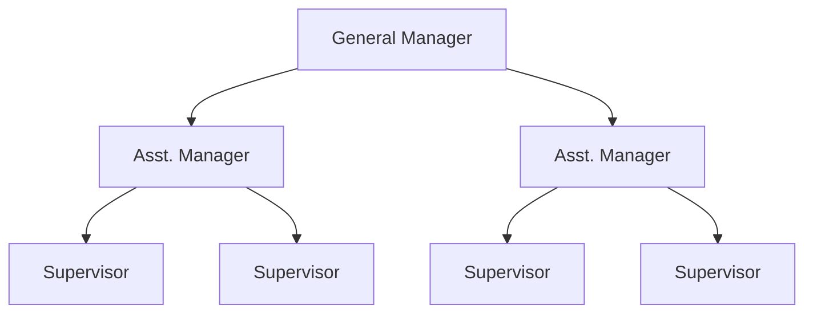
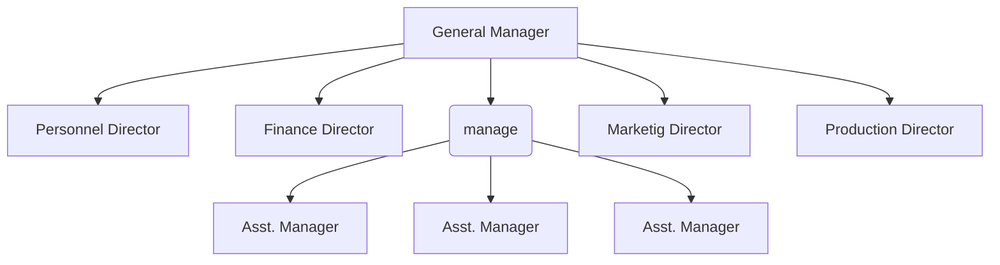
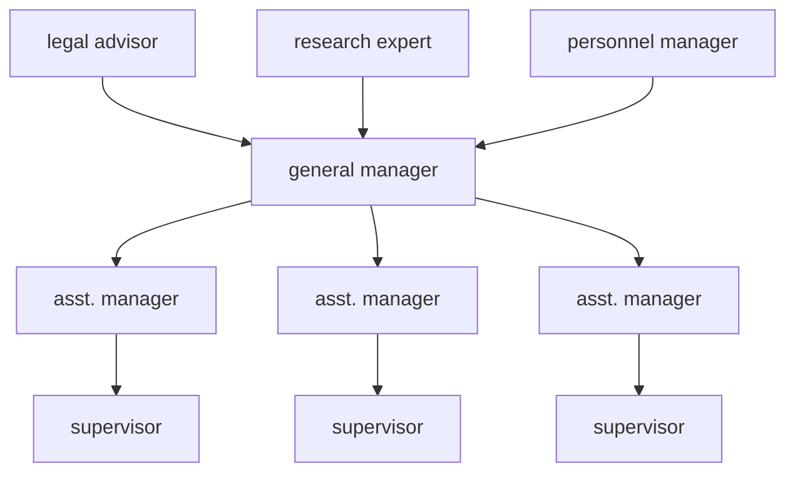

# ⁠A. Organization

## ⁠A.1. Definition of Organization
An organization is a **social structure** or entity in which two or more people work **interdependently** through structured patterns to accomplish a set of goals.

**Key Characteristics:**
- **Social System**: People use their knowledge and techniques to interact and work together
- **Technological System**: People use knowledge and techniques to transform inputs into outputs
- **Goal-Oriented System**: People work together for specific objectives
- **Open System**: Consists of interdependent parts that continually monitor and transact with the external environment
- **Coordination**: Of man, machine, and materials
- **Value Creation**: For stakeholders, stockholders, employees, community, and society
**Organization as a System:**
- An organization is an open system that:
    - Takes inputs from the environment (resources, information)
    - Transforms them through internal processes
    - Produces outputs (goods/services)
    - Receives feedback from the environment
    - Adapts to changes in external environment (technology, customer needs, market trends, regulations)
```
INPUT → PROCESSING → OUTPUT → FEEDBACK → ADAPTATION
(Resources) (Operations) (Products/Services) (Customer Response) (Changes)
```
---
## ⁠A.2. Necessity/Importance of Organization
**Why do we need organization?**
- People working together achieve more than working alone
- Organizations fulfill basic human needs (economic, social)
- Greater experience and potential
- Specialization and division of labor
- Continuity and stability
**Role of Organizations in Society:**
- Provide employment and livelihood
- Drive economic development
- Develop education systems, healthcare, technology
- Create products and services that improve quality of life
- Examples: Hospitals, Colleges, Banks, Telecommunication companies, Technology firms, Entertainment industry
**Role for Professional Growth of Employees:**
- Career development opportunities
- Skill enhancement and training
- Professional networking
- Performance feedback and growth
- Job security and stability
---
## ⁠A.3. Principles of Organization (Henry Fayol's Principles)
For an organization to run smoothly, the following principles must be followed:

| Principle                                     | Description                                                                                                          |
| --------------------------------------------- | -------------------------------------------------------------------------------------------------------------------- |
| **Division of Work**                          | Subdivision of work into specialized jobs assigned to respective employees; work specialization increases efficiency |
| **Authority and Responsibility**              | Authority is the right to decide and direct others; Responsibility is the obligation to perform work activities      |
| **Span of Control**                           | Number of people directly reporting to a supervisor (e.g., 20 employees under one supervisor)                        |
| **Chain of Command/Scalar Chain**             | Clear line of authority flowing from top to bottom; clarifies authority positions at all levels                      |
| **Unity of Command**                          | Each subordinate reports to only one superior; prevents confusion and conflicts                                      |
| **Unity of Direction**                        | Entire organization moves towards a common objective in a common direction                                           |
| **Discipline**                                | Common effort of workers; penalties applied when necessary                                                           |
| **Equity**                                    | Fair treatment of all employees with justice and respect                                                             |
| **Centralization**                            | Degree to which authority rests at top level; balance depends on specific organization                               |
| **Order**                                     | Each employee placed where they have the most value                                                                  |
| **Initiative**                                | Management should encourage employee initiatives and self-direction                                                  |
| **Remuneration**                              | Fair pay considering cost of living, qualifications, business conditions, responsibility                             |
| **Stability of Tenure**                       | Long-term employment is important for success                                                                        |
| **General Interest over Individual Interest** | Organizational success prioritized over individual stress                                                            |
| **Esprit de Corps**                           | "Union is Strength" - harmony and mutual understanding among members                                                 |

---
## ⁠A.4. Formal and Informal Organization

| Aspect            | Formal Organization                          | Informal Organization                                                 |
| ----------------- | -------------------------------------------- | --------------------------------------------------------------------- |
| **Definition**    | Official structure created by management     | Unofficial structure created within the organization                  |
| **Basis**         | Authority, responsibility, rules, procedures | Personal attitudes, culture, language, similar tastes, social factors |
| **Purpose**       | Accomplish organizational goals              | Fulfill social and personal needs                                     |
| **Formation**     | Deliberately planned                         | Naturally emerges through social interactions                         |
| **Leadership**    | Official leaders appointed by management     | Informal leaders chosen by group members                              |
| **Communication** | Formal channels                              | Unofficial communication (grapevine)                                  |
| **Power**         | Formal authority                             | Social influence                                                      |

**Relationship:**
- Informal organization exists within formal organization
- Can coexist within the same family/workplace
- Influences employee behavior strongly
- If management understands its nature, it can contribute to productivity
- Informal leaders may have greater power than formal leaders in getting things done
---
# ⁠B. Management
## ⁠B.1. Definition of Management
**Simple Definition:** Getting things done through other people.
**Comprehensive Definition:**
- The act of getting people together to achieve set goals using available resources effectively and efficiently
- The **brain of an organization**
- Coordination of human, material resources, and technology
- As old as human origin (Sun Tzu's "Art of War" - 6th century BC; Chanakya's "Arthashastra" - 300 BC)
**"Management is both a Science and an Art":**
- **As a Science**: Has systematic body of knowledge, principles, cause-effect relationships, can be tested and verified
- **As an Art**: Requires personal skills, creativity, practical application, and experience
- **Example**: A manager uses scientific principles (planning, organizing) but applies them artistically (motivating people, handling unique situations)
---
## ⁠B.2. Functions of Management (PODCC)

| Function         | Description                                                                               |
| ---------------- | ----------------------------------------------------------------------------------------- |
| **Planning**     | Thinking before doing; determining objectives and course of action                        |
| **Organizing**   | Developing framework that relates personnel, work assignments, and resources              |
| **Directing**    | Leadership, giving guidelines, supervising employees towards objectives                   |
| **Coordinating** | Efficient and effective running of organization through communication between individuals |
| **Controlling**  | Monitoring activities; comparing results achieved with goals set                          |

---
## ⁠B.3. Levels of Management

| Level                       | Responsibilities                                                       | Key Functions                                                                 |
| --------------------------- | ---------------------------------------------------------------------- | ----------------------------------------------------------------------------- |
| **Top Level Management**    | Higher authority; sets goals, objectives, policies, budgeting          | Decision making, setting rules and regulations, issuing orders and guidelines |
| **Middle Level Management** | Heads of functional departments; mediator between top and lower levels | Implementing policies set by top level                                        |
| **Lower Level Management**  | Supervisory level; responsible for day-to-day activities               | Supervision of workers, ensuring achievement of organizational goals          |

---
## ⁠B.4. Managerial Skills

| Skill Category           | Description                                                | Examples                                                   |
| ------------------------ | ---------------------------------------------------------- | ---------------------------------------------------------- |
| **Interpersonal Skills** | Interaction between people inside and outside organization | Communication, leadership, motivation, conflict resolution |
| **Informational Skills** | Gather information related to goals and operations         | Data collection, analysis, information processing          |
| **Decisional Skills**    | Use information gathered to make decisions                 | Problem-solving, strategic planning, resource allocation   |
**Qualities of a Good Manager:**
- Leadership ability
- Communication skills
- Decision-making capability
- Technical knowledge
- Human relations skills
- Conceptual thinking
- Integrity and honesty
- Adaptability and flexibility
- Vision and strategic thinking
---
## ⁠B.5. Models of Management

| Model                                   | Description                                                                                                                      |
| --------------------------------------- | -------------------------------------------------------------------------------------------------------------------------------- |
| **Hierarchical Management Model**       | Authority and responsibility flow from superiors; managers command resources and respond to superiors                            |
| **Task-Oriented Management Model**      | Focus on five major tasks: Planning, Organizing, Directing, Coordinating, Controlling (PODCC)                                    |
| **Allocation Management Model**         | Managers handle organizational resources (money, manpower, physical objects); obtain, allocate, share, monitor, return resources |
| **Team Effort Management Model**        | Managers and subordinates work as a team; cooperation, leadership, coordination; adds value through teamwork                     |
| **Knowledge-Oriented Management Model** | Managers learn through experience; transfer knowledge through teaching, guiding, training; adapt to external changes             |
| **Goal-Concentrated Management Model**  | Focuses on achieving organizational goals; management tools keep organization on established path                                |
**Note:** Organizations may choose to use all or a few of these models according to their needs.

---
## ⁠B.6. Importance of Management
- Proper planning to determine what is to be achieved
- Proper organizing to allocate resources and establish means to accomplish plans
- Proper influence to motivate and lead personnel towards goals
- Controlling activities and comparing results achieved with planned goals
- Ensuring coordination and efficiency
- Achieving organizational objectives effectively and efficiently
---
# ⁠C. Theories of Management
## ⁠C.1. Scientific Management Theory (Frederic W. Taylor)
**Historical Background:** Developed by Frederic W. Taylor in the early 1900's; first person to study management systematically.
**Core Beliefs:**
- Scientific approaches should be used to increase productivity and efficiency
- There is **one best way** of doing each task
- Select employees best suited for the job
- Provide necessary education and training related to the job
- Encourage friendly environment with separation of duties
**Taylor's Four Principles:**
1. **Motion Study**: Improved method of work
2. **Fatigue Study**: Prescribed amount of rest periods
3. **Time Study**: Specific standard of output
4. **Incentive Wages**: Payment by unit of output
**Practical Example - Bethlehem Steel Company:**
- Before: Labors picked 42 kgs of iron, average output 12.7 tons/labor, daily pay $1.14
- After: Average output rose to 48.8 tons/labor, daily pay rose to $1.85
**Applicability in Modern Organizations:**
- Still applicable in production and manufacturing processes
- Focus on efficiency and productivity remains relevant
- Modern applications: Lean manufacturing, Six Sigma, process optimization
- However, modern organizations also consider human factors and motivation
---
## ⁠C.2. Administrative Management Theory (Henry Fayol)
**Historical Background:** Henry Fayol (1842-1925), French Mining Engineer and Management Consultant; first to analyze functions of management.
**Three Major Contributions:**
1. Clear distinction between technical and managerial skills
2. Identified functions constituting management process (PODCC)
3. Developed 14 principles of management

**Fayol's 14 Principles of Management:**

| Principle                                         | Description                                                                                 |
| ------------------------------------------------- | ------------------------------------------------------------------------------------------- |
| **1. Division of Labor**                          | Work specialization; work divided into individuals and groups as per their specialization   |
| **2. Authority and Responsibility**               | Authority is right to decide and direct; Responsibility is obligation to perform activities |
| **3. Discipline**                                 | Requires common effort of workers; penalties applied when necessary                         |
| **4. Line of Authority/Scalar Chain**             | Clear chain of authorities from top to bottom; authority flows from top to bottom           |
| **5. Centralization**                             | Degree to which authority rests at top; balance depends on organization                     |
| **6. Unity of Direction**                         | Entire organization moves towards common objective in common direction                      |
| **7. Unity of Command**                           | Employees should have only one boss                                                         |
| **8. Order**                                      | Each employee placed where they have the most value                                         |
| **9. Initiative**                                 | Management should encourage employee initiatives and self-direction                         |
| **10. Equity**                                    | Treat all employees fairly with justice and respect                                         |
| **11. Remuneration**                              | Fair pay considering cost of living, qualification, business conditions, responsibility     |
| **12. Stability of Tenure**                       | Long-term employment is important for success                                               |
| **13. General Interest over Individual Interest** | Organizational success prioritized over individual stress                                   |
| **14. Esprit de Corps**                           | "Union is Strength" - harmony and mutual understanding                                      |

**Applicability in Today's Organizations:**
- Many principles still relevant (division of work, unity of command, discipline)
- Modern organizations may adapt principles based on context
- Digital transformation has changed some aspects but core principles remain
---
## ⁠C.3. Behavioral Management Theory (Elton Mayo)
**Historical Background:** Developed by Elton Mayo and associates in the 1920's; challenged scientific management's focus on monetary incentives.
**Core Beliefs:**
- Productivity not necessarily increased through monetary incentives
- Human behavior and social environment play important roles
- Organization is a social system
- Individuals motivated by complex hierarchy of needs
- Intergroup relationships strongly influence performance
**Hawthorne Experiment (Three Studies over 5 Years):**

| Study                            | Description                                                                     | Findings                                                                                     |
| -------------------------------- | ------------------------------------------------------------------------------- | -------------------------------------------------------------------------------------------- |
| **Relay Assembly Test Room**     | 6 girls working on telephone assemblies; studied factors affecting productivity | Productivity increased due to social and psychological factors, not just physical conditions |
| **Interviewing Program**         | Over 2100 people interviewed over 3 years                                       | Individual needs and informal group roles significantly impact performance                   |
| **Bank Wiring Observation Room** | 14 males observed at work                                                       | Social interaction positively impacts performance and quality                                |

**Key Conclusions:**
- Special attention from managers improves output (Hawthorne Effect)
- Organization is a social system
- Individuals motivated by social factors, not just monetary incentives
- Working in groups enhances performance
- Worker satisfaction based on productivity and effectiveness
- Better communication between levels is important
- Management requires both technical and social skills
---
## ⁠C.4. Modern Management Theories
**A. Contingency Approach:**
- Integrative approach that fits together both theories
- Assumes no single theory is universally best
- Ideas must be applied selectively based on situation
- Necessary to determine organization's situation and choose which theory works best
**B. System Approach:**
- Concentrates on efficient use of available resources to produce desirable outputs
- Organization uses inputs (capital, physical and human resources) and transforms into outputs
- Necessary to recognize internal and external environment
- Changes in environment directly affect performance
**Which Theory is Best for Organizations in Nepal?**
- Depends on the organization's size, nature, and context
- Small organizations may benefit from scientific management
- Large organizations may need modern approaches
- Context of Nepal: traditional values, hierarchical structures, growing technology adoption
---
# ⁠D. Forms of Ownership
## ⁠D.1. Single Ownership (Sole Proprietorship)
**Definition:** Oldest, simplest, and most popular form; owned and controlled by single person; formed to fulfill own goals using own resources.
**Key Features:**
- Total control and freedom to run business in owner's own way
- Owner bears all profit or loss
- Unlimited liability (owner assumes all debts)
- Government has limited control
- Usually profit motive
**Advantages:**

| Advantage                      | Description                                                      |
| ------------------------------ | ---------------------------------------------------------------- |
| **Easy to Form and Dissolve**  | No legal formalities; can start or stop as per owner's comfort   |
| **Easy to Manage**             | No confusion; full control; less conflict                        |
| **Direct Motivation**          | Profit/loss wholly borne by owner; more work means more money    |
| **Absolute Control**           | Full control over business; can make any changes as desired      |
| **Business Secrecy**           | No sharing of trade secrets; no risk of leakage                  |
| **Prompt Decision Making**     | No need to discuss changes with anyone                           |
| **Flexibility in Operation**   | Single owner makes all decisions, takes all risks, assigns tasks |
| **Personal Relations**         | Direct contact with customers and employees; better feedback     |
| **Limited Government Control** | Minimum government involvement                                   |
**Disadvantages:**

| Disadvantage                      | Description                                                                  |
| --------------------------------- | ---------------------------------------------------------------------------- |
| **Limited Financial Resources**   | Difficulty raising large capital                                             |
| **Limited Managerial Skills**     | One person may not excel in all aspects (production, marketing, finance, HR) |
| **Uncertain Duration**            | Business may collapse with owner's death, accident, or loss of funds         |
| **Unlimited Liability**           | Personal assets may be required to pay business debts                        |
| **Health Issues/Time Management** | Overwork may affect owner's health                                           |

---
## ⁠D.2. Partnership
**Definition:** Formed when two or more people join hands to work together, sharing profit and loss equally or as per agreement.
**Key Features:**
- Mutual understanding between partners
- Partnership deed (written agreement) contains terms and conditions
- Private organization
- Increases resources, capital, skills, and manpower
**Advantages:**

| Advantage                     | Description                                                  |
| ----------------------------- | ------------------------------------------------------------ |
| **Easy to Form and Dissolve** | No major legal formalities; can dissolve with mutual consent |
| **Large Resources**           | More capital than single ownership                           |
| **Better Skills and Ability** | Diversity in skills and knowledge                            |
| **Quick Decisions**           | Partners can meet in person for quick decisions              |
**Disadvantages:**

| Disadvantage                | Description                                       |
| --------------------------- | ------------------------------------------------- |
| **Instability in Business** | Conflict between partners may cause instability   |
| **Liability**               | All partners liable for actions of other partners |
| **Misunderstanding**        | Confusion can occur; decisions need to be shared  |

---
## ⁠D.3. Joint Stock Company
**Definition:** Association of individuals for carrying on trade or business; also called corporations or limited companies.
**Key Features:**
- Capital collected by selling shares to shareholders
- Certificate of shares provided; flexibility to sell or transfer shares
- Profit shared proportionally to shares
- Managed by Board of Directors elected at Annual General Meeting
- Limited liability for shareholders
**Advantages:**

| Advantage                     | Description                                                       |
| ----------------------------- | ----------------------------------------------------------------- |
| **Large Financial Resources** | Capital from large number of shareholders; can issue fresh shares |
| **Limited Liability**         | Liability limited to face value of shares owned                   |
| **Transferability of Shares** | Shares can be sold or transferred freely                          |
| **Continuity of Existence**   | Not affected by death of shareholders                             |
| **Efficient Management**      | Can afford professional, experienced managers                     |
| **Social Benefits**           | Creates employment, investment opportunities                      |
| **Economies of Scale**        | Large-scale production at lower costs                             |
| **Public Confidence**         | Transparent operations; annual audit reports published            |

**Disadvantages:**

| Disadvantage                        | Description                                                       |
| ----------------------------------- | ----------------------------------------------------------------- |
| **Difficulty in Formation**         | Complex legal procedures; lengthy and expensive process           |
| **Lack of Personal Interest**       | Shareholders lack say in operations; directors work on commission |
| **Lack of Secrecy**                 | Public audit reports; operations predetermined in board meetings  |
| **Delay in Decision Making**        | Decisions by board of directors; time-consuming                   |
| **Excessive Government Regulation** | Must comply with many laws and regulations                        |

**Process of Formation of a Joint Stock Company in Nepal:**
1. **Promotion Stage:** Identify business opportunity; prepare feasibility study; arrange initial capital
2. **Incorporation Stage:** Apply for company registration with the Office of Company Registrar; submit required documents (Memorandum of Association, Articles of Association)
3. **Capital Subscription Stage:** Issue prospectus; collect share capital from public
4. **Commencement of Business Stage:** Obtain Certificate of Commencement of Business; start operations
**Required Documents for Private Company Registration in Nepal:**
- Memorandum of Association
- Articles of Association
- Company registration application form
- Identity documents of promoters/directors
- Proposed company name clearance letter
- Proof of registered office address
- Tax registration (PAN) documents
---
## ⁠D.4. Cooperative Societies
**Definition:** Voluntary association of individuals for mutual social, economic, and cultural benefit; not primarily for profit motive but for rendering services.
**Key Features:**
- At least 10 members; maximum up to 100
- Membership open to anyone
- Created with association of community members with limited resources
- Capital from members; rest through government loans and grants
- Based on self-help, self-responsibility, democracy, equality
- **"One Man One Vote"** principle regardless of shares owned
- Fixed rate of dividend
- Part of profit for social welfare; part as bonus based on effort
**Types of Cooperatives:**

| Type                             | Description                                                                                                    |
| -------------------------------- | -------------------------------------------------------------------------------------------------------------- |
| **Producer's Cooperatives**      | Help small producers compete with large-scale producers; provide raw materials, tools; sell products in market |
| **Consumer's Cooperatives**      | Make day-to-day goods available to members at cheaper prices; buy bulk at wholesale, sell at slightly higher   |
| **Marketing Cooperatives**       | Help sell agricultural products or small manufactured products; organized by farmers or small producers        |
| **Housing Cooperatives**         | Help members own homes; common in urban areas; land allotted by city authorities at reasonable prices          |
| **Cooperative Credit Societies** | Utilize member savings to provide loans to members at favorable terms                                          |

**Advantages:**

| Advantage                   | Description                                        |
| --------------------------- | -------------------------------------------------- |
| **Easy Formation**          | Voluntary association; at least 10 members needed  |
| **Democratic Functioning**  | "One man one vote" regardless of shares            |
| **Limited Liability**       | Liability limited to capital invested by members   |
| **Reducing Inequalities**   | Benefits poor; helps bridge rich-poor gap          |
| **Government Assistance**   | Appreciation from government and local authorities |
| **Continuity of Existence** | Not affected by death of shareholders              |

**Disadvantages:**

| Disadvantage                  | Description                                             |
| ----------------------------- | ------------------------------------------------------- |
| **Limited Capital**           | Membership confined to certain community; limited funds |
| **Lack of Managerial Talent** | Handled by own members; limited skills                  |
| **Lack of Secrecy**           | Operations shared within community                      |
| **Lack of Motivation**        | Dividends limited; management committee less motivated  |

---
## ⁠D.5. Public Corporation
**Definition:** Organization formed by the government for social welfare and non-profit objectives. Historical: 20 formed between 1936-1939.
**Advantages:**

| Advantage                   | Description                                                          |
| --------------------------- | -------------------------------------------------------------------- |
| **Unlimited Resources**     | Raise large funds through sale of securities; shares publicly traded |
| **Limited Liability**       | Shareholders not liable for debts                                    |
| **Continuity of Existence** | Not affected by death of shareholders                                |

**Disadvantages:**

| Disadvantage                        | Description                                                         |
| ----------------------------------- | ------------------------------------------------------------------- |
| **Difficulty in Formation**         | Complex legal procedures                                            |
| **Excessive Government Regulation** | Must comply with government laws                                    |
| **Lack of Secrecy**                 | Public operations                                                   |
| **Political Influence**             | Appointments may be politically motivated; may lack required skills |

---
# ⁠E. Organizational Structure
## ⁠E.1. Definition
Refers to division of labor and patterns of coordination, communication, workflow, and formal power. Represents the hierarchical arrangement of various positions. Defines who directs whom and who reports to whom.

---
## ⁠E.2. Line Organization
**Definition:** Simplest form; represents direct vertical relationships with authority flowing from topmost executive to lower supervisor levels. Authority decreases with each successive level.
**Diagram:**


**Advantages:**
- Very simple to establish and easily understood
- Clear identification of authority and responsibility
- Ensures better discipline
- Facilitates unity of command
- Prompt decision making possible
**Disadvantages:**
- Authority concentrated at top; poor performance at top affects organization
- Lack of effectiveness as firm grows; top executive overloaded
- Only suitable for small organizations
- Lack of specialization may hamper future growth
---
## ⁠E.3. Functional Organization
**Definition:** Developed by F.W. Taylor; organization divided into units based on functions (production, marketing, finance, personnel). Each unit under charge of different person. If a person performs several functions, they report to multiple functional heads.
**Diagram:**


**Advantages:**
- Specialization of work
- Functional incharge expert in their area
- Easier to develop executives
- Reduces burden on top executives
**Disadvantages:**
- Can be too complicated for employees
- Violates unity of command principle
- Functional manager may focus on own department only
- Delay in decision making involving multiple specialists
---
## ⁠E.4. Line and Staff Organization
**Definition:** Line authority flows down as in line organization, with addition of specialists (staff) attached to line managers to advise on business matters. Staff executives provide advice and information for better performance.
**Diagram:**

**Advantages:**
- Line managers benefit from specialized knowledge of staff
- Staff executives help make better decisions
- More flexible; helpful when organization grows
- Shares stressful duties of top executives
**Disadvantages:**
- Conflicts may occur between line and staff executives
- Allocation of duties not always clear
- Staff executives tend to be theoretical; line executives more practical
- Staff executives not accountable for results
---
## ⁠E.5. Committee Organization
**Definition:** Two or more persons appointed by higher authority for the purpose of advising. May be standing committee or for limited duration. May or may not have authority.
**Advantages:**
- Brings together wide range of ideas, expertise, and interests
- Ensures all aspects of organization are considered in decision making
**Disadvantages:**
- Delay in decision making
- Decisions may be based on compromise rather than what's best
**Which Structure is Best for Temporary Engineering Projects?**
- **Project-based Organization** or **Matrix Organization**
- **Reasons:**
    - Temporary nature of projects
    - Requires diverse expertise
    - Need for flexibility
    - Clear accountability
    - Resource pooling
    - Expert coordination
---
# ⁠F. Purchasing and Marketing Management
## ⁠F.1. Purchasing Management
**Definition:** Activity of acquiring goods and services by payment to accomplish organizational goals. Includes procurement of materials, machines, tools, and equipment.
**Key Responsibility:** Buy materials of **right quality**, **right quantity**, at **right time**, from **right sources**, with delivery at **right place**.

| Function                  | Description                           |
| ------------------------- | ------------------------------------- |
| **What to Purchase**      | Buy materials of right quality        |
| **How Much to Purchase**  | Buy materials of right quantity       |
| **What Rate to Purchase** | Buy materials at right price          |
| **When to Purchase**      | Buy materials at right time           |
| **Where to Purchase**     | Buy materials from reliable suppliers |

**Methods of Purchasing:**

| Method                        | Description                                                                                                |
| ----------------------------- | ---------------------------------------------------------------------------------------------------------- |
| **Direct Purchase Procedure** | Immediate purchase of materials directly from suppliers                                                    |
| **Quotation Procedure**       | Collect price quotations from at least three suppliers; evaluate and choose suitable supplier              |
| **Tender Procedure**          | Advertise requirements in newspapers/media; collect tenders from interested suppliers; evaluate and choose |
**Tender:** Written document provided by suppliers consisting of price quotations, terms, and conditions for supply of goods.

**Steps of Purchasing Process:**
1. Identify required materials from different departments
2. Inquiry to suppliers
3. Receive price quotations
4. Prepare comparative statement and evaluate
5. Choose/Approve supplier
6. Place order; send copies to departments, storage, accounts
7. Follow up the order
8. Receive orders; inform respective departments
9. Inspect materials; create reports/records
10. Request accounts department for payment
11. Allocate materials as per requirements
---
## ⁠F.2. Marketing Management
**Definition:** Process of communicating the value of products or services to consumers; organizational function for creating, delivering, and communicating value to customers; managing customer relationships for mutual benefit.
**Four P's of Marketing:**
1. **Product:** Developed based on market research; should meet user needs
2. **Pricing:** Setting price for the product
3. **Placement:** How product reaches buyer (online, retail, wholesale)
4. **Promotion:** Advertising, sales promotion, publicity, branding
**Marketing Concept:**
- Satisfying customers by selling products meeting their needs
- Objective: Making profit by satisfying customers, not just volume sales
- Based on three beliefs:
    1. **Customer Oriented:** Company should be customer-focused
    2. **Profit Oriented:** Profitable sales volume should be goal
    3. **Satisfaction of Customers:** Products based on customer satisfaction
**Marketing Research:**
- Activity to gain information about potential buyers
- Four key elements:
    1. **Analysis of Current Activities:** Monitor current sales trends
    2. **Market Intelligence:** Know what competitors are planning
    3. **Market Analysis:** Gather customer reactions to products/ pricing
    4. **Product Evaluation:** Determine strategy effectiveness; analyze needed changes
**Functions of Marketing:**

| Function                          | Description                                                                                       |
| --------------------------------- | ------------------------------------------------------------------------------------------------- |
| **Pricing**                       | Setting price at right level as per demand and quality                                            |
| **Buying**                        | What, where, how much, from whom, when, at what price                                             |
| **Selling**                       | Core of marketing; supplying products to buyers for payment                                       |
| **Distribution**                  | Determining best ways for customers to locate, obtain, use products                               |
| **Financing**                     | Budgeting for marketing activities; obtaining resources                                           |
| **Product/Service Management**    | Designing, developing, maintaining, acquiring products meeting consumer needs                     |
| **Market Information Management** | Obtaining, managing information about customer wants; improving decision making                   |
| **Promotion**                     | Communicating with customers; includes advertising, personal selling, publicity, public relations |
**Importance of Marketing in Modern Digital Era:**
- Digital marketing expands reach globally
- Social media enables direct customer engagement
- Data analytics enables personalized marketing
- E-commerce facilitates 24/7 accessibility
- Cost-effective digital advertising
- Real-time feedback and market research
- Customer relationship management (CRM) systems
**Salesmanship in Marketing:**
- Salesmanship is indeed an important ingredient of marketing
- Personal selling creates customer relationships
- Builds trust and loyalty
- Provides immediate feedback
---
## ⁠F.3. Advertising
**Definition:** Form of marketing used to encourage or persuade consumers to take action upon a product.
**Forms:** Newspapers, magazines, media, online sources, TV, door-to-door selling, billboards, sales promotions
**Importance of Advertising:**
- Increases sales by creating awareness
- Makes consumers conscious about products and brands
- Makes organizations popular within potential buyers
- Informs customers about product features and benefits
- Builds brand recognition and loyalty
- Differentiates products from competitors
**Advertising as Best Form of Marketing:**
- Reaches large audiences
- Creates product awareness
- Builds brand image
- Can be targeted to specific demographics
- Cost-effective per impression
- Works across multiple channels
---