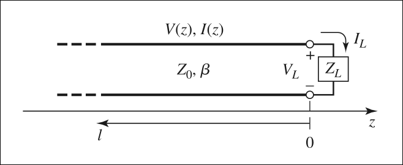

# ⁠A. Definition

Transmission lines
- are hard or soft **media for transmission or guidance of energy** from source to load with or without losses.
- are **conductor assemblies** of some predefined form that are designed to **carry radio frequency**.
- e.g., 2-wired parallel lines, co-axial lines, waveguide, optical fiber, star squad, strip lines, microstrips, twin lead, free-space, etc.

----

# ⁠B. Physical Properties

Some general physical factors need to be considered while choosing a proper transmission line, which can be summarized as:
- Indoor or outdoor use
- Operating Frequency
- Power handling needs
- Surrounding environment
- Electrical Interference
- Cost and sizes

---

# ⁠C. Electrical Properties and Parameters

Factors that need to be considered to characterize the electrical properties of any transmission line are listed below.
- Input impedance (Z$_S$)
- Line (surge or characteristic) impedance (Z$_0$)
- Load impedance (Z$_L$)
- Line resistance (R, $\Omega$/m)
- Self-inductance (L, H/m)
- Capacitance between the conducting lines (C, F/m)
- Conductance between the conductors (G, Mho /m)

Each parameter is defined with suitable expression subsequently in following sections.

---

# ⁠D. Transmission Line Equations

- Consider a uniform transmission line in a homogenous medium
    - to be made up of a cascade of short sections of length $\Delta$z
- Each such short section can be modeled 
    - in the form of a lumped element circuit as shown in figure
    - 
- The parameters R, L, G and C represent, Resistance, Inductance, Conductance and capacitance per unit length of the line.
- As illustrated in the figure,
    - the voltage and current are function of time and posistion along the line.
- Applying Kirchhoff's Voltage law to the circuit we have,
    $$\begin{equation} v(z+\Delta z) - v(z, t) = -R \Delta z\ i(z, t) - L\Delta z \dfrac{\partial i (z,t)}{\partial t}\end{equation}$$
- Similarly, applying Kirchhoff's current law to the circuit at Fig, we can write:
    $$\begin{equation} v(z+\Delta z, t) - i(z, t)= -G\Delta z\ v(z,t) - C\Delta z \dfrac{\partial v(z+\Delta z, t)}{\partial t} \end{equation}$$
- On dividing by $\Delta z$ (unit length) and letting $\Delta z$ approach zero, equation (1) can be written as:
    $$\begin{equation} \dfrac{\partial i(z, t)}{\partial z} = -R\ i(z, t) - L \dfrac{\partial i(z,t)}{\partial t}\end{equation}$$
- Dividing equation (2) by $\Delta z$ and letting $\Delta z$ approach zero, we get:
    $$\begin{equation} i(z+\Delta z, t) - i(z, t)= -G v(z,t) - C \dfrac{\partial v(z, t)}{\partial t} \end{equation}$$
- These are the time domain form of the transmission line equations , also known as **telegrapher equations**.
- For the sinusoidal steady-state condition, with cosine-based phasors, (3) and (4) simplify to:
    $$\begin{align}
        \dfrac{d V(z)}{dz} &= - (R+j\omega  L)\ I(z)\\
        \dfrac{d I(z)}{dz} &= - (G+j\omega  C)\ V(z)
    \end{align}$$
- Where $(R+j\omega  L)$ and $(G+j\omega  C)$ are the series impedance and shunt admittance, respectively, per unit length of the line
- Combining (5) and (6), the transmission line equations can be written as:
   $$\begin{align}
        \dfrac{d^2 V(z)}{dz^2} &= - \gamma^2 V(z)\\
        \dfrac{d^2 I(z)}{dz^2} &= - \gamma^2 I(z) 
    \end{align}$$ 
- where,
    $$\begin{equation}
    \gamma = (\alpha + j\beta) = \sqrt{(R+j\omega L)(G + j\omega C)}
    \end{equation}$$

## ⁠D.1. Propagation Constant and characteristic Impedance

- In (9), $\gamma$ is the complex propagation constant
    - the real part of which gives the attenuation constant $\alpha$ and the imaginary part, the phase constant $\beta$
- The general solution of (7) and (8) can be written in the form,
    $$\begin{align}
        V(z) &= V_0^+ e^{-\gamma z} + V_0^- e^{\gamma z}\\
        I(z) &= I_0^+ e^{-\gamma z} - I_0^- e^{\gamma z}
    \end{align}$$
- The terms $e^{-\gamma z}$ $e^{\gamma z}$ in (10 , 11) represent wave propagation in the +z and -z directions, respectively.
- Differentiating (10) w.r.t. z and using in (5) and (9), we can express I(z) in the form,
    $$\begin{equation}
        I(z) = \dfrac{1}{Z_0} \left[ V_0^+ e^{-\gamma z} + V_0^- e^{\gamma z} \right]
    \end{equation}$$
- where, 
    $$\begin{equation}
        Z_0 = \sqrt{\dfrac{R + j\omega L}{G + j\omega C}}
    \end{equation}$$
- Z$_0$ is the characteristic impedance of the line.
- Comparing (11) with (12), we note:
    $$\begin{equation}
        \dfrac{V_0^+}{I_0^+} = \dfrac{V_0^-}{I_0^-} = Z_0
    \end{equation}$$
- For a lossy transmission line as above,
    - the propagation constant and the characteristic impedance are both complex.
- In most practical cases,
    - the losses in the line are so small (R << $\omega$L, G << $\omega$C) that they can be neglected.

### ⁠D.1.a. Lossless Line
- The propagation parameters for the lossless line are obtained by setting R = G = 0.
- With this, the attenuation constant $\alpha$ becomes zero.
- The phase constant and phase velocity are given by,
    $$\begin{align}
        \beta &= \dfrac{2\pi}{\lambda} &&= \omega\sqrt{LC}\\
        v &= \dfrac{\omega}{\beta} &&= \dfrac{1}{\sqrt{LC}}
    \end{align}$$
- where $\lambda$ is the guide wavelength.
- The expression for Z$_0$ is
    $$\begin{equation}
        Z_0 = \sqrt{\dfrac{L}{C}} = \dfrac{1}{vC}
    \end{equation}$$

### ⁠D.1.b. Terminated Lossless Line

- Consider a transmission line of characteristic impedance Z$_0$ terminated in arbitrary load impedance, Z$_t$ as in figure:
    - 
- We assume the line to be loss less $(\alpha = 0)$ and consider the load to located at z = 0.
- Using the expression given by (10, 12), the voltage and current at a distance $z = -l$ (as seen from load), input impedance seen looking toward the load can be written as
    $$\begin{align}
        V(-l) = V_0^+ ( e^{j\beta l} + \Gamma_t e^{-j\beta l})\\
        I(-l) = \dfrac{V_0^+}{Z_0} ( e^{j\beta l} + \Gamma_t e^{-j\beta l})
    \end{align}$$
- In (18, 19), is the (voltage) reflection coefficient at the load and is given by the ratio of the amplitude of the reflected wave to that of the incident wave.
    $$\begin{equation}
        \Gamma_t = \dfrac{V_0^-}{V_0^+}
    \end{equation}$$
- At the load end, we have V$_t$ = I$_t$ Z$_t$, where, 
    - V$_t$ and I$_t$ can be obtained by setting l = 0 in (18, 19).
- Thus by applying this condition, we can relate the reflection coefficient at the load to the load impedance.
    $$\begin{equation}
        Z_t = Z_0 \left( \dfrac{1 + \Gamma_t}{1 - \Gamma_t} \right)\ \text{ or }\ \Gamma_t = \dfrac{Z_t + Z_0}{Z_t + Z_0}
    \end{equation}$$
- Note that the total sum of the reflection coefficient and transmission coefficient (T$_t$) should be unity ($T_t + \Gamma_t = 1$).
- From (18, 19), we note that the voltage and current on the line consist of the superposition of incident and reflected waves.
- Such waves are called **standing waves**.
- There is no reflected wave on the line, **only when** $\Gamma_t$ = 0
    - i.e. when the load impedance Z$_t$ is equal to the characteristic impedance Z$_0$ of the line.
    - With this condition, the line is matched, since the incident power is completely absorbed by the load.
    - At any point z = -l (as looking from load) along the line, the time average power flow is given by:
    $$\begin{equation}
        P_{av} = \dfrac{1}{2} \Re\left[ V(-l) I(-l)^* \right] = \dfrac12 \Re \left[ 1 - \Gamma_l^* e^{j2\beta l} + \Gamma_l e^{-j2\beta l} - |\Gamma_l|^2 \right]
    \end{equation}$$
- The sum of the middle two terms within the square bracket is purely imaginary, and hence (22) reduces to:
    $$\begin{equation}
        P_{av} = \dfrac12 \dfrac{|V_0^+|^2}{Z_0} [1 - |\Gamma_l|^2]
    \end{equation}$$
- In (23), the first term gives the incident power and the second term gives the reflected power.
- Thus the power delivered to the load is equal to the incident power minus the refelcted power.

### ⁠D.1.c. Return Loss

- When the load is mismatched, the power loss to the load is expressed in terms of reflection loss, also called return loss (RL) in dB and is given by the expression
    $$\begin{equation}
        \text{Return Loss (RL)} = -20\log_{10} |\Gamma_l| dB
    \end{equation}$$
- Thus, for a matched load ($\Gamma_l = 0$),
    - the return loss is infinite dB.
- For the total reflection ($\Gamma_l = 1$),
    - the return loss is 0 dB.

### ⁠D.1.d. Voltage Standing Wave Ratio (VSWR)

- When the load is mismatched, the presence of the reflected wave superposes on the incident wave to give rise to a standing wave on the line.
- That is, the magnitude of the voltage on the line does not remain constant.
- Setting $\Gamma_l$ = $|\Gamma_l| e^{j\theta}$ in (18), the magnitude of the voltage at any point $z = -l$ on the line can be expressed as
    $$\begin{equation}
        |V(-l) = |V_0^+| |1+ \Gamma_l e^{j(\theta - 2\beta l)} |
    \end{equation}$$
- where l is the distance measured from the load towards the source and $\theta$ is the phase angle of $\Gamma_l$.
- We note from (25) that the magnitude of the voltage oscillates along the line.
- The maximum value (V$_{max}$) occurs at points where ($\theta - 2\beta l$) = $2n\pi$
- The minimum value (V$_{min}$) occurs at points where $(\theta - 2\beta l)$ = $(2n+1)\pi$ where n is an integer
- the ratio of expression for VSWR is:
    $$\begin{equation}
        \text{VSWR} = \dfrac{V_{max}}{v_{min}} = \left( \dfrac{1 + |\Gamma_l|}{1 - |\Gamma_l|} \right)\
    \end{equation}$$

### ⁠D.1.e. Input Impedance

- At a distance $l$ from the load, the impedance Z$_{in}$ seen towards the load can be obtained from (18).
    $$\begin{equation}
        Z_{in} = \dfrac{V(-l)}{I(-l)} = \dfrac{Z_0 (e^{j\beta l} + \Gamma_l e^{-j\beta l})}{e^{j\beta l} - \Gamma_l e^{-j\beta l}}
    \end{equation}$$
- Subtituting for $\Gamma_l$ from (21).
    $$\begin{equation}
        Z_{in} = \dfrac{Z_0 (e^{j\beta l} + j Z_0\tan(\beta l))}{Z_0 + jZ_0 \tan(\beta l)}
    \end{equation}$$
- This is the input impedance of a section of transmission line of characteristic impedance Z$_0$ terminated in a load Z$_t$.
- From (28), we note:
    $$\begin{align}
        Z_in = Z_l \text{, for } l = \dfrac{n\lambda}{2}, n = 1, 2, 3 ...\\
        Z_in = \dfrac{Z_0^2}{Z_l} \text{, for } l = \dfrac{n\lambda}{4}, n = 1, 3, 5 ...
    \end{align}$$
- From (29, 30), we note:
    - load impedance repeats itself on the transmission line for every 1/2 wavelength
        - irrespective of the characteristic impedance of the line.
- from (30), we note:
    - 1/4 wavelength (or odd multiples of quarter wavelength) long transmission line inverts the load impedance about the characteristic impedance of the line.

---

# ⁠E. Smith Chart and Graphical Solutions of Transmission Line Theory

Numerical sodxa, so short note haru paxi banauxu

