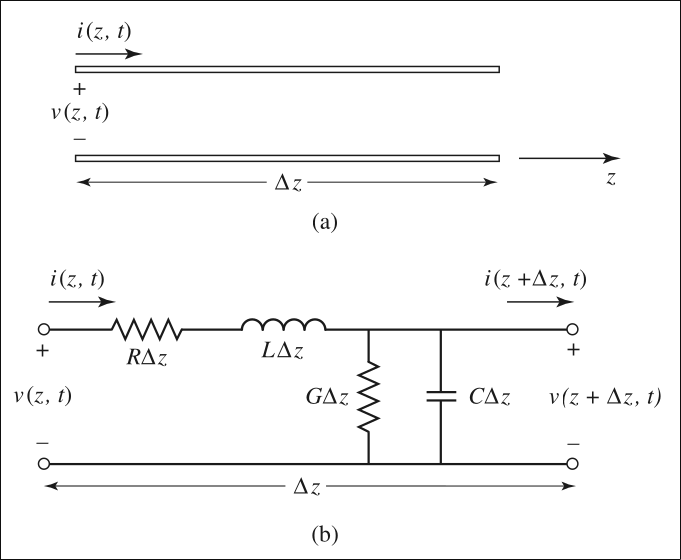

# Definition

Transmission lines
- are hard or soft **media for transmission or guidance of energy** from source to load with or without losses.
- are **conductor assemblies** of some predefined form that are designed to **carry radio frequency**.
- e.g., 2-wired parallel lines, co-axial lines, waveguide, optical fiber, star squad, strip lines, microstrips, twin lead, free-space, etc.

----

# Physical Properties

Some general physical factors need to be considered while choosing a proper transmission line, which can be summarized as:
- Indoor or outdoor use
- Operating Frequency
- Power handling needs
- Surrounding environment
- Electrical Interference
- Cost and sizes

---

# Electrical Properties and Parameters

Factors that need to be considered to characterize the electrical properties of any transmission line are listed below.
- Input impedance (Z$_S$)
- Line (surge or characteristic) impedance (Z$_0$)
- Load impedance (Z$_L$)
- Line resistance (R, $\Omega$/m)
- Self-inductance (L, H/m)
- Capacitance between the conducting lines (C, F/m)
- Conductance between the conductors (G, Mho /m)

Each parameter is defined with suitable expression subsequently in following sections.

# Transmission Line Equations

- Consider a uniform transmission line in a homogenous medium
    - to be made up of a cascade of short sections of length $\Delta$z
- Each such short section can be modeled 
    - in the form of a lumped element circuit as shown in figure
    - 
- The parameters R, L, G and C represent, Resistance, Inductance, Conductance and capacitance per unit length of the line.
- As illustrated in the figure,
    - the voltage and current are function of time and posistion along the line.
- Applying Kirchhoff's Voltage law to the circuit we have,
    $$\begin{equation} v(z+\Delta z) - v(z, t) = -R \Delta z\ i(z, t) - L\Delta z \dfrac{\partial i (z,t)}{\partial t}\end{equation}$$
- Similarly, applying Kirchhoff's current law to the circuit at Fig, we can write:
    $$\begin{equation} v(z+\Delta z, t) - i(z, t)= -G\Delta z\ v(z,t) - C\Delta z \dfrac{\partial v(z+\Delta z, t)}{\partial t} \end{equation}$$
- On dividing by $\Delta z$ (unit length) and letting $\Delta z$ approach zero, equation (1) can be written as:
    $$\begin{equation} \dfrac{\partial i(z, t)}{\partial z} = -R\ i(z, t) - L \dfrac{\partial i(z,t)}{\partial t}\end{equation}$$
- Dividing equation (2) by $\Delta z$ and letting $\Delta z$ approach zero, we get:
    $$\begin{equation} i(z+\Delta z, t) - i(z, t)= -G v(z,t) - C \dfrac{\partial v(z, t)}{\partial t} \end{equation}$$
- These are the time domain form of the transmission line equations , also known as **telegrapher equations**.
- For the sinusoidal steady-state condition, with cosine-based phasors, (3) and (4) simplify to:
    $$\begin{align}
        \dfrac{d V(z)}{dz} &= - (R+j\omega  L)\ I(z)\\
        \dfrac{d I(z)}{dz} &= - (G+j\omega  C)\ V(z)
    \end{align}$$
- Where $(R+j\omega  L)$ and $(G+j\omega  C)$ are the series impedance and shunt admittance, respectively, per unit length of the line
- Combining (5) and (6), the transmission line equations can be written as:
   $$\begin{align}
        \dfrac{d^2 V(z)}{dz^2} &= - \gamma^2 V(z)\\
        \dfrac{d^2 I(z)}{dz^2} &= - \gamma^2 I(z) 
    \end{align}$$ 
- where,
    $$\begin{equation}
    \gamma = (\alpha + j\beta) = \sqrt{(R+j\omega L)(G + j\omega C)}
    \end{equation}$$

## Propagation Constant and characteristic Impedance

- In (9), $\gamma$ is the complex propagation constant
    - the real part of which gives the attenuation constant $\alpha$ and the imaginary part, the phase constant $\beta$
- The general solution of (7) and (8) can be written in the form,
    $$\begin{align}
        V(z) &= V_0^+ e^{-\gamma z} + V_0^- e^{\gamma z}\\
        I(z) &= I_0^+ e^{-\gamma z} - I_0^- e^{\gamma z}
    \end{align}$$
- The terms $e^{-\gamma z}$ $e^{\gamma z}$ in (10 , 11) represent wave propagation in the +z and -z directions, respectively.
- Differentiating (10) w.r.t. z and using in (5) and (9), we can express I(z) in the form,
    $$\begin{equation}
        I(z) = \dfrac{1}{Z_0} \left[ V_0^+ e^{-\gamma z} + V_0^- e^{\gamma z} \right]
    \end{equation}$$
- where, 
    $$\begin{equation}
        Z_0 = \sqrt{\dfrac{R + j\omega L}{G + j\omega C}}
    \end{equation}$$
- Z$_0$ is the characteristic impedance of the line.
- Comparing (11) with (12), we note:
    $$\begin{equation}
        \dfrac{V_0^+}{I_0^+} = \dfrac{V_0^-}{I_0^-} = Z_0
    \end{equation}$$
- For a lossy transmission line as above,
    - the propagation constant and the characteristic impedance are both complex.
- In most practical cases,
    - the losses in the line are so small (R << $\omega$L, G << $\omega$C) that they can be neglected.

### Lossless Line
- The propagation parameters for the lossless line are obtained by setting R = G = 0.
- With this, the attenuation constant $\alpha$ becomes zero.
- The phase constant and phase velocity are given by,
    $$\begin{align}
        \beta &= \dfrac{2\pi}{\lambda} &&= \omega\sqrt{LC}\\
        v &= \dfrac{\omega}{\beta} &&= \dfrac{1}{\sqrt{LC}}
    \end{align}$$
- where $\lambda$ is the guide wavelength.
- The expression for Z$_0$ is
    $$\begin{equation}
        Z_0 = \sqrt{\dfrac{L}{C}} = \dfrac{1}{vC}
    \end{equation}$$
