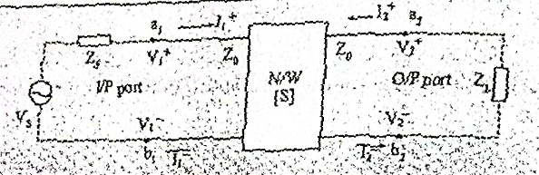

# ⁠A. Introduction

- Microwave Network is formed when microwave component devices, module,s etc. are coupled together by transmission lines for the desired transmission of microwave signal through ports.
- Here the term port is defined as **point of interconection** of two or more networks, simply junctions or terminals.
- At low frequency, the physical length of a network is much smaller than the electrical wavelength of the signal.
- Therefore the measurable input and output variabel are votlage or current which can be related in terms of ABCD, Y-, Z-, or h-parameters.
- These parameters can be measured under short or open circuited conditions.
- But **in microwaves**:
    - Open or short-circuited conditions are not easily achieved.
    - Open or short-circuited conditions often result in oscillations
    - Physical length of the component or devices are comparable or much larger than the electical wavelength..
        - Hence the voltage or current are not well defined at each discrete points.
        - It means, the **network analysis is distributive**
    - These parameters often **change the biasing conditions to junction capacitors**.
        - Therefore, ABCD, Y-, Z- and h-parameters based analyses are not suitable for micwoaves.
        - Instead, scattering parameters, aka S-parameters aka S-matrix, are used to analyze the microwave networks, where the incident and reflected wave parameters are linearly related.d
- Microwave networks **can be of 1-port** like transmission line, **2-port** like amplifier or **multiport** like modulator.
- Any microwave network can be analyzed based on their respective port models.

---

# ⁠B. Microwave N-Port

- A microwave network consists of:
    - a nunmber of transmission line sections
    - interconnected or coupled to each other
    - with passive/active devices
    - incorporated at appropriate locations.
- The network may have one or more input/output ports.
- Hence, they can be treated as a distributed component, characterized by:
    - its length, characteristic impedance and propagation constant

**Consider an arbitrary N-Port network**
- Figure:
    - 
- The voltage V$_n$ and the current at the terminal plane T$_n$ are given by
    $$\begin{align}
        V_n = V_n^+ + V_n^- \\
        I_n = \dfrac{1}{Z_0} (V_n^+ + V_n^-)
    \end{align}$$

## ⁠B.1. Impedance Matrix

- The total voltages and currents at the terminals of the microwave network are related by the impedance matrix \[Z\].
    $$\begin{equation}\begin{bmatrix}
        V_1 \\
        V_2 \\
        \vdots \\
        V_N
    \end{bmatrix} = \begin{bmatrix}
        Z_{11} & Z_{12} & ... & Z_{1N} \\
        Z_{21} & \ddots &  & Z_{2N} \\
        \vdots &  & \ddots & \vdots \\
        Z_{N1} & Z_{N2} & ... & Z_{NN}
    \end{bmatrix} \begin{bmatrix}
        I_1 \\
        I_2 \\
        \vdots \\
        I_N
    \end{bmatrix}\end{equation}$$
- in short matrix formm
    $$\begin{equation}
        [V] = [Z] [I]
    \end{equation}$$
- Similarly, the admittance matrix \[Y\] of the network is defined as
    $$\begin{equation}
        [I] = [Y] [V]
    \end{equation}$$
- where, 
    $$\begin{equation}
        [Y] = [Z]^{-1}
    \end{equation}$$
- In general, the elements Z$_{ij}$ and Y$_{ij}$ can be complex.
- The following specific cases are of importance in practice.
    - For a reciprocal network (not containing any active device or non-reciprocal material such as ferrite)
        - the elements Z$_{ij}$ = Z$_{ji}$ and Y$_{ij}$ = Y$_{ji}$ and hence,
        - \[Z\] and \[Y\] are symmetric.
    - For a lossless network,
        - all the elements of \[Z\] and \[Y\] are purely imaginary.

## ⁠B.2. Scattering Matrix

- For circuits operating at $\mu$wave frequencies,
    - network representation in terms of admittance or impedance matrix is not very convinient.
    - since voltage, currents and impedances cannot be emasured directly.
- Parameters that can be measured directly are the incident and reflected power levels
    - that are related to the incident and reflected voltage waves.
- The matrix that reflects the incident and reflected voltage waves at the various ports of the network is known as the scattering matrix.
- Consider the Figure as above.
- We assume tht transmission lines connected to the various ports have the same characteristic impedance (Z$_0$)
- We now define a set of normalized incident and reflected votlage wave variables a$_n$ and b$_n$ as:

$$\begin{align}
    a_n = \dfrac{V_n^+}{\sqrt{Z_0}}\\
    b_n = \dfrac{V_n^-}{\sqrt{Z_0}}
\end{align}$$
- The scattering matrix, denoted as \[S\] relates these two voltage variables.
    $$\begin{equation}\begin{bmatrix}
        b_1 \\
        b_2 \\
        \vdots \\
        b_N
    \end{bmatrix} = \begin{bmatrix}
        S_{11} & S_{12} & ... & S_{1N} \\
        S_{21} & \ddots &  & S_{2N} \\
        \vdots &  & \ddots & \vdots \\
        S_{N1} & S_{N2} & ... & S_{NN}
    \end{bmatrix} \begin{bmatrix}
        a_1 \\
        a_2 \\
        \vdots \\
        a_N
    \end{bmatrix}\end{equation}$$
- or in short form 
    $$\begin{equation}
        [b] = [S] [a]
    \end{equation}$$
- The elements of the scattering matrix can be obtained from (Prof. NBA has complicated this slightly)
    $$\begin{equation}
        S_{ij} = \left. \dfrac{b_i}{a_i} \right|_{a_k = 0} = \left. \dfrac{V_i^-}{V_j^+} \right|_{V_k^+=0}\ V_k^+ = 0 \text{ for } k \ne j\\
    \end{equation}$$
- S$_{ii}$ is the reflection coefficient at the port $i$.
- S$_{ij}$ is the transmission coefficient from port $j$ to port $i$
- For a reciprocal network,
    $$\begin{equation}
        [S] = [S]^t
    \end{equation}$$
- For lossless and reciprocal network,
    $$\begin{equation}
        [S]^t [S] = [U]
    \end{equation}$$
- Where $t$ denotes transpose and \[U\] is a unit matrix (also called identity matrix).
- Eqn (11) is known as unitary condition.

## ⁠B.3. Relation between \[S\] and \[Z\]

- We have seen that \[Z\] relates to thte total voltages and currents at the various ports,
    - and these voltages and currents can be expressed as the sum
    - of the incident and reflected voltagee waves and current waves, respectively.
- Further, \[S\] relates the incident and reflected voltages waves at the various ports.
- Therefore, there exists a relation between \[S\] \[S\].
- It is given by,
    $$\begin{align}
        [S] = ([Z] + [U])^{-1}\ ([Z] - [U])\\
        [S] = ([Z] - [U])\ ([Z] + [U])^{-1}
    \end{align}$$
- Alternatively, if the elements of the scattering matrix are known, the impedance matrix can be obtained from,
    $$\begin{equation}
        [Z] = ([U] - [S])^{-1}\ ([U] + [S])
    \end{equation}$$

## ⁠B.4. Average Power in terms of scattering variables

- Referring to figure above, the average power flowing into port $n$ can be determined using (7, 8).
- Using (7, 8), we can express the total voltage and current at port n as
    $$\begin{align}
        V_n = \sqrt{Z_0}\ (a_n + b_n)\\
        V_n = \dfrac{1}{\sqrt{Z_0}}\ (a_n - b_n)
    \end{align}$$
- the avg power delivered to port $n$ is given by
    $$\begin{equation}
        P_n = \dfrac12 \Re \left[ V_n I_n^* \right] = \dfrac12 \Re \left[ (a_n a_n^* - b_n b_n^*) + (b_n a_n^* - a_n b_n^*) \right]
    \end{equation}$$
- The second term within the bracket on the RHS of (19) is purely imaginary and simplifies to:
    $$\begin{equation}
        P_n = \dfrac12 \left[ |a_n|^2 - |b_n|^2 \right]
    \end{equation}$$
- (20) gives the power flow into the network through port $n$ in terms of the normalized incident and reflected voltage variables.
- The first term in (20) gives the incident power and the second term gives reflected power.

---

# ⁠C. Two-Port Networks

- The significance of the scattering parameters can be understood more clearly by considering a 2-port network.
    - Fig
    - 
- The euqations governing the incident and reflected voltage wave variables are given by
    $$\begin{align}
        b_1 = S_{11}a_1 + S_{12}a_2\\
        b_2 = S_{21}a_1 + S_{22}a_2
    \end{align}$$
- So from (21, 22), we can write
    $$\begin{equation}
        S_{11} = \left. \dfrac{b_1}{a_1} \right|_{a_2 = 0},\
        S_{21} = \left. \dfrac{b_2}{a_1} \right|_{a_2 = 0},\
        S_{12} = \left. \dfrac{b_1}{a_2} \right|_{a_1 = 0},\
        S_{22} = \left. \dfrac{b_2}{a_2} \right|_{a_1 = 0}
    \end{equation}$$
- S$_{11}$ is the reflection coefficient at port 1 when port 2 is terminated with a matched load
    - (a$_2$ = 0, i.e., there is no incident wave at port 2)
- and similarly for other s-parameters.

## ⁠C.1. Insertion Loss (or Transmission Loss)

- Supposing P$\large_{in,\ 1}$ is the power fed to port 1 from a matched source
- P$\large_{out,\ 2}$ is the power output measured by a power meter (matched to output port), then
    $$\begin{equation}
        \dfrac{P_{out, 2}}{P_{in, 1}} = \dfrac{|b_2|^2}{|a_1|^2} = |S_{21}|^2
    \end{equation}$$
- The insertion loss (aka transmission loss), expressed in dB can be obtained as:
    $$\begin{equation}
        S_{21}\ \text{(dB)} = - 20 \log_{10} |S_{21}| = -10 \log_{10}\left( \dfrac{P_{out, 2}}{P_{in, 1}}\right)
    \end{equation}$$

## ⁠C.2. Return Loss (or Refelection Loss)
- Let P$_{in1}$ be the power fed to port 1 from a matched source
- P$_{r1}$ is the reflected back power from the device at port 1, when port 2 is terminated in a matched load.
- The magnitude of the reflection coefficient at port 1, denoted as $|S_{11}|$ can be obtained from,
    $$\begin{equation}
        \dfrac{P_{r1}}{P_{in1}} = \dfrac{|b_1|^2}{|a_1|^2} = |S_{11}|^2
    \end{equation}$$
- The return loss (or reflection loss) of the device expressed in dB is given by
    $$\begin{equation}
        S_{11}\ \text{(dB)} = - 20 \log_{10} |S_{11}| = -10 \log_{10}\left( \dfrac{P_{r1}}{P_{in1}}\right)
    \end{equation}$$
- The input VSWR of a device when the output port is matched terminated, is given by:
    $$\begin{equation}
        \text{VSWR} = \dfrac{1 + |S_{11}|}{1 - |S_{11}|}
    \end{equation}$$
- Note that for a passive device the transmission and reflection coeffients are less than unity.
- Thus when expressed in dB using (25) and (27), they assume positive values.

