# Microwave Waveguides as Transmission Lines

- Waveguides are hollow metallic structures, the inside of which is filled with a dielectric (usually air), used to transmist EM wave energy through multiple reflections along the walls of the guide.
- The E- and H-fields are confined to the space within the guide, so that no power is lost through radiation, and dielectric loss is also negligible since the guides are air-filled.
- Only a small amount of power loss is possible, as heat dissipated in the walls of the waveguide.
- Waveguides have a higher power-handling capacity and lower attenuation compared to conventional transmission lines.
- The two most commonly used waveguides are the **rectangular waveguide** and the **circular waveguide**
- Waveguides support two main modes of EM wave propagation:
    - **Transmission Electric (TE) waves**:
        - The E-field component in the direction of propagation (z-direction) is zero, and propagation takes place in the transverse (x and y) direction
    - **Transverse Magnetic \(TM\) waves**:
        - The H-field component in the z-direction is zero, and propagation exists in the x and y directions.

## Modes of Propagation

- A **mode** is a specific field configuration/pattern that satisfies both Maxwell's equations and the waveguide's boundary conditions.
- Each mode is labeled by its type (TE or TM) and by mode indices ($m,n$ for rect., $n,m$ or $n,p$ for circular),
    - which count the number of field variations across the guide's cross-section.
- Every mode has an associated set of **critical parameters** (cutoff parameters)
    - that determine whether and how it propagates.
- **Cutoff wave number ($k_c$)**
    - fixed purely by the waveguide's cross-sectional geometry and the mode indices
    - doesn't depend on operating frequency
- **Cutoff frequency ($f_c$)**
    - the frequency below which the mode cannot propagate at all (evanescent/attenuated)
    - above it, the mode propagates freely.
- A mode **propagates** only if the operating frequency $f > f_c$ for that specific mode
    - otherwise the field delays exponentially along the guide instead of propagating
- Since different modes generally have different cutoff frequencies,
    - a waveguide operated at a given frequency may support several modes simultaneously
        - called multimoding
    - unless the dimensions are deliberately chosen
        - so that the dominant mode's cutoff lies below the operating frequency,
        - and all other modes' cutoffs lie above it.
- This is why **waveguide dimensions** are chosen carefully relative to the intended frequency band
    - to guarantee single-mode (dominant-mode-only) operation

## Why waveguides Support only TE/TM Modes (Not TEM)

- A **TEM** has both $E_z = 0$ and $H_z = 0$
    - i.e., both fields are entirely transverse to the direction of propagation, as in coaxial cable or two-wire line.
- TEM waves require **two or more separate conductors** to exist,
    - because a TEM mode's transverse $E$-field pattern must satisfy Laplace's equation, in the cross section:
    ($\nabla_t^2E_t = 0$)
    - For which, a *single* simply connected hollow conductor (like rectangular or circular) has only trivial (zero) solution.
- Since waveguide is a **single hollow conductor**, it cannot support a TEM mode.
- Propagation is only possible if *either* $E_z \neq\ 0$ (TM mode) *or* $H_z \neq\ 0$ (TE mode)
    - one longitudinal component must exist to satisfy Maxwell's equations within the single-conductor boundary
- So, waveguides are classified purely into TE and TM mode,
    - unlike 2-conductor transmission lines (coaxial, microstrip, etc) which support TEM or quasi TEM propagation.

## Rectangular Waveguide

- Rectangular waveguides are hollow tubes with a rectangular cross-section.
- The conducting walls confine the EM fields and guide the waves in the direction of propagation, as components of TE or TM modes.
- In both TE and TM modes, two subscripts, $m$ and $n$, are used to denote the number of half-sine-wave variations of the electric or magnetic field:
    - $m$ corresponds to the wider dimension ($a$).
    - $n$ corresponds to the narrower dimension ($b$).
- In each mode family, there is one **dominant mode**, which provides the lowest loss and minimum distortion (lowest cutoff frequency).

### General Setup

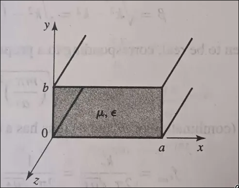
 
- The electric and magnetic wave equations, derived from Maxwell's field equations in the frequency domain, are:
    $$\nabla^2E = \gamma^2E, \qquad \nabla^2H = \gamma^2H$$
    - where the propagation constant is $\gamma = \sqrt{j\omega\mu(\sigma + j\omega\epsilon)} = \alpha + j\beta$.
- Any rectangular component of $E$ or $H$ satisfies the scalar **Helmholtz wave equation**:
$$
\nabla^2\psi = \gamma^2\psi \quad\Longrightarrow\quad \frac{\partial^2\psi}{\partial x^2} + \frac{\partial^2\psi}{\partial y^2} + \frac{\partial^2\psi}{\partial z^2} = \gamma^2\psi
$$
- Using **separation of variables**, assume $\psi = X(x)\,Y(y)\,Z(z)$.
- Substituting and dividing through by $\psi$ separates the equation into three independent ordinary differential equations, each equal to a constant:
    $$\frac{d^2X}{dx^2} = -k_x^2 X, \qquad \frac{d^2Y}{dy^2} = -k_y^2 Y, \qquad \frac{d^2Z}{dz^2} = -k_z^2 Z$$
    - with general solutions of the form $X = A\sin(k_x x) + B\cos(k_x x)$, and similarly for $Y$ and $Z$.
- The propagation constant in the guide, $\gamma_g$, relates to the intrinsic propagation constant $\gamma$ of the dielectric and the transverse wave numbers via:
    $$\gamma_g^2 = \gamma^2 + k_x^2 + k_y^2 = \gamma^2 + k_c^2$$
    - where $k_c$ is the **cutoff wave number**.
- For a lossless dielectric, $\gamma^2 = -\omega^2\mu\epsilon$, giving:
$$\gamma_g = \pm\sqrt{k_c^2 - \omega^2\mu\epsilon}$$

### Three Propagation Basis

- **Cutoff condition**: if $\omega^2\mu\epsilon = k_c^2$, then $\gamma_g = 0$ 
    - no propagation occurs.
- This defines the **cutoff frequency**:
$$\begin{align}
    \omega^{2}\mu\epsilon&=k_{c}^{2}\\
    \omega&=\frac{k_{c}}{\sqrt{\mu\epsilon}}\\
    2\pi f&=\frac{1}{\sqrt{\mu\epsilon}}\sqrt{\left(\frac{m\pi}{a}\right)^{2}+\left(\frac{n\pi}{b}\right)^{2}}\\
    f&=\frac{1}{2\sqrt{\mu\epsilon}}\sqrt{\left(\frac{m}{a}\right)^{2}+\left(\frac{n}{b}\right)^{2}}
\end{align}$$
$$f_c = \frac{1}{2\pi\sqrt{\mu\epsilon}}\sqrt{k_x^2 + k_y^2}$$
- **Propagating wave**: if $\omega^2\mu\epsilon > k_c^2$ (i.e., $f > f_c$),
    - $\gamma_g$ is purely imaginary:
    $$\gamma_g = \pm j\beta_g = \pm j\omega\sqrt{\mu\epsilon}\sqrt{1 - \left(\frac{f_c}{f}\right)^2}$$
- **Evanescent (attenuated) wave**: if $\omega^2\mu\epsilon < k_c^2$ (i.e., $f < f_c$),
    - $\gamma_g$ is purely real:
    $$\gamma_g = \pm\alpha_g = \pm\omega\sqrt{\mu\epsilon}\sqrt{\left(\frac{f_c}{f}\right)^2 - 1}$$
    - The wave decays exponentially with the factor $e^{-\alpha_g z}$, and cannot propagate.
### TE Mode in Rectangular Waveguide

- The $TE_{mn}$ mode is characterized by $E_z = 0$ and $H_z \neq 0$ — the longitudinal magnetic field component is what carries the mode's energy and defines all other field components.
- Applying the boundary conditions of a rectangular waveguide with perfectly conducting walls (tangential $E$ must vanish at the walls) to the general Helmholtz solution for $H_z$ gives:
$$H_z = H_{0z}\cos\left(\frac{m\pi x}{a}\right)\cos\left(\frac{n\pi y}{b}\right)e^{-j\beta_g z}$$
- All transverse field components ($H_x$, $H_y$, $E_x$, $E_y$) are obtained directly from $H_z$ using Maxwell's curl equations. The results are:
    $$H_x = H_{0x}\sin\left(\frac{m\pi x}{a}\right)\cos\left(\frac{n\pi y}{b}\right)e^{-j\beta_g z}$$
    $$H_y = H_{0y}\cos\left(\frac{m\pi x}{a}\right)\sin\left(\frac{n\pi y}{b}\right)e^{-j\beta_g z}$$
    $$E_x = E_{0x}\cos\left(\frac{m\pi x}{a}\right)\sin\left(\frac{n\pi y}{b}\right)e^{-j\beta_g z}$$
    $$E_y = E_{0y}\sin\left(\frac{m\pi x}{a}\right)\cos\left(\frac{n\pi y}{b}\right)e^{-j\beta_g z}$$
    $$E_z = 0$$
    - where $H_{0x}, H_{0y}, E_{0x}, E_{0y}$ are amplitude constants proportional to derivatives of $H_{0z}$ (e.g. $H_x \propto \dfrac{-j\beta}{k_c^2}\dfrac{\partial H_z}{\partial x}$).

#### Characteristic Parameters

- **Cutoff wave number**:
$$k_c^2 = \left(\frac{m\pi}{a}\right)^2 + \left(\frac{n\pi}{b}\right)^2$$
- **Cutoff wavelength** (from $k_c = 2\pi/\lambda_c$):
$$\lambda_c = \frac{2}{\sqrt{\left(\dfrac{m}{a}\right)^2 + \left(\dfrac{n}{b}\right)^2}}$$
- **Cutoff frequency** (from $k_c = \omega_c\sqrt{\mu\epsilon}$):
$$f_c = \frac{1}{2\sqrt{\mu\epsilon}}\sqrt{\left(\frac{m}{a}\right)^2 + \left(\frac{n}{b}\right)^2}$$
- **Phase constant** in the guide:
$$\beta_g = \omega\sqrt{\mu\epsilon}\sqrt{1 - \left(\frac{f_c}{f}\right)^2}$$
- **Phase velocity** in the guide:
$$v_g = \frac{v_p}{\sqrt{1 - \left(\dfrac{f_c}{f}\right)^2}}, \qquad v_p = \frac{1}{\sqrt{\mu\epsilon}}$$
- **Wave impedance** for TE mode:
$$
Z_{TE} = \frac{E_x}{H_y} = \frac{\omega\mu}{\beta_g} = \frac{\eta}{\sqrt{1 - \left(\dfrac{f_c}{f}\right)^2}}, \qquad \eta = \sqrt{\frac{\mu}{\epsilon}}
$$

#### Why the Dominant Mode Overall is $TE_{10}$ (for $a > b$)

- Unlike TM, the TE mode family **does** allow $m = 0$ or $n = 0$ (but not both simultaneously, since that would make $k_c = 0$).
- The smallest non-trivial combinations are $(m,n) = (1,0)$ and $(0,1)$.
- Comparing their cutoff frequencies using 
$
f_c = \dfrac{1}{2\sqrt{\mu\epsilon}}\sqrt{\left(\dfrac{m}{a}\right)^2+\left(\dfrac{n}{b}\right)^2}$:
$$f_{c,TE_{10}} = \frac{1}{2a\sqrt{\mu\epsilon}}, \qquad f_{c,TE_{01}} = \frac{1}{2b\sqrt{\mu\epsilon}}$$
- Since the waveguide convention takes $a$ (wide dimension) $> b$ (narrow dimension), we have $\dfrac{1}{2a} < \dfrac{1}{2b}$, so $f_{c,TE_{10}} < f_{c,TE_{01}}$.
- Since $TE_{10}$ has the lowest cutoff frequency among **all** TE and TM modes (lower even than $TM_{11}$, which requires both $a$ and $b$ to be finite and nonzero, always giving a strictly larger cutoff), $TE_{10}$ is the **overall dominant mode** of the rectangular waveguide.

#### $TE_{10}$ vs $TE_{20}$: Cutoff Frequency and Dominant Mode

- Both modes have $n = 0$, so using $f_c = \dfrac{1}{2\sqrt{\mu\epsilon}}\sqrt{\left(\dfrac{m}{a}\right)^2 + \left(\dfrac{n}{b}\right)^2}$:
$$f_{c,TE_{10}} = \frac{1}{2a\sqrt{\mu\epsilon}}, \qquad f_{c,TE_{20}} = \frac{1}{a\sqrt{\mu\epsilon}} = 2f_{c,TE_{10}}$$
- $TE_{20}$'s cutoff frequency is exactly **twice** that of $TE_{10}$ 
    - this follows directly from $m=2$ doubling the $m/a$ term compared to $m=1$.
- Since $f_{c,TE_{10}} < f_{c,TE_{20}}$, and $TE_{10}$ is the overall dominant mode,
    - $TE_{20}$ is a **higher-order mode**,
    - only propagating once the operating frequency
    - exceeds twice the $TE_{10}$ cutoff.
- **Practical significance**:
    - this $2\times$ separation is exactly why
    - standard rectangular waveguides are operated
    - in a band between $f_{c,TE_{10}}$ and $f_{c,TE_{20}}$
    - this guarantees single ($TE_{10}$)-mode operation
    - with no risk of $TE_{20}$ (or any other higher mode) propagating simultaneously.

### TM Mode in Rectangular Waveguide

- The $TM_{mn}$ mode is characterized by $H_z = 0$ and $E_z \neq 0$
    - here the longitudinal **electric** field component is what carries the mode's energy.
- Applying the boundary conditions of a rectangular waveguide
    - the tangential component of $E_z$ must vanish at the conducting walls
    - i.e., at $x = 0, a$ and $y = 0, b$ to the general Helmholtz solution
    - for $E_z$ requires **sine** (not cosine) dependence,
    - since sine naturally vanishes at the boundaries:
    $$E_z = E_{0z}\sin\left(\frac{m\pi x}{a}\right)\sin\left(\frac{n\pi y}{b}\right)e^{-j\beta_g z}, \qquad m = 1,2,3,\dots\ ;\ n = 1,2,3,\dots$$
    - **Note**:
        - if either $m = 0$ or $n = 0$,
        - all field intensities vanish
        - hence $TM_{m0}$ and $TM_{0n}$ modes **do not physically exist** 
        - answer for: "prove $TM_{01}$ and $TM_{10}$ modes do not exist".
- All transverse field components are obtained from $E_z$ using Maxwell's curl equations ($\nabla \times H = j\omega\epsilon E$). The results are:
    $$E_x = E_{0x}\cos\left(\frac{m\pi x}{a}\right)\sin\left(\frac{n\pi y}{b}\right)e^{-j\beta_g z}$$
    $$E_y = E_{0y}\sin\left(\frac{m\pi x}{a}\right)\cos\left(\frac{n\pi y}{b}\right)e^{-j\beta_g z}$$
    $$H_x = H_{0x}\sin\left(\frac{m\pi x}{a}\right)\cos\left(\frac{n\pi y}{b}\right)e^{-j\beta_g z}$$
    $$H_y = H_{0y}\cos\left(\frac{m\pi x}{a}\right)\sin\left(\frac{n\pi y}{b}\right)e^{-j\beta_g z}$$
    $$H_z = 0$$
    - where the amplitude constants are proportional to derivatives of $E_{0z}$ (e.g. $E_x \propto \dfrac{-j\beta}{k_c^2}\dfrac{\partial E_z}{\partial x}$).

#### Characteristic Parameters

- **Cutoff wave number** 
    - identical form to TE,
    - since it comes from the same transverse boundary-value problem:
    $$k_c^2 = \left(\frac{m\pi}{a}\right)^2 + \left(\frac{n\pi}{b}\right)^2$$
- **Cutoff wavelength**:
    $$\lambda_c = \frac{2}{\sqrt{\left(\dfrac{m}{a}\right)^2 + \left(\dfrac{n}{b}\right)^2}}$$
- **Cutoff frequency**:
$$f_c = \frac{1}{2\sqrt{\mu\epsilon}}\sqrt{\left(\frac{m}{a}\right)^2 + \left(\frac{n}{b}\right)^2}$$
- **Phase constant**:
    $$\beta_g = \omega\sqrt{\mu\epsilon}\sqrt{1 - \left(\frac{f_c}{f}\right)^2}$$
- **Phase velocity**:
    $$v_g = \frac{v_p}{\sqrt{1 - \left(\dfrac{f_c}{f}\right)^2}}$$
- **Wave impedance** for TM mode
    -note: structurally *inverse* in form to $Z_{TE}$
    - this is the key formula distinguishing the two modes:
    $$Z_{TM} = \frac{E_x}{H_y} = \frac{\beta_g}{\omega\epsilon} = \eta\sqrt{1 - \left(\frac{f_c}{f}\right)^2}$$

#### Why the Dominant Mode in TM is $TM_{11}$

- Since $TM_{m0}$ and $TM_{0n}$ modes do not exist, the smallest allowed integer combination for $(m, n)$ in the TM family is $(1, 1)$.
- Substituting $m = n = 1$ into the cutoff frequency formula gives the **lowest possible cutoff frequency** among all TM modes:
    $$f_{c,TM_{11}} = \frac{1}{2\sqrt{\mu\epsilon}}\sqrt{\left(\frac{1}{a}\right)^2 + \left(\frac{1}{b}\right)^2}$$
- Therefore, $TM_{11}$ is the **dominant TM mode**.

## Circular Waveguide

- A circular waveguide is a hollow, tubular, metallic structure with a circular cross-section, in which a plane wave propagates in TE or TM modes.
- The solution of the wave equation for a circular waveguide follows the **cylindrical coordinate system** $(r, \phi, z)$.

### General Setup

- The scalar Helmholtz equation in cylindrical coordinates is:
    $$\frac{1}{r}\frac{\partial}{\partial r}\left(r\frac{\partial\psi}{\partial r}\right) +
    \frac{1}{r^2}\frac{\partial^2\psi}{\partial\phi^2} + \frac{\partial^2\psi}{\partial z^2} = \gamma^2\psi$$
- Using separation of variables,
    - $\psi = R(r)\,\Phi(\phi)\,Z(z)$.
- Substituting and separating gives three equations:
    - The $z$-equation:
        - $\dfrac{d^2Z}{dz^2} = \gamma_g^2 Z$,
        - with solution $Z = Ae^{-\gamma_g z} + Be^{\gamma_g z}$,
        - where $\gamma_g$ is the propagation constant in the guide.
    - The $\phi$-equation,
        - obtained by isolating the angular dependence as a separation constant: $-n^2$
            $$\dfrac{d^2\Phi}{d\phi^2} = -n^2\Phi$$
        - with harmonic solution $\Phi = A_n\sin(n\phi) + B_n\cos(n\phi)$.
        - Using trigonometric identity,
        - this combines into a single term $F_n\cos(n\phi)$
        - by absorbing a phase shift into the amplitude.
    - The $r$-equation reduces to **Bessel's equation of order $n$**:
        $$\frac{1}{r}\frac{d}{dr}\left(r\frac{dR}{dr}\right) + \left[k_c^2 - \frac{n^2}{r^2}\right]R = 0, \qquad \text{where } k_c^2 = \gamma_g^2 - \gamma^2$$
        - with general solution $R = C_n J_n(k_c r) + D_n N_n(k_c r)$,
        - where $J_n$ is the Bessel function of the first kind and
        - $N_n$ is the Bessel function of the second kind.
- Since $N_n(k_c r) \to \infty$ as $r \to 0$,
    - and the field must remain **finite on the waveguide axis**,
    - we require $D_n = 0$.
- The complete solution of the Helmholtz equation in cylindrical coordinates is therefore:
    $$\psi = \psi_0\, J_n(k_c r)\cos(n\phi)\, e^{-j\beta_g z}$$
    - where $\psi_0$ is an amplitude constant,
    - $n$ is the order of the Bessel function,
    - $r$ is the radial coordinate,
    - $\phi$ is the azimuthal angle,
    - $k_c$ is the cutoff wave number, and
    - $\beta_g$ is the phase constant in the guide.
- For a lossless guide,
    - the propagation constant reduces to
    $$\beta_g = \pm\sqrt{\omega^2\mu\epsilon - k_c^2}$$
    - propagation occurs only when
    - $\omega^2\mu\epsilon > k_c^2$,
    - i.e. analogous to the rectangular case.

### TE Mode in Circular Waveguide

- The $TE_{np}$ mode is characterized by $E_z = 0$ and $H_z \neq 0$.
- Applying the general cylindrical solution to $H_z$ directly gives:
    $$H_z = H_{0z}\, J_n(k_c r)\cos(n\phi)\, e^{-j\beta_g z}$$
- All transverse components are derived from
    - $H_z$ using Maxwell's curl equations,
    - $\nabla \times E = -j\omega\mu H$ and $\nabla\times H = j\omega\epsilon E$,
    - expanded in cylindrical coordinates:
    $$H_r = \frac{E_{0\phi}}{Z_g}J_n(k_c r)\cos(n\phi)e^{-j\beta_g z}$$
    $$H_\phi = \frac{E_{0r}}{Z_g}J_n(k_c r)\sin(n\phi)e^{-j\beta_g z}$$
    $$E_r = E_{0r}\,J_n(k_c r)\sin(n\phi)e^{-j\beta_g z}$$
    $$E_\phi = E_{0\phi}\,J_n(k_c r)\cos(n\phi)e^{-j\beta_g z}$$

### Characteristic Parameters

- **Cutoff wave number**:
    - for TE modes, $k_c$ is fixed by the boundary condition that
    - the *derivative* of $J_n$ vanishes at the guide wall
        - i.e. $r = a$, the guide radius 
    - i.e., $k_c = p'_{nm}/a$,
    - where $p'_{nm}$ is the $m^{th}$ root of $J_n'(x) = 0$.
- **Phase constant**:
    $$\beta_g = \sqrt{\omega^2\mu\epsilon - k_c^2}$$
- **Cutoff frequency**:
    $$f_c = \frac{k_c}{2\pi\sqrt{\mu\epsilon}}$$
- **Group/phase velocity**:
    $$v_g = \frac{v_p}{\sqrt{1 - \left(\dfrac{f_c}{f}\right)^2}}, \qquad v_p = \frac{1}{\sqrt{\mu\epsilon}}$$
- **Wave impedance** for circular TE mode:
    $$Z_{TE} = \frac{E_r}{H_\phi} = \frac{-E_\phi}{H_r} = \frac{\eta}{\sqrt{1 - \left(\dfrac{f_c}{f}\right)^2}}, \qquad \eta = \sqrt{\frac{\mu}{\epsilon}}$$
- **Guide wavelength**:
    $$\lambda_g = \frac{v_p}{f}\cdot\frac{1}{\sqrt{1-(f_c/f)^2}}$$

### TM Mode in Circular Waveguide

- The $TM_{np}$ mode is characterized by $H_z = 0$ and $E_z \neq 0$.
- Applying the general cylindrical solution to $E_z$ directly gives:
    $$E_z = E_{0z}\, J_n(k_c r)\cos(n\phi)\, e^{-j\beta_g z}$$
- Here, the boundary condition is different from the TE case:
    - since the **tangential** component of $E$ must vanish at the conducting wall
        - i.e. $r = a$,
    - we require $E_z = 0$ at $r = a$,
    - which means $k_c$ must be chosen so that
    - $J_n(k_c a) = 0$ directly
    - i.e., $k_c = p_{nm}/a$,
    - where $p_{nm}$ is the $m^{th}$ **root of $J_n(x) = 0$ itself**,
        - not its derivative, as in the TE case.
- All transverse components are derived from $E_z$ using Maxwell's curl equations,
    - $\nabla\times E = -j\omega\mu H$ and
    - $\nabla \times H = -j\omega\epsilon E$,
    - expanded in cylindrical coordinates:
    $$E_r = E_{0r}\,J_n(k_c r)\cos(n\phi)e^{-j\beta_g z}$$
    $$E_\phi = E_{0\phi}\,J_n(k_c r)\sin(n\phi)e^{-j\beta_g z}$$
    $$H_r = \frac{E_{0r}}{Z_g}J_n(k_c r)\sin(n\phi)e^{-j\beta_g z}$$
    $$H_\phi = \frac{E_{0\phi}}{Z_g}J_n(k_c r)\cos(n\phi)e^{-j\beta_g z}$$

#### Characteristic Parameters

- **Cutoff wave number**:
    - $k_c = p_{nm}/a$,
    - where $p_{nm}$ is the $m^{th}$ root of the Bessel function
    - $J_n(x) = 0$
    - the smallest such root overall is $p_{01} \approx 2.405$.
- **Phase constant**:
    $$\beta_g = \sqrt{\omega^2\mu\epsilon - k_c^2}$$
- **Cutoff frequency**:
    $$f_c = \frac{k_c}{2\pi\sqrt{\mu\epsilon}}$$
- **Wave impedance** for circular TM mode
    - structurally inverse to $Z_{TE}$,
    - exactly as in the rectangular case:
    $$Z_{TM} = \frac{E_r}{H_\phi} = \frac{\beta_g}{\omega\epsilon} = \eta\sqrt{1 - \left(\frac{f_c}{f}\right)^2}$$

### Dominant Mode in Circular Waveguide
 
- Comparing
    - the smallest root of $J_n(x) = 0$ (governing TM modes) against
    - the smallest root of $J_n'(x) = 0$ (governing TE modes):
        - Smallest TM root: $p_{01} \approx 2.405$ (mode $TM_{01}$).
        - Smallest TE root: $p'_{11} \approx 1.841$ (mode $TE_{11}$).
- Since $p'_{11} < p_{01}$,
    - the **$TE_{11}$ mode has the lowest cutoff frequency of all modes in a circular waveguide**,
    - making it the **overall dominant mode** in a circular waveguide.
- Among TM modes specifically,
    - $TM_{01}$ (using the smallest TM root, $p_{01} \approx 2.405$) is the **dominant TM mode**.

## Degenerate Modes
 
- In waveguides,
    - two or more different modes having
    - the **same cutoff frequency** are called **degenerate modes**.
- In a rectangular waveguide,
    - the $TE_{mn}$ and $TM_{mn}$ modes (for the same non-zero $m, n$)
    - are always degenerate, since they share the identical cutoff-frequency formula
    - $f_c = \dfrac{1}{2\sqrt{\mu\epsilon}}\sqrt{(m/a)^2 + (n/b)^2}$
    - the mode type (TE or TM) doesn't change this value.
- Waveguide dimensions are typically chosen
    - so that only the dominant mode is allowed to propagate
    - i.e., operating frequency is kept below the cutoff frequency of the next higher mode,
    - avoiding the complications of multi-mode propagation.

## Dominant Modes: Summary

- The dominant mode is the propagating mode with the **lowest cutoff frequency** for a given waveguide.
- **Rectangular waveguide**:
    - $TE_{10}$ (assuming $a$ is the wider dimension) is the overall dominant mode
    - $TM_{11}$ is the dominant mode within the TM family specifically.
- **Circular waveguide**:
    - $TE_{11}$ is the overall dominant mode
    - $TM_{01}$ is the dominant mode within the TM family specifically.

## Attenuation in Waveguides

### Below Cutoff: Evanescent Attenuation

- As derived earlier (Case III of the propagation-constant classification),
    - when the operating frequency $f < f_c$ for a given mode,
    - the propagation constant becomes purely real:
    $$\alpha_g = \omega\sqrt{\mu\epsilon}\sqrt{\left(\frac{f_c}{f}\right)^2 - 1}$$
- This causes the field to decay exponentially as $e^{-\alpha_g z}$,
    - with **no power transmission**
- The wave is evanescent, not truly "attenuated" in the resistive-loss sense.
- This is a purely reactive cutoff effect,
    - independent of any conductor or dielectric loss.

## Above Cutoff: Attenuation Due to Wall (Conductor) Losses
 
- Even when $f > f_c$ and the mode propagates,
    - **real waveguides are not perfectly lossless**
- The finite conductivity of the guide walls causes
    - a small, genuine power loss as heat,
    - giving rise to an attenuation constant $\alpha_c$
    - distinct from the reactive $\alpha_g$ below cutoff.
- This wall-loss attenuation is calculated using the **perturbation method**:
    - assuming the wall currents and fields are approximately the same
        - as in the lossless case,
    - the power lost per unit length in the walls is computed and
    - related to the power still being transmitted:
    $$\alpha_c = \frac{P_L}{2P_0}\quad\text{(Np/m)}$$
    - where $P_L$ is the power dissipated per unit length in the walls
        - computed from
        - the surface resistance $R_s$ of the conductor and
        - the tangential $H$-field at the walls, and
    - $P_0$ is the power transmitted through the guide cross-section.
- **General behavior**:
    - $\alpha_c$ is small near midband (well above $f_c$),
    - but rises sharply as $f \to f_c$ from above
        - since the fields become more concentrated near the walls and
        - the group velocity drops toward zero,
    - and also rises again at very high frequencies 
        - due to increasing surface resistance $R_s \propto \sqrt{f}$,
        - from the skin effect.
- This is why waveguides are typically operated in
    - the **flatter, low-loss region of the band**
    - well above cutoff,
    - but before the high-frequency skin-effect losses become dominant
    - rather than right at the edges of their single-mode operating range.

## God fucking with me with these many formulas

| Quantity | Rectangular TE | Rectangular TM | Circular TE | Circular TM |
|---|---|---|---|---|
| Field that is zero | $E_z = 0$ | $H_z = 0$ | $E_z = 0$ | $H_z = 0$ |
| Governing longitudinal field | $H_z = H_{0z}\cos\left(\frac{m\pi x}{a}\right)\cos\left(\frac{n\pi y}{b}\right)e^{-j\beta_g z}$ | $E_z = E_{0z}\sin\left(\frac{m\pi x}{a}\right)\sin\left(\frac{n\pi y}{b}\right)e^{-j\beta_g z}$ | $H_z = H_{0z}J_n(k_c r)\cos(n\phi)e^{-j\beta_g z}$ | $E_z = E_{0z}J_n(k_c r)\cos(n\phi)e^{-j\beta_g z}$ |
| Cutoff wave number $k_c$ | $\sqrt{\left(\frac{m\pi}{a}\right)^2+\left(\frac{n\pi}{b}\right)^2}$ | $\sqrt{\left(\frac{m\pi}{a}\right)^2+\left(\frac{n\pi}{b}\right)^2}$ | $p'_{nm}/a$ (root of $J_n'=0$) | $p_{nm}/a$ (root of $J_n=0$) |
| Cutoff wavelength $\lambda_c$ | $\dfrac{2}{\sqrt{(m/a)^2+(n/b)^2}}$ | $\dfrac{2}{\sqrt{(m/a)^2+(n/b)^2}}$ | $2\pi/k_c$ | $2\pi/k_c$ |
| Cutoff frequency $f_c$ | $\dfrac{1}{2\sqrt{\mu\epsilon}}\sqrt{\left(\frac{m}{a}\right)^2+\left(\frac{n}{b}\right)^2}$ | $\dfrac{1}{2\sqrt{\mu\epsilon}}\sqrt{\left(\frac{m}{a}\right)^2+\left(\frac{n}{b}\right)^2}$ | $\dfrac{k_c}{2\pi\sqrt{\mu\epsilon}}$ | $\dfrac{k_c}{2\pi\sqrt{\mu\epsilon}}$ |
| Phase constant $\beta_g$ | $\omega\sqrt{\mu\epsilon}\sqrt{1-(f_c/f)^2}$ | $\omega\sqrt{\mu\epsilon}\sqrt{1-(f_c/f)^2}$ | $\sqrt{\omega^2\mu\epsilon - k_c^2}$ | $\sqrt{\omega^2\mu\epsilon - k_c^2}$ |
| Phase/guide velocity $v_g$ | $\dfrac{v_p}{\sqrt{1-(f_c/f)^2}}$ | $\dfrac{v_p}{\sqrt{1-(f_c/f)^2}}$ | $\dfrac{v_p}{\sqrt{1-(f_c/f)^2}}$ | $\dfrac{v_p}{\sqrt{1-(f_c/f)^2}}$ |
| Wave impedance $Z_g$ | $\dfrac{\eta}{\sqrt{1-(f_c/f)^2}}$ | $\eta\sqrt{1-(f_c/f)^2}$ | $\dfrac{\eta}{\sqrt{1-(f_c/f)^2}}$ | $\eta\sqrt{1-(f_c/f)^2}$ |
| Overall dominant mode | $TE_{10}$ (for $a>b$) | — | $TE_{11}$ | — |
| Dominant mode within family | — | $TM_{11}$ | — | $TM_{01}$ |
| Special non-existence rule | None ($m$ or $n$ may individually be 0) | $TM_{m0}$, $TM_{0n}$ do not exist | None | None |

---

# Input Output Coupling of Waveguides

- Input and output coupling of microwave energy into or from a waveguide is done by inserting a small **probe** or **loop** inside it.
- Accordingly, these are knwon as **probe coupling** and *loop coupling*

## Probe Coupling

- Probe coupling is primarily for setting up an **E-field**, where a small probe inserted inside a waveguide acts as a quarter-wave antenna, as shown below

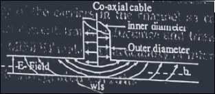

- By probe coupling in a rectangular waveguide, first an E-field is produced, which then causes an H-field.
- A coaxial line may be coupled to a waveguide by placing the probe parallel to the E-field, or near the point of maximum E-field.
- The most efficient location for the probe is the **center of the wider wall**,
    - parallel to the narrower wall, and
    - **one quarter-wavelength** from the shorted end of the waveguide
    - energy transfer is maximum at this point.
- Output coupling of energy from the waveguide is a reversal of the input coupling, before the same type of probe

## Loop Coupling

- Loop coupling is basically for coupling the **H-field**,
    - where a loop of conductor is placed near the point of maximum H-field, as shown below

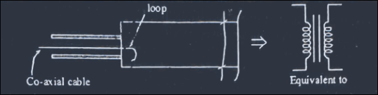

- By loop coupling in a rectangular waveguide, first an H-field is produced, which then causes an E-field.
- The loop can be mounted at the end of the shorted waveguide, or in the middle of the top or bottom wall at a distance of half-wavelength.
- The plane of the loop should be **perpendicular** to the H-field for maximum coupling.
- The degree of coupling also depends on the loop's shape, size, orientation, and number of loops.
- For the most efficient coupling, the loop is inserted at one of several points where the H-field is of greatest strength.

### Probe Coupling vs Loop Coupling

| Aspect | Probe Coupling | Loop Coupling |
|---|---|---|
| Field set up first | E-field (which then induces the H-field) | H-field (which then induces the E-field) |
| Physical form | Straight conductor (acts as a quarter-wave antenna) | Conductor bent into a loop |
| Optimal placement | Center of the wider wall, parallel to the narrower wall, λ/4 from the shorted end | Near the point of maximum H-field — end of shorted guide, or mid-wall at λ/2 |
| Orientation for max coupling | Parallel to the E-field | Plane of the loop perpendicular to the H-field |
| Coupling depends on | Position along the guide (relative to E-field maximum) | Loop shape, size, orientation, and number of loops |

---

# Microwave Cavity Resonators

- Microwave resonators are tunable resonant circuits built for different frequency ranges and applications.
- By definition, a **resonant cavity** is any space completely enclosed by conducting walls that can contain oscillating EM fields and possess resonant properties.

## Properties

1. **Resonant Frequency**
    - the frequency (and wavelength) at which the energy in the waveguide attains its maximum value.
2. **Quality Factor (Q-factor)**
    - a measure of the frequency selectivity of the resonator.
    - Resonant cavities have a very high Q-factor.
    - A high Q-factor gives these devices a narrow bandpass and allows very accurate tuning.
    - Defined as:
    $$Q = \frac{\omega_0 W}{P} = 2\pi\,\frac{\text{Maximum energy stored in the tank circuit}}{\text{Energy dissipated per cycle}}$$
    - where $\omega_0$ is the angular resonant frequency, $W$ is the maximum stored energy, and $P$ is the average power loss.
3. **Input Impedance**
    - specifies the matching/mismatching with the line and load impedances.

## Types of Cavity Resonators

### Rectangular Cavity Resonator

- Rectangular cavity resonators are hollow metallic enclosures that exhibit resonant behavior when excited by EM fields.

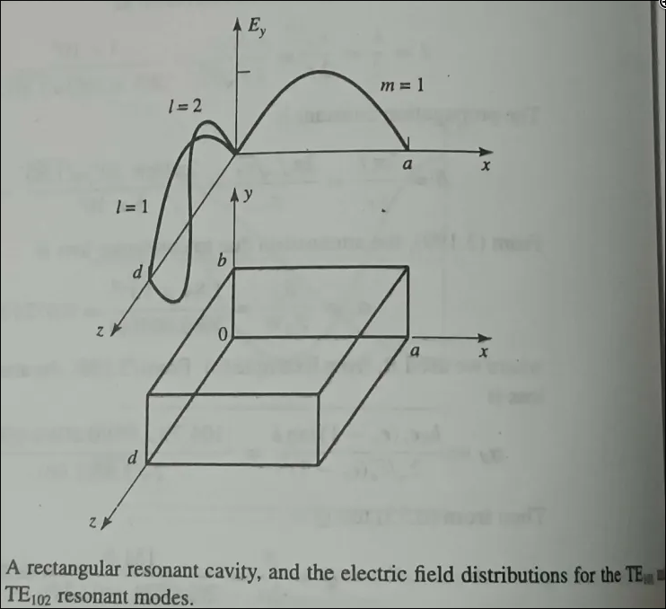

- The figure above shows a rectangular cavity resonator formed using a rectangular waveguide shorted at both ends.
- The resonant frequency ($f_r$) of the resonator is:
    $$f_r = \frac{c}{2\sqrt{\mu_r\epsilon_r}}\sqrt{\left(\frac{m}{a}\right)^2 + \left(\frac{n}{b}\right)^2 + \left(\frac{p}{l}\right)^2}$$
    where $c$ is the speed of light; $a, b, l$ are the dimensions of the cavity; $m, n$ are the mode indices of the waveguide; and $p$ is a positive integer representing the number of half-wave variations in the z-direction.
- The modes are called $TE_{mnp}$ and $TM_{mnp}$.
- The resonant frequency differs for different modes; the mode with the lowest resonant frequency is called the **dominant (primary) mode**.

### Cylindrical Cavity Resonator

- A cylindrical cavity resonator is a circular waveguide shorted at both ends.

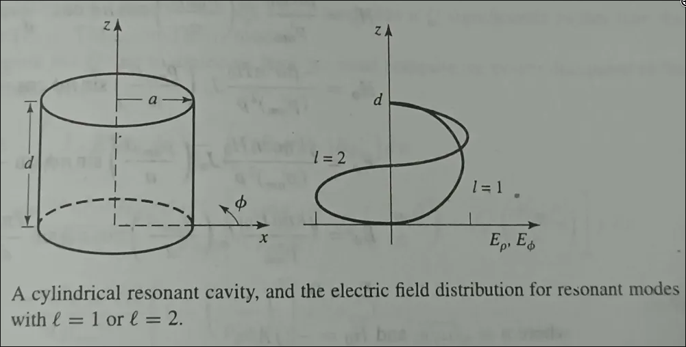

- The modes are $TE_{mnp}$ and $TM_{mnp}$.
- The resonant frequency is given by:
$$f_r = \frac{c}{2\pi\sqrt{\mu_r\epsilon_r}}\sqrt{\left(\frac{p_{mn}}{a}\right)^2 + \left(\frac{p\pi}{l}\right)^2}$$

## Tuning of Cavity

- Tuning of waveguide cavities is done by changing the inductive or capacitive properties of the waveguide, by inserting specially designed apertures or irises into the cavity using posts or screws.
- Tuning is classified as **inductive**, **capacitive**, and **resonant** tuning.
- Cavity tuning provides impedance matching, tuning of the resonant frequency, and control of the Q-factor.

### Inductive Tuning

- For inductive tuning, conductive apertures are extended from the side walls (the $b$-dimension) of the waveguide, providing the effect of an inductive susceptance by permitting current flow and energy storage in the H-field.
- The amount of inductive susceptance depends on the length of the window.

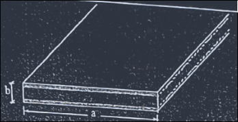

### Capacitive Tuning

- For capacitive tuning, conductive apertures extend into the waveguide from the top and bottom walls, constituting a capacitive susceptance.
- The susceptance value depends on the closeness of the window.

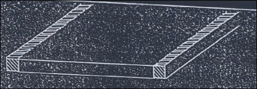

### Resonant Tuning

- Resonant tuning is a combination of capacitive and inductive tuning.
- An adjustable slug, screw, window, aperture, or iris is used to tune resonators by placing them in the area of maximum E-field lines (capacitive tuning) and H-field lines (inductive tuning).
- Moving the slug in or out changes the distance between the plates, thereby varying the resonant frequency.
- The value of the Q-factor also increases or decreases with the increase or decrease of the aperture size.

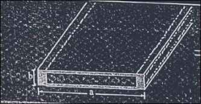

---

# Directional Coupler

- A directional coupler is basically a **four-port junction** that provides a method of accurately sampling incident and reflected microwave power, with minimal disturbance to the transmission line.
- It consists of a primary waveguide and a secondary waveguide, as shown below:

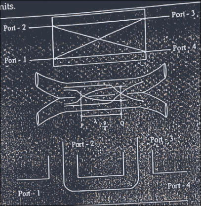

- The directional coupler's four ports have the property that there is free transfer of power (without reflection) between port-1 and port-3, and **no** transfer of power between port-1 and port-2, or between port-3 and port-4.
- The degree of coupling between the ports depends on the structure of the unit.

## Performance Parameters

1. **Coupling Factor (CF)**
    - the measure of the incident power ($P_i$) relative to the forward power ($P_f$):
    $$CF = 10\log_{10}\left(\frac{P_i}{P_f}\right) \text{ dB}$$
2. **Directivity (D)**
    - the measure of the ratio of the forward power to the backward power ($P_b$):
    $$D = 10\log_{10}\left(\frac{P_f}{P_b}\right) \text{ dB}$$
3. **Isolation**
    - the ratio of the incident power to the backward power:
    $$10\log_{10}\left(\frac{P_i}{P_b}\right) = 10\log_{10}\left(\frac{P_i}{P_f}\cdot\frac{P_f}{P_b}\right) \text{ dB}$$
    - i.e., **Isolation = Coupling Factor + Directivity** (in dB).
4. **Insertion Loss (IL)**
    - relates the total output power from all ports (i.e., the sum of $P_f$, $P_b$, and the reflected power $P_r$) relative to the input power:
    $$10\log_{10}\left(\frac{P_f + P_b + P_r}{P_i}\right) \text{ dB}$$
5. **Frequency Sensitivity**
    - also called **coupling flatness** over the specified frequency range — a measure of how the coupling varies across a given frequency band.
6. **Impedance**
    - the characteristic impedance ($Z_0$) of the device.
7. **VSWR**
    - a measure of the impedance mismatch of the device relative to $Z_0$.
8. **Amplitude Balance**
    - the maximum variation of the input signal among the output ports due to attenuation.
9. **Phase Balance**
    - the maximum variation of phase between two or more output signals fed from a common input.
---

# Microwave Junctions (Tees)

- Physically handling and installing two or more waveguides by bending, twisting, and joining helps to tap microwave power flowing through a main line into auxiliary lines.
- **Microwave Tees** are formed by joining two or more rectangular waveguide sections to split or combine signals.
- The commonly used junctions are: **E-plane Tee**, **H-plane Tee**, and **Hybrid Junctions** (Magic Tee and Hybrid Ring).

## E-Plane Tee Junction

- This type of Tee is made up of a longer piece of rectangular waveguide, called the **co-planar (or collinear) arms**, to which a shorter piece of rectangular waveguide, called the **E-arm**, is joined perpendicular to the broad wall — i.e., **along the direction of the E-field**.

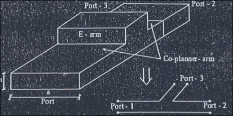

- Illustration of the cross-sectional E-field patterns in the various arms:
    - **Divider** (signal fed into the E-arm, port-3):
    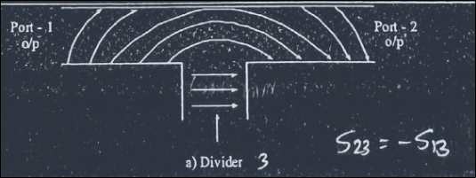
    - **Adder** (signals fed into ports 1 and 2, combining at port-3):
    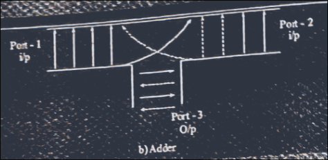
- As shown above, the E-plane Tee can be used as a **signal combiner or splitter**:
    - If a signal is fed from port-3 (E-arm), the E-field splits **equally** into port-1 and port-2, but **180° out of phase**.
    - Input signals fed simultaneously from port-1 and port-2 combine at port-3, providing their phasor **sum**.
    - If the fields fed at port-1 and port-2 are of the **same amplitude and phase**, the output at port-3 will be **zero**, due to phase cancellation.

### Deriving the E-plane Tee's S-matrix

- Since the E-plane Tee is a three-port device, its general scattering matrix is:
$$[S] = \begin{bmatrix} S_{11} & S_{12} & S_{13} \\ S_{21} & S_{22} & S_{23} \\ S_{31} & S_{32} & S_{33} \end{bmatrix}$$
- **Symmetry property** (reciprocal network): $S_{ij} = S_{ji}$, giving:
$$S_{12} = S_{21}, \qquad S_{13} = S_{31}, \qquad S_{23} = S_{32}$$
- **Phase-reversal property**: since energy fed at port-3 produces outputs at port-1 and port-2 that are 180° out of phase with each other, we have:
$$S_{23} = -S_{13}$$
- Substituting these relations into the general matrix:
$$[S] = \begin{bmatrix} S_{11} & S_{12} & S_{13} \\ S_{12} & S_{22} & -S_{13} \\ S_{13} & -S_{13} & S_{33} \end{bmatrix}$$
- If port-3 (the E-arm) is **perfectly matched**, then $S_{33} = 0$.
- **How to recognize this device from a given S-matrix (Ch. 3 §3.2 style question)**: if you are given a 3-port S-matrix and observe that (i) it is symmetric ($S_{ij}=S_{ji}$), (ii) two of the off-diagonal terms connecting one specific port to the other two are equal in magnitude but **opposite in sign** (e.g. $S_{13} = -S_{23}$), and (iii) that same specific port's self-term is zero ($S_{33}=0$ if matched) — this signature identifies the device as an **E-plane Tee**, with port-3 being the E-arm.
- The E-plane Tee behaves as a **series junction**.

## H-Plane Tee Junction

- In this Tee, the axis of the side arm is parallel to the plane of the **H-field** — hence it is also called a **shunt Tee**.
- An H-plane Tee junction is formed by cutting a rectangular slot along the **width** of the main guide and attaching another waveguide, the side arm, called the **H-arm** (port-3):

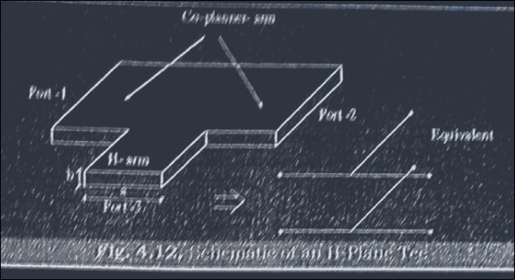

- Ports 1 and 2 (the collinear arms) are called the **co-planar arms**.
- All three arms lie in the plane of the H-field, which is equally divided between them — hence it is also called a **current junction**.
- If ports 1 and 2 are terminated with matched loads, and a signal is fed into the H-arm, it splits **equally** into port-1 and port-2, **in phase**:

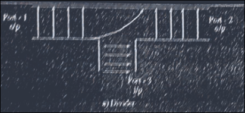

- If two input signals are fed into port-1 and port-2, the output combines at the H-arm as their phasor **sum**:

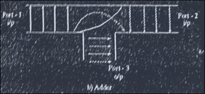

### H-plane Tee S-matrix Properties

- For a symmetric H-plane Tee junction: $S_{11} = S_{22} = S_{33} = 0$ (all ports individually matched under symmetric excitation conditions).
- If the network is lossless, the scattering matrix must be **unitary** (i.e., $[S]^*[S]^T = [I]$, meaning power is conserved and no power is dissipated within the junction).
- **How to recognize this device from a given S-matrix**: unlike the E-plane Tee, the H-plane Tee's coupling coefficients from the H-arm to the two collinear ports are **equal in sign** (in-phase splitting) rather than opposite in sign — this is the key distinguishing feature between an E-plane and H-plane Tee's S-matrix.

### E-Plane Tee vs H-Plane Tee

| Aspect | E-Plane Tee | H-Plane Tee |
|---|---|---|
| Side-arm orientation | Parallel to the E-field (side arm extends from the broad wall) | Parallel to the H-field (side arm extends from the narrow/width-cut wall) |
| Also known as | Series junction | Shunt junction / current junction |
| Splitting phase (from side arm to collinear ports) | Equal magnitude, but **180° out of phase** | Equal magnitude, **in phase** |
| Combining behavior (signals into collinear ports) | Combine at E-arm as phasor sum; equal in-phase inputs give **zero** output at E-arm | Combine at H-arm as phasor sum |
| Key S-matrix signature | $S_{13} = -S_{23}$ (opposite sign) | $S_{13} = S_{23}$ (same sign), and $S_{11}=S_{22}=S_{33}=0$ for the symmetric case |

## Hybrid Junction

- A hybrid junction acts as a **four-port hybrid circuit**,
    - in which the signal incident at any one port is divided
    - between two other ports,
    - with the **fourth port isolated** from the rest.
- All output ports are assumed connected to perfectly matched terminations.
- There are two common hybrid junctions:
    - the **Magic Tee** and the **Hybrid Ring (rat-race junction)**.

### Magic Tee (Magic Hybrid Tee)

- The magic hybrid junction is a **combination of the E-plane and H-plane Tees**.
- Rectangular slots are cut on both sides — along the width and the breadth of a waveguide — and side arms are attached to form the magic Tee:

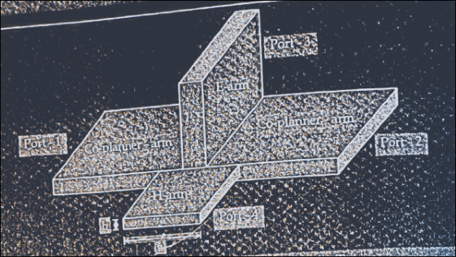

- The Magic Tee combines the power-dividing properties of both the E-plane and H-plane Tee, and **all four ports are completely matched**.
- Port-1, 2, 3 form an H-plane Tee; port-1, 2, 4 form an E-plane Tee.
- Port-1 and Port-2 are the **co-planar arms**, Port-3 is the **H-arm**, and Port-4 is the **E-arm**.

#### Input/Output Characteristics

1. All ports are perfectly matched and equidistant.
2. If a signal is fed at the co-planar arms, it splits equally between the E-arm and H-arm.
3. At each output port, the output power is half of the input power.
4. There is **complete isolation** between the co-planar arms (port-1 and port-2 are isolated from each other).
5. If a signal is fed at the **H-arm**, it splits equally into port-1 and port-2, **in phase**.
6. If a signal is fed at the **E-arm**, it splits equally into port-1 and port-2, **180° out of phase**.

#### Deriving the Magic Tee's S-matrix

- The general 4-port scattering matrix is:
$$[S] = \begin{bmatrix} S_{11} & S_{12} & S_{13} & S_{14} \\ S_{21} & S_{22} & S_{23} & S_{24} \\ S_{31} & S_{32} & S_{33} & S_{34} \\ S_{41} & S_{42} & S_{43} & S_{44} \end{bmatrix}$$
- Using the combined properties of the E-plane and H-plane Tees:
    - From the H-plane behavior (in-phase splitting from port-3): $S_{23} = S_{13}$.
    - From the E-plane behavior (out-of-phase splitting from port-4): $S_{24} = -S_{14}$.
    - Isolation between port-3 (H-arm) and port-4 (E-arm): $S_{34} = S_{43} = 0$.
    - Symmetric (reciprocal) property: $S_{ij} = S_{ji}$ for $i \neq j$.
    - Matched-load condition at the H-arm and E-arm: $S_{33} = S_{44} = 0$.
- Substituting all these properties, the final S-matrix of a perfectly matched Magic Tee is:
$$[S] = \begin{bmatrix} S_{11} & S_{12} & S_{13} & S_{14} \\ S_{12} & S_{22} & S_{13} & -S_{14} \\ S_{13} & S_{13} & 0 & 0 \\ S_{14} & -S_{14} & 0 & 0 \end{bmatrix}$$
- **How to recognize this device from a given S-matrix**:
    - a 4-port S-matrix with **two full rows/columns of zeros in the bottom-right 2×2 block**
        - indicating ports 3 and 4 are both matched and isolated from each other,
        - combined with the sign pattern $S_{23}=S_{13}$ and $S_{24}=-S_{14}$,
    - uniquely identifies the device as a **Magic Tee**
    - this is the pattern PYQs present when asks to
    - "identify and explain the passive device" from a 4-port matrix.
- If the coplanar arms (ports 1, 2) are also further specialized
    - e.g., $S_{11}=S_{22}=0$ for a fully matched, lossless, reciprocal Magic Tee,
    - the matrix simplifies further, consistent with a unitary matrix
    - (energy conservation) for a lossless device.

**Special case: E and H arms both shorted**:

- if both the E-arm and H-arm of a rectangular Magic Tee are shorted
- rather than matched,
- the matched-load assumption ($S_{33}=S_{44}=0$) no longer holds 
- instead, $S_{33}$ and $S_{44}$ become non-zero reflection terms
- magnitude 1 for an ideal short, with an appropriate phase shift depending on the exact short-circuit plane,
- and the device behaves purely as a two-port reflective coupler
- between ports 1 and 2 via the doubly-reflected paths through the shorted arms,
- rather than as a 4-port hybrid divider 
- this is the basis of the "S-matrix of a rectangular magic tee having both E and H arms shorted" PYQ.

### Hybrid Ring (Rat-Race Junction)

- The rat-race hybrid ring coupler is a **four-port network**.
- Unlike the Magic Tee, it produces **two output voltage signals that are either in-phase or out-of-phase**, depending on which port is chosen for feeding the input signal.
- It is essentially a **planar version of the Magic Tee**, implementable in rectangular waveguide or in planar (microstrip/stripline) form.
- The network can be used either as an **in-phase or out-of-phase power divider**; conversely, it can be used to obtain the **sum and difference** of two signals.

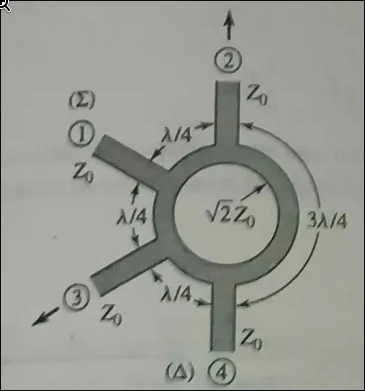

- The rat-race junction consists of an annular ring of total length $3\lambda_g/2$, with four ports connected at specific intervals:
    - Port-2 and port-4 are kept a distance of $3\lambda_g/4$ apart.
    - Ports 1–2, 1–3, and 3–4 are each kept $\lambda_g/4$ apart.
- **Signal path behavior**:
    - A signal fed at port-1,
        - traveling clockwise, arrives at ports 2 and 4 **in phase**
        - traveling anticlockwise, it arrives at port-3 **out of phase**.
    - A signal fed at port-2,
        - traveling clockwise, arrives at ports 3 and 1 **in phase**
        - traveling anticlockwise, it arrives at port-4 **out of phase**.
    - A signal fed at port-3,
        - traveling clockwise, arrives at ports 2 and 4 **in phase**
        - traveling anticlockwise, it arrives at port-1 **out of phase**.
    - A signal fed at port-4,
        - traveling clockwise, arrives at ports 3 and 1 **in phase**
        - traveling anticlockwise, it arrives at port-2 **out of phase**.

#### Deriving the Rat-Race S-matrix

- The scattering matrix of a rat-race junction can initially be expressed, using the isolation between adjacent-but-non-coupled ports, as:
$$[S] = \begin{bmatrix} S_{11} & S_{12} & 0 & -S_{14} \\ S_{21} & S_{22} & S_{23} & 0 \\ 0 & S_{32} & S_{33} & S_{34} \\ -S_{41} & 0 & S_{43} & S_{44} \end{bmatrix}$$
- The sign of each S-matrix element represents the phase difference of the signal between the input and output ports.
- Since at least some ports are isolated from each other, they can be matched independently without destroying the symmetry of the junction.
- Applying the properties of the S-matrix for a **reciprocal and lossless** network, and choosing the port lengths correctly, the final S-matrix of the rat-race junction becomes:
$$[S] = \frac{1}{\sqrt{2}}\begin{bmatrix} 0 & 1 & 0 & -1 \\ 1 & 0 & 1 & 0 \\ 0 & 1 & 0 & 1 \\ -1 & 0 & 1 & 0 \end{bmatrix}$$
- Like the Magic Tee, a rat-race junction can be used as a hybrid, with port-1 and port-3 acting as the divider and adder ports respectively, and port-2 and port-4 as output ports.

#### Advantages and Limitations vs Magic Tee

- The main advantage of the rat-race junction over the Magic Tee is that, unlike the Magic Tee, it can also be constructed using **planar technology** (microstrip/stripline), making it easier to integrate into planar circuits.
- As the operating frequency changes, the ports are no longer exactly the specific electrical length ($\lambda_g/4$, $3\lambda_g/4$) apart — therefore, the rat-race junction is inherently a **very narrowband device**.
- In practical rat-race implementations, there are small leakage couplings between the ports, so the "zero" elements of the scattering matrix are not perfectly zero in practice.

---

# Circulators

## Definition and Working Principle

- A **circulator** is a passive, non-reciprocal, multi-port microwave device
    - in which power entering any port is transferred (circulated) only
    - to the **next port in a specific sequence** (typically clockwise),
    - with **negligible transmission** to any other port.
- The most common form is a **3-port circulator**:
    - power entering port-1 exits (almost entirely) at port-2,
    - power entering port-2 exits at port-3, and
    - power entering port-3 exits at port-1 but
    - **not** in the reverse direction
    - i.e., port-1 to port-3 directly is highly isolated.
- Circulators are inherently **non-reciprocal** devices,
    - meaning $S_{ij} \neq S_{ji}$
    - this non-reciprocity is achieved using a **ferrite** material
    - biased by a static magnetic field,
    - which causes the material's permeability to behave differently for
    - waves traveling in different directions
    - based on the Faraday rotation effect in magnetized ferrites.

## Ideal S-matrix of a 3-Port Circulator

- For an ideal, lossless, matched, non-reciprocal 3-port circulator (clockwise circulation: $1\to2\to3\to1$):
$$[S] = \begin{bmatrix} 0 & 0 & 1 \\ 1 & 0 & 0 \\ 0 & 1 & 0 \end{bmatrix}$$
- All diagonal terms are zero (all ports perfectly matched: $S_{11}=S_{22}=S_{33}=0$).
- Only the "circulating direction" terms are non-zero and equal to 1 (lossless, full power transfer): $S_{21}=S_{32}=S_{13}=1$.
- The reverse-direction terms are all zero (perfect isolation in the "wrong" direction): $S_{12}=S_{23}=S_{31}=0$.
- Note this matrix is clearly **not symmetric** ($S_{12}\neq S_{21}$),
    - confirming the device's non-reciprocal nature
    - this is the key S-matrix signature distinguishing a circulator
    - from all the reciprocal Tee-junction devices above.

## Applications

- **Duplexers**:
    - allowing a single antenna to be shared between a transmitter and a receiver,
    - by routing the transmitted signal to the antenna
    - and the received signal to the receiver,
    - while isolating the transmitter from the receiver directly.
- **Isolators**:
    - a circulator with one port terminated in a matched load becomes
    - a two-port isolator, allowing power to flow in only one direction
    - protecting sensitive sources like oscillators/amplifiers from reflected power.
- Radar systems, where the same antenna is used for both transmission and reception.

---

# Gunn Diode

- The Gunn diode has an I-V characteristic that exhibits **negative differential resistance** (a negative slope region), which can be used to generate RF power from a DC bias.
- Its operation is based on the **transferred electron effect** (also known as the **Gunn effect**), discovered by J. B. Gunn in 1963.
- Practical Gunn diodes typically use **GaAs (Gallium Arsenide)** or **InP (Indium Phosphide)** materials, since these semiconductors possess the multi-valley conduction-band structure required for the transferred electron effect.
- Gunn diodes can produce continuous power of up to several hundred milliwatts, at frequencies from **1 to 100 GHz**, with efficiencies ranging from **5% to 15%**.
- Oscillator circuits using Gunn diodes require a **high-Q resonant circuit or cavity**, often tuned mechanically.
    - Electronic tuning by bias adjustment is limited to about 1% or less, but varactor diodes are sometimes included in the resonant circuit to provide a greater range of electronic tuning.
- Gunn diode sources are used extensively in low-cost applications such as **traffic radars**, **motion detectors** for door openers and security alarms, and various **test and measurement systems**.
---

# MASER

- **MASER** stands for **Microwave Amplification by Stimulated Emission of Radiation** 
    - the microwave-frequency precursor to the (optical) laser,
    - both based on the same underlying principle of stimulated emission.
- **Working principle**:
    - A MASER operates on a three (or more)-level atomic/molecular energy system.
    - Atoms are "pumped" from a ground state to a higher energy state
    - using an external energy source (optical or microwave pumping).
    - When these excited atoms are stimulated by an incoming microwave photon of the correct frequency
    - matching the energy difference between two atomic levels,
    - they release their extra energy as a **second, coherent microwave photon**,
    - identical in phase and frequency to the stimulating photon 
        - this is **stimulated emission**.
    - This process creates a **cascading amplification effect**:
        - one photon stimulates the release of another,
        - resulting in a coherent, amplified microwave output.
    - For amplification to occur, a **population inversion** must be maintained 
        - i.e., more atoms must exist in the higher energy state
        - than in the lower state,
        - so that stimulated emission dominates over absorption.
- **Key characteristic**:
    - MASERs provide extremely **low-noise amplification**,
    - since the amplification mechanism (stimulated emission) introduces
    - far less thermal/electronic noise than conventional semiconductor or vacuum-tube amplifiers.
- **Applications**:
    - used in radio astronomy receivers, deep-space communication ground stations, and atomic clocks/frequency standards 
    - situations demanding the lowest possible noise figure in microwave amplification.

---

# Microstrips

- Microstrip line is one of the most popular types of **planar transmission lines**,
    - primarily because it can be fabricated using photolithographic processes and
    - is easily integrated with other passive and active microwave devices.
- Geometry of a microstrip line:
    - 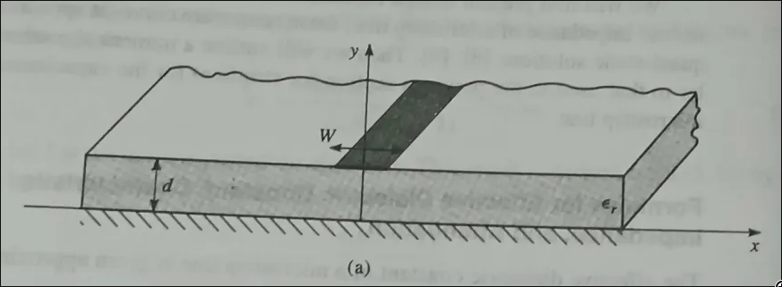
- A conductor of width $W$ is printed on a thin,
    - grounded dielectric substrate of thickness $d$ and
    - relative permittivity $\epsilon_r$.

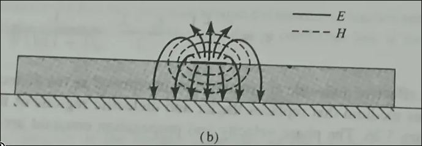

## Why Microstrip Cannot Support a Pure TEM Wave

- If the dielectric were not present ($\epsilon_r = 1$),
    - the line could be thought of as a two-wire line
    - consisting of two flat strip conductors of width $W$,
    - separated by a distance $2d$ (the ground plane can be removed via image theory) 
    - in this case, we would have a single, pure TEM transmission line, with $v_p = c$ and $\beta = k_0$.
- The presence of the dielectric,
    - particularly the fact that the dielectric does **not** fill the air region above the strip ($y > d$),
    - complicates the behavior and analysis of the microstrip line.
- Unlike stripline
    - where all fields are contained within a homogeneous dielectric region,
    - microstrip has some of its field lines concentrated in the dielectric region
    - between the strip conductor and the ground plane,
    - and some fraction in the air region above the substrate.
- For this reason,
    - microstrip line **cannot** support a pure TEM wave:
    - the phase velocity of TEM fields in the dielectric region would be
        - $c/\sqrt{\epsilon_r}$,
    - while the phase velocity of TEM fields in the air region would be $c$.
- A phase match at the dielectric-air interface would therefore be impossible to attain for a purely TEM-type wave.

## Quasi-TEM Approximation

- In actuality, the exact fields of a microstrip line constitute a **hybrid TM-TE wave**, requiring more advanced analysis techniques.
- In practical applications,
    - the dielectric substrate is electrically very thin ($d \ll \lambda$),
    - so the fields are **quasi-TEM** 
    - i.e., essentially the same as those of the static (DC) case.
- Thus,
    - good approximations for the phase velocity,
    - propagation constant, and
    - characteristic impedance can be obtained from static or quasi-static solutions:
    $$v_p = \frac{c}{\sqrt{\epsilon_e}}, \qquad \beta = k_0\sqrt{\epsilon_e}$$
    where $\epsilon_e$ is the **effective dielectric constant** of the microstrip line.
- Since some field lines are in the dielectric region and some are in air, the effective dielectric constant satisfies:
    $$1 < \epsilon_e < \epsilon_r$$
    - and $\epsilon_e$ depends on the substrate thickness $d$ and the conductor width $W$.

---

