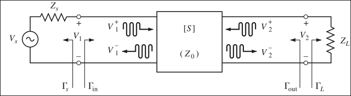
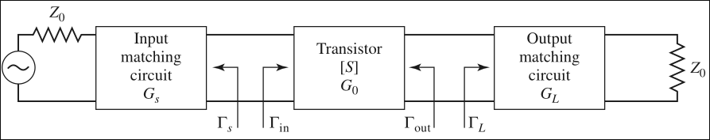
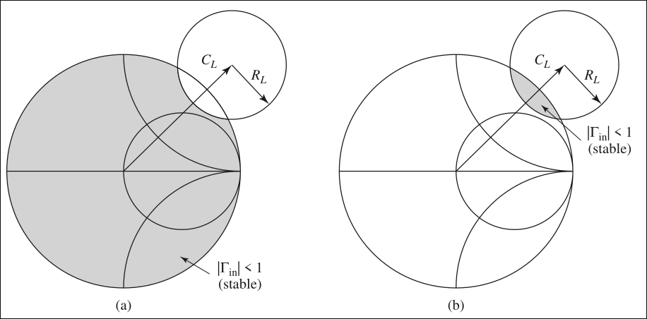
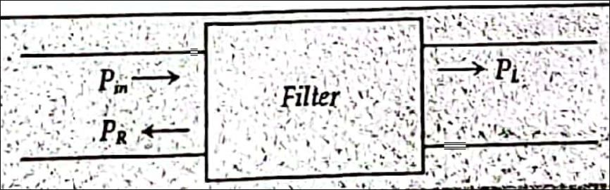

# Introduction

- Depending on application, microwave networks vary from single port like transmission lines, two port like amplifiers, filters, oscillators and multi-port devices (mixers, modulators, multiplexers).

# Microwave Amplifiers

- Microwave amplifiers can be classified into three braod categories:
    - reflection amplifier, parametric amplifier and two port amplifiers
- The reflection amplifier uses a device that produces an ac negative resistance where the ac voltage and current are out of phase.
- Such device includes Tunnel Diode, Gunn Diodes and IMPATT diodes with proper terminations.
- The 2 port amplifiers, includes microwave tubes as well as solid state transistor amplifier.

Two port amplifiers only in syllabus

- Microwave amplifiers can be of BJTs, FETs, Heterojunction Bipolar Transistors (HBTs) and High Electron Mobility Transistors (HEMTs).
- Microwave transistor amplifiers are rugged, reliable and low cost and can also be integrated in both hybrid and monolithic microwave integrated circuits (MMICs).
- Present day microwave transistor amplifies can work upto 100 GHz and have attractive characteristics, like
     - broad bandwidth, low noise figure and medium power characteristics with desirable stability and gain factors.

## Amplifier Gain Analysis

- Figure for analysis
    - 
- The gain of the amplifier will be divided into the gain available at the input and ports, and transducer gain which can be defined as:
    - Power Gain: 
        - the **ratio of power dissipated in the load** to the **power delivered to the input** P$_{in}$ of the two port network
        - G = P$_L$/P$_{in}$
    - Available Gain:
        - ratio of power available from port network P$_{Avn}$ and the source P$_{Avs}$,
        - provided both the source and load are conjugate matched.
        - depends on the source impedance but not on the load impedance.
        - G$_A$ = P$_{Avn}$/P$_{Avs}$
    - Transducer Power Gain:
        - power available from the 2-port network to the power available from the source
        - function of both source and load impedances
        - G$_T$ = P$_l$/P$_{Avs}$
- if the source and load are both conjugately matched to the port network then gain is maximum and we can write G = G$_A$ = G$_T$

For reflection coefficient, from Ch-2/3, we write them as:
- $\Gamma_s$ (looking towards the source) and $\Gamma_L$ (looking towards load)
    $$\begin{align}
        \Gamma_s = \dfrac{Z_s - Z_0}{Z_s + Z_0}\\
        \Gamma_L = \dfrac{Z_L - Z_0}{Z_L + Z_0}
    \end{align}$$
- where Z$_S$, Z$_L$ and Z$_0$ are source, load and characteristic impedance.
- as per definition of S-parameter,
    $$\begin{align}
        V_1^- = S_{11}V_1^+ + S_{12}V_{2}^+ = S_{11}V_1^+ + S_{12}\Gamma_L V_{2}^-\\
        V_2^- = S_{21}V_1^+ + S_{22}V_{2}^+ = S_{21}V_1^+ + S_{22}\Gamma_L V_{2}^-
    \end{align}$$
- From (4) we get:
    $$\begin{equation}
        \dfrac{V_2^-}{V_1^+} = \dfrac{S_{21}}{1-S_{22}\Gamma_L}
    \end{equation}$$
- where we have used the relation $V_2^+ = \Gamma_L + V_2^-$
- now from the expression of V_1^- we get
    $$\begin{equation}
        \Gamma_{in} =\ \dfrac{Z_{in} - Z_0}{Z_{in} + Z_0} =\ S_{11} + S_{12} \Gamma_L \dfrac{V_2^-}{V_1^+}
    \end{equation}$$
- Substituting (5) in (6) gives the reflection coefficient to the input terminal fo the transducer $\Gamma_{in}$ as:
    $$\begin{equation}
        \Gamma_{in} =\ \dfrac{Z_{in} - Z_0}{Z_{in} + Z_0} =\ S_{11} + \dfrac{S_{12} S_{21} \Gamma_L}{1- S_{22}\Gamma_L}
    \end{equation}$$
- Similarly it can be shown that the reflection coefficient to the output terminal of the transducer $\Gamma_{out}$ as
    $$\begin{equation}
        \Gamma_{out} =\ \dfrac{V_2^-}{V_2^+} =\ S_{22} +\dfrac{S_{12} S_{21} \Gamma_S}{1- S_{11}\Gamma_S}
    \end{equation}$$
- Using the voltage division rule, we can write
    $$\begin{equation}
        V_1 = V_s \dfrac{Z_{in}}{Z_s + Z_{in}} = V_1^+ + V_1^- = V_1^+ (1 + \Gamma_{in})
    \end{equation}$$
- Using (7) in (9), we get:
    $$\begin{equation}
        V_1^+ = \dfrac{V_S}{2} \left( \dfrac{1-\Gamma_S}{1-\Gamma_s\Gamma_{in}} \right)
    \end{equation}$$
- If peak values are assumed for all voltages then the average power delivered to the network can be given as
    $$\begin{equation}
        P_{in} = \dfrac{1}{2Z_0} |V_1^+| (1 - | \Gamma_{in} |^2 )
    \end{equation}$$
- Using (10) in (11), we get
    $$\begin{equation}
        P_{in} = \dfrac{|V_s|^2}{8Z_0} \dfrac{|1 - \Gamma_s|^2}{|1-\Gamma_S\Gamma_{in}|^2} (1-|\Gamma_{in}|^2)
    \end{equation}$$
- Similarly, the power delivered to the load can be given as
    $$\begin{equation}
        P_L = \dfrac{|V_s|^2\cdot|S_{21}|^2\cdot|1-\Gamma_S|^2\cdot(1-|\Gamma_L|)^2}{8Z_0\cdot|1-\Gamma_s\Gamma_{in}|^2\cdot|1-S_{22}\Gamma_{L}|^2}
    \end{equation}$$
- Therefore, from (12) and (13), the total gain is:
    $$\begin{equation}
        G = \dfrac{P_L}{P_{in}} = \dfrac{|S_{21}|^2\cdot(1 - |\Gamma_L|^2)}{|1-S_{22}\Gamma_L|^2\cdot(1 - |\Gamma_{in}|^2)}
    \end{equation}$$
- The power available from the source P$_S$ is defined as:
    - the maximum power that can be delivered to the network.
- Following maximum power transfer theorem, we can say that this happens when
    - $\Gamma_{in}$ = $\Gamma_s^*$
- Therefore
    $$\begin{equation}
        P_{Avs} = P_{in}|_{\Gamma_{in} = \Gamma_S^*}
        = \left. \dfrac{|V_S|^2}{8Z_0} \cdot \dfrac{|1-\Gamma_s|^2}{|1-\Gamma_S\Gamma_{in}|^2} (1 - |\Gamma_{in}|^2) \right|_{\Gamma_{in} = \Gamma_S^*}
        = \dfrac{|V_S|^2 \cdot |1-\Gamma_S|^2}{8Z_0 (1 - |\Gamma_S|^2)}
    \end{equation}$$
- Again, the power available from the network is defined as maximum power that can be delivered to the load.
- Following maximum power transfer theorem, we can say that this happens when $\Gamma_L$ = $\Gamma_{out}^*$.
- So
    $$\begin{equation}
        P_{Avn} = P_L |_{\Gamma_L = \Gamma_{out}^*}
        = \left. \dfrac{|V_s|^2 \cdot |S_{21}|^2 \cdot (1-|\Gamma_S|^2)}{8Z_0 \cdot |1-\Gamma_s\Gamma_{in}|^2 \cdot |1-S_{22}\Gamma_L|^2} \right|_{\Gamma_L = \Gamma_{out}^*}
    \end{equation}$$
- Now,
    $$\begin{equation}
        \Gamma_{in}|_{\Gamma_L = \Gamma_{out}^*}
        = S_{11} + \dfrac{S_{12}S_{21}\Gamma_L}{1-S_{22}\Gamma_L}
        = S_{11} + \dfrac{S_{12}S_{21}\Gamma_{out}^*}{1-S_{22}\Gamma_{out}^*}
    \end{equation}$$
- Therefore,
    $$\begin{equation}
        \left. \left|1-\Gamma_{S}\Gamma_{in}\right|^{2} \right|_{\Gamma_L = \Gamma_{out}^*}
        = \left| 1-\Gamma_{s}S_{11}-\frac{S_{12}S_{21}\Gamma_{s}\Gamma_{out}^{*}}{1-S_{22}\Gamma_{out}^{*}} \right|^2
        = \left|\frac{\left(1-S_{11}\Gamma_{s}\right)-\Gamma_{out}^{*}\left(1-S_{11}\Gamma_{S}\right)\left(S_{22}+\frac{S_{12}S_{21}\Gamma_{S}}{1-S_{11}\Gamma_{S}}\right)}{1-S_{22}\Gamma_{out}^{*}}\right|^{2}
    \end{equation}$$
- Using (8) in (18) gives:
    $$\begin{equation}
        \left.\left|1-\Gamma_{s}\Gamma_{in}\right|^{2}\right|_{\Gamma_{L}=\Gamma_{out}^{*}}=\frac{\left|1-S_{11}\Gamma_{s}\right|^{2}\cdot\left(1-\left|\Gamma_{out}\right|^{2}\right)^{2}}{\left|1-S_{22}\Gamma_{out}^{*}\right|^{2}}
    \end{equation}$$
- Therefore,
    $$\begin{equation}
        P_{Avn}=\frac{\left|V_{s}\right|^{2}\cdot\left|S_{21}\right|^{2\ }\cdot\left|1-\Gamma_{s}\right|^{2}}{8Z_{0}\cdot\left|1-S_{11}\Gamma_{s}\right|^{2} \cdot \left(1-\left|\Gamma_{out}\right|^{2}\right)}
    \end{equation}$$
- Using (15) and (20), we obtain maximum available gain as
    $$\begin{equation}
        G_{A}=\frac{P_{Avn}}{P_{avs}}=\frac{\left|S_{21}\right|^{2}\cdot\left(1-\left|\Gamma_{S}\right|^{2}\right)}{\left|1-S_{11}\Gamma_{S}\right|^{2}\cdot\left(1-\left|\Gamma_{out}\right|^{2}\right)}
    \end{equation}$$
- Similarly, the total gain will be
    $$\begin{equation}
        G_{T}=\frac{P_{Avn}}{P_{avs}}=\frac{\left|S_{21}\right|^{2}\left(1-\left|\Gamma_{L}\right|^{2}\right)\left(1-\left|\Gamma_{S}\right|^{2}\right)}{\left|1-\Gamma_{S}\Gamma_{in}\right|^{2}\left|1-S_{22}\Gamma_{L}\right|^{2}}
    \end{equation}$$

When both input and output are perfectly matched, $\Gamma_L = \Gamma_S = 0$, then $G_T = |S_{21}|^2$

Now let us consider a unilateral case for which $S_{12}$ = 0. Under such condition, we can write $\Gamma_{in} = S_{11}$.

- Then the unilateral transducer power gain will be
    $$\begin{equation}
        \left.G_{T}\right|_{S_{12}=0}=\frac{\left|S_{21}\right|^{2}\cdot\left(1-\left|\Gamma_{L}\right|^{2}\right)\cdot\left(1-\left|\Gamma_{S}\right|^{2}\right)}{\left|1-S_{11}\Gamma_{S}\right|^{2}\cdot\left|1-S_{22}\Gamma_{L}\right|^{2}}
    \end{equation}$$
- Since S$_{12}$ = 0 and S$_{21} \ne$, the system is non-reciprocal
- Such non-reciprocal characteristic is often used in amplifier circuits.

## Further Generalization

- Figure:
    - 
- The most suitable gain definition is the total transducer power gain which can be written as $G_T = G_S G_0 G_L$.
- where $G_S$ is the gain of the input matching network, $G_0$ is the gain of the transistor and $G_L$ is the gain of the output matching network which are given as 
    $$\begin{align}
        G_{S}&=\frac{1-\left|\Gamma_{S}\right|^{2}}{\left|1-\Gamma_{S}\Gamma_{in}\right|^{2}}\\
        G_{0}&=\left|S_{21}\right|^{2}\\
        G_{L}&=\frac{1-\left|\Gamma_{L}\right|^{2}}{\left|1-\Gamma_{L}\Gamma_{out}\right|^{2}}
    \end{align}$$
- If we assume that the amplifier is unilateral, i.e., $S_{12}$ = 0 or its small enough to ignore. Then
    $$\begin{align}
        G_{S}&=\frac{1-\left|\Gamma_{S}\right|^{2}}{\left|1-S_{11}\Gamma_{s}\right|^{2}}\\
        G_{0}&=\left|S_{21}\right|^{2}\\
        G_{L}&=\frac{1-\left|\Gamma_{L}\right|^{2}}{\left|1-S_{22}\Gamma_{L}\right|^{2}}
    \end{align}$$

## Stability Analysis

- Stability over a band of frequencies in an amplifier is a crticial parameter.
- Oscillation results in instability which in due to negative resistance component meaning $|\Gamma_{in}| > 1$ or $|\Gamma_{out}|$ > 1.
- This is the condition of instability.
- For thee unilateral model, this condition would be $|S_{11}| > 1$ or $|S_{22}| > 1$.
- Stability can be of conditional and unconditional categories.

### Unconditional Stability

- Unconditional stability exists when $|\Gamma_{in}| < 1$ and $|\Gamma_{out}| < 1$.
    - for unilateral: $|S_{11}| < 1$ or $|S_{22}| < 1$
- Condition needs to hold for all passive source and load impedance available within the entire Smith Chart.

### Conditional Stability

- If the conditions $|\Gamma_{in}| < 1$ and $|\Gamma_{out}| < 1$ (or $|S_{11}| > 1$ or $|S_{22}| > 1$) are valid for only a portion of impedance within the Smith Chart,
    - then the transistor acts as conditionally stable.
- Sometimes it is possible that the reason of stability never present at the input or output of the devices.
- However, since the stability is frequency dependent, it is very possible that an amplifier is stable in the pass band and unstable elsewhere.
- These inequalities define a range of $\Gamma_S$ and $\Gamma_L$ where the amplifier will be stable.
- This range can be found by using Smith Chart and plotting stability circle.
- The stability circles are defined as the loci of $\Gamma_S$ or $\Gamma_L$ plane for which $|\Gamma_{in}| = 1$ or $\Gamma_{out} = 1$.

To find the equation of stability circle for input matching network let us start with $\Gamma_{in} = 1$.
- Using (7), we can write:
    $$\begin{equation}
        \left|S_{11}+\frac{S_{12}S_{21}\Gamma_{L}}{1-S_{22}\Gamma_{L}}\right|=1
    \end{equation}$$
- (30) can be simplified further as
    $$\begin{equation}
        \left|S_{11}-\Delta\Gamma_{L}\right|=\left|1-S_{22}\Gamma_{L}\right|
    \end{equation}$$
- Where $\Delta = S_{11}S_{22} - S_{12}S_{21}$, is the determinant of S-matrix.
- Squaring both sides of (31) gives
    $$\begin{equation}
        \left|S_{11}\right|^{2}+\left|\Delta\right|^{2}\left|\Gamma_{L}\right|^{2}-\left(\Delta\Gamma_{L}S_{11}^{*}+\Delta^{*}\Gamma_{L}^{*}S_{11}\right)=1+\left|S_{22}\right|^{2}\left|\Gamma_{L}\right|^{2}-\left(S_{22}^{*}\Gamma_{L}^{*}+S_{22}\Gamma_{L}\right)
    \end{equation}$$
- After some manipulation, (32) can be written as:
    $$\begin{align}
        \left|\Gamma_{L}-\frac{\left(S_{22}-\Delta S_{11}^{*}\right)^*}{\left|S_{22}\right|^{2}-\left|\Delta\right|^{2}}\right|^{2}
        &=\frac{\left|S_{12}\right|^{2}\left|S_{21}\right|^{2}}{\left(\left|S_{22}\right|^{2}-\left|\Delta\right|^{2}\right)^{2}}
        =\frac{\left(\left|S_{12}\right|\left|S_{21}\right|\right)^{2}}{\left(\left|S_{22}\right|^{2}-\left|\Delta\right|^{2}\right)^{2}}\\
        \left|\Gamma_{L}-\frac{\left(S_{22}-\Delta S_{11}^{*}\right)^{*}}{\left|S_{22}\right|^{2}-\left|\Delta\right|^{2}}\right|
        &= \left|\frac{S_{12}S_{21}}{\left|S_{22}\right|^{2}-\left|\Delta\right|^{2}}\right|
    \end{align}$$
- In a complex $\Gamma$ plane, (33) reveals a circle with center $C_L$ and radius $R_L$ given as
    $$\begin{align}
        C_{L}&=\frac{\left(S_{22}-\Delta S_{11}^{*}\right)^{*}}{\left|S_{22}\right|^{2}-\left|\Delta\right|^{2}}\\
        R_{L}&=\left|\frac{S_{12}S_{21}}{\left|S_{22}\right|^{2}-\left|\Delta\right|^{2}}\right|
    \end{align}$$
- The circle is known as output stability circle.
- Similar expression for input stability circle can be obtained.
- For the input stability circle we get,
    $$\begin{align}
        C_{S}&=\frac{\left(S_{11}-\Delta S_{22}^{*}\right)^{*}}{\left|S_{11}\right|^{2}-\left|\Delta\right|^{2}}\\
        R_{S}&=\left|\frac{S_{12}S_{21}}{\left|S_{11}\right|^{2}-\left|\Delta\right|^{2}}\right|
    \end{align}$$

The above equations reveal that if the S-parameter are given, then we can draw the input and output stbaility circles.

- On one side of the input stability circle, we have $|\Gamma_{out} > 1$ while on the other side we have $|\Gamma_{out} < 1$.
- Similarly, on one side of the output stability circle, we have $|\Gamma_{in}| > 1$ while on the other side we have $|\Gamma_{in}| < 1$.
- Therefore it is important to identify the regions for $|\Gamma_{out}| < 1$ and $|\Gamma_{in}| < 1$.
- To do this let us consider that output stability circle has been drawn in the $\Gamma$-plane for $S_{11} < 1$ and $S_{11} > 1$.

Now, if we set $Z_L = Z_0$, then we can write $|\Gamma_{in}| = |S_{11}|$

- Above equations reveal that if $|S_{11}| < 1$, then $|\Gamma_{in}| < 1$.
- Therefore we can conclude that the center of the Smith Chart ($|\Gamma_{L}| = 0$) must be in the stable region for $S_{11} < 1$.
- More precisely, we can say that all the region of the Smith Chart that is exterier to the output stability circle, corresponding to $S_{11} < 1$, defines the stable range of $\Gamma_L$, depicted as in fig:
    - 
    - Left: Stable, if $|\Gamma_{out} < 1$
    - Right: Unstable if $\Gamma_{out} > 1$
- Now, if we set $Z_L = Z_0$ and $S_{11} > 1$ then $|\Gamma_{in}| > 1|$ and $\Gamma_L$ = 0 must be in the unstable region.
- Alternatively, we can say that the center oft eh Smith Chart is in the unstable region.
- Thus all the region of the Smith Chart that is exterior to the output stability circle, corresponding to $S_{11} > 1$, defines the unstable range of $\Gamma_L$.
- A similar argument holds for the input stability circle.
- To make a device unconditionally stable, the stability circles must be completely outside or totally enclose the Smith Chart.
- This condition can be expressed as: $\left| |C_L| - R_L \right| > 1$ for $|S_{11}| < 1$ and $\left| |C_S| - R_S \right| > 1$ for $|S_{22}| < 1$
- It may be noted that $S_{11} > 1$ or $S_{22} > 1$ can never lead to unconditional stability
    - because we can always have a soruce and load impedance that will result in $\Gamma_L = 0$ or $\Gamma_S = 0$
    - and hence $|\Gamma_{in} > 1$ or $|\Gamma_{out}| > 1|.

### Test of Unconditioanl Stability

- The above stability conditions can be manipulated and solved in such a way 
    - that we can find test parameters (K and $|\Delta|$ tests given as below) for unconditional stability.
- An amplifier will be unconditionally stable if it meets the following both conditions.
    $$\begin{align}
        K=\frac{1-\left|S_{11}\right|^{2}-\left|S_{22}\right|^{2}+\left|\Delta\right|^{2}}{2\left|S_{12}S_{21}\right|}>1\\
        \left|\Delta\right|=\left|S_{11}S_{22}-S_{12}S_{2}\right|<1
    \end{align}$$
- We can consider both the K-factor and $\Delta$-parameter into a single test called $\mu$-test for unconditional stability as
    $$\begin{equation}
        \mu=\frac{1-\left|S_{11}\right|^{2}}{\left|S_{22}-S_{11}^{*}\Delta\right|+\left|S_{12}S_{21}\right|}>1
    \end{equation}$$
- If $\mu$ > 1, then the amplifier is unconditionally staable.
- Larger value of $\mu$ provides larger degree of stability.

## Single Stage Transistor Amplifier Design for Maximum Gain

- Once stability of transistor is determined and the stable region for $\Gamma_L$ and $\Gamma_S$ have been located the task of determining the maximum gains,
    - namely, $G_S, G_0, G_L$ is performed.
- Then the designing of the input and output matching networks is followed.
- The design of the input and output matching section of a transistor amplifier plays an important role on the stbaility of the amplifier as well as on the total gain.
- Since for a given transistor $G_0$ is fixed, the overall gain of the amplifier is controlled by $G_S$ and $G_L$ of the matching section.
- Maximum gain is realized when these section provide a conjugate match,
    - i.e., $\Gamma_S = \Gamma_{in}^*$ (or $\Gamma_{in} = \Gamma_{s}^*$)
    - and $\Gamma_L = \Gamma_{out}^*$ (or $\Gamma_{out} = \Gamma_{L}^*$)
    - between the source or load impedance and the transistor
- With the conjugate matching there occurs maximum power transfer from the input matching section to the transistor and from transistor to output matching network.
- Therefore we can write the total maximum gain as
    $$\begin{equation}
        G_{T,\ max}=\frac{1}{1-\left|\Gamma_{S}\right|^{2}}\cdot\left|S_{21}\right|^{2}\cdot\frac{1-\left|\Gamma_{L}\right|^{2}}{\left|1-S_{22}\Gamma_{L}\right|^{2}}
    \end{equation}$$
- Now using the relations $\Gamma_{in} = \Gamma_{s}^*$ and $\Gamma_{out} = \Gamma_{L}^*$:
    $$\begin{align}
        \Gamma_{S}=S_{11}^{*}+\frac{S_{12}^{*}S_{21}^{*}}{\left(\frac{1}{\Gamma_{L}^{*}}\right)-S_{22}^{*}}\\
        \Gamma_{L}^{*}=S_{22}+\frac{S_{12}S_{21}\Gamma_{S}}{1-S_{11}\Gamma_{S}}
    \end{align}$$
- Substituting the expression of $\Delta$ in (44):
    $$\begin{equation}
        \Gamma_{L}^{*}=\frac{S_{12}-\Delta\Gamma_{S}}{1-S_{11}\Gamma_{S}}
    \end{equation}$$
- After the further simplification (46) with (43) gives:
    $$\begin{equation}
        \Gamma_{S}=S_{11}^{*}+\frac{S_{12}^{*}S_{21}^{*}}{\frac{1-S_{11}\Gamma_{S}}{S_{12}-\Delta\Gamma_{S}}-S_{22}^{*}}
    \end{equation}$$
- solving (46) we get
    $$\begin{equation}
        \left(S_{11}-\Delta S_{22}^{*}\right)\Gamma_{S}^{2}
        +\left(\left|\Delta\right|^{2}-\left|S_{11}\right|^{2}
        +\left|S_{22}\right|^{2}-1\right)\Gamma_{S}
        +\left(S_{11}^{*}-\Delta^{*}S_{22}\right)=0
    \end{equation}$$
- Finally, solving (47) we get
    $$\begin{equation}
        \Gamma_{S}=\frac{B_{1}\pm\sqrt{B_{1}^{2}-4\left|C_{1}\right|^{2}}}{2C_{1}}
    \end{equation}$$
- Where,
    $$\begin{align}
        B_{1}=1+\left|S_{11}\right|^{1}-\left|S_{22}\right|^{2}-\left|\Delta\right|^{2}\\
        C_{1}=S_{11}-\Delta S_{22}^{*}
    \end{align}$$
- Similarly, we can get
    $$\begin{equation}
        \Gamma_{L}=\frac{B_{2}\pm\sqrt{B_{2}^{2}-4\left|C_{2}\right|^{2}}}{2C_{2}}
    \end{equation}$$
- where
    $$\begin{align}
        B_{2}=1+\left|S_{2}\right|^{1}-\left|S_{11}\right|^{2}-\left|\Delta\right|^{2}\\
        C_{2}=S_{22}-\Delta S_{11}^{*}
    \end{align}$$

For unilateral case, $S_{12} = 0$ and we can write $\Gamma_S = S_{11}^*$ and $\Gamma_L = S_{22}^*$

- Therefore the unilateral transducer gain can be expressed as
    $$\begin{equation}
        G_{TU,max}=\frac{1}{1-\left|S_{11}\right|^{2}}\cdot\left|S_{21}\right|^{2}\cdot\frac{1}{1-\left|S_{22}\right|^{2}}
    \end{equation}$$

---

# Microwave Filters

**Introduction**

- Microwave filters are two port reciprocal passive linear devices which attenuate heavily the unwanted signal frequencies while permitting the transmission of the wanted signal frequency.
- A Microwave filter is designed to operate between resistive sources and load impedances using mostly reactive elemnts.

**Other Info**

- Depending on the nature of pass band and stop band, a filter can be classified as:
    - low pass (LPF), high pass (HPF), band pass (BPF) or band stop (BSF) filter.
- however from the operation point of view, filters are classified as
    - reflective, absorptive and lossy filters.
    - **Reflective**: consists of inductive and capacitive elements
        - produces ideally zero reflection loss in PB
        - produces heavy loss in SB.
    - **Absorptive**: dissipates unwanted signal internally and passes the unwanted signal.
    - **Lossy**: use lossy materials to produce heavy loss in SB and low loss in PB.
- The operation of a $\mu$wave filter is mainly based on the properties of periodic structures.
- Waveguide and transmission lines, loaded with identical obstacles at periodic intervals forms a periodic structure.
- Such periodic structures have two interesting properties, namely **PB and SB characteristics**, and **phase velocity**, much less than speed of light.
- In filter designing, the first property of periodic structures is used.
- Performance of a filter is commonly characterized by following parameters:
    - Pass bandwidth
    - Stop bandwidth
    - I/O impedances
    - Return Loss (RL)
    - Insertion Loss (IL)
    - Group Delay (GD)

Ideal/Practical Filters

- In practice, an ideal filter should provide transmission over the PB region and infinite attenuation over SB region.
- However, such filter never exists, and we need to approximate the ideal behavior within an acceptable tolerance.
- Next, we need to develop a network that shows this approximated frequency response.
- The procedure is called filter synthesis.
- There are two filter synthesis techniques, namely
    1. Image Parameter Method (**IPM**) (a conventional low frequency filter design technique)
   2. Insertion Loss Method (**ILM**)
- Image Paraameter provides a filter design that requires PB and SB characteristics but does not specify the exact frequency response over these regions.
- Cut and try procedures are also often required in such synthesis procedure to get an overall acceptable frequency response.
- In comparison, Insertion Loss method begins with a complete specification of thee filter frequency response and need not any cut and try procedure.
- Hence it is often preferred.
- Additionally,
    - IPM employes step-by-step calaculation f image parameters of their inputs of 2-port find the output parameters.
    - This is a simple conventional method, commonly for low frequency filter design.
    - It gives quite poor frequency response responses.
    - Main disadv that is associated with IPM is that arbitrary frequency response cannot be incorporated in teh design.
    - In addition, there is also no clear cut way for design improvement.
    - Therefore if we require a specific frequency response characteristic, IPM doesn't work and we need to switch to ILM
- ILM
    - allows the control over PB and SB characteristics and also a systematic way to synthesize a desired frequency response.
    - Since teh IL parameter has frequency dependency, this method gives a complete specification of frequnecy responses.
    - the filters frequency is defined by IL or Power Loss ratio ($P_{LR}$)

Synthesis of a filter

- The effort involved in the synthesis of aa filter can be largely reduced by the use of impedance and frequency transformation and element normalization.
- These enables the synthesis of HPF, BPF/BSF, operating over an arbitrary frequency bandwidth with an aarbitrary resistive load termination from an LPF prototype with unit cut-off frequency and unit resistive load.
- Both the IPM and ILM result in a filter that is basaed on lumped inductor and capacitor.
- Since these lumped elements are not useful at high frequencies, we need to replace them by distributed circuit elements.
- This can be done with the help of **Richard's transformation**, **Kuroda identities** and **impedance and admittance inverters**.
- It may be noted, at some point, beyond the SB frequency, the response of a distributed circuit filter pop back even if the response of the equivalent lumped circuit filter monotonically decays.
- The periodic impedance behavior of a transmission line produces these re-entrant modes.
- Tackling these re-entrant modes is a big challenge in $\mu$wave filter design.

## Filter Model

- A two port network model shown represents a microwave filter.
- Among different filter parameters the insertion loss, return loss and group delay plaays key role in filter synthesis.
- The model used to define these prameters as per the figure
    - 
    $$\begin{align}
        \text{IL}\ &=\ -10\log_{10}\left(\frac{P_{L}}{P_{in}}\right) &&=-10\log_{10}\left(1-\left|\Gamma\right|^{2}\right)\\
        \text{RL}\ &=-10\log_{10}\left(\frac{P_{R}}{P_{in}}\right) &&=-10\log_{10}\left(\left|\Gamma\right|^{2}\right)\\
        \tau_{d}\ &=\frac{d\ \phi_{T}}{d\omega} &&=\frac{1}{2\pi}\ \frac{d\phi_{T}}{df}
    \end{align}$$
- Where, 
    - $P_{in}$ is the input power to the network from source,
    - $P_{R}$ is the return power to the network to source,
    - $\phi_{T}$ is the transmission phase.
- The group delay measures how long a signal takes to propagate through a filter.
- If group delay is constant then component of multi-frequency signal will travel at the same velocity through the device and hence there will be no frequency dispersion.
- Alternatively any deviation from constant group delay will cause an FM signal to become distorted.
- An ideal filter should have zero insertion loss and constant group delay over the PB and infinite rejection everywhere else.

## Microwave Filter Desing Using ILM

- IL is given by
