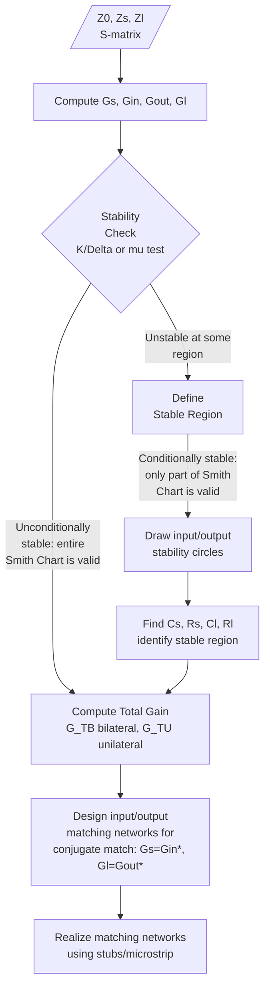
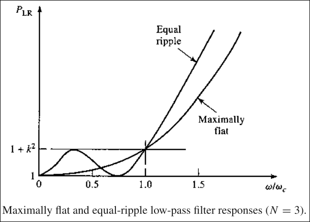
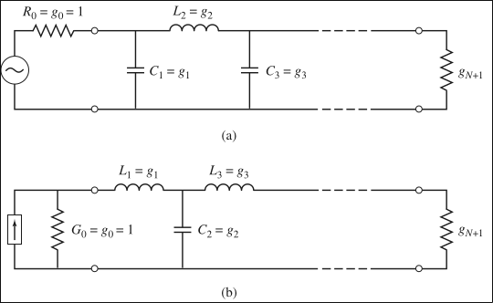
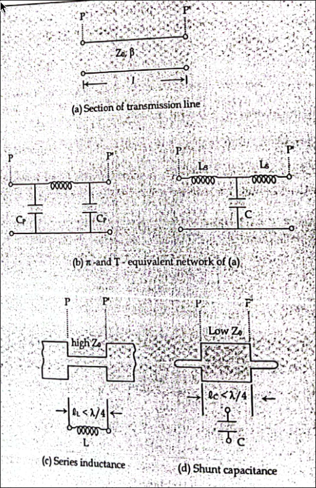
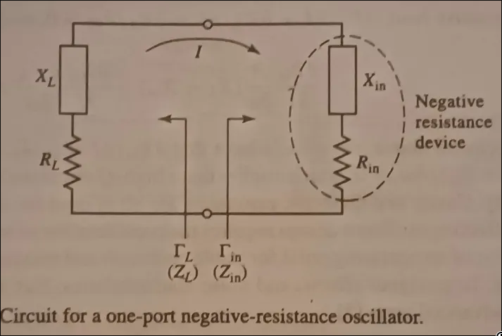
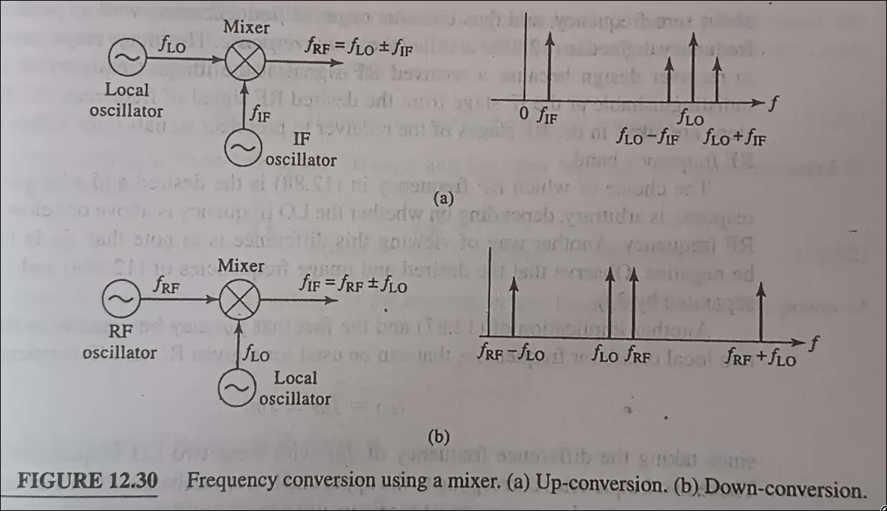

# A. Introduction

- Depending on the application, microwave networks vary from single-port devices (e.g., transmission lines), two-port devices (e.g., amplifiers, filters, oscillators), to multi-port devices (e.g., mixers, modulators, multiplexers).

---

# B. Microwave Amplifiers

- Microwave amplifiers can be classified into three broad categories: **reflection amplifiers**, **parametric amplifiers**, and **two-port amplifiers**.
- The reflection amplifier uses a device that produces an AC negative resistance, where the AC voltage and current are out of phase. Such devices include Tunnel Diodes, Gunn Diodes, and IMPATT diodes with proper terminations.
- Two-port amplifiers include microwave tubes as well as solid-state transistor amplifiers. *(Two-port amplifiers are the syllabus focus.)*
- Microwave transistor amplifiers can use BJTs, FETs, Heterojunction Bipolar Transistors (HBTs), and High Electron Mobility Transistors (HEMTs).
- These amplifiers are rugged, reliable, low-cost, and can be integrated into both hybrid and monolithic microwave integrated circuits (MMICs).
- Present-day microwave transistor amplifiers can work up to 100 GHz, with attractive characteristics: broad bandwidth, low noise figure, and medium power characteristics with desirable stability and gain factors.

## B.1. Amplifier Gain Analysis

- The gain of the amplifier can be defined in three ways:
    - **Power Gain ($G$)**: ratio of power dissipated in the load ($P_L$) to the power delivered to the input ($P_{in}$) of the two-port network: $G = P_L/P_{in}$.
    - **Available Gain ($G_A$)**: ratio of the power available from the network ($P_{Avn}$) to the power available from the source ($P_{Avs}$), provided both source and load are conjugate-matched. Depends on source impedance but **not** on load impedance: $G_A = P_{Avn}/P_{Avs}$.
    - **Transducer Power Gain ($G_T$)**: ratio of power delivered to the load to the power available from the source. A function of **both** source and load impedances: $G_T = P_L/P_{Avs}$.
- When source and load are both conjugately matched to the network, gain is maximum, and $G = G_A = G_T$.

### Reflection Coefficients

$$\Gamma_S = \dfrac{Z_S - Z_0}{Z_S + Z_0}, \qquad \Gamma_L = \dfrac{Z_L - Z_0}{Z_L + Z_0}$$

- From the S-parameter definitions:
$$V_1^- = S_{11}V_1^+ + S_{12}V_2^+ = S_{11}V_1^+ + S_{12}\Gamma_L V_2^-$$
$$V_2^- = S_{21}V_1^+ + S_{22}V_2^+ = S_{21}V_1^+ + S_{22}\Gamma_L V_2^-$$
- Solving for $V_2^-/V_1^+$:
$$\frac{V_2^-}{V_1^+} = \frac{S_{21}}{1-S_{22}\Gamma_L}$$
- This gives the **input reflection coefficient** $\Gamma_{in}$:
$$\Gamma_{in} = \frac{Z_{in}-Z_0}{Z_{in}+Z_0} = S_{11} + \frac{S_{12}S_{21}\Gamma_L}{1-S_{22}\Gamma_L}$$
- Similarly, the **output reflection coefficient**:
$$\Gamma_{out} = \frac{V_2^-}{V_2^+} = S_{22} + \frac{S_{12}S_{21}\Gamma_S}{1-S_{11}\Gamma_S}$$

### Deriving the Transducer Gain

- By voltage division: $V_1 = V_S\dfrac{Z_{in}}{Z_S+Z_{in}} = V_1^+(1+\Gamma_{in})$, giving:
$$V_1^+ = \frac{V_S}{2}\left(\frac{1-\Gamma_S}{1-\Gamma_S\Gamma_{in}}\right)$$
- The average input power:
$$P_{in} = \frac{|V_S|^2}{8Z_0}\cdot\frac{|1-\Gamma_S|^2}{|1-\Gamma_S\Gamma_{in}|^2}(1-|\Gamma_{in}|^2)$$
- The power delivered to the load:
$$P_L = \frac{|V_S|^2|S_{21}|^2|1-\Gamma_S|^2(1-|\Gamma_L|^2)}{8Z_0|1-\Gamma_S\Gamma_{in}|^2|1-S_{22}\Gamma_L|^2}$$
- The total gain:
$$G = \frac{P_L}{P_{in}} = \frac{|S_{21}|^2(1-|\Gamma_L|^2)}{|1-S_{22}\Gamma_L|^2(1-|\Gamma_{in}|^2)}$$

### Available Gain

- $P_{Avs}$ (power available from the source) occurs when $\Gamma_{in}=\Gamma_S^*$ (maximum power transfer theorem):
$$P_{Avs} = \frac{|V_S|^2|1-\Gamma_S|^2}{8Z_0(1-|\Gamma_S|^2)}$$
- $P_{Avn}$ (power available from the network) occurs when $\Gamma_L=\Gamma_{out}^*$:
$$P_{Avn} = \frac{|V_S|^2|S_{21}|^2|1-\Gamma_S|^2}{8Z_0|1-S_{11}\Gamma_S|^2(1-|\Gamma_{out}|^2)}$$
- This gives the **maximum available gain**:
$$G_A = \frac{P_{Avn}}{P_{Avs}} = \frac{|S_{21}|^2(1-|\Gamma_S|^2)}{|1-S_{11}\Gamma_S|^2(1-|\Gamma_{out}|^2)}$$
- And the **total transducer gain**:
$$G_T = \frac{|S_{21}|^2(1-|\Gamma_L|^2)(1-|\Gamma_S|^2)}{|1-\Gamma_S\Gamma_{in}|^2|1-S_{22}\Gamma_L|^2}$$
- **Matched case**: when both input and output are perfectly matched, $\Gamma_L=\Gamma_S=0$, so $G_T = |S_{21}|^2$.
- **Unilateral case** ($S_{12}=0$): here $\Gamma_{in}=S_{11}$, giving:
$$G_T|_{S_{12}=0} = \frac{|S_{21}|^2(1-|\Gamma_L|^2)(1-|\Gamma_S|^2)}{|1-S_{11}\Gamma_S|^2|1-S_{22}\Gamma_L|^2}$$
- Since $S_{12}=0$ but $S_{21}\neq 0$, the system is **non-reciprocal**, a property often exploited deliberately in amplifier circuits.

## B.2. Further Generalization

- The total transducer power gain can be split into three cascaded stages: $G_T = G_S G_0 G_L$, where:
    $$
    G_S = \frac{1-|\Gamma_S|^2}{|1-\Gamma_S\Gamma_{in}|^2}, \qquad G_0 = |S_{21}|^2, \qquad G_L = \frac{1-|\Gamma_L|^2}{|1-\Gamma_L\Gamma_{out}|^2}
    $$
    - $G_S$ = gain of input matching network, $G_0$ = gain of the transistor itself, $G_L$ = gain of output matching network.
- For the **unilateral** amplifier ($S_{12}=0$):
$$G_S = \frac{1-|\Gamma_S|^2}{|1-S_{11}\Gamma_S|^2}, \qquad G_0=|S_{21}|^2, \qquad G_L=\frac{1-|\Gamma_L|^2}{|1-S_{22}\Gamma_L|^2}$$

## B.3. Stability Analysis

*(faq)*

- Stability over a band of frequencies is critical in amplifier design.
- **Instability** results in oscillation, caused by a negative-resistance component, i.e., $|\Gamma_{in}|>1$ or $|\Gamma_{out}|>1$.
- For the unilateral case, this simplifies to $|S_{11}|>1$ or $|S_{22}|>1$.
- Stability is categorized as **unconditional** or **conditional**.

### B.3.a. Unconditional Stability

- Exists when $|\Gamma_{in}|<1$ **and** $|\Gamma_{out}|<1$ (unilateral: $|S_{11}|<1$ and $|S_{22}|<1$) for **all** passive source/load impedances across the **entire** Smith Chart.

### B.3.b. Conditional Stability

- If $|\Gamma_{in}|<1$ and $|\Gamma_{out}|<1$ hold for only **part** of the Smith Chart, the device is **conditionally stable**.
- Since stability is frequency-dependent, an amplifier may be stable in the passband and unstable elsewhere.
- The stable region of $\Gamma_S$/$\Gamma_L$ can be found by plotting **stability circles** on the Smith Chart, the loci where $|\Gamma_{in}|=1$ or $|\Gamma_{out}|=1$.

#### Deriving the Output Stability Circle

- Starting from $|\Gamma_{in}|=1$ using $\Gamma_{in}=S_{11}+\dfrac{S_{12}S_{21}\Gamma_L}{1-S_{22}\Gamma_L}$, simplification gives:
$$|S_{11}-\Delta\Gamma_L| = |1-S_{22}\Gamma_L|, \qquad \Delta = S_{11}S_{22}-S_{12}S_{21}$$
- Squaring and manipulating leads to a circle equation in the complex $\Gamma$-plane, with center $C_L$ and radius $R_L$:
$$C_L = \frac{(S_{22}-\Delta S_{11}^*)^*}{|S_{22}|^2-|\Delta|^2}, \qquad R_L = \left|\frac{S_{12}S_{21}}{|S_{22}|^2-|\Delta|^2}\right|$$
- This is the **output stability circle**.
- By identical reasoning, the **input stability circle** has:
$$C_S = \frac{(S_{11}-\Delta S_{22}^*)^*}{|S_{11}|^2-|\Delta|^2}, \qquad R_S = \left|\frac{S_{12}S_{21}}{|S_{11}|^2-|\Delta|^2}\right|$$

#### Identifying the Stable Region

- On one side of the input stability circle, $|\Gamma_{out}|>1$; on the other, $|\Gamma_{out}|<1$ (and similarly for the output stability circle vs $|\Gamma_{in}|$).
- Setting $Z_L=Z_0$ gives $|\Gamma_{in}|=|S_{11}|$. So:
    - If $|S_{11}|<1$: the **center of the Smith Chart** ($\Gamma_L=0$) lies in the **stable** region, the region **exterior** to the output stability circle is the stable range of $\Gamma_L$.
    - If $|S_{11}|>1$: the center of the Smith Chart lies in the **unstable** region, the region exterior to the output stability circle is now the **unstable** range of $\Gamma_L$ (a similar argument applies to the input stability circle).

    

- To make a device **unconditionally stable**, the stability circles must lie either **completely outside**, or **totally enclose**, the Smith Chart:
$$\big||C_L|-R_L\big| > 1 \ \text{ for } |S_{11}|<1, \qquad \big||C_S|-R_S\big| > 1 \ \text{ for } |S_{22}|<1$$
- Note: $|S_{11}|>1$ or $|S_{22}|>1$ can **never** yield unconditional stability, since a source/load impedance always exists giving $\Gamma_L=0$ or $\Gamma_S=0$, which forces $|\Gamma_{in}|>1$ or $|\Gamma_{out}|>1$.

### B.3.c. Test for Unconditional Stability

- The above conditions can be reduced to two simple algebraic tests. An amplifier is **unconditionally stable** if **both** hold:
$$K = \frac{1-|S_{11}|^2-|S_{22}|^2+|\Delta|^2}{2|S_{12}S_{21}|} > 1, \qquad |\Delta| = |S_{11}S_{22}-S_{12}S_{21}| < 1$$
- Both conditions (K-factor and Δ-parameter) can be combined into a single **μ-test**:
$$\mu = \frac{1-|S_{11}|^2}{|S_{22}-S_{11}^*\Delta|+|S_{12}S_{21}|} > 1$$
- If $\mu>1$, the amplifier is unconditionally stable, and a **larger** $\mu$ indicates a **greater degree** of stability (a practical advantage over the K-Δ test, which only gives a binary pass/fail).

### Amplifier vs Oscillator Circuit: The Role of the Stability Factor

*(Directly answers "Amplifier Vs oscillator circuit: stability factor")*

- An **amplifier** is designed to operate in its **stable region**
    - the entire design procedure above (stability circles, K/Δ/μ tests, choosing $\Gamma_S,\Gamma_L$ within the stable region) exists precisely to *avoid* the unstable region, since oscillation inside an amplifier is an unwanted, parasitic effect that corrupts the desired linear amplification.
- An **oscillator**, by contrast, is deliberately designed to operate in the **unstable region**
    - the same underlying negative-resistance condition ($R_{in}(I,j\omega)+R_L<0$, or equivalently $|\Gamma_{in}|>1$/$|\Gamma_{out}|>1$/$K<1$) that an amplifier avoids is exactly what an oscillator circuit exploits to sustain self-sustaining oscillation (see §Oscillators below).
- In short: **the stability factor $K$ (or $\mu$) is the same figure of merit used to design both circuits, but with opposite design goals**
    - an amplifier is designed for $K>1$ (or $\mu>1$) at the operating frequency, while an oscillator is deliberately designed with $K<1$ (unstable), then a passive load/resonant circuit is added to satisfy $Z_L = -Z_{in}$ at the desired oscillation frequency, converting the instability into a controlled, steady-state oscillation.

## B.4. Single-Stage Transistor Amplifier Design for Maximum Gain

- Once stability is determined and the stable regions for $\Gamma_L,\Gamma_S$ are located, the maximum gains ($G_S, G_0, G_L$) can be found, followed by matching-network design.
- Since $G_0$ is fixed for a given transistor, the overall gain is controlled entirely by $G_S$ and $G_L$, the input and output matching networks.
- **Maximum gain** is achieved with **conjugate matching**: $\Gamma_S=\Gamma_{in}^*$ and $\Gamma_L=\Gamma_{out}^*$.
- With conjugate matching, the total maximum gain:
$$G_{T,max} = \frac{1}{1-|\Gamma_S|^2}\cdot|S_{21}|^2\cdot\frac{1-|\Gamma_L|^2}{|1-S_{22}\Gamma_L|^2}$$
- Solving the simultaneous conjugate-match equations $\Gamma_{in}=\Gamma_S^*$, $\Gamma_{out}=\Gamma_L^*$ leads to a quadratic in $\Gamma_S$:
$$(S_{11}-\Delta S_{22}^*)\Gamma_S^2 + (|\Delta|^2-|S_{11}|^2+|S_{22}|^2-1)\Gamma_S + (S_{11}^*-\Delta^*S_{22}) = 0$$
- Solving:
$$\Gamma_S = \frac{B_1 \pm \sqrt{B_1^2-4|C_1|^2}}{2C_1}, \qquad B_1=1+|S_{11}|^2-|S_{22}|^2-|\Delta|^2,\quad C_1=S_{11}-\Delta S_{22}^*$$
- By symmetry, for $\Gamma_L$:
$$\Gamma_L = \frac{B_2 \pm \sqrt{B_2^2-4|C_2|^2}}{2C_2}, \qquad B_2=1+|S_{22}|^2-|S_{11}|^2-|\Delta|^2,\quad C_2=S_{22}-\Delta S_{11}^*$$
- **Unilateral case** ($S_{12}=0$): $\Gamma_S=S_{11}^*$ and $\Gamma_L=S_{22}^*$, so the unilateral maximum transducer gain becomes:
$$G_{TU,max} = \frac{1}{1-|S_{11}|^2}\cdot|S_{21}|^2\cdot\frac{1}{1-|S_{22}|^2}$$

## B.5. Flowchart of Microwave Amplifier Design Procedure

(*faq*)

- **Steps summarized**:
    1. Compute $\Gamma_S, \Gamma_{in}, \Gamma_{out}, \Gamma_L$ from the given S-parameters and terminations.
    2. Check stability (K-Δ test or μ-test).
    3. If unconditionally stable, the entire Smith Chart is available for matching-network design.
    4. If only conditionally stable, draw the input/output stability circles and identify the stable region.
    5. Compute the maximum available/transducer gain (bilateral $G_{T,max}$ or unilateral $G_{TU,max}$, as appropriate).
    6. Design the input and output matching networks for conjugate match, to realize this maximum gain.
    7. Physically realize the matching networks (e.g., using stub-matching or microstrip sections, as covered in Chapter 2).

---

# C. Microwave Filters

## Introduction

- Microwave filters are two-port, reciprocal, passive, linear devices that heavily attenuate unwanted signal frequencies while permitting transmission of the wanted signal frequency.
- A microwave filter operates between resistive source and load impedances, using mostly reactive elements.

## Classification

- By passband/stopband nature: **low pass (LPF)**, **high pass (HPF)**, **band pass (BPF)**, or **band stop (BSF)**.
- By operational behavior:
    - **Reflective**: consists of inductive/capacitive elements; ideally zero reflection loss in the passband (PB), heavy loss in the stopband (SB).
    - **Absorptive**: dissipates the unwanted signal internally, rather than reflecting it.
    - **Lossy**: uses lossy materials to produce heavy loss in the SB and low loss in the PB.
- Filter operation is based on the properties of **periodic structures**, waveguides/transmission lines loaded with identical obstacles at periodic intervals. Such structures exhibit two key properties: **PB/SB characteristics**, and a **phase velocity much less than the speed of light**. Filter design exploits the first property.
- Performance parameters: Pass bandwidth, Stop bandwidth, I/O impedances, Return Loss (RL), Insertion Loss (IL), Group Delay (GD).

## Filter Synthesis: Two Techniques

- An ideal filter provides transmission over the PB and infinite attenuation over the SB, but no such filter exists in practice. **Filter synthesis** is the process of approximating this ideal behavior within acceptable tolerance.
- **1. Image Parameter Method (IPM)**: a conventional, low-frequency filter design technique. It specifies only the general PB/SB characteristics, not the exact frequency response, requiring "cut and try" refinement. Main disadvantage: arbitrary frequency responses cannot be directly incorporated, and there is no systematic way to improve the design.
- **2. Insertion Loss Method (ILM)**: begins with a **complete specification** of the desired filter frequency response, with no cut-and-try procedure needed. Allows systematic control over both PB and SB characteristics, since IL is frequency-dependent and fully specifies the response via the Power Loss Ratio ($P_{LR}$).

### Why the Insertion Loss Method Is Preferred

- **Complete, systematic specification**: unlike IPM, ILM starts from a fully specified frequency response (e.g., maximally-flat Butterworth or equal-ripple Chebyshev), so the resulting filter behavior is known exactly in advance, no trial-and-error tuning is required.
- **Direct control over PB and SB trade-offs**: the designer can explicitly choose the passband ripple ($a_m$), the filter order ($N$), and the sharpness of the transition to the stopband, all before any component values are computed.
- **Systematic path to realization**: ILM provides a clear, repeatable procedure: normalize to a prototype ($g_k$ values) → scale to the desired cutoff/impedance → transform to the desired filter type (LPF/HPF/BPF/BSF) → realize using lumped or distributed (microstrip) elements. This step-by-step path has no ambiguity, unlike IPM's "cut and try" approach.
- **Better suited to modern computer-aided design**: because the ILM's electrical performance is derived directly from a mathematical polynomial approximation (Butterworth/Chebyshev), it is easily extended, iterated, and optimized computationally, making it the standard technique for practical microwave filter design.

### Synthesis Path: Lumped to Distributed

- Both IPM and ILM initially produce a filter based on **lumped** inductors and capacitors.
- Since lumped elements are impractical at microwave frequencies, they are replaced with **distributed circuit elements** (short transmission-line sections), see the microstrip realization section below.
- **Re-entrant modes**: beyond the stopband frequency, a distributed-circuit filter's response can "pop back" (lose its stopband attenuation) even though the equivalent lumped-circuit filter's response decays monotonically, caused by the inherent **periodic impedance behavior** of transmission lines. Managing these re-entrant modes is a significant challenge in microwave filter design.

## C.1. Filter Model

- Key filter parameters, defined via the two-port model:
    $$IL = -10\log_{10}\left(\frac{P_L}{P_{in}}\right) = -10\log_{10}(1-|\Gamma|^2)$$
    $$RL = -10\log_{10}\left(\frac{P_R}{P_{in}}\right) = -10\log_{10}(|\Gamma|^2)$$
    $$\tau_d = \frac{d\phi_T}{d\omega} = \frac{1}{2\pi}\frac{d\phi_T}{df}$$
    - where $P_{in}$ is input power, $P_R$ is power returned to the source, and $\phi_T$ is the transmission phase.
- **Group delay** measures how long a signal takes to propagate through the filter. If constant, all frequency components of a multi-frequency signal travel at the same velocity, no frequency dispersion. Any deviation from constant group delay causes an FM signal to become distorted.
- An **ideal filter** has zero insertion loss and constant group delay over the PB, and infinite rejection everywhere else.

## C.2. Microwave Filter Design Using ILM

- Insertion Loss:
$$IL = 10\log_{10}(P_{LR}) = 10\log_{10}\left(\frac{1}{1-|\Gamma(\omega)|^2}\right)$$
- $|\Gamma(\omega)|^2$ is even in $\omega$, so it can be written as a polynomial in $\omega^2$:
$$|\Gamma(\omega)|^2 = \frac{M(\omega^2)}{M(\omega^2)+N(\omega^2)}$$
- Substituting:
$$P_{LR} = \frac{1}{1-|\Gamma(\omega)|^2} = 1+\frac{M(\omega^2)}{N(\omega^2)}$$
- For a filter to be physically realizable, its power loss must take this form, which constrains $\Gamma(\omega)$.

- In practice, filters are commonly designed for either a **maximally flat (Butterworth)** response or an **equi-ripple (Chebyshev)** response.

### C.2.a. Butterworth Response

$$IL = 1+a_m^2\left(\frac{\omega}{\omega_c}\right)^{2N}$$
- $N$ = filter order (number of reactive elements), $\omega_c$ = cutoff frequency, $a_m$ = constant related to $\omega_c$.
- The passband spans $\omega=0$ to $\omega=\omega_c$.
- Butterworth exhibits a **flat response in the passband** and monotonically increasing attenuation in the stopband.
- Maximum passband insertion loss is **3 dB**, at $a_m=1$.
- For $\omega>\omega_c$, IL increases monotonically, governed by the exponent $2N$.

### C.2.b. Chebyshev Response

$$IL = 1+a_m^2 T_N^2\left(\frac{\omega}{\omega_c}\right)$$
- $a_m$ (dB) sets the passband ripple level; $N$ is the approximation degree (number of reactive elements).
- Chebyshev polynomials of degree $N$:
$$T_1 = \frac{\omega}{\omega_c},\ \ T_2 = 2\left(\frac{\omega}{\omega_c}\right)^2-1,\ \ T_3 = 4\left(\frac{\omega}{\omega_c}\right)^3-3\frac{\omega}{\omega_c},\ \ T_4 = 8\left(\frac{\omega}{\omega_c}\right)^4-8\left(\frac{\omega}{\omega_c}\right)^2+1$$
$$T_N = 2T_{N-1}-T_{N-2}$$
- Also expressible as:
$$T_N\left(\frac{\omega}{\omega_c}\right) = \cos\left(N\cos^{-1}\frac{\omega}{\omega_c}\right) \text{ for } \frac{\omega}{\omega_c}<1, \qquad T_N = \cosh\left(N\cosh^{-1}\frac{\omega}{\omega_c}\right) \text{ for } \frac{\omega}{\omega_c}>1$$
- Since $T_N$ oscillates between $\pm1$ in the PB, maximum passband gain is $1+a_m^2$ (this is the source of the "ripple").
- For $\omega \gg \omega_c$: $T_N \approx \frac{1}{2}\left(\frac{2\omega}{\omega_c}\right)^N$, giving:
$$IL = 1+\frac{a_m^2}{4}\left(\frac{2\omega}{\omega_c}\right)^{2N}$$

## C.3. Low Pass Filter Prototype

- **Butterworth $g_k$ values**:
$$g_0=g_{N+1}=1, \qquad g_k = 2\sin\left(\frac{(2k-1)\pi}{2N}\right) \text{ for } k=1,2,3,\dots$$
- **Chebyshev $g_k$ values** (more involved, since ripple must be accounted for):
$$g_0=1 \text{ (all } N\text{)}, \quad g_N=1 \text{ (odd } N\text{)}, \quad g_{N+1}=\coth^2(\beta/4) \text{ (even } N\text{)}$$
$$\beta = \ln\left(\coth\left(\frac{a_m}{17.87}\right)\right) \text{ for } a_m \text{ in dB}$$
$$g_1 = \frac{P_1}{\sinh(\beta/2N)}, \qquad g_k = \frac{4P_{k-1}P_k}{g_{k-1}\cdot[\text{recursive terms}]}, \quad k=2,\dots,N$$
- Values of $g_k$ are typically obtained from **lookup tables** for given $a_m$ and IL, rather than computed by hand each time.

### Prototyping: Scaling to the Desired Filter

- Prototype element values are normalized so $g_0=1$ and $\omega/\omega_c=1$; this prototype is the basis for the actual filter design at the desired band-edge and impedance.
- If $g_R, g_L, g_C$ correspond to the normalized resistance/inductance/capacitance, the actual filter elements are:
    $$R = R_0 g_R, \qquad L = R_0\frac{g_L}{\omega_1}, \qquad C = \frac{g_C}{R_0\omega_1}$$
    - where $\omega_1,\omega_2$ are the band-edge angular frequencies, $\omega_c$ is the angular cutoff frequency, and $R_0$ is the generator resistance.

### Transformation Table: Prototype to LPF/HPF/BPF/BSF

| Prototype element | LPF | HPF | BPF | BSF |
|---|---|---|---|---|
| **Series arm** | $L_k=\dfrac{g_k Z_L}{\omega_c}$; $C_k=\dfrac{Z_L}{g_k\omega_c}$ | $C_k=\dfrac{1}{g_k Z_L\omega_c}$; $L_k=\dfrac{g_k}{Z_L\omega_c}$ | $L_k=\dfrac{g_k Z_L}{\omega_2-\omega_1}$; $C_k=\dfrac{\omega_2-\omega_1}{\omega_c\, g_k Z_L}$ | $L_k=\dfrac{g_k Z_L(\omega_2-\omega_1)}{\omega_c}$; $C_k=\dfrac{1}{g_k Z_L(\omega_2-\omega_1)}$ |
| **Shunt arm** | $L_k=\dfrac{1}{g_k Z_L\omega_c}$; $C_k=\dfrac{g_k}{Z_L\omega_c}$ | $L_k=\dfrac{Z_L}{g_k\omega_c}$; $C_k=\dfrac{g_k Z_L}{\omega_c}$ | $L_k=\dfrac{Z_L}{g_k(\omega_2-\omega_1)}$; $C_k=\dfrac{g_k(\omega_2-\omega_1)}{Z_L\omega_c}$ | $L_k=\dfrac{g_k(\omega_2-\omega_1)}{Z_L\omega_c}$; $C_k=\dfrac{Z_L}{g_k(\omega_2-\omega_1)}$ |

- This table encodes the complete frequency and impedance scaling from the normalized prototype to any of the four filter types: once $g_k$ is known from the Butterworth/Chebyshev tables above, these formulas give the actual $L$/$C$ values directly.

## C.3.a. Realization of Inductors and Capacitors in Microstrip

- To implement the filter in microstrip, lumped $L$/$C$ values must be translated into microstrip line sections.
- At microwave frequencies, this is done using short transmission-line sections, typically **less than $\lambda/4$**.
- Consider the $\pi$ and $T$ equivalent networks of a transmission-line section:

- From the ABCD matrix of a transmission-line section, the $\pi$/$T$-equivalent element values can be expressed in terms of $Z_0$ and $\beta$:

**$\pi$-equivalent network:**
$$\omega L = Z_0\sin(\beta l), \qquad \omega C_P = \frac{1}{Z_0}\tan\left(\frac{\beta l}{2}\right)$$

**$T$-equivalent network:**
$$\omega C = \frac{1}{Z_0}\sin(\beta l), \qquad \omega L_S = Z_0\tan\left(\frac{\beta l}{2}\right)$$

- **Series inductor realization**: examining the $\pi$-network shows that a **short section of high characteristic impedance ($Z_0$) line** behaves predominantly as a series inductance, realized by a **narrow-width strip conductor**, terminated in a relatively low impedance.
    - Length of the inductive line: $l_L = \dfrac{\lambda}{2\pi}\sin^{-1}\left(\dfrac{\omega L}{Z_0}\right)$
    - The associated shunt susceptance $\omega C_P$ is very small, treated as a capacitive end-correction: $C_P = \dfrac{1}{\omega Z_0}\tan\left(\dfrac{\pi l_L}{\lambda}\right)$
- **Shunt capacitor realization**: from the $T$-network, a **short, low-impedance line** terminated at either end in relatively high impedance behaves as a shunt capacitance, realized by a **wide rectangular patch**.
    - Length of the capacitive patch: $l_C = \dfrac{\lambda}{2\pi}\sin^{-1}(\omega C Z_0)$
    - The associated end inductance: $L_S = \dfrac{Z_0}{\omega}\tan\left(\dfrac{\pi l_L}{\lambda}\right)$, generally small enough to be ignored.
- **Design summary**: a series inductor becomes a narrow microstrip line; a shunt capacitor becomes a wide microstrip patch, alternating narrow and wide sections along the strip directly realizes the LPF's ladder network in microstrip form.

---

# D. Oscillator and Mixer Theory

## Microwave Oscillators

- The canonical circuit for a **one-port negative-resistance oscillator**: an active device (e.g., a biased diode) with input impedance $Z_{in}=R_{in}+jX_{in}$, terminated by a passive load impedance $Z_L=R_L+jX_L$.
- In general, $Z_{in}$ depends on both current and frequency: $Z_{in}(I,j\omega) = R_{in}(I,j\omega)+jX_{in}(I,j\omega)$.
- Applying KVL: $(Z_L+Z_{in})I=0$. For oscillation to occur (nonzero RF current $I$), we require:
$$R_L+R_{in}=0, \qquad X_L+X_{in}=0$$
- Since the load is passive, $R_L>0$, which forces $R_{in}<0$. A positive resistance dissipates energy; a **negative resistance is an energy source**, this is the fundamental oscillator mechanism.
- The condition $X_L+X_{in}=0$ sets the **frequency of oscillation**.
- $(Z_L+Z_{in})I=0$ implies $Z_L=-Z_{in}$ at steady state, giving the reflection-coefficient relation:
$$\Gamma_L = \frac{Z_L-Z_0}{Z_L+Z_0} = \frac{-Z_{in}-Z_0}{-Z_{in}+Z_0} = \frac{Z_{in}+Z_0}{Z_{in}-Z_0} = \frac{1}{\Gamma_{in}}$$

### Startup and Steady-State Behavior

- **Startup**: the overall circuit must initially be unstable at some frequency, i.e., $R_{in}(I,j\omega)+R_L<0$. Any transient excitation or noise then triggers oscillation buildup at that frequency.
- **Growth**: as current $I$ increases, $R_{in}(I,j\omega)$ becomes progressively less negative.
- **Steady state**: reached at current $I_0$ such that $R_{in}(I_0,j\omega_0)+R_L=0$ and $X_{in}(I_0,j\omega_0)+X_L=0$, the oscillator now runs stably.
- Note: the final oscillation frequency $\omega_0$ generally **differs** from the startup frequency, since $X_{in}$ is current-dependent.

### Stability of the Steady State

- The zero-resistance conditions alone are **not sufficient** to guarantee a *stable* oscillation, any perturbation in current or frequency must be **damped out**, returning the oscillator to its original state.
- Considering a small perturbation $\delta I$ in current and $\delta s$ in complex frequency $s=\alpha+j\omega$, and defining $Z_T(I,s)=Z_{in}(I,s)+Z_L(s)$, a Taylor expansion about the operating point $(I_0,\omega_0)$ gives (using $Z_T(I_0,s_0)=0$):
$$\delta s = \delta\alpha+j\delta\omega = \frac{-j(\partial Z_T/\partial I)(\partial Z_T^*/\partial\omega)}{|\partial Z_T/\partial\omega|^2}\delta I$$
- For the transient to **decay** (stability), we require $\delta\alpha<0$ when $\delta I>0$, which leads to the stability condition:
$$\frac{\partial R_T}{\partial I}\frac{\partial X_T}{\partial\omega} - \frac{\partial X_T}{\partial I}\frac{\partial R_T}{\partial\omega} > 0$$
- For a **passive load** (whose parameters don't depend on $I$ or $\omega$ in this sense), this reduces to:
$$\frac{\partial R_{in}}{\partial I}\frac{\partial}{\partial\omega}(X_L+X_{in}) - \frac{\partial X_{in}}{\partial I}\frac{\partial R_{in}}{\partial\omega} > 0$$
- Since typically $\partial R_{in}/\partial I > 0$, this condition is satisfied when $\partial(X_L+X_{in})/\partial\omega$ is **large**, meaning a **high-Q circuit** gives maximum oscillator stability.
- This is why **cavity and dielectric resonators** are often used in practical oscillator design.
- Effective oscillator design also requires considering: choice of operating point for stable operation and maximum power output, frequency pulling, large-signal effects, and noise characteristics, these are advanced topics beyond the scope here.

## Mixers

- A **mixer** is a three-port device using a nonlinear or time-varying element to achieve **frequency conversion**.
- An ideal mixer produces an output consisting of the **sum and difference** of its two input signal frequencies.
- Practical mixers rely on the nonlinearity of a diode or transistor. Since a nonlinear component generates a wide range of harmonics and other unwanted products, **filtering** is required to select the desired output frequency.
- Modern microwave systems use several mixers and filters for frequency **up-conversion** and **down-conversion** between baseband and RF carrier frequencies.

- The mixer symbol implies the output is proportional to the **product** of the two inputs, an idealized view
- real mixers produce many additional undesired harmonic products.

### Up-Conversion (Transmitter)

- A **Local Oscillator (LO)** signal at relatively high frequency, $v_{LO}(t)=\cos(2\pi f_{LO}t)$, is applied to one mixer input.
- A lower-frequency baseband/Intermediate Frequency (IF) signal (carrying the data), $v_{IF}(t)=\cos(2\pi f_{IF}t)$, is applied to the other input.
- The idealized mixer output is their product:
    $$v_{RF}(t) = K\,v_{LO}(t)\,v_{IF}(t) = \frac{K}{2}\left[\cos 2\pi(f_{LO}-f_{IF})t + \cos 2\pi(f_{LO}+f_{IF})t\right]$$
    - where $K$ accounts for the mixer's voltage conversion loss.
- The RF output consists of the sum and difference: $f_{RF}=f_{LO}\pm f_{IF}$.
- These are called the **sidebands** of the carrier $f_{LO}$: $f_{LO}+f_{IF}$ is the **Upper Sideband (USB)**, and $f_{LO}-f_{IF}$ is the **Lower Sideband (LSB)**.
- A **Double Sideband (DSB)** signal contains both; a **Single Sideband (SSB)** signal is produced by filtering, or by using a dedicated single-sideband mixer.

### Down-Conversion (Receiver)

- The RF input, $v_{RF}(t)=\cos(2\pi f_{RF}t)$, is applied along with the LO signal $v_{LO}(t)=\cos(2\pi f_{LO}t)$.
- The mixer output:
$$v_{IF}(t) = K\,v_{RF}(t)\,v_{LO}(t) = \frac{K}{2}\left[\cos 2\pi(f_{RF}-f_{LO})t + \cos 2\pi(f_{RF}+f_{LO})t\right]$$
- In practice, $f_{RF}$ and $f_{LO}$ are close together, so the **sum** frequency is nearly twice $f_{RF}$ (easily filtered out), while the **difference** frequency is much smaller, this difference is the desired IF output, easily selected by low-pass filtering:
$$f_{IF} = f_{RF} - f_{LO}$$
- **Note**: this idealized analysis only considers the sum/difference terms from pure multiplication. A realistic mixer (diode/transistor nonlinearity) generates many additional undesired harmonic products, which must be removed by filtering.

---

