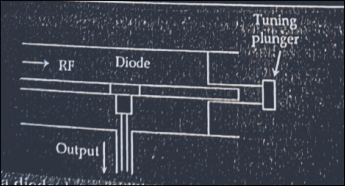
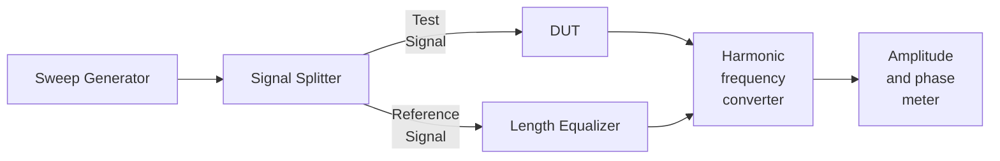
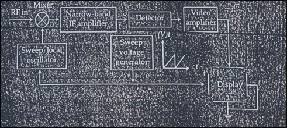
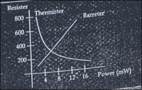
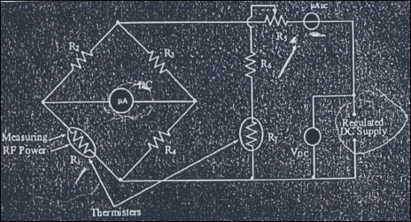
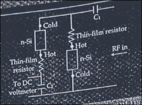
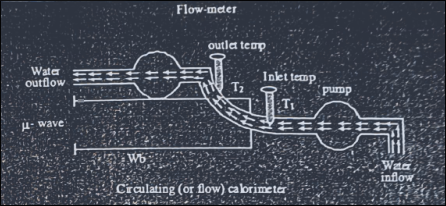
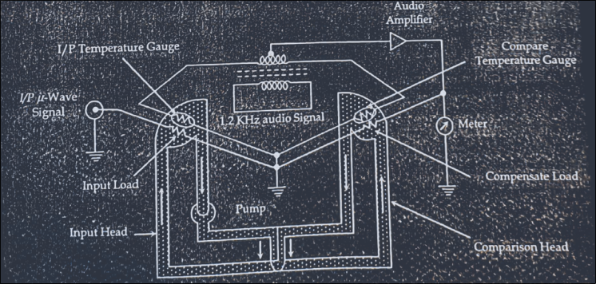

# 8.1 Introduction

- At microwave frequency bands, circuits contain **distributed elements**,
    - where the amplitude and phase of voltages and currents are functions of
    - both distance and wavelength,
    - making them difficult to measure directly.
- In some single-conductor transmission systems, such as waveguides,
    - there is no option to measure voltage and current directly,
    - since such measurements require a two-conductor system.
- Unlike low-frequency measurements, at microwave frequencies
    - **power** is generally measured instead of voltage and current.
- Other useful measurables at microwave frequencies include:
    - **S-parameters**, **phase shift**, **VSWR**, and **noise figure**.
- Direct measuring instruments at microwave frequencies:
    - vector and scalar network analyzers, spectrum analyzers, power meters, etc.
    - are very costly.
- Therefore, in a typical laboratory setting,
    - microwave measurement is often carried out using
    - a **low-frequency tuned receiver** and a **VSWR meter**.

## List of Major RF/Microwave Measurement Parameters

- **Power** (low, medium, and high power)
- **Frequency** and **wavelength**
- **VSWR** (Voltage Standing Wave Ratio)
- **Impedance** and **reflection coefficient**
- **S-parameters** (magnitude and phase, via VNA)
- **Insertion loss** and **return loss**
- **Noise figure**
- **Attenuation** and **phase shift**
- **Q-factor** (of resonant cavities/circuits)

---

# 8.2 Microwave Signal Detection

- As in low-frequency measurements,
    - microwave signals are first **detected**, but here,
    - detection is performed using microwave semiconductor diodes
    - such as the **Schottky barrier diode** and the **point-contact diode**.
- The diode-detected signal is tuned to generate
    - a proportional **DC current** signal at its output.
- **Tuned detectors** are
    - specially designed point-contact or metal-semiconductor Schottky barrier diodes,
    - mounted in a microwave transmission line
    - to detect a low-frequency square-wave-modulated microwave signal.

- The figure shows a schematic of a diode detector inside a waveguide, with a coaxial probe.
- The tuned detector **rectifies** the received signal and
    - produces a DC current proportional to the received power, hence,
    - tuned detectors are also called **square-law detectors**.
- The **current sensitivity** of a detector diode
    - is a function of bias level, and
    - usually lies in the range of $1$ – $15\ \mu A/\mu W$.
- Current sensitivity is defined as the ratio of the increase in short-circuit current to the input power.
    - For simplicity, most detector diodes are operated **without** any bias level.
- To increase detector sensitivity,
    - the microwave power is sometimes modulated with a **1 kHz square wave** signal,
    - and the detector diode's output is amplified using a tuned amplifier.
- The instrument used to amplify and display the output of the detector diode is called a **detector amplifier** or **standing wave detector**.

---

# 8.3 Wavelength Measurement Using Slotted Line Carriage

- At microwave frequencies, a device called a **wavemeter** is commonly used to measure the wavelength of a signal, which is then converted to the corresponding frequency.
- A **slotted line carriage** is the simplest wavemeter for measuring frequency,
    - an arrangement is made for a probe to move along the line.
- It samples the electric field at different points along the guide,
    - resulting in an equivalent probe voltage.
- Thus, the voltage at different points along the waveguide, and hence the **VSWR**, can be found.
- By measuring the distance between two voltage minima, the **guided wavelength** can be measured:
$$\frac{1}{\lambda_0^2} = \frac{1}{\lambda_g^2} + \frac{1}{(2a)^2}, \qquad \lambda_g = 2d_{min}, \qquad f = \frac{c}{\lambda_0}$$
    - where $a$ is the width of the waveguide,
    - $\lambda_g$ is the guide wavelength,
    - $\lambda_0$ is the free-space wavelength,
    - $d_{min}$ is the distance between two consecutive voltage minima,
    - and $c$ is the speed of light.
- Other parameters that can be measured with a slotted line carriage include
    - **impedance** and **reflection coefficient**.

---

# 8.4 VSWR Meter

- A **VSWR meter** (or SWR meter) is basically
    - a **high-gain, high-Q, low-noise voltage amplifier**,
    - tuned to the modulating frequency of the microwave signal (generally 1 kHz).
- The overall gain of the amplifier is about **125 dB**,
    - adjustable in steps of 10 dB via a gain control panel.
- The output of the VSWR meter displays the detected microwave signal,
    - calibrated to give the VSWR reading directly,
    - i.e., the ratio of maximum to minimum voltage levels:
$$VSWR = \frac{V_{max}}{V_{min}}$$
- **Procedure**:
    - to measure VSWR, the meter needle is initially adjusted to **1**
        - after placing the probe at the $V_{max}$ position within the guide 
        - using the gain control panel for this adjustment.
- The input of the VSWR meter
    - is the detected output voltage of the tuned detector,
    - fed via a coaxial cable.
- The final scale of the meter can also be used for measurements in the **dB scale**.

## How High VSWR (VSWR > 10) Is Measured

- When a microwave transmitter suffers an extreme impedance mismatch (VSWR > 10),
    - the standard **direct-reading method fails**:
    - Probing $V_{max}$ yields very large values that can **saturate or damage** the detector probe.
    - $V_{min}$ drops so close to zero that it gets **lost in system noise**.
- To overcome this, the **Double-Minimum Method** 
    - aka the **twice-minimum method**
    - is used on a slotted-line microwave bench setup,
    - instead of measuring $V_{max}$ at all,
    - this technique relies strictly on the sharp profile of the voltage **minimum**.

### Procedure

1. **Locate the minimum**:
    - move the tunable probe of the slotted line along the waveguide
    - until the VSWR meter (or oscilloscope) registers
    - the lowest possible voltage value, $V_{min}$.
    - Note this position as $d_0$.
2. **Find the first double-minimum point**:
    - move the probe to the **left** of $d_0$
    - until the power meter reads exactly **twice** the minimum power ($2P_{min}$,
    - i.e. $\sqrt{2}\,V_{min}$ on a voltage scale.
    - Record this position as $d_1$.
3. **Find the second double-minimum point**:
    - move the probe to the **right**, past $d_0$,
    - until the reading again hits exactly twice the minimum value.
    - Record this position as $d_2$.
4. **Determine guide wavelength** ($\lambda_g$):
    - measure the distance between two consecutive raw voltage minima
    - to compute $\lambda_g = 2\,\Delta d_{min}$.
5. Using the recorded physical distance between the two double-power points,
    - $(d_2 - d_1)$, compute the high VSWR using:
    $$VSWR \cong \frac{\lambda_g}{\pi(d_2-d_1)}$$

- Because the voltage-minimum curve is extremely steep in a highly mismatched line,
    - the distance $(d_2-d_1)$ is small and highly legible,
    - yielding an accurate VSWR measurement well above 10,
    - **without risking detector saturation**.

---

# 8.5 Network Analyzer

- A **network analyzer** is a versatile measuring device,
    - used to measure the network characteristics of a microwave network.
- It can measure several parameters, including:
    - time-domain measurements, amplitude and phase of the microwave signal
    - over a wide frequency range, noise figure, and S-parameters.
- Depending on measurement capability, network analyzers are classified as:
    - **Vector Network Analyzers (VNA)**: measure both **amplitude and phase**.
    - **Scalar Network Analyzers (SNA)**: measure only **amplitude**.

## Basic Operating Principle

- The basic operation involves generating an accurate **reference signal**, and comparing a **test signal** against it.
- The signal applied to the Device Under Test (**DUT**),
    - after transmission or reflection,
    - is fed to a comparator and compared with the reference signal,
    - this comparison gives the measurement of the amplitude and phase state of the DUT.
- When a DUT is inserted into the VNA's network,
    - it provides measurements of **insertion loss** and **return loss**.
- **Transmission or reflection coefficients** and **attenuation coefficient** can also be measured, under power-measurement considerations.
- In the VNA, a **harmonic frequency converter** uses a phase-locked loop (PLL)
    - to help the local oscillator track the reference channel frequency.
- For reflection and transmission measurement, a **reflection-transmission measurement unit** is required.

*Fig: Schematic block diagram of a VNA*

---

# 8.6 Spectrum Analyzer

- A spectrum analyzer provides the **signal spectrum** of a received signal, i.e., a plot of amplitude against frequency.

## Working Principle

- The spectrum analyzer consists of a **local oscillator**,
    - electronically swept back and forth at a linear rate between two frequency limits,
    - the **start frequency** and **stop frequency**,
    - using a sawtooth-type swept voltage (with zero flyback time).
- The measured microwave signal is **super-heterodyned** with the sweep voltage.
- After mixing the swept signal with the measured microwave signal,
    - a signal at an **Intermediate Frequency (IF)** is obtained,
    - which is then fed to a **narrow bandpass filter**.
- The filter is followed by a **detector**, then a **video amplifier** with a **CRT display**.
- The sawtooth wave (with zero flyback time) moves the spot on the CRT **horizontally**,
    - in synchronism with the swept frequency,
    - so the horizontal position is a function of frequency,
    - and the vertical deflection represents amplitude.
- For better resolution, the bandwidth of the **IF amplifier** should be as small as possible.
- The sweep speed should be low,
    - so that voltage can build up sufficiently in the receiver circuit.
- To avoid **image response**,
    - the IF should be chosen as high as possible.
- A spectrum analyzer can display:
    - the exact frequency of a signal,
    - its stability over time,
    - presence of spurious oscillations and interfering signals,
    - noise and distortion, and
    - the effect of modulation on the carrier.

## Key Characteristic Properties

- **Frequency Range**:
    - the overall frequency band the instrument can receive and analyze,
    - generally depends on the mixer and local oscillator system.
- **Frequency Span**:
    - the range of frequencies that can be displayed on the screen at a given time,
    - can be the full frequency range, or a portion of it,
    - depending on instrument settings.
- **Frequency Resolution**:
    - the minimum frequency difference between two signals required to identify them separately.
    - Set by the bandwidth of the swept bandpass filter, and
    - directly related to sweep speed, higher resolution corresponds to a longer sweep time.
- **Sensitivity**:
    - due to internal electronic components,
    - spectrum analyzers always have an associated **noise floor**,
    - which sets the minimum measurable signal level.
    - A smaller bandwidth gives a lower noise floor and higher sensitivity.
- **Dynamic Range**:
    - the difference between the maximum usable signal power and the minimum detectable signal power.
    - The maximum usable power is limited by non-linear distortion and damage risk,
    - the minimum detectable power is set by sensitivity.

---

# 8.7 Power Measurement

- Unlike at low frequencies,
    - microwave power values are **distributed at test points**.
    - Hence, measurement must be done under conditions of **perfect matching**.
- Microwave power measurement is generally divided into three categories:
    - **Low power**: $< 10\ mW$
    - **Medium power**: $10\ mW$ to $10\ W$
    - **High power**: $> 10\ W$
- Since power is the quantity of energy dissipated per unit time,
    - an **average power** concept is used in measurements,
    - i.e., average power is measured as the product of peak-to-peak power and duty cycle.
- Power measurements are generally done indirectly,
    - using power sensors categorized into:
        a. Sensors whose **resistance changes** with applied power,
            - e.g., Schottky diode detectors, bolometers, and thermocouples.
        b. Sensors whose **temperature rises** with applied power,
            - e.g., calorimeters.
- **Bolometers** are commonly used for low-to-medium power,
    - **calorimeters** are used for high-power measurements.

## 8.7.1 Bolometer

### Barretters

- **Barretters** have a **positive temperature coefficient**,
    - resistance increases with increasing temperature.
- Use a short, thin platinum wire (diameter $< 0.0001$ inch),
    - suited for **very low power measurement** ($< $ few mW).
- Prepared by etching silver away from the platinum core of Wollaston wire,
    - the desired resistance is achieved by adjusting the wire length.
- The barretter's resistance is kept sufficient to be matched with the system,
    - for efficient energy absorption.
- Overload characteristics are **not as good** as a thermistor's
    - thermistors can withstand severe overloads without a change in characteristics.
- Has a fairly low thermal time constant (about $0.3\ ms$).
- Detector sensitivity: thermistor $\approx 60\ \Omega/mW$; barretter $\approx 5.2\ \Omega/mW$.

### Thermistors

- **Thermistors** are semiconductor sensors with a **negative temperature coefficient** of resistance.
- Made from a mixture of nickel and manganese oxides,
    - with finely divided copper particles,
    - and a diameter of about $0.05\ cm$.
- Also available as washers, disks, rods, or flakes.
- Used to measure **medium and high power** (after suitable attenuation)
    - easily mounted in a transmission line.
- Provide good isolation from physical/thermal shock,
    - good shielding against energy leakage, and
    - good matching,
    - also a low-loss device.

### Power Measurement Using Bolometers

- Like diodes, bolometers are **square-law devices**,
    - producing current proportional to applied power
    - the sensor is mounted in the waveguide.
- When mounted in a waveguide,
    - the bolometer should be placed at a point of **maximum electric field**.
- If a standing wave exists along the sensor wire,
    - it should be positioned so that
    - the center of the wire coincides with the midpoint between current maxima and minima,
    - reducing error from hot spots at the current maxima.
- With suitable arrangement, bolometers can also measure **high power**.
    - This can be extended further,
    - beyond what's possible using a single attenuator and directional coupler alone,
    - though this is limited practically by the power-handling capability
    - of the directional coupler and attenuator.

### Single-Bridge Bolometer Power Measurement

- Microwave power meters use a **balanced bridge network**,
    - with the bolometer as one of its arms.
- Since the bolometer is temperature-sensitive,
    - its resistance can be controlled by heating from a variable DC power supply.
- If microwave power is applied to the bolometer,
    - its resistance changes due to heating,
    - destroying the bridge balance,
    - producing a **non-zero output** at the meter connected to the bridge.
- The meter reading is calibrated to measure the incident power directly.

- The bridge is initially balanced by adjusting $R_5$ 
    - which varies the DC supply to the bridge,
    - in the **absence** of any RF power.
- Once RF is applied to $R_1$,
    - the bridge goes out of balance,
    - and the resistance of the thermistor $R_1$ changes.
- At this point,
    - either the DC supply is adjusted,
    - or the current in the galvanometer deflects,
    - to bring the bridge back into balance.
    - From either approach, power can be measured.
    - The galvanometer deflection is calibrated to the input power.
- $R_5$ and $R_6$ compensate for temperature changes in $R_1$. $R_1$ and $R_2$ are identical thermistors.

### Limitations of the Single-Bridge Bolometer

- The single-bridge method **cannot distinguish** 
    - between resistance changes caused by ambient temperature drift
    - and resistance changes caused by the actual applied RF power,
    - both cause identical bridge imbalance.
- This means any fluctuation in the surrounding (ambient) temperature
    - is misread as a change in incident RF power,
    - introducing significant **measurement error and instability**,
    - particularly for low-power measurements
    - where the RF-induced signal is comparable in magnitude to typical thermal drift.
- This limitation is precisely what motivates
    - the **double-channel (balanced/differential) bolometer bridge** method.

### Double-Channel Bolometer Bridge

- To eliminate ambient temperature sensitivity and measurement instability,
- a **double-channel (balanced/differential) bolometer bridge**
    - uses **two identical bolometer elements**,
    - configured in two separate bridge channels,
    - both exposed to the **same ambient environment**.

**Working:**

1. Both bridges are initially balanced with DC bias supplies,
    - in the absence of RF power, yielding a zero differential voltage output.
2. When ambient temperature fluctuates,
    - **both** bolometers experience the exact same change in resistance,
    - $\Delta R_{temp}$. The error signal in both channels changes **equally**.
3. When RF is applied to channel 1,
    - its active element absorbs heat
    - and changes resistance by $\Delta R = \Delta R_{temp} + \Delta R_{RF}$.
4. A **differential amplifier** compares the output of both bridges:
    $$\text{Output voltage} \propto (\Delta R_{temp}+\Delta R_{RF}) - \Delta R_{temp} = \Delta R_{RF}$$
5. The ambient temperature effect is **completely cancelled out**,
    - leaving an output voltage strictly proportional to the **incident RF power** alone.

This differential cancellation is the key advantage of the double-channel method over the single-bridge method, it removes the exact source of error identified above.

## 8.7.2 Thermocouple

- A **thermocouple** consists of two different metals or semiconductors,
    - in contact at two or more points.
- When the two ends are maintained at different temperatures,
    - a proportional **EMF** is developed in the circuit.
- By measuring this generated EMF,
    - the temperature of the hot end
    - and the incident power, can be determined,
    - provided the cold-end temperature is known.
- For microwave applications,
    - a thin-film **tantalum nitride** resistive load
    - deposited over N-type silicon
    - is used to form the thermocouple junction.

### Working Principle

- The EMF generated by two parallel thermocouples **adds**, and appears across the RF bypass capacitor $C_2$.
- The output leads should be at RF ground, so the measured DC voltage is proportional to the incident microwave power.
- Thermocouples are temperature-sensitive and easy to use, however, resistance changes with temperature make impedance **matching difficult**.
- They require a small-diameter heater resistance to remove skin effect and frequency dependence, this forces the thermocouple to work close to its limit, resulting in a **narrow dynamic range** and **low sensitivity** over varying loads.

## 8.7.3 Calorimeter

- If all incoming power is dissipated as heat in a load of known thermal properties,
    - this power can be calibrated to the **temperature rise** in the load,
    - this process is known as **calorimetry**.
- Calorimetry is commonly used to measure **medium-to-high** microwave power,
    - where the temperature rise of a special load
    - is calibrated against the applied power.
- Depending on the load and circuitry,
    - there are two common types:
    - **circulating calorimeter** and **flow calorimeter**.

### 8.7.3.1 Circulating Calorimeter (Calmeter)

- The circulating calorimetric method for measuring high power ($10\ W$ and above)
    - is based on measuring the **temperature rise** of a fluid (usually water),
    - due to absorption of microwave power.
- Also known as the **calorimeter wattmeter**
    - these meters may be of **dry type** or **flow type**.
- This method involves converting microwave energy into heat.
- For the **flow type**,
    - knowing the rate of fluid flow,
    - the exact power can be calculated as:
    $$P_{av} = \frac{R\,C\,\rho\,(T_2-T_1)}{4.18} \quad \text{(Watts)}$$
    - where $P_{av}$ is the average power,
    - $R$ is the flow rate ($cm^3/s$),
    - $C$ is the specific heat of the liquid (usually water),
    - $(T_2-T_1)=\Delta T$ is the temperature difference (°C), and
    - $\rho$ is the specific gravity ($g/cm^3$).
- For the **dry type (static) calorimeter**,
    - the average power can be calculated as:
    $$P_{av} = \frac{4.187\,m\,C\,\rho\,\Delta T}{t} \quad \text{(Watts)}$$
    - where $m$ is the mass of the liquid, and
    - $t$ is time (seconds).

- The figure shows an arrangement of a circulating calorimeter using water as the load, inside a waveguide.
- Power measurement can be **direct** or **indirect**:
    - **Direct method**:
        - the rate of heat production is measured
        - by observing the temperature rise of the calorimetric fluid directly.
    - **Indirect method**:
        - the heat from the dissipating medium is transferred to another medium for measurement.
- Since the dissipating medium **circulates** through the setup,
    - this method is called **circulating calorimetry**.

### 8.7.3.2 Flow Calorimeter

- For **very high power** measurement,
    - a substitute for the circulating calorimeter is the **flow calorimeter**,
    - where dissipated power is measured in terms of changes in **audio power level**,
    - not in terms of temperature directly,

- The calorimeter consists of a **heat exchanger** with input and output heads, filled with a liquid (usually oil).
- Inside the input/output heads, a bridge of temperature sensors and gauges compensates for changes in heat as the liquid circulates.
- An **audio amplifier**, driven by a $1.2\ kHz$ audio signal source, is coupled with the microwave bridge circuit.
- The audio power is made **proportional** to the supplied microwave power, through the compensation load of the bridge.

### Working Principle

- The heat exchanger ensures the liquid entering both arms is at the **same temperature**,
    - so any temperature imbalance due to the applied microwave signal can be sensed.
- If a temperature difference is sensed,
    - the input/output heads of the bridge go **out of balance**,
    - the potential between the center-tapped transformer and ground
    - is no longer zero, causing bridge imbalance.
- The resulting voltage rise (from the imbalance)
    - is amplified by the audio amplifier and
    - supplied back to the compensating load.
- The rise in audio level is calibrated to the supplied microwave power.
- The compensating temperature gauge notes the temperature imbalance,
    - restores bridge balance,
    - and resets for the next measurement.

---

