# Transit Time Effect

## Background

- Transit time is time taken for movement or transition of electron from one electrode to another is known transit time
- And the effect which is caused due to transit time is known as **Transit Time Effect**
- Transit time effect, it is seen that it occurs not only in ntriode tubes but also in transistor and many other devices which depends on short time between electrodes.

## TTE on Tubes at various frequencies

- At low frequencies, it is possible that electrons leaves the cathode and arrive at anode of tube instantaneously.
- but certainly it does not occurs at mcirowave frequency.
- transit time occurs at appreciable fraction of RF cycle.
- Due to this many effects results from this situation.

## The effects are as follows

- as soon as the grid and anode signals are 180 degree out of phase, it causes design problem especially in feedback oscillator
- another important effect is tthat thte grid begins to take more power from the driving source.
- the power is absorbed (dissipated) even when the grid is negatively biased.

## Effects at ultrahigh frequencies

- The area between the grid and cathode becomes highly negatively charge is surrounded by an electrostatic field.
- This negative charge is surrounded by an electrostatic field.
- this electrostatic field cuts the grid and repels electrons that are present in the grid.
- As electrons are forced from the grid, the grid tries to go positive.
- unfortunately, this tendency toward a positive charge attracts eelctrons from the mass charge.
- thuhs as an electron is forced from the grid
- it is replaced by another from the massed charge
- electrons forced from the grid represent grid current (Ig), as shown below in fig D.
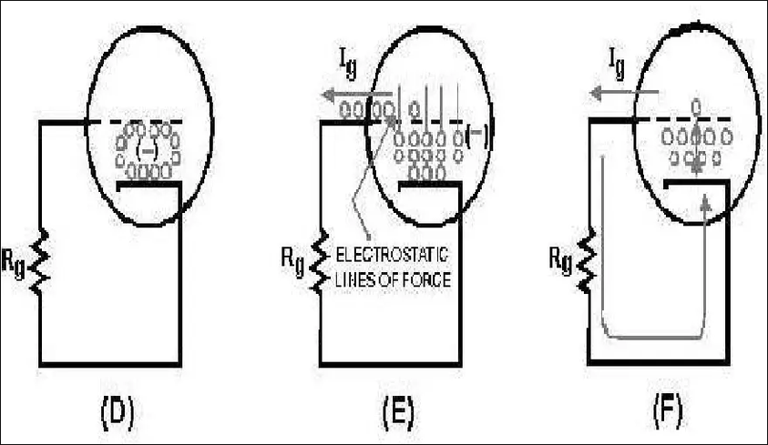
- This negative chahrge as surrounded by an electrostatic field.
- the electrostatic field cuts the grid and repels electrons that are present in the grid
- as an electrons are forced from the grid, the grid tries to go positive.
- unfortunately, this tendency toward a positive charge attracts from the mass charge.
- this as an electron is forced from the grid; it is replaced by anotherh from the massed charge
- electrons forced from the grid represent grid current (Ig), as shown in fig E above.
- the grid current flows from the grid through Rg to the cathode, from the cathode to the massed chahrge and again back to the grid.
- the movement of current in this manner, in effect, a path for current flow from the cathode to the grid
- because of the current flows between the cathode and grid, the resistance (rgk) between these elements is lowered to theh point of a short circuit (low resistance)
- the grid, in effect, is short circuited to the cathode and ceases to function and this in turn lowers tube efficiency

## Improvement on TTE

- TT may be decreased by reducing teh spacing between electrodes
- or by increasing the electrode voltages which in turn increases electron velocity through the tube
- the problem with the last solution is that the tube does not give an infinite resistance to current flow
- if the operating voltage is raised to an operating potential that is too high, arcing occurs between theh cathode and the plate and most likely will destory the tube. this also should be taken under consideration
- and for all these reasons transit time are reduced in JHF tubes by placing theh tube elements very close together.

## Application in diodes

Read diodes are used for amplification and generation of microwave signals.
They utilize two or more semiconductor effect, and are named accordingly as

a. TUNNETT Diode: Tunneling and Transit time diode (TTD)
b. IMPATT diode: impact ionization avalance TTD
c. TRAPATT Diode: Trapped Plasm Avalanceh Triggered TTD
d. BARITT Diode: Barrier Junction TTD
e. MITATT Diode: Mixed Tunnel Avalanche TTD
f. QWITT Diode: Quantum Injection TTD
g. DOVETT: Double Velocity TTD

# Limitation of Conventional Tube

- Conventional Tubes are diodes, triodes, tetrodes, and pentodes
- These have satisfactory for signal generation and amplification until a frequency limit.
- When frequency increases beyond that limit, several factors like inter electrode capacitance, lead inductance, gain-bandwidth limit and electorn transit time combine to rapidly decrease their efficiency.
- among these effects the transit time effect is a severe limitation.
- in microwaves this limitation finds development of microwave cavity tubes as very high power devices.

- the transit time is the time taken by an electron to travel from emitter (or cathode) to anode (or collector) via base (or control grid) in a semiconductor (or vacuum tube)
- in microwaves, this time becomes significant because it guides the velocity profile of the electron.
- the velocity profile of the electron can be controlled by biasing potential (or by controlling the gird potential), which in turn helps loading microwave signal into the electrons to get accelerated.
- this is called velocity modulation or density modulation
- if the biasing is in its maximum positive value, electrons get accelerated and velocity modulation takes place.
- the microwave loading is proportional to the square of the frequency.
- so as frequency increases, the transit time becomes more and more severe.
- this problem found use in a new set of microwave cavity devices.

# Klystron

- A microwave klystron is a cavity tube that can be operated either as an amplifer (multicavity klystron) or an oscillator (reflex kylstron)
- the principle of oepration of klystron depends on the velocity modulation which leads to density modulation of electrons.
- Klystrons make use of TTE by varying the velocity of an electron beam.
- Depending upon the cavity structure klystrons are of two types
    - multicavity and reflex type
- they use one or more special cavities, which modulates the electric field to generate oscillations or power amplifications.

## Two cavity Klystron Amplifier

- A two cavity klystron is popularly used as an microwave power amplifier.
- Construction of a two cavity klystron considers a tube inside of which there are a hehater, a negatively biased cathode plate, focusing electrodes, two cavities namely, input buncher cavity and output catcher cavity, positively biased anode.
- Figure:

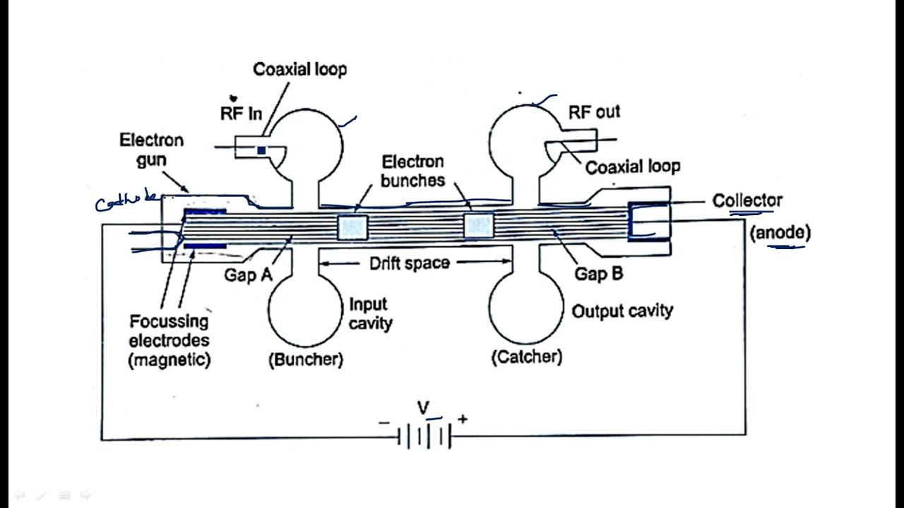

- The two cavity klystron starts working with the emission of electrons from the cathode which are then focused by focusing electrode and send along theh axis of the tube to the collector via buncher and catcher cavities.
- the input and output microwave powers are coupled through the buncher and catcher cavities, respectively.
- In between the buncher and the catcher cavities the electron starts bunching upon coupling with the input microwave signal, which is called velocity or density modulation.
- as electron passes through the buncher gap thehy are velocity modulated by the microwave loading; such velocity modulation is still not sufficient at thsi stage or point.
- Therefore, the electrons are given an opportunity to bunch in the drift space as explained in the fig:

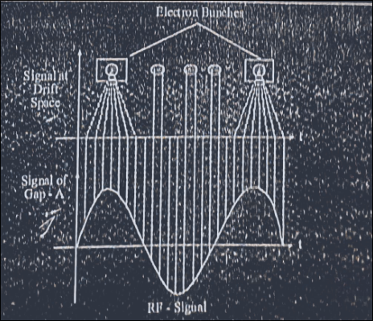

- The signal with bunches of electrons drift freely from Gap-A of the buncher cavity and reaches to Gap-B of the catcher cavity called drift space.
- The velocity of electrons depends upon the accelerating potential.
- the buncher cavity is tuned to a resonant frequency which is identical to the frequency of the input signal.
- the amplitude of the input signal determines the degree of the amplification in the bucher cavity, i.e. the amplified version of input signal.
- As seen above, when an electron caches up with another one, it simply exchange energy and bunch together and move ahehad with an average velocity.
- as the beam progress further along the drift space the bunching effect becomes more complete and faster.
- eventually the current passes the catcher cavity as an output energy.
- the intensity of the output signal depends mainly on the drift space, input signal intensity, and the dc biasing potential.
- two cavity klystron is typically suitable for up to 100 GHz frequency range, and from hundreds of kW to about 300 MW power.
- it is mainly used as power tube in theh UHF TV transmitters, satellite uplinks, radar transmitters etc.

## Multi Cavity Klystron

- One way to increase the power level, bandwidth, and the efficiency of two cavity klystron to some extent is to consider additional intermediate tuning cavities in between the buncher and catcher cavities as shown in fig:

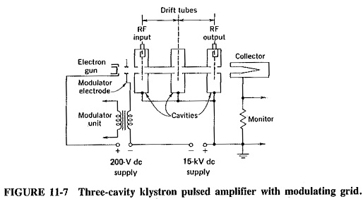

- With such intermediate cavities some partially bunched electrons steam excite and oscillate further and enhance velocity modulation.
- This very considerably increases the signal amplification of the tube, and likewise increases the efficiency.
- Also the addition of intermediate cavity in the drift gap add inductive component that help detune the resonant frequency slightly above the signal frequency, resulting the increase of the bandwidth
- by properly adjusting the dc anode bias, the drift space distance, theh number of intermediate cavities and the signal amplitude in such a way as to achieve maximum bunching at the catcher position, a considerably enhanced efficiency, amplification coefficient, and bandwidth can be achieved.

## Reflex Klystron

- Reflex klystron is evolved form of cavity klystron but works as oscillator.
- The construction and operational principles are quite similar to the klystrons except the anode is considered as repeller.
- Microwave energy is generated by modulating electron beam as it was in the klystron by passing it through an oscillating resonant cavity, but with feedback circuitry.
- the feedback is obtained by reversing theh beam back through the cavity from negatively biased repeller as shown below

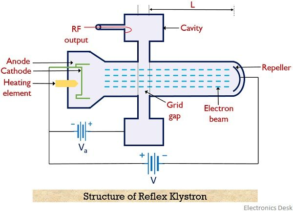

- The velocity modulated electron beam passes through the cavity the second time and will give up the energy required to maintain oscillations
- The reflex klystron is essentially a low power device, typically designed to generate 10 to 500 mw of power in the frequency range of 1 GHz to 25 GHz
- The common applications of reflex klystron are as local oscillator in microwave receivers and microwave signal sources.

# TWT

## Concept

- Travelling wave tubes are abbreviated as TWT. It is majorly used in the amplification of RF signals. Basically a travelling wave tube is nothing but an elongated vacuum tube that allows the movement of electron beam inside it by the action of applied RF input.
- The movement of an electron inside the tube permits the amplification of applied RF input. As it offers amplification to a wide range of frequency thus is considered more advantageous for microwave applications than other tubes.
- It offers average power gain of around 60 dB. The output power lies in the range of few watts to several megawatts.
- A travelling wave tube is basically of two types one is helix type and the other is coupled cavity. Here in this section, we will discuss the detailed construction and working of a helical travelling wave tube.

## Construction

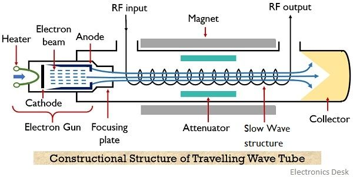

the helical travelling wave tube consists of an electron gun and a slow-wave structure. The electron gun produces a narrow beam of the electron. A focusing plate is used that focuses the electron beam inside the tube.

A positive potential is provided to the coil (helix) with respect to the cathode terminal. While the collector is more positive than the coil (helix). In order to restrict beam spreading inside the tube. A dc magnetic field is applied between the travelling path by the help of magnets.

The signal which is needed to be amplified is provided at one of the ends of the helix, present adjacent to the electron gun. While the amplified signal is achieved at the opposite end of the helix.

In the figure, we can clearly see that attenuator is present along both the sides of the travelling wave tube. This is so because travelling wave amplifiers are high gain devices, so in case of poor load matching conditions, oscillations get build up inside the tube due to reflection.

Thus in order to restrict the generation of oscillations inside the tube attenuators are used.

Attenuators are basically formed by providing a metallic coating over the surface of the glass tube. Aquadag or Kanthal are majorly used for this.

It is to be noteworthy that a slow-wave structure is considered here, the reason is to maintain continuous interaction between the travelling wave and electron beam.

### Need of Slow-Wave Structure

We know that the velocity of the electromagnetic wave is very much higher when compared with the phase velocity of the electron beam emitted by the electron gun.

Basically the RF wave applied at the input of TWT propagates with the speed of light (i.e., 3 * 108 m/s). While the propagating velocity of the electron beam inside the tube is comparatively smaller than the velocity of RF wave.

If we try to somehow accelerate the velocity of the electron beam, then it can be accelerated only to a fraction of velocity of light. So it is better to reduce the velocity of the applied RF input in order to match the velocity of the electron beam.

Therefore, a slow-wave structure is used that causes a reduction in the phase velocity of the RF wave inside the TWT.

The slow-wave structures can be of different types like a single helix, double helix, zigzag line, corrugated, coupled-cavity or ring bar type etc.

A single helix slow-wave structure is formed by wounding a wire of element like tungsten and molybdenum in the form of a coil. The helical shape of the structure slows the velocity of the wave travelling along its axis to a fraction of about one-tenth of c.

This is so because due to the helical shape of the structure, the wave travels a much larger distance than the distance travelled by the beam inside the tube. So, in this way, the speed of wave propagation depends on the number of turns or diameter of the turns.

More specifically we can say that change in pitch can vary the speed of wave propagation inside the tube.

The equation given below shows the relation of phase velocity of the wave with the pitch of the helix:
    $$V_p = \frac{cP}{\sqrt{P^2 + (\pi d)^2}}$$

c = velocity of light (3 * 108 m/s)

VP = phase velocity in m/s

P = pitch of helix in m

d = diameter of the helix in m

## Working of Travelling Wave Tube

Till now we have discussed the complete constructional structure of TWT. Let us now understand how the signal gets amplified while travelling inside the tube.

The applied RF signal produces an electric field inside the tube. Due to the applied positive half, the moving electron beam experiences accelerative force. However, the negative half of the input applies a de-accelerative force on the moving electrons.

This is said to be velocity modulation because the electrons of the beam are experiencing different velocity inside the tube.

However, the slowly travelling wave inside the tube exhibits continuous interaction with the electron beam.

Due to the continuous interaction, the electrons moving with high velocity transfer their energy to the wave inside the tube and thus slow down. So with the rise in the amplitude of the wave, the velocity of electrons reduces and this causes bunching of electrons inside the tube.

The growing amplitude of the wave resultantly causes more bunching of electrons while reaching the end from the beginning. Thereby causing further amplification of the RF wave inside the tube.

More specifically we can say that forward progression of the field along the axis of the tube gives rise to amplification of the RF wave. Thus at the end of the tube an amplified signal is achieved.

The positive potential provided at the other end causes collection of electron bunch at the collector.

The magnetic field inside the tube restricts the spreading of the beam as the electrons possess repulsive nature.

However, as the TWT is a bidirectional device. Therefore, the reflected signal causes oscillations inside the tube. But as we have already discussed earlier that the presence of attenuators reduces the generation of oscillations due to reflected backwave.

Sometimes despite using attenuators, internal impedance terminals are used that puts less lossy effects on the forward signal.

# Magnetron

## Concept

Definition: A magnetron is a device that generates high power electromagnetic wave. It is basically considered as a self-excited microwave oscillator. And is also known as a crossed-field device.

The reason behind calling it so is that the electric and magnetic field produced inside the tube are mutually perpendicular to each other thus the two crosses each other.

## Operating Principle

A magnetron is basically a vacuum tube of high power having multiple cavities. It is also known as cavity magnetron because of the presence of anode in the resonant cavity of the tube.

The operating principle of a magnetron is such that when electrons interact with electric and magnetic field in the cavity then high power oscillations get generated.

Magnetrons are majorly used in radar as being the only high power source of RF signal as a power oscillator despite a power amplifier. It was invented in the year 1921 by Albert Hull. However, an improved high power cavity magnetron was invented in 1940 by John Randall and Harry Boot.

Here in this article, we will discuss how a cavity magnetron works. But before that, we must know how a magnetron is constructed.

## Construction of Magnetrons

The figure here shows a magnetron with 8 cavities:

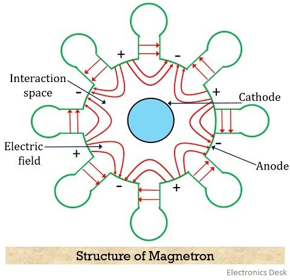

A cylindrical magnetron has a cylindrical cathode of a certain length and radius present at the centre around which a cylindrical anode is present. The cavities are present at the circumference of the anode at equal spacing.

Also, the area existing between anode and cathode of the tube is known as interaction space/region.

It is to be noted here that there exists a phase difference of 180⁰ between adjacent cavities. Therefore, cavities will transfer their excitation from one cavity to another with a phase shift of 180⁰.

Thus we can say that if one plate is positive then automatically its adjacent plate will be negative. And this is clearly shown in the figure given above.

More specifically we can say that edges and cavities show180⁰ phase apart relationship.

As we have already discussed that here the electric and magnetic field are perpendicular to each other. And the magnetic field is generated by using a permanent magnet.

## Working of Magnetron

The excitation to the cathode of the magnetron is provided by a dc supply which causes the emergence of electrons from it.

Here in this section, we will discuss the working of magnetron under two categories. First without applying the RF input to the anode and the second one with the application of RF input.

1. When RF input is not present

Case I: When the magnetic field is 0 or absent

When the magnetic field is absent then the electron emerging from the cathode radially moves towards the anode. This is shown in the figure below:

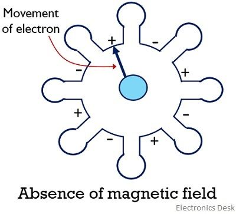

This is so because the moving electron does not experience the effect of the magnetic field and moves in a straight path.

Case II: When a small magnetic field is present

In case a small magnetic field exists inside the magnetron then the electron emerging from the cathode will slightly deviate from its straight path. And this will cause a curvy motion of the electron from cathode to anode as shown in the figure:

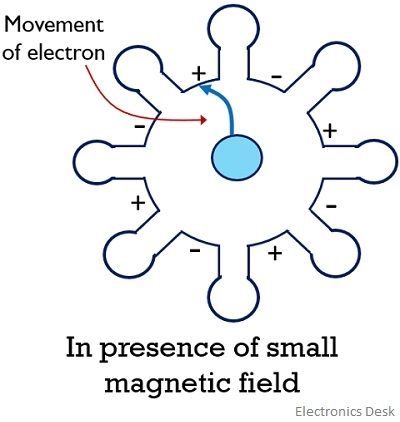

This motion of the electron is the result of the action of electric as well as magnetic force over it.

Case III: In case when the magnetic field is further increased then electrons emerging from the cathode gets highly deflected by the magnetic field. And graze along the surface of the cathode, as shown below:

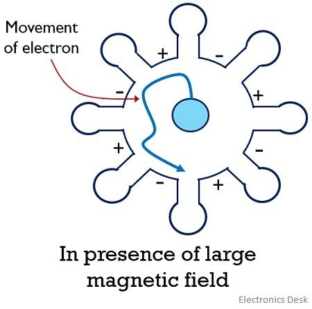

This causes the anode current to be 0. The value of the magnetic field that causes the anode current to become 0 is known as the critical magnetic field.

If the magnetic field is increased beyond the critical magnetic field. Then the electron will bounce back to the cathode itself without reaching the anode.

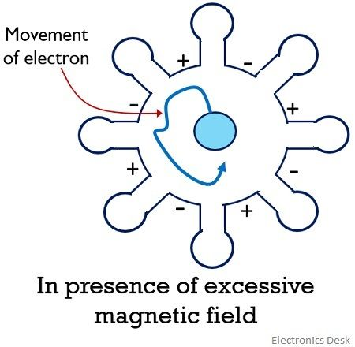

The reaching of the emitted electrons from the cathode back to it is known as back heating. So to avoid this the electric supply provided to the cathode must be cut-off after oscillations have been set up in the tube.

2. When the RF field is present

Case I: In case an active RF input is provided to the anode of the magnetron then oscillations are set up in the interaction space of the magnetron. So, when an electron is emitted from the cathode to anode then it transfers its energy in order to oscillate.

Such electrons are called favoured electrons. In this condition, the electrons will have a low velocity and thus will take a considerably high amount of time to reach from cathode to anode.

This is given in the figure below:

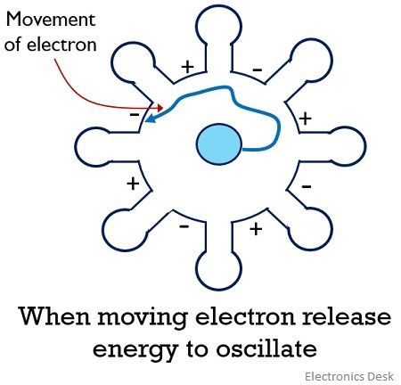

Case II: Another condition arises in the presence of RF input. In this case, the emitted electron from the cathode while travelling takes energy from the oscillations thereby resultantly increasing its velocity.

So despite reaching the anode, the electrons will bounce back to the cathode and these electrons are known as unfavoured electrons.

The propagation of unfavoured electrons is shown below:

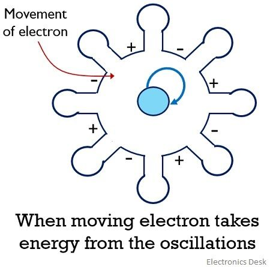

Case III: When the RF input is further increased then the electron emitted while travelling increases its velocity in order to catch up the electron emitted earlier with comparatively lower velocity.

So, all those electrons that do not take energy from the oscillations for their movement are known as favoured electrons. And these favoured electrons form electron bunch or electron cloud and reaches anode from the cathode.

The formation of electron bunch inside the tube is known as phase focusing effect.

Due to this, the orbit of the electron gets confined into spokes. These spokes rotate according to some fractional value of electron emitted by the cathode until it reaches anode while delivering their energy to oscillations.

However, the electrons released from the region of cathode between spokes, will take the energy of the field and get back to the cathode very quickly. But this energy is very small in comparison to the energy delivered to the oscillations. This is shown in the figure below:

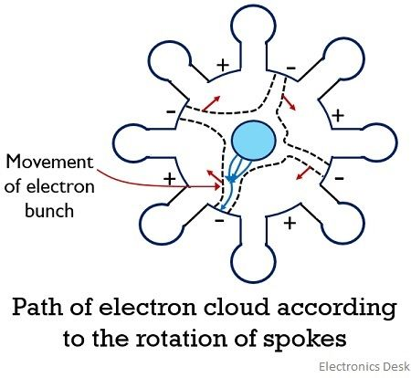

The movement of these favoured electrons inside the tube enhances the field existing between the gaps in the cavity. This leads to sustained oscillations inside the magnetron thereby providing high power at the output.

## Frequency Pushing and Pulling

The variation in the oscillating frequency of the magnetron give rise to the term frequency pushing and pulling.

When the voltage applied at the anode of the magnetron is varied then this causes the variation in the velocity of the electrons moving from cathode to anode. This resultantly changes the frequency of oscillations.

Therefore, we can say when the resonant frequency of the magnetron shows variation due to the change in the anode voltage then it is known as frequency pushing.

The change in resonant frequency is sometimes a result of the change in the load impedance of the magnetron. The load impedance varies when the change is purely resistive or reactive. This frequency variation is known as frequency pulling. A steady power supply can provide a reduction in this frequency variation.

## Applications of Magnetron

A major application of magnetron is present in a pulsed radar system in order to produce a high-power microwave signal.
Magnetrons are also used in heating appliances likes microwave ovens so as to produce fixed frequency oscillations.
Tunable magnetrons find their applications in sweep oscillators.

# Backward Wave Oscillator

## Operating Principle

The principle of operation of BWO is such that in order to sustain the oscillations inside the tube, a back-reflected wave from an imperfectly terminated collector is utilized that has a direction opposite to the direction of emergence of the electron beam.

It uses the principle of velocity modulation in order to build oscillations inside the vacuum tube.

Basically in this tube, the wave travels in the opposite direction to the direction of movement of the electron beam. Thus it is known as backward wave oscillator or tube.

## Construction

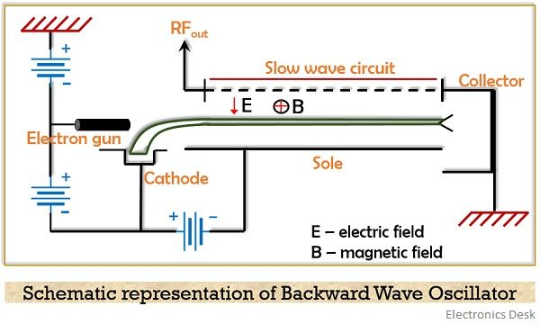

 structure is quite different from that of TWT. To generate the electron beam, an electron gun is used that is composed of a heating element and cathode. The cathode generates the electron beam inside the tube. A slow-wave structure is present inside the tube that is responsible for velocity modulation.

We have already discussed the need for slow-wave structure in our previous article of TWT. So, if you want to know more about it then you can refer the same.

The opposite end of the electron gun consists of a collector region from where the forward wave gets reflected back towards the cathode side and received at the output.

A major component present in TWT is an attenuator which is absent in case of BWO. The reason behind this is that as these are high gain devices and we need to build oscillations inside the tube. So, in order to have wave reflection from the collector, attenuators are not placed inside the tube.

Sometimes a folded waveguide is used to construct BWO because it serves as a slow-wave structure for the oscillator that permits velocity modulation.

Basically the major components that contribute towards the operation of BWO are – electron beam and slow-wave structure.

The constructional detailing of BWO controls various factors like the fixed spacing between different helical paths of the structure causes a limit in bandwidth.

Also, the frequency of oscillations is controlled by the transit time of the electron beam. And the transit time is controlled by the potential at the collector terminal.

# Working of Backward Wave Oscillator

Consider the internal structure of the tube shown above.

When the cathode is heated then a high-velocity electron beam is emitted by the electron gun assembly.

As we have already discussed that here the tube consists of a slow-wave structure that applies retardation to the moving electron beam. Also, a dc electric field is provided between the grounded slow-wave structure and the negative electrode.

The externally applied magnetic field allows bending of moving electron beam by 90⁰.

An imperfectly matched collector at the opposite end of the gun generates reflections inside the tube.

The electron beam travelling with certain velocity experiences retardation when the field inside the tube is maximum. While when the field inside the tube is minimum then the electrons travel with their usual velocity.

This can be more easily understood in a way that inside the slow-wave structure, the high velocity moving electrons losses their potential energy and transfer it to the backward travelling wave.

Thus inside the tube, all the electrons travel with different velocity as the slow-wave structure permits velocity modulation. This causes bunching of electrons inside it. And the backward wave is received at the RF output terminal present in the structure.

So, this discussion clarifies that in the case of BWO the phase velocity and group velocity are in two opposite directions.

This leads to the generation of continuous feedback wave along the circuit and generation of oscillations without any other external feedback requirement.

It is noteworthy here that basically beam current is responsible for governing the amplitude of oscillations. And the value of beam current relies on the voltage provided to the electron gun.

So, this shows that just by adjusting the voltage provided to the beam, BWO can be tuned to a large range of frequency.

Therefore, BWO is said to be the modified form of TWT.

