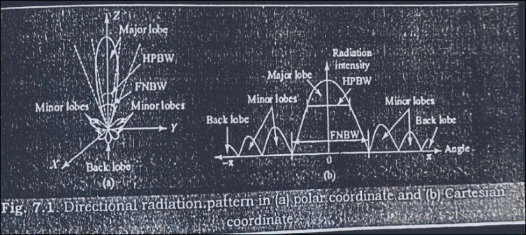
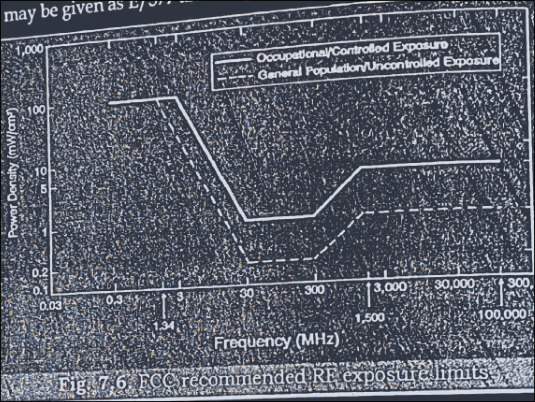

# Propagating Regions

- Once an antenna is excited by a source, two types of fields are generated in its surroundings, i.e. non-propagating field and the rest is propagating field.
- The non proapgating field remains close to the antenna and does not contribute to the energy propagation.
- the non-propagating fields are reactive in nature and are also called the near fields.
- THe propagating fields are also known as radiation fields or far fields or inverse square field.
- the boundary betwen the near field and far-field from the antenna can be approximated with the distance of $2D^2/\lambda$ where D is the maximum dimension of the antenna and $\lambda$ is the operating wavelength.
- the total space surrounding the antenna can be divided into three regions.
- the reactive field dominates first around teh antenna and it extends up to a distance $0.62\sqrt{D^3/\lambda}$
- The distance betwen this $0.62\sqrt{D^3/\lambda}$ and $2D^2/\lambda$ is the near-radiating field whereas the field beyond $2D^2/\lambda$ is called far-radiating field
- Microwave communication is basically LOS.
- therefore microwave antennas are basically very directive and small in size being proportional to its wavelength.
- since power attenuation increases with frequency, microwave antennas require high power and also high gain
- large power is also required to achieve better perforamnce with high SNR.

# Antenna Radiation Parameters

If a transmission line propagating energy is left open at one end, there will be radiation from this end. The radiation pattern of an antenna is a diagram of field strength or more often the power intensity as a function of the aspect angle at a constant distance from the radiating antenna. An antenna pattern is a three dimensional pattern but for practical reasons it is normally presented as a two dimensional pattern in one or several planes. An antenna pattern consists of several lobes, the main lobe, side lobes and the back lobe. The major power is concentrated in the main lobe and it is required to keep the power in the side lobes and back lobe as low as possible. The power intensity at the maximum of the main lobe compared to the power intensity achieved from an imaginary omni-directional antenna, i.e., radiating equally in all directions, with the same power fed to the antenna is defined as gain of the antenna. Figure 7.1 shows the radiation pattern and related parameters of a directional antenna in a polar and Cartesian co-ordinate systems.

Radiation Beam and Beam Width: A radiation beam (also known as lobe) is a part of the radiation pattern that is surrounded by different regions of relatively weak radiation intensities. Depending on the maximum radiated field strength, a lobe can be classified as major lobe or minor lobe. The major lobe contains the direction of maximum radiation whereas minor lobe is any lobe except a major lobe. A minor lobe can be classified as side lobe and back lobe. A back lobe has a direction just opposite to the main lobe whereas a side lobe has a direction other than the direction of main lobe and back lobe. The minor lobes generally correspond to undesired radiation and hence for a properly designed antenna they should be minimized.

The Half Power Beam Width (HPBW) corresponds to the angle between the two directions in the main lobe at which the field intensity becomes half of the maximum field intensity. This is also known as 3 dB beam width. A radiation lobe is often characterized by its 3 dB beam width. If the antenna has a relatively narrow beam width, in both elevation and azimuth plane, then it is called a pencil beam antenna. On the other hand, if the antenna has a beam width that is relatively narrow in one plane but much broader in the orthogonal plane then it is called a fan beam antenna. The First Null Beam Width (FNBW) corresponds to the angle between the directions of the nulls immediately following the major lobe.

Radiation Pattern: The radiation pattern of an antenna is the graphical representation of the filed strength or power per unit solid angle, radiated by the antenna at a given distance, as a function of elevation angle or azimuth angle or both. If the field strength is plotted as a function of angle then it is called a field pattern whereas if the power per unit solid angle is plotted as a function of angle then it is called a power pattern. Depending on whether the parameter has been plotted against elevation or azimuth angle, such pattern is also called as elevation or azimuth pattern.

If the parameter is plotted against elevation and azimuth angle then the resultant plot is called 3D pattern. Since power is proportional to the square of field strength, the power pattern is also proportional to the square of the field strength pattern. Until and unless it is specified the radiation pattern generally corresponds to field strength pattern. Depending on the radiation pattern, antennas can be classified as isotropic, omni-directional and directive antennas. An isotropic antenna is one that radiates uniform field strength in every direction or any plane whereas an omni-directional antenna is one that radiates same field strength in a particular plane only. For a directional antenna the radiated field varies with direction and such antenna generally concentrates its radiated field in a particular direction or some particular directions only.

The radiation pattern is basically the function of power intensity, directivity and the antenna gain. If P_t is the transmitted power, P_r is the received power, G_t and G_r are the gain of transmitting and receiving antenna respectively, R is the radial distance between the transmitting and receiving antenna, λ₀ is the free space wavelength then the received power can be expressed as,

$$P_r = \frac{P_t\lambda_g^2 G_t G_r}{(4\pi R)^2}

If both, transmitting and receiving antenna are identical, having gain G then Eq.  becomes,

$$P_r = \frac{P_t\lambda_g^2 G^2}{(4\pi R)^2}

For a directional antenna the radiated power will be effective isotropic radiated power (EIRP) which is defined as the power needed by an isotropic antenna to provide same radiation intensity at a given direction as that of the directional antenna.

Microwave Radiation Hazards

The word electromagnetic radiation (EMR) in microwaves refers to the fact that microwave energy can radiate, and not to the different nature and effects of different kinds of energy. Microwaves contain insufficient energy to directly chemically change substances by ionization, and so are an example of non-ionizing radiation. The radiation hazards are entirely derived from the interaction of electromagnetic field and human body, ordnance or explosive objects.

7.3.1 Hazards of Electromagnetic Radiation to Personnel (HERP)

The effect of the radio wave on the human body comes once it penetrates exposed tissues and causes thermal biological effects. The force produced by an electric field on charged objects,

such as the mobile ions present in the body, causes them to move, resulting in electric currents, and the electrical resistance of the material in which the currents are flowing results in heating. This heat input causes the temperature to rise and it continues to do so until the heat input is balanced by the rate at which it is removed, mostly by blood flowing to and from other parts of the body. The rate of temperature rise in body substances due to microwave heating can be expressed as dT/dt = Q/C_p (°C/S), where C_p is the specific heat of the biological substance and Q is the sum of SAR and metabolic rate of heat production per unit mass.

EMR is absorbed by the body in the form of quanta of energy. The quantum energy of radiation, for example at 900 MHz and 1800 MHz equals 4 and 7 μeV respectively. This is given by the formula: E = hf, E being the quanta energy, h being the Planck's constant and f being the frequency of EM wave. These values are extremely small compared with the energy of around 1 eV needed to break the weakest chemical bonds in genetic molecules Deoxyribonucleic Acid (DNA). Therefore, EMR cannot ionize atoms and molecules and is described as Non Ionizing Radiation (NIR). Ionizing radiations on the other hand are those EM waves operating at higher frequencies and so possessing higher energy.

Despite these facts of the non-ionizing EMR, these are harmless only at lower intensities. Indeed, they are equally harmful as ionizing radiations at higher intensities due to their heating effects which can also be seen in microwave oven. This heating effect is analyzed in terms of Specific Absorption Rate (SAR), which is the energy absorbed by a particular mass of tissue (m) given by mσE/ρ, where σ and ρ are respectively, the conductivity and density of the tissue and E is the rms value of the electric field. For example SAR produced by a particular value of electric field is larger in children than in adults because their tissue normally contains larger number of ions and so has a higher conductivity. For example, the SAR of a human being is about 0.03 W/Kg at 700 MHz for an incident power density of 1 mW/cm².

In accordance with World Health Organization (WHO), considering the very low exposure levels and research results collected, so far there is no convincing scientific evidence that the weak RF signals like from cell phone towers and wireless networks cause adverse health effects. Mobile phones communicate by transmitting radio frequency waves are electromagnetic fields, and unlike ionizing radiation such as X-rays or gamma rays cannot break chemical bonds nor cause ionization in the human body. However a number of studies have reported the link between exposure to radio frequency radiation and occurrence of health disorder i.e. effect on cell growth, cell differentiation, DNA, immune system, hormonal effects, reproduction, neurological, cardiovascular systems, blood brain barrier, interference with gadgets, stress proteins, skin, sleep disorder etc.

7.3.1.1. International Exposure Guidelines

A number of different national and international organizations have published guidelines for the protection of people from exposure to electromagnetic fields and radiation. The main concern of RF exposure has started some sixty years ago where several national and international standards, regulations and recommendations for RF energy exposure were developed for both the general public (unconditional exposure) and those who are working with this field (occupational exposure). These exposure guidelines are usually similar and are based on the thresholds for known adverse effects and they have a margin of safety in order to protect people from the health effects of both short and long term exposure to EMR. Some of these standards were organized and developed by the following organizations;

World Health Organization International Commission on Non-Ionizing Radiation Protection (ICNIRP) Federal Communications Commission (FCC). Institute of Electrical and Electronic Engineering (IEEE). Environmental Protection Agency (EPA). Food and Drug Administration (FDA). American Cancer Society (ACS) National Institute for Occupational Safety and Health (NIOSH). Occupational safety and Health Administration (OSHA) National Council of Radiation Protection and Measurements (NCRPM). Australian Radiation Protection and Nuclear Safety Agency (ARPNSA).

The importance of WHO is that it has established the International EMF Project to review the scientific literature concerning the biological effects of electromagnetic fields. The ICNIRP is considered as the most important organization specifying radio frequency EMF limits due to the following items,

a) ICNIRP guidelines were published in 1998.
b) Limits are based on all available scientific research and include large safety margins.
c) Limits are set to protect all people from established adverse health effect from short and long term exposure.
d) Specifies limits for both general public and occupational exposure.
e) Endorsed by WHO.

When the distance to the radio transmitter is in the far field (greater then few wavelengths, i.e., around one meter for RF), safety limits are usually expressed as field strength. The field intensity is usually applied to exposure from base stations. Since RF waves have both electric and magnetic components, the electric field strength is measured in volts per meter (V/m) and the magnetic field is measured in amperes per meter (A/m). A commonly used unit to characterize the RF electromagnetic field is the plane wave power density (PD) especially at the far field. This density is defined as the power per unit area; it may be expressed in terms of watts per square meter (W/m²), milliwatts per square centimeter (mW/cm²) or microwatts per square centimeter (μW/cm²). For the case where the exposure, the highest power absorption per unit mass in a small part of the body must be used and compared with the recommendations and standards. SAR is the quantity used to measure this amount of RF energy and it is expressed in units of watts per kilogram (W/kg) or milli watts per kilogram (mW/kg).

The Maximum Permissible Exposure (MPE) recommended for power density is based on the threshold SAR value. However some guidelines may vary from each other for different operating frequencies. Actually, whole-body human absorption of RF energy varies with frequency of the RF wave. The frequency range of 30-300 MHz is considered as the hresonance range to humnan body where it absorbs the energy efficiently when the whole body is exposed. The maximum permissible Exposure (MPE) limits adopted by FCC in 1996 for both occupational and general public exposure expressed in terms of electric field strength (E, V/m), magnetic field strength (H, A/m) and power density (S, W/m^2) for a wide frequency range are given below figure. In the far field of a transmitting antenna teh magnetic field may be given as E/377 and the hpower density is calculated as S.

7.3.2 Hazards of Electromagnetic Radiation to Ordnance and Fuel (munted guns, miss) 5 bomb)

Microwave signals are dangerous to different electronic equipment that are used in households, industries as well as in battle fields. Out of them the ordnance, used in the battle field, are probably most affected because they are subjected to the high power microwave radiations from RADAR antennas. Such high power radiation easily affects weapon system, electro explosive devices (EED), missile control system and emergency devices in addition to the attending personnel. These radiations can trigger the EEDs and also missiles. One common example to it is the destruction of the US aircraft carrier Forrestal that was deployed at the coast of North-Vietnam on July 29, 1967 with its deck containing numerous attack aircraft. Another example includes the crash of several US attack helicopter UH-60 Black Hawk due to interference with citizen band transmitters, RADAR antenna and radio antenna.

It should be noted that ordnance is more sensitive to electromagnetic signals than living beings like humans. This is because they do not have circulatory system to dissipate internal heat. In addition ordnance used to response to peak power whereas human being responds to average power over some time. Microwave and electromagnetic signals also have adverse effects on fuels. They have a tendency to ignite fuel vapors through RF induced sparks. These are more prone during fuel handling in the presence of high level RF fields.
