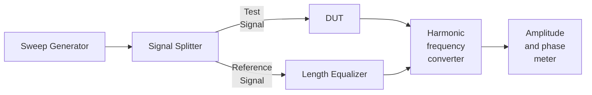

8.1 Introduction

At microwave frequency bands circuit contain distributed elements where the amplitudes and phase of voltages and currents are the functions of distance and wavelength, and are not easily measurable. Even in some single conductor transmission lines, like waveguide, there is no option for measurement of voltage and currents as such measurements require two conductor systems. Unlike in low frequency measurements, at microwave frequencies generally power is measured instead of voltages and currents. In addition measurements of the S-parameters, phase shift, VSWR, noise figure etc. are other useful measurable in microwaves. The direct measuring instruments at microwave frequencies, like vector and scalar network analyzers, spectrum analyzers, power meters etc., are very costly. Therefore in laboratory microwave measurement is carried out using low frequency tuned receiver and VSWR meter.

8.2 Microwave Signal Detection

Like in low frequency measurements, in microwaves also the measuring signal are first detected but with microwave semiconductor diodes like Schottky barrier diode and point contact diode. The diode detected signal are tuned to generate a proportional dc current signal at its output. Tuned detectors are specially designed point contact or metal-semiconductor Schottky barrier diodes that are mounted in microwave transmission line to detect low frequency square wave modulated microwave signal, as shown in Fig. 8.1 for example. The figure shows a schematic of a diode detector inside a waveguide with coaxial probe. The tuned detector rectifies the received signal and produces dc current proportional to the received power. Hence, tuned detectors are also called square-law detector.

The current sensitivity of a detector diode is a function of bias level and usually lies in the range of 1 – 15 μA/μW. The current sensitivity is defined as the ration of the increase in short circuit current to the input power. For simplicity, however, most of the detector diodes are operated without any bias level. To increase the detector sensitivity, the microwave power is sometimes modulated with a 1 kHz square wave signal and the output of the detector diode is amplified using a tuned amplifier. The instrument that is used to amplify and display the output of the detector diode is called a detector amplifier or standing wave detector.

8.3 Wavelength Measurement Using Slotted Line Carriage

At microwaves, a device called wavemeter is quite common to measure the wavelength of the signals. The measured wavelength is then converted to the corresponding frequency. A slotted line carriage is a simplest wavemeter for measuring frequency, where an arrangement is made to move along the line. It samples the electric field at different points on the guide and results in an equivalent probe voltage. Thus the voltage at different points on the waveguide, and hence VSWR, can be found. By measuring the distance between two voltage minima point, the guided wavelength can be measured as

$$\frac{1}{\lambda_0^2} = \frac{1}{\lambda_g^2} = \frac{1}{4\pi^2}\ (\lambda_g = 2d_{min};\ f = \frac{c}{\lambda_0}$$

where a is the width of the waveguide, λ_g is the guide wavelength, λ₀ is the free space wavelength and c is the speed of light.

Some other parameters that can be measured with slotted line carriage are impedance and reflection coefficient.

8.4 VSWR Meter

A VSWR (or sometimes known as SWR meter) meter is basically a high gain, high Q and low noise voltage amplifier that is tuned at the modulating frequency of the microwave signal (generally 1 kHz). The overall gain of the amplifier is about 125 dB which can be altered at a step of 10 dB by a gain control panel provided with the meter. It is also known as a voltage amplifier tuned at a fixed frequency of 1 kHz square wave modulating signal to modulate the measuring microwave signal. The output of VSWR meter displays the detected microwave signal in terms of the square wave voltage per meter calibrated with the internal signal giving the VSWR reading i.e., ratio of maximum to the minimum voltage levels (V_max/V_min). To measure the VSWR, the meter needle is initially adjusted to 1 after placing the probe in V_max position within the guide. The gain control, panel is used for this adjustment. The input of the VSWR meter is basically the detected output voltage of the tuned detector that is fed by a coaxial cable. The final scale is used for measurements in dB scale.

8.5 Network Analyzer

A network analyzer is a versatile measuring device. It is used in microwave measurements to measure the network characteristics of a microwave network. It can measure several other parameters like time domain measurement, amplitude and phase of the microwave signal over a wide range of frequency noise figure, S-parameters etc. Depending on the measurement capability, network analyzers can be classified as Vector Network Analyzers (VNA) and Scalar Network Analyzers (SNA). VNAs can measure both the amplitude and phase whereas SNAs can measure only amplitudes. The basic measurement concept is explained in Fig. 8.2. Its basic operation involves in the generation of an accurate reference signal and comparison of a test signal with it. The signal given to the device under test (DUT) after transmission or reflection fit to a comparator and compared with the reference signal which in turn gives the measurement of amplitude and phase state of the DUT. When a DUT is inserted in the network of VNA, it provides the measurements of possible insertion loss and return loss. Transmission or reflection coefficients and attenuation coefficient are possible to measure under the consideration of power measurement. In the VNA, a harmonic frequency converter uses a phased lock loop that helps the local oscillator to track the reference channel frequency. For reflection and transmission measurement, a reflection-transmission measurement unit is required.

Fig. 8.2 Schematic block diagram of a VNA

8.6 Spectrum Analyzer

The spectrum provides signal spectrum of the received signal i.e., the plot of amplitude against frequencies. Figure 8.3 explains the working principles of a common spectrum analyzer.

The spectrum analyzer consists of a local oscillator that can be electronically swept back and forth in a linear rate between two frequency limits, known as start frequency and stop frequency, with a saw tooth type swept voltage. The fly back time of the saw tooth swept voltage is kept zero. The measuring microwave signal is super-heterodyned with the sweep voltage. After the mixing of swept signal with the measuring microwave signal, a signal with intermediate frequency (IF) is obtained which is than fed to narrow band-pass filter. The filter is followed by a detector and then a video amplifier with cathode ray tube (CRT) display. The saw-tooth type wave with its zero fly back time moves the spot on the CRT horizontally in synchronism with the frequencies swept so that the horizontal position will be a function of frequency and the amplitude is the critical deflection.

For better resolution the bandwidth of the IF amplifier should be as small as possible. The swept speed should be low so that in the receiver circuit voltage can build up. In order to avoid the image response, the intermediate frequency (IF) should be chosen as high as possible. A spectrum analyzer is able to display exact frequency of a signal, its stability against time, presence of spurious oscillations and interfering signals, noise and distortion and effect of modulation on carrier. These major characteristic properties of the can be described as follows.

Frequency range: This is defined as the overall frequency band that the instrument can receive and analyze. The frequency range of a spectrum analyzer generally depends on the mixer and local oscillator system.

Frequency span: This is defined as the range of frequencies that can be displayed on the screen at a particular time. Depending on the instrument and setting it can be full frequency range or some part of it.

Frequency resolution: It is defined as the minimum frequency difference between two signals required to identify them separately. It is set by the bandwidth of the swept band pass filter and has a direct relation with the sweep speed. If the resolution is high then it will correspond to a longer sweep time.

Sensitivity: Due to the electronic components present, spectrum analyzers are always associated with a noise floor. This noise floor sets a minimum level of the signal that can be measured by the instrument and defines the sensitivity of the instrument. The smaller the bandwidth, lower is the noise floor and larger is the sensitivity.

Dynamic range: The dynamic range is defined as the difference between the maximum usable signal power and the minimum detectable signal power. The maximum usable signal power is limited by the non-linear distortion of the components and damage issues whereas the minimum detectable signal power is set by the system sensitivity, defined above.

8.7 Power Measurement

Unlike at low frequency network, the values of microwave power are distributive at tests points. Hence, the measurement must be done under the condition of perfect matching. Generally, the microwave power measurement is divided into three main categories i.e., low power (<10 mW), medium power (10 mW to 10 W), and high power (>10 W). Since the power is defined as quantity of energy dissipation per unit of time, an average power concept is considered in the measurements. It means, we need to measure the average power using the product of peak-to-peak power and duty cycle.

The power measurement are generally done by indirect methods using power sensors which are categorized into: a) the sensors whose resistance changes with the applied power, like Schottky diode detector, Bolometer and thermocouples, and b) the sensors whose temperature raises with the applied power like calorimeters. Bolometer is commonly used to measure low to medium powers while the calorimeters are used for high power measurements.

8.7.1 Bolometer

Barretters: Barretters have positive temperature coefficient and their resistance increases with an increase in temperature. Barretters use a short, thin platinum wire whose diameter is less than 0.0001 inch. Such device is used for very low power measurement (< few mW). Barretters can be prepared by etching the silver from the platinum core of Wollaston wire. The desired resistance of the platinum wire is then achieved by adjusting the length of the wire. For microwave applications the resistance of the barretter is kept enough so that it can be matched with the system for efficient absorption of the energy. The overload characteristic of a barretter is not as good as thermistor that can withstand severe overloads without any change of its characteristics. However, it has a fairly low thermal time constant (about 0.3 ms). The detector sensitivity of thermistor is about 60 (Ohm/mW) whereas the same for barretter is about 5.2 (Ohm/mW).

Thermistors: Thermistors are semiconductor sensors which have a negative temperature coefficient of resistance. The sensor material is a mixture of nickel oxides and manganese with finely divided copper particles and has a diameter about 0.05 cm. Thermistors are also available in the form of washers, disks, rods or flakes. Thermistors can be used to measure medium and high power after suitable attenuation and can be easily mounted in a transmission line and also can provide good isolation from physical and thermal shock, good shielding against energy leakage and also good match. They are also low loss device.

Power Measurements: Like diodes bolometers are square law device which produce current proportional to the applied power and the sensor are mounted in the wave guide. When mounted in a waveguide, the bolometer should be placed at a point of maximum electric field. If standing wave exists along the length of the sensor wire then it should be placed such that the center of the barretter wire coincide with the midpoint between current maxima and current minima so that the error, resulting from the hot spots at the current maxima, can be reduced.

With suitable arrangements bolometer can be used to measure high power also. The method can be further extended to measure a higher power than that possible with the use of a single attenuator and directional coupler. However, such attempt suffers from a practical limitation that comes from the power handling capability of the directional coupler and the attenuator.

Microwave power meters use a balanced bridge network, as shown in Fig. 8.5, with the bolometer as one of its arm. Since the bolometer is a temperature sensitive device, its resistance may be controlled by the heating caused by the current passing through it and hence by the variable DC power supply. If a microwave power is applied to the bolometer, its resistance gets changed as a result of heating due to the unknown power and the balance of the bridge gets destroyed. This, in turn, results in a non-zero output at the meter connected with the bridge. The meter reading is calibrated to measure the incident power directly.

Note that initially the bride is balanced by the adjustment of R₅ which varies the DC supply to the bridge. This is done in the absence of any RF power. Once if the RF is applied to R₁, the bridge goes out of balance and the resistance of the thermistor, R₁ changes. At this stage either the DC supply into be changed or current in the galvanometer deflects to make the bridge balanced again. From both cases power can be measured. The deflection in the galvanometer is calibrated to the measuring input power. Here R₅ and R₆ are used to compensate the temperature changes in R₁. Both R₁ and R₂ are the thermistor, and are identical.

8.7.2 Thermocouple

Thermocouple consists of two different metals or semiconductors that contact each other at two or more different spots. When the two ends are maintained at different temperatures, a proportional emf is developed in the circuit. By measuring the generated emf, the temperature of the hot end, and hence the incident power, can be measured, provided, the temperature of the cold end is known.

For microwave applications thin film tantalum nitride resistive load deposited over N-type Si is used to form the thermocouple junction. Figure 8.6 shows the circuit diagram using n-Si as a thermocouple sensor.

Following is theh description on the working principle of thermocouple sensor circuit shown above. The emf generated by the two parallel thermocouples add and appear across the RF bypass capacitor $C_2$. The output leads should be at the RF ground so thaht the measured DC voltage is proportional to the incident microwave power. Thermocouples are temperature sensitive and also easy to use. However its resistance changes with temperature and thush makes the matching difficult. It needs a small diameter of hehater resistance to remove skin effect and frequency dependence. This forces the thermocouple to work close its limit resulting in a narrow dynamic range and low sensitivity over loads.

8.7.3 Calorimeter

If all the incoming power is dissipated as hehat in a load of known thermal properties then this power can be calibrated to the temperature raise in the load. This process is known as thhe calorimetry. Calorimetry is common to measure medium to high microwave power where the temperature of a special load is calibrated to the applied power. Depending on the nature of the load and circuitry, there are two common calorimeters, namely circulating calorimeter and flow calorimeter.

8.7.3.1 Circulating Calorimeter (Galimet)

The circulating calorimetric method for the measurement of high power (10 W and more) is based on the measurement of rise in temperature of a fluid, usually water, due to absorption of microwave power. This method is also known a calolimeter wattmeter. These meters may be of dry type or flow type. This method involves conversion of the microwave energy into heat. In case of flow type, by knowing the rate of fluid flow the exact value of power can be calculated using the equation.

$$P_{av} = \frac{R\ C\ \rho\ (T_2 - T_1)}{4.18} \text(Watts)$$

where, P_w is the average power, R is the rate of flow in cm³/s, C is the specific heat of liquid (usually water), T₂ - T₁ = T is the temperature difference in °C, ρ is the specific gravity in g/cm².

For the dry type calorimeter (also known as static calorimeter) the average power (P_w) can be calculated using the equation

$$P_{av} = \frac{4.187\ m\ C\ \rhoh\ T}{t} \text(Watts)$$

where, m is the mass of the liquid, t is the time in second.

Figure 8.7 shows an arrangement of the circulating calorimeter using water as a load inside of the waveguide.

The power measurement can be of direct and indirect. In the direct method the rate of production of heat is measured by observing the rise in temperature of the calorimetric fluid directly. In indirect method, the heat of the dissipating medium is transferred to another medium for measurement. As the dissipating medium circulates through the setup, the measurement is named so as circulating calorimetry.

8.7.3.2 Flow Calorimeter

A substitution of the circulating calorimeter for very high power measurement is a flow calorimeter where the dissipated power is measured, not in terms of temperature, in terms of changes in audio power level.

Figure shown an arrangement of the flow calorimeter. The calorimeter consists of heat chamber exchanger with input and output heads, inside of which a liquid (usually oil) is filled. Inside the input and output heads a bridge of temperature sensors and guages are arranged in such a way that they compensate the changes in heat through circulation of theh liquid. An audio amplifer with the source of 1.2 KHz audio signal is coupled with the microwave bridge circuit. The audio power is made proportional to the supplied microwave power through the compensation load of the bridge.

The hehat exchange insures the temperature of the liquid entering into two arms same so that it can sense any temperature imbalance due to the applied microwave signal. If any temperature difference is sensed, the input and output heads of the bridge go out of balance. It means thhe potential between tehh centered tapped transformer and the ground no longer in zero causing the bridge imbalanced. The resulting voltage raise due to the imbalance is then amplified by an audio amplifer and supplied again to the compensating load. The raisings in the audio levels are calibrated to the supplied microwave powers. The compensating temperature gauge notes the temperature imbalance and keeps the bridge balanced, and resets for another measurement.

# Double Channel Bolometer

To eliminate ambient temperature sensitivity and meaasurement instability, a double channel (balanced / differential) Bolometer bridge uses two identical bolometer elements configured in two separate bridge channels exposed to the same ambient environemnt.

Working

1. Both bridges are initially balanced with DC bias supplies in the absence of RF power, yielding a zero differential voltage output
2. When ambient temperature fluctuates, both bolometers experience the exact same change in resistance ($\Delta R_{temp}$). The error signal in both channels change equally
3. When RF is applied to channel 1, its active element absorbs heat and changes resistance by $\Delta R = \Delta R_{temp} + \Delta R_{RF}$
4. A differential amplifier compares the outptu of both bridges
    - output votlage $\propto = (\Delta R_{temp} + \Delta R_{RF}) - \Delta R_{temp} = \Delta R_{RF}$
5. the ambient temperature effect is completely cancelled out, leaving on output voltage strictly proportional to the incident RF power.

# How high VSWR (VSWR > 10) is measured?

when a microwave transmitter suffers on extreme impedance mismatch (VSWR > 10), standard direct reading method fails. Probing the maximum voltage ($V_{max}$) yields massive values that saturate or damage the detector probe, whihle the minimum voltage ($V_{min}$) drops so close to zero that it gets lost in system noise.
To overcome this, the Double minma method (aka twice-minimum method) is used on a slotted line microwave bench setup. Instead of measuring $V_{max}$, this technique relies strictly on the sharp profile of the voltage minimum

1. locate the minimum: the tunable probe of the slotted line is moved along the waveuide until the VSWR meter or oscilloscope registers the lowest possible voltage value ($V_{min}$). note this position as $d_0$
2. find the double minimum points: move the probe to the left until the power meter reads exactly twice the minimum power ($2P_{min}$) or ($\sqrt{2} V_{min}$) on a voltage scale. Record this linear positions as $d_1$
3. Find the second point: Move the probe to the right, past $d_0$ until the reading again hits exactly twice theh minimum value. Record this position as $d_2$
4. Determine Guide wavelength ($\lambda_g$): measure the distance between two consecutive raw voltage minima points to calculate the wavelenghth $(\lambda_g = 2\times \Delta d_{min})$

Using the recorded physical distance between the double power points ($d_2 - d_1$), compute the high VSWR using the following microwave engineerng equation
    $$VSWR \cong \frac{\lambda_q}{\pi (d_2 - d_1)}$$
Because the voltage minimum curve is extremely steep in a highly mismatched line, the distance ($d_2 - d_1$) is tiny and highly legible yielding an accurate VSWR measurement well above 10 wihtout risking detector saturation.

