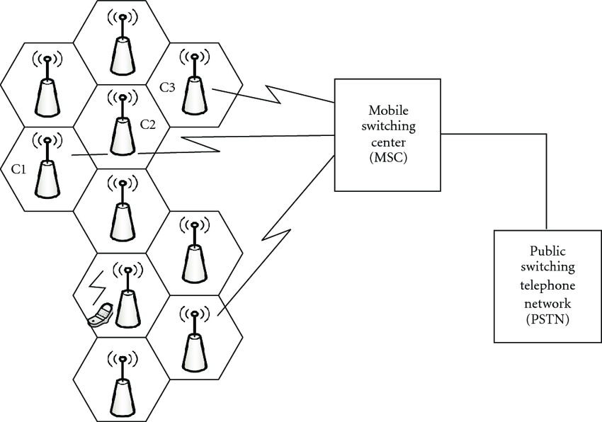
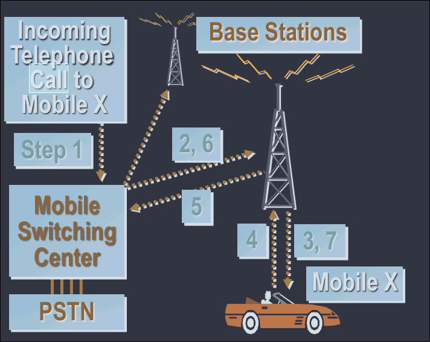
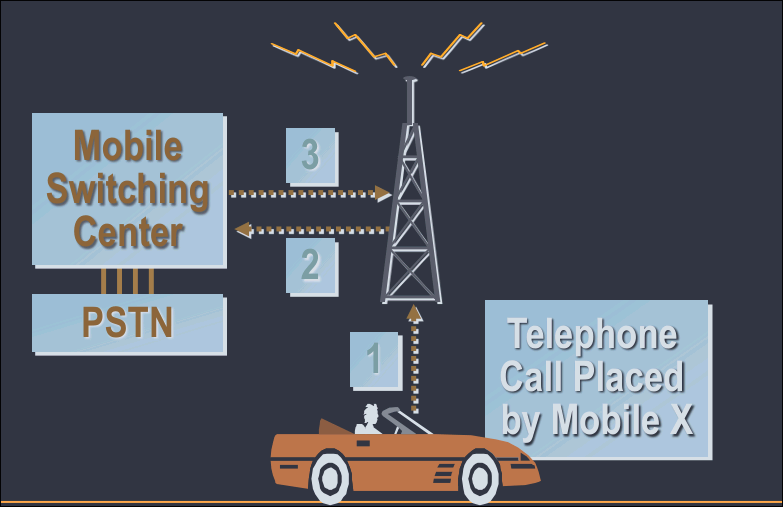
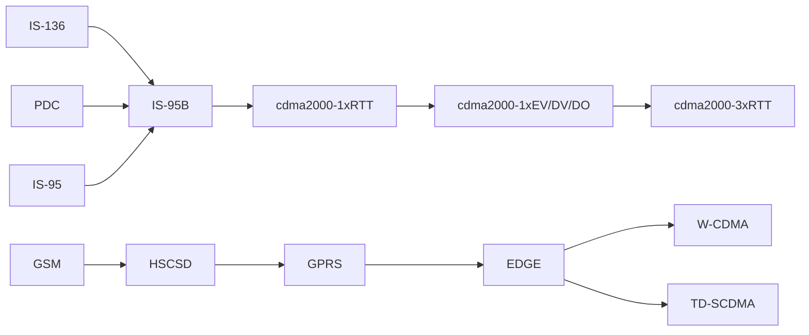
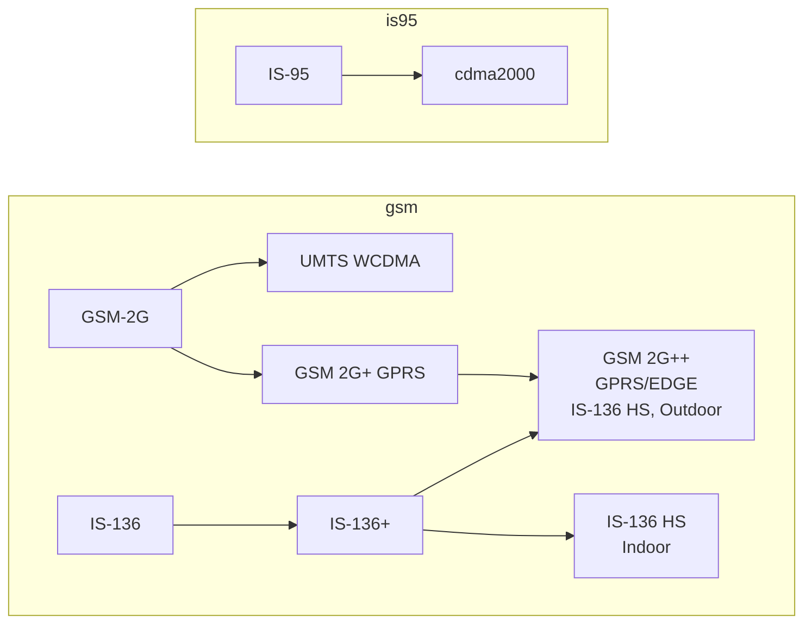
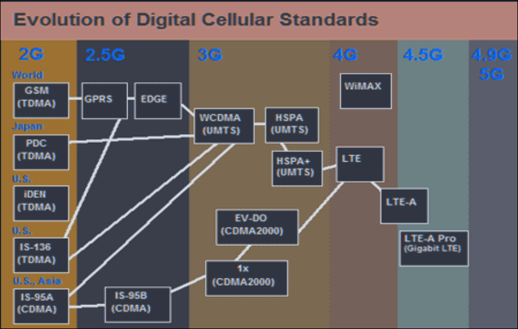

# Exam Frequency Table (2070–2082 BS, 22 papers)

| Topic | Typical Marks | Frequency |
|---|---|---|
| Evolution of wireless comm. 1G–3G / 1G–4G (technology + market penetration) | 4–6 | Very High |
| 2G vs 3G vs 4G standards, technology advancement comparison | 4–6 | Very High |
| Forward and reverse channel: define + 5G vs 4G comparison | 2–4 | High |
| Features of 4G / features introduced 2G→5G | 2–6 | High |
| Basic trends in wireless comm. beyond 3G | 4 | Moderate |
| Major benefits of wireless comm. | 2 | Low–Moderate |

**Reading tip:** "Evolution 1G→3G/4G" is the single most repeated question in this chapter, it's frequently asked with a worldwide market penetration angle, so keep the chronology and generation table sharp. Forward/reverse channel definitions pair naturally with 4G vs 5G feature questions.

---

# 1.0 Basic Concepts

## Duplexing

- **Simplex**: Communication systems which provide only one-way communication.
- **Half Duplex**: Communication systems which allow two-way communication by using the same radio channel for both Tx and Rx. At any given time, the user can only either transmit or receive information.
- **Full Duplex**: Communication systems which allow simultaneous two-way communication.
    - In Full-Duplex systems, two separate channels are required for simultaneous transmission in each direction:
        - FDD (Frequency Division Duplex)
        - TDD (Time Division Duplex)

### Frequency Division Duplex (FDD)

- Provides simultaneous radio transmission channels for the subscriber and the base station, so that both may transmit while simultaneously receiving signals from one another.
- Two separate, frequency-offset channels are used (reverse channel and forward channel), e.g. $F_c$ and $F_c + 45\text{MHz}$.

### Time Division Duplex (TDD)

- Also provides simultaneous radio transmission channels for the subscriber and the base station.
- However, a single radio channel is shared in time, a portion of the time is used from the base station to mobile, and the remaining time is used to transmit from the mobile to the base station.
- TDD is possible only if digital transmission and digital modulation is used.
- Sensitive to timing.

*(Frequently paired with the "define forward and reverse channel" PYQ, see §1.3 below)*

## Basic Terminologies

| Term | Description |
|---|---|
| Base Station | A fixed station in a mobile radio system used for radio communication with mobile stations. Located at the center or edge of a coverage region; consists of radio channels and Tx/Rx antennas mounted on a tower. |
| Mobile Station | A station in the cellular radio service intended for use while in motion at unspecified locations. May be hand-held (portables) or vehicle-installed (mobiles). |
| Subscriber | A user who pays subscription charges for using a mobile communications system. |
| Transceiver | A device capable of simultaneously transmitting and receiving radio signals. |
| Mobile Switching Center (MSC) | Switching center which coordinates the routing of calls in a large service area; connects cellular base stations and mobiles to the PSTN. Also called MTSO. |
| Control Channel | Radio channel used for transmission of call setup, call request, call initiation, and other beacon or control purposes. |
| Roamer | A mobile station which operates in a service area (market) other than that from which service has been subscribed. |
| Handoff | The process of transferring a mobile station from one channel or base station to another. |
| Page | A brief message which is broadcast over the entire service area, usually simultaneously by many base stations. |

## Cordless Telephones vs Cellular Telephony

*(Useful for building out the "wide-area vs local" distinction that underlies many evolution/comparison questions)*

**Cordless Telephones**: characterized by:
- Low mobility (in terms of range and speed)
- Low power consumption
- Two-way wireless voice communication
- High circuit quality
- Low cost equipment
- No handoffs between base units
- Appeared as analog devices first; digital devices appeared later with CT2, DECT standards in Europe and ISM band technologies in the USA.
    - DECT = Digital Enhanced Cordless Telecommunications

**Cellular Telephony**: characterized by:
- High mobility provision
- Wide-range
- Two-way voice communication
- Handoff and roaming support
- Integrated with sophisticated public switched telephone network (PSTN)
- High transmit power required at the handsets (~2W)

### Cellular Telephony System Components

- **Mobile users and handsets**: very complex circuitry and design.
- **Base stations**: provide gateway functionality between wireless and wireline links.
- **Mobile switching centers**: connect the cellular system to the terrestrial telephone network.

### Cellular System: Channel Structure

- Each cell has a base station (BS), providing the radio interface to the mobile station (MS).
- A sophisticated switching technique called **handover** enables a call to proceed uninterrupted across cell boundaries.
- All BSs are connected to a Mobile Switching Center (MSC), responsible for connecting users to the PSTN.
- Control channels transmit and receive data messages that carry call initiation and service requests, and are monitored by mobiles when they do not have a call in progress (~5% of total available channels).
- Communication between the BS and mobiles is defined by a standard common air interface that specifies 4 different physical channels:
    - Forward (Downlink) voice/data channel: BS → MS
    - Reverse (Uplink) voice/data channel: MS → BS
    - Forward (Downlink) control channel: BS → MS
    - Reverse (Uplink) control channel: MS → BS
- A MS contains a transceiver, an antenna, and control circuitry. A BS consists of several transmitters and receivers.

### Call Flow Examples

**Telephone call made to a mobile user:**

1. The incoming telephone call to Mobile X is received at the MSC.
2. The MSC dispatches the request to all base stations in the cellular system.
3. All base stations broadcast the Mobile Identification Number (MIN) as a paging message over the Forward Control Channel (FCC) throughout the cellular system.
4. The mobile receives the paging message sent by the base station it monitors and responds by identifying itself over the Reverse Control Channel (RCC).
5. The base station relays the acknowledgement sent by the mobile and informs the MSC of the handshake.
6. The MSC instructs the base station to move the call to an available voice channel within the cell.
7. The base station signals the mobile to change frequencies to an unused forward and reverse voice channel pair. An alert message is transmitted over the Forward Voice Channel (FVC) to instruct the mobile to ring.
- Once the call is in progress, the MSC adjusts the transmitted power of the mobile and changes the channel of the mobile and base stations to maintain call quality, this is called **handoff**.

**Telephone call initiated by the mobile:**

1. When a mobile originates a call, it sends the base station its Mobile Identification Number (MIN), Electronic Serial Number (ESN), and the telephone number of the called party. It also transmits a Station Class Mark (SCM) indicating the maximum power level for that user.
2. The cell base station receives the data and sends it to the MSC.
3. The MSC validates the request, makes the connection to the called party through the PSTN, and assigns the base station and mobile user an unused forward and reverse channel pair to allow the conversation to begin.

---

# 1.1 Evolution of Wireless (Mobile) Communications

*(The single most repeated question type in this chapter, nearly every paper asks for a 1G–3G or 1G–4G evolution narrative, often with worldwide market penetration angle)*

## Radio Frequency Spectrum Context

- Wireless technologies span a wide range of applications: Satellite, TV, Cordless phone, Cellular phone, Wireless LAN/WiFi/WiMAX, Bluetooth, Ultra Wide Band, Wireless Laser, Microwave.
- Frequency bands used for radio transmission:

| Band name | Abbreviation | ITU band | Frequency / Wavelength | Example Uses |
|---|---|---|---|---|
| High Frequency | HF | 7 | 3–30 MHz / 100–10 m | Shortwave broadcasts, citizens band radio, amateur radio, marine/mobile radio telephony |
| Very High Frequency | VHF | 8 | 30–300 MHz / 10–1 m | FM, TV broadcasts, land mobile & maritime mobile comm., amateur radio, weather radio |
| Ultra High Frequency | UHF | 9 | 300–3000 MHz / 1–0.1 m | TV broadcasts, microwave devices, mobile phones, WLAN, Bluetooth, GPS, satellite radio |
| Super High Frequency | SHF | 10 | 3–30 GHz / 100–10 mm | Radio astronomy, microwave comm., WLAN, most modern radars, communication satellites |
| Extremely High Frequency | EHF | 11 | 30–300 GHz / 10–1 mm | Radio astronomy, microwave radio relay, directed-energy weapons, WLAN (802.11ad) |
| Terahertz / Tremendously High Frequency | THz/THF | 12 | 300–3000 GHz / 1–0.1 mm | Experimental medical imaging, terahertz spectroscopy, remote sensing |

- Twisted pair and copper wires use frequencies up to several hundred kHz.
- Coaxial cable uses frequencies up to several hundred MHz.
- Fiber optics are used for frequency ranges of several hundred THz (represented in wavelength, e.g. 1500μm or 1350μm infrared).
- Radio propagation starts at several kHz (VLF range, very long waves).
- LF range is used by submarines, since it can penetrate water and follow the earth's surface.
- MF and HF ranges are typically used for hundreds of radio stations: AM (520 kHz–1605.5 kHz), Short Wave (5.8–26.1 MHz), FM (88–108 MHz).
- Short waves are used for amateur radio transmission worldwide, enabled by reflection at the ionosphere.
- Analog TV: VHF/UHF bands (174–230 MHz, 470–790 MHz).
- UHF is also used for mobile phones: analog (450–465 MHz), digital GSM (890–960 MHz, 1710–1880 MHz), DECT cordless (1880–1900 MHz).
- VHF and especially UHF allow for small antennas and relatively reliable mobile telephony connections.
- SHF is used for directed microwave links (~2–40 GHz) and fixed satellite services (C-band 4/6 GHz, Ku-band 11/14 GHz, Ka-band 19/29 GHz).
- EHF comes close to infrared; all radio frequencies are regulated to avoid interference.

## Chronology of Important Developments in Mobile Communications

*(Frequently the backbone for a full 1G–3G/4G evolution answer, memorize key years)*

| Date | Event |
| --- | --- |
| 1946 | First domestic public land mobile service introduced in St. Louis. Operated at 150 MHz with only three channels. |
| 1956 | First use of a 450 MHz system. Users had to use a push-to-talk button and always needed operator assistance. |
| 1970 | FCC sets aside 75 MHz for high-capacity mobile telecommunication systems. |
| 1974 | FCC grants common carriers 40 MHz for development of cellular systems. |
| 1978 | First cellular system called AMPS was introduced in Chicago on a trial basis. |
| 1981 | Cellular systems deployed in Europe. |
| 1983 | First commercial deployment of cellular system in Chicago, an analog system with no user data transport capability. Analog systems around 450 and 900 MHz band also introduced across Europe (1981–90). |
| 1989 | FCC grants another 10 MHz bandwidth for cellular systems, totaling 50 MHz. |
| 1991 | GSM introduced in Europe and other countries of the world. |
| 1993 | TDMA system IS-54 introduced in US. SMS available in GSM. |
| 1995 | CDMA cellular and PCS technology introduced in the US. |
| 1997 | ETSI publishes GPRS standard. |
| 1999 | Standards of 3G wireless services published. |

## First Generation (1G): Analog Systems

- The first version of cellular telephony to be commercially deployed in the 1980s consisted of **analog systems**:
    - Frequency Modulation (FM) is used for analog voice.
    - FSK is used for signaling and control data.
- The bandwidth of each channel allocated to an individual user is **30 kHz**.
- These systems had **no user data transport capability**.
- Representative standard: **AMPS** (Advanced Mobile Phone Service).
    - Voice traffic only.
    - FDMA/FDD multiple access.

### Network Reference Model for 1G (IS-41 Architecture)

- Network reference model of TIA/EIA standard IS-41:
    - 
- Represents the network for first-generation systems that support only voice, no data.
- This reference model is similar to GSM architecture.
- **MSC**: performs mobile switching functions and interfaces the cellular network to a PSTN, ISDN, or another MSC.
- **Home Location Register (HLR)**: contains a centralized database of all subscribers to the home system, including:
    - Electronic Serial Number (ESN)
    - Directory Number (DN)
    - service profile subscribed by the user (roaming restrictions, supplementary services, etc.)
    - current location
- **Visitor Location Register (VLR)**: contains a database of all visitors to this particular system.
    - Whenever a mobile station moves into a foreign service area, its serving MSC saves all pertinent information of that mobile station in its VLR.
    - The home MSC is also notified so that incoming calls to this mobile can be forwarded to the foreign MSC.
    - Information in the VLR mirrors that of the HLR.
    - When the mobile moves out of the foreign serving area, its MSC removes the visitor's database entry from the VLR.
- **Equipment Identity Register (EIR)**: contains the equipment identification number.
- **Authentication Center (AC)**: manages user data-encryption-related functions such as ciphering keys.

## Second Generation (2G): Digital Systems

*(Anchor topic for "evolution 1G-2G-2.5G" and "2G vs 3G" comparisons)*

- These systems, which had no user data transport capability (1G), were later followed by **TDMA systems**, where a channel is divided into a number of synchronized slots, each allocated to a single user.
- Digital modulation, voice traffic, **TDMA/FDD and CDMA/FDD** multiple access, data facility.
- An important feature of 2G systems is their **data service capability**.
- The TDMA systems installed in the US are based on standards **IS-54 and IS-136**:
    - use a channel spacing of 30 kHz and provide six slots per frame
    - eventually tripling the capacity compared to the older analog system.
- **GSM**, used in much of Europe and many other countries, is also based on TDMA technology:
    - each channel has a bandwidth of 200 kHz
    - each frame consists of eight slots.
    - GSM provides Short Message Service (SMS) and circuit-switched data at rates up to 9.6 kb/s per slot.
    - A distinctive feature of these systems is their support of SMS and circuit-switched data.
- **IS-95** supports circuit-switched data and digital fax, IP, mobile IP, and Cellular Digital Packet Data (CDPD).
- An enhanced data service called **GPRS** is now also available in GSM.
- **CDMA systems**, using direct-sequence spread spectrum technology, have been deployed in many countries since 1995.

### 2G Technologies Comparison

| Parameter | cdmaOne (IS-95) | GSM, DCS-1900 | IS-54/IS-136, PDC |
|---|---|---|---|
| Uplink Frequencies | 824–849 MHz (Cellular), 1850–1910 MHz (US PCS) | 890–915 MHz (Europe), 1850–1910 MHz (US PCS) | 800/1500 MHz (Japan), 1850–1910 MHz (US PCS) |
| Downlink Frequencies | 869–894 MHz (US Cellular), 1930–1990 MHz (US PCS) | 935–960 MHz (Europe), 1930–1990 MHz (US PCS) | 869–894 MHz (Cellular), 1930–1990 MHz (US PCS) |
| Duplexing | FDD | FDD | FDD |
| Multiple Access | CDMA | TDMA | TDMA |
| Modulation | BPSK with Quadrature Spreading | GMSK with BT=0.3 | π/4 DQPSK |
| Carrier Separation | 1.25 MHz | 200 kHz | 30 kHz (IS-136), 25 kHz (PDC) |
| Channel Data Rate | 1.2288 Mchips/sec | 270.833 kbps | 48.6 kbps (IS-136), 42 kbps (PDC) |
| Voice Channels per carrier | 64 | 8 | 3 |
| Speech Coding | CELP @ 13kbps, EVRC @ 8kbps | RPE-LTP @ 13 kbps | VSELP @ 7.95 kbps |

### Second Generation Network Architecture

- Figure below shows the network architecture of 2G, similar to 1G except for its interface to a public data network (PDN):
    - 
- The interface to the PDN is via an interworking function (IWF), which performs protocol conversion necessary due to differences between the protocols used on the mobile stations and the PDN.

### 2G and Data

- 2G was developed for voice communications.
- Data can be sent over 2G channels using a modem, providing data rates on the order of ~9.6 kbps.
- Increased data rates are required for internet applications, this necessitated evolution towards **2.5G**.

## 2.5G Networks (2G+)

- Except for the A interface between a BS and an MSC, the core network is circuit-switched.
- One possible architecture around which many new networks were built:
    - 

**Salient features of this architecture:**
1. Consists of a backbone network based on IP/ATM.
2. Interfaces to legacy networks in a straightforward way:
    - Media gateway performs necessary protocol conversion between the backhaul ATM network and the circuit-switched PSTN/ISDN.
    - IP routers route packets to/from IP-based packet data networks.
    - The mobility server (IP-based) supports mobility management, connection control, and signaling gateway functions to enable seamless roaming with centralized directory management and end-to-end security.
        - Functional entities include: call control, HLR and VLR databases, and radio resource management.
3. Allows for distributed processing, offloading the core network, and provides a platform for new services/features/applications to be developed, tested, and installed as needed.
    - The architecture is compatible with an all-IP network, the trend of the future.

### 2.5G Technologies (Evolution of TDMA and CDMA Systems)

- **Evolution of TDMA systems:**
    - **HSCSD** (High-Speed Circuit Switched Data) for 2.5G GSM, up to 57.6 kbps.
    - **GPRS** for GSM and IS-136, up to 171.2 kbps.
        - GPRS core network consists of:
            - a number of Serving GPRS Support Nodes (SGSNs), actually routers, connecting to a BSC via a Packet Control Unit (PCU) implementing the link layer protocol. There may be more than one SGSN in any PLMN.
            - a Gateway GPRS Support Node (GGSN), also a router; the first entry point of the core network from any external packet data network (e.g. the Internet). Two separate PLMNs are connected through a GGSN.
            - a Packet Control Unit (PCU).
        - GPRS supports packet mode data at rates up to 171 kb/s: each slot handles up to 21.4 kb/s, and since a user may be allocated up to 8 slots, rates up to ~171.2 kb/s per user are possible.
        - The SMS Serving Gateway MSC (SMS-GMSC) provides protocol conversion for handling SMS through the GPRS network (instead of the traditional GSM network).
    - **EDGE** for 2.5G GSM and IS-136, up to 384 kbps.
- **Evolution of CDMA systems:**
    - IS-95 (cdmaOne) → IS-95B, up to 64 kbps, in increments of 8 kb/s over a 1.25 MHz channel.

## Third Generation (3G) Wireless Technology

*(Frequently paired with "3G vs 4G" or "1G-2G-3G-4G" comparison questions)*

- The second-generation systems (IS-136, cdmaOne, GSM) are digital and have data transport capabilities, but only to a limited extent.
    - e.g. GSM supports SMS and user data only up to 9.6 kb/s.
    - With IS-95B, data rates of 64–115 kb/s (in 8 kb/s increments) over a 1.25 MHz channel are possible.
- In 1997, to provide dual-mode data services in GSM, ETSI defined **GPRS**, whereby a single time slot may be shared by multiple users for packet-mode data transfer.
- To support high-speed data rates and multimedia services, the **ITU-R** undertook the task of defining a set of recommendations for International Mobile Telecommunications in the year 2000 (**IMT-2000**).
- Eventually, there were **4 systems for 3G** mobile communications:
    - cdma2000
    - UWC-136
    - WCDMA UMTS FDD
    - WCDMA UMTS TDD
- cdma2000 is required to comply with EIA/TIA IS-41; WCDMA UMTS complies with GSM MAP intersystem networking standards.
- Standards for 3G wireless services were published in 1999.
- Support for high-speed data at rates from **144 kb/s** for urban/suburban outdoor environments to **2.048 Mb/s** for indoor or low-range outdoor environments is one of the most important features of 3G.
- Because of its many advantages, **CDMA technology forms the basis of 3G systems**.

### 3G Requirements

- 3G systems are required to operate in many different radio environments: indoor or outdoor, urban, suburban, or rural.
- End users may be fixed or moving at various speeds:
    - Stationary users or pedestrians: 0 to 10 kmph
    - Ordinary vehicular applications: up to 100 kmph
    - High-speed vehicular applications: up to 500 kmph
    - Aeronautical applications: up to 1500 kmph
    - Satellites: up to 27000 kmph
- Infrastructure may be terrestrial or satellite-based.
- Information types may include speech, audio, text, image, and video.
- Radio interfaces must be designed to provide voice band data and variable bit rate services.
- Both circuit and packet mode data must be supported.
- Data rates:
    - 144 kbps or more in vehicular operation
    - at least 384 kbps for pedestrians
    - about 2.048 Mbps for indoor or low-range outdoor applications

### 3G: Types of User Traffic Envisaged

1. **Constant bit rate traffic**: e.g. speech, high-quality audio, video telephony, full-motion video; sensitive to delays and delay variations.
2. **Real-time variable bit rate traffic**: e.g. variable bit-rate encoded audio, interactive MPEG video; requires variable bandwidths and is also sensitive to delays/delay variations.
3. **Non-real-time variable bit rate traffic**: e.g. interactive and large file transfers; can tolerate delays or delay variations.

### 3G: Commercially Attractive Applications

- Conversational voice, video phone and video conferencing, interactive games, two-way process control and telemetry information.
- High-speed internet access applications: web browsing, e-mail, data transfer to/from server, transaction services, etc.
- Audio streaming, one-way video, still images, large-volume data transfer, tele-metering information for monitoring purposes at an operations and maintenance center.
- Entertainment-quality audio.
- Inquiries/reservations (e.g. plane ticket ordering).

### 3G Evolution of Systems

- CDMA system evolved to **CDMA2000** (IMT-2000):
    - CDMA2000-1xRTT: up to 307 kbps
    - CDMA2000-1xEV
    - CDMA2000-1xEVDO: greater than 2.4 Mbps
    - CDMA2000-1xEVDV: 144 kbps data rate
- GSM, IS-136 and PDC evolved to **W-CDMA** (Wideband CDMA, also called UMTS):
    - up to 2.048 Mbps data rates
    - future systems: 8 Mbps
    - expected to be fully deployed by 2010–2015
    - assures backward compatibility

### Upgrade Paths for 2G Technologies (Overview)

- Layered view: **2G → 2.5G → 3G** progression across GSM/IS-136/PDC and IS-95 tracks converge toward W-CDMA and cdma2000 respectively.

### Evolution Path to 3G Systems (GSM and IS-95 tracks)

### Evolution of Digital Cellular Standards (Full Chart, 2G → 5G)

- 
- Traces the full path: GSM/PDC/iDEN/IS-136 (TDMA, 2G) → GPRS → EDGE → WCDMA(UMTS)/TD-SCDMA (3G) → HSPA → HSPA+ → LTE → LTE-A → LTE-A Pro (4.5G, Gigabit LTE); parallel CDMA track: IS-95A → IS-95B → 1x(CDMA2000) → EV-DO(CDMA2000) → merges into LTE; further evolution to WiMAX (4G) and beyond into 4.9G/5G.

## Fourth Generation (4G) Systems

*(Frequently asked: "features of 4G", "4G vs 3G")*

- Data rate of **20 Mbps** is employed.
- Mobile speed supported up to **200 km/hr**.
- Frequency band: **2–8 GHz**.

### Features of 4G Wireless Systems

- Support for interactive multimedia, voice, streaming video, Internet, and other broadband services.
- IP-based mobile system.
- High speed, high capacity, and low cost per bit.
- Global access, service portability, and scalable mobile services.
- Ad hoc and multi-hop networks.
- Better spectral efficiency.

### Wireless Technologies Used in 4G

- **OFDM** (Orthogonal Frequency Division Multiplexing)
- **MIMO** (Multiple Input Multiple Output)
- **Adaptive Modulation**

## Recent Trends (5G and Beyond)

*(Frequently paired with "5G vs 4G" and "forward/reverse channel" questions)*

- 5G cellular innovation targeted to be operational by 2020.
- **Internet of Things (IoT)**.
- Advancement technologies:
    - Massive Multiple Input Multiple Output (Massive MIMO)
    - Millimeter Wave (mmWave)
    - Non-Orthogonal Multiple Access (NOMA)
    - Device-to-device communication
    - Dense heterogeneous networks
    - Cloud radio network

---

# 1.2 Comparison of Available Wireless Systems, Trends

*(Frequently asked directly as "2G vs 3G vs 4G standards, technology advancement", also as regional standard tables)*

## Standards by Region

### North American Major Standards

| Standard | Type | Year | Multiple Access | Frequency Band | Modulation | Channel BW |
|---|---|---|---|---|---|---|
| AMPS | Cellular | 1983 | FDMA | 824–894 MHz | FM | 30 kHz |
| NAMPS | Cellular | 1992 | FDMA | 824–894 MHz | FM | 10 kHz |
| USDC | Cellular | 1991 | TDMA | 824–894 MHz | π/4-DQPSK | 30 kHz |
| CDPD | Cellular | 1993 | FH/Packet | 824–894 MHz | GMSK | 30 kHz |
| IS-95 | Cellular/PCS | 1993 | CDMA | 824–894 MHz, 1.8–2.0 GHz | QPSK/BPSK | 1.25 MHz |
| GSC | Paging | 1970s | Simplex | Several | FSK | 12.5 kHz |
| POCSAG | Paging | 1970s | Simplex | Several | FSK | 12.5 kHz |
| FLEX | Paging | 1993 | Simplex | Several | 4-FSK | 15 kHz |
| DCS-1900 (GSM) | PCS | 1994 | TDMA | 1.85–1.99 GHz | GMSK | 200 kHz |
| PACS | Cordless/PCS | 1994 | TDMA/FDMA | 1.85–1.99 GHz | π/4-DQPSK | 300 kHz |
| MIRS | SMR/PCS | 1994 | TDMA | Several | 16-QAM | 25 kHz |
| iDEN | SMR/PCS | 1995 | TDMA | Several | 16-QAM | 25 kHz |

### European Standards

| Standard | Type | Year | Multiple Access | Frequency Band | Modulation | Channel BW |
|---|---|---|---|---|---|---|
| ETACS | Cellular | 1985 | FDMA | 900 MHz | FM | 25 kHz |
| NMT-450 | Cellular | 1981 | FDMA | 450–470 MHz | FM | 25 kHz |
| NMT-900 | Cellular | 1986 | FDMA | 890–960 MHz | FM | 12.5 kHz |
| GSM | Cellular/PCS | 1990 | TDMA | 890–960 MHz | GMSK | 200 kHz |
| C-450 | Cellular | 1985 | FDMA | 450–465 MHz | FM | 20 kHz/10 kHz |
| ERMES | Paging | 1993 | FDMA | Several | 4-FSK | 25 kHz |
| CT2 | Cordless | 1989 | FDMA | 864–868 MHz | GFSK | 100 kHz |
| DECT | Cordless | 1993 | TDMA | 1880–1900 MHz | GFSK | 1.728 MHz |
| DCS-1800 | Cordless/PCS | 1993 | TDMA | 1710–1880 MHz | GMSK | 200 kHz |

### Japan Standards

| Standard | Type | Year | Multiple Access | Frequency Band | Modulation | Channel BW |
|---|---|---|---|---|---|---|
| JTACS | Cellular | 1988 | FDMA | 860–925 MHz | FM | 25 kHz |
| PDC | Cellular | 1993 | TDMA | 810–1501 MHz | π/4-DQPSK | 25 kHz |
| NTT | Cellular | 1979 | FDMA | 400/800 MHz | FM | 25 kHz |
| NTACS | Cellular | 1993 | FDMA | 843–925 MHz | FM | 12.5 kHz |
| NTT | Paging | 1979 | FDMA | 280 MHz | FSK | 12.5 kHz |
| NEC | Paging | 1979 | FDMA | Several | FSK | 10 kHz |
| PHS | Cordless | 1993 | TDMA | 1895–1907 MHz | π/4-DQPSK | 300 kHz |

## Generational Comparison Summary

*(Direct exam scaffold for "1G vs 2G vs 3G vs 4G")*

| Aspect | 1G | 2G | 3G | 4G |
|---|---|---|---|---|
| Signal type | Analog | Digital | Digital | Digital, all-IP |
| Multiple access | FDMA | TDMA / CDMA | CDMA (WCDMA/cdma2000) | OFDMA + MIMO |
| Data capability | None | Limited (up to ~9.6–171 kbps via GPRS) | 144 kbps – 2.048 Mbps | Up to 20 Mbps+ |
| Key standard | AMPS | GSM, IS-95, IS-136 | WCDMA/UMTS, cdma2000 | LTE, WiMAX |
| Channel BW (representative) | 30 kHz | 200 kHz (GSM) / 1.25 MHz (IS-95) | 5 MHz (WCDMA) | Variable (OFDM subcarriers) |
| Core tech introduced | FM voice, FSK signaling | Digital voice, SMS | Multimedia, mobile internet | IP multimedia, high mobility (200 km/hr) |

---

# 1.3 Trends in Cellular Radio Beyond 3G

*(Frequently asked directly: "basic trends beyond 3G", "forward and reverse channel; 5G vs 4G")*

## Forward and Reverse Channel

- **Forward channel**: the communication channel from the Base Station (BS) to the Mobile Station (MS), i.e., the downlink.
- **Reverse channel**: the communication channel from the Mobile Station (MS) to the Base Station (BS), i.e., the uplink.
- Each direction may further be split into voice/data and control channels (see §1.0 channel structure above).

## 5G vs 4G

| Aspect | 4G | 5G |
|---|---|---|
| Peak data rate | ~20 Mbps (typical LTE-A ranges higher in practice) | Significantly higher (multi-Gbps class) |
| Core technologies | OFDM, MIMO, Adaptive Modulation | Massive MIMO, mmWave, NOMA, D2D communication |
| Latency | Higher | Very low latency (enables real-time IoT) |
| Network architecture | Centralized core network | Dense heterogeneous networks, cloud radio network |
| Key enabler | All-IP mobile system | Internet of Things (IoT) integration |
| Target use case | Mobile broadband, streaming | Massive device connectivity, ultra-reliable low-latency communication |

## Features of 5G (List Form)

- Operational target: 2020 onward.
- Internet of Things (IoT) support.
- Massive MIMO.
- Millimeter Wave (mmWave) spectrum utilization.
- Non-Orthogonal Multiple Access (NOMA).
- Device-to-device (D2D) communication.
- Dense heterogeneous networks.
- Cloud radio access network (Cloud-RAN).
