# Exam Frequency Table (2070–2082 BS, 22 papers)

| Topic | Typical Marks | Frequency |
|---|---|---|
| Prove $Q = \sqrt{3N}$ + optimal N for omni/120°/60° sectoring (numerical, deferred) | 3–8 | Very High |
| Handoff: definition, types, practical considerations, cell dragging | 2–8 | Very High |
| Co-channel vs adjacent channel interference | 2.5–7 | High |
| Cell splitting vs sectoring (capacity/coverage enhancement) | 4–8 | High |
| GoS, traffic intensity, blocked-calls-cleared systems (theory + numericals, deferred) | 3–8 | High |
| Microcell zone concept | 1–4 | Moderate |
| Frequency reuse / co-channel reuse ratio concept | 3–6 | Moderate |
| Cell footprint / interference tier | 1–5 | Moderate |
| Prioritized handoff / two schemes for prioritizing handoff | 2–3 | Moderate |
| Techniques for capacity & coverage enhancement (general) | 5–8 | Low–Moderate |

---

# Background

- in wireless telephony, a **cell** is the geographical area covered by a cellular telephone transmitter.
- the transmitter facility itself is called the **cell site**.
- the cellular concept was a major breakthrough in solving the problem of **spectral congestion** and **user capacity**.
- It offered very high capacity in a limited spectrum allocation without any major technological changes

## Cellular Concept

The cellular concept has the following system level ideas
- replacing a single, high power transmitter with many low power transmitters, each providing coverage to only a small area.
- Neighboring cells are assigned different groups of channels in order to minimize interference
- The same set of channels is then reused at different geographical locations.
- each base station (**BS**) is allocated a portion of total no. of channels available to entire system.
- nearby base station are assigned different groups of channels so that all the available channels are assigned to a relatively small no. of neighboring base stations.
- Nearby BS are assigned different groups of channel so that interference between BS is minimized.
- When designing a cellular mobile communication system, it is important to provide good coverage and services in a high user-density area.
- Cellular advantage:
    - the use of low power transmitter
    - an allowance for frequency reuse.

## Cell Footprint

- The actual radio coverage of a cell is known as **cell footprint**.
- Irregular cell structure and irregular placing of the transmitter may not be acceptable in the initial system design.
- However, as traffic grows, where new cells and channels need to be added,
    - it may lead to inability to reuse frequencies because of co-channel interference.
- For systematic cell planning, a regular shape is assumed for the footprint
- Coverage contour should be circular.
    - However, it is impractical because it provides ambiguous areas with either multiple or no coverage.
- Due to economic reasons, the hexagon has been chosen due to its maximum area coverage.
- Hence a conventional cellular layout is often defined by a uniform grid of regular hexagons.

# Frequency Reuse

- each cellular base station is allocated a group of radio channels within a small geographic area called a cell.
- Neighboring cells are assigned different channel groups.
- By limiting the coverage area to within the boundary of the cell, the channel groups may be reused to cover different cells.
- Keep interference levels within tolerable limits.

Real world planning
- Consider a cellular system which has a total of $S$ duplex channels
- Each cell is associated with a group of $k$ channels, $k < S$.
- The $S$ channels are divided among $N$ cells.
- The total number of available radio channels: $S = kN$
- The $N$ cells which use the complete set of channel is called cluster.
- The cluster can be repeated $M$ times within the system.
- The total number of channels, $C$, is used as a measure of capacity.
    $$C = MkN = MS$$
- The capacity is directly proportional to the number of replication, $M$.
- The cluster size, $N$, is typically equal to 4, 7, 12.
- Small $N$ is desirable to maximize capacity.
- The frequency reuse factor is given by $1/N$
- for small $N$, we have to consider the co-channel interference.

## Terminology

*(Frequently asked directly: cluster size, interference tier — both carry high recall value)*

- Cluster Size
    - The $N$ cells which collectively use the complete set of available frequency is called the cluster size.
    - 
- Co-channel cell
    - the set of cells using the same set of frequencies as the target cell.
- Interference Tier
    - a set of co-channel cells at the same distance from the reference cell is called an interference tier.
    - The set of closest co-channel cell is called first tier.
    - There is always 6 co-channel cells in the first tier.
    - example as a figure:
    - 
- Cluster Size
    - given by $N = i^2 + ij + j^2$
    - where, i = movement in perpendicular direction to any of 6 surfaces of original cell
    - j = movement of $60^0$ counter-clockwise/clock-wise to reach adjacent co-channel cell.
    - 

## Channel Assignment Strategies

- Frequency reuse scheme
    - increases capacity
    - minimize interference
- Channel assignment strategy
    - fixed channel assignment
        - each cell is allocated a predetermined set of voice channel
        - any new call attempt can only be served by the unused channels
        - the call will be blocked if all channels in that cell are occupied
    - dynamic channel assignment
        - channels are not allocated to cells permanently
        - allocate channels based on request.
        - reduce the likelihood of blocking, increase capacity.

# Handoff Strategies

- When a mobile moves into a different cell while a conversation is in progress, the MSC automatically transfers the call to a new channel belonging to the new base station.
- Handoff operation
    - identifying a new base station
    - re-allocating the voice and control channels with the new base station

## Handoff Margin

- Handoff Threshold
    - Minimum usable signal for acceptable voice quality (-90 dBm to -100 dBm)
    - Handoff margin $\Delta = P_{\text{r, handoff}} - P_{\text{r, minimum usable}}$ cannot be too large or too small.
    - Where, $P_{r, h}$ = received handoff signal power
        - $P_{r, m}$ = minimum usable handoff power
    - If $\Delta$ is too large, unnecessary handoffs burden the MSC
    - If $\Delta$ is too small, there may be insufficient time to complete handoff before a call is lost.
- Proper vs Improper Handoff
    - 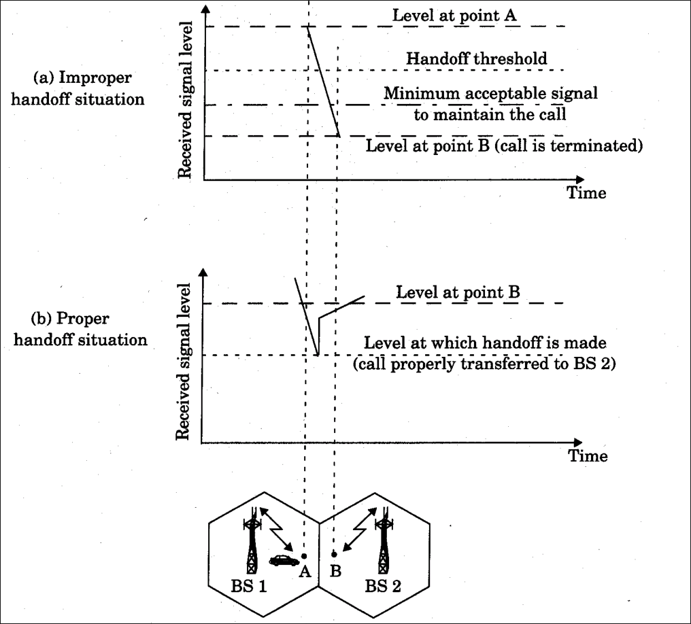
- Must ensure that the drop in measured signal is not due to momentary fading and that the mobile is actually moving away from the serving base station.
- Running average measurement of signal strength should be optimized so that unnecessary handoffs are avoided.
    - Depends on the speed at which the vehicle/mobile is moving
    - For steep short term average, the handoff should be made quickly
    - the speed can be estimated from the statistics of the received short-term fading signal at the base station
- Handoff Measurement
    - in first generation analog cellular systems, signal strength measurements are made by the base station and supervised by the MSC.
    - in 2nd generation systems (TDMA), handoff decisions are mobile assisted, called mobile assisted handoff (MAHO)
- Intersystem handoff
    - if a mobile moves from one cellular system to a different cellular system controlled by a different MSC.
- Handoff requests is much important than handling a new call
    - to maintain Grade of Service (GOS)

## Practical Handoff Consideration

- Different type of users
    - High speed users need frequent handoff during a call.
    - Low speed users may never need a handoff during a call.
- **Microcells** to provide capacity, the MSC can become burdened if high speed users are constantly being passed between very small cells.
- **Considerations**:
    - Minimize handoff intervention
        - handle the simultaneous traffic of high speed and low speed users.
    - Large and small cells can be located a single location (umbrella cell)
        - different antenna height
        - different power level
        - Figure representing Umbrella cell:
            - 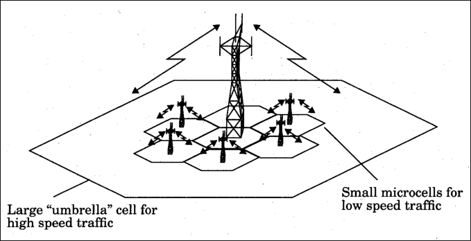
    - Cell dragging problem
        - pedestrian users provide a very strong signal to the base station (due to LoS)
        - The user may travel deep within a neighboring cell
- On average:
    - femtocell: reach 10m
    - pico cell: 200m
    - microcell: 2km
    - macro cell: 10s of km

## Evolution of handoff

- Handoff for 1st generation analog cellular systems:
    - 10 second handoff time
    - $\Delta$ is in the order of 6dB to 12dB
- Handoff for second generation cellular systems, e.g., GSM
    - 1 to 2 seconds handoff time
    - mobile assists handoff (MAHO)
    - $\Delta$ is between 0dB and 6dB
    - Handoff decisions based on **signal strength**, **co-channel interference** and **adjacent channel interference**
- IS-95 CDMA spread spectrum cellular system
    - Mobiles share the channel in every cell.
    - No physical change of channel during handoff
    - MSC decides the base station with the best receiving signal as the service station

## Handover Indication

- each BS constantly monitors the signal strengths of all of its reverse voice channels to determine the relative location of each mobile user with respect to the BS.
- This information is forwarded to MSC who makes decisions regarding handover.
- Mobile assisted handover (MAHO): 
    - the mobile station measures the received power from surrounding BSs and continually reports the results of these measurements to the serving BS.

## Prioritizing Handover

- Dropped call is considered a more serious event than call blocking.
    - Channel assignment schemes therefore must give priority to handover requests
    - A fraction of the total available channels in a cell is reserved only for handover requests.
    - However, this reduces the total carried traffic
    - Dynamic allocation can improve this.
- Queuing of handover requests is another method to decrease the probability of forced termination of a cell due to a lack of available channel.
    - the time span over which a handover is usually required leaves room for queueing handover request.

## Practical Handover

- A hard handover does "break before make"
    - the old channel connection is broken before the new allocated channel connection is setup.
    - this obviously can cause call dropping
- In soft handover, we do "make before break"
    - the new channel connection is established before the old channel connection is released.
    - This is realized in CDMA where also BS diversity is used to improve boundary condition.
- Representative figure
    - 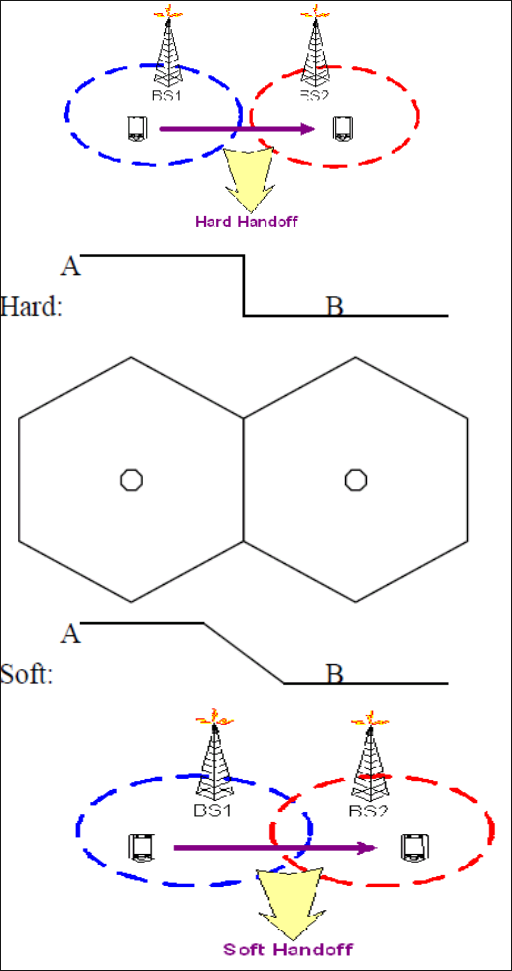

# Interference and System Capacity

- Sources of interference
    - another mobile in the same cell
    - a call in progress in the neighboring cell
    - other base stations operating in the same frequency band
    - non cellular system leaks energy into the cellular frequency band
- Two major cellular interference
    - co-channel interference
    - adjacent channel interference

## Co-channel Interference

- Frequency reuse
    - there are several cells that use the same set of frequencies
    - called co-channel cells
- To reduce co-channel interference, co-channel cell must be separated by a minimum distance
- When the size of cell is approximately the same
    - co-channel interference is independent of the transmitted power
- co-channel interference is a function of:
    - $R$ = radius of the cell
    - $D$ = distance to the center of the nearest co-channel cell
- Increasing the ratio $Q = D/R$, the interference is reduced.
- Q is called the co-channel reuse ratio
- For a hexagonal geometry
    $$Q = \frac{D}{R} = \sqrt{3N}$$
- A small value of Q provides large capacity
- A large value of Q improves the transmission quality - smaller level of co-channel interference
- A tradeoff must be made between these 2 objectives.

### Prove $D = \sqrt{3N}R$ for hexagonal geometry

- Assuming hexagonal geometry, we draw the figure as:
    - 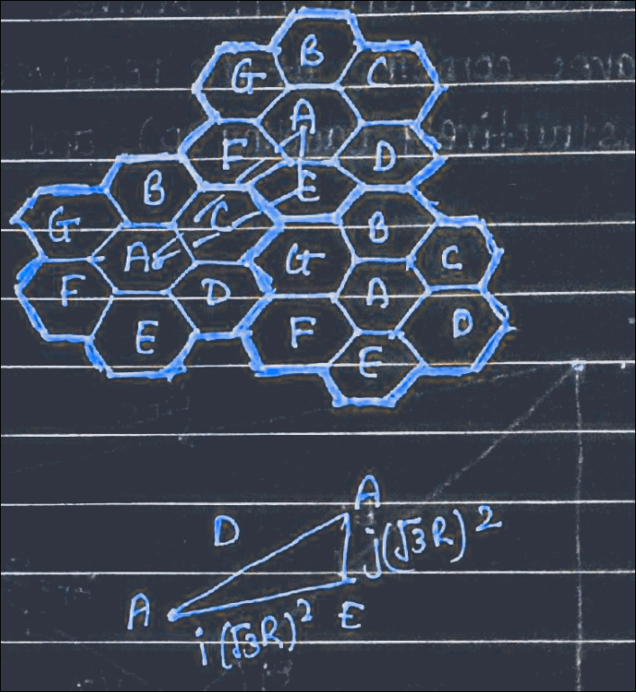
- Here, $D$ = distance between two co-channel cell.
- $R$ = radius of hexagon/cell.
- So, by geometry of cosine law
    $$\begin{align}
        D^2 &= (i\sqrt3 R)^2 + (j\sqrt3 R)^2 - 2(i\sqrt3 R)(j\sqrt3 R) \cos(120^0)\\
        &= 3i^2R^2 + 3j^2R^2 - 2\cdot 3ijR^2 cos(-60)\\
        &= 3R^2(i^2+j^2 + ij)\\
        &= 3NR^2\\
        \therefore D &= \sqrt{3N} R
    \end{align}$$

### Signal-to-Interference Ratio (SIR)
- Let $i_0$ be the number of co-channel interfering cells.
- The SIR for a mobile receiver can be expressed as:
    $$\frac{S}{I} = \frac{S}{\sum_{i=1}^{N_I} I_i}$$
    - where,$S$ = desired signal power
    - $I_i$ = interference power caused by the ith interfering co-channel cell base station
    - $N_I$ = Number of co-channel interfering cells
- Let $D_i$ be the distance between the $i^{th}$ interferer and mobile.
- The received interference $I_i$ is proportional to $(D_i)^{-K}$, where k is the path loss $2 \le K \le 5$
- The desired received signal power $S$ is proportional to $r^{-k}$,
    - where $r$ is the distance between the mobile and serving base station
- Now, when the transmitted power from all base stations are equal and the path loss is same through out the geographical coverage area, the co-channel interference ratio is given by.
    $$\frac{S}{I} = \frac{r}{\sum_{i=0}^{N_I} (D_i)^{-k}}$$
- When the mobile located at the cell boundary, the worst case co-channel interference occurs as the power of the desired signal is minimum.
- With hexagon shaped cellular systems, there are always six co-channel interfering in the first tier.
- If we neglect co-channel interference from second and higher tiers, then $N_I$ = 6
- In such case, $r = R$ and using $D_i = D$ for i = 1, 2, 3 ... $N_I$
- We have
    $$\frac{S}{I} = \frac{(D/R)^k}{N_I} = \frac{q^k}{N_I} = \frac{(\sqrt{3N})^k}{N_I}$$
- Then the frequency reuse ratio can be expressed as
    $$q = \left( N_I \times \frac{S}{I} \right)^{1/k} = \left( 6 \times \frac{S}{I} \right)^{1/k}$$

#### Worst Case
- For hexagonal geometry with 7-cell cluster, with the mobile unit at the cell boundary, the SIR for worst case can be approximated as
    $$\frac{S}{I} = \frac{R^-4}{2(D-R)^{-4} + (D-R/2)^-4 + (D+R/2)^{-4} + (D+R)^{-4} + D^{-4}}$$
    - Figure for the formula
    - 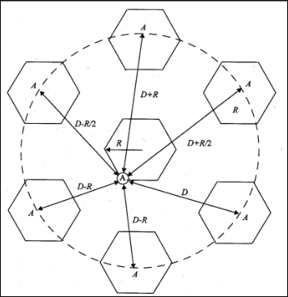

## Adjacent Channel Interference (ACI)

- Interference from adjacent in frequency to the desired signal.
- imperfect receiver filters allow nearby frequencies to leak into the passband
    - 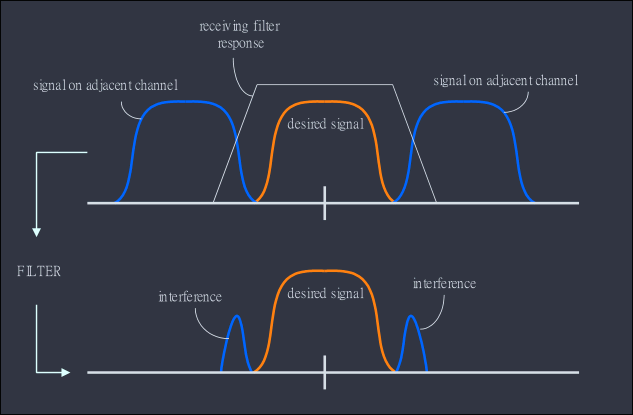
- This can be avoided by:
    1. Suitable channel allocation scheme
        - a cell should not be assigned channels which are adjacent in frequency, rather keeping frequency separation as large as possible
    2. Careful filtering
        - design of a carefully built band pass filter at the receiver end, by using proper modulation schemes, that have low out band radiation
    3. Separate Multiplexing
        - uplink and downlink channels might use multiplexing technique in order to avoid interference.

### Near-Far Problem
- Figure demonstrating the issue:
    - 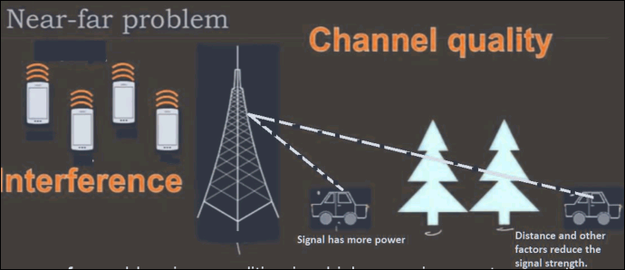
- The near-far problem is a condition in which a receiver captures a strong signal and thereby makes it impossible for the receiver to detect a weaker signal.
- This problem can be avoided by using power control mechanism, in which the nearer MS will transmit low power signal so that the base station can still acknowledge MS in far distance.
- Power control for reducing interference
    - Ensure each mobile transmits the smallest power necessary to maintain a good quality link on the reverse channel.
    - long battery life
    - increase SIR
    - solve the near-far problem

# Trunking

- In cellular systems, a relatively small number of radio channels are used to serve a large population of mobile users, which is made possible by cellular design (i.e. frequency reuse) and by trunking.
- Trunking allows the mobile users share the radio channels in each cell on a demand basis.
- A trunk is a communication line or link designed to carry multiple signals simultaneously to provide network access between two points.
- Trunks typically connect switching center in a communications systems
- Based on the traffic load, the number of radio channels in each cell should be determined in such a way that
    - All the channels are utilized efficiently
    - Call blocking rate is below a pre-determined threshold.
- The measure of traffic efficiency:
    - 1 Erlang is defined as the amount of traffic intensity carried by a channel that is completely occupied
    - e.g, a radio channel that is occupied for 30 minutes during an hour carries 0.5 erlangs of traffic per hour.

## Types of Trunked Systems

- If no channels are available
    - the requesting user is blocked without access,
        - the call request is cleared and the user is free to try again later
        - i.e. blocked calls cleared
    - the call request is delayed until a channel becomes available
        - blocked calls delayed

# Grade of Service (GoS)

- it is a measure of the ability of a user to access a trunked system during the busiest hour.
- GoS is typically given as
    - the likelihood that is blocked (for Erlang B systems) or
    - the likelihood that a call experiences a delay larger than a certain pre-determined system queueing delay (for Erlang C systems)
- Basic Definitions
    - Blocked call (Lost Call):
        - Call which cannot be completed at the time of request, due to congestion
    - Average holding time (H):
        - Average duration of a typical call
    - Traffic Intensity (A):
        - Measure of channel time utilization, which is the average channel occupancy measured in Erlang
    - Load:
        - Traffic intensity across the entire trunked radio system, measured in Erlangs.
    - Request Rate ($\lambda$):
        - the average number of call requests per unit time per user.

# Improving Capacity in Cellular Systems

- Methods for improving capacity in cellular systems
    1. Cell Splitting:
        - subdividing a congested cell into smaller cells
    2. Sectoring:
        - directional antennas to control and the interference and frequency reuse
    3. Coverage zone:
        - distributing the coverage of a cell and extends the cell boundary to hard-to-reach place.

## Cell Splitting

- Split congested cell into smaller cells.
    - preserve frequency reuse plan.
    - Reduce transmission power.
    - working diagram
        - 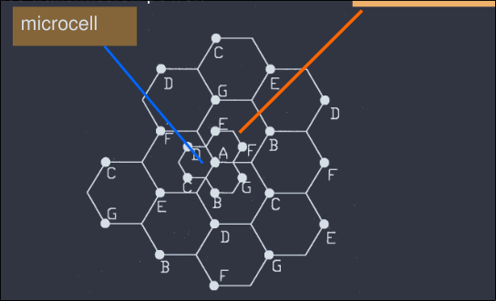
- transmission power reduction from $P_{t1}$ to $P_{t2}$
- examining the receiving power at the new and old cell boundary
    - $P_r$, at old cell boundary $\propto P_{t1} R^{-n}$
    - $P_r$, at new cell boundary $\propto P_{t2} (R/2)^{-n}$
- If we take n = 4, and set the received power equal to each other,
    $P_{t2} = \dfrac{P_{t1}}{16}$
- The transmit power must be reduced by 12dB in order to fill in the original coverage area.
- Problem:
    - if only part of the cells are splitted
    - different cell sizes exist simultaneously
- Handoff issues
    - high speed and low speed traffic can be simultaneously accommodated
- Require additional installation of towers and antennas
- Lower spectral efficiency

## Sectoring

- Decrease the co-channel interference and keep the cell radius R unchanged.
- Replacing single omni-directional antenna by several directional antennas
- radiating within a specified sector
- Figure
    - 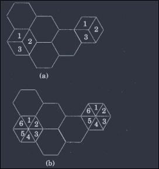
- Example
    - 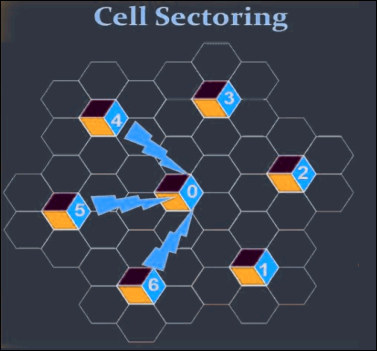
    - Sector 0 interference from sector 4, 5 and 6 only.
        - as the antenna in 4, 5, 6 radiate toward 0's direction
    - However, for sector 3, 2 and 1's antenna
        - they radiate in opposite direction from 0
    - Hence for typical hexagon geometry the co-channel interference reduces from 6 cells to 3 cells.
    - Since the number of interference is reduced the better S/I is guaranteed.

## Microcell Zone Concept

- Antennas are placed at the outer edges of the cell
- Any channel may be assigned to any zone by the base station
- Mobile is served by the zone with the strongest signal.
    - The problem of sectoring can be avoided by microcell zone concept
    - A cell is conceptually divided into microcell or zones
    - Each microcell (zone) is connected to the same base stations (Fiber/Microwave)
- Figure
    - 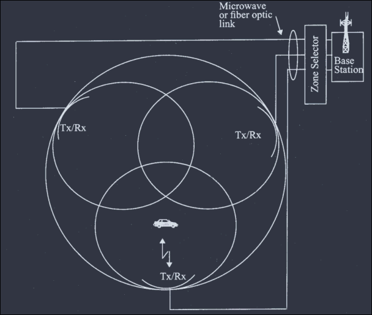
    - Each zone uses a directional antenna
    - Each zone radiates power into the cell
    - MS is served by the strongest zone
    - as mobile travels from one zone to another, it retains the same channel, i.e. no handoff
    - the BS simply switch the channel to the next zone site.

---

# Additional Info (Numericals)

- Number of calls/hour and S/I (dB) computation given total channels, control channels, holding time, blocking probability, and frequency reuse factor.
- Market penetration computation given population, number of cells, channels/cell, blocking probability, call rate and holding time (Erlang B table lookup).
- Optimal N for omni-directional, 120°, and 60° sectoring given SIR requirement and path loss exponent.
- Minimum co-channel distance and cell area-based calculations for 7-cell reuse patterns.
- GoS-based channel/user capacity calculations (blocked-calls-cleared and blocked-calls-delayed systems).
