# ⁠A. Exam Frequency Table (2070–2082 BS, 22 papers)

| Topic | Typical Marks | Frequency |
|---|---|---|
| QPSK transmission & detection (+constellation diagram) | 6–8 | Very High |
| MSK & GMSK modulation techniques (theory + block diagrams) | 2–8 | Very High |
| OFDM operation with block diagram (Tx/Rx) | 4–8 | High |
| OQPSK transmitter/receiver + why π/4-QPSK preferred over OQPSK | 5–7 | Moderate–High |
| DPSK modulation: transmitter/receiver + PN sequence purpose | 4–8 | Moderate–High |
| Advantages of digital modulation over analog (paired with GMSK) | 2 | Moderate |
| BPSK vs QPSK comparison | 5 | Moderate |
| Compare OQPSK, MSK, GMSK (bandwidth/power efficiency, GSM suitability) | 3–8 | Moderate |
| Why M-ary QAM is needed; 16-QAM vs 16-PSK comparison | 2–8 | Moderate |
| DSSS / FHSS block diagrams and operation | 4–8 | High |
| Advantages / disadvantages of spread spectrum | 2–4 | Moderate |

**Reading tip:** QPSK (transmission + detection + constellation) is nearly every year. MSK/GMSK theory and OFDM block diagrams are the next tier; DPSK and OQPSK/$\pi$-4-QPSK usually appear paired together in one long question, so prepare them as a set.

---

# ⁠B. Modulation: Overview

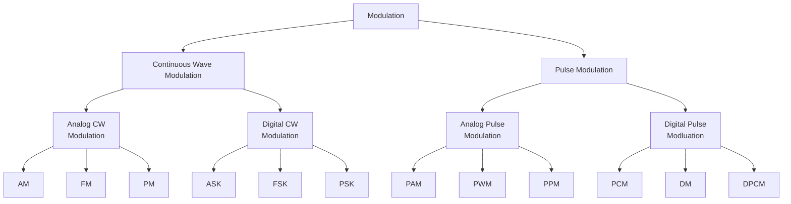

- In baseband digital systems, information-bearing signals are transmitted without any change in the spectral components of the signal.
- Since baseband signal power is localized at low frequencies, it would require an impractically large antenna to radiate the low-frequency spectrum efficiently.
- Hence, for wireless communications, the signal spectrum must be shifted to a higher frequency range by employing modulation techniques.
- In digital communication, the message (modulating) signal consists of digital data.
- If we change the amplitude, frequency, or phase of a high-frequency sinusoidal carrier according to the modulating signal, the modulation is called **ASK, FSK, or PSK** respectively.

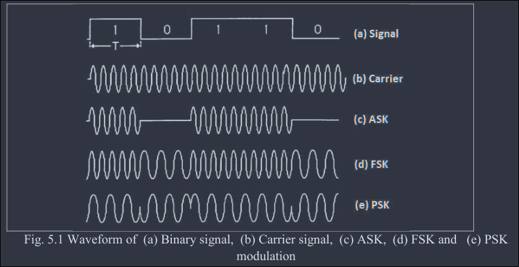

- In M-ary signaling, the modulator produces one of an available set of $M$ (equal to $2^n$) distinct signals in response to $n$ bits of source data at a time.
- Binary modulation is a special case of M-ary modulation with $M = 2$.
- At the receiver, demodulation can be performed by either coherent or non-coherent detection methods, as in analog modulation.

## ⁠B.1. Advantages of Digital Modulation over Analog Modulation

*(Frequently asked directly, usually paired with GMSK transmission/detection)*

- Greater noise immunity and robustness to channel impairments (regenerative repeaters can restore a clean digital signal, unlike analog signals which accumulate noise).
- Enables the use of error detection and correction coding, improving reliability.
- Supports encryption and secure transmission of data.
- Easier to multiplex different types of information (voice, video, data) using common digital hardware (e.g. TDM).
- More efficient use of available bandwidth/spectrum (e.g. through compression, coding, and spectrally-efficient schemes like GMSK, QAM).
- Digital hardware implementation is cheaper, more flexible (software-defined), and more reliable than analog circuitry.
- Better suited to modern network architectures (IP-based, packet-switched systems).

## ⁠B.2. Geometric Representation and Constellation Diagram of Digital Modulation

- Digital modulation involves choosing a particular analog signal waveform $s(t)$ from a finite set $S$ of possible signal waveforms based on the information bits applied to the modulator.
- For example, in binary modulation schemes, binary information is directly mapped to a signal, and set $S$ contains only 2 signals, representing 0 and 1.
- Similarly, for an M-ary scheme, set $S$ contains more than two signals, each representing more than a single bit of information.
- Any element of set $S$ (i.e. $s(t) = \{s_1(t), s_2(t), \dots, s_M(t)\}$) can be represented as a point in a vector space whose coordinates are basis signals $\phi_1(t), \phi_2(t), \dots, \phi_N(t)$ such that the functions $\phi(t)$ are orthogonal over the interval $T$:
    $$\int_T \phi_i(t)\phi_j(t) = \begin{cases} 1\  \text{ if } i = j \\ 0\ \text{ if } i \ne j\end{cases}$$
- Now, $s_i(t)$ can be represented as a linear combination of the basis signals:
    $$s_i(t)=\sum_{j=1}^{N} s_{ij}\ \phi_j(t)$$
    for $0 \le t \le T$ and $i = 1, 2, \dots, M$

### ⁠B.2.a. Example (BPSK)

$$s_{BPSK}(t) = \begin{cases}
\sqrt{\dfrac{2E_b}{T_b}} \cos(2\pi f_c t);\ \text{ symbol 1}\\
-\sqrt{\dfrac{2E_b}{T_b}} \cos(2\pi f_c t);\ \text{ symbol 0}
\end{cases}$$
Where, $E_b$ is energy per bit and $T_b$ is bit period.

For this signal set, there is a single basis signal:
$$\phi_1(t) = \pm \sqrt{\dfrac{2}{T_b}} \cos(2\pi f_c t)$$
$$s_{BPSK} = \left\{\left[ \sqrt{E_b} \phi_1(t) \right], \left[ - \sqrt{E_b} \phi_1(t)  \right]\right\} $$

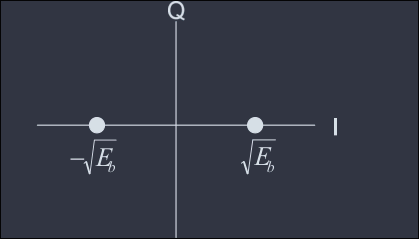

- A **constellation diagram** is a graphical representation of the complex envelope of each possible signal.
- The x-axis represents the in-phase component and the y-axis represents the quadrature component of the complex envelope.
- The distance between signals $d$ on a constellation diagram relates to how well different modulation waveforms can be differentiated by the receiver from random noise present.

---

# ⁠C. Digital Linear Modulation: ASK, BPSK, DPSK, QPSKs

## ⁠C.1. Amplitude Shift Keying (ASK)

- In ASK, binary symbol '1' is represented by transmitting a sinusoidal carrier wave of fixed amplitude $A$ and fixed frequency $f_c$ for a bit duration of $T_b$ seconds.
- Binary symbol '0' is represented by switching off the carrier for $T_b$ seconds.
- This signal can be generated by simply turning the carrier ON and OFF for the prescribed period
    - hence it is also called **On-Off Keying (OOK)**.

- Let the sinusoidal carrier be represented by:
    $$s_c (t) = A \cos(2\pi f_c t)$$
- The ASK signal can be represented by:
    $$s(t) = \begin{cases}
    A \cos(2\pi f_c t);&\ \text{ symbol 1}\\
    0;&\ \text{ symbol 0}
    \end{cases}$$
- In more general form:
    $$s(t) = x(t)\cdot A\cos(2\pi f_c t)\hspace{1cm} 0 \le t \le T_b$$
    where $x(t)$ is '1' or '0'.
- The signal has power $P = \dfrac{A^2}{2}$, so $A = \sqrt{2P}$, and:
    $$\begin{align}
    s(t) = &\sqrt{2P} \cos(2\pi f_c t) \\
    = &\sqrt{PT_s} \sqrt{\dfrac{2}{T_b}} \cos(2\pi f_c t) \\
    = &\sqrt{E_b} \sqrt{\dfrac{2}{T_b}} \cos(2\pi f_c t) \\
    \end{align}$$
    where $E_b = PT_b$ is the energy contained in a bit duration.

### ⁠C.1.a. Signal Space Diagram of ASK

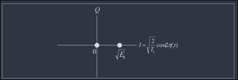

### ⁠C.1.b. Generation of ASK Signal

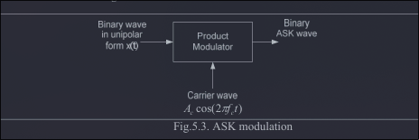

- ASK signal can be generated by applying the incoming binary data (unipolar format) and the sinusoidal carrier to the two inputs of a product modulator (balanced modulator).
- ASK signal allows the carrier signal for input message bit '1' and stops the carrier signal for message bit '0'.

### ⁠C.1.c. Detection of ASK

#### ⁠C.1.c.I. Coherent Detection

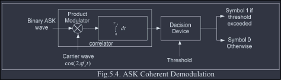

- ASK signals can be detected coherently or non-coherently.
- In coherent detection, exact replicas (carrier waves) of the possible arriving signals are available at the receiver.
- The received signal is cross-correlated with each of the replicas, and a decision is made based on comparison with preselected thresholds.
- Cross-correlation of the incoming ASK signal and a locally generated unmodulated carrier is estimated with the help of a product modulator and integrator block.
- The output of the integrator is applied to a decision-making device that compares the output with a preset threshold.
- The decision favors symbol '1' if the threshold is exceeded, and symbol '0' otherwise.
- This method assumes the local carrier is in perfect synchronization with the carrier used in the transmitter (same frequency and phase).

#### ⁠C.1.c.II. Non-Coherent Detection

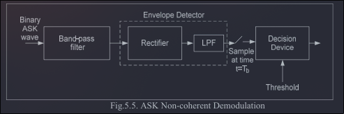

- In non-coherent detection, prior knowledge of the phase and frequency is not required.
- ASK can be demodulated using a simple envelope detector.
- If an envelope is detected, it means bit '1' has been transmitted; no envelope means bit '0'.

## ⁠C.2. Phase Shift Keying (PSK)

- PSK is more efficient than ASK and is used for high bit-rate data transmission.
- In binary PSK, a sinusoidal carrier wave of fixed amplitude and fixed frequency $f_c$ represents both symbols '1' and '0', except the carrier phase of each symbol differs by $180^0$ (i.e. $\pi$ radians).
- Let the unmodulated carrier be represented by $s_c(t) = A \cos(2\pi f_c t)$. Then the PSK signal:
    $$
    s(t) = \begin{cases}
    A \cos(2\pi f_c t); &\ \text{ symbol 1}\\
    A \cos(2\pi f_c t + \pi); &\ \text{ symbol 0}
    \end{cases}
    $$
- The signal has power $P = \dfrac{A^2}{2}$, so $A = \sqrt{2P}$.
- Simplest definition of PSK:
    $$s(t) = b(t) \sqrt{\dfrac{2E_b}{T_b}} \cos(2\pi f_c t)$$
    where $b(t)$ is +1 for symbol '1' and −1 for symbol '0'.

### ⁠C.2.a. Signal Space Diagram of PSK

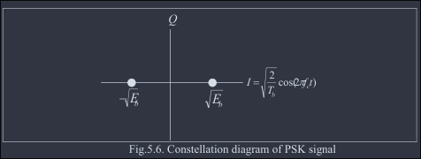

### ⁠C.2.b. Generation of PSK Signal

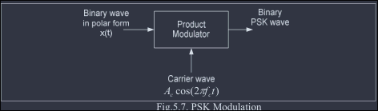

- PSK signal may be generated by applying the carrier signal to a product or balanced modulator.
- The binary data signal (0s and 1s) is converted into polar form.
- PSK can be generated using the same scheme as ASK generation; the only difference is that the incoming binary data should be in polar form.
- The bandwidth requirement of ASK and PSK is the same, but the most significant difference is that ASK is a **linear** modulation while PSK is a **non-linear** modulation scheme.

### ⁠C.2.c. Detection of PSK

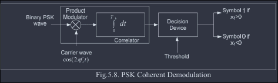

- The same coherent detector as in ASK can be used to detect BPSK, with the only difference being the threshold level.
- In ASK, the threshold is set to $d/2$; in BPSK, the threshold is 0.
- Non-coherent demodulation is **not possible** for PSK, since envelope detection would produce the same output level for both symbols.
- However, there is a pseudo-PSK technique known as **DPSK (Differential PSK)** which can be viewed as the non-coherent form of PSK (see §4.1.3 below).

## ⁠C.3. Differential Phase Shift Keying (DPSK)

*(Frequently asked directly, paired with the purpose of PN sequences, 4+2 marks)*

- DPSK is a non-coherent form of phase shift keying which avoids the need for a coherent reference signal at the receiver.
- Non-coherent receivers are easy and cheap to build, and hence are widely used in wireless communications.
- In DPSK systems, the input binary sequence is first **differentially encoded** and then modulated using a BPSK modulator.
- The differentially encoded sequence $\{d_k\}$ is generated from the input binary sequence $\{m_k\}$ by complementing the modulo-2 sum of $m_k$ and $d_{k-1}$.
- The effect is to leave the symbol $d_k$ unchanged from the previous symbol if the incoming symbol $m_k$ is 1, and to toggle $d_k$ if $m_k$ is 0.
- Relation: $d_k = m_k \oplus d_{k-1}$
- Example: for $m_k$ = `1, 0, 0, 1, 0, 1, 1, 0`, we have $d_{k-1}$ = `1, 1, 0, 1, 1, 0, 0, 0` and $d_k$ = `1, 1, 0, 1, 1, 0, 0, 0, 1`.

### ⁠C.3.a. Block Diagram

#### ⁠C.3.a.I. Transmitter

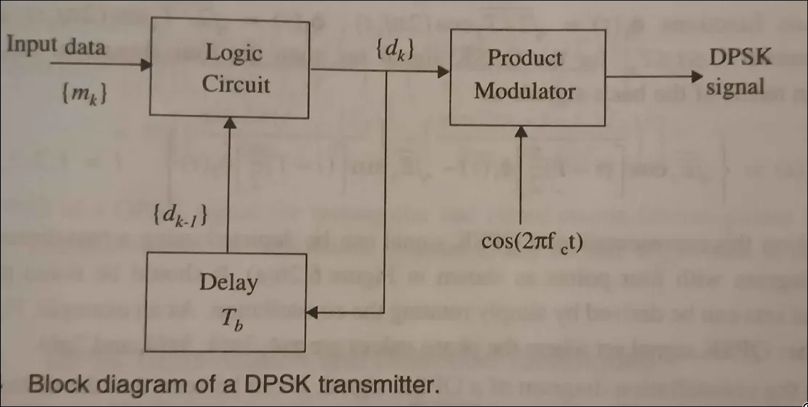

- Consists of a one-bit delay element and a logic circuit interconnected to generate the differentially encoded sequence from the input binary sequence.
- This output is passed through a product modulator to obtain the DPSK signal.

#### ⁠C.3.a.II. Receiver

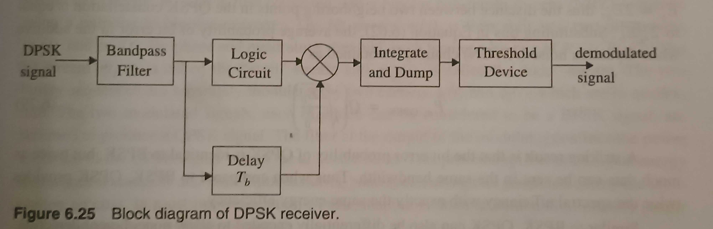

- At the receiver, the original sequence is recovered from the demodulated differentially encoded signal through a complementary process.

### ⁠C.3.b. Performance

- While DPSK signaling has the advantage of reduced receiver complexity, its energy efficiency is inferior to coherent PSK by about 3 dB.
- The average probability of error for DPSK in additive white Gaussian noise is given by:
    $$P_{e, DPSK} = \frac12 \exp\left( -\frac{E_b}{N_0}\right )$$

### ⁠C.3.c. Note on PN Sequences (Context for the Paired PYQ)

- PYQs frequently bundle "DPSK transmitter/receiver" with "pseudo-noise (PN) sequence and why it is used" in the same question, these are two separate concepts asked together, not a single combined mechanism.
- DPSK itself does not use a PN sequence, it uses differential encoding of the data bits.
- PN sequences are used separately in **spread spectrum systems** (see §4.4) to spread the signal bandwidth for security, jamming resistance, and multiple access, refer to §4.4 for the full explanation of PN sequences and their properties.

## ⁠C.4. Frequency Shift Keying (FSK)

- In FSK, two sinusoidal carrier waves of the same amplitude $A$ but different frequencies $f_{c_1}$ and $f_{c_2}$ represent binary symbols '1' and '0' respectively.
- The FSK wave:
    $$
    s(t) = \begin{cases}
    A \cos(2\pi f_{c_1} t);&\ \text{ symbol 1}\\
    A \cos(2\pi f_{c_2} t);&\ \text{ symbol 0}
    \end{cases}
    $$
- Generally represented by:
    $$
    s_i(t) = \begin{cases}
    \sqrt{\dfrac{2E_b}{T_b}} \cos(2\pi f_{c_i} t);&\ 0 \le t \le T_b\\
    0; &\ \text{elsewhere}
    \end{cases}
    $$
    where $i = 1, 2$ and $E_b$ is the transmitted signal energy per bit.
- The transmitted frequency is computed as:
    $$f_c = \frac{n_c + i}{T_b}$$
    for some fixed integer $n_c$.
- FSK has a signal space that is 2-dimensional with 2 message points.

### ⁠C.4.a. Generation of FSK

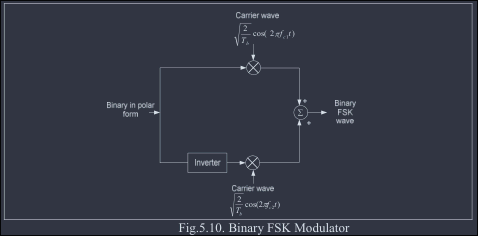

- The binary sequence is represented in polar form: symbol '1' as constant amplitude $\sqrt{E_b}$ volts, symbol '0' as zero volts.
- When symbol '1' is at the input, the oscillator with frequency $f_{c_1}$ (upper channel) is switched on while the oscillator with $f_{c_2}$ (lower channel) is switched off, transmitting $f_{c_1}$.
- Similarly, when symbol '0' is at the input, the upper oscillator is switched off and the lower one is switched on, transmitting $f_{c_2}$.
- As with analog FM, the bandwidth requirement of FSK is higher than that of ASK and PSK.

### ⁠C.4.b. Detection of FSK

#### ⁠C.4.b.I. Coherent Detection

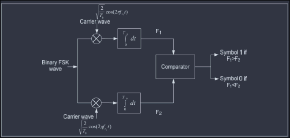

- Consists of two correlators with a common binary FSK signal input.
- They are correlated with locally generated coherent reference signals $\sqrt{\dfrac{2}{T_b}} \cos(2\pi f_{c_1} t)$ and $\sqrt{\dfrac{2}{T_b}} \cos(2\pi f_{c_2} t)$.
- The decision device compares output $F_1$ (upper channel) and $F_2$ (lower channel): if $F_1 > F_2$, decide symbol '1'; if $F_2 > F_1$, decide symbol '0'.

#### ⁠C.4.b.II. Non-Coherent Detection

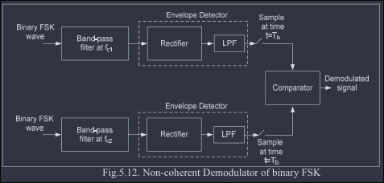

- The received FSK signal is applied to 2 bandpass filters: the upper filter tuned to $f_{c_1}$, the lower to $f_{c_2}$.
- Each filter is followed by an envelope detector.
- The outputs of the two envelope detectors are sampled at clock duration and compared with each other, using the same logic as coherent detection.

## ⁠C.5. M-ary Signaling: Preview

- In an M-ary signaling scheme, one of $M$ possible signals is sent during each signaling interval of duration $T$ seconds.
- $M = 2^n$ where $n$ is an integer. Symbol duration is $nT_s$, where $T_s$ is the bit duration.
- These signals are generated by changing the amplitude, phase, or frequency of a carrier in $M$ discrete steps.

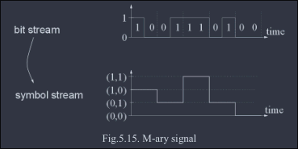

- The equivalent data rate for M-ary signaling is $\log_2(M)$ times faster than binary signaling.
- The bandwidth requirement in M-ary is the same as in binary, but the power requirement is higher.

*(See §4.3 for the full M-ary Modulation treatment: MPSK, MFSK, QAM.)*

## ⁠C.6. Quadrature Phase Shift Keying (QPSK)

*(The single most repeated topic in this chapter, nearly every year, often with a constellation diagram +Fig)*

- All the modulation techniques discussed above are not very efficient in bandwidth. QPSK is one of two efficient modulation schemes for transmission of binary data (the other being OQPSK/π-4-QPSK, discussed next), both examples of quadrature carrier multiplexing systems:
    $$
    s(t) = s_I(t) \cos(2\pi f_c t) - s_Q(t) \sin(2\pi f_c t)
    $$
    where $s_I$ is the in-phase component and $s_Q$ is the quadrature-phase component of the modulated wave.
- QPSK is an example of M-ary PSK with $M = 4$.
- In PSK, the basic idea is to transmit information in the phase change of the carrier. In QPSK, the phase takes on one of four equally spaced values such as $\pi/4, 3\pi/4, 5\pi/4, 7\pi/4$:
    $$s_i(t) = \sqrt{\dfrac{2E}{T}} \cos(2\pi f_c t + \phi_i (t))$$
    where phase $\phi_i(t) = (2i - 1) \pi/4$ for $i = 1$ to $4$.
- Expanding:
    $$\sqrt{\frac{2E}{T}}\left[\cos \left(\phi _{i}\left(t\right)\right)\ \cos \left(2\pi f_{c}t\right)-\sin \left(\phi _{i}\left(t\right)\right)\sin \left(2\pi f_{c}t\right)\right]$$
    Here, the cosine component is in-phase and the sine component is quadrature-phase.
- Each possible value of phase corresponds to a unique pair of two bits called **dibits**. The codes below are gray codes: 10, 00, 01, 11.

| Input dibit | Phase of QPSK | Coordinates: $s_{i1}$ | Coordinates: $s_{i2}$ |
| :--- | :--- | :---: | :---: |
| 10 | $\pi/4$  | + $\sqrt{E/2}$ | − $\sqrt{E/2}$ |
| 00 | $3\pi/4$ | − $\sqrt{E/2}$ | − $\sqrt{E/2}$ |
| 01 | $5\pi/4$ | − $\sqrt{E/2}$ | + $\sqrt{E/2}$ |
| 11 | $7\pi/4$ | + $\sqrt{E/2}$ | + $\sqrt{E/2}$ |

### ⁠C.6.a. Constellation Diagram

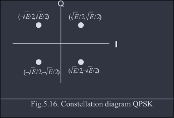

- A QPSK signal is characterized by having a 2D signal constellation and four message points.

### ⁠C.6.b. QPSK Modulator

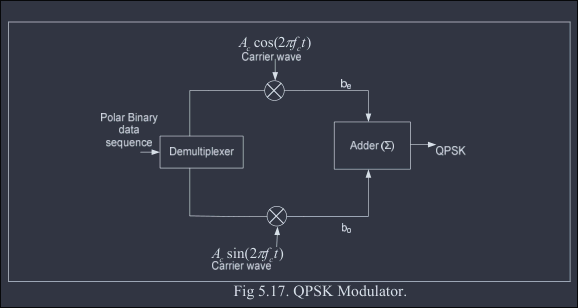

- The input binary sequence to the QPSK modulator is represented in polar form.
- This binary sequence is divided into odd and even numbered bits using a demultiplexer.
- Even-numbered bits (in-phase component) are multiplied by $\cos(2\pi f_c t)$ (or $A_c\cos(2\pi f_c t)$); odd-numbered bits (quadrature component) are multiplied by $\sin(2\pi f_c t)$ (or $A_c\sin(2\pi f_c t)$).
- These two streams are added to produce the QPSK signal.
- The symbol duration $T$ of a QPSK wave is **twice as long** as the bit duration $T_b$ of the input binary wave.
- For a given bit rate $1/T_b$, a QPSK wave requires **half the transmission bandwidth**.
- Alternatively, for a given transmission bandwidth, a QPSK wave carries **twice as many bits** of information as the corresponding BPSK wave.

### ⁠C.6.c. QPSK Demodulator

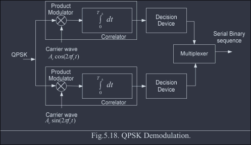

- The QPSK signal can be detected using a pair of correlators (multiplier followed by integrator) in parallel.
- The upper path correlator computes against the cosine of the carrier; the lower path against the sine of the carrier.
- Correlator outputs $x_1$ and $x_2$ are each compared with a threshold of zero volts:
    - If $x_1 > 0$: decide symbol '1' for the in-phase channel output; if $x_1 < 0$: decide symbol '0'.
    - If $x_2 > 0$: decide symbol '1' for the quadrature channel output; if $x_2 < 0$: decide symbol '0'.
- These two binary sequences (in-phase and quadrature channel outputs) are combined in a multiplexer to reproduce the original binary sequence at the transmitter input.

### ⁠C.6.d. BPSK vs QPSK

*(Frequently asked directly: "BPSK against QPSK modulation")*

| Aspect | BPSK | QPSK |
|---|---|---|
| Number of phases used | 2 (0°, 180°) | 4 (45°, 135°, 225°, 315°) |
| Bits per symbol | 1 | 2 (dibits) |
| Symbol duration vs bit duration | $T = T_b$ | $T = 2T_b$ |
| Bandwidth efficiency | Lower (requires full bandwidth for given bit rate) | Higher: requires half the bandwidth of BPSK for the same bit rate, or carries twice the data in the same bandwidth |
| Data rate for given bandwidth | Lower | Twice that of BPSK |
| Implementation complexity | Simpler (single correlator/detector) | More complex (requires I/Q demultiplexing and a pair of correlators) |
| Noise immunity per bit | Slightly better (larger phase separation: 180°) | Slightly more susceptible to phase errors (phase separation: 90°) but still robust enough for practical systems |

## ⁠C.7. Offset QPSK (OQPSK)

*(Frequently asked directly, paired with π/4-QPSK: "OQPSK transmitter & receiver; why π/4-QPSK is preferred over OQPSK")*

- The amplitude of a QPSK signal is ideally constant. However, when QPSK signals are pulse-shaped, they lose the constant-envelope property.
- The occasional phase shift of $\pi$ radians can cause the signal envelope to pass through zero for an instant.
- Any hard-limiting or nonlinear amplification of these zero-crossings regenerates the filtered sidelobes, since the fidelity of the signal at small voltage levels is lost in transmission.
- To prevent sidelobe regeneration and spectral widening, pulse-shaped QPSK signals must be amplified using only **linear amplifiers**, which are less power-efficient.
- **OQPSK (Offset/Staggered QPSK)** is a modified form of QPSK that is less susceptible to these effects and supports more efficient amplification, it ensures fewer baseband signal transitions are applied to the RF amplifier, helping eliminate spectrum regrowth after amplification.
- OQPSK signaling is similar to QPSK:
    $$s_{QPSK}\left(t\right)=\sqrt{\frac{2E_{s}}{T_{s}}}\left[\cos\left(\left(i-1\right)\frac{\pi}{2}\right)\cos\left(2\pi f_{c}t\right)-\sin\left(\frac{\left(i-1\right)\pi}{2}\right)\sin\left(2\pi f_{c}t\right)\right]$$
    except for the time alignment of the even and odd bit streams.
- In QPSK, bit transitions of the even and odd bit streams occur at the **same time instants**. In OQPSK, the even and odd bit streams $m_I(t)$ and $m_Q(t)$ are offset in their relative alignment by **one bit period** (half-symbol period).

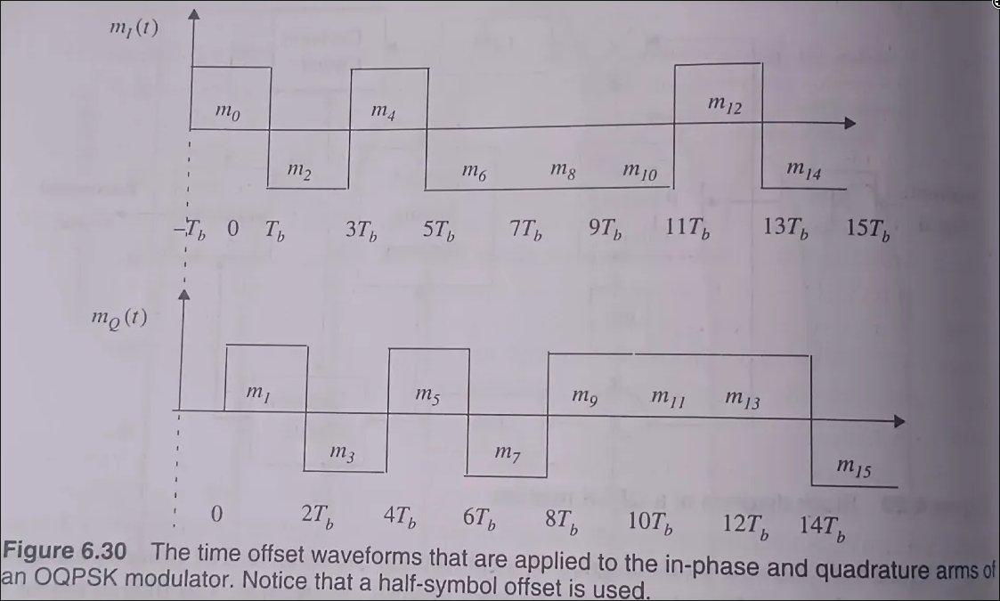

- Due to the time alignment of $m_I(t)$ and $m_Q(t)$ in standard QPSK, phase transitions occur only once every $T_s = 2T_b$s and can be a maximum of $180^0$ if both $m_I(t)$ and $m_Q(t)$ change value.
- In OQPSK, bit (and hence phase) transitions occur every $T_b$s. Since the transition instants of $m_I(t)$ and $m_Q(t)$ are offset, only **one** of the two bit streams can change value at any given time.
- This limits the maximum phase shift at any instant to $\pm 90^0$, by switching phases more frequently (every $T_b$s instead of $2T_b$s), OQPSK eliminates $180^0$ phase transitions.
- Since $180^0$ transitions are eliminated, bandlimiting (pulse shaping) of OQPSK signals does not cause the signal envelope to go to zero.
- There is some ISI caused by the bandlimiting process, especially at the $90^0$ transition points, but envelope variations are considerably less, hence hardlimiting or nonlinear amplification of OQPSK does not regenerate high-frequency sidelobes as much as QPSK.
- Spectral occupancy is significantly reduced while permitting more efficient RF amplification.
- The spectrum of an OQPSK signal is **identical** to that of a QPSK signal, both occupy the same bandwidth; the staggered alignment does not change the nature of the spectrum.
- OQPSK retains its bandlimited nature even after nonlinear amplification, making it attractive for mobile communication systems where bandwidth efficiency and efficient nonlinear amplifiers are critical for low power drain.
- OQPSK also performs better than QPSK in the presence of phase jitter due to noisy reference signals at the receiver.

## ⁠C.8. π/4-Shifted QPSK

- π/4-QPSK is a quadrature phase shift keying technique offering a compromise between OQPSK and QPSK in terms of allowed maximum phase transitions.
- It may be demodulated coherently or non-coherently.
- Maximum phase change is limited to $\pm 135^0$ (compared to $180^0$ for QPSK and $90^0$ for OQPSK).
- The bandlimited π/4-QPSK signal preserves the constant-envelope property better than bandlimited QPSK, but is more susceptible to envelope variations than OQPSK.
- An extremely attractive feature: it can be **non-coherently detected**, greatly simplifying receiver design.
- In the presence of multipath spread and fading, π/4-QPSK performs **better** than OQPSK.
- π/4-QPSK signals are often differentially encoded to facilitate easier implementation of differential detection or coherent demodulation with phase ambiguity in the recovered carrier.
- In a π/4-QPSK modulator, signaling points are selected from **two QPSK constellations** shifted by $\pi/4$ with respect to each other.

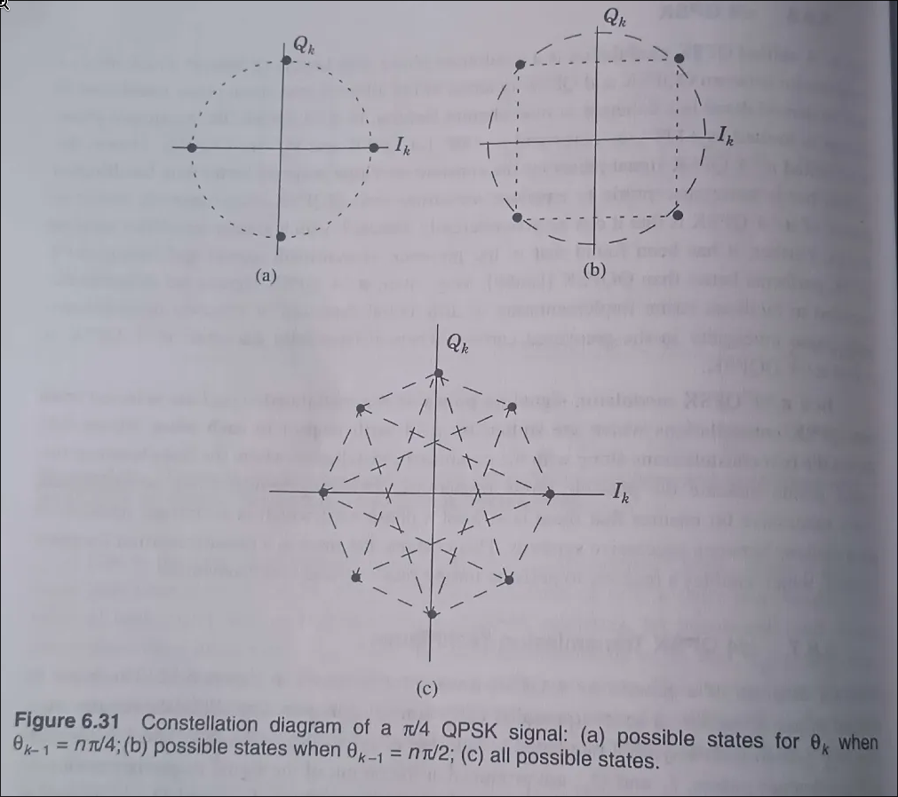

- Switching between the two constellations every successive bit ensures there is at least a phase shift that is an integer multiple of $\pi/4$ radians between successive symbols.
- This ensures a phase transition for every symbol, enabling the receiver to perform timing recovery and synchronization.

### ⁠C.8.a. Why π/4-QPSK is Preferred over OQPSK

*(Direct answer to the paired PYQ)*

- π/4-QPSK can be **non-coherently detected** (via differential encoding), which greatly simplifies receiver design; OQPSK generally requires coherent detection.
- π/4-QPSK performs **better than OQPSK in the presence of multipath spread and fading**, an important advantage for mobile radio channels.
- π/4-QPSK still guarantees a phase transition at every symbol (aiding timing recovery/synchronization), whereas OQPSK can have symbols with no transition.
- Trade-off: π/4-QPSK allows a larger maximum phase transition ($\pm135°$) than OQPSK ($\pm90°$), so its envelope variation is somewhat larger than OQPSK's, but this is an acceptable cost given the receiver-simplicity and fading-performance benefits.

---

# ⁠D. Constant Envelope Modulation: MSK, GMSK

## ⁠D.1. Minimum Shift Keying (MSK)

- The bandwidth requirement of QPSK and BPSK is high, as there is a rapid fluctuation when the signal changes.
- This is overcome with MSK, which generates an output waveform that is continuous in phase, avoiding abrupt fluctuations in amplitude.
- MSK replaces the rectangular pulse in amplitude with a half-cycle sinusoidal pulse. The MSK signal is defined as:
    $$S(t) = d(t) \cos(\pi t/2T)\cos(2\pi f t) + d(t) \sin(\pi t/2T) \sin(2\pi f t)$$

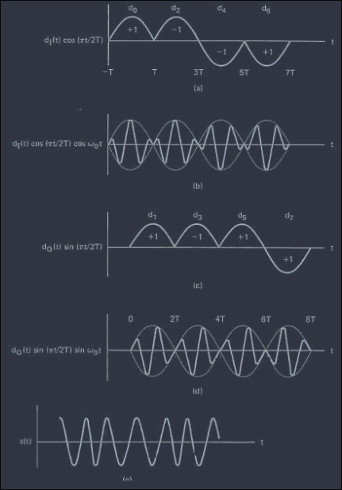

- MSK modulation makes the phase change linear and limited to $\pm \frac{\pi}{2}$ over a bit interval $T$, a significant improvement over QPSK.
- Because of this linear phase change, the power spectral density has low side lobes that help control adjacent channel interference. However, the main lobe becomes wider than QPSK's.

### ⁠D.1.a. Need for MSK

- Phase is continuous and smooth.
- Band-pass filters are not required, because MSK has smaller side lobes and a thinner main lobe, whereas QPSK has a thicker main lobe.

### ⁠D.1.b. Important Points of MSK

- MSK is known to be a special type of continuous-phase FSK (and can also be viewed as a special form of OQPSK, with sinusoidal (rather than rectangular) pulse shaping).
- Peak frequency deviation is ¼ the bitrate, and the modulation index is kept at 0.5 to make the signal orthogonal.
- Orthogonality makes the signal more uncorrelated, so it is easy to separate at the receiver end.
- MSK provides good envelope properties.
- Good spectral efficiency.
- Good BER performance.
- MSK is also called Fast FSK, i.e., the frequency shift is only half that used in ordinary FSK.

## ⁠D.2. Gaussian Minimum Shift Keying (GMSK)

*(Frequently paired with "advantages of digital modulation over analog", see §4.0)*

- GMSK, as its name implies, is based on MSK and is developed to improve the spectral property of MSK by using a pre-modulation Gaussian filter.
- The transfer function of the pre-modulation low-pass (Gaussian) filter:
    $$
    h(t) = \frac{1}{\sqrt{2\pi B_0^2}} \exp\left(-\frac{t^2}{2B_0^2}\right)
    $$
    where $B_0$ is the 3dB bandwidth.
- Alternative frequency-domain form (as used in the Gaussian LPF applied to the NRZ bit sequence):
    $$ H(f) = e^{-\left(\dfrac{-\log(2f^2)}{2W^2}\right)} $$
    where $W$ is the 3dB bandwidth of the baseband signal.
- The GMSK filter is completely defined by $B$ and baseband symbol duration $T$, therefore, GMSK is defined by its **BT product**.

- The power spectral density of MSK does not fall off fast enough, so it does not fully reduce interference between adjacent channels.
- GMSK is designed with various BT factors, the smaller the BT, the tighter the spectrum, i.e. side-lobe levels fall off very rapidly.
- However, reducing BT increases the error rate produced by the low-pass filter due to ISI.
- **GSM uses BT = 0.3.**

### ⁠D.2.a. GMSK Transmitter

1. Bipolar NRZ Encoder
2. GMSK Signal
3. Gaussian Filter
4. Frequency Modulator
5. Carrier Oscillator: $\cos(\omega t)$

### ⁠D.2.b. GMSK Modulation Using I-Q Modulation

- The Quadrature modulator uses one signal that is in-phase and another that is in quadrature.
- Using this type of modulator, the modulation index can be maintained at exactly 0.5 without the need for any settings or adjustments.

### ⁠D.2.c. GMSK Detector

- GMSK is highly useful in wireless transmission and wireless data communication protocols; two systems using it are Cellular Digital Packet Data (CDPD) and Mobitex (a dedicated data system).
- GMSK signal can be detected using orthogonal coherent detectors or with simple non-coherent detectors such as FM discriminators.

## ⁠D.3. Comparison: OQPSK vs MSK vs GMSK

| Aspect | OQPSK | MSK | GMSK |
|---|---|---|---|
| Envelope | Non-constant (some residual amplitude fluctuation) | Constant envelope (continuous phase) | Constant envelope (continuous phase, smoother than MSK) |
| Bandwidth efficiency | Moderate: same spectral occupancy as QPSK | Better than QPSK/OQPSK: narrower main lobe, low side lobes | Best: Gaussian pre-filtering further suppresses side lobes, tighter spectrum than MSK |
| Power efficiency | Good (allows more efficient amplification than QPSK due to reduced envelope variation) | Very good (constant envelope allows efficient nonlinear/Class-C amplifiers) | Very good (same constant-envelope benefit as MSK, plus tighter spectrum reduces adjacent-channel power leakage) |
| Out-of-band interference | Moderate | Lower than OQPSK/QPSK | Lowest: best adjacent/co-channel interference control |
| ISI | Low | Low | Slightly higher than MSK (due to Gaussian filtering, controlled by BT product) |
| Suitability for GSM | Not used for GSM | Good candidate, but wider main lobe than desired | **Chosen for GSM** (BT = 0.3), best trade-off of spectral efficiency, constant envelope, and acceptable ISI |

**Why GMSK is suitable for GSM:**

- its constant envelope allows the use of efficient, low-cost nonlinear power amplifiers 
    - (important for battery-powered handsets),
- while the Gaussian pre-filtering gives it the tightest spectral occupancy of the three,
- minimizing adjacent-channel interference
    - which is a critical requirement in the tightly-packed 200 kHz GSM channel plan.

---

# ⁠E. M-ary Modulation (MPSK, MFSK, QAM) and OFDM

## ⁠E.1. M-ary Quadrature Amplitude Modulation (QAM)

### ⁠E.1.a. Signal Constellation

- The signal constellation is the physical diagram used to describe all possible symbols used by a signaling system to transmit data, and is an aid in designing better communication systems.
- The distance of a point from the origin represents a measure of the amplitude or power of the signal.

### ⁠E.1.b. QAM (Quadrature Amplitude Modulation)

- A form of digital modulation where digital information is contained in **both** the amplitude and the phase of the modulated signal. Examples: 4-QAM, 16-QAM, 64-QAM.
- The advantage of moving to higher-order formats is that there are more points within the constellation, so it is possible to transmit more bits per symbol.
- The minimum distance between symbols determines the immunity to noise.
- The maximum distance to the origin determines the maximum required signal power.

### ⁠E.1.c. Why Do We Need M-ary QAM?

*(Frequently asked directly: "Why do we need M-ary QAM?")*

- Basic binary/M-ary PSK schemes are limited in how many bits per symbol they can pack without the constellation points becoming too close together (leading to poor noise immunity).
- QAM improves **spectral efficiency** by encoding information in both amplitude and phase simultaneously, rather than phase alone (as in MPSK), allowing more bits per symbol for a given error-rate requirement.
- Since the modulation combines two orthogonal amplitude-modulated carriers (in-phase and quadrature), it makes efficient use of the available bandwidth while packing more data into each transmitted symbol.
- This is essential in modern wireless/broadband systems where high data throughput is needed within a limited spectrum allocation (e.g. used in OFDM subcarriers, cable modems, Wi-Fi, LTE).

### ⁠E.1.d. Comparison between 16-PSK and 16-QAM

| Aspect | 16-PSK | 16-QAM |
|---|---|---|
| Information carried in | Phase only | Both amplitude and phase |
| Bits per symbol | 4 | 4 |
| Bandwidth required | Same (both transmit 4 bits/symbol) | Same |
| Noise immunity | Same as 16-QAM (comparable minimum Euclidean distance) | Same |
| Power requirement | Higher: points are arranged in a single circle, requiring wider angular separation and thus more peak power for the same minimum distance | Lower: with the same minimum Euclidean distance, 16-QAM requires **1.6 dB less peak power** than 16-PSK |
| Amplitude variation | Constant envelope (fixed amplitude, phase-only changes): harder to change amplitude level cheaply | Varying envelope (multiple amplitude levels) |
| Practical implication | Requires more power-hungry/precise phase control amplifiers | More power-efficient for the same performance, but requires linear amplification |

## ⁠E.2. Orthogonal Frequency Division Multiplexing (OFDM)

*(most repeated PYQ topics in this section, a block diagram +Fig question almost every year)*

- OFDM is a multichannel system that employs multiple subcarriers.
- It does **not** use individual bandlimited filters and oscillators for each subchannel.
- The spectra of the subcarriers are overlapped for bandwidth efficiency.
- The multiple orthogonal subcarrier signals, overlapped in spectrum, are produced by generalizing the single-carrier Nyquist criterion:
    $$\sum_{i = -\infty}^{\infty} G\left(f - \frac{i}{T}\right) = T$$
    into a multi-carrier criterion.
- In practice, **FFT and inverse FFT** processes are used to implement these orthogonal signals.

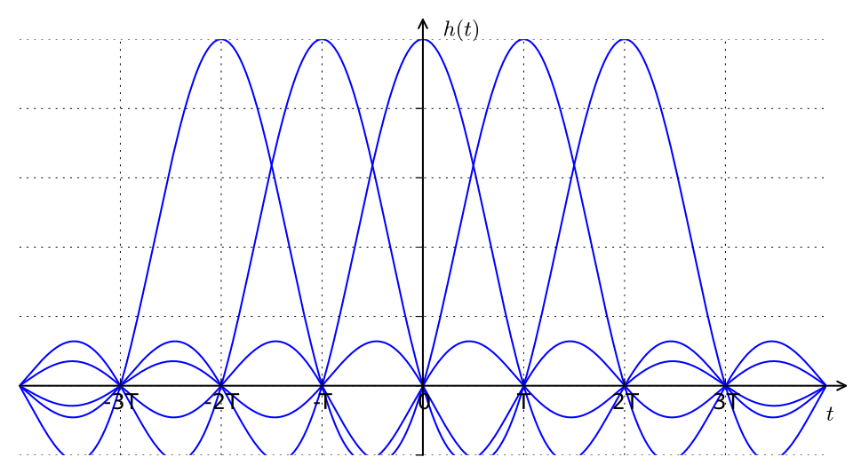

- In the OFDM transmission system, an $N$-point IFFT is taken for the transmitted symbol $\{X_l[k]\}_{k=0}^{N-1}$, generating $\{x[n]\}_{n=0}^{N-1}$, the samples for the sum of $N$ orthogonal subcarrier signals.
- Let $y[n]$ denote the received signal corresponding to $x[n]$ with additive noise $w[n]$: $y[n] = x[n] + w[n]$.
- Taking the $N$-point FFT of the received samples $\{y_l[n]\}_{n=0}^{N-1}$, the noisy version of the transmitted symbols $\{Y_l[k]\}_{k=0}^{N-1}$ is obtained at the receiver.
- Since all subcarriers are of finite duration $T$, the spectrum of the OFDM signal can be viewed as the sum of frequency-shifted sinc functions in the frequency domain, with overlapping neighboring sinc functions spaced by $1/T$.

### ⁠E.2.a. OFDM Transmitter

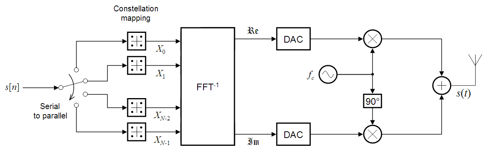

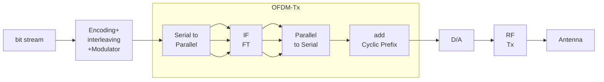

- An OFDM carrier signal is the sum of a number of orthogonal subcarriers, with baseband data on each subcarrier independently modulated, commonly using QAM or PSK.
- This composite baseband signal is typically used to modulate a main RF carrier.
- $s[n]$ is a serial stream of binary digits. By inverse multiplexing, these are first demultiplexed into $n$ parallel streams, each mapped to a possibly complex symbol stream using some modulation constellation (QAM, PSK, etc.).
- The constellations may differ across streams, so some streams may carry a higher bit-rate than others.
- An inverse FFT is computed on the symbols, giving a set of complex time-domain samples.
- These samples are then quadrature-mixed to passband: the real and imaginary components are first converted to the analog domain using DACs, then used to modulate cosine and sine waves at the carrier frequency $f_c$ respectively.
- These signals are summed to give the transmission signal $s(t)$.

### ⁠E.2.b. OFDM Receiver

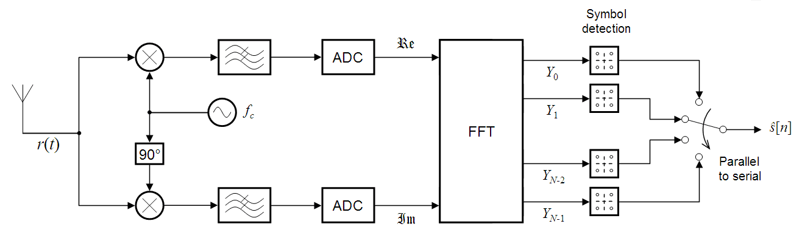

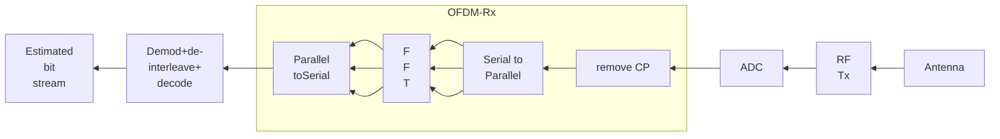

- The receiver picks up the signal $r(t)$, which is quadrature-mixed down to baseband using cosine and sine waves at the carrier frequency.
- This also creates signals centered on $2f_c$, so low-pass filters (LPF) are used to reject these.
- The baseband signals are then sampled and digitized using ADCs, and a forward FFT is used to convert back to the frequency domain.
- This returns $N$ parallel streams, each converted to a binary stream using an appropriate symbol detector.
- These streams are re-recombined into a serial stream, $\hat{s}[n]$, an estimate of the original binary stream at the transmitter.

---

# ⁠F. Spread Spectrum: PN Sequences, DS and FH

## ⁠F.1. Problem Definition

- How to utilize the channel bandwidth efficiently?
- How to minimize the amount of transmitted power?
- Other important problems:
    a. Information has to be secured.
    b. To avoid jamming, the channel should be immune to any external interference.

These problems can be successfully solved by using **spread spectrum modulation** techniques.

## ⁠F.2. Spread Spectrum: Overview

- The spread signal occupies a larger bandwidth than normal signals.
- It uses coding in the transmitter (spreading) and receiver (de-spreading) to obtain the original signal.
- The codeword associated with spread spectrum is independent of the information provided by the signal.
- Most importantly: the spread signal is **pseudorandom in nature**.
- A specifically designed receiver can only demodulate it to recover the original information.
- In SS, we combine signals from different sources to fit into a larger bandwidth: the goals are to prevent eavesdropping (secretly listening to a conversation) and jamming.
- To achieve these goals, spread spectrum techniques add **redundancy**.

Spread spectrum achieves its purpose through two principles:
- The bandwidth allocated to each station needs to be larger than what is needed.
- The spreading process occurs after the signal is created by the source.

## ⁠F.3. Advantages of Spread Spectrum

*(Frequently asked directly, alongside disadvantages)*

- Resistance to jamming and interference (intentional or unintentional).
- Provides a level of security/privacy, since the spreading code is required to demodulate the signal.
- Low probability of interception/detection, since the signal power is spread over a wide bandwidth (appears as noise to an unintended receiver).
- Allows multiple users to share the same bandwidth simultaneously (basis for CDMA).
- Robust against multipath fading, since the wideband signal can resolve individual multipath components (basis for RAKE receivers).
- Good co-existence with narrowband systems occupying the same spectrum, since spread signal power spectral density is very low.

## ⁠F.4. Disadvantages of Spread Spectrum

- Requires a much larger bandwidth than the original signal.
- Increased complexity of transmitter and receiver (synchronization of PN sequences, despreading circuitry).
- Near-far problem: a strong nearby signal can interfere with a weaker distant signal using the same band (requires power control).
- Synchronization of the PN sequence between transmitter and receiver can be challenging and time-consuming.

## ⁠F.5. Pseudo-Noise (PN) Sequences

- This is basically a shift register: a Type-D flip-flop is connected to the Q output of the previous flip-flop.
- The input $D_0$ of the first flip-flop is connected to the output of the parity generator.
- A parity generator generally consists of Ex-OR gates.

### ⁠F.5.a. PN Sequence Properties

*(Frequently the direct answer expected for "PN sequence and why it is used")*

- Pseudo-noise (PN) sequences may be defined as a coded sequence of 1s and 0s with certain auto-correlation properties.
- 1s and 0s occur with equal probability.
- Adding a shifted version to a PN sequence gives the same PN sequence (in a different phase).
- High auto-correlation function and low cross-correlation.
- Easy to generate and synchronize.
- **Why PN sequences are used:**
    - their noise-like (pseudorandom) yet deterministic and reproducible nature
    - allows the transmitter and an authorized receiver (who knows the code)
    - to spread and de-spread the signal, 
    - providing
        - security against eavesdropping,
        - resistance to jamming, and
        - the ability for multiple users to share the same spectrum 
        - (each distinguished by a unique, low-cross-correlation PN code), 
    - this underlies CDMA operation.

## ⁠F.6. Categories of Spread Spectrum

In general, SS modulation techniques can be categorized into:

### ⁠F.6.a. Direct Sequence Spread Spectrum (DSSS)

- In DSSS, we replace each data bit with $n$ bits using a spreading code.
- Each bit is assigned a code of $n$ bits, called **chips**, where the chip rate is $n$ times that of the data bit.
- Block diagram:
    
- Example:
    
- If PSK is used, the PN sequence generated at the modulator is used along with PSK modulation to shift the phase of the PSK signal pseudorandomly. The resulting signal at the modulator output is called **DSSS**.

### ⁠F.6.b. Frequency Hopping Spread Spectrum (FHSS)

- FHSS uses $M$ different carrier frequencies that are modulated by the source signal.
    - At one moment, the signal modulates one carrier frequency; at the next moment, it modulates another.
- Block Diagram:
    
- If binary or M-ary FSK is used, the frequency of the FSK signal is shifted pseudorandomly. The resulting signal at the modulator output is called **FHSS**.

#### ⁠F.6.b.I. FHSS Operation

- The binary data sequence is applied to an M-ary FSK modulator.
- A frequency synthesizer produces the range of frequencies from a single reference frequency.
- The synthesizer output at a given instant of time is the frequency hop.
- Each frequency hop is mixed with the MFSK signal to produce the transmitted signal.
- The data-modulated carrier is then randomly hopped from one frequency to another.
- Because of this, the spectrum of the transmitted signal is spread **sequentially** rather than instantaneously (as in DSSS).

### ⁠F.6.c. Frequency Selection in FHSS

## ⁠F.7. DSSS vs FHSS

*(Useful consolidation for "compare DS and FH spread spectrum" style PYQs)*

| Aspect | DSSS | FHSS |
|---|---|---|
| Spreading method | Multiplies data with a high-rate PN code (chips) | Hops the carrier frequency pseudorandomly across a set of $M$ frequencies |
| Underlying modulation | Typically PSK | Typically (M-ary) FSK |
| Spectrum spreading | Instantaneous: occupies full spread bandwidth at all times | Sequential: occupies only one narrow channel at any instant, hopping over time |
| Synchronization requirement | Chip-level synchronization of PN sequence | Hop-timing and frequency-sequence synchronization |
| Near-far resistance | More susceptible to near-far problem | More robust to near-far problem |
| Typical use case | CDMA cellular systems (e.g. IS-95) | Bluetooth, military anti-jam communications |
